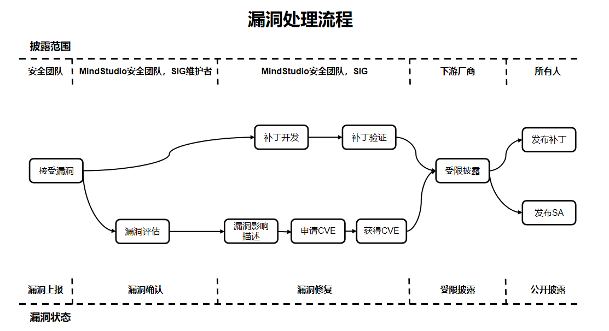

# **MindStudio Vulnerability Mechanism Description**

The MindStudio community places great emphasis on the security of its community versions and has designated vulnerability management specialists to handle vulnerability-related matters. To build a more secure full-process AI toolchain, we also welcome your participation.

## Vulnerability Handling Process

For each security vulnerability, the MindStudio community will assign personnel to track and handle it. The end-to-end process of vulnerability handling is illustrated in the following figure.

The following will focus on explaining the processes for vulnerability reporting, vulnerability assessment, and vulnerability disclosure.

## Vulnerability Reporting

You can contact the MindStudio community team by submitting an issue, and we will immediately arrange for a dedicated security vulnerability specialist to contact you.
Note: To ensure security, please do not describe specific information involving security and privacy in the issue.

### Report Response

1. The MindStudio community will confirm, analyze, and report the security vulnerability issue within 3 working days, and simultaneously initiate the security handling process.
2. After confirming the security vulnerability issue, the MindStudio security team will distribute and follow up on it.
3. During the process of classifying, determining, fixing, and releasing the security vulnerability issue, we will update the report in a timely manner.

## Vulnerability Assessment

The industry widely uses the CVSS standard to assess the severity of vulnerabilities. When using CVSS v3.1 for vulnerability assessment, MindStudio needs to set the vulnerability attack scenario and evaluate based on the actual impact under that attack scenario. Severity level assessment refers to evaluating the ease of vulnerability exploitation and the impact on confidentiality, integrity, and availability after exploitation, and generating a score.

### Vulnerability Assessment Criteria

MindStudio assesses the severity level of a vulnerability through the following vectors:

- Attack Vector (AV): Indicates the "remoteness" of the attack and how this vulnerability can be exploited.
- Attack Complexity (AC): Describes the difficulty of executing the attack and what factors are required for a successful attack.
- User Interaction (UI): Determines whether user participation is required for the attack.
- Privileges Required (PR): Documents the level of user authentication required for a successful attack.
- Scope (S): Determines whether an attacker can affect components with different privilege levels.
- Confidentiality (C): Measures the degree of impact caused by information disclosure to unauthorized parties.
- Integrity (I): Measures the degree of impact caused by information tampering.
- Availability (A): Measures the degree to which users are affected when they need to access data or services.

### Assessment Principles

- Assess the severity level of the vulnerability, not the risk.
- The assessment must be based on an attack scenario, and it must be ensured that under this scenario, a successful attacker can impact the confidentiality, integrity, and availability of the system.
- When a security vulnerability has multiple attack scenarios, the assessment should be based on the scenario that causes the greatest impact, i.e., the one with the highest CVSS score.
- For vulnerabilities in embedded or invoked libraries, the assessment must be conducted after determining the attack scenario based on how the library is used within the product.
- If a security defect cannot be triggered or does not affect the CIA (confidentiality, integrity, availability), the CVSS score is 0.

### Assessment Steps

When assessing the severity level of a vulnerability, the following steps can be followed:

1. Define possible attack scenarios and score based on the attack scenarios.
2. Identify the Vulnerable Component and the Impact Component.

3. Select values for the base metrics.

   - Exploitability metrics (Attack Vector, Attack Complexity, Privileges Required, User Interaction, Scope) select metric values based on the vulnerable component.

   - Impact metrics (Confidentiality, Integrity, Availability) reflect either the impact on the vulnerable component or the impact on the affected component, whichever results in the most severe outcome.

### Severity Level Classification

| **Severity Rating** | **CVSS Score** | **Vulnerability Fix Time** |
| ------------------------------- | --------------------- | ---------------- |
| Critical                | 9.0~10.0              | 7 days              |
| High                      | 7.0~8.9               | 14 days             |
| Medium                    | 4.0~6.9               | 30 days             |
| Low                       | 0.1~3.9               | 30 days             |

## Vulnerability Disclosure

After a security vulnerability is fixed, the MindStudio community will release a Security Advisory (SA) and a Security Notice (SN). The security advisory includes information such as the technical details of the vulnerability, its type, the reporter, the CVE ID, and the versions affected by the vulnerability as well as the fixed versions.
To protect the security of MindStudio users, the MindStudio community will not publicly disclose, discuss, or confirm security issues related to MindStudio products before investigation, fixing, and the release of a security advisory.

## Appendix

### MindStudio Security Advisory (SA)

No security vulnerabilities in the currently maintained versions.

### MindStudio Security Notice (SN)

Vulnerability disclosure for open source third-party components:

| CVE ID | Third-Party Component Name | Affected MindStudio Tool/Plugin Name | Status | Description |
| ------- | ------------ | --------------------------- |---- |---- |
|-|-|-|-|-|
