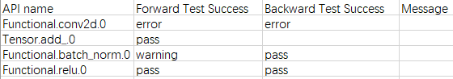
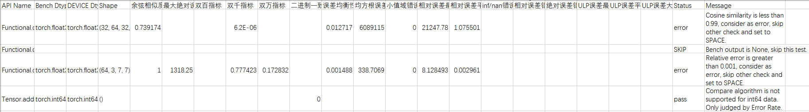
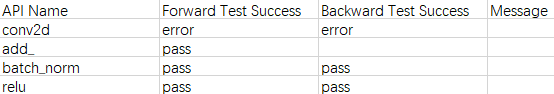

# Offline Precision Pre-check in PyTorch

## Overview

This function can scan PyTorch APIs in a user-trained model running on Ascend NPUs and then outputs diagnostic and analytical insights regarding model precision. Specifically, the tool collects forward and backward information for all APIs in a model, constructs corresponding unit tests, and compares NPU outputs against a high-precision CPU benchmark to calculate precision metrics. This process is executed using the `acc_check` subcommand. The pre-check data collected in an NPU environment is then copied to a GPU environment, where `acc_check` is run again. Finally, the NPU and GPU pre-check results are compared using the new standard precision comparison method to identify APIs that exhibit precision issues on NPUs. In addition, the tool supports both random generation mode and real data mode.

**Concepts**

- New standard precision comparison method: Based on the new precision standard, different comparison algorithms (including absolute threshold, benchmark comparison, binary consistency, ULP error comparison, and dual-1000 metric) are used for different APIs to determine the final pre-check result.
- Random generation mode and real data mode: During pre-check dump, you can choose to use the tool to generate random numbers to obtain dump data or use the actual input data. The random generation mode (`task=statistics`) offers high execution efficiency for quickly obtaining results, but its low data precision only supports rough judgments of precision issues. The real data mode (`task=tensor`) has slightly lower efficiency but provides high precision, enabling accurate identification of precision issues.

**Offline Pre-check Process**

1. Install msProbe in both the NPU and GPU environments.
2. Add the dump interface `PrecisionDebugger` of msProbe to the NPU training script to collect the data to be pre-checked. Note that `level=L1` must be configured.
3. Copy the pre-check data dumped in the NPU environment to the GPU environment.
4. Run `acc_check` in both the NPU and GPU environments. The generated results will be used as the input for `api_precision_compare`. For details, see [Offline Precision Pre-check](#offline-precision-pre-check).
5. Copy the `accuracy_checking_details_{timestamp}.csv` files generated by running `acc_check` in both the NPU and GPU environments to the same environment.
6. Run `api_precision_compare`. The output is the final result of the pre-check operation. For details, see [Pre-check Result Comparison](#pre-check-result-comparison).

## Preparations

**Environment Setup**

Install msProbe by referring to [msProbe Installation Guide](../msprobe_install_guide.md).

**Constraints**

Only the PyTorch scenario is supported.

## Offline Precision Pre-check

After pre-check data collection completes, only API input data is obtained. To generate both the NPU vs. CPU (high-precision benchmark) and GPU vs. CPU (high-precision benchmark) comparison results, you need to conduct the `acc_check` operation.

`acc_check` can be performed in either of the following ways:

- Run the `acc_check` subcommand to perform pre-check: This method is suitable for single-device scenarios with a small amount of data.
- Run the `multi_acc_check` subcommand to perform multi-thread pre-check: This method is suitable for large model scenarios with a large amount of data.

### Using `acc_check` for Pre-check

**Function**

Inputs the API information into the `acc_check` module to detect and compare precision.

**Syntax**

```bash
msprobe acc_check -api_info <dump_json_path> [-save_error_data] [-o <out_path>] [-j] [-d <device_id>] [-csv_path <result_csv_path>] [-f] [-config <config_path>]
```

Optional fields are enclosed in square brackets ([]), and variables are enclosed in angle brackets (<>).

Parameters

| Parameter                         | Mandatory (Yes/No)                       | Description                                                                                                                                                                     |
|-------------------------------| ---------------------------------- |-------------------------------------------------------------------------------------------------------------------------------------------------------------------------------|
| `-api_info` or `--api_info_file`  | Yes                              | Specifies the API information file `dump.json`.                                                                                                                                                       |
| `-save_error_data`             | No                              | Saves the API input and output data that does not meet the precision requirements.                                                                                                                                                         |
| `-o` or `--out_path`              | No                              | Specifies the path for saving the `acc_check` execution result. The default value is `./`.                                                                                                                                                   |
| `-j` or `--jit_compile`           | No                              | Enables JIT compilation.                                                                                                                                                                   |
| `-d` or `--device`                | No                              | Specifies the ID of the device where UT code runs. The default value is `0`.                                                                                                                                          |
| `-csv_path` or `--result_csv_path`| Mandatory when the `acc_check` operation is resumed after being interrupted.| Specifies the path of the `accuracy_checking_result_{timestamp}.csv` file generated when the current execution is interrupted. Set this parameter to resume execution from the interruption point if `acc_check` is interrupted. You need to specify the value to the `accuracy_checking_result_{timestamp}.csv` file that was interrupted last time. For details, see [Resumable Check](#resumable-check).|
| `-f` or `--filter_api`            | No                              | Filters APIs with the same parameters and structures except the maximum and minimum values in a model. This parameter is applicable to models with large size and many repeated APIs.                                                                                                                          |
| `-config` or `--config_path`      | No                              | Specifies the [config.json](../../../python/msprobe/config.json) file for additional configurations (including the blocklist and trustlist) for offline pre-check. By default, this file is not configured. For details about how to configure `config.json`, see [Configuration File Introduction](../dump/config_json_introduct.md).|

Example 1: Perform a pre-check.

```bash
msprobe acc_check -api_info ./dump_path/step{step_number}/rank{rank_number}/dump.json
```

The execution result of `acc_check` is generated in the path specified by the `-o` parameter, including the `accuracy_checking_result_{timestamp}.csv` and `accuracy_checking_details_{timestamp}.csv` files. `accuracy_checking_result_{timestamp}.csv` contains API-level data and indicates whether each API has passed the test. It is recommended to view the `accuracy_checking_result_{timestamp}.csv` file first. For APIs that failed the test or APIs with special focus, query the status of each output and comparison metric in the `accuracy_checking_details_{timestamp}.csv` file based on the `API Name` field. For details, see [Pre-check Result Description](#pre-check-result-description).

Example 2: Save the input and output data that does not meet the requirements.

If you need to save the input and output data that does not meet the requirements, add `-save_error_data` to the end of the `acc_check` command. For example:

```bash
msprobe acc_check -api_info ./dump_path/step{step_number}/rank{rank_number}/dump.json -save_error_data
```

By default, the data is saved in the `./ut_error_data{timestamp}` directory. You can use the `error_data_path` parameter to configure the save path as required. The `error_data_path` parameter can be configured in the [config.json](../../../python/msprobe/config.json) or [config.yaml](../../../python/msprobe/pytorch/api_accuracy_checker/config.yaml) file. The `config.json` file needs to be specified by the `-config` parameter during the `acc_check` operation. For details about the configuration of the `config.yaml` file, see [config.yaml File Description](#configyaml-file-description).

#### config.yaml File Description

   The `config.yaml` file can be used to configure parameters to control the trustlist and blocklist functions of the dump and `acc_check` operations. The procedure is as follows:

   - The `config.yaml` file is usually located in a path similar to `/home/xxx/miniconda3/envs/xxx/lib/python3.8/site-packages/msprobe/pytorch/api_accuracy_checker/config.yaml`.

   - Open the `config.yaml` file.

      ```bash
      vim /home/xxx/miniconda3/envs/xxx/lib/python3.8/site-packages/msprobe/pytorch/api_accuracy_checker/config.yaml
      ```

   - Modify the parameters in the `config.yaml` file.

      ```yaml
      white_list: []
      black_list: []
      error_data_path: './'
      precision: 14
      ```

      | Parameter       | Mandatory (Yes/No)| Description|
      | ----------- | -------- | -----------|
      | white_list      | No    | API dump trustlist. Only the specified APIs are dumped.<br>**Example**: `white_list=["conv1d", "conv2d"]` By default, no trustlist is configured, that is, all API data is dumped.|
      | black_list      | No    | API dump blocklist. The specified APIs are not dumped.<br>**Example**: `black_list=["conv1d", "conv2d"]` By default, no blocklist is configured, that is, all API data is dumped.|
      | error_data_path | No    | Path for storing the API input and output data that does not meet the precision requirements.<br>**Example**: `error_data_path": "./" The default value is the current path.|
      | precision       | No    | Number of decimal places of a floating-point number. By default, 14 decimal places are used.                        |

      > [!NOTE]NOTE
      >
      > If both `white_list` and `black_list` are configured and the API lists configured for them do not overlap, the trustlist takes effect. If the API lists overlap, the APIs excluded by the trustlist and the overlapped APIs are not dumped.

#### Pre-check API Blocklist and Trustlist

The `acc_check` process supports the API pre-check blocklist and trustlist. You can configure the `black_list` or `white_list` parameter to specify the names of the APIs that do not need to be pre-checked or need to be pre-checked:

   - Configure the parameters in [config.json](../../../python/msprobe/config.json). This file needs to be specified by the `-config` parameter during the `acc_check` operation.

   - The priority of `config.json` is higher than that of `config.yaml`. That is, when `config.json` is executed, the configuration in `config.yaml` does not take effect.

### Using `multi_acc_check` for Multi-thread Pre-check

**Function**

The `multi_acc_check` script is used to perform multiple `acc_check` operations in parallel, reducing the time required for pre-check.

**Syntax**

```bash
msprobe multi_acc_check -api_info <dump_json_path> [-save_error_data] [-o <out_path>] [-j] [-n <num_splits>] [-d <device_id>] [-csv_path <result_csv_path>] [-f]
```

Parameters

| Parameter                          | Mandatory (Yes/No)                                 | Description                                                        |
| ---------------------------- | ---------------------------------- | ------------------------------------------------------------ |
| `-api_info` or `--api_info_file`  | Yes                              | Specifies the API information file `dump.json`.                                  |
| `-save_error_data`            | No                              | Saves the API input and output data that does not meet the precision requirements.                           |
| `-o` or `--out_path`              | No                              | Specifies the path for saving the `acc_check` execution result. The default value is `./`.|
| `-j` or `--jit_compile`           | No                              | Enables JIT compilation.                                               |
| `-n` or `--num_splits`          | No                              | Specifies the number of `acc_check` threads to be executed at the same time. The default value is `8`, and the maximum value is `64`. However, each device supports a maximum of eight threads. When multiple threads and devices are specified, the threads are evenly distributed on each device.|
| `-d` or `--device`                | No                              | Specifies the ID of the device where UT code runs. The default value is `0`. You can specify up to eight devices (0 to 7) at the same time.|
| `-csv_path` or `--result_csv_path`| Mandatory when the `acc_check` operation is resumed after being interrupted.| Specifies the path of the `accuracy_checking_result_{timestamp}.csv` file generated when the current execution is interrupted. Set this parameter to resume execution from the interruption point if `acc_check` is interrupted. You need to specify the value to the `accuracy_checking_result_{timestamp}.csv` file that was interrupted last time. For details, see [Resumable Check](#resumable-check).|
| `-f` or `--filter_api`            | No                              | Filters APIs with the same parameters and structures except the maximum and minimum values in a model. This parameter is applicable to models with large size and many repeated APIs.|
| `-config` or `--config_path`| No| Specifies the [config.json](../../../python/msprobe/config.json) file for additional configurations (including the blocklist and trustlist) for offline pre-check. By default, this file is not configured. For details about how to configure `config.json`, see [Configuration File Introduction](../dump/config_json_introduct.md).|

**Example**

```bash
msprobe multi_acc_check -api_info ./dump_path/step{step_number}/rank{rank_number}/dump.json -n 32 -d 0 1 2 3
```

**Output Description**

After the `multi_acc_check` pre-check is performed, two CSV files are generated for each device. For details, see [Pre-check Result Description](#pre-check-result-comparison).

### Resumable Check

**Function**

During `acc_check` operation, if the pre-check process is interrupted by issues such as environment failures or excessive data volume, you can resume the check after resolving the issues.

**Precautions**

- You must use the `accuracy_checking_result_{timestamp}.csv` file that was interrupted last time.
- Do not change the names of the `accuracy_checking_result_{timestamp}.csv` and `accuracy_checking_details_{timestamp}.csv` files, including the timestamps. Otherwise, the resumable check will fail because the file names cannot be identified.
- The resumable check does not create a new CSV file. Instead, it continues to write subsequent results to the `accuracy_checking_result_{timestamp}.csv` file specified by `-csv_path` and the corresponding `accuracy_checking_details_{timestamp}.csv` file.

**Example**

```bash
msprobe acc_check -api_info ./dump_path/step{step_number}/rank{rank_number}/dump.json -csv_path /home/xxx/ut/accuracy_checking_result_{timestamp}.csv
```

## Pre-check Result Description

The following is an example of the `accuracy_checking_result_{timestamp}.csv` and `accuracy_checking_details_{timestamp}.csv` files generated during accuracy pre-check:

You can check `Forward Test Success` and `Backward Test Success` in the `accuracy_checking_result_{timestamp}.csv` file to determine whether there are APIs that fail the test. Then, check the API details in the `accuracy_checking_details_{timestamp}.csv` file. For details, see [API Pre-check Metrics](#api-pre-check-metrics).

`accuracy_checking_result_{timestamp}.csv`



| Field                 | Meaning    |
| --------------------- | ------------------------- |
| API name              | API name.                   |
| Forward Test Success  | Whether the forward API passes the test. The value can be `pass`, `warning`, or `error`. `SKIP` indicates that the API calculation was skipped. The `Message` field provides the reason, such as: the API does not support precision pre-check, is filtered by the blocklist (or not included in the trustlist), or encountered an error during execution.|
| Backward Test Success | Whether the backward API passes the test. The value can be `pass`, `warning`, or `error`. If the value is empty, the API has no backward output. `SKIP` indicates that the API calculation was skipped. The `Message` field provides the reason, such as: the API does not support precision pre-check, is filtered by the blocklist (or not included in the trustlist), or encountered an error during execution.|
| Message               | Message.            |

This result is an intermediate result and is for reference only. You are advised to view the comparison result after [Comparing Pre-check Results](#pre-check-result-comparison). This result will be deleted later.

The `pass`/`error` status of `Forward Test Success` and `Backward Test Success` is determined by the cosine similarity, maximum absolute error, and dual-100/dual-1000/dual-10000 metrics recorded in `accuracy_checking_details_{timestamp}.csv`.

Note that an API in `accuracy_checking_details_{timestamp}.csv` may have multiple forward or backward outputs. In this case, each output is recorded in a separate row. In `accuracy_checking_result_{timestamp}.csv`, the result is marked as `pass` only if all outputs of an API are `pass`. If any output is `error`, the result is marked as `error`. If only `warning` and `pass` are present and no `error` is present, the result is marked as `warning`.

`accuracy_checking_details_{timestamp}.csv`



| Field               | Meaning                                                        |
| ------------------- | ------------------------------------------------------------ |
| API name            | Name of the API on the NPU or GPU.      |
| Bench Dtype         | Type of the benchmark API data.                                     |
| DEVICE Dtype        | Type of the NPU or GPU API data.     |
| Shape               | API shape.          |
| Cosine similarity         | Cosine similarity between the NPU or GPU data and the benchmark data.      |
| Maximum absolute error       | Maximum absolute error between the NPU or GPU data and the benchmark data.  |
| Dual-100 metric           | Dual-100 precision metric: Measures the proportion of elements in an NPU or GPU tensor whose relative error, when compared to the benchmark data, is less than 1%. The test is considered passed if the proportion of elements with a relative error exceeding 1% is less than 1% of the total number of elements.|
| Dual-1000 metric           | Dual-1000 precision metric: Measures the proportion of elements in an NPU or GPU tensor whose relative error, when compared to the benchmark data, is less than 0.1%. The test is considered passed if the proportion of elements with a relative error exceeding 0.1% is less than 0.1% of the total number of elements.|
| Dual-10000 metric           | Dual-10000 precision metric: Measures the proportion of elements in an NPU or GPU tensor whose relative error, when compared to the benchmark data, is less than 0.01%. The test is considered passed if the proportion of elements with a relative error exceeding 0.01% is less than 0.01% of the total number of elements.|
| Binary consistency error rate   | Ratio of inconsistent precision values to the total number of tensor values in NPU or GPU data. This metric is displayed only for APIs whose data is of the built-in type (`bool`, `int`, `float`, or `str`), `torch.bool` or `torch.int`, or for APIs that use the binary consistency algorithm for comparison.|
| Error balance         | Fluctuation in precision difference between NPU/GPU data and the benchmark data.                |
| Root-mean-square error (RMSE)         | RMSE between NPU/GPU data and the benchmark data.                        |
| Error ratio in small value range     | Proportion of small values in an NPU or GPU tensor whose absolute error against the benchmark exceeds the error threshold, relative to the total number of small values. For details about how to determine small values and the error threshold, see [Small Value Range](#small-value-range).|
| Maximum relative error     | Maximum relative error between NPU/GPU data and the benchmark data.        |
| Mean relative error     | Mean relative error between NPU/GPU data and the benchmark data.           |
| inf/nan error rate      | Proportion of elements that have inconsistent inf/nan values between the NPU and the benchmark to the total number of elements. |
| Relative error rate     | Proportion of elements whose relative error between NPU normal values and benchmark normal values exceeds the error threshold, relative to the total number of normal value elements.|
| Absolute error rate     | Proportion of elements whose absolute error between NPU small values and benchmark small values exceeds the error threshold, relative to the total number of small value elements.|
| Maximum ULP error      | Maximum ULP error (absolute value) between NPU/GPU data and the benchmark data.       |
| Mean ULP error      | Mean ULP error (absolute value) between NPU/GPU data and the benchmark data. |
| Proportion of ULP errors greater than the threshold| Proportion of elements where the absolute ULP error between NPU/GPU data and benchmark data exceeds a threshold, relative to the total number of elements. The threshold is `1` for float16 or bfloat16 data types, and `32` for float32.|
| Status              | API pre-check status. `pass` indicates that the test is passed; `error` indicates that the test is not passed, `warning` indicates that the test does not meet the requirements of the dual-1000 or dual-1000 precision metrics; and `SKIP` indicates that the calculation of an API is skipped. The `Message` field provides the reason, such as: a certain API parameter is not involved in backward gradient computation, the API's data type (e.g. float64) is not supported by new precision comparison standards, the API does not support precision pre-check, is filtered by the blocklist (or not included in the trustlist), or encountered an error during execution.|
| Message             | Message.                    |

### API Pre-check Metrics

   API pre-check metrics are used to determine whether an API meets the precision standards by checking the cosine similarity, maximum absolute error, and dual-100/1000/10000 precision metrics in `accuracy_checking_details_{timestamp}.csv`. You are advised to perform [pre-check result comparison](#pre-check-result-comparison) after the preliminary pre-check is complete to obtain a more accurate precision result.

   If an API passes the pre-check test, the "Status" column in the `accuracy_checking_details_{timestamp}.csv` file is marked as "pass". Otherwise, it is marked as "error" or "warning". The detailed rules are as follows:

   - Cosine similarity > 0.99: If the cosine similarity is less than or equal to 0.99, the check fails and an "error" is marked. If the cosine similarity is greater than 0.99, the check succeeds and the process goes to the next step.
   - Maximum absolute error < 0.001: If the maximum absolute error is less than 0.001, the test is passed. If the maximum absolute error is greater than or equal to 0.001, the test is not passed. Proceed to the next step.
   - Dual-100, dual-1000, and dual-10000 precision metrics:
     + For float16 and bfloat16 data: If the dual-100 metric fails to pass the test, mark the data as "error". If the dual-100 metric passes the test, but the dual-1000 metric fails, mark the data as "warning". If both the dual-100 and dual-1000 metrics pass the test, mark the data as "pass".
     + For float32 and float64 data: If the dual-1000 metric fails, mark the data as "error". If the dual-1000 metric passes, but the dual-10000 metric fails, mark the data as "warning". If both the dual-1000 and dual-10000 metrics pass, mark the data as "pass".
   - In the `accuracy_checking_result_{timestamp}.csv` file, the`Forward Test Success` and `Backward Test Success` fields are used to collect statistics on the test results of the forward and backward outputs of an operator. For operators marked as "pass", the value in `accuracy_checking_result_{timestamp}.csv` is `TRUE`, indicating that the test is passed. For operators marked as "error" or "warning", the value in `accuracy_checking_result_{timestamp}.csv` is `FALSE`, indicating that the test is failed. An operator may have multiple forward or backward inputs or outputs. Therefore, all inputs and outputs of such an operator must be marked as "pass" in `accuracy_checking_result_{timestamp}.csv` for the operator to be marked as `TRUE`. If any input or output is marked as "error" or "warning", the operator is marked as `FALSE` in `accuracy_checking_result_{timestamp}.csv`.

### Small Value Range

   Threshold regarded as a small value:

   - torch.float32: 2**-14
   - torch.float16: 2**-11
   - torch.bfloat16: 2**-8

   Absolute error threshold of small values:

   - torch.float32: 2**-30
   - torch.float16: 2**-16
   - torch.bfloat16: 2**-16

## Pre-check Result Comparison

**Function**

After obtaining the `accuracy_checking_details_{timestamp}.csv` files of the `acc_check` operation pre-check results in the NPU and GPU environments, you can compare the precision differences between the NPU and GPU environments.

**Syntax**

```bash
msprobe api_precision_compare -npu <npu_csv_path> -gpu <gpu_csv_path> [-o out_path]
```

Optional fields are enclosed in square brackets ([]), and variables are enclosed in angle brackets (<>).

Parameters

| Parameter                  | Mandatory (Yes/No)| Description                                                        |
| ---------------------- | --------- | ------------------------------------------------------------ |
| `-npu` or `--npu_csv_path`| Yes     | Path of the NPU pre-check result file (`accuracy_checking_details_{timestamp}.csv`). By default, the file is identified in the current directory.|
| `-gpu` or `--gpu_csv_path`| Yes     | Path of the GPU pre-check result file (`accuracy_checking_details_{timestamp}.csv`). By default, the file is identified in the current directory.|
| `-o` or `--out_path`      | No     | Path for saving the execution result of `api_precision_compare.py`. The current directory is used by default.|

**Example**

```bash
msprobe api_precision_compare -npu /home/xxx/npu/accuracy_checking_details_{timestamp}.csv -gpu /home/xxx/gpu/accuracy_checking_details_{timestamp}.csv -o /home/xxx/
```

**Output Description**

After the pre-check result comparison is complete, the `api_precision_compare_result_{timestamp}.csv` and `api_precision_compare_details_{timestamp}.csv` files are generated in the path specified by the `-o` parameter. Example:

You can check the `Forward Test Success` and `Backward Test Success` columns in the `api_precision_compare_result_{timestamp}.csv` file to determine whether there are APIs that fail the test, and then check the detailed API information in the `api_precision_compare_details_{timestamp}.csv` file.

`api_precision_compare_result_{timestamp}.csv`



| Field                 | Meaning                                                        |
| --------------------- | ------------------------------------------------------------ |
| API name              | API name.                                                  |
| Forward Test Success  | Whether the forward API passes the test. `pass` indicates that the test is passed; `error` indicates that an error occurs; and `SKIP` indicates that the calculation of an API is skipped. The `Message` field provides the reason, such as: the API's data type (e.g. float64) is not supported by new precision comparison standards, the API does not support precision pre-check, is filtered by the blocklist (or not included in the trustlist), or encountered an error during execution.|
| Backward Test Success | Whether the backward API passes the test. `pass` indicates that the test is passed; `error` indicates that an error occurs; an empty value indicates that the API has no backward output; and `SKIP` indicates that the API's data type (e.g. float64) is not supported by new precision comparison standards.|
| Message               | Message.                                                  |

Whether `Forward Test Success` and `Backward Test Success` pass the test is determined by the result of each metric in `api_precision_compare_details_{timestamp}.csv`. Note that an API in `api_precision_compare_details_{timestamp}.csv` may have multiple forward or backward outputs. In this case, each output is recorded in a separate row. In `api_precision_compare_result_{timestamp}.csv`, the result is marked as `pass` only if all metric results of an API are `pass`. If any metric is `error`, the result is marked as `error`. If only `warning` and `pass` are present and no `error` is present, the result is marked as `warning`.

`api_precision_compare_details_{timestamp}.csv`


| Field                    | Meaning                                                                                                                                                                                                                                                                                                                                                                                    |
| ------------------------ |----------------------------------------------------------------------------------------------------------------------------------------------------------------------------------------------------------------------------------------------------------------------------------------------------------------------------------------------------------------------------------------|
| API name                 | Name of an API on the NPU or GPU.                                                                                                                                                                                                                                                                                                                                                                  |
| Error ratio in small value range          | Error ratio in the small value range between the NPU and CPU data or GPU and CPU data. It is a benchmark comparison metric.                                                                                                                                                                                                                                                                                                                                    |
| Error determination result in small value range      | If the error ratio in small value range is less than or equal to 2, the result is marked as "pass". If the error ratio is greater than 2, the result is marked as "error".                                                                                                                                                                                                                                                                                                                                                |
| RMSE ratio          | RMSE ratio between the NPU and CPU data or GPU and CPU data. It is a benchmark comparison metric.                                                                                                                                                                                                                                                                                                                                          |
| RMSE determination result      | If the RMSE ratio is less than or equal to (2/1.5/1.2), the result is marked as "pass". If the RMSE ratio is greater than (2/1.5/1.2), the result is marked as "error". The values correspond to the operator monitoring levels L0, L1, and L2, respectively. For details, see [Operator Monitoring Levels](#operator-monitoring-levels).                                                                                                                                                                                                                                                                                 |
| Maximum relative error ratio      | Maximum relative error ratio between the NPU and CPU data or GPU and CPU data. It is a benchmark comparison metric.                                                                                                                                                                                                                                                                                                                                      |
| Maximum relative error determination result  | If the maximum relative error ratio is less than or equal to (10/5/2), the result is marked as "pass". If the maximum relative error ratio is greater than (10/5/2), the result is marked as "error". The values correspond to the operator monitoring levels L0, L1, and L2, respectively. For details, see [Operator Monitoring Levels](#operator-monitoring-levels).                                                                                                                                                                                                                                                                                                          |
| Mean relative error ratio      | Mean relative error ratio between the NPU and CPU data or GPU and CPU data. It is a benchmark comparison metric.                                                                                                                                                                                                                                                                                                                                    |
| Mean relative error determination result  | If the mean relative error ratio is less than or equal to (2/1.5/1.2), the result is marked as "pass". If the mean relative error ratio is greater than (2/1.5/1.2), the result is marked as "error". The values correspond to the operator monitoring levels L0, L1, and L2, respectively. For details, see [Operator Monitoring Levels](#operator-monitoring-levels).                                                                                                                                                                                                                                                                                                                                   |
| Error balance ratio          | Error balance ratio between the NPU and CPU data or GPU and CPU data. It is a benchmark comparison metric.                                                                                                                                                                                                                                                                                                                                          |
| Error balance determination result      | If the error balance ratio is less than or equal to 2, the result is marked as "pass". If the error balance ratio is greater than 2, the result is marked as "error". This field is not involved in `api_precision_compare_result`.                                                                                                                                                                                                                                                                                                     |
| INF/NaN error rate           | Proportion of elements with inconsistent INF/NaN values between the NPU and the benchmark, relative to the total element count. It is an absolute threshold metric.                                                                                                                                                                                                                                                                                                                                        |
| INF/NaN determination result         | If the result is 0, it is marked as "pass"; otherwise, it is marked as "error".                                                                                                                                                                                                                                                                                                                                        |
| Relative error rate          | Proportion of elements whose relative error between NPU normal values and benchmark normal values exceeds the error threshold, relative to the total number of normal value elements. It is an absolute threshold metric.                                                                                                                                                                                                                                                                                                                                    |
| Relative error determination result        | If the result is 0, it is marked as "pass"; otherwise, it is marked as "error".                                                                                                                                                                                                                                                                                                                                              |
| Absolute error rate          | Proportion of elements whose absolute error between NPU small values and benchmark small values exceeds the error threshold, relative to the total number of small value elements. It is an absolute threshold metric.                                                                                                                                                                                                                                                                                                                                      |
| Absolute error determination result        | If the result is 0, it is marked as "pass"; otherwise, it is marked as "error".                                                                                                                                                                                                                                                                                                                                              |
| Binary consistency error rate        | Ratio of inconsistent precision values to the total number of tensor values in NPU or GPU data. This metric is displayed only for APIs whose data is of the built-in type (`bool`, `int`, `float`, or `str`), `torch.bool` or `torch.int`, or for APIs that use the binary consistency algorithm for comparison. It is a binary consistency metric.                                                                                                                                                                                                                        |
| Binary consistency error rate determination result.| If the result is 0, it is marked as "pass"; otherwise, it is marked as "error".                                                                                                                                                                                                                                                                                                                                             |
| Mean ULP error<sup>a</sup> | Mean ULP error (absolute value) between NPU data and the benchmark data.                                                                                                                                                                                                                                                                                                                                                        |
| Proportion of ULP errors greater than the threshold<sup>a</sup>     | Proportion of elements where the absolute ULP error between NPU data and benchmark data exceeds a threshold, relative to the total number of elements. The threshold is `1` for float16 or bfloat16 data types, and `32` for float32.                                                                                                                                                                                                                                                                    |
| Ratio of ULP error greater than the threshold<sup>a</sup> | NPU-CPU ULP error exceedance rate/GPU-CPU ULP error exceedance rate                                                                                                                                                                                                                                                                                                                                  |
| ULP error determination result         | Options:<br>     When the NPU or GPU data type is float16 or bfloat16, the result is marked as "pass" if either of the following conditions is met; otherwise, it is marked as "error":<br>          The proportion of NPU ULP errors greater than the threshold is less than 0.001.<br>          The proportion of NPU ULP errors exceeding the threshold is lower than that of GPU ULP errors.<br>     When the NPU or GPU data type is float32, the result is marked as "pass" if any of the following conditions is met; otherwise, it is marked as "error":<br>          The mean NPU ULP error is less than 64.<br>          The proportion of NPU ULP errors greater than the threshold is less than 0.05.<br>          The proportion of NPU ULP errors exceeding the threshold is lower than that of GPU ULP errors.|
| Dual-1000 metric                | Dual-1000 precision metric: Proportion of elements in an NPU tensor whose relative error, compared element-wise against the corresponding benchmark data, is less than 0.1%. The test is passed if the ratio of the number of elements with the relative error greater than 0.1% to the total number of elements is less than 0.1%. This metric is used only for `conv1d` and `conv2d`.                                                                                                                                                                                                                                                     |
| Dual-1000 metric determination result        | Criterion: If the dual-1000 metric is greater than 0.999, the result is marked as "pass"; otherwise, it is marked as "error".                                                                                                                                                                                                                                                                                                                                           |
| Comparison result                | Final result of all metrics. If any metric in the comparison result is marked as `error`, the overall result is marked as `error`, and the `Message` field specifies the metric that does not meet the standard. If any metric is marked as `warning`, the overall result is marked as `warning`, and the `Message` field specifies the metric that does not meet the standard. If no metric is marked as `error` or `warning`, the overall result is marked as `pass`. `SKIP` indicates that the calculation of an API is skipped. The `Message` field provides the reason, such as: a certain API parameter is not involved in backward gradient computation, the API's data type (e.g. float64) is not supported by new precision comparison standards, the API does not support precision pre-check, is filtered by the blocklist (or not included in the trustlist), or encountered an error during execution.                                                                          |
| Comparison algorithm                | Comparison algorithm used by the API. Options include: benchmark comparison, binary consistency, absolute threshold, or ULP error comparison.                                                                                                                                                                                                                                                                                                                                       |
| Message                  | Message.                                                                                                                                                                                                                                                                                                                                                                                 |

## Appendix

### List of Supported Fused Operators

The pre-check tool supports the following fused operators:

- npu_apply_adam_w

- npu_confusion_transpose

- fast_gelu

- npu_layer_norm_eval

- npu_linear

- npu_fusion_attention (To perform pre-check on this operator on the GPU, you need to install flash_attn. flash_attn 2.1 or later is recommended.)

- npu_rms_norm

- npu_rotary_mul

- npu_scaled_masked_softmax

- npu_swiglu

- npu_apply_adam

- npu_group_norm_silu

- npu_mish

- npu_moe_gating_top_k_softmax

- npu_sort_v2

### Operator Monitoring Levels

The following lists the operator monitoring levels supported by the pre-check tool. For other operators that are not listed, the L0 monitoring is used by default.

#### L1 Operator List

- embedding

- npu_fusion_attention_grad

- npu_fusion_attention

- scatter_

- scatter_add_

#### L2 Operator List

- addmm

- npu_cross_entropy_loss

- npu_cross_entropy_loss_backward

- GELU

- layer_norm

- matmul

- mm

- index

- one_hot

- sum

- npu_rms_norm

- npu_rms_norm_backward

- nonzero
