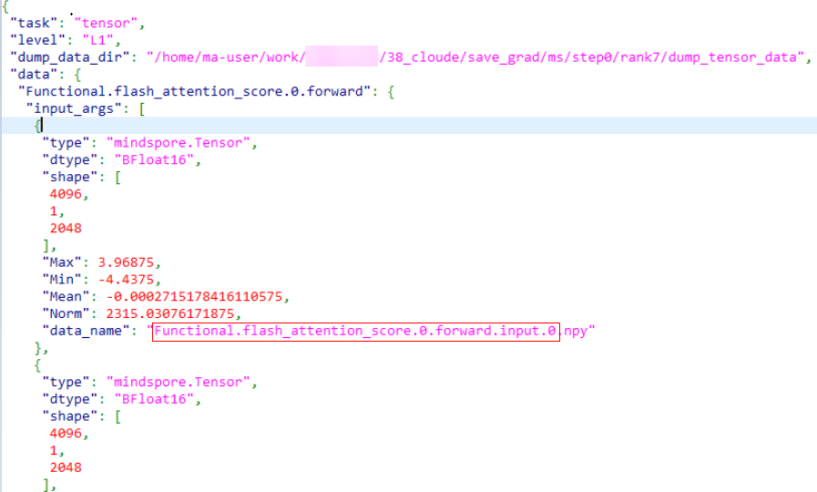

# Precision Comparison in MindSpore

## Overview

msProbe is mainly used in the following scenarios:

- Intra-MindSpore comparison
  - When the same network model is executed in two different versions of the MindSpore static graph environment using identical training data input, the resulting API dump data is automatically compared in full mode. This allows for quick localization of precision issues between the two versions.
  - When the same network model is executed in two different versions of the MindSpore static graph environment using identical training data input, the resulting kernel dump data is automatically compared in full mode. This allows for quick localization of precision issues between the two versions.
  - When the same network model is executed in two different versions of the MindSpore dynamic graph environment using identical training data input, the resulting cell dump data is automatically compared in full mode. This allows for quick localization of precision issues between the two versions.
- Cross-framework comparison between MindSpore and PyTorch
  - The same network model is used across environments, with API dump data collected from both MindSpore dynamic graph and PyTorch. Using PyTorch data as the benchmark, the tool performs automatic comparison to enable cross-framework precision evaluation.
  - The same network model is used across environments, with cell dump data collected from both MindSpore dynamic graph and PyTorch. You can specify the cell list to be compared and use the PyTorch data as the benchmark for automatic comparison, achieving cross-framework precision comparison.
  - The same network model is used across environments, with API or module dump data collected from both MindSpore dynamic graph and PyTorch. You can specify the API or module data to be compared and use the PyTorch data as the benchmark for automatic comparison, achieving cross-framework precision comparison.
  - The same network model is used across environments, with API or module dump data collected from both MindSpore dynamic graph and PyTorch. You can specify the model layer to be compared and use the PyTorch data as the benchmark for automatic comparison, achieving cross-framework precision comparison.

## Preparations

Install msProbe by referring to [msProbe Installation Guide](../msprobe_install_guide.md).

## Model Precision Comparison

### Function

Use the command line tool to compare precision data and output the comparison result.

### Precautions

### Syntax

```shell
msprobe compare -tp <target_path> -gp <golden_path> [options]
```

### Parameters

| Parameter              | Description                                                                                                                                                                                                                                           | Mandatory (Yes/No)|
| ----------------- |-----------------------------------------------------------------------------------------------------------------------------------------------------------------------------------------------------------------------------------------------| -------- |
| `-tp` or `--target_path`| `dump.json` path in the NPU environment (single-rank scenario) or dump directory (multi-rank scenario). The value is a string.                                                                                                                                                                                                 | Yes      |
| `-gp` or `--golden_path`| `dump.json` path in the CPU, GPU, or NPU environment (single-rank scenario) or dump directory (multi-rank scenario). The value is a string.                                                                                                                                                                                         | Yes      |
| `-o` or `--output_path` | Directory for storing the comparison result file. By default, an `output` directory is created in the current directory. The value is a string. The file name is automatically generated based on the timestamp. The format includes<br>        `compare_result_{timestamp}.xlsx` and<br>        `compare_result_{rank_id}_{step_id}_{timestamp}.xlsx` (see [Full Kernel Comparison Across Different Versions] (#full_kernel_comparison_across_different_versions)).<br>Note: Files with the same name as the result file in the `output` directory will be deleted and overwritten.| No      |
| `-fm` or `--fuzzy_match`| Fuzzy matching. After this function is enabled, APIs at the same level on the network with the same name but different call times can be matched and compared. This function can be enabled by directly configuring this parameter. By default, this parameter is not configured, indicating that the function is disabled.                                                                                                                                                                          | No      |
| `-am` or `--api_mapping`| Cross-framework comparison. If this parameter is configured, the cross-framework API comparison function is enabled. You can specify a custom mapping file in .yaml format. If no mapping file is specified, the comparison is performed based on the default mapping defined by msProbe. For details about the format of the custom mapping file, see [API Mapping](#api-mapping). This parameter needs to be configured only in the [cross-framework API comparison](#cell-mapping) scenario.                                                                         | No      |
| `-cm` or `--cell_mapping`| Cross-framework comparison. If this parameter is configured, the cross-framework cell comparison function is enabled. You can specify a custom mapping file in .yaml format. If no mapping file is specified, the comparison is performed based on the default mapping defined by msProbe. For details about the format of the custom mapping file, see [Cell Mapping](#cell-mapping). This parameter needs to be configured only in the [cross-framework cell comparison](#cross-framework-cell-comparison) scenario.                                                              | No      |
| `-dm` or `--data_mapping`| Intra-framework or cross-framework comparison. A mapping file can be used to specify the mapping between two parameters in L0, L1, or mix collection scenarios. When configuring this parameter, you need to specify a custom mapping file in .yaml format. For details about the format of the custom mapping file, see [Data Mapping](#data-mapping).                                                                                                      | No      |
| `-lm` or `--layer_mapping`| Cross-framework comparison. If this parameter is configured, cross-framework layer comparison is enabled. After the layers in the model code are specified, the corresponding modules or APIs can be identified. You need to specify a custom mapping file in .yaml format. For details about the format of the custom mapping file, see [Layer Mapping](#layer-mapping). This parameter needs to be configured only in the [cross-framework layer comparison](#cross-framework-layer-comparison) scenario.                                                     | No      |
| `-da` or `--diff_analyze`| Automatically identifies the first different node on the network and supports dump data such as MD5 and statistics. Single-rank and multi-rank scenarios are supported. This function can be enabled by directly configuring this parameter. By default, this parameter is not configured, indicating that the function is disabled.                                                                                                                                                                              | No      |
| `--rank`           | Rank ID for comparison, which is used only for kernel comparison. The value is of the int type. The dump files in the `target_path` and `golden_path` directories must contain the corresponding rank data. The default value is empty, indicating that all ranks are compared. You can configure one or more ranks. Use commas (,) to separate multiple rank IDs, for example, `1,2,3`.                                                                                                    | No      |
| `--step`           | Step ID for comparison, which is used only for kernel comparison. The value is of the int type. The dump files in the `target_path` and `golden_path` directories must contain the corresponding step data. The default value is empty, indicating that all steps are compared. You can configure one or more steps. Use commas (,) to separate multiple step IDs, for example, `1,2,3`.                                                                                                    | No      |
| `-tensor_log` or `--is_print_compare_log`| Whether to enable log printing for a single module or API. Only the tensor data dumped by msProbe is supported. This function can be enabled by directly configuring this parameter. By default, this parameter is not configured, indicating that the function is disabled.| No|

If no mapping is specified in dynamic graph mode, the comparison defaults to intra-framework mode, requiring the cell or API names in both the comparison and benchmark data to match.

### Examples

#### Full API Comparison Across Different Versions

1. Refer to [Precision Data Collection in MindSpore](../dump/mindspore_data_dump_instruct.md) to collect MindSpore static graph precision data and obtain the API dump data of different framework versions.

2. Run the following example command to perform the comparison.

   Single-rank scenario:

   ```shell
   msprobe compare -tp /target_dump/dump.json -gp /golden_dump/dump.json -o ./output
   ```

   Multi-rank scenario (`-tp` and `-gp` need to be set to the step level, that is, the upper level of the rank):

   ```shell
   msprobe compare -tp /target_dump/step0 -gp /golden_dump/step0 -o ./output
   ```

#### Full Kernel Comparison Across Different Versions

1. Refer to [Precision Data Collection in MindSpore](../dump/mindspore_data_dump_instruct.md) to collect MindSpore static graph precision data and obtain the kernel dump data of different framework versions.

2. Run the following example command to perform the comparison.

   ```shell
   msprobe compare -tp /target_dump -gp /golden_dump -o ./output --rank 0,1 --step 0,1
   ```

   In this scenario, only `-tp`, `-gp`, `-o`, -`-rank`, and `--step` of the `compare` command are supported.

#### Cell Comparison Across Different Versions

1. In the [config.json](../../../python/msprobe/config.json) file, set `level` to `L0`, set `task` to `tensor` or `statistics`, and specify the name of the cell to be dumped.

2. Refer to [Precision Data Collection in MindSpore](../dump/mindspore_data_dump_instruct.md) to collect MindSpore dynamic graph precision data and obtain the cell dump data of different framework versions.

3. Run the following example command to perform the comparison.

   ```shell
   msprobe compare -tp /target_dump/dump.json -gp /golden_dump/dump.json -o ./output
   ```

#### Cross-Framework API Comparison

1. In the [config.json](../../../python/msprobe/config.json) file, set `level` to `L1` and `task` to `tensor` or `statistics`.

2. Refer to [Precision Data Collection in MindSpore](../dump/mindspore_data_dump_instruct.md) and [Precision Data Collection in PyTorch](../dump/pytorch_data_dump_instruct.md) to collect API precision data in different environments and obtain the API dump data of the two frameworks.

3. Run the following example command to perform the comparison.

   ```shell
   msprobe compare -tp /target_dump/dump.json -gp /golden_dump/dump.json -o ./output -am
   ```

   Or

   ```shell
   msprobe compare -tp /target_dump/dump.json -gp /golden_dump/dump.json -o ./output -am api_mapping.yaml
   ```

   For details about how to configure the `api_mapping.yaml` file, see [API Mapping](#api-mapping). If the `api_mapping.yaml` file is not passed, the built-in API mapping is used for matching. If the `api_mapping.yaml` file is passed, the content in the file is preferentially used for matching. For APIs not involved in the `api_mapping.yaml` file, the built-in API mapping is used for matching.

   In addition, you can use the `data_mapping.yaml` file to match specific parameters. For example:

   ```shell
   msprobe compare -tp /target_dump/dump.json -gp /golden_dump/dump.json -o ./output -dm data_mapping.yaml
   ```

   For details about how to write the `data_mapping.yaml` file, see [Data Mapping](#data-mapping).

#### Cross-Framework Cell Comparison

1. In the [config.json](../../../python/msprobe/config.json) file, set `level` to `L0` and `task` to `tensor` or `statistics`.

2. Refer to [Precision Data Collection in MindSpore](../dump/mindspore_data_dump_instruct.md) and [Precision Data Collection in PyTorch](../dump/pytorch_data_dump_instruct.md) to collect cell precision data in different environments and obtain the cell dump data of the two frameworks.

3. Run the following example command to perform the comparison.

   ```shell
   msprobe compare -tp /target_dump/dump.json -gp /golden_dump/dump.json -o ./output -cm
   ```

   Or

   ```shell
   msprobe compare -tp /target_dump/dump.json -gp /golden_dump/dump.json -o ./output -cm cell_mapping.yaml
   ```

   For details about how to configure the `cell_mapping.yaml` file, see [Cell Mapping](#cell-mapping).
   If the `cell_mapping.yaml` file is not passed, only the cell is changed to the module for matching. If the `cell_mapping.yaml` file is passed, configurations in the file are used for matching.

   In addition, you can use the `data_mapping.yaml` file to match specific parameters. For example:

   ```shell
   msprobe compare -tp /target_dump/dump.json -gp /golden_dump/dump.json -o ./output -dm data_mapping.yaml
   ```

   For details about how to write the `data_mapping.yaml` file, see [Data Mapping](#data-mapping).

#### Cross-Framework Layer Comparison

`layer_mapping` can simplify configurations by identifying APIs and cells of the entire network from layers.

1. In the [config.json](../../../python/msprobe/config.json) file, set `level` to `L0` or `mix`, set `task` to `tensor` or `statistics`, and specify the name of the API or module to be dumped.

2. Refer to [Precision Data Collection in MindSpore](../dump/mindspore_data_dump_instruct.md) and [Precision Data Collection in PyTorch](../dump/pytorch_data_dump_instruct.md) to collect API or module precision data in different environments and obtain the API or module dump data of the two frameworks.

3. Run the following example command to perform the comparison.

   ```shell
   msprobe compare -tp /target_dump/dump.json -gp /golden_dump/dump.json -o ./output -lm layer_mapping.yaml
   ```

   For details about how to configure the `layer_mapping.yaml` file, see [Layer Mapping](#layer-mapping).

   In addition, you can use the `data_mapping.yaml` file to match specific parameters. For example:

   ```shell
   msprobe compare -tp /target_dump/dump.json -gp /golden_dump/dump.json -o ./output -dm data_mapping.yaml
   ```

   For details about how to write the `data_mapping.yaml` file, see [Data Mapping](#data-mapping).

#### Data Comparison at L0/Mix Level in Dynamic/Static Graph Scenarios

1. Perform the dump operation by referring to [Precision Data Collection in MindSpore](../dump/mindspore_data_dump_instruct.md).<br>In dynamic graph scenarios, when `mindspore.jit` is used to decorate a specific cell or function, the decorated part will be compiled into a static graph for execution. The following is an example of the directory structure of the collected data files:

    ```lua
    ├── graph
    │   ├── step0
    │   |   ├── rank
    │   |   │   ├── dump_tensor_data
    |   |   |   |    ├── Cell.wrap_net.net.Net.forward.0.input.0.npy
    |   |   |   |    ├── Cell.wrap_net.net.Net.forward.0.output.0.npy
    |   |   |   |    ...
    │   |   |   ├── dump.json
    │   |   |   ├── stack.json
    │   |   |   └── construct.json
    │   ├── ...
    ├── pynative
    │   ├── step0
    │   |   ├── rank
    │   |   │   ├── dump_tensor_data
    |   |   |   |    ├── Cell.dense1.Dense.forward.0.input.0.npy
    |   |   |   |    ├── Cell.dense1.Dense.forward.0.output.0.npy
    |   |   |   |    ...
    │   |   |   ├── dump.json
    │   |   |   ├── stack.json
    │   |   |   └── construct.json
    │   ├── ...
    ```
   
2. Run the following example command to perform the comparison.

   ```shell
   msprobe compare -tp /target_dump -gp /golden_dump -o ./output
   ```

    - `/target_dump` indicates the dump file directory to be compared. In the preceding example, `/target_dump` is the parent directory of the `graph` and `pynative` directories dumped from the side to be compared in dynamic and static graph modes.
    - `/golden_dump` indicates the dump file directory on the benchmark side. In the preceding example, `/golden_dump/target_dump` is the parent directory of the `graph` and `pynative` directories dumped from the benchmark side in dynamic and static graph modes.

3. Check data comparison results at L0/Mix level in dynamic/static graph scenarios.

    ```lua
    ├── graph
    │   ├── step0
    │   |   ├── compare_result_rank_20250805043411.xlsx
    ├── pynative
    │   ├── step0
    │   |   ├── compare_result_rank_20250805043414.xlsx
    ```

Two folders, `graph` and `pynative`, are generated in the `output` directory, and the comparison results of the corresponding step are generated in each folder.

#### First Mismatched Operator Node Identification

For details, see [First Mismatched Operator Node Identification](./pytorch_accuracy_compare_instruct.md#first-mismatched-operator-node-identification) in *Precision Comparison in PyTorch*.

#### Single-Point Data Comparison in Dynamic Graphs

Applicable scenario: compare data saved at a single point in the CPU or NPU environment.

Single-point data comparison supports single-rank and multi-rank comparison. In multi-server scenarios, you need to perform the comparison operation on each device separately.

1. Collect single-point data in dynamic graph scenarios on the CPU and NPU by referring to [Single-Point Saving Tool](../dump/debugger_save_instruct.md).

2. Example command:

   Single-rank scenario:

   ```shell
   msprobe compare -tp /target_dump/debug.json -gp /golden_dump/debug.json -o ./output
   ```

   Multi-rank scenario (`-tp` and `gp` need to be set to the step level, that is, the upper level of the rank):

   ```shell
   msprobe compare -tp /target_dump/step0 -gp /golden_dump/step0 -o ./output
   ```

### Output Description

After the comparison is complete, the message `msProbe compare ends successfully.` is displayed.

Single-rank scenario: An .xlsx file is generated in the configured output path. The file name is automatically generated based on the timestamp in the format of `compare_result_{timestamp}.xlsx`.

Multi-rank scenario: Multiple .xlsx files are generated in the configured output path. The file name is automatically generated based on the timestamp in the format of `compare_result_rank{rank_id}_{timestamp}.xlsx`.

Full kernel comparison scenario: An .xlsx file is generated in the configured output path. The file name is automatically generated based on the timestamp in the format of `compare_result_{rank_id}_{step_id}_{timestamp}.xlsx`.

First mismatched operator node identification scenario: `Saving json file to disk: /output_path/compare_result_rank{rank_id}_{timestamp}.json` and `The analyze result is saved in: /output_path/diff_analyze_{timestamp}.json` are displayed when the identification is complete.

Multiple .json files are generated in the configured output path. The file name is automatically generated based on the timestamp in the format of `compare_result_rank{rank_id}_{timestamp}.json` or `diff_analyze_{timestamp}.json`.

Single-point data comparison in dynamic graph scenarios: An .xlsx file is generated in the configured output path. The file name is automatically generated based on the timestamp in the format of `debug_compare_result_(rank_id/proc_id)_{timestamp}.xlsx`.

### Output File Description

View comparison results by referring to see [Output File Description](./pytorch_accuracy_compare_instruct.md#output-file-description) in *Precision Comparison in PyTorch*.

## Multi-Rank Data Aggregation

### Function

This function extracts and summarizes communication operator data from the comparison results in multi-rank comparison scenarios, and outputs a sorted multi-rank precision comparison table for communication operators.

This function is designed for scenarios where precision comparison is complete and multi‑rank precision comparison results are available. However, because communication operator data is distributed across multiple result files, analyzing precision issues becomes difficult. This function aggregates multi‑rank communication operator data, reducing fault localization time.

### Precautions

- MD5 comparison results are not supported.
- MindSpore static graph comparison results are not supported.

### Syntax

```bash
msprobe merge_result -i <input_dir> -o <output_dir> -config <config-path>
```

### Parameters

| Parameter                | Description                                                        | Mandatory (Yes/No)|
| ---------------------- | ------------------------------------------------------------ | -------- |
| `-i` or `--input_dir`       | Directory for storing multi-rank comparison results, that is, the output directory of the comparison results generated by `compare`. The value is of the string type. All comparison results must be either actual data comparison results or statistical data comparison results; otherwise, the aggregated data may be incomplete.| Yes      |
| `-o` or `--output_dir`      | Directory for storing the data extraction and aggregation results. The value is of the string type. The file name is automatically generated based on the timestamp in the format of `multi_ranks_compare_merge_{timestamp}.xlsx`.<br>Note: Files with the same name as the result file in the `output` directory will be deleted and overwritten.| Yes      |
| `-config` or `--config-path`| Path of the YAML file that specifies the APIs whose data needs to be aggregated and comparison metrics. The value is of the string type.<br>For details about the file, see [YAML File Description](#yaml-file-description) below.| Yes      |

### YAML File Description

The following uses the `config.yaml` file as an example:

```yaml
api:
- Distributed.all_reduce
- Distributed.all_gather_into_tensor
compare_index:
- Max diff
- L2norm diff
- MeanRelativeErr
```

| Parameter       | Description                                                        |
| ------------- | ------------------------------------------------------------ |
| `api`          | Name of the API or module whose data is to be aggregated. If this parameter is not set, the tool displays an error message.<br>The API name format is `{api_type}.{api_name}.{number_of_api_calls}.{forward/backward}`.<br>The preceding four fields must be configured in sequence. You can configure them in the following combinations:<br>        `{api_type}`<br>        `{api_type}.{api_name}`<br>        `{api_type}.{api_name}.{number_of_api_calls}`<br>        `{api_type}.{api_name}.{number_of_api_calls}.{forward/backward}`<br>`api` here refers to an API or module.|
| `compare_index`| Comparison metric to be aggregated. The value of `compare_index` must be a subset of the comparison metrics corresponding to `dump_mode`. If this parameter is not set, the tool automatically extracts all comparison metrics corresponding to `dump_mode` based on the comparison results for aggregation.<br>Comparison metrics in statistics mode: `Max diff`, `Min diff`, `Mean diff`, `L2norm diff`, `MaxRelativeErr`, `MinRelativeErr`, `MeanRelativeErr`, `NormRelativeErr`, and `Requires_grad Consistent`<br>Comparison metrics in real data mode: `Cosine`, `EucDist`, `MaxAbsErr`, `MaxRelativeErr`, `One Thousandth Err Ratio`, `Five Thousandths Err Ratio`, and `Requires_grad Consistent`|

### Example

```bash
msprobe merge_result -i ./input_dir -o ./output_dir -config ./config.yaml
```

### Output Description

An .xlsx file is generated in the configured output path. The file name is automatically generated based on the timestamp in the format of `multi_ranks_compare_merge_{timestamp}.xlsx`.

### Output File Description

The multi-rank data aggregation result is as follows:


1. `NPU Name` indicates the name of an API or module.
2. `rank*` contains multi-rank data.
3. Data of different comparison metrics is displayed on different sheets.
4. If no API or module data is found on a rank, the aggregation result will be blank.
5. If the comparison metric value is `N/A`, `unsupported` or `NaN`, the comparison metric value cannot be calculated. In this case, the aggregation result will be displayed as `NPU: NPU Max. value Bench: Bench Max. value`.
6. In the example shown in the figure, `NPU:N/A Bench:N/A` indicates that the output is `None`.

<br>
To view group data based on group information, perform the following steps:

Take `Distributed.all_reduce.0.forward` as an example. This API performs a multi-rank data reduction operation and outputs the result within a group. The output within the same group is consistent.<br>In this API, ranks 0 to 3 form a group, which is displayed as `tp-0-1-2-3` for `Distributed.all_reduce.0.forward.input.group` and the output of ranks 0 to 3 is consistent. Ranks 4 to 7 form another group, which is displayed as `tp-4-5-6-7`, and the output of ranks 4 to 7 is consistent.<br>In addition to this format, a group can also be presented in the form of `[0, 1, 2, 3]`.

<br>
Expected results of common communication APIs:

1. `Distributed.all_gather`: multi-rank data aggregation. The input of each rank can be different, but the output within the same group is consistent. The output is a tensor list.
2. `Distributed.all_gather_into_tensor`: multi-rank data aggregation. The input of each rank can be different, but the output within the same group is consistent. The output is a tensor.
3. `Distributed.all_reduce`: multi-rank data reduction operation. The input of each rank can be different, but the output within the same group is consistent. The output is the reduction result.
4. `Distributed.reduce_scatter`: multi-rank data reduction operation. The input of each rank can be different, and the output is different parts of the reduction result within the group. The input is a tensor list.
5. `Distributed.reduce_scatter_tensor`: multi-rank data reduction operation. The input of each rank can be different, and the output is different parts of the reduction result within the group. The input is a tensor.
6. `Distributed.broadcast`: The input is the data to be broadcast, and the output is the broadcast data.
7. `Distributed.isend`: point-to-point communication. The input is the data to be sent, and the output is the sent data.
8. `Distributed.irecv`: point-to-point communication. The input is the original data, and the output is the received new data.
9. `Distributed.all_to_all_single`: The output data is the result of data splitting and merging on all ranks.

## Appendixes

### API Mapping

The file name is the format of `\*.yaml`. The asterisk (*) indicates the file name, which can be customized.

File content format:

```yaml
ms_api: {ms_api_name}
pt_api: {pt_api_name}
ms_args:
- {index1}
- {index2}
...
- {indexN}
pt_args:
- {index1}
- {index2}
...
- {indexN}
ms_outputs:
- {index1}
- {index2}
...
- {indexN}
pt_outputs:
- {index1}
- {index2}
...
- {indexN}
```

- `ms_api`/`pt_api`: MindSpore or PyTorch API name, in the format of `{api_type}.{api_name}`. For details about API names, see `dump.json` in [Precision Data Collection in MindSpore](../dump/mindspore_data_dump_instruct.md) and [Precision Data Collection in PyTorch](../dump/pytorch_data_dump_instruct.md).
- `ms_args`/`pt_args`: index of the input parameters of the MindSpore and PyTorch APIs corresponding to `ms_api` or `pt_api`, respectively.
- `ms_outputs`/`pt_outputs`: index of the output parameters of the MindSpore and PyTorch APIs corresponding to `ms_api`/`pt_api`, respectively.

Note:

- You can obtain the API mapping between MindSpore and PyTorch from [PyTorch and MindSpore API Mapping Table](https://www.mindspore.cn/docs/en/r2.3.0rc2/note/api_mapping/pytorch_api_mapping.html). The following table lists the mapping between the prefixes of PyTorch and MindSpore API names.

  | PyTorch             | PyTorch Name in the Dump File| MindSpore        | MindSpore Name in the Dump File|
  | ------------------- | ------------------------- | ---------------- | --------------------------- |
  | torch.nn.functional | Functional                | mindspore.ops    | Functional                  |
  | torch.Tensor        | Tensor                    | mindspore.Tensor | Tensor                      |
  | torch               | Torch                     | mindspore.ops    | Functional                  |

  The names in the dump file need to be used when you configure the custom file for API mapping.

- In the custom API mapping file, the number of elements in `ms_args` must match that in `pt_args`, and the number of elements in `ms_outputs` must match that in `pt_outputs`.

- Ensure that the elements in the custom API mapping file are valid. For example, if the API in `ms_args` or `pt_args` uses only three parameters, the specified parameter indexes can only be 0, 1, and 2. In addition, the values in the parameter index list must be unique.

The following is an example of the file content:

```yaml
ms_api: Functional.abs
pt_api: Torch.abs
ms_args:
- 0
- 1
pt_args:
- 0
- 1
ms_outputs:
- 0
- 1
pt_outputs:
- 0
- 1
# ms_args/pt_args and ms_outputs/pt_outputs must be configured based on the input and output index of ms_api/pt_api. For example, if the input parameter of Functional.abs is (a b c), the corresponding ms_args is 0 1 2, which can be selected as required. If the input parameter of Torch.abs is (ab c), the ms_args and pt_args configurations must be the same. However, if the input parameter of Torch.abs is (a c) or other values that do not completely map to Functional.abs, the index configured for ms_args and pt_args must correspond to the input parameter. The index of Torch.abs (a c) is 0 1, and that of Functional.abs (a b c) is 0 1 2. As only the a and c parameters can be mapped, set ms_args to 0 2 and pt_args to 0 1. The same rule applies to ms_outputs/pt_outputs.
```

### Cell Mapping

The file name is the format of `\*.yaml`. The asterisk (*) indicates the file name, which can be customized.

The content of the mapping file can be defined in two formats: mapping by cell name and mapping by string in the cell name.<br>
The two formats can be configured in the same file. If both formats are configured for the same cell, mapping by cell name is used.

**Mapping by Cell Name**

Extract `{cell_name}.{class_name}` from the cell name for mapping. Example:

```yaml
{cell_name}.{class_name}: {module_name}.{class_name}
```

`{cell_name}.{class_name}` represents a cell in the MindSpore framework, and `{module_name}.{class_name}` represents a module in the PyTorch framework.

- Obtain `{cell_name}.{class_name}` from the name of the cell-level dump file (.npy). The naming format is:<br>
Cell.{cell_name}.{class_name}.{forward/backward}.{index}.{input/output}.{parameter_index/parameter_name}<br>
Or<br>
Cell.{cell_name}.{class_name}.parameters_grad.{parameter_name}

- Obtain `{module_name}.{class_name}` from the name of the module-level dump file (.npy). The naming format is:<br>
Module.{module_name}.{class_name}.{forward/backward}.{index}.{input/output}.{parameter_index/parameter_name}<br>
Or<br>
Module.{module_name}.{class_name}.parameters_grad.{parameter_name}

The following is an example of the file content:

```yaml
fc2.Dense: fc2.Linear
conv1.Conv2d: conv3.Conv2d
```

**Mapping by String in the Cell Name**

Extract any string from `{cell_name}.{class_name}` in the cell name for mapping. Example:

```yaml
{target_str1}: {golden_str1}
{target_str2}: {golden_str2}
```

The following is an example of the file content:

```yaml
MindSpeedTELayerNormColumnParallelLinear: TELayerNormColumnParallelLinear
RowParallelLinear: TERowParallelLinear
```

Only the first string in `{cell_name}.{class_name}` is mapped.

### Data Mapping

The file name is the format of `\*.yaml`. The asterisk (*) indicates the file name, which can be customized.

File content format:

```yaml
# API
{api_type}.{api_name}.{number_of_api_calls}.{forward/backward}.{input/output}.{parameter_index/parameter_name}: {api_type}.{api_name}.{number_of_api_calls}.{forward/backward}.{input/output}.{parameter_index/parameter_name}
# Module
{Cell}.{cell_name}.{class_name}.{forward/backward}.{index}.{input/output}.{parameter_index/parameter_name}: {Module}.{module_name}.{class_name}.{forward/backward}.{index}.{input/output}.{parameter_index/parameter_name}
Or
{Cell}.{cell_name}.{class_name}.parameters_grad.{parameter_name}: {Module}.{module_name}.{class_name}.parameters_grad.{parameter_name}
```

The left side of the colon (:) is the name of the MindSpore API and cell, and the right side of the colon (:) is the name of the PyTorch API and module.

For details about API and module names, see `dump.json` in [Precision Data Collection in MindSpore](../dump/mindspore_data_dump_instruct.md) and [Precision Data Collection in PyTorch](../dump/pytorch_data_dump_instruct.md).

The following is an example of the file content:

```yaml
# API
Functional.flash_attention_score.4.forward.input.0: NPU.npu_fusion_attention.4.forward.input.0
# Module
Cell.relu.ReLU.forward.0.input.0: Module.module.language_model.embedding.word_embedding.VocabParallelEmbedding.forward.0.input.0
Or
Cell.relu.ReLU.parameters_grad.weight: Module.module.language_model.embedding.word_embedding.VocabParallelEmbedding.parameters_grad.weight
```

If the `dump.json` file contains the `data_name` field, the API and module names are the `data_name` field with the file name extension removed, as shown in the red box in the following figures.

- MindSpore dump

  

- PyTorch dump

  

If the `dump.json` file does not contain the `data_name` field, the naming rules are as follows:

The naming rules for `input_args`, `input_kwargs`, and `output` are the same. If the value is of the list type, add `.{index}` to the end of the name. If the value is of the dict type, add `.{key}` to the end of the name. If the value is a specific tensor, null, or an empty list/dict, the naming ends.

The following uses the cell dump file as an example:

```yaml
"Cell.network.module.NetworkWithLoss.forward.0": {
  "input_args": [
    {
      "type": "mindspore.Tensor",
      "dtype": "Float32",
      "shape": [
        24,
        16,
        1,
        60,
        34
      ],
      "Max": 3.591925621032715,
      "Min": -3.6856653690338135,
      "Mean": -0.017044123262166977,
      "Norm": 940.671630859375,
      "md5": "00d69ba8"
    },
    {
      "y": {
        "type": "mindspore.Tensor",
        "dtype": "Float32",
        "shape": [
          24,
          1,
          100,
          4096
        ],
        "Max": 2.433350086212158,
        "Min": -4.09375,
        "Mean": -0.00010696164099499583,
        "Norm": 170.3390655517578,
        "md5": "a72e1fa4"
      },
      "y_mask": {
        "type": "mindspore.Tensor",
        "dtype": "Float32",
        "shape": [
          24,
          100
        ],
        "Max": 1.0,
        "Min": 0.0,
        "Mean": 0.22999998927116394,
        "Norm": 23.494680404663086,
        "md5": "bbcbd5ab"
      },
      "x_mask": {
        "type": "mindspore.Tensor",
        "dtype": "Float32",
        "shape": [
          24,
          510
        ],
        "Max": 1.0,
        "Min": 1.0,
        "Mean": 1.0,
        "Norm": 110.63453674316406,
        "md5": "766d1028"
      },
      "loss_mask": {
        "type": "mindspore.Tensor",
        "dtype": "Float32",
        "shape": [
          24,
          1,
          60,
          34
        ],
        "Max": 1.0,
        "Min": 1.0,
        "Mean": 1.0,
        "Norm": 221.26907348632812,
        "md5": "0cb690ce"
      },
      "data_info": {
        "img_hw": null
      }
    }
  ],
"input_kwargs": {},
"output": [
{
"type": "mindspore.Tensor",
"dtype": "Float32",
"shape": [],
"Max": 0.3672327995300293,
"Min": 0.3672327995300293,
"Mean": 0.3672327995300293,
"Norm": 0.3672327995300293,
"md5": "28f8f74f"
}
]
}
```

The initial name is `Cell.network.module.NetworkWithLoss.forward.0`, `input_args` is a `list` of length 2. According to the naming rules, the following names can be obtained:

```ColdFusion
Cell.network.module.NetworkWithLoss.forward.0.input.0
Cell.network.module.NetworkWithLoss.forward.0.input.1
```

The 0th item is followed by `Tensor`, and the naming ends.
The 1st item is followed by `dict`. The keys include `y`, `y_mask`, `x_mask`, and `data_info`. According to the naming rules, the following names can be obtained:

```ColdFusion
Cell.network.module.NetworkWithLoss.forward.0.input.1.y
Cell.network.module.NetworkWithLoss.forward.0.input.1.y_mask
Cell.network.module.NetworkWithLoss.forward.0.input.1.x_mask
Cell.network.module.NetworkWithLoss.forward.0.input.1.data_info
```

`y` is followed by `Tensor`, and the naming ends. `y_mask` is followed by `Tensor`, and the naming ends. `x_mask` is followed by `Tensor`, and the naming ends. `data_info` is followed by `dict`, the key is followed by `img_hw`, and the following name can be obtained:

```ColdFusion
Cell.network.module.NetworkWithLoss.forward.0.input.1.data_info.img_hw
```

`img_hw` is followed by `null`, and the naming ends.

`input_kwargs` is a `dict` with a length of 0, and the naming ends. `output` is a `list` with a length of 1, and is named as follows:

```ColdFusion
Cell.network.module.NetworkWithLoss.forward.0.output.0
```

The 0th item is followed by `Tensor`, and the naming ends.

In conclusion, the generated `op_name` is:

```ColdFusion
Cell.network.module.NetworkWithLoss.forward.0.input.0
Cell.network.module.NetworkWithLoss.forward.0.input.1.y
Cell.network.module.NetworkWithLoss.forward.0.input.1.y_mask
Cell.network.module.NetworkWithLoss.forward.0.input.1.x_mask
Cell.network.module.NetworkWithLoss.forward.0.input.1.data_info.img_hw
Cell.network.module.NetworkWithLoss.forward.0.output.0
```

### Layer Mapping

The file name is the format of `\*.yaml`. The asterisk (*) indicates the file name, which can be customized.

The following is an example of the file content:

```yaml
ParallelAttention:                 # Layer name
  qkv_proj: query_key_value        # The content on the left of the colon (:) is the name of the layer nested in the MindSpore model code, and the content on the right of the colon (:) is the name of the layer nested in the PyTorch model code.
  out_proj: dense

ParallelTransformerLayer:
  attention: self_attention

Embedding:
  dropout: embedding_dropout

ParallelMLP:
  mapping: dense_h_to_4h
  projection: dense_4h_to_h

PipelineCell:
  model: module

Cell:
  network_with_loss: module
```

The layer name needs to be obtained from the model code.

In the YAML file, you only need to configure the layers that have the same functions but different names in the MindSpore and PyTorch model code. Layers with the same names will be automatically identified and mapped.

Model code example:


