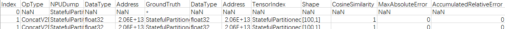
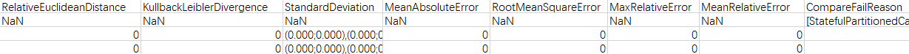

# Comparison of Dump Data Precision for Offline Models

## Overview

This document describes precision data comparison for traditional small models using a comparison tool. The tool can be used for comparison before and after ATC conversion of ONNX and TensorFlow models, comparison in TensorFlow training scenarios, and comparison between different versions of offline models.

## Preparations

**Environment Setup**

- Install msProbe by referring to [msProbe Installation Guide](../msprobe_install_guide.md).
- Install the matching CANN Toolkit and ops operator packages, and configure CANN environment variables. For details, see the *CANN Installation Guide*.

**Constraints**

Offline dump data of Caffe, ONNX, TensorFlow, and OM models is supported.

## Comparison of Dump Data Precision for Offline Models

**Function**

Compare offline model dump data precision.

**Precautions**

None

**Syntax**

```shell
msprobe compare -m offline_data -tp <target_path> -gp <golden_path> [-fr <fusion_rule_file>] [-cfr <close_fusion_rule_file>] [-qfr <quant_fusion_rule_file>] [-o <output_path>]
```

**Parameters**

| Parameter                | Mandatory (Yes/No)| Description                                                                                                                                            |
|---------------------|------------------------------------------------------------------------------------------------------------------------------------------------|------|
| -m | Yes| Comparison mode. The value **offline_data** indicates the offline data comparison scenario.|
| -tp or --target_path| Yes| Directory of data files generated during execution on the Ascend AI Processor. There are multiple dump data files in binary format. You need to specify their parent directory, for example, **$HOME/MyApp_mind/resnet50**. The **resnet50** folder is used to store the dump data files.<br><br>Training scenario:<br><br>TensorFlow can be used as the original training network for comparison.<br>During single-file comparison, you need to specify the directory where the data file is located.<br>If batch comparison on multiple dump data files is supported, you can specify **dump_path/time/** as a fixed path. Only TensorFlow can be used as the original training network for comparison. The fixed path can store multiple dump data files. Each dump data file must have a unique sub-path, which is named in the format of ***dump_path/time**/**device_id/model_name/model_id/dump_step/dump file***.|
| -gp or --golden_path| Yes| Directory for storing the data file of the original network running on the GPU/CPU.<br><br>There are multiple .npy files. You need to specify their parent directory, for example, **$HOME/Standard_caffe/resnet50**. The **resnet50** folder is used to store the .npy data files.<br><br>If **-cfr** is used, it specifies the directory of the dump data file generated after model conversion with operator fusion disabled.|
| -o or --output_path | No| Path of the comparison result. Defaults to the current path.<br><br>You are not advised to configure directories that are different from those of the current user to avoid privilege escalation risks.<br><br>Training scenario:<br><br>For single-file comparison, the result file is named in the `result_{timestamp}.csv` format.<br>For batch comparison, the result file is named in the `{device_id}_{model_name}_{dump_step}_result_{timestamp}.csv` format (multiple .csv result files are generated).|
| -fr or --fusion_rule_file| No| Network-wide information file.<br><br>Inference scenario:<br><br>A .json file converted from the .om model file using ATC, which contains the mapping between network-wide operators.<br>This option specifies the .json file generated during model conversion when operator fusion is enabled by default. To specify the .json file generated during model conversion when operator fusion is disabled, use the **-cfr** option.<br><br>Training scenario:<br><br>It is a .json file converted from the .txt graph file using ATC.<br>For single-file comparison, set this option to a specific .json file. For batch comparison, set this option to a directory where multiple .json files are stored.|
| -qfr or --quant_fusion_rule_file  | No | Quantization information file (.json file generated by Ascend model compression).<br><br>The quantization information file in .json format is generated through AMCT-based quantization. It contains the mapping between network-wide quantization operators and is used for operator matching during precision comparison.<br><br>In scenarios where comparison is performed between non-quantized original Caffe models and quantized offline models, either this option or the **-fr** option must be specified. In scenarios where comparison is performed between non-quantized original Caffe models and quantized original models, only this option is used.<br><br>This option is supported only in the inference scenario.|
| -cfr or --close_fusion_rule_file | No| Network-wide information file (a .json file converted from the .om model file using ATC, which contains the mapping between network-wide operators when operator fusion is disabled).<br><br> This option is supported only in the inference scenario.|

**Example**

1. Dump offline model data.

   You need to prepare the dump data of offline models running on GPU and NPU.

2. Compare dump data precision by running the following command.

   ```shell
   msprobe compare -m offline_data -tp ./data/target_path -gp ./data/golden_path -fr ./data/fusion_rule.json
   ```

**Output Description**

By default, the comparison result file `result_{timestamp}.csv` is generated in the path where the comparison command is executed.

## Comparison Result File Description

Example of `result_{timestamp}.csv`:





| Parameter| Description|
|------|------|
| Index | ID of an operator in a network model.|
| OpSequence | Sequence in which an operator runs during comparison on some operators. That is, ID of the operator in the network-wide information file specified by **-fr**.|
| OpType | Operator type. It is used to obtain the operator type when **-fr** is specified.|
| NPUDump | Operator name of the **My Output** model.|
| DataType | Data type of operators on the **NPU Dump** side.|
| Address | Memory address of the dump tensor, which detects memory faults of an operator. The address can be extracted only for network-wide comparison of dump data files generated during network running on the Ascend AI Processor.|
| GroundTruth | Operator name of the **Ground Truth** model.|
| DataType | Data type of operators on the **Ground Truth** side.|
| TensorIndex | Input ID and output ID of the operator that generates the dump data based on the Ascend AI Processor.|
| Shape | Shape of the compared tensor.|
| OverFlow | Overflow operator. **YES** indicates that overflow occurs on an operator. **NO** indicates that no overflow occurs on the operator. **NaN** indicates that overflow detection is not performed. This option is displayed when **-overflow_detection** is set.|
| CosineSimilarity | Result of the cosine similarity comparison. The value ranges from **-1** to **1**. A value closer to **1** indicates higher similarity.|
| MaxAbsoluteError | Result of the maximum absolute error comparison. The value ranges from **0** to infinity. A value closer to **0** indicates higher similarity.|
| AccumulatedRelativeError | Result of the accumulated relative error comparison. The value ranges from **0** to infinity. A value closer to **0** indicates higher similarity.|
| RelativeEuclideanDistance | Result of the Euclidean relative distance comparison. The value ranges from **0** to infinity. A value closer to **0** indicates higher similarity.|
| KullbackLeiblerDivergence | Result of the Kullback-Leibler divergence comparison. The value ranges from **0** to infinity. The smaller the Kullback-Leibler divergence, the closer the approximate distribution is to the true distribution.|
| StandardDeviation | Result of the standard deviation comparison. The value ranges from **0** to infinity. The smaller the standard deviation is, the smaller the dispersion is, and the closer the value is to the average value.|
| MeanAbsoluteError | Mean absolute error. The value ranges from **0** to infinity. If values of both **MeanAbsoluteError** and **RootMeanSquareError** are close to **0**, the measured value is more approximate to the actual value. If the value of **MeanAbsoluteError** is close to **0**, a larger value of **RootMeanSquareError** indicates that some values are excessively large. A larger value of **MeanAbsoluteError** and **RootMeanSquareError** value equal to or approximate to that of **MeanAbsoluteError** indicate that the overall deviation is more centralized. A larger value of **MeanAbsoluteError** and **RootMeanSquareError** value larger than that of **MeanAbsoluteError** indicate that the overall deviation exists and its distribution is scattered. Other situations do not exist because "RootMeanSquareError ≥ MeanAbsoluteError" is always true.|
| RootMeanSquareError | Root mean square error. The value ranges from **0** to infinity. If values of both **MeanAbsoluteError** and **RootMeanSquareError** are close to **0**, the measured value is more approximate to the actual value. If the value of **MeanAbsoluteError** is close to **0**, a larger value of **RootMeanSquareError** indicates that some values are excessively large. A larger value of **MeanAbsoluteError** and **RootMeanSquareError** value equal to or approximate to that of **MeanAbsoluteError** indicate that the overall deviation is more centralized. A larger value of **MeanAbsoluteError** and **RootMeanSquareError** value larger than that of **MeanAbsoluteError** indicate that the overall deviation exists and its distribution is scattered. Other situations do not exist because "RootMeanSquareError ≥ MeanAbsoluteError" is always true.|
| MaxRelativeError | Max. relative error. The value ranges from **0** to infinity. A value closer to **0** indicates higher similarity.|
| MeanRelativeError | Mean relative error. The value ranges from **0** to infinity. A value closer to **0** indicates higher similarity.|
| CompareFailReason | Cause of the comparison failure.<br><br>If the cosine similarity is **1**, check whether the input or output shapes of the operator are empty or all **1**. If the input or output shapes of the operator are empty or all **1**, the input or output of the operator is a scalar. In this case, the following message is displayed: "this tensor is scalar."|
