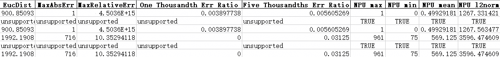
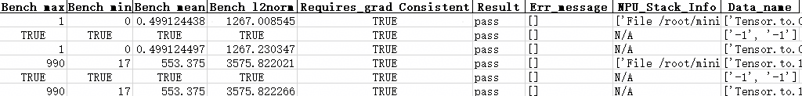
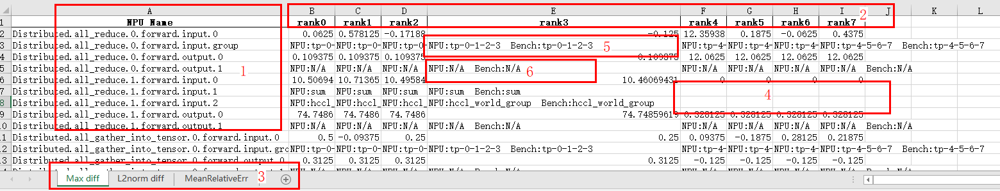

# Precision Comparison in PyTorch

## Overview

- This document describes how to compare CPU or GPU precision data with NPU precision data using command lines and comparison functions. Before performing precision comparison, you must first dump the precision data from both the CPU or GPU and the NPU. For details, see [Precision Data Collection in PyTorch](../dump/pytorch_data_dump_instruct.md).

- msProbe uses the subcommand `compare` to perform precision comparison, supporting both single-rank and multi-rank scenarios.

- Comparison functions are executed via a separate precision comparison script, supporting precision data comparison in both single-rank and multi-rank scenarios.

- The tool's comparison speed depends on data volume. For small volumes (single file under 10 GB), the speed is 0.1 GB/s; for larger volumes, it reaches 0.3 GB/s. An exclusive environment with 192 CPU cores and SSDs (I/O speed > 500 MB/s; HDDs provide only 60–170 MB/s) is recommended. If the user's environment performs below the recommended standard or is not exclusive, the comparison speed may be slower than expected. Comparison speed is calculated as the total size of the two files divided by the comparison time.

Application Scenarios

- The precision of a model decreases when it is ported from a CPU or GPU to an NPU. Faults can be located by comparing API computation values in an NPU with those in a CPU or GPU.
- The precision of a model decreases during each model, framework, or device iteration. Faults can be located by comparing API computation values before and after an iteration.
- In the preceding two scenarios, if there are APIs or modules that cannot be automatically matched, you can manually specify the APIs or modules to be compared to customize the mapping.

**Precautions**

- For some NPU APIs that do not have corresponding APIs on a CPU or GPU, their dump data is not compared.
- Calculation discrepancies between the NPU and CPU/GPU might accumulate over the course of model execution, leading to situations where the same API cannot be compared due to significant differences in input data.
- Identical APIs in the CPU/GPU and NPU might have differing calling counts, resulting in inability to compare or mismatched comparisons. However, this does not impact the overall operation, hence such APIs can be disregarded.

**API Matching Conditions**

During precision comparison, determine whether the CPU or GPU API can be compared with the NPU API. The following matching conditions must be met:

- The names of the two APIs are identical. The API naming convention is:`{api_type}.{api_name}.{number_of_api_calls}.{forward/backward}.{input/output}.{index}`, for example, `Functional.conv2d.1.backward.input.0`.
- The number of input and output tensors for the two APIs is the same.

Generally, if these two conditions are satisfied, the tool will consider them the same API, successfully perform API matching, and proceed with subsequent calculations.

## Preparations

**Environment Setup**

Install msProbe by referring to [msProbe Installation Guide](../msprobe_install_guide.md).

**Constraints**

Only the PyTorch scenario is supported.

## Model Precision Comparison

### Function

Use the command line tool to compare precision data and output the comparison result.

### Precautions

### Syntax

```shell
msprobe compare -tp <target_path> -gp <golden_path> [options]
```

### Parameters

| Parameter                               | Description                                                                                                                                                                              | Mandatory (Yes/No)|
|------------------------------------|----------------------------------------------------------------------------------------------------------------------------------------------------------------------------------| -------- |
| `-tp` or `--target_path`                 | `dump.json` path in the NPU environment (single-rank scenario) or dump directory (multi-rank scenario). The value is a string.                                                                                                                                   | Yes      |
| `-gp` or `--golden_path`                 | `dump.json` path in the CPU, GPU, or NPU environment (single-rank scenario) or dump directory (multi-rank scenario). The value is a string.                                                                                                                           | Yes      |
| `-o` or `--output_path`                  | Directory for storing the comparison result file. By default, an `output` directory is created in the current directory. The value is a string. The file name is automatically generated based on the timestamp in the format of `compare_result_{timestamp}.xlsx`.<br>Note: Files with the same name as the result file in the `output` directory will be deleted and overwritten.                                                     | No      |
| `-fm` or `--fuzzy_match`                 | Fuzzy matching. After this function is enabled, APIs at the same level on the network with the same name but different number of calls can be matched and compared. This function can be enabled by directly configuring this parameter. By default, this parameter is not configured, indicating that the function is disabled.                                                                                                            | No      |
| `-dm` or `--data_mapping`                | Custom mapping for comparison. You need to specify a custom mapping file in .yaml format. For details about the format of the custom mapping file, see [Data Mapping](#data-mapping). This parameter needs to be configured only in the [scenario where APIs and modules cannot be automatically matched](#apis-and-modules-cannot-be-automatically-matched). Only rank-by-rank comparison is supported.                                          | No      |
| `-cm` or `--cell_mapping`                | Module comparison across different platforms and configurations. If this parameter is configured, module comparison across different platforms and configurations is enabled. You can specify a custom mapping file in .yaml format. If no mapping file is specified, the mapping-based comparison is not performed. For details about the format of the custom mapping file, see [Cell Mapping](#cell-mapping). This parameter needs to be configured only in the scenario of [module comparison across different platforms and configurations](#module-comparison-across-different-platforms-and-configurations).| No      |
| `-da` or `--diff_analyze`                | Automatically identifies the first different node on the network and supports dump data such as MD5 and statistics. Single-rank and multi-rank scenarios are supported. This function can be enabled by directly configuring this parameter. By default, this parameter is not configured, indicating that the function is disabled.                                                                                                                 | No      |
| `-tensor_log` or `--is_print_compare_log`| Whether to enable log printing for a single module or API. Only the tensor data dumped by msProbe is supported. This function can be enabled by directly configuring this parameter. By default, this parameter is not configured, indicating that the function is disabled.                                                                                                           | No      |
| `--consistent_check`| Whether to enable verl training and inference consistency comparison. This function can be enabled by directly configuring this parameter. By default, this parameter is not configured, indicating that the function is disabled. This parameter needs to be configured only in the scenario of [verl training and inference consistency comparison](#verl-training-and-inference-consistency-comparison).                                                                                                  | No      |
| --backend | Training backend specified during verl training and inference consistency comparison. The value can be `fsdp` or `megatron`. `--consistent_check` must be configured first. If `--consistent_check` is not configured, `--backend` does not take effect.                                                                            | No      |

### Examples

#### Network-wide Comparison

This scenario includes comparison of API computation values in an NPU environment with those in a CPU or GPU environment and comparison of API computation values in one model with different iterations.

Both single-rank and multi-rank scenarios are supported. The dump data of multiple ranks can be compared at the same time. In multi-server scenarios, you need to perform the comparison operation on each server separately.

1. Dump the CPU, GPU, and NPU precision data by referring to [Precision Data Collection in PyTorch](../dump/pytorch_data_dump_instruct.md).

2. Example command:

   Single-rank scenario:

   ```shell
   msprobe compare -tp /target_dump/dump.json -gp /golden_dump/dump.json -o ./output
   ```

   Multi-rank scenario (`-tp` and `gp` need to be set to the step level, that is, the upper level of rank):

   ```shell
   msprobe compare -tp /target_dump/step0 -gp /golden_dump/step0 -o ./output
   ```
   
3. View the comparison results by referring to [Precision Comparison Result Analysis](#precision-comparison-result-analysis).

#### APIs and Modules Cannot Be Automatically Matched

If there are APIs and modules that cannot be automatically matched, you can provide a configuration file with custom mappings to inform the tool of the APIs or modules that can be matched for comparison.

1. In the [config.json](../../../python/msprobe/config.json) file, set `level` to `L0` or `L1`, set `task` to `tensor` or `statistics`, and specify the name of the API or module whose data needs to be dumped.

2. Dump the CPU, GPU, and NPU precision data by referring to [Precision Data Collection in PyTorch](../dump/pytorch_data_dump_instruct.md).

3. Run the following command:

   ```shell
   msprobe compare -tp /target_dump/dump.json -gp /golden_dump/dump.json -o ./output -dm data_mapping.yaml
   ```

   For details about how to configure the `data_mapping.yaml` file, see [Data Mapping](#data-mapping).

   Fuzzy match (`-fm`) is not supported in this scenario.

4. View the comparison results by referring to [Precision Comparison Result Analysis](#precision-comparison-result-analysis).

#### Module Comparison Across Different Platforms and Configurations

1. In the [config.json](../../../python/msprobe/config.json) file, set `level` to `L0` and `task` to `tensor` or `statistics`.

2. Dump the CPU, GPU, and NPU precision data by referring to [Precision Data Collection in PyTorch](../dump/pytorch_data_dump_instruct.md).

3. Run the following example command to perform the comparison.

   ```shell
   msprobe compare -tp /target_dump/dump.json -gp /golden_dump/dump.json -o ./output -cm cell_mapping.yaml
   ```

   For details about how to configure the `cell_mapping.yaml` file, see [Cell Mapping](#cell-mapping).

#### First Mismatched Operator Node Identification

In this scenario, the first mismatched operator node with precision issues is identified by analyzing the data saved by `msprobe dump` in the XPU and NPU environments.

Single-rank and multi-rank scenarios are supported. The dump data of multiple ranks can be compared at the same time.

Procedure:

1. In the [config.json](../../../python/msprobe/config.json) file, set `level` to `L0` or `L1`, set `task` to `tensor` or `statistics` (or set `summary_mode` to `md5`), and specify the name of the API or module whose data needs to be dumped.
2. Dump the CPU, GPU, and NPU precision data by referring to [Precision Data Collection in PyTorch](../dump/pytorch_data_dump_instruct.md).
3. Run the following command:
   Single-rank scenario:

   ```shell
   msprobe compare -tp /target_dump/dump.json -gp /golden_dump/dump.json -o ./output -da
   ```

   Multi-rank scenario (`-tp` and `gp` need to be set to the step level, that is, the upper level of rank):

   ```shell
   msprobe compare -tp /target_dump/step0 -gp /golden_dump/step0 -o ./output -da
   ```

4. View the comparison results. The `compare_result_rank{rank_id}_{timestamp}.json` and `diff_analyze_{timestamp}.json` files are generated in the specified output directory.
    - Directory structure

        ```ColdFusion
        output/
        ├── compare_result_rank0_{timestamp}.json
        ├── compare_result_rank1_{timestamp}.json
        ├── diff_analyze_{timestamp}.json
        ```

    - `compare_result_rank{rank_id}_{timestamp}.json` contains the rank comparison result, including the API or module name, comparison status, and comparison metrics.
    - `diff_analyze_{timestamp}.json` contains the identification result of the first mismatched operator node, including the operator node name, operator type, and operator location.

#### verl Training and Inference Consistency Comparison

In this scenario, thr training and inference data in the prefill phase of verl is compared.

> [!NOTE]NOTE
>
> - Currently, the L0 comparison of tensor data dumped by FSDP and Megatron backends is supported. The supported models include Qwen3-30B, Qwen3-32B, Qwen3-4B, and Qwen2.5-0.5B.
> - In this scenario, both training and inference data need to be dumped. Ensure that the dump paths for the two types of data are different; otherwise, the dump data will be overwritten. During comparison, `-tp` must be set to training data, and `-gp` must be set to inference data.
> - For details about verl, see the [official verl repository](https://github.com/verl-project/verl).

1. Preprocess your model and dump the training and inference precision data by referring to [Collecting Data for Verifying Data Consistency Between verl Training and Inference Based on FSDP](../dump/verl_fsdp_consistency_preprocess_dump.md) and [Collecting Data for Verifying Data Consistency Between verl Training and Inference Based on Megatron](../dump/verl_megatron_consistency_preprocess_dump.md).

2. Example command:

   Single-rank scenario:

   ```shell
   msprobe compare -tp /train_dump/dump.json -gp /infer_dump/dump.json --consistent_check --backend fsdp -o ./output
   ```

   Multi-rank scenario:

   ```shell
   msprobe compare -tp /train_dump/step0 -gp /infer_dump/step0 --consistent_check --backend fsdp -o ./output
   ```

   Considering the randomness of data splitting during training and inference in the multi-rank verl scenario, the training and inference dump data may be unevenly distributed across different ranks. In this case, single-rank comparison must be used. If the training and inference dump data on each rank is in one-to-one correspondence, you can directly specify the rank parent directory (step level) for multi-rank comparison.
   
3. View the comparison results by referring to [Precision Comparison Result Analysis](#precision-comparison-result-analysis).

#### Single-Point Data Comparison in Dynamic Graphs

Applicable scenario: compare data saved at a single point in the CPU or GPU and NPU environment.

Single-point data comparison supports single-rank and multi-rank comparison. In multi-server scenarios, you need to perform the comparison operation on each server separately.

1. Collect single-point data in dynamic graphs of the CPU or GPU and NPU by referring to [Single-Point Saving Tool](../dump/debugger_save_instruct.md).

2. Example command:

   Single-rank scenario:

   ```shell
   msprobe compare -tp /target_dump/debug.json -gp /golden_dump/debug.json -o ./output
   ```

   Multi-rank scenario (`-tp` and `gp` need to be set to the step level, that is, the upper level of rank):

   ```shell
   msprobe compare -tp /target_dump/step0 -gp /golden_dump/step0 -o ./output
   ```

3. View the comparison results by referring to [Precision Comparison Result Analysis](#precision-comparison-result-analysis).

### Output Description

After the comparison is complete, the message `msprobe compare ends successfully.` is displayed.

- Single-rank scenario: An .xlsx file is generated in the configured output path. The file name is automatically generated based on the timestamp in the format of `compare_result\_{timestamp}.xlsx`.

- Multi-rank scenario: Multiple .xlsx files are generated in the configured output path. The file name is automatically generated based on the timestamp in the format of `compare_result_rank{rank_id}_{timestamp}.xlsx`.

- First mismatched operator node identification scenario:

  `Saving json file to disk: /output_path/compare_result_rank{rank_id}\_{timestamp}.json` and `The analyze result is saved in: /output_path/diff_analyze\_{timestamp}.json` are displayed when the identification is complete.

  Multiple .json files are generated in the configured output path. The file names are automatically generated based on the timestamp in the format of `compare_result_rank{rank_id}\_{timestamp}.json` and `diff_analyze_{timestamp}.json`.

- Single-point data comparison in dynamic graphs:
  
  An .xlsx file is generated in the configured output path. The file name is automatically generated based on the timestamp in the format of `debug_compare_result_(rank_id/proc_id)_{timestamp}.xlsx`.

### Output File Description

#### Precision Comparison Result Analysis

PyTorch precision comparison uses the CPU or GPU computation result as the benchmark to determine whether APIs have precision issues based on precision evaluation metrics.

The `compare_result_{timestamp}.xlsx` file lists the details and comparison results of all APIs on which precision comparison is performed. Examples:






**Note**: In the comparison result file, you can identify suspicious operators by checking the comparison result (`Result`) and error messages (`Err_Message`). However, since each metric has its own evaluation criteria, make judgments based on actual circumstances.

#### Metric Description

API precision can be evaluated in three modes: real data mode, statistics mode, and MD5 mode. The comparison results of these modes have different table headers.

The three modes indicate different types of collected data. For details about data collection, see [Precision Data Collection in PyTorch](../dump/pytorch_data_dump_instruct.md).

Real data mode: During data collection, the `task` field in the `config.json` file is set to `tensor`, and flushed statistics and full tensors are collected.

Statistics mode: During data collection, the `task` field in the `config.json` file is set to `statistics`, and the `summary_mode` field is set to `statistics`. Only flushed statistics are collected.

MD5 mode: During data collection, the `task` field in the `config.json` file is set to `statistics`, and the `summary_mode` field is set to `md5`. Only flushed statistics and MD5 values are collected.

**Common table headers**:

|Data Dump Mode|NPU Name (NPU API Name)| Bench Name (Bench API Name)|NPU Dtype (NPU Data Type)| Bench Dtype (Bench Data Type)|NPU Tensor Shape| Bench Tensor Shape| NPU Requires_grad (Gradient Computation for NPU Tensors)| Bench Requires_grad (Gradient Computation for Bench Tensors)|
|:-:|:-:|:--------------------------:|:-:|:------------------------:|:-:|:-------------------------------:|:------------------------------------:|:----------------------------------------:|
|Real data mode|√|             √              |√|            √             |√|                √                |                  √                   |                    √                     |
|Statistics mode|√|             √              |√|            √             |√|                √                |                  √                   |                    √                     |
|MD5 mode|√|             √              |√|            √             |√|                √                |                  √                   |                    √                     |

**Customized table headers**:

There are four types of statistics: maximum value (max), minimum value (min), mean, and L2 norm.

|Data Dump Mode|Cosine (Tensor Cosine Similarity)|EucDist (Tensor Euclidean Distance)|MaxAbsErr (Tensor's Max. Absolute Error)|MaxRelativeErr (Tensor's Max. Relative Error)|One Thousandth Err Ratio|Five Thousandth Err Ratio| Absolute Error Diff Between NPU and Bench Statistics (max, min, mean, L2 norm)| RelativeErr Between NPU and Bench Statistics (max, min, mean, L2 norm)| NPU and Bench Statistics (max, min, mean, L2 norm)|NPU MD5 (NPU Data CRC-32 Value)|BENCH MD5 (Bench Data CRC-32 Value)| Requires_grad Consistent| Result|Err_message|NPU_Stack_Info| Data_Name ([NPU Real Data, Bench Real Data])|
|:---:|:---:|:---:|:---:|:---:|:---:|:---:|:---------------------------------------------------:|:----------------------------------------------------------:|:------------------------------------------:|:---:|:---:|:-----------------------------------:|:-------------:|:---:|:---:|:---------------------------------:|
|Real data mode|√|√|√|√|√|√|                                                     |                                                            |                     √                      |||                  √                  | √ |√|√|                 √                 |
|Statistics mode|||||||                          √                          |                             √                              |                     √                      |||                  √                  |       √       |√|√|                                   |
|MD5 mode|||||||                                                     |                                                            |                                            |√|√|                  √                  |      √        |√|√|                                   |

#### Comparison Metric Calculation Formulas

$N$: NPU tensor

$B$: Bench tensor

RE (relative error): $\vert\frac {N-B} {B}\vert$ 

Real data mode:

Cosine: $\frac {{N}\cdot{B}} {{\vert\vert{N}\vert\vert}_2{\vert\vert{B}\vert\vert}_2}$

EucDist: ${\vert\vert{A-B}\vert\vert}_2$

MaxAbsErr: $max(\vert{N-B}\vert)$

MaxRelativeErr: $max(RE)$

One Thousandth Err Ratio: $\frac {\sum\mathbb{I}(RE<0.001)} {size(RE)}$

Five Thousandth Err Ratio: $\frac {\sum\mathbb{I}(RE<0.005)} {size(RE)}$

Statistics mode:

Max diff: $max(N)-max(B)$

Min diff: $min(N)-min(B)$

Mean diff: $mean(N)-mean(B)$

L2 Norm diff: $l2norm(N)-l2norm(B)$

MaxRelativeErr: $\vert\frac{max(N)-max(B)}{max(B)}\vert*100\%$

MinRelativeErr: $\vert\frac{min(N)-min(B)}{min(B)}\vert*100\%$

MeanRelativeErr: $\vert\frac{mean(N)-mean(B)}{mean(B)}\vert*100\%$

NormRelativeErr: $\vert\frac{l2norm(N)-l2norm(B)}{l2norm(B)}\vert*100\%$

#### Comparison Result

Comparison results are classified into three types: pass, warning, and error. The priority is error > warning > pass.

The `Err_message` column displays comparison error messages, including:

Errors:

1. (Real data/Statistics mode) The maximum or minimum NPU value of an API or module contains `nan`, `inf`, or `-inf`. If the same phenomenon occurs in Bench metrics, ignore this error.
2. (Real data mode) `One Thousandth Err Ratio` of an API or module's `input/parameters` is greater than 0.9 and `output` is less than 0.6. (Only the output is marked, and the input is used for calculation.)
3. (Statistics mode) The relative error of the norm value of an API or module's `input` is less than 0.1, and that of `output` is greater than 0.5. (Only the output is marked, and the input is used for calculation.)
4. (Real data/Statistics mode) `Requires_grad` (for gradient calculation) of an API or module is inconsistent.
5. (Real data/Statistics mode) Non-tensor scalars of an API or module are inconsistent.
6. (MD5 mode) The CRC-32 value of an API or module is inconsistent.
7. (Real data/Statistics mode) `dtype` of an API or module is inconsistent.
8. (Real data/Statistics mode) The shape of an API or module is inconsistent.

Warnings:

1. (Statistics mode) The relative error of the norm value of an API or module's `output` is 10 times that of `input` or `parameters`. (Only the output is marked, and the input is used for calculation.)
2. (Real data mode) The cosine of an API or module's `input`/`parameters` is greater than 0.9 and the difference between `input`/`parameters` and `output` is greater than 0.1. (Only the output is marked, and the input is used for calculation.)
3. (MD5 mode) The parameters of an API or module do not match.

Special scenarios:

1. The metric rules that involve using the input for calculation are not applicable to API inputs with placeholders, including `['_reduce_scatter_base', '_all_gather_base', 'all_to_all_single', 'batch_isend_irecv']`.
2. All metrics are not applicable to redundant APIs, including `['empty', 'empty_like', 'numpy', 'to', 'setitem', 'empty_with_format', 'new_empty_strided', 'new_empty', 'empty_strided']`.

#### Precision Evaluation Metrics Analysis

1. `Cosine`: Cosine similarity measures the similarity between two vectors, where a value approaching 1 indicates greater similarity. The acceptance threshold is greater than 0.99. NaN values may occur during computation, mainly because one of the vectors may be 0.

2. `EucDist`: Euclidean distance measures the similarity between two vectors, defined as the absolute distance between two points in a multi-dimensional space. A value closer to 0 indicates greater tensor similarity, while a larger value indicates a greater difference.

3. `MaxAbsErr`: A maximum absolute error closer to 0 indicates a smaller computation error. The acceptable threshold is less than 0.001.

4. `MaxRelativeErr`: A maximum relative error closer to 0 indicates a smaller computation error.

   If the dump data contains 0 or NaN, it is normal that the maximum relative error in the comparison result is inf or NaN.

5. `One Thousandth Err Ratio` (proportion of elements with a relative error less than 0.1%) and `Five Thousandth Err Ratio` (proportion of elements with a relative error less than 0.5%): percentage of elements in the NPU's tensor for which the relative error, when compared element-wise against the corresponding benchmark data, is less than 0.1% and less than 0.5%, respectively. These two metrics are used only as a reference for the precision degradation trend and are not used to determine whether the precision meets the requirements.

## Multi-Rank Data Aggregation

### Function

This function extracts and summarizes communication operator data from the comparison results in multi-rank comparison scenarios, and outputs a sorted multi-rank precision comparison table for communication operators.<br>
Application scenario:<br>
The precision comparison has been completed, and the multi-rank precision comparison result has been obtained. However, the communication operator data is distributed in multiple result files, which is inconvenient for analyzing precision issues. This function can be used to aggregate multi-rank communication operator data, reducing the time required for fault locating.

### Precautions

MD5 comparison results are not supported.

### Syntax

```bash
msprobe merge_result -i <input_dir> -o <output_dir> -config <config-path>
```

### Parameters

| Parameter                | Description                                                                                                               | Mandatory (Yes/No)|
| --------------------- |-------------------------------------------------------------------------------------------------------------------| -------- |
| `-i` or `--input_dir`     | Directory for storing multi-rank comparison results, that is, the output directory of the comparison results generated by `compare`. The value is of the string type. All comparison results must be either actual data comparison results or statistical data comparison results; otherwise, the aggregated data may be incomplete.                                  | Yes      |
| `-o` or `--output_dir`    | Directory for storing the data extraction and aggregation results. The value is of the string type. The file name is automatically generated based on the timestamp in the format of `multi_ranks_compare_merge_{timestamp}.xlsx`.<br>Note: Files with the same name as the result file in the `output` directory will be deleted and overwritten.| Yes      |
| `-config` or `--config-path`| Path of the YAML file that specifies the APIs whose data needs to be aggregated and comparison metrics. The value is of the string type.<br>For details about the file, see [YAML File Description](#yaml-file-description) below.                                                | Yes      |

### YAML File Description

The following uses the `config.yaml` file as an example:

```yaml
api:
- Distributed.all_reduce
- Distributed.all_gather_into_tensor
compare_index:
- Max diff
- L2norm diff
- MeanRelativeErr
```

| Parameter       | Description                                                        |
| ------------- | ------------------------------------------------------------ |
| `api`          | Name of the API or module whose data is to be aggregated. If this parameter is not set, the tool displays an error message.<br>The API name format is `{api_type}.{api_name}.{number_of_api_calls}.{forward/backward}`.<br>The preceding four fields must be configured in sequence. You can configure them in the following combinations:<br>        `{api_type}`<br>        `{api_type}.{api_name}`<br>        `{api_type}.{api_name}.{number_of_api_calls}`<br>        `{api_type}.{api_name}.{number_of_api_calls}.{forward/backward}`<br>`api` here refers to an API or module.|
| `compare_index`| Comparison metric to be aggregated. The value of `compare_index` must be a subset of the comparison metrics corresponding to `dump_mode`. If this parameter is not set, the tool automatically extracts all comparison metrics corresponding to `dump_mode` based on the comparison results for aggregation.<br>Comparison metrics in statistics mode: `Max diff`, `Min diff`, `Mean diff`, `L2norm diff`, `MaxRelativeErr`, `MinRelativeErr`, `MeanRelativeErr`, `NormRelativeErr`, and `Requires_grad Consistent`<br>Comparison metrics in real data mode: Cosine, EucDist, MaxAbsErr, MaxRelativeErr, One Thousandth Err Ratio, Five Thousandth Err Ratio and `Requires_grad Consistent`|

### Example

```bash
msprobe merge_result -i ./input_dir -o ./output_dir -config ./config.yaml
```

### Output Description

An .xlsx file is generated in the configured output path. The file name is automatically generated based on the timestamp in the format of `multi_ranks_compare_merge_{timestamp}.xlsx`.

### Output File Description

The multi-rank data aggregation result is as follows:



1. `NPU Name` indicates the name of an API or module.
2. `rank*` contains multi-rank data.
3. Data of different comparison metrics is displayed on different sheets.
4. If no API or module data is found on a rank, the aggregation result will be blank.
5. If the comparison metric value is `N/A`, `unsupported` or `NaN`, the comparison metric value cannot be calculated. In this case, the aggregation result will be displayed as `NPU: NPU Max. value Bench: Bench Max. value`.
6. In the example shown in the figure, `NPU:N/A` and `Bench:N/A` indicate that the output is `None`.

<br>
To view group data based on group information, perform the following steps:

Take `Distributed.all_reduce.0.forward` as an example. This API performs a multi-rank data reduction operation and outputs the result within a group. The output within the same group is consistent.<br>In this API, ranks 0 to 3 form a group, which is displayed as `tp-0-1-2-3` for `Distributed.all_reduce.0.forward.input.group` and the output of ranks 0 to 3 is consistent. Ranks 4 to 7 form another group, which is displayed as `tp-4-5-6-7`, and the output of ranks 4 to 7 is consistent.<br>In addition to this format, a group can also be presented in the form of `[0, 1, 2, 3]`.

<br>
Expected results of common communication APIs:

1. `Distributed.all_gather`: multi-rank data aggregation. The input of each rank can be different, but the output within the same group is consistent. The output is a tensor list.
2. `Distributed.all_gather_into_tensor`: multi-rank data aggregation. The input of each rank can be different, but the output within the same group is consistent. The output is a tensor.
3. `Distributed.all_reduce`: multi-rank data reduction operation. The input of each rank can be different, but the output within the same group is consistent. The output is the reduction result.
4. `Distributed.reduce_scatter`: multi-rank data reduction operation. The input of each rank can be different, and the output is different parts of the reduction result within the group. The input is a tensor list.
5. `Distributed.reduce_scatter_tensor`: multi-rank data reduction operation. The input of each rank can be different, and the output is different parts of the reduction result within the group. The input is a tensor.
6. `Distributed.broadcast`: The input is the data to be broadcast, and the output is the broadcast data.
7. `Distributed.isend`: point-to-point communication. The input is the data to be sent, and the output is the sent data.
8. `Distributed.irecv`: point-to-point communication. The input is the original data, and the output is the received new data.
9. `Distributed.all_to_all_single`: The output data is the result of data splitting and merging on all ranks.

## Appendixes

### Data Mapping

The file name is the format of `.yaml`. The asterisk (*) indicates the file name, which can be customized.

File content format:

```yaml
# API
{api_type}.{api_name}.{number_of_api_calls}.{forward/backward}.{input/output}.{parameter_index}: {api_type}.{api_name}.{number_of_api_calls}.{forward/backward}.{input/output}.{parameter_index}
# Module
{Module}.{module_name}.{forward/backward}.{index}.{input/output}.{parameter_index}: {Module}.{module_name}.{forward/backward}.{index}.{input/output}.{parameter_index}
```

The left and right sides of the colon (:) represent API and module names from different versions of the PyTorch framework or different chip environments, respectively.

You can obtain the API and module names from the `dump.json` file in [Precision Data Collection in PyTorch](../dump/pytorch_data_dump_instruct.md).

The following is an example of the file content:

```yaml
# API
NPU.npu_fusion_attention.4.forward.input.0: NPU.npu_fusion_attention.4.forward.input.0
# Module
Module.module.language_model.embedding.word_embedding.VocabParallelEmbedding.forward.0.input.0: Module.module.language_model.embedding.word_embedding.VocabParallelEmbedding.forward.0.input.0
```

If the `dump.json` file contains the `data_name` field, the API and module names are the `data_name` field with the file name extension removed, as shown in the red box in the following figure.


If the `dump.json` file does not contain the `data_name` field, the naming rules are as follows:

The naming rules for `input_args`, `input_kwargs`, and `output` are the same. If the value is of the list type, add `.{index}` to the end of the name. If the value is of the dict type, add `.{key}` to the end of the name. If the value is a specific tensor, null, int, float, bool, or an empty list/dict, the naming ends.

The following uses an API dump file as an example:

```yaml
  "Functional.max_pool2d.0.forward": {
   "input_args": [
    {
     "type": "torch.Tensor",
     "dtype": "torch_float32",
     "shape": [
      1,
      64,
      14,
      14
     ],
     "Max": xxx,
     "Min": xxx,
     "Mean": xxx,
     "Norm": xxx,
     "requires_grad": true
    },
    {
     "type": "int",
     "value": 3
    },
    {
     "type": "int",
     "value": 2
    },
    {
     "type": "int",
     "value": 1
    },
    {
     "type": "int",
     "value": 1
    }
   ],
   "input_kwargs": {
    "ceil_mode": {
     "type": "bool",
     "value": false
    },
    "return_indices": {
     "type": "bool",
     "value": false
    },
   },
   "output": [
    {
     "type": "torch.Tensor",
     "dtype": "torch.float32",
     "shape": [
     1,
     64,
     7,
     7
     ],
     "Max": xxx,
     "Min": xxx,
     "Mean": xxx,
     "Norm": xxx,
     "requires_grad": true
    }
   ]
  }
```

The initial name is `Functional.max_pool2d.0.forward. input_args` is a list with a length of 5. The 0th item is followed by `Tensor`, and the naming ends. The 1st to 4th items are followed by `int`, and the naming ends. According to the naming rules, the following names can be obtained:

```ColdFusion
Functional.max_pool2d.0.forward.input.0
Functional.max_pool2d.0.forward.input.1
Functional.max_pool2d.0.forward.input.2
Functional.max_pool2d.0.forward.input.3
Functional.max_pool2d.0.forward.input.4
```

`input_kwargs` is a `dict`. The keys are `ceil_mode` and `return_indices`, and the values are `bool` The naming ends.

```ColdFusion
Functional.max_pool2d.0.forward.input.ceil_mode
Functional.max_pool2d.0.forward.input.return_indices
```

`output` is a list with a length of 1, the 0th item is followed by `Tensor`, and the naming ends. According to the naming rules, the following name can be obtained:

```ColdFusion
Functional.max_pool2d.0.forward.output.0
```

In conclusion, the generated `op_name` is

```ColdFusion
Functional.max_pool2d.0.forward.input.0
Functional.max_pool2d.0.forward.input.1
Functional.max_pool2d.0.forward.input.2
Functional.max_pool2d.0.forward.input.3
Functional.max_pool2d.0.forward.input.4
Functional.max_pool2d.0.forward.input.ceil_mode
Functional.max_pool2d.0.forward.input.return_indices
Functional.max_pool2d.0.forward.output.0
```

### Cell Mapping

The file name is the format of `\*.yaml`. The asterisk (*) indicates the file name, which can be customized.

The content of the mapping file can be defined in two formats: mapping by module name and mapping by string in the module name.<br>
The two formats can be configured in the same file. If both formats are configured for the same module, mapping by module name is used.

**Mapping by Module Name**

Extract `{module_name}.{class_name}` for mapping, as shown below:

```yaml
{module_name}.{class_name}: {module_name}.{class_name}
```

`{module_name}.{class_name}` on the left side of the colon represents a module in the NPU environment, and `{module_name}.{class_name}` on the right side of the colon represents a module in the CPU, GPU, or NPU environment.

- Obtain `{module_name}.{class_name}` from the name of the module-level dump file (.npy). The naming format is:<br>
Module.{module_name}.{class_name}.{forward/backward}.{index}.{input/output}.{parameter_index/parameter_name}<br>
Or<br>
Module.{module_name}.{class_name}.parameters_grad.{parameter_name}

The following is an example of the file content:

```yaml
fc2.Dense: fc2.Linear
conv1.Conv2d: conv3.Conv2d
```

Mapping by String in the Module Name

Extract any string from `{module_name}.{class_name}` for mapping, as shown below:

```yaml
{target_str1}: {golden_str1}
{target_str2}: {golden_str2}
```

The following is an example of the file content:

```yaml
MindSpeedTELayerNormColumnParallelLinear: TELayerNormColumnParallelLinear
RowParallelLinear: TERowParallelLinear
```

Only the first string in `{module_name}.{class_name}` is mapped.
