# Graph Comparison in Hierarchical Visualization (PyTorch)

## Overview

This function parses the precision data dumped by msProbe, restores the model graph structure, and compares the precision data at each model layer, helping you understand the model structure and analyze precision issues.

**Concepts**

- msProbe: short for MindStudio Probe, is a precision debugging toolkit that can locate precision issues during model training or inference.
- dump: a process of collecting precision data.

**Usage Process**

1. Install the tool and collect data. For details, see [Preparations](#preparations).
2. Use the command line tool to generate a graph structure file. For details, see [Hierarchical Visualization Overview](#hierarchical-visualization-overview).
3. Start the TensorBoard service. For details, see [Starting TensorBoard](#starting-tensorboard).
4. Use a browser to view the graph structure and analyze the model structure and precision data. For details, see [Viewing Results in Browser](#viewing-results-in-browser).

**Tool Features**

- Supports model structure reconstruction.
- Supports comparison of the structure differences between two models.
- Supports comparison of the precision data between two models.
- Supports overflow/underflow detection of model data.
- Supports batch graph construction in multi-rank scenarios, associates communication nodes of each rank, and analyzes data transfer among ranks.
- Supports node name search, node filtering based on precision comparison results, and node filtering based on overflow/underflow detection results; automatically expands the level where a node is located.
- Supports cross-suite model comparison.
- Supports precision data comparison between two models under different [parallelism policies](#graph-merging-under-different-parallelism-policies).
- Supports visualized conversion of dump data on the browser page: [Visualized Dump Data Conversion](#visualized-dump-data-conversion).

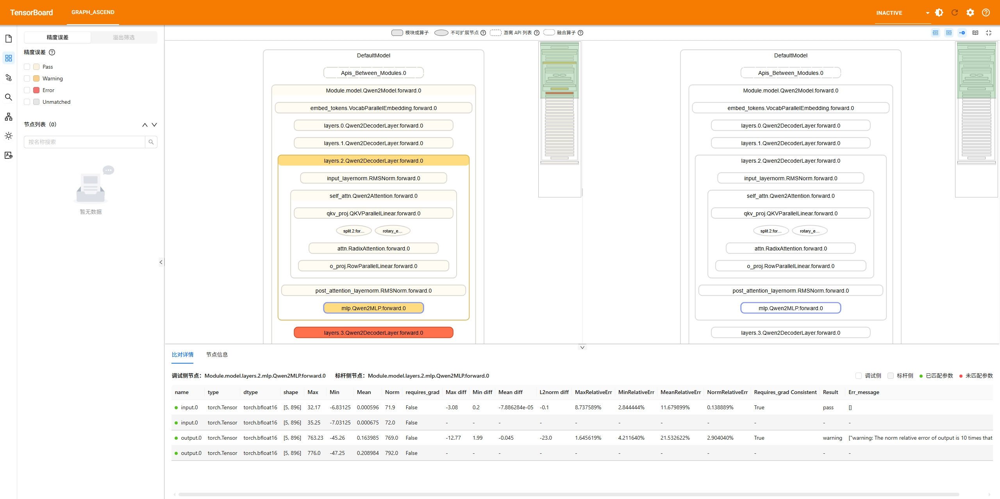

## Preparations

**Environment Setup**

Install msProbe by referring to [msProbe Installation Guide](../msprobe_install_guide.md).

If you choose to compile and install msProbe, you must configure `--include-mod tb_graph_ascend` in the compilation command to build the hierarchical visualization plugin.

> **Note**: msProbe has integrated tb_graph_ascend. If an earlier version of tb_graph_ascend has been installed in the current environment, run the `pip uninstall tb_graph_ascend` command to uninstall it to avoid conflicts.

**Data Preparation**

Collect model structure data: Set `level` to `L0` (module information) or `mix` (module and API information). The content of the collection result file `construct.json` cannot be empty. For details, see [Precision Data Collection in PyTorch](../dump/pytorch_data_dump_instruct.md).

**Constraints**

- Only the PyTorch framework is supported.
- For details about supported PyTorch versions, see [Release Notes](../release_notes.md).

## Hierarchical Visualization Overview

### Single-Graph Construction

**Function**

Displays the model structure, precision data, and stack information, and provides the overflow/underflow detection function. It is applicable to scenarios where the model structure and data overflow/underflow need to be analyzed.

**Precautions**

The model structure data to be collected must be available. Ensure that the dump level is set to `L0` (module information) or `mix` (module and API information). The content of the collection result file `construct.json` cannot be empty.

**Syntax**

```bash
msprobe graph_visualize -tp <target_path> -o <output_path> [-oc] [-tensor_log] [-progress_log]
```

**Parameters**

| Parameter                                | Mandatory (Yes/No)| Description                                                        |
| -------------------------------------- | --------- | ------------------------------------------------------------ |
| `-tp` or `--target_path`                    | Yes     | Comparison path on the debugging side. The value is of the string type. The tool automatically performs single-rank build, multi-rank batch build, or multi-step batch build based on the path format.|
| `-o` or `--output_path`                     | Yes     | Directory for storing the graph construction result file. The value is of the string type. The file name is automatically generated based on the timestamp in the format of `build_{timestamp}.vis.db`.|
| `-oc` or `--overflow_check`                 | No     | Whether to enable overflow/underflow detection. After it is enabled, the overflow/underflow level of each overflowed/underflowed node is marked in the output .db file (`build_{timestamp}.vis.db`). If this parameter is configured, the function is enabled. By default, this parameter is not configured.|
| `-tensor_log` or `--is_print_compare_log`   | No     | Whether to enable log printing for a single module or API. Only the tensor data dumped by msProbe is supported. If this parameter is configured, the function is enabled. By default, this parameter is not configured.|
| `-progress_log` or `--is_print_progress_log`| No     | Whether to enable log printing for the detailed task progress. If this parameter is configured, the function is enabled. By default, this parameter is not configured.|

Example 1: Construct a single-rank graph.

```bash
msprobe graph_visualize -tp ./target_path/step0/rank0 -o ./output_path
```

-The `-tp` format must comply with the single-rank format listed in [Dump File Requirements for Graph Construction in Hierarchical Visualization](#dump-file-requirements-for-graph-construction-in-hierarchical-visualization).

Example 2: Construct multi-rank graphs in batches.

```bash
msprobe graph_visualize -tp ./target_path/step0 -o ./output_path
```

-The `-tp` format must comply with the multi-rank format listed in [Dump File Requirements for Graph Construction in Hierarchical Visualization](#dump-file-requirements-for-graph-construction-in-hierarchical-visualization).

Example 3: Construct multi-step graphs in batches.

```bash
msprobe graph_visualize -tp ./target_path -o ./output_path
```

-The `-tp` format must comply with the multi-step format listed in [Dump File Requirements for Graph Construction in Hierarchical Visualization](#dump-file-requirements-for-graph-construction-in-hierarchical-visualization).

Example 4: Perform overflow/underflow detection on a single graph.

```bash
msprobe graph_visualize -tp ./target_path -o ./output_path -oc
```

In the output result, each graph node is marked with an overflow/underflow detection metric. The metrics are as follows:

- `medium`: abnormal input; normal output
- `high`: abnormal input; abnormal output. The norm value of the output is abnormally larger than that of the input.
- `critical`: normal input; abnormal output

**Output Description**

In the configured output path, a `.vis.db` file is generated. The file name is automatically generated based on the timestamp in the format of `build_{timestamp}.vis.db`.

### Dual-Graph Comparison

**Function**

Displays model structure, structural differences, precision data, precision comparison metrics, and suspected precision issues (where larger differences in precision metrics appear in deeper colors). Additionally, cross-suite comparison, overflow/underflow detection, and fuzzy matching are supported.

Currently, three types of dump data are supported. The hierarchical visualization tool automatically determines the data type during comparison:

1. Statistics: Only the input and output data statistics of APIs and modules are dumped, which occupies a small amount of drive space.
2. Real data (tensor): The input and output data statistics of APIs and modules are dumped, with tensors saved to drive. This type consumes significant drive space but provides more accurate comparison results.
3. MD5: The input and output data statistics and CRC-32 information of APIs and modules are dumped.

For details about how to configure the dump type, see [Configuration File Introduction](../dump/config_json_introduct.md).

**Precautions**

The model structure data to be collected must be available. Ensure that the dump level is set to `L0` (module information) or `mix` (module and API information). The content of the collection result file `construct.json` cannot be empty.

**Syntax**

```bash
msprobe graph_visualize -tp <target_path> -gp <golden_path> -o <output_path> [-lm] [-oc] [-fm] [-tensor_log] [-progress_log]
```

**Parameters**

| Parameter                   | Mandatory (Yes/No)| Description                                                                                                                                                                                                                                                                                                                                                                                                                                                                                     |
|------------------------| -------- |-----------------------------------------------------------------------------------------------------------------------------------------------------------------------------------------------------------------------------------------------------------------------------------------------------------------------------------------------------------------------------------------------------------------------------------------------------------------------------------------|
| `-tp` or `--target_path`   | Yes    | Comparison path on the debugging side. The value is of the string type. The tool automatically performs single-rank comparison, multi-rank batch comparison, or multi-step batch comparison based on the path format.                                                                                                                                                                                                                                                                                                                                                                                                                       |
| `-gp` or `--golden_path`   | No (Mandatory in the dual-graph comparison scenario)    | Comparison path on the benchmark side. The value is of the string type. If this parameter is not set, single-graph construction is performed.                                                                                                                                                                                                                                                                                                                                                                                                                                                        |
| `-o` or `--output_path`    | Yes    | Directory for storing the graph construction result file. The value is of the string type. The file name is automatically generated based on the timestamp in the format of `compare_{timestamp}.vis.db`.                                                                                                                                                                                                                                                                                                                                                                                                                    |
| `-lm` or `--layer_mapping` | No    | Cross-suite comparison, for example, comparison of a model that uses both the DeepSpeed and Megatron suites. If this parameter is configured, cross-suite layer comparison is enabled. After the layers in the model code are specified, the corresponding modules or APIs of the dump data can be identified. You need to specify a custom mapping file in .yaml format. For details about the format and configuration of the custom mapping file, see [Custom Layer Mapping File](#custom-layer-mapping-file) and [Configuring Layer Mapping for Hierarchical Model Visualization](../examples/layer_mapping_example.md). After this parameter is configured, comparison is performed only by node name, and the type and shape of a node are ignored.<br><br>Node naming format: `{Module}.{module_name}.{class_name}.{forward/backward}.{number_of_calls}`<br>&#8226; If the values of `module_name` are different, specify a custom mapping file using the `-lm` parameter, for example, `-lm mapping.yaml`.<br>&#8226; If the values of `module_name` are the same but the values of `class_name` are different, directly configure the `-lm` parameter.<br>&#8226; If the values of `module_name` and `class_name` are the same, you do not need to configure the `-lm` parameter.<br><br>For details, see [Data Collection and Automatic Comparison in MindSpeed and LLamaFactory](../examples/mindspeed_llamafactory_mapping_example.md).|
| `-oc` or `--overflow_check`| No    | Whether to enable overflow/underflow detection. After it is enabled, the overflow/underflow level of each overflowed/underflowed node is marked in the output .db file (`compare_{timestamp}.vis.db`). If this parameter is configured, the function is enabled. By default, this parameter is not configured.                                                                                                                                                                                                                                                                                                                                                                                              |
| `-fm` or `--fuzzy_match`   | No    | Whether to enable fuzzy matching. If this parameter is configured, the function is enabled. By default, this parameter is not configured. For details about the differences between fuzzy matching and default matching, see [Matching Description](#matching-description).                                                                                                                                                                                                                                                                                                                                                                                                                           |
| `-tensor_log` or `--is_print_compare_log`   | No                      | Whether to enable log printing for a single module or API. Only the tensor data dumped by msProbe is supported. If this parameter is configured, the function is enabled. By default, this parameter is not configured.|
| `-progress_log` or `--is_print_progress_log`| No| Whether to enable log printing for the detailed task progress. If this parameter is configured, the function is enabled. By default, this parameter is not configured.|

Example 1: Perform single-rank graph comparison.

```bash
msprobe graph_visualize -tp ./target_path/step0/rank0 -gp ./golden_path/step0/rank0 -o ./output_path
```

-The `-tp` and `-gp` formats must comply with the single-rank format listed in [Dump File Requirements for Graph Construction in Hierarchical Visualization](#dump-file-requirements-for-graph-construction-in-hierarchical-visualization).

Example 2: Perform multi-rank batch graph comparison.

```bash
msprobe graph_visualize -tp ./target_path/step0 -gp ./golden_path/step0 -o ./output_path
```

-The `-tp` and `-gp` formats must comply with the multi-rank format listed in [Dump File Requirements for Graph Construction in Hierarchical Visualization](#dump-file-requirements-for-graph-construction-in-hierarchical-visualization).

Example 3: Perform multi-step batch graph comparison.

```bash
msprobe graph_visualize -tp ./target_path -gp ./golden_path -o ./output_path
```

-The `-tp` and `-gp` formats must comply with the multi-step format listed in [Dump File Requirements for Graph Construction in Hierarchical Visualization](#dump-file-requirements-for-graph-construction-in-hierarchical-visualization).

Example 4: Perform cross-suite comparison.

If the node names on the debugging side are the same as those on the benchmark side, specify only the `-lm` parameter.

```bash
msprobe graph_visualize -tp ./target_path -gp ./golden_path -o ./output_path -lm
```

If the node names on the debugging side are different from those on the benchmark side, you need to configure a custom mapping file. Pass the path of the custom mapping file to the `-lm` parameter. For details about how to configure the mapping file, see the provided parameter description.

```bash
msprobe graph_visualize -tp ./target_path -gp ./golden_path -o ./output_path -lm ./mapping.yaml
```

Example 5: Perform overflow/underflow detection.

```bash
msprobe graph_visualize -tp ./target_path -gp ./golden_path -o ./output_path -oc
```

In the output result, each graph node is marked with an overflow/underflow detection metric. The metrics are as follows:

- `medium`: abnormal input; normal output
- `high`: abnormal input; abnormal output. The norm value of the output is abnormally larger than that of the input.
- `critical`: normal input; abnormal output

Example 6: Perform fuzzy matching.

```bash
msprobe graph_visualize -tp ./target_path -gp ./golden_path -o ./output_path -fm
```

For details about the differences between fuzzy matching and default matching, see [Matching Description](#matching-description).

**Output Description**

In the configured output path, a `.vis.db` file is generated. The file name is automatically generated based on the timestamp in the format of `compare_{timestamp}.vis.db`.

### Model Structure Comparison

**Function**

Focuses on the model structure rather than the training process data. For example, this function ensures the consistency of the model structure before and after model migration, or determines whether the precision difference is caused by the model structure difference.

**Precautions**

When using msProbe to collect model data, collect only the model structure (`task=structure`). This configuration prevents the collection of model training process data, significantly reducing the collection time.

For details about the dump configuration, see [Dump Configuration Example](../dump/config_json_introduct.md#task = structure).

**Syntax**

See the syntax in [Dual-Graph Comparison](#dual-graph-comparison).

**Parameters**

See the parameter description in [Dual-Graph Comparison](#dual-graph-comparison).

**Example**

See examples 1, 2, and 3 in [Dual-Graph Comparison](#dual-graph-comparison).

**Output Description**

In the configured output path, a `.vis.db` file is generated. The file name is automatically generated based on the timestamp in the format of `compare_{timestamp}.vis.db`.

### Graph Merging Under Different Parallelism Policies

**Function**

Different model parallelism policies lead to precision discrepancies between two models, requiring a network-wide data comparison. However, because partitioned data and model structures are distributed across multiple ranks, direct comparison is not possible. Therefore, the distributed data and model structures must be merged before comparison.

**Precautions**

- The supported model parallelism policies include Tensor Parallelism (TP), Pipeline Parallelism (PP), and Virtual Pipeline Parallelism (VPP). Context Parallelism (CP) and Expert Parallelism (EP) are not supported.
- Graph merging is supported for models based on Megatron and MindSpeed-LLM. The graph merging effect of models based on other suites is to be verified.
- Only the statistics data dumped by msProbe is supported. The `level` must be set to `L0` or `mix`.
- During comparison in graph merging mode, ensure that the Data Parallelism (DP) configuration is consistent. For example, with `rank=8 tp=1 pp=8`, the configuration `dp=1` produces a single merged graph. With `rank=8 tp=1 pp=4`, the corresponding `dp=2` produces two merged graphs. Currently, comparison between graphs of different quantities is not supported.

**Syntax**

```bash
msprobe graph_visualize -tp <target_path> [-gp <golden_path>] -o <output_path> [options]
```

**Parameters**

| Parameter                          | Mandatory (Yes/No)| Description                                                                                                                                                                                                                                                                                                                                                                                                                                                                                     |
|-------------------------------| ----- |-----------------------------------------------------------------------------------------------------------------------------------------------------------------------------------------------------------------------------------------------------------------------------------------------------------------------------------------------------------------------------------------------------------------------------------------------------------------------------------------|
| `-tp` or `--target_path`          | Yes | Comparison path on the debugging side. The value is of the string type. The tool automatically performs single-rank comparison, multi-rank batch comparison, or multi-step batch comparison based on the path format.|
| `-gp` or `--golden_path`          | No | Comparison path on the benchmark side. The value is of the string type. If this parameter is not set, single-graph construction is performed.|
| `-o` or `--output_path`           | Yes | Directory for storing the graph construction result file. The value is of the string type. The file name is automatically generated based on the timestamp in the format of `compare_{timestamp}.vis.db`.                                                                                                                                                                                                                                                                                                                                                                                                                    |
| `-lm` or `--layer_mapping` | No    | Cross-suite comparison, for example, comparison of a model that uses both the DeepSpeed and Megatron suites. If this parameter is configured, cross-suite layer comparison is enabled. After the layers in the model code are specified, the corresponding modules or APIs of the dump data can be identified. You need to specify a custom mapping file in .yaml format. For details about the format and configuration of the custom mapping file, see [Custom Layer Mapping File](#custom-layer-mapping-file) and [Configuring Layer Mapping for Hierarchical Model Visualization](../examples/layer_mapping_example.md). After this parameter is configured, comparison is performed only by node name, and the type and shape of a node are ignored.<br><br>Node naming format: `{Module}.{module_name}.{class_name}.{forward/backward}.{number_of_calls}`<br>&#738226; If the values of `module_name` are different, specify a custom mapping file using the `-lm` parameter, for example, `-lm mapping.yaml`.<br>&#738226; If the values of `module_name` are the same but the values of `class_name` are different, directly configure the `-lm` parameter, for example, `-lm`.<br>&#738226; If the values of `cell_name` and `class_name` are the same, you do not need to configure the `-lm` parameter.<br><br>For details, see [Data Collection and Automatic Comparison in MindSpeed and LLamaFactory](../examples/mindspeed_llamafactory_mapping_example.md).|
| `-oc` or `--overflow_check`       | No | Whether to enable overflow/underflow detection. After it is enabled, the overflow/underflow level of each overflowed/underflowed node is marked in the output .db file (`compare_{timestamp}.vis.db`). If this parameter is configured, the function is enabled. By default, this parameter is not configured.                                                                                                                                                                                                                                                                                                                                                                    |
| `-fm` or `--fuzzy_match`          | No | Whether to enable fuzzy matching. If this parameter is configured, the function is enabled. By default, this parameter is not configured. For details about the differences between fuzzy matching and default matching, see [Matching Description](#matching-description).                                                                                                                                                                                                                                                                                                                                                                                                                              |
| `-tensor_log` or `--is_print_compare_log`   | No                  | Whether to enable log printing for a single module or API. Only the tensor data dumped by msProbe is supported. If this parameter is configured, the function is enabled. By default, this parameter is not configured.|
| `-progress_log` or `--is_print_progress_log`| No| Whether to enable log printing for the detailed task progress. If this parameter is configured, the function is enabled. By default, this parameter is not configured.|
| --rank_size                   | No (mandatory only in the graph merging scenario)| Number of accelerator cards used for model training. The value is of the int type. `rank_size=tp*pp*cp*dp`. CP is not supported currently. Therefore, `cp=1` is configured by default for graph merging.                                                                                                                            |
| --tp                          | No (mandatory only in the graph merging scenario)| TP size. The value is of the int type. In the actual training script, `--tensor-model-parallel-size T` needs to be specified, where `T` indicates the TP size, that is, the `tp` parameter required for graph merging (`tp=T`).                                                                                                 |
| --pp                          | No (mandatory only in the graph merging scenario)| Number of pipeline parallel stages. The value is of the int type. In the actual training script, `--pipeline-model-parallel-size P` needs to be specified, where `P` indicates the number of pipeline parallel stages, that is, the `pp` parameter required for graph merging (`pp=P`).                                                                                           |
| --vpp                         | No| Number of virtual pipeline parallel stages. The value is of the int type. VPP depends on pipeline parallelism. In the actual training script, you need to specify `--num-layers-per-virtual-pipeline-stage V`, where `V` indicates the number of layers in each virtual pipeline stage, and specify `--num-layers L`, where `L` indicates the total number of model layers. For graph merging, `vpp=L/V/P` is required. The `vpp` parameter is optional. The default value is `1`, indicating that VPP is disabled.|
| --order                       | No| Sorting order of model parallelism policies. The value is of the string type. The default value for Megatron is `tp-cp-ep-dp-pp`. If msProbe is used to dump data and the specified level is `L0`, and `order` in the actual training script is not the default value (for example, `--use-tp-pp-dp-mapping` is specified in the actual training script), pass the modified `order`. If the specified level for data dumping is `mix`, no modification is required.                        |

**Example**

Example 1: Comparison in graph merging mode with different TP size

`target_path`: eight ranks (`tp=8`); `golden_path`: four ranks (`tp=4`):

```bash
msprobe graph_visualize -tp ./target_path -gp ./golden_path -o ./output_path --rank_size 8 4 --tp 8 4 --pp 1 1
```

Example 2: Comparison in graph merging mode with different PP size

`target_path`: eight ranks (`pp=8`); `golden_path`: one rank (`pp=1`)

```bash
msprobe graph_visualize -tp ./target_path -gp ./golden_path -o ./output_path --rank_size 8 1 --tp 1 1 --pp 8 1
```

Example 3: Comparison in graph merging mode with different VPP sizes

`target_path`: eight ranks (`pp=8`); `golden_path`: eight ranks (`pp=8`, `vpp=2`)

```bash
msprobe graph_visualize -tp ./target_path -gp ./golden_path -o ./output_path --rank_size 8 8 --tp 1 1 --pp 8 8 --vpp 1 2
```

Example 4: Comparison in graph merging mode with different PP and TP sizes

`target_path`: eight ranks (`pp=8`); `golden_path`: eight ranks (`tp=8`)

```bash
msprobe graph_visualize -tp ./target_path -gp ./golden_path -o ./output_path --rank_size 8 8 --tp 1 8 --pp 8 1
```

In all the preceding examples, the formats of `npu_path` and `bench_path` must meet the multi-rank or multi-step format requirements listed in [Dump File Requirements for Graph Construction in Hierarchical Visualization](#dump-file-requirements-for-graph-construction-in-hierarchical-visualization).

## Starting TensorBoard

### Server with Direct Connectivity

Pass `out_path` where the `vis.db` file is generated to `--logdir`.

```bash
tensorboard --logdir out_path --bind_all
```

Logs are printed after TensorBoard is started.

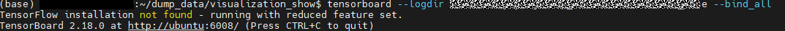

In the preceding figure, `ubuntu` is the server address, and `6008` is the port number.

Replace `ubuntu` with the actual server address. For example, if the actual server address is `10.123.456.78`, enter `http://10.123.456.78:6008` in the address box of the browser.

### Server Without Direct Connectivity

If the link is inaccessible (for example, the server cannot be directly connected and a VPN is required), try one of the following methods:

1. Manually set a proxy for the local computer network. For example, in Windows 10, add the server address (for example, `10.123.456.78`) in the manual proxy settings.

   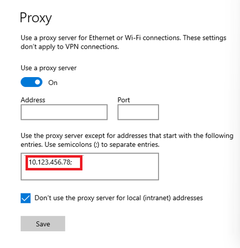

   Then, run the following command on the server:

   ```bash
   tensorboard --logdir out_path --bind_all
   ```

   Finally, enter `http://10.123.456.78:6008` in the browser.

   If the firewall is enabled on the server, this method will not work. In this case, disable the firewall or try the following methods.

2. Use Visual Studio Code to connect to the server and enter the following command in the Visual Studio Code terminal:

   ```bash
   tensorboard --logdir out_path
   ```

   

   Hold `CTRL` and click the link.

3. Transfer the graph construction result file from the server to the local computer to view the result.

   Enter the following command on the PC:

   ```bash
   tensorboard --logdir out_path
   ```
   
    Hold `CTRL` and click the link.

## Viewing Results in Browser

### Open in Browser

Google Chrome is recommended. Enter the server address and port number in the address box of the browser and press `Enter` to access the TensorBoard page. The "/#graph_ascend" part is automatically appended.


If you have switched to another function of TensorBoard and want to return to the model hierarchical visualization page, click **GRAPH_ASCEND** in the upper left corner.


### Result Check

The following figure shows the overall result.

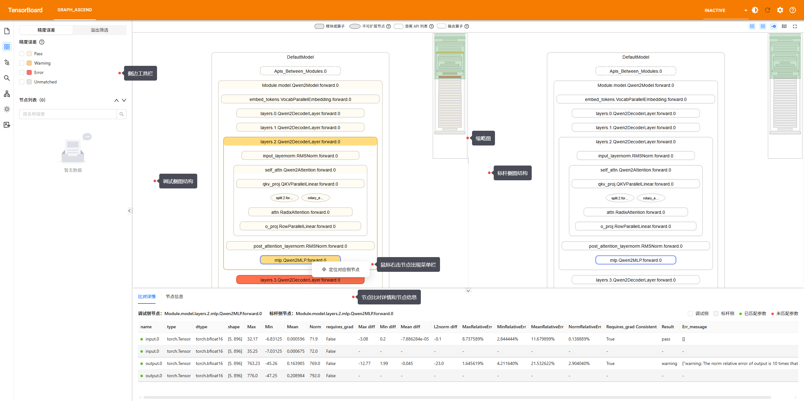

Keyboard and mouse operations:

- Left-click a node to select it, double-click a node to expand or collapse it, or right-click a node to expand the menu bar and select related functions.
- Scroll the mouse wheel to move the graph up or down.
- Press **W**/**S** to zoom in or out on the graph, and press **A**/**D** to move the graph left or right.

Click the icons on the left of the page to use different functions. The following figure shows the page, and the following table describes the basic operations.


| No.| Description                                                                                                                                                                 |
|----|---------------------------------------------------------------------------------------------------------------------------------------------------------------------|
| 1  | Data selection: You can switch between `Directory`, `Step`, `Rank`, and `MicroStep`. A micro step refers to the process of multiple forward and backward propagation performed before a complete weight update. A complete training iteration (step) can be further divided into multiple smaller steps (micro steps). The hierarchical visualization tool identifies a complete forward and backward propagation in the first layer of the model as a micro step.|
| 2  | Precision error filtering and overflow/underflow filtering: See [Precision Filtering and Overflow/Underflow Filtering](#precision-filtering-and-overflowunderflow-filtering).                                                                                                                       |
| 3  | Node matching: See [Selecting Nodes for Mapping](#selecting-nodes-for-mapping).                                                                                                                                  |
| 4  | Node search: See [Search by Name](#search-by-name).                                                                                                                                          |
| 5  | Visualized dump data conversion: See [Visualized Dump Data Conversion](#visualized-dump-data-conversion).                                                                                                                     |
| 6  | Theme switching: You can switch the current page to light or dark theme.                                                                                                                                     |
| 7  | Language switching: You can switch the language of the current page to Chinese or English.                                                                                                                                        |

You can click the icons in the upper right corner of the page to use different functions. The following figure shows the page, and the following table describes the basic operations.


| No.| Description               |
|----|-------------------|
| 1  | Thumbnail on the debugging side: enabled by default.|
| 2  | Thumbnail on the benchmark side: enabled by default.|
| 3  | Sync node expansion: enabled by default. |
| 4  | Shortcut key description           |
| 5  | Adaptive display           |

At the bottom of the page, you can switch table headers to see node information, call stack information, and data parallel merging details. The data parallel merging details are displayed only after [graph merging under different parallelism policies](#graph-merging-under-different-parallelism-policies) is triggered.
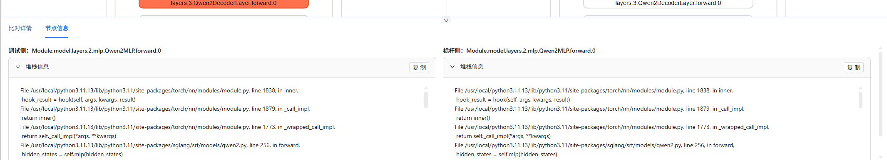

### Search by Name

The following figure shows the page, and the following table describes the basic operations.

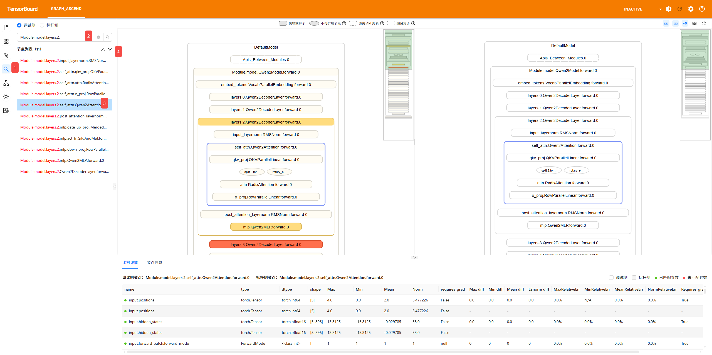

| No.| Description                                   |
|----|---------------------------------------|
| 1  | Click the search icon on the left of the toolbar.                   |
| 2  | Enter a node name to search. The search is fuzzy and case-insensitive.   |
| 3  | Select a node from the list, and the graph will automatically expand to show it.          |
| 4  | Select the previous or next node in the list, and the graph will automatically expand to show it.|

### Precision Filtering and Overflow/Underflow Filtering

The following figure shows the page, and the following table describes the basic operations.

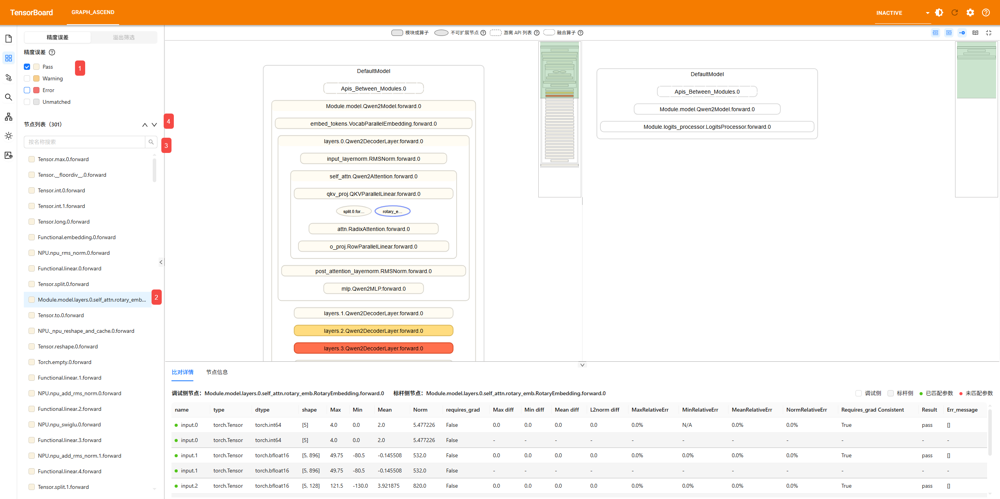

| No.| Description                                                                  |
|----|----------------------------------------------------------------------|
| 1  | Select "Precision Error" check box to view all nodes with precision errors.                                       |
| 2  | After you select "Precision Error," the node list in the drop-down menu is automatically expanded. Only leaf nodes are displayed, sorted by data collection time in ascending order. Click a node to select it, and the graph will automatically expand to show it.|
| 3  | Enter a node name to search. The search is fuzzy and case-insensitive.                                  |
| 4  | Select the previous or next node in the list, and the graph will automatically expand to show it.                               |

If the `-oc` or `--overflow_check` parameter is used in the `msprobe graph_visualize` command, the overflow/underflow detection function is enabled. In this case, you can select "Overflow/Underflow Filtering" from the toolbar. The specific operations are the same as those for precision filtering.

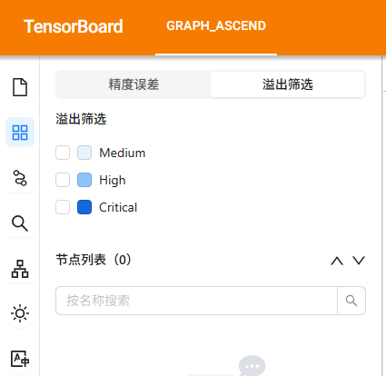

### Unmatched Node Filtering

The following figure shows the page, and the following table describes the basic operations.

According to [Matching Description](#metric-description), nodes that do not meet the matching rules are considered unmatched and are marked in gray. This function is applicable to scenarios where model structure differences need to be checked.

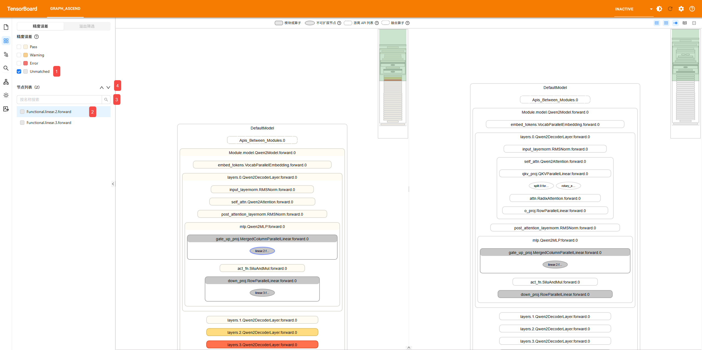

| No.| Description                                                               |
|----|-------------------------------------------------------------------|
| 1  | Select the gray box to view all unmatched nodes.                                                |
| 2  | After you select the gray box, the node list in the drop-down menu is automatically expanded. Only leaf nodes are displayed, sorted by data collection time in ascending order. Click a node to select it, and the graph will automatically expand to show it.|
| 3  | Enter a node name to search. The search is fuzzy and case-insensitive.                                      |
| 4  | Select the previous or next node in the list, and the graph will automatically expand to show it.                            |

### Selecting Nodes for Mapping

You can use the mouse to select two gray nodes to be matched on the browser page. Currently, the real data mode is not supported.

The following figure shows the page, and the following table describes the basic operations.

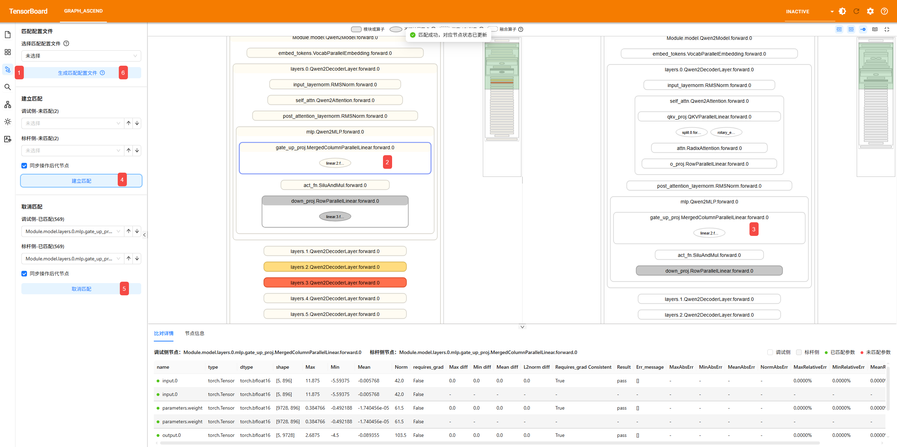

| No.| Description                                               |
|----|---------------------------------------------------|
| 1  | Click the node matching icon on the left of the toolbar.                               |
| 2  | Click an unmatched node on the debugging side.                                |
| 3  | Click an unmatched node on the benchmark side.                                |
| 4  | Click "Create Matching". The precision data is automatically calculated and filled in with colors.                     |
| 5  | Click "Cancel Matching" to cancel the matching of matched nodes. After the cancellation, nodes are marked in gray.                |
| 6  | After the matching is complete, click "Generate Matching Configuration File". You can move the mouse pointer to the question mark icon to view the detailed description.|

### Visualized Dump Data Conversion

You can use a browser to visualize the conversion of dump data collected by msProbe, without using the `msprobe graph_visualize` command.

Before using this function, ensure that the permission on the input data is correct. The folder permission should be **750** (`rwx r-x ---`), and the file permission should be **640** (`rw- r-- ---`) to avoid loading failures.

The following figure shows the page, and the following table describes the basic operations.


| No.| Description                                                                                                                                                                                                        |
|----|------------------------------------------------------------------------------------------------------------------------------------------------------------------------------------------------------------|
| 1  | Click the dump data visualization conversion icon on the left of the toolbar.                                                                                                                                                                                 |
| 2  | Build a graph structure file and configure file parameters. For details about the parameters, see the parameter description in [Graph Merging Under Different Parallelism Policies](#graph-merging-under-different-parallelism-policies). The dump data path to be converted must be a subpath of `--logdir`. Otherwise, when you configure the debugging comparison path (`-tp`) or benchmark comparison path (`-gp`) on the GUI, you cannot select the dump data path to be converted from the drop-down list. For details about `--logdir`, see [Starting TensorBoard](#starting-tensorboard)|
| 3  | Click "Start Conversion".                                                                                                                                                                                                     |

The figure below shows the conversion process.


After the conversion is complete, you can click "Load File" to view the graph structure of the converted file. Alternatively, you can click "Back" to return to the "Visualized Dump Data Conversion" page and perform the conversion again.


If the conversion fails, exception logs will be displayed on the page. Troubleshoot the issue based on the exception logs. If the issue persists, submit an issue on the "Issues" page of the repository for help.


## Graph Comparison Description

### Legend

There are four types of colors:

- Red: error
- Orange: warning
- White/Beige: pass
- Gray: unmatched node

A node represents an API or module and typically contains multiple inputs and outputs. The node color is determined by multiple metric algorithms applied to these inputs and outputs.The final color priority is "error > warning > pass".

Errors:

1. (Real data/Statistics mode) The maximum or minimum NPU value of an API or module contains `nan`, `inf`, or `-inf`. If the same phenomenon occurs in Bench metrics , ignore this error.
2. (Real data mode) `One Thousandth Err Ratio` of an API or module's `input/parameters` is greater than 0.9 and `output` is less than 0.6. (Only the output is marked, and the input is used for calculation.)
3. (Statistics mode) The relative error of the norm value of an API or module's `input` is less than 0.1, and that of `output` is greater than 0.5. (Only the output is marked, and the input is used for calculation.)
4. (Real data/Statistics mode) `Requires_grad` (for gradient calculation) of an API or module is inconsistent.
5. (Real data/Statistics mode) Non-tensor scalars of an API or module are inconsistent.
6. (MD5 mode) The CRC-32 value of an API or module is inconsistent.
7. (Real data/Statistics mode) `dtype` of an API or module is inconsistent.
8. (Real data/Statistics mode) The shape of an API or module is inconsistent.

Warnings:

1. (Statistics mode) The relative error of the norm value of an API or module's `output` is 10 times that of `input`/`parameters`. (Only the output is marked, and the input is used for calculation.)
2. (Real data mode) The cosine of an API or module's `input`/`parameters` is greater than 0.9 and the difference between `input`/`parameters` and `output` is greater than 0.1. (Only the output is marked, and the input is used for calculation.)
3. (MD5 mode) The parameters of an API or module do not match.

Gray color:

According to [Matching Description](#matching-description), if the matching conditions are not met, the two nodes cannot be matched or compared.

Special scenarios:

1. The metric rules that involve using the input for calculation are not applicable to API inputs with placeholders, including `['_reduce_scatter_base', '_all_gather_base', 'all_to_all_single', 'batch_isend_irecv']`.
2. All metrics are not applicable to redundant APIs, including `['empty', 'empty_like', 'numpy', 'to', 'setitem', 'empty_with_format', 'new_empty_strided', 'new_empty', 'empty_strided']`.

### Metric Description

Precision comparison evaluates API precision from three aspects: real data mode, statistics mode, and MD5 mode. The comparison results of these modes have different metrics.

**Common Metrics**

- `name`: parameter name, for example, `input.0`
- `type`: type, for example, `torch.Tensor`
- `dtype`: data type, for example, `torch.float32`
- `shape`: tensor shape, for example, `[32, 1, 32]`
- `Max`: maximum value
- `Min`: minimum value
- `Mean`: mean value
- `Norm`: L2 norm

**Metrics in Real Data Mode**

- `Cosine`: tensor's cosine similarity
- `EucDist`: tensor's Euclidean distance
- `MaxAbsErr`: tensor's maximum absolute error
- `MaxRelativeErr`: tensor's maximum relative error
- `One Thousandth Err Ratio`: proportion of elements in a tensor with a relative error less than 0.1%
- `Five Thousandth Err Ratio`: proportion of elements in a tensor with a relative error less than 0.5%

**Metrics in Statistics Mode**

- `(Max, Min, Mean, Norm) diff`: absolute error of the statistics
- `(Max, Min, Mean, Norm) RelativeErr`: relative error of the statistics

**Metrics in MD5 Mode**

- `md5`: CRC-32 value

## Appendixes

### Custom Layer Mapping File

The file name is the format of `\*.yaml`. The asterisk (*) indicates the file name, which can be customized.

The following is an example of the file content:

```yaml
PanGuVLMModel:                                    # Layer name
  vision_model: language_model.vision_encoder     # Layer name embedded in the model code
  vision_projection: language_model.projection

RadioViTModel:
  input_conditioner: radio_model.input_conditioner
  patch_generator: radio_model.patch_generator
  radio_model: radio_model.transformer

ParallelTransformerLayer:
  input_norm: input_layernorm
  post_attention_norm: post_attention_layernorm

GPTModel:
  decoder: encoder

SelfAttention:
  linear_qkv: query_key_value
  core_attention: core_attention_flash
  linear_proj: dense

MLP:
  linear_fc1: dense_h_to_4h
  linear_fc2: dense_4h_to_h
```

The layer name needs to be obtained from the model code.

In the YAML file, you only need to configure the layers that have the same functions but different names in the debugging and benchmark sides. Layers with the same names will be automatically identified and mapped.

Model code example:

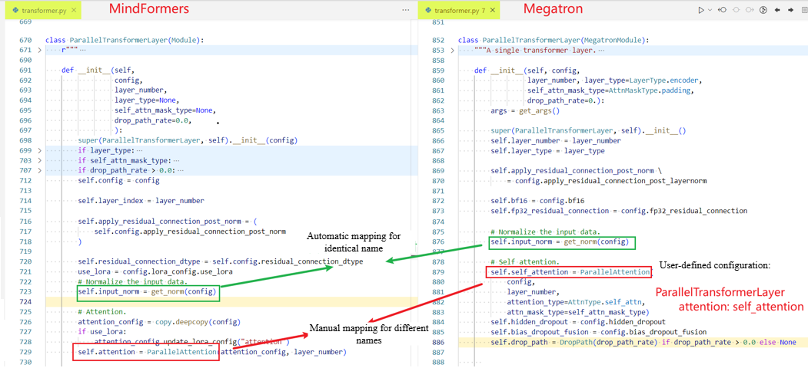

### Dump File Requirements for Graph Construction in Hierarchical Visualization

**Single-Rank Format**

Path format example: `dump_path/step0/rank0`

The path must contain `dump.json`, `stack.json`, and `construct.json`. `construct.json` cannot be empty. If `construct.json` is empty, check whether the`level` parameter is set to `L0` or `mix` or not.

**Multi-Rank Format**

Path format example: `dump_path/step0`

The path must contain folders named in the format of `rank{number}`. Each `rank` folder must contain `dump.json`, `stack.json`, and `construct.json`. `construct.json` cannot be empty. If `construct.json` is empty, check whether the`level` parameter is set to `L0` or `mix` or not.

**Multi-Step Format**

Path format example: `dump_path`

The path must contain folders named in the format of `step{number}`. Each `step` folder must contain folders named in the format of `rank{number}`. Each `rank` folder must contain `dump.json`, `stack.json`, and `construct.json`. `construct.json` cannot be empty. If `construct.json` is empty, check whether the`level` parameter is set to `L0` or `mix` or not.

```ColdFusion
├── dump_path
│   ├── step0
│   |   ├── rank0
│   |   │   ├── dump_tensor_data (available only when `task` is set to `tensor`)
|   |   |   |    ├── Tensor.permute.1.forward.pt
|   |   |   |    ├── MyModule.0.forward.input.pt  
|   |   |   |    ...
|   |   |   |    └── Function.linear.5.backward.output.pt
│   |   |   ├── dump.json             # Data information
│   |   |   ├── stack.json            # Call stack information
│   |   |   └── construct.json        # Hierarchical structure. When `level` is `L1`, the content of `construct.json` is empty.
│   |   ├── rank1
|   |   |   ├── dump_tensor_data
|   |   |   |   └── ...
│   |   |   ├── dump.json
│   |   |   ├── stack.json
|   |   |   └── construct.json
│   |   ├── ...
│   |   |
|   |   └── rankn
│   ├── step1
│   |   ├── ...
│   ├── step2
```

### Matching Description

#### Default matching

- The dump names of all nodes are the same.
- The node levels are the same (the parent nodes are the same).

#### Fuzzy matching

- For module nodes with identical dump names, matching is performed based on the consistent name and the call sequence within the module node, ignoring the call count of individual APIs under each node.

  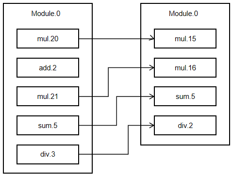

Dump names follow the format `Name + Number of calls` (e.g., in `Torch.matmul.2.forward`, `matmul` is the name and `2` is the call count).

## FAQ

Q: In the graph comparison scenario, a node is displayed in gray and there is no precision comparison data. What to do?

A: If a node is displayed in gray, it indicates that the node on the left (debugging side) does not match the node on the right (benchmark side). The possible causes are as follows:

- A node on the debugging side has no matching node on the benchmark side, which is caused by differences in code implementation. You should verify whether this discrepancy is normal and assess its impact on the precision of the entire network.
- The node names are the same, but the number of calls is different (for example, `Tensor.permute.1.forward` and `Tensor.permute.3.forward`), or the parent layers of the nodes are different. As a result, the nodes cannot be matched.
  - For details about the matching rules, see [Matching Description](#matching-description). You can try fuzzy matching by referring to "Parameters" in [Dual-Graph Comparison](#dual-graph-comparison).
- Node names are inconsistent (for example, `Tensor.permute.1.forward` and `Tensor.my_permute.1.forward`), causing node matching failures. Currently, the following two methods are provided.
  - You can use the layer mapping function by referring to "Parameters" in [Dual-Graph Comparison](#dual-graph-comparison). For details about how to customize a layer mapping file, see [Configuring Layer Mapping for Hierarchical Model Visualization](../examples/layer_mapping_example.md).
  - You can manually select unmatched nodes on the browser page. For details, see [Selecting Nodes for Mapping](#selecting-nodes-for-mapping).
