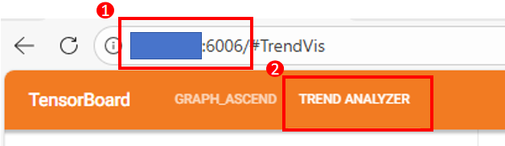
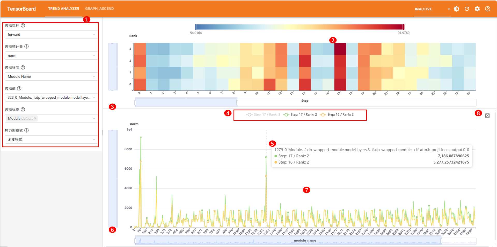
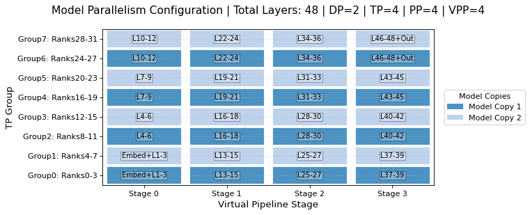

# Trend Visualization

## Overview

The trend visualization function parses precision data collected by msProbe, identifies the module names at the model layer, and displays its location across iteration steps, ranks, and network model, helping you observe the precision data and analyze precision problems based on the overall data distribution.

**Concepts**

- msProbe: short for MindStudio Probe, is a precision debugging toolkit that can locate precision issues during model training or inference.
- dump: data collection function of MindStudio Probe. The collected data is called dump data.
- monitor: training status monitoring function of MindStudio Probe. The collected data is called monitor data.
- Three dimensions: dimensions of the data to be observed in the trend visualization tool, including step, rank, and module name (tensor target, distinguished by the network layer or operator name).

**Usage Process**

1. Install the tool and collect data. For details, see [Preparations](#preparations).
2. Use the command line tool to parse the precision data and generate an SQLite database file in .db format. For details, see [Precision Data Parsing](#precision-data-parsing).
3. Start the TensorBoard service and set the `--logdir` parameter to the output path of the precision data parsing function.
4. Use a browser to open the TensorBoard service page and view the data in the `TREND ANALYZER` plugin window.

## Preparations

**Environment Setup**

Install msProbe by referring to [msProbe Installation Guide](../msprobe_install_guide.md).

If you choose to compile and install msProbe, you must configure `--include-mod=trend_analyzer` in the compile command to build the trend visualization plugin.

**Data Preparation**

- Dump data (collecting model data with `level` set to `L0` or `mix`)
  - For details about how to collect data in the PyTorch framework, see [Precision Data Collection in PyTorch](../dump/pytorch_data_dump_instruct.md).
  - For details about how to collect data in the MindSpore framework, see [Precision Data Collection in MindSpore](../dump/mindspore_data_dump_instruct.md).
- monitor data (output `format` set to `csv`)
  - For details about the collection method, see [Lightweight Training Status Monitoring Tool](../monitor_instruct.md).
  
**Constraints**

- The PyTorch and MindSpore frameworks are supported.

## Precision Data Parsing

**Function**

Parse dump or monitor data, identifies module names at each model layer, determines the positions of module names in the step, rank, and network model based on the dump data flushing sequence, and save the parsing result to an SQLite database file in .db format.

**Precautions**

- dump data: Only the data collected at the `L0` or `mix` level (specified by `level`) is supported.
- monitor data: Only the data collected when the output `format` is set to `csv` is supported.
- To effectively display the data trend, the flushed data range is `[-1e9, 1e9]`. Data beyond this range will be truncated. The `inf` value will be converted to `1e9+1`, and the `-inf` value will be converted to `-1e9-1`.
- There may be multiple parsed files. When you [start TensorBoard](#starting-tensorboard), the first `.trend.db` file passed to the directory is opened by default. Currently, file selection is not supported.

**Syntax**

```shell
msprobe data2db --db <db_path> --data <data_path> [--format <format>] [--mapping <mapping_json>] [--micro_step <use_micro_step>] [--process_num <process_num>]
```

**Parameters**

| Parameter            | Mandatory (Yes/No)| Description                                                        |
| ---------------- | --------- | ------------------------------------------------------------ |
| `--db`            | Yes     | Directory for storing the parsing result file. The value is of the string type. An SQLite file with the `.trend.db` extension is generated in this directory.|
| `--data`          | Yes     | Input data path. The value is of the string type. The dump data directory or monitor data directory is supported. Dump data should be configured to the parent directory of the `step` folder, and monitor data should be configured to the parent directory of the `rank` folder.  |
| `--format`        | No     | Data format. The value is of the string type. The options are `auto` (automatic detection), `dump`, and `monitor`. The default value is `auto`.|
| `--mapping`       | No     | Path of the JSON mapping file (the JSON file name must be specified, for example, `./mapping.json`). The value is of the string type. When parsing precision data, the program uses a mapping file to convert model layer names or operator names, simplifying them or aligning names across steps. For details about how to configure a mapping file, see [Mapping File Configuration](#mapping-file-configuration).|
| `--micro_step`    | No     | Whether to enable micro-step counting. The value is of the Boolean type. The default value is `true`. If micro-step counting is enabled, a step can be split into multiple micro steps for analysis.|
| `--process_num`   | No     | Number of parallel processes, which is of the int type. The default value is `1`. This parameter is used only to accelerate the parallel processing of monitor data.|

**Example**

Parse data files in the `/data/dump_path` directory, automatically identify monitor data and dump data, and save the parsed SQLite database file in .db format to the `/data/db_path` directory. The preceding operation is executed in a single process and counted by micro-step. Mapping is not used.

```shell
msprobe data2db --data /data/dump_path --db /data/db_path
```

**Output Description**

After the dump data parsing command is executed successfully, the `dump_data.trend.db` file is generated in the `/data/db_path` directory.

After the monitor data parsing command is executed successfully, the `monitor_data.trend.db` file is generated in the `/data/db_path` directory.

## Trend Analysis

### Function

Trend analysis is to perform visualized analysis on the statistics of tensor objectives from three dimensions: steps, ranks, and module names. This helps you observe the precision data and analyze precision issues based on the overall trend distribution.

### GUI Description

The following figure shows the trend visualization GUI, including area 1 (toolbar), area 2 (heat map), and area 3 (line chart).


- Area 1: toolbar, which allows you to select metrics, statistics, display dimensions, and dimension values, and provides label filtering and heat map mode settings.
- Area 2: heat map, which displays distribution of precision data across the other two dimensions based on the selected dimension's value.
- Area 3: line chart, which shows the trend of precision data for a selected point as its dimension value varies, triggered by clicking a point in the heat map under the chosen dimension value.

### Usage Description

#### Starting TensorBoard

**Server with Direct Connectivity**

Pass `out_path` where the `.trend.db` file is generated to `--logdir`.

```bash
tensorboard --logdir out_path --bind_all
```

Logs are printed after TensorBoard is started.


In the preceding figure, `ubuntu` is the server address, and `6008` is the port number. You can specify another port number using the `--port` parameter.

> [!NOTE]NOTE
>
> Replace `ubuntu` with the actual server address. For example, if the actual server address is `10.123.456.78`, enter [http://10.123.456.78:6008](http://10.123.456.78:6008/) in the address box of the browser.

**Server Without Direct Connectivity**

If the link cannot be opened (for example, the server cannot be directly connected and a VPN is required), try one of the following methods:

1. Manually set a proxy for the local computer network. For example, in Windows 10, add the server address (for example, `10.123.456.78`) in the manual proxy settings.

   

   Then, run the following command on the server:

   ```bash
   tensorboard --logdir out_path --bind_all
   ```

   Finally, enter `http://10.123.456.78:6008` in the browser's address bar.>

   > [!note]NOTE
   >
   > If the firewall is enabled on the server, this method will not work. In this case, disable the firewall or try the following methods.

2. Use Visual Studio Code to connect to the server and enter the following command in the Visual Studio Code terminal:

   ```bash
   tensorboard --logdir out_path
   ```

   

   Press and hold `CTRL` and click the link.

3. Transfer the image composition result file from the server to the local computer and install msProbe on the local computer to view the image composition result.

   Enter the following command on the PC:

   ```bash
   tensorboard --logdir out_path
   ```

   Press and hold `CTRL` and click the link.

#### Browser

Google Chrome is recommended. Perform the following operations to access the trend visualization page.



1. Enter the server address and port number in the address box of the browser and press `Enter`, to access the TensorBoard page.
2. Click `TREND ANALYZER` in the upper left corner to access the trend visualization page.

#### Heat Map

By selecting the metric, statistic, display dimension, and dimension value on the toolbar, you can view a heat map showing how precision data is distributed across the other two dimensions under the selected dimension value. The following figure shows the page, and the following table describes the detailed operations.


| No.| Description|
|--|--|
|1|Select a data range to be displayed by selecting the metric, statistics, dimension, and dimension value in sequence. For details, see [Item Description](#item-description). After selection, the corresponding heat map is loaded.|
|2|(Optional) Select a label from the drop-down list box or enter a label to be filtered. Only the data of the related module name is displayed. Multiple labels can be selected. For details about the label types, see [Item Description](#item-description)|
|3|(Optional) Select a heat map mode from the drop-down list box, including:<br>&#8226; Gradient mode: Precision data is displayed using a gradient from blue to red. Smaller values appear bluer.<br>&#8226; Segmentation mode: Precision data is displayed in different colors.|
|4|(Optional) Drag the heat bar to adjust the value range displayed in the heat map.|
|5|(Optional) Drag the slider on the X-axis or Y-axis of the heat map to adjust the axis range.|
|6|(Optional) Hover the cursor over the heat map to view detailed information about the data block at the mouse position.|
|7|(Optional) Drag the dividing line between the heat map and line chart to adjust the proportion of the heat map on the page.|

When the dimension is set to `Step` and parallelism strategies are applied to a Megatron model, refer to [Parallelism Visualization of a Megatron Model](#parallelism-visualization-of-a-megatron-model) to understand how the network layer data collected under each rank maps to the actual network-wide location.

### Item Description

|Item|Description|
|--|--|
|Metric|dump data:<br>&#8226;`forward`: forward process data. The tensor belongs to a network layer with the suffix `forward.X` (*X* indicates the ID) or an operator API with the suffix `.forward` in the `dump.json` file.<br>&#8226;`backward`: backward process data. The tensor belongs to a network layer with the suffix `backward.X` (*X* indicates the ID) or an operator API with the suffix `.backward` in the `dump.json` file.<br>&#8226; `recompute`: recomputation process data. The tensor belongs to a network layer or operator API with the `is_recompute` attribute set to `True` in the `dump.json` file.<br>&#8226; `parameters_grad`: parameter gradient data. The tensor belongs to network layer data with the suffix `parameters_grad` in the `dump.json` file.<br> monitor data:<br>&#8226; Automatically extracted based on the prefix of the monitor data file. Supported items include `["actv", "actv_grad", "exp_avg", "exp_avg_sq", "grad_unreduced", "grad_reduced", "param_origin", "param_updated"]`.|
|Statistic|&#8226; dump data: The value is fixed to `norm`, `max`, `mean`, or `min`, indicating the L2 norm, maximum value, mean, or minimum value, respectively.<br>&#8226; monitor data: Automatically extracted based on the content of the .csv file. If a column contains valid data, the column name is automatically extracted as a statistical option.|
|Dimension|The options are as follows:<br>&#8226; `Step`: Display all data of a single step in a heatmap (the X axis represents `Rank`, and the Y axis represents `Module Name`). You can click to view the trend line chart of a single tensor target in the `step` dimension.<br>&#8226; `Rank`: Display all data of a single rank in a heatmap (the X axis represents `Step`, and the Y axis represents `Module Name`). You can click to view the trend line chart of a single tensor target in the `rank` dimension.<br>&#8226; `Module Name`: Display all data of a single tensor target in a heatmap (the X axis represents `Step`, and the Y axis represents `Rank`). You can click to view the trend line chart of a single tensor target in the `Module Name` dimension.|
|Label|The following types are available:<br>&#8226; `default`: Indicates that the tensor target belongs to network layer data, such as "Module" and "Cell".<br>&#8226; `layer`: Indicates a label in the format of `xxx.N` extracted from the network layer name, where *xxx* is a string and *N* is an integer representing the network layer ID, for example, "layers.0".<br>&#8226; `index`: Indicates the input/output position of a tensor. For example, the 0th tensor in the input is labeled as "input.0".<br>&#8226; `module`: Indicates a string label extracted from the network layer name, representing the network layer type, for example, "TransformerLayer".<br>&#8226; `function`: Indicates the name of the operator API for which no layer label is extracted.|

#### Line Chart

By clicking a point in the heat map, you can view the trend of precision data for that point as its dimension value varies. The following figure shows the page, and the following table describes the detailed operations.


| No.| Description|
|--|--|
|1|Select the basic data range to be displayed as instructed in [Heat Map](#heat-map), and wait until the heat map is loaded.|
|2|Click a point in the heat map to display the trend of its precision data as the dimension value changes. You can select multiple points, and several lines are loaded at the same time for comparison.|
|3|(Optional) Drag the dividing line of the line chart to adjust the proportion of the line chart on the page.|
|4|(Optional) Click the legend of the line chart to display or hide the corresponding line.|
|5|(Optional) Hover the cursor over the line chart to view detailed data information of all lines at the mouse position.|
|6|(Optional) Drag the slider on the X-axis or Y-axis of the line chart to adjust the axis range.|
|7|(Optional) Drag the line chart or scroll the mouse wheel to adjust the X-axis range.|
|8|(Optional) Click the clear button to clear the currently displayed line chart.|

## Parallelism Visualization of a Megatron Model

**Function**

This function visualizes the mapping between the network layer of each rank and the entire network in a [heat map](#heat-map).

Model parallelism in Megatron distributes a model across different ranks. As a result, the model layer data collected on each node may contain only a portion of the full model, and the location of those layers within the overall model is not immediately apparent. This function offers visualization support for multi‑node model parallelism, helping you rapidly identify how model layers are mapped to each device under the current parallelism configuration.

**Precautions**

Only the tensor parallelism, pipeline parallelism, virtual pipeline parallelism, and data parallelism are supported in the Megatron scenario.
The number of ranks should be less than or equal to 1024 and the number of model layers should be less than or equal to 256. That is, `world_size ≤ 1024` and `num_layers ≤ 256` must be met.

**Example**

1. Create a Python script, for example, `plot_model.py`. Copy the following code to `plot_model.py` and modify the configuration under `ParallelConfig` as required.

    ```python
    from msprobe.core.common.megatron_utils import ParallelConfig, plot_model_parallelism
    
    config = ParallelConfig(
        world_size=32,
        num_layers=48,
        tensor_parallel_size=4,
        pipeline_parallel_size=4,
        num_layers_per_virtual_pipeline_stage=3,
        order="tp-cp-ep-dp-pp",
        standalone_embedding_stage=False,
        output_path='./'
    )
    plot_model_parallelism(config)
    ```

    For details about the parameters, see [plot_model_parallelism](#plot_model_parallelism).
    
2. Run the following command to start the conversion.

    ```shell
    python plot_model.py
    ```

**Output Description**

After the `plot_model_parallelism` API is successfully called, a `png` file in the format of `ws{world_size}_ln{num_layers}_tp{tensor_parallel_size}_pp{pipeline_parallel_size}_vpp{virtual_pipeline_parallel_size}.png` is generated in the configured `output_path`. `virtual_pipeline_parallel_size` is the size of the virtual pipeline parallel group calculated based on the input parameters such as `num_layers_per_virtual_pipeline_stage`.

View the PNG file.



The table below describes the PNG file.

| Field        | Description| 
| -------------- | --------- |
| Model Parallelism Configuration | Parallel configuration set or calculated by the user, including:<br> `Total Layers`: total number of layers in a model, corresponding to `num_layers` in the script.<br> `DP`: data parallel group size, calculated based on the input parallel parameters.<br> `TP`: tensor parallel group size, corresponding to `tensor_parallel_size` in the script.<br> `PP`: pipeline parallel group size, corresponding to `pipeline_parallel_size` in the script.<br> `VPP`: virtual pipeline parallel group size, corresponding to `virtual_pipeline_parallel_size` in the file name, calculated based on the input parallel parameters.   |                 
| TP Group | Vertical coordinate, tensor parallel group, in the format of `Group{num}: Rank{start}-{end}`. `num` indicates the group ID, and `start` and `end` indicate the IDs of the first and last ranks in the group, respectively. For example, `Group0: Rank0-3` indicates group 0, which contains four ranks: rank0 to rank3.    |                 
| Virtual Pipeline Stage | Horizontal coordinate, pipeline parallel stage or virtual pipeline parallel stage, in the format of `Stage {num}`. `num` indicates the stage ID.     |                 
| Model Copies | Model replica legend. In data parallelism, different model replicas of input data are marked in different colors.     |                 
| `Embed`/ `L{start}-{end}`/ `Out`  | Text in the color matrix, indicating model layers contained in a stage of a tensor parallel group.<br>  `Embed`: first stage of the model, which usually contains the embedding layer.<br> `L{start}-{end}`: model layers from start to end. For example, `L1-3` indicates that the current stage contains the first, second, and third model layers of the entire model.<br> `Out`: last stage of the model, which usually contains the output layer.<br> If multiple stage definitions are met, use a plus sign (+) to connect them.   |                 

## Appendixes

### Mapping File Configuration

Mapping configuration files provide input to the `--mapping` parameter of the [precision data parsing](#precision-data-parsing) function.
After the `-mapping` parameter is configured, the parser sequentially replaces model layer or operator names in each precision data file with the keys and values specified in `mapping.json`. This is intended for scenarios requiring name simplification or cross-step name alignment.

The JSON file format and an example are provided below; keys and values are strings.

```json
{
  ".TE": ".",
  ".MindSeed": "."
}
```

In the preceding format, the field on the left is the key (for example, `.TE`), and the field on the right is the value (for example, `.`). The preceding configuration indicates that `.TE` is replaced with `.`, and `.MindSeed` is replaced with `.`.

### Public API

#### plot_model_parallelism

**Prototype**

```python
plot_model_parallelism(config: ParallelConfig) -> None
```

**Parameters**

Parameters need to ba passed during instance initialization when a ParallelConfig instance is configured.

| Parameter                               | Input/Output| Description                                                                                                                                                                   |
| ------------------------------------- | --------- | ----------------------------------------------------------------------------------------------------------------------------------------------------------------------- |
| world_size                            | Input     | (Mandatory; int) Total number of ranks for model deployment. The value range is [1, 1024].                                                                                                                                |
| num_layers                            | Input     | (Mandatory; int) Total number of layers in a model. The value range is [1, 256].                                                                                                                                      |
| tensor_parallel_size                  | Input     | (Optional; int) Tensor parallel group size. The default value is **1**. In the actual training script, `--tensor-model-parallel-size T` is specified, where `T` is the specified tensor parallel group size.                                                                                                                           |
| pipeline_parallel_size                | Input     | (Optional; int) Pipeline parallel group size. The default value is **1**. In the actual training script, `--pipeline-model-parallel-size P` is specified, where `P` is the specified pipeline parallel group size.                                                                                                                         |
| num_layers_per_virtual_pipeline_stage | Input     | (Optional; int) Number of layers in each virtual pipeline stage. The default value is **None**, indicating that virtual pipeline parallelism is disabled. In the actual training script, `--num-layers-per-virtual-pipeline-stage V` is specified, where `V` is the number of layers in each virtual pipeline stage.|
| order                                 | Input     | (Optional; str) Sorting order of model parallelism strategies. The default Megatron setting (`tp-cp-ep-dp-pp`) is used.                                                                                                            |
| standalone_embedding_stage            | Input     | (Optional; bool) Whether to use the embedding layer as an independent pipeline stage. `True` for enabled; 'False` for disabled. The default value is `False`.                                                                                                  |
| output_path                           | Input     | (Optional; str) Output path of the visualization result. The default value is './'.                                                                                                                  |

**Returns**

None

# FAQ

1. How to use the trend visualization tool to compare the precision data files of two different experiments?
   
   The trend visualization tool does not distinguish between benchmark experiments and comparison experiments. It only compares the precision data files based on their input paths. To compare the precision data files of two different experiments, you need to manually move the subdirectories of the two groups of files to the same directory and then use the trend visualization tool to view and compare the files.

   Assume there are two dump data files: `dump_path1` and `dump_path2`.

   ```shell
   ├── dump_path1
   │   ├── step0
   │   |   ├── rank0
   │   |   |   ├── dump.json
   │   |   |   ├── stack.json
   |   |   |   └── construct.json
   │   |   |── rank1
   │   ├── step1
   ├── dump_path2
   │   ├── step0
   │   |   ├── rank0
   │   |   |── rank1
   │   ├── step1
   ```

   You can move the `dump_path1` and `dump_path2` subdirectories to the same directory by appending steps.

   ```shell
   ├── dump_path_compare
   │   ├── step0 # Step 0 of the original dump_path1
   │   ├── step1 # Step 1 of the original dump_path1
   │   ├── step2 # Step 0 of the original dump_path2
   │   ├── step3 # Step 1 of the original dump_path2
   ```

   After the command is executed, the precision data of four steps can be obtained. In this case, comparing the precision data trends of step 0 and step 2 is equivalent to comparing the precision data trends of step 0 in the original `dump_path1` and `dump_path2`.

   ```shell
   msprobe data2db --data dump_path_compare --db ./output --format dump
   ```

   You can also move the `dump_path1` and `dump_path2` subdirectories to the same directory by appending ranks.

   ```shell
   ├── dump_path_compare
   │   ├── step0
   │   |   ├── rank0  # step 0/rank 0 of original dump_path1
   │   |   ├── rank1  # step 0/rank 1 of original dump_path1
   │   |   ├── rank2  # step 0/rank 0 of original dump_path2
   │   |   ├── rank3  # step 0/rank 1 of original dump_path2
   │   ├── step1
   │   |   ├── rank0 # step 1/rank 0 of original dump_path1
   │   |   ├── rank1 # step 1/rank 1 of original dump_path1
   │   |   ├── rank2 # step 1/rank 0 of original dump_path2
   │   |   ├── rank3 # step 1/rank 1 of original dump_path2
   ```

   After the command is executed, the precision data visualization results of four ranks are obtained. In this case, comparing the precision data trends of rank 0 and rank 2 in step 0 is equivalent to comparing the precision data trends of rank 0 in step 0 of the original `dump_path1` and `dump_path2`.
