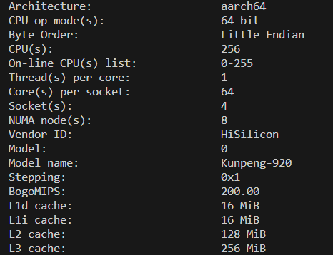

# Performance Baseline Report of the Training Status Monitoring Tool

## Environment Information

NPU: Atlas A2 training products

CPU:



Torch: 2.1.0

CANN: 8.0.RC2

In addition to the preceding environment information, the number and structure of monitored modules also affect performance. Therefore, a typical network and the number of steps after the time consumption is stable are selected for testing. The tool outputs occupy a small space and have no requirement on memory.

## Model Information and Performance Baseline

The performance baseline test data in the following scenarios is the average value of multiple tests. The actual performance data may slightly fluctuate based on the environment status.

### LLAMA2-13B

Main data type: BFLOAT16

Number of model layers: 40

Configuration files (10 layers sampled):

```json
{  
    "targets": {  
        "language_model.encoder.layers.0": {"input": "tuple[2]:0", "output": "tensor", "input_grad":"tuple[2]:0", "output_grad":"tuple[1]:0"},
        "language_model.encoder.layers.1": {"input": "tuple[2]:0", "output": "tensor", "input_grad":"tuple[2]:0", "output_grad":"tuple[1]:0"},
        "language_model.encoder.layers.2": {"input": "tuple[2]:0", "output": "tensor", "input_grad":"tuple[2]:0", "output_grad":"tuple[1]:0"},
        "language_model.encoder.layers.3": {"input": "tuple[2]:0", "output": "tensor", "input_grad":"tuple[2]:0", "output_grad":"tuple[1]:0"},
        "language_model.encoder.layers.4": {"input": "tuple[2]:0", "output": "tensor", "input_grad":"tuple[2]:0", "output_grad":"tuple[1]:0"},
        "language_model.encoder.layers.5": {"input": "tuple[2]:0", "output": "tensor", "input_grad":"tuple[2]:0", "output_grad":"tuple[1]:0"},
        "language_model.encoder.layers.6": {"input": "tuple[2]:0", "output": "tensor", "input_grad":"tuple[2]:0", "output_grad":"tuple[1]:0"},
        "language_model.encoder.layers.7": {"input": "tuple[2]:0", "output": "tensor", "input_grad":"tuple[2]:0", "output_grad":"tuple[1]:0"},
        "language_model.encoder.layers.8": {"input": "tuple[2]:0", "output": "tensor", "input_grad":"tuple[2]:0", "output_grad":"tuple[1]:0"},
        "language_model.encoder.layers.9": {"input": "tuple[2]:0", "output": "tensor", "input_grad":"tuple[2]:0", "output_grad":"tuple[1]:0"}
    },
    "module_ranks": "0"
}  
```

Startup command parameters: `python3 -u pretrain_gpt.py --local-rank=1 --tensor-model-parallel-size 8 --pipeline-model-parallel-size 1 --sequence-parallel --num-layers 40 --hidden-size 5120 --ffn-hidden-size 13824 --num-attention-heads 40 --tokenizer-type Llama2Tokenizer --tokenizer-model /new_data/LLM/checkpoint_origin/llama2-13b-hf/tokenizer.model --seq-length 4096 --max-position-embeddings 4096 --micro-batch-size 2 --global-batch-size 16 --make-vocab-size-divisible-by 1 --lr 1e-6 --train-iters 5000 --lr-decay-style cosine --untie-embeddings-and-output-weights --disable-bias-linear --attention-dropout 0.0 --init-method-std 0.01 --hidden-dropout 0.0 --position-embedding-type rope --normalization RMSNorm --use-fused-rmsnorm --swiglu --use-flash-attn --no-masked-softmax-fusion --attention-softmax-in-fp32 --min-lr 1e-8 --weight-decay 1e-1 --lr-warmup-fraction 0.01 --clip-grad 1.0 --adam-beta1 0.9 --initial-loss-scale 4096 --adam-beta2 0.95 --no-gradient-accumulation-fusion --load /data/LLM/checkpoint_magatron/llama2_13b_tp1_pp8 --no-load-optim --no-load-rng --use-fused-swiglu --use-fused-rotary-pos-emb --use-mc2 --bf16 --data-path /data/LLM/data_modellink/llama2_13b/alpaca_text_document --split 949,50,1 --log-interval 1 --save-interval 10000 --eval-interval 1000 --eval-iters 10 --distributed-backend nccl --save ./ckpt`

Time consumption without the tool enabled: **4s**

Single-rank time consumption with the tool enabled: **4.25s**

Multi-rank time consumption with the tool enabled: **4.35s**
