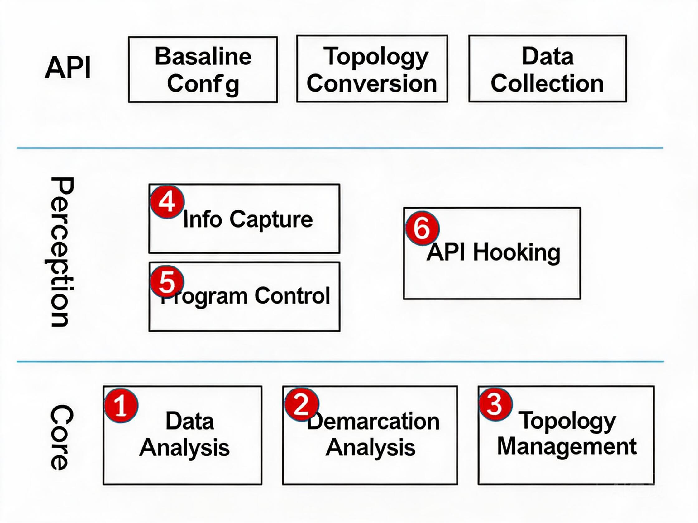

# MindStudio 26.0.0 Precision Debugging Feature Analysis and Design Specification

<!-- md-trans-meta sourceCommit=d04bd615f0a6704fd5647163e7531d767f227e36 translatedAt=2026-08-11T02:42:06.634Z pushedAt=2026-08-11T02:51:07.153Z -->

<table>
    <tr>
        <td>Affiliated SIG Group:</td>
        <td>mstt-sig</td>
    </tr>
    <tr>
        <td>Target Version:</td>
        <td>MindStudio 26.0.0</td>
    </tr>
    <tr>
        <td>Designer:</td>
        <td>wangchao</td>
    </tr>
    <tr>
        <td>Date:</td>
        <td>2026-01-20</td>
    </tr>
</table>
**Copyright © 2026 MindStudio Community**

Your reproduction, use, modification, and distribution of "this document" are governed by the Creative Commons Attribution-ShareAlike 4.0 International Public License (hereinafter referred to as "CC BY-SA 4.0"). 
For ease of understanding, you may visit <https://creativecommons.org/licenses/by-sa/4.0/> to review a summary of CC BY-SA 4.0 (which is not a substitute for the full license). 
The full text of the CC BY-SA 4.0 license is available at: <https://creativecommons.org/licenses/by-sa/4.0/legalcode>.

**Revision History**

<table>
    <tr>
        <th>Date</th>
        <th>Revision</th>
        <th>Revision Description</th>
        <th>Author</th>
        <th>Review</th>
    </tr>
    <tr>
        <td>2026.1.20</td>
        <td>26.0.0</td>
        <td>Design Specification</td>
        <td>wangchao</td>
        <td>xxx</td>
    </tr>
</table>

# 1. Feature Overview

To meet the ever-growing demand for chip computing power driven by rapidly advancing deep neural networks, Huawei launched the Ascend series AI processors in 2018. As the AI field develops at a high speed, new networks and operators emerge continuously, requiring ongoing development and optimization of operators based on Ascend chips.
Since an operator is essentially a mathematical formula that supports data of various dimensions, it is impossible to traverse all inputs and outputs after the operator is implemented, and therefore bugs may remain undiscovered. In large models, thousands of operators with different inputs are used, causing functional issues of individual operators to become network precision problems. Meanwhile, operator fusion may also introduce functional issues that ultimately affect network precision. Precision Debugging is the functional debugging in the AI domain.
Furthermore, low precision is frequently used in AI (for energy efficiency and performance considerations), and different AI chips have their own low-precision representation designs. These differences may also ultimately affect the precision results of the network. In large models, data accumulation may exceed the precision representation capability, requiring Automatic Mixed Precision to handle overflow during computation. The advent of large models has further intensified the pressure on Automatic Mixed Precision.
The precision debugging tool is primarily designed to ensure that AI models achieve normal precision expectations on Ascend chips. To achieve this goal, multiple methods exist, and this document mainly elaborates on the implementation of these methods.

⦁ Assisting in locating functional issues that arise when migrating AI models from other accelerator chips to Ascend chips. Since AI models differ from app business processes, in migration scenarios, the pre-migration model is generally used as the benchmark, and then the nodes of the AI model before and after migration are compared to identify where issues are introduced.

⦁ Precision anomaly detection and repair. Operator result overflow may cause precision anomalies; therefore, the precision debugging tool needs to detect overflow conditions. When overflow occurs, the overflow issue is repaired through the Automatic Mixed Precision module.
From a functional perspective, Precision Debugging is primarily divided into two completely distinct functional domains: overflow detection (repair) and precision demarcation.

For overflow detection (repair), the overflow detection capability of Ascend chips is mainly exposed externally and integrated into the framework, shielding differences in framework usage. Meanwhile, considering the capability differences between Ascend chips and other accelerator chips (primarily differences in data representation capability), overflow repair needs to be strengthened. In large models, low-precision representation is more prone to overflow compared to single-machine models, thereby imposing higher requirements on automatic precision compensation.
For precision demarcation, based on existing issues discovered, the main problems include operator implementation issues, entire network issues, and cumulative error issues. For operator implementation issues, it is necessary to understand the operator composition of the corresponding model, without needing to consider the upstream and downstream relationships of operators within the model. For entire network issues, they are essentially problems arising from fusion and other processing performed by the CANN software stack when scheduling operators to optimize overall performance. For cumulative error issues, they are caused by the differences in numerical representation capability between Ascend chip hardware and other accelerator brands when encountering models with poor robustness. Among existing precision demarcation tools, only the first two problems can be resolved. The cumulative error issue itself is a long-term potential problem in the entire system and can only be fundamentally resolved when model interpretability is improved.
For locating operator implementation issues and entire network issues, the essence is to understand the composition of the model, then decompose the model into finer granularities such as nodes and node associations, and identify specific problem points within the model by analyzing nodes and their preceding and succeeding dependency behaviors.

## 1.1 Scope

Precision Delimitation (Entire Network Problem Delimitation)
In the current AI field, there are two major scenarios: training and inference. The frameworks used in these scenarios differ significantly, and consequently, the model representations differ significantly as well. Due to the substantial differences in model representations, the tools for delimiting model functional problems also vary considerably. However, the following functional components are generally indispensable: model representation, data analysis (comparison), and functional problem delimitation. Problem points are identified through data analysis, and then the initial node that caused the problem is located through functional problem delimitation. In this process, different model representations must be recognized. The overall architecture is shown below:

Internal capability description of the tool:

- Data analysis: Identify nodes/edges with precision issues based on comparison algorithms
- Delimitation analysis: Locate the first problematic node based on the topology structure
- Topology Management: Built-in basic data structures are used to construct node topology relationships based on collected information, and the tool supports topology identification and comparison of nodes between the reference and the target. (All interfaces in the API are designed for topology maintenance.)
- Information Capture: Topology information and node value information are collected.
- Program control: Debugging control, such as pause and resume, is implemented through subprocess control and interface hijacking. (Program functionality remains unaffected.)
- Interface hijacking: This serves two main tasks: a. embedding the tool into the workflow; b. fixing inputs during the training process.

## 1.2 Feature Requirement List

Feature Requirement List

<table>
    <tr>
        <th>Requirement No.</th>
        <th>Requirement Name</th>
        <th>Feature Description</th>
    </tr>
    <tr>
        <td>1</td>
        <td>Precision Debugging tool msprobe training &amp; general capability enhancement</td>
        <td>MD5 real-time difference analysis dump, comparison result highlighting optimization, and monitor normalization refactoring</td>
    </tr>
    <tr>
        <td>2</td>
        <td>[Reinforcement Learning] Reinforcement learning training-inference consistency localization solution</td>
        <td>Supports training-inference data comparison in verl training-inference consistency scenarios, with support for FSDP and Megatron backends.</td>
    </tr>
    <tr>
        <td>3</td>
        <td>Inference Scenario Basic Capability Coverage Support</td>
        <td>Supports basic capability coverage for mindie, vLLM, and SGLang.</td>
    </tr>
    <tr>
        <td>4</td>
        <td>[Training-Inference] Data Parsing & Visual Analysis Capability Enhancement</td>
        <td>Visual analysis supports training data trend analysis</td>
    </tr>
</table>

# 2. Requirement Scenario Analysis

## 2.1 Feature Requirement Sources and Value Overview

[Precision Toolchain] Through real-time difference analysis, multi-backend consistency verification, inference engine coverage, and visual enhancement, the model precision debugging efficiency and training-inference reliability assurance capability are improved.

## 2.2 Feature Scenario Analysis

The following scenarios are primarily supported:

- Precision Debugging tool msProbe training & general capability enhancement: MD5 real-time difference analysis dump, comparison result highlighting optimization, and monitor normalization and reconstruction
- [Reinforcement Learning] Reinforcement learning training-inference consistency localization solution: supports training-inference data comparison in verl training-inference consistency scenarios, and supports fsdp and megatron backends
- Inference scenario basic capability coverage support: supports basic capability coverage for MindIE, vlLM, and SGLang
- [Training-Inference Consistency] Data parsing and visual analysis capability enhancement: Visual analysis supports training data trend analysis

# 4. Precision Debugging Tool msProbe Training & General Capability Enhancement

## 4.1 Design Approach

This feature needs to support the following sub-scenario capabilities:

1. MD5 real-time difference analysis dump
2. Comparison result metric highlighting optimization

## 4.2 Constraints

Not applicable.

## 4.3 Detailed Implementation (Module-Level or Process-Level Message Sequence Chart from the User Entry Point)

1. MD5 Real-Time Difference Analysis Dump

Requirement Background:
During model training on NPUs, deterministic computation issues are a common challenge. The existing msProbe tool supports the MD5 dump function for entire-network output consistency checking, but it lacks real-time automated analysis capabilities. As a result, for data with unstable reproducibility, it is impossible to perform data collection at the first occurrence. This requirement aims to quickly capture the actual data of MD5 inconsistencies by inheriting real-time monitoring and difference analysis.

Requirement Description and Implementation Plan:
A set of MD5 data for a model is pre-configured in advance. When the tool collects model data again, it can use the pre-configured MD5 data to determine the difference between each tensor in the current task and the pre-configured MD5 data. Once a divergent node is identified, the actual data is dumped.

## 4.4 DFX Attribute Design

### 4.4.1 Performance Design

_As a debugging feature, it is insensitive to performance impact and is not applicable._

### 4.4.2 Security Design

#### 4.4.2.1 Security Design Confirmation

| Checklist Content | Check Result |
| --- | --- |
| 1 Whether new inputs are introduced (UI input, command-line parameters, commands, HTTP interfaces) | Yes |
| 1.1 Whether the documentation team has been notified for updates | Yes |
| 1.2 Whether security validation is designed for inputs (which validations: length, format, type, threshold, null check, whether path-type parameters are standardized and normalized before use, etc.) | Yes |
| 2 Whether there is (cross-trust-domain) inter-process interaction | Not applicable |
| 2.1 Inter-process interaction method, whether the communication method is trusted | Not applicable |
| 2.2 Whether there is resource contention | Not applicable |
| 3 Whether file operations exist | Yes |
| 3.1 Whether external files are read (whether file size is validated, whether read content is validated, whether deserialization is secure) | Yes |
| 3.2 Whether file output is generated (whether generated file permissions are correct, whether symlink validation is performed) | Yes |
| 3.3 Whether temporary files are generated (whether they are cleaned up in a timely manner) | No |
| 3.4 Whether files are decompressed (whether decompression bombs are validated, whether decompression location is validated, whether decompression permissions are validated, etc.) | No |
| 4 Whether network communication is involved | Not applicable |
| 4.1 Whether a port is listened on (whether the communication matrix is updated, whether all-zero listening is used, whether the protocol uses secure encryption protocols, whether externally provided services have authentication, authorization; all web attack patterns must be considered, XSS, etc.) | Not applicable |
| 4.2 Whether external networks are accessed (whether the communication matrix is updated, whether the accessed URLs are in configuration files, whether the protocol used is a company-recommended secure encryption protocol, whether returned data is validated (refer to input validation), whether a timeout mechanism exists) | Not applicable |
| 5 Whether injection risks are involved | Not applicable |
| 5.1 Whether command execution is involved, whether command injection risks are mitigated | Not applicable |
| 5.2 Whether HTML interfaces are involved, whether HTML injection risks are mitigated (XSS attacks) | Not applicable |
| 5.3 Whether JLabel controls are used, whether HTML injection risks are mitigated | Not applicable |
| 5.4 Whether XML parsing is involved, whether XML injection risks are mitigated | Not applicable |
| 5.5 Whether YAML parsing is involved, whether secure parsing interfaces are used | Not applicable |
| 5.6 Whether SQL database injection is involved | Not applicable |
| 6 Whether third-party libraries are introduced | Not applicable |
| 6.1 Whether open source introduction follows the standard open source introduction process | Not applicable |
| 6.2 Whether new Python dependencies are added, whether there are dependencies on specific versions (dependencies on specific versions are generally not allowed) | Not applicable |
| 7 Whether new binary deliverables are added (whether security compilation options comply with company requirements) | Not applicable |
| 8 Whether encryption or authentication exists (whether secure encryption algorithms are used, whether the encryption/decryption process is secure) | Not applicable |
| 9 Whether sensitive information is involved (generation, use, retention, and destruction of sensitive information) | Not applicable |
| 10 Whether secure function libraries are used | No |

# 5. [Reinforcement Learning] Training-Inference Consistency Localization Solution for Reinforcement Learning

## 5.1 Design Approach

This feature must support the following sub-scenario capabilities:

1. Support training-inference data comparison in the verl training-inference consistency scenario

2. Support data collection from the dataset loading module

## 5.2 Constraints

N/A.

## 5.3 Detailed Implementation (Module-Level or Process-Level Message Sequence Chart from the User Entry)

1. Support training and inference data comparison in the verl Training-Inference Consistency scenario

Requirement Background:
In the model training and inference consistency verification scenario of the verl framework, it is necessary to ensure that, under the same input conditions, the intermediate data or final output data generated by the training process (forward propagation) and the inference process are consistent. 
This is critical for model debugging, precision verification, and deployment reliability.

Requirement Objective:
Develop a data comparison tool/module to compare key data generated during the training forward process and the inference process under the verl framework, identify and report discrepancies, and help developers verify Training-Inference Consistency.

Core Functional Requirements:

- Data Collection

Supports automatic capture of key data points in the training forward process and the inference process.

Configurable collection granularity: layer-by-layer outputs, specific layer activation values, gradient information, loss values, etc.

Supports multiple data types: tensors, scalars, statistical information, etc.

- Comparison Dimensions

Numerical precision comparison (with configurable error tolerance)

Shape/dimension consistency verification

- Data type consistency check

Special value check (anomalous values such as NaN and Inf)

- Difference analysis

Automatically identify the difference location (layer name, tensor dimension, index)

Quantify the degree of difference (absolute error, relative error, MSE, etc.)

Difference visualization support

- Report generation

Generate a detailed comparison report (HTML/JSON format)

Difference Summary Statistics

Suggested Fix Directions

## 5.4 DFX Attribute Design

### 5.4.1 Performance Design

*As a debugging feature, it is insensitive to performance impact and is not applicable.*

### 5.4.2 Security Design

#### 5.4.2.1 Security Design Confirmation

| Checklist Content | Check Result |
| --- | --- |
| 1 Whether new input is added (UI input, command-line parameters, commands, HTTP interfaces) | Yes |
| 1.1 Whether the documentation update is notified | Yes |
| 1.2 Whether security validation is designed for the input (what validations: length, format, category, threshold, null check, whether path-type parameters are normalized and standardized before use, etc.) | Yes |
| 2 Whether there is (cross-trust-domain) inter-process interaction | Not involved |
| 2.1 Whether the inter-process interaction method and communication method are trusted | Not involved |
| 2.2 Whether there is resource contention | Not involved |
| 3 Whether there are file operations | Yes |
| 3.1 Whether external files are read (whether file size is validated, whether read content is validated, whether deserialization is secure) | Yes |
| 3.2 Whether files are generated for output (whether the generated file permissions are correct, whether symbolic link validation is performed) | Yes |
| 3.3 Whether temporary files are generated (whether they are cleaned up in a timely manner) | No |
| 3.4 Whether files are decompressed (whether compression bombs are validated, whether the decompression location is validated, whether decompression permissions are validated, etc.) | No |
| 4 Whether network communication is involved | Not involved |
| 4.1 Whether a port is listened on (whether the communication matrix is updated, whether all-zero listening is used, whether the protocol uses a secure encrypted protocol, whether authentication and authorization are provided for external services, all web attack patterns need attention, XSS, etc.) | Not involved |
| 4.2 Whether external networks are accessed (whether the communication matrix is updated, whether the accessed URL is in the configuration file, whether the protocol used is a secure encrypted protocol recommended by the company, whether the returned data is validated (refer to input validation), whether there is a timeout mechanism) | Not involved |
| 5 Whether injection risks are involved | Not involved |
| 5.1 Whether command execution is involved, and whether command injection risks are mitigated | Not involved |
| 5.2 Whether an HTML interface is involved, and whether HTML injection risks are mitigated (XSS attacks) | Not involved |
| 5.3 Whether the JLabel control is used, and whether HTML injection risks are mitigated | Not involved |
| 5.4 Whether XML parsing is involved, and whether XML injection risks are mitigated | Not involved |
| 5.5 Whether YAML parsing is involved, and whether a secure parsing interface is used | Not involved |
| 5.6 Whether SQL database injection is involved | Not involved |
| 6 Whether third-party libraries are introduced | Not involved |
| 6.1 Whether open source introduction follows the normal open source introduction process | Not involved |
| 6.2 Whether new Python dependencies are added, and whether there are dependencies on specific versions (generally, depending on specific versions is not allowed) | Not involved |
| 7 Whether new binary deliverables are added (whether the security compilation options comply with company requirements) | Not involved |
| 8 Whether encryption and authentication exist (whether secure encryption algorithms are used, whether the encryption and decryption process is secure) | Not involved |
| 9 Whether sensitive information exists (generation, use, retention, and destruction of sensitive information) | Not involved |
| 10 Whether the secure function library is used | No |

# 6. Inference Scenario Basic Capability Coverage Support

## 6.1 Design Approach

This feature is required to support the following sub-scenario capabilities:

1. Support for dynamic start/stop dump in vLLM scenarios
2. Basic capability support for SGLang dynamic graph scenarios

## 6.2 Constraints

N/A.

## 6.3 Detailed Implementation (Module-Level or Process-Level Message Sequence Chart from the User Entry Point)

With the widespread adoption of large model inference frameworks such as vLLM and SGLang, it is necessary to collect and analyze key data during the inference process to support:

- Model performance optimization analysis

- Inference accuracy verification

- Resource usage monitoring

- Exception diagnosis and debugging

## 6.4 DFX Attribute Design

### 6.4.1 Performance Design

_As a debugging feature, it is insensitive to performance impact and is not involved._

### 6.4.2 Security Design

#### 6.4.2.1 Security Design Confirmation

| Checklist Content | Check Result |
| --- | --- |
| 1 Whether new input is added (UI Input, Command-line Parameter, command, HTTP interface) | Yes |
| 1.1 Whether the documentation update is notified | Yes |
| 1.2 Whether security validation is designed for the input (what validations: length, format, category, threshold, empty check, whether path-type parameters are normalized and standardized before use, etc.) | Yes |
| 2 Whether there is (cross-trust-domain) inter-process interaction | Not applicable |
| 2.1 Whether the inter-process interaction method and communication method are trusted | Not applicable |
| 2.2 Whether there is resource contention | Not applicable |
| 3 Whether there are file operations | Yes |
| 3.1 Whether external files are read (whether file size is validated, whether read content is validated, whether deserialization is secure) | Yes |
| 3.2 Whether files are generated for output (whether the generated file permissions are correct, whether symbolic link validation is performed) | Yes |
| 3.3 Whether temporary files are generated (whether they are cleaned up in a timely manner) | No |
| 3.4 Whether files are decompressed (whether compression bombs are validated, whether the decompression location is validated, whether decompression permissions are validated, etc.) | No |
| 4 Whether network communication is involved | Not applicable |
| 4.1 Whether a port is listened on (whether the communication matrix is updated, whether all-zero listening is used, whether the protocol uses a secure encrypted protocol, whether authentication and authorization are provided for external services, all web attack patterns need attention, XSS, etc.) | Not applicable |
| 4.2 Whether external networks are accessed (whether the communication matrix is updated, whether the accessed URL is in the configuration file, whether the protocol used is a secure encrypted protocol recommended by the company, whether the returned data is validated (refer to input validation), whether there is a timeout mechanism) | Not applicable |
| 5 Whether injection risks are involved | Not applicable |
| 5.1 Whether command execution is involved, and whether command injection risks are mitigated | Not applicable |
| 5.2 Whether an HTML interface is involved, and whether HTML injection risks are mitigated (XSS attacks) | Not applicable |
| 5.3 Whether the JLabel control is used, and whether HTML injection risks are mitigated | Not applicable |
| 5.4 Whether XML parsing is involved, and whether XML injection risks are mitigated | Not applicable |
| 5.5 Whether YAML parsing is involved, and whether a secure parsing interface is used | Not applicable |
| 5.6 Whether SQL database injection is involved | Not applicable |
| 6 Whether third-party libraries are introduced | Not applicable |
| 6.1 Whether open source introduction follows the normal open source introduction process | Not applicable |
| 6.2 Whether new Python dependencies are added, and whether there are dependencies on specific versions (generally, depending on specific versions is not allowed) | Not applicable |
| 7 Whether new binary deliverables are added (whether security compilation options comply with company requirements) | Not applicable |
| 8 Whether encryption and authentication exist (whether secure encryption algorithms are used, whether the encryption and decryption process is secure) | Not applicable |
| 9 Whether sensitive information exists (generation, use, retention, and destruction of sensitive information) | Not applicable |
| 10 Whether secure function libraries are used | No |

# 7. [Training-Inference] Data Parsing & Visual Analysis Capability Enhancement

## 7.1 Design Approach

This feature must support the following sub-scenario capabilities:

1. Visual analysis supports training trend analysis
2. Visualization supports analysis of TP, PP, VPP, and DP simulated model sharding views

## 7.2 Constraints

N/A.

## 7.3 Detailed Implementation

With the widespread adoption of the verl framework in deep learning training and inference scenarios, the current data analysis and visualization capabilities face the following core issues:

- Data Parsing Limitations

Single format support: Currently, only basic Tensor data formats are supported, lacking complete parsing for complex nested structures, distributed training data, and Mixed Precision data.

Insufficient granularity: Only overall model-level data statistics can be performed, lacking fine-grained layer-level and neuron-level data insights.

Insufficient real-time capability: Data collection during training operates in a post-hoc analysis mode, making it impossible to monitor the change trends of key metrics in real time.

Missing metadata: The parsed data lacks contextual metadata (such as training steps, learning rate, gradient norm, etc.), making correlation analysis difficult.

## 7.4 DFX Attribute Design

### 7.4.1 Performance Design

_This is a debugging feature, which is insensitive to performance impact and is not involved._

### 7.4.2 Security Design

#### 7.4.2.1 Security Design Confirmation

| Checklist Content | Check Result |
| --- | --- |
| 1 Whether new input is added (UI Input, Command-line Parameter, command, HTTP interface) | Yes |
| 1.1 Whether the documentation update is notified | Yes |
| 1.2 Whether security validation is designed for the input (what validations: length, format, category, threshold, null check, whether path-type parameters are normalized and standardized before use, etc.) | Yes |
| 2 Whether there is (cross-trust-domain) inter-process interaction | Not applicable |
| 2.1 Whether the inter-process interaction method and communication method are trusted | Not applicable |
| 2.2 Whether there is resource contention | Not applicable |
| 3 Whether there are file operations | Yes |
| 3.1 Whether external files are read (whether file size is validated, whether read content is validated, whether deserialization is secure) | Yes |
| 3.2 Whether files are generated as output (whether the generated file permissions are correct, whether symbolic link validation is performed) | Yes |
| 3.3 Whether temporary files are generated (whether they are cleaned up in a timely manner) | No |
| 3.4 Whether files are decompressed (whether compression bombs are validated, whether the decompression location is validated, whether decompression permissions are validated, etc.) | No |
| 4 Whether network communication is involved | Not applicable |
| 4.1 Whether a port is listened on (whether the communication matrix is updated, whether all-zero listening is used, whether the protocol uses a secure encryption protocol, whether the externally provided service has authentication and authorization, all web attack patterns need attention, XSS, etc.) | Not applicable |
| 4.2 Whether external networks are accessed (whether the communication matrix is updated, whether the accessed URL is in the configuration file, whether the protocol used is a secure encryption protocol recommended by the company, whether the returned data is validated (refer to input validation), whether there is a timeout mechanism) | Not applicable |
| 5 Whether injection risks are involved | Not applicable |
| 5.1 Whether command execution is involved, and whether command injection risks are mitigated | Not applicable |
| 5.2 Whether an HTML interface is involved, and whether HTML injection risks are mitigated (XSS attacks) | Not applicable |
| 5.3 Whether the JLabel control is used, and whether HTML injection risks are mitigated | Not applicable |
| 5.4 Whether XML parsing is involved, and whether XML injection risks are mitigated | Not applicable |
| 5.5 Whether YAML parsing is involved, and whether a secure parsing interface is used | Not applicable |
| 5.6 Whether SQL database injection is involved | Not applicable |
| 6 Whether third-party libraries are introduced | Not applicable |
| 6.1 Whether open source introduction follows the normal open source introduction process | Not applicable |
| 6.2 Whether new Python dependencies are added, and whether there is a dependency on a specific version (generally, dependency on a specific version is not allowed) | Not applicable |
| 7 Whether new binary deliverables are added (whether security compilation options comply with company requirements) | Not applicable |
| 8 Whether encryption and authentication exist (whether secure encryption algorithms are used, whether the encryption and decryption process is secure) | Not applicable |
| 9 Whether sensitive information exists (generation, use, retention, and destruction of sensitive information) | Not applicable |
| 10 Whether secure function libraries are used | No |
