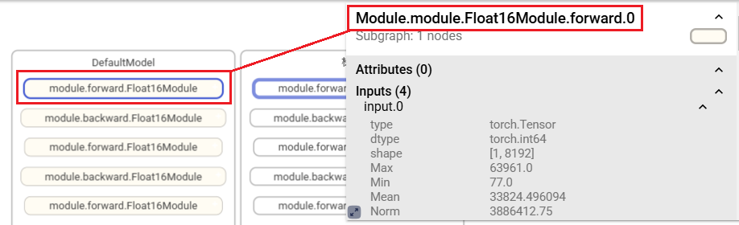
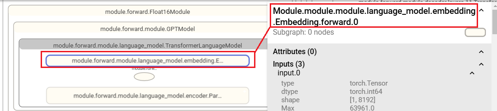
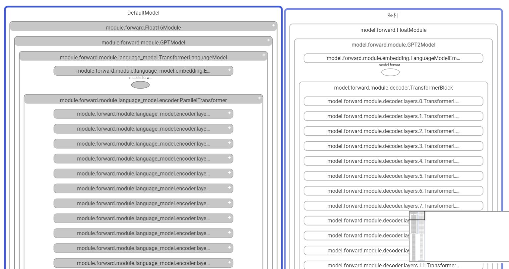
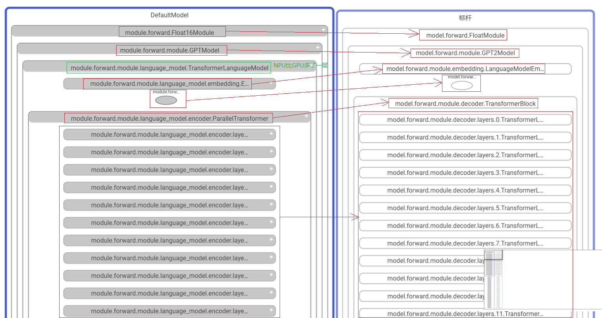
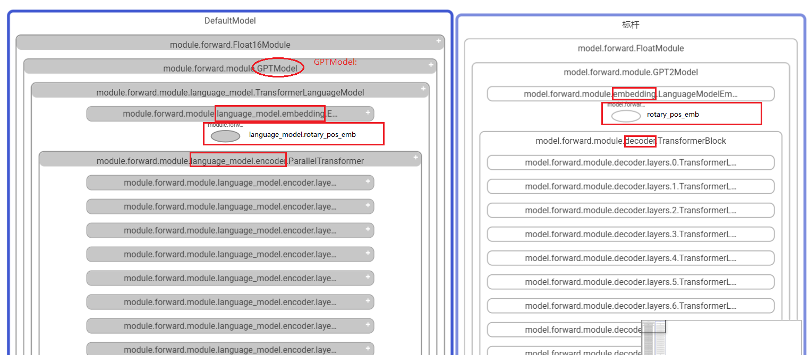
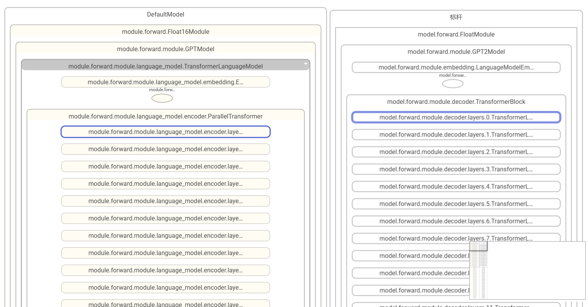
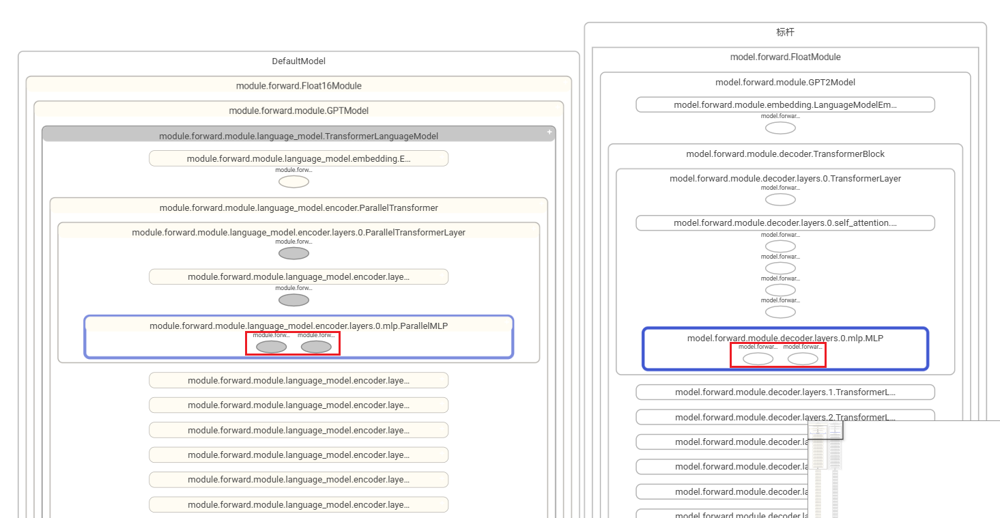
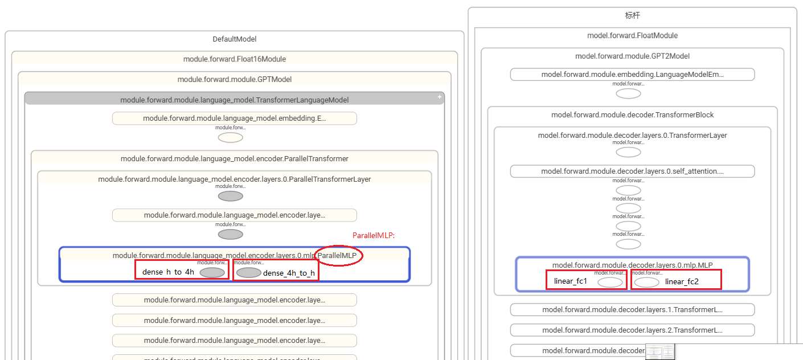
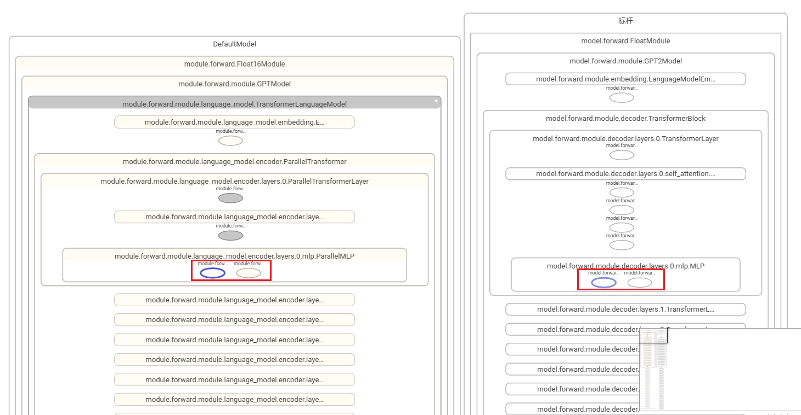

# Configuring Layer Mapping for Hierarchical Model Visualization

## Usage Scenario

In cross-suite comparison within the same framework (e.g., PyTorch DeepSpeed vs. Megatron) or cross-framework comparison (e.g., PyTorch vs. MindSpore), **some model layers and layer names may differ due to code implementation differences, making it impossible to match them directly**. Therefore, layer name mapping is required for comparison.

## Module Naming Rules

Some node names are excessively long—for example, `Module.module.module.language_model.embedding.Embedding.forward.0`—making them difficult to display fully on graph nodes. As a result, forward or backward information may be omitted. To address this, the prefix `Module` is removed from the displayed node name, and the forward or backward information is moved to the second position in the name string.





### Naming Format

**{Module}.{module_name}.{class_name}.{forward/backward}.{number_of_calls}**

**Layer mapping is mainly used to map module names.**

#### **Naming Example**

- **Module.module.Float16Module.forward.0** -----> Module{**Module**}.module{**module_name**}.Float16Module{**class_name**}.forward.0{**number_of_calls**}
- **Module.module.module.GPTModel.forward.0** -----> Module{**Module**}.module.module{**module_name**}.GPTModel{**class_name**}.forward.0{**number_of_calls**}
- **Module.module.module.language_model.TransformerLanguageModel.forward.0** -----> Module{**Module**}.module.module.language_model{**module_name**}.TransformerLanguageModel{**class_name**}.forward.0{**number_of_calls**}
- **Module.module.module.language_model.embedding.Embedding.forward.0** -----> Module{**Module**}.module.module.language_model.embedding{**module_name**}.Embedding{**class_name**}.forward.0{**number_of_calls**}

As shown in the preceding examples, `module_name` grows longer as the model level deepens. For the embedding layer, `module_name` combines the`language_model` layer with its upper and top-level modules.

## Example

As shown in the figure, the left part represents the NPU model and the right part the GPU model. Due to differences in code implementation, the model levels and level names differ, preventing node matching. Gray nodes in the figure indicate unmatched nodes.



### Analyzing the Figure

Even when the same model is implemented with different suites or frameworks, the level relationships and level names may differ. Nevertheless, matching relationships can still be identified from the node names in the figure. For instance, the embedding layer is named *xxx_embedding* rather than *xxx_norm* in the code. The node names retain embedding-related information, and the level relationships remain similar.



According to the analysis, the node matching relationships are as follows.

Note that you only need to pay attention to the differences in `module_name`.

| NPU Node Name          | GPU Node Name                                                       | module_name Difference                       |
|-------------------|----------------------------------------------------------------|---------------------------|
| Module.module.Float16Module.forward.0 | Module.model.FloatModule.forward.0                                 | `module` for the NPU; `model` for the GPU.     |
| Module.module.module.GPTModel.forward.0 | Module.model.module.GPT2Model.forward.0                            | `module` for both NPU and GPU.|
| Module.module.module.language_model.TransformerLanguageModel.forward.0 | None                                                             | The NPU has one more layer.                  |
| Module.module.module.language_model.embedding.Embedding.forward.0 | Module.module.module.embedding.LanguageModelEmbedding.forward.0  | `language_model.embedding` for the NPU; `embedding` for the GPU.          |
| Module.module.module.language_model.rotary_pos_emb.RotaryEmbedding.forward.0 | Module.module.module.rotary_pos_emb.RotaryEmbedding.forward.0    | `language_model.rotary_pos_emb` for the NPU; `rotary_pos_emb` for the GPU.|
| Module.module.module.language_model.encoder.ParallelTransformer.forward.0 | Module.module.module.decoder.TransformerBlock.forward.0          | `language_model.encoder` for the NPU; `decoder` for the GPU.              |
| Module.module.module.language_model.encoder.layers.0.ParallelTransformerLayer.forward.0 | Module.module.module.decoder.layers.0.TransformerLayer.forward.0 | `layers` for both NPU and GPU, with difference only between parent layers.                       |

### Creating the `layer_mapping` Configuration File

Prepare a file named `mapping.yaml` and establish the mapping relationship of `module_name`.

#### Top-Level Module Mapping

`Module.module.Float16Module.forward.0` (for the NPU) and `Module.model.FloatModule.forward.0` (for the GPU) are at the top layer of a graph. You need to perform the following configurations.


```yaml
TopLayer:
  module: model
```

#### Other Module Mapping

Configure the submodules under `module`. Although the class names on the two sides are different (`GPTModel` for the NPU and `GPT2Model` for the GPU), you only need to use the NPU-side class name (i.e., the class name on the left side of the graph) for configuration—no need to consider the class name on the right side.

Cross-layer configuration is involved here. The NPU has an additional `language_model` layer, which is used as the prefix of the `embedding` layer, `rotary_pos_emb` layer, and `encoder` layer.



```yaml
GPTModel:
    language_model.embedding: embedding
    language_model.rotary_pos_emb: rotary_pos_emb
    language_model.encoder: decoder
```

Then, check the submodules under the`Module.module.module.language_model.encoder.ParallelTransformer.forward.0` layer.

The layers beneath this layer are named `layers` on both the NPU and GPU. Since the layer names match, no configuration is required.

### Effect Viewing

Run the following command to specify `-lm`:

```bash
msprobe graph_visualize -i ./compare.json -o ./output -lm ./mapping.yaml
```

It can be seen that all the layers configured in the `mapping.yaml` file are matched, except the `language_model` layer (which is only on the NPU and has no matching layer on the GPU).



### Further Configuration

If unmatched nodes appear during node expansion, continue by configuring the `mapping.yaml` file.



According to the preceding analysis, the node mapping is as follows:

| NPU Node Name          | GPU Node Name                                                         | Difference                                         |
|-------------------|------------------------------------------------------------------|---------------------------------------------|
| Module.module.module.language_model.encoder.layers.0.mlp.dense_h_to_4h.ColumnParallelLinear.forward.0 | Module.module.module.decoder.layers.0.mlp.linear_fc1.TELayerNormColumnParallelLinear.forward.0      | `dense_h_to_4h` for the NPU; `linear_fc1` for the GPU.           |
| Module.module.module.language_model.encoder.layers.0.mlp.dense_4h_to_h.RowParallelLinear.forward.0 | Module.module.module.decoder.layers.0.mlp.linear_fc2.TERowParallelLinear.forward.0  | `dense_4h_to_h` for the NPU; `linear_fc2` for the GPU.|



Add the following configuration to the `mapping.yaml` file:

```yaml
TopLayer:
  module: model

GPTModel:
    language_model.embedding: embedding
    language_model.rotary_pos_emb: rotary_pos_emb
    language_model.encoder: decoder

ParallelMLP:
    dense_h_to_4h: linear_fc1
    dense_4h_to_h: linear_fc2
```

Check the result, and it can be seen that nodes are successfully matched.


