# Data Collection and Automatic Comparison in MindSpeed and LLamaFactory

## Usage Scenario

For the same model implemented on the MindSpeed and LLamaFactory frameworks, if model hyperparameters, environment variables, initial weights, and training data are consistent but model precision differs during training, a network-wide comparison is required to identify the precision discrepancies.

This document uses the Qwen2.5vl and Qwen2.5 models as examples to describe how to perform data collection and automatic comparison in MindSpeed and LLamaFactory.

## Data Collection

### Preparing a Data Collection Configuration File

Before data collection, you need to prepare a JSON file (`config.json` in the example) to specify configurations required for data collection.

The configurations used in this example are described as follows. For more configurations and details, see [Configuration File Introduction](../dump/config_json_introduct.md).

```json
{
    "task": "statistics",
    "dump_path": "/home/data_dump",
    "rank": [],
    "step": [0],
    "level": "mix",
    "async_dump": false,

    "statistics": {
        "scope": [], 
        "list": [],
        "tensor_list": [],
        "data_mode": ["all"],
        "summary_mode": "statistics"
    }
}
```

Note that after data collection is complete, model comparison will be performed in a visualized manner. In the configuration file, set `level` to `L0` (module data) or `mix` (module + API data).

### Adding msProbe Collection APIs

See the figures below for APIs used. For more configurations and API descriptions, see [Precision Data Collection in PyTorch](../dump/pytorch_data_dump_instruct.md).

#### Data Collection in LLamaFactory

LLamaFactory relies on the underlying capabilities of Transformers, so you need to add msProbe collection function to Transformers.

Take Transformers 4.49.0 as an example. Use `pip3 show Transformers` to obtain `location path` and open the `location path/transformers/trainer.py` file.

1. Add required APIs to the `trainer.py` file to initialize data collection configurations and fix random numbers.

   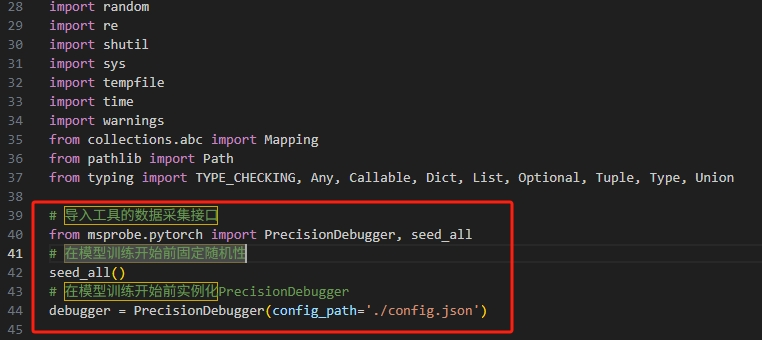

2. Add required APIs to the logic position of a training iteration in the `trainer.py` file to control the start, stop, and step counting of data collection.

   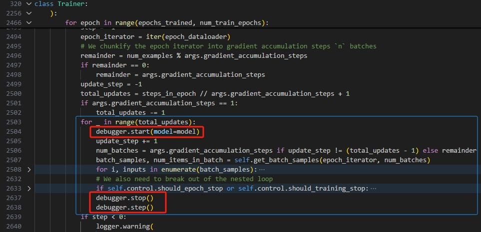

3. After the configuration is complete, start the model training script. Data will be automatically collected. For details about the format of the flushed data, see [Dump Result File](../dump/pytorch_data_dump_instruct.md#dump-result-file) in *Precision Data Collection in PyTorch*.

#### MindSpeed Data Collection

Open the `training.py` file. The MindSpeed-MM path is `mindspeed_mm/training.py`, and the MindSpeed-LLM path is `mindspeed_llm/training/training.py`.

1. Add required APIs to the `training.py` file to initialize data collection configurations and fix random numbers.

   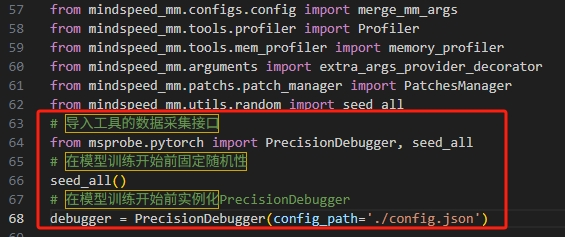

2. Add required APIs to the logic position of a training iteration in the `training.py` file to control the start, stop, and step counting of data collection.

   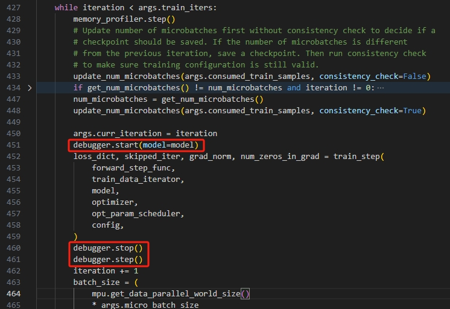

3. After the configuration is complete, start the model training script. Data will be automatically collected. For details about the format of the flushed data, see [Dump Result File](../dump/pytorch_data_dump_instruct.md#dump-result-file) in *Precision Data Collection in PyTorch*.

## Automatic Comparison

### Model Comparison in Hierarchical Visualization Mode

This function parses the precision data dumped by msProbe, restores the model graph structure, and compares the precision data at each model layer, helping you understand the model structure and analyze precision issues.

Run the following command to perform model comparison in hierarchical visualization:

```bash
msprobe graph_visualize -tp ./target_path -gp ./golden_path -o ./output_path -lm ./layer_mapping.yaml
```

For details about the parameters, see [Hierarchical Visualization Overview](../accuracy_compare/pytorch_visualization_instruct.md#hierarchical-visualization-overview).

For model comparison scenarios that involve both the MindSpeed and LlamaFactory frameworks, the `-lm` parameter is mandatory. The following content describes how to configure the `layer_mapping.yaml` file required by this parameter.

After model comparison in hierarchical visualization mode is complete, you can use TensorBoard to view the model structure and precision comparison result on the browser page. For details, see [Starting TensorBoard](../accuracy_compare/pytorch_visualization_instruct.md#starting-tensorboard) and [Viewing Results in a Browser](../accuracy_compare/pytorch_visualization_instruct.md#viewing-results-in-browser).

### layer_mapping Configurations

msProbe can compare data with the same dump name between MindSpeed and LLamaFactory. However, due to their code implementation differences, some model layers and layer names may differ, making it impossible to match them directly. Therefore, layer name mapping is required for comparison.

#### layer_mapping File Template

The layer_mapping file templates for Qwen2.5vl and Qwen2.5 models are provided here and can be used directly. If you use other models or have customized and modified the source code of the MindSpeed and LLamaFactory frameworks, layer_mapping file templates may become invalid. In this case, follow the subsequent steps to modify the templates.

Each model has two layer_mapping file templates. One template is for MindSpeed on the NPU and LLamaFactory on the Bench, and the other is for LLamaFactory on the NPU and MindSpeed on the Bench. The mapping content varies.

The file name is the format of `\*.yaml`. The asterisk (*) indicates the file name, which can be customized. In this document, the file is named `layer_mapping.yaml`.

**Qwen2.5vl**

```yaml
# MindSpeed-MM on the NPU side and LLamaFactory on the Bench side
TopLayer:
  0.module: module

Float16Module:
  module.image_encoder: visual
  module.text_decoder: model

VisionModel:
  encoder.patch_embed: patch_embed
  encoder.rotary_pos_emb: rotary_pos_emb
  encoder.blocks.layers: blocks
  projector: merger

TransformerLayer:
  input_layernorm: norm1
  self_attention: attn
  pre_mlp_layernorm: norm2

Qwen2vlVitSelfAttention:
  linear_qkv: qkv
  linear_proj: proj

MLP:
  linear_fc1: up_proj
  linear_fc2: down_proj

MultimodalProjector:
  layernorm: ln_q
  encoder: mlp
  encoder.linear_fc1: mlp.0
  encoder.linear_fc2: mlp.2

MMGPTModel:
  embedding.word_embeddings: embed_tokens
  rotary_pos_emb: rotary_emb
  decoder.layers: layers
  decoder.final_layernorm: norm
  output_layer: lm_head
```

```yaml
# LLamaFactory on the NPU side and MindSpeed-MM on the Bench side
TopLayer:
  module: 0.module

Qwen2_5_VLForConditionalGeneration:
  visual: module.image_encoder
  model: module.text_decoder
  lm_head: module.text_decoder.output_layer

Qwen2_5_VisionTransformerPretrainedModel:
  patch_embed: encoder.patch_embed
  rotary_pos_emb: encoder.rotary_pos_emb
  blocks: encoder.blocks.layers
  merger: projector

Qwen2_5_VLVisionBlock:
  norm1: input_layernorm
  attn: self_attention
  norm2: pre_mlp_layernorm

Qwen2_5_VLVisionSdpaAttention:
  qkv: linear_qkv
  proj: linear_proj

Qwen2_5_VLMLP:
  up_proj: linear_fc1
  down_proj: linear_fc2

Qwen2_5_VLPatchMerger:
  ln_q: layernorm
  mlp: encoder
  mlp.0: encoder.linear_fc1
  mlp.2: encoder.linear_fc2

Qwen2_5_VLModel:
  embed_tokens: embedding.word_embeddings
  rotary_emb: rotary_pos_emb
  layers: decoder.layers
  norm: decoder.final_layernorm

Qwen2_5_VLDecoderLayer:
  self_attn: self_attention
  self_attn.o_proj: self_attention.linear_proj
  post_attention_layernorm: pre_mlp_layernorm
```

**Qwen2.5**

```yaml
# MindSpeed-LLM on the NPU side and LLamaFactory on the Bench side
TopLayer:
  0.module: module

Float16Module:
  module: model
  module.output_layer: lm_head

GPTModel:
  embedding.word_embeddings: embed_tokens
  decoder.layers: layers
  decoder.final_layernorm: norm

TransformerLayer:
  self_attention: self_attn
  pre_mlp_layernorm: post_attention_layernorm

SelfAttention:
  linear_proj: o_proj

MLP:
  linear_fc1: up_proj
  linear_fc2: down_proj
```

```yaml
# LLamaFactory on the NPU side and MindSpeed-LLM on the Bench side
TopLayer:
  module: 0.module

Qwen2ForCausalLM:
  model: module
  lm_head: module.output_layer

Qwen2Model:
  embed_tokens: embedding.word_embeddings
  layers: decoder.layers
  norm: decoder.final_layernorm

Qwen2DecoderLayer:
  self_attn: self_attention
  post_attention_layernorm: pre_mlp_layernorm

Qwen2Attention:
  o_proj: linear_proj

Qwen2MLP:
  up_proj: linear_fc1
  down_proj: linear_fc2
```

#### layer_mapping Configuration

The Qwen2.5vl model, MindSpeed on the NPU side, and LlamaFactory on the Bench side are used as examples.

1. Print model structures.

   `debugger.start(model=model)` is added to the model file, as described in [Adding msProbe Collection APIs](#adding-msprobe-collection-apis). To print model structures, add `print(model)` to `model` under `start`.

   Printed model structures: [mindspeed-mm-qwen25vl.txt](../figures/visualization/mindspeed_llamafactoary_img/mindspeed-mm-qwen25vl.txt), [llamafactory-qwen25vl.txt](../figures/visualization/mindspeed_llamafactoary_img/llamafactory-qwen25vl.txt)

2. Configure layer mapping from outer to inner layers based on model structures.

- Structure 1

   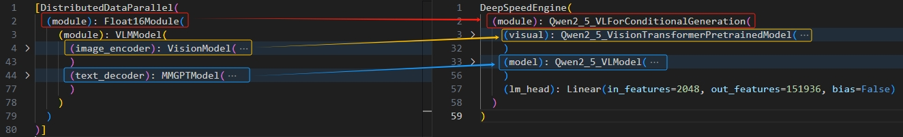
   
   ```yaml
   TopLayer: # Top layer of the model
     0.module: module  # The model type of MindSpeed is list. msProbe adds a numeric prefix to represent the index of the current model in the list. Therefore, a mapping from 0.module to module is required.
   
   Float16Module: # Float16Module of MindSpeed is at the same level as Qwen2_5_VLForConditionalGeneration of LLamaFactory. Map their sub-layers.
     module.image_encoder: visual # Float16Module of MindSpeed has an additional sub-layer module. Cross-layer elements are separated by periods (.), such as module.image_encoder.
     module.text_decoder: model
   ```

- Structure 2

   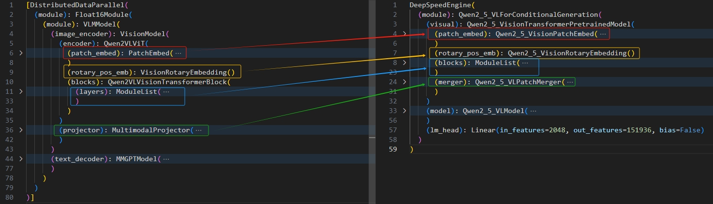
   
   ```yaml
   VisionModel: # VisionModel of MindSpeed is at the same level as Qwen2_5_VisionPatchEmbed of LLamaFactory. Map their sub-layers.
     encoder.patch_embed: patch_embed
     encoder.rotary_pos_emb: rotary_pos_emb
     encoder.blocks.layers: blocks
     projector: merger
   ```

- Structure 3

   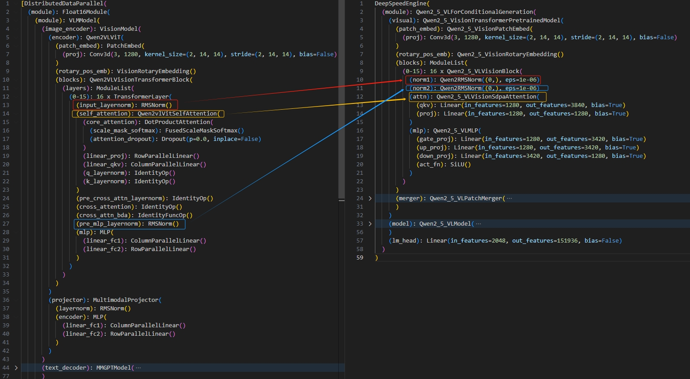
   
   ```yaml
   TransformerLayer: # TransformerLayer of MindSpeed is at the same level as Qwen2_5_VLVisionBlock of LLamaFactory. Map their sub-layers.
     input_layernorm: norm1
     self_attention: attn
     pre_mlp_layernorm: norm2
   ```

- Structure 4

   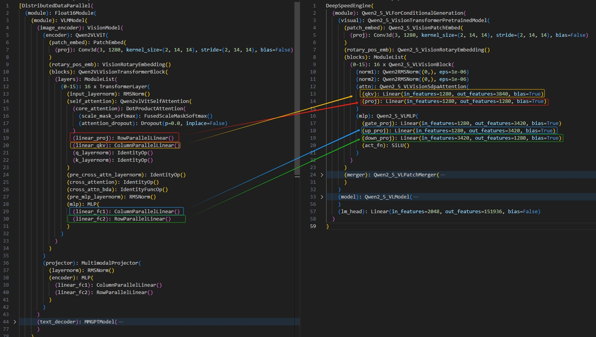
   
   ```yaml
   Qwen2vlVitSelfAttention: # Qwen2vlVitSelfAttention of MindSpeed is at the same level as Qwen2_5_VLVisionSdpaAttention of LLamaFactory. Map their sub-layers.
     linear_qkv: qkv
     linear_proj: proj
   
   MLP: # MLP of MindSpeed is at the same level as Qwen2_5_VLMLP of LLamaFactory. Map their sub-layers.
     linear_fc1: up_proj
     linear_fc2: down_proj
   ```

- Structure 5

   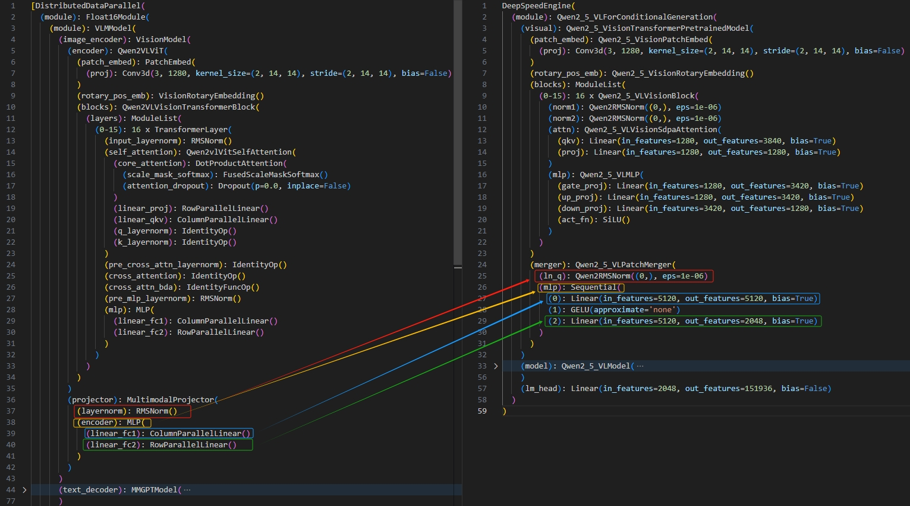
   
   ```yaml
   MultimodalProjector: # MultimodalProjector of MindSpeed is at the same level as Qwen2_5_VLPatchMerger of LLamaFactory. Map their sub-layers.
     layernorm: ln_q
     encoder: mlp
     encoder.linear_fc1: mlp.0
     encoder.linear_fc2: mlp.2
   ```

- Structure 6

   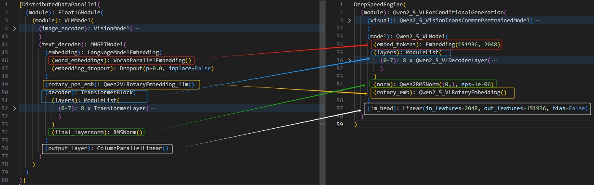
   
   ```yaml
   MMGPTModel: # MMGPTModel of MindSpeed is at the same level as Qwen2_5_VLModel of LLamaFactory. Map their sub-layers.
     embedding.word_embeddings: embed_tokens
     rotary_pos_emb: rotary_emb
     decoder.layers: layers
     decoder.final_layernorm: norm
     output_layer: lm_head
   ```

- Structure 7

   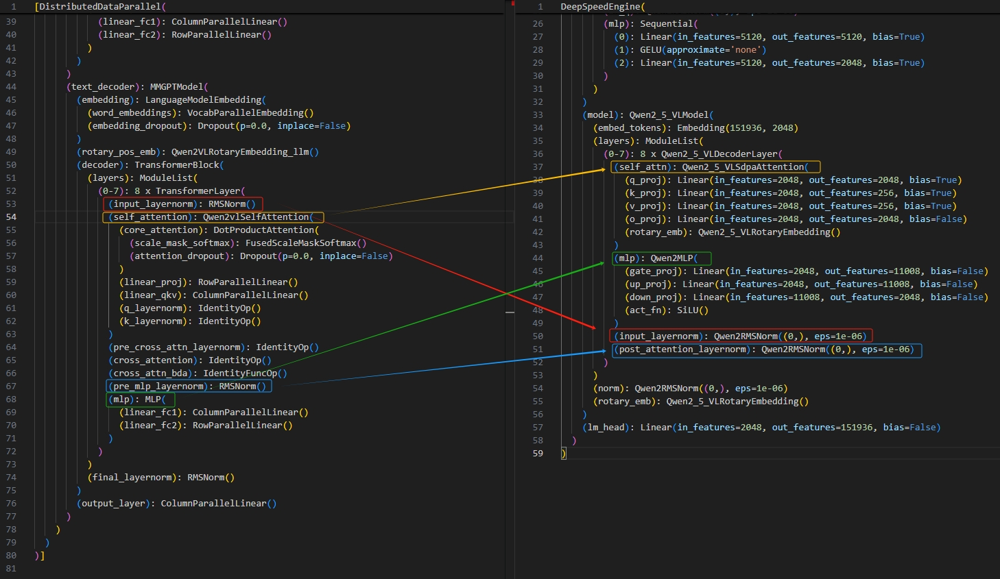
   
   The TransformerLayer and MLP layers have already been configured and cannot be modified. You can [manually select nodes for mapping](#selecting-nodes-for-mapping).

### Selecting Nodes for Mapping

If some nodes are not matched after layer_mapping configuration, you can use the mouse to select two gray nodes to be matched on the browser page.

For details, see [Selecting Nodes for Mapping](../accuracy_compare/pytorch_visualization_instruct.md#selecting-nodes-for-mapping).
