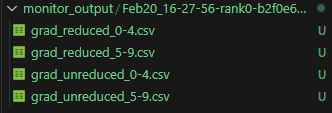

# Lightweight Training Status Monitoring Tool

## Overview

Monitor, as a lightweight training status monitoring tool, can collect and record activations, weights, gradients, optimizer status, and intermediate values of communication operators during model training with low performance loss, and display training status in real time.

## Preparations

**Installation**

Install msProbe by referring to [msProbe Installation Guide](./msprobe_install_guide.md).

**Constraints**

- PyTorch: 2.1 or later
- MindSpore: 2.4.10 or later. Only MindSpore dynamic graphs are supported. The MSAdapter suite is also supported.

## Quick Start

This tool monitors the corresponding objects as required. For example, during abnormal training with more losses but normal gradient norm, this tool monitors the model's forward process. During training with abnormal gradient norm, it monitors the gradients of weights and activations.
It is recommended that this tool be enabled for a long time in scenarios where the performance loss of weight gradient monitoring is small (full monitoring of a 20B dense model; time increase < 1%; memory increase < 1%). In scenarios where the performance loss of activation monitoring is large, enable this tool only when necessary or monitor only some of activations.

### Preparing the Configuration File

Create a `config.json` file in the current directory. For details about each field in the configuration file, see [Detailed Configuration](#detailed-configuration). The following uses the configuration of weight gradient collection as an example:

```json
{
    "targets": {},
    "wg_distribution": true,
    "format": "csv",
    "ops": ["min","max", "mean", "norm"],
    "ndigits": 16
}
```

### Tool Enablement

Locate where the model and optimizer are defined and where training begins in the actual training code, then add the tool enablement code. The enablement code varies in different scenarios.

- PyTorch

```diff
# Megatron-LM(core_r0.6.0)  training.py
model, optimizer, opt_param_scheduler = setup_model_and_optimizer(model_provider, model_type) 
...
# Insert the monitor tool immediately after the model and optimizer are defined.
+from msprobe.pytorch import TrainerMon
+monitor = TrainerMon(
+    config_file_path="./monitor_config.json",
+    params_have_main_grad=True,  # Whether to use main_grad for the weight. Generally, the value is True for Megatron and False for others. The default value is True.
+) 
+monitor.set_monitor(
+    model,
+    grad_acc_steps=args.global_batch_size//args.data_parallel_size//args.micro_batch_size,
+    optimizer=optimizer
+) 
```

If DeepSpeed, Accelerate, and Transformers are used together, use `optimizer=optimizer.optimizer`. If DeepSpeed is not used and Accelerate and Transformers are used separately, use `optimizer=optimizer`.

When both DeepSpeed and Accelerate are used, the tool enabling position is as follows:

```diff
model, optimizer, trainloader, evalloader, schedular = accelerator.prepare(...)
...
+monitor = TrainerMon(...)
+monitor.set_monitor(....optimizer=optimizer.optimizer)
```

When both DeepSpeed and Transformers are used, the tool enabling position is as follows:

```diff
# src/transformers/trainer.py
class Trainer:
    def _inner_training_loop:
        ...
+       monitor = TrainerMon(...)
+       monitor.set_monitor(....optimizer=self.optimizer.optimizer)

        for epoch in range(epochs_trained, num_train_epochs):
            ...
```

- MindSpore

```diff
# Megatron-LM(core_r0.6.0)  training.py
model, optimizer, opt_param_scheduler = setup_model_and_optimizer(model_provider, model_type) 
...
# Insert the monitor tool immediately after the model and optimizer are defined.
+from msprobe.mindspore import TrainerMon
+monitor = TrainerMon(
+    config_file_path="./monitor_config.json",
+    process_group=None,
+    params_have_main_grad=True,  # Whether to use main_grad for weights. Generally, the value is True for Megatron and False for others. The default value is True.
+) 
# Mount objects to be monitored.
+monitor.set_monitor(
+    model,
+    grad_acc_steps=args.global_batch_size//args.data_parallel_size//args.micro_batch_size,
+    optimizer=optimizer
+) 
```

### Precautions

If the framework is FSDP1, ensure that `use_orig_params` is set to `True` when the model is wrapped by FSDP.

## Functions of the Training Status Monitoring Tool

The following table lists the tool functions.

| Function                                                        | Description                                                        | Supported Scenario          |
| ------------------------------------------------------------ | ------------------------------------------------------------ | ----------------- |
| [Weight Monitoring](#weight-monitoring)                                       | Monitors weights.                                                | PyTorch, MindSpore|
| [Weight Gradient Monitoring](#weight-gradient-monitoring)                               | Monitors weight gradients.                                            | PyTorch, MindSpore|
| [Activation Monitoring](#activation-monitoring)                                   | Monitors activations.                                              | PyTorch, MindSpore|
| [Optimizer Status Monitoring](#optimizer-status-monitoring)                           | Monitors optimizer status.                                          | PyTorch, MindSpore|
| [Collecting Module Stack Info](#collecting-module-stack-information)                              | Collects the stack information of the module in the first step to facilitate fault locating.                             | PyTorch, MindSpore|
| [Specifying Monitoring Objects](#specifying-monitoring-objects)                               | Specifies the `nn.Module(nn.Cell)` to be monitored and its inputs and outputs.                | PyTorch, MindSpore|
| [Printing the Model Structure](#printing-the-model-structure)                               | Prints the model structure.                                                | PyTorch           |
| [L2 Feature Interpretability Monitoring](#l2-feature-interpretability-monitoring)                        | Monitors high-level model status.                                       | PyTorch, MindSpore|
| [mbs-Granularity Gradient Monitoring](#mbs-granularity-gradient-monitoring)                   | When gradient monitoring is enabled, gradients can be collected at the `micro_batch_size` granularity.                | PyTorch, MindSpore|
| [Alarm Monitoring](#alarm-monitoring)                   | Automatically generates alarms when the monitored object metrics are abnormal and supports data flushing.                 | PyTorch, MindSpore|
| [Converting CSV Data to TensorBoard Files for Visual Display](#converting-csv-data-to-tensorboard-for-visualization)| Converts CSV data to TensorBoard files for display.                                | PyTorch           |
| [Dynamic Start and Stop](#dynamic-start-and-stop)                                       | Dynamically modifies configurations to enable monitoring during training.                              | PyTorch, MindSpore|
| [Function Overloading](#function-overloading)                                       | Monitors activations during training. This function is to be deprecated. Use the dynamic start and stop function instead.          | PyTorch           |

### Weight Monitoring

- This function can be used to monitor weights. The following is a configuration example:

```json
{  
    "targets": {
    },
    "param_distribution": true,
    "format": "csv",
    "ops": ["norm", "min", "max", "nans"]
}  
```

All weights of the module specified in `targets` are monitored. If `targets` is empty, all modules are monitored by default.
You can set `param_distribution` to `true` to enable weight monitoring. The default value is `false`.

### Weight Gradient Monitoring

- This function can be used to monitor weight gradients before and after aggregation. The following is a configuration example:

```json
{  
    "targets": {
    },
    "wg_distribution": true,
    "format": "csv",
    "ops": ["norm", "min", "max", "nans"]
}  
```

All weights of the module specified in `targets` are monitored. If `targets` is empty, all modules are monitored by default.
You can set `wg_distribution` (weight grad, noted as `wg`) to `true` to enable weight gradient monitoring. The default value is `false`.

### Activation Monitoring

- This function can be used to monitor activations. The following is a configuration example:

```json
{  
    "targets": {
    },
    "xy_distribution": true,
    "forward_only": false,
    "backward_only": false,
    "all_xy": true,
    "format": "csv",
    "ops": ["norm", "min", "max", "nans"]
}  
```

If `all_xy` is set to `true`, the activations of all modules are monitored. To set monitoring objects for a specified module, configure them in `targets`. For details, see [Specifying Monitoring Objects](#specifying-monitoring-objects).

If `xy_distribution` is set to `true`, activation monitoring is enabled. The default value is `false`.

Note: If both `forward_only` and `backward_only` are set to `true`, a warning is triggered and neither forward nor backward data is collected. If both `forward_only` and `backward_only` are set to  `false`, both forward and backward data is collected.

### Optimizer Status Monitoring

- This function can be used to monitor optimizer status. The following is a configuration example:

```json
{  
    "targets": {
    },
    "mv_distribution": true,
    "format": "csv",
    "ops": ["norm", "min", "max", "nans"]
}  
```

All weights of the module specified in `targets` are monitored. If `targets` is empty, all modules are monitored by default.
If `mv_distribution` (1st moment noted as `m`, 2nd moment noted as `v`) is set to `true`, optimization monitoring is enabled. The default value is `false`. To learn about `mv`, see [this paper](https://arxiv.org/pdf/1412.6980).

This tool is adapted to the distributed computing frameworks Megatron and DeepSpeed. Other frameworks are not supported.

### Collecting Module Stack Information

- This function can be used to collect detailed module stack information. The following is a configuration example:

```json
{  
    "targets": {
    },
    "format": "csv",
    "stack_info": true
}  
```

After `stack_info` is enabled, the stack information of all modules in the first step is collected. The output format can only be .csv.

### Specifying Monitoring Objects

The tool can monitor the status of a specified `nn.Module`, which is specified in the `targets` field of the configuration file. The format of `targets` is `{module_name: {}}`.

`module_name` can be obtained through the `named_modules()` API of `nn.Module`.

#### Printing the Model Structure

The tool provides the `print_struct` option to print the model structure for `targets` configurations. The tool prints the structure after the first step and stops the training process. By default, the model structure on each rank is saved in `$MONITOR_OUTPUT_DIR/module_struct/rank{rank}/module_struct.json`, where `{rank}` indicates the rank ID.

```json
{
    "print_struct": true
}
```

Output example:

```json
"0:63.mlp.linear_fc2": {
    "input": {
        "config": "tuple[1]",
        "0": "size=(4096, 4, 1024), dtype=torch.bfloat16"
    },
    "output": {
        "config": "tuple[2]",
        "0": "size=(2048, 4, 512), dtype=torch.bfloat16",
        "1": "size=(512,), dtype=torch.bfloat16"
    },
    "input_grad": {
        "config": "tuple[1]",
        "0": "size=(4096, 4, 1024), dtype=torch.bfloat16"
    },
    "output_grad": {
        "config": "tuple[2]",
        "0": "size=(2048, 4, 512), dtype=torch.bfloat16",
        "1": "size=(512,), dtype=torch.bfloat16"
    }
},
```

For the module object, consider inputs and outputs of forward and backward propagation.

- `input`: forward input
- `output`: forward output
- `output_grad`: backward input, indicating the gradient of the forward output
- `input_grad`: backward output, indicating the gradient of the forward input

#### Specifying Monitoring Objects

The following is an example of specifying monitoring objects by using `targets`:

```json
// Example: a module named "module.encoder.layers.0.mlp"
"targets": {
    "module.encoder.layers.0.mlp": {}
}
```

For the parameter object, pay attention to the gradient (`weight grad`) in a training iteration and the momentum (1st moment, 2nd moment) of an Adam optimizer.
A parameter belongs to a module. You can specify `module_name` to monitor all parameters contained in a module.

You can obtain `param_name` by calling `named_parameters()` of `nn.Module`.

```json
// Example: Monitor all parameters of "module.encoder.layers.0.mlp" and the "module.embedding.word_embedding.weight" parameter.
{
    "targets": {
        "module.encoder.layers.0.mlp": {},
        "module.embedding.word_embedding.weight": {}
    }
}
```

#### Full Monitoring

The tool provides a simple full mode to monitor module objects.

```json
{
    "targets": {}
}
```

### L2 Feature Interpretability Monitoring

- This function can be used to monitor model status at a high level. The following is a configuration example:

```json
{
    "l2_targets": {
        "attention_hook": ["0:0.self_attention.core_attention.flash_attention"],
        "linear_hook": ["0:0.self_attention.linear_qkv", "0:1.self_attention.linear_qkv"]
    },
    "recording_l2_features": true,
    "sa_order": "b,s,h,d"
}
```

| Configuration Item| Type| Description| Mandatory (Yes/No)|
|--------|------|------|--------|
| **l2_targets** | Dict[str, List[str]] | Specifies the model layer to be monitored.<br>Supported hook types:<br> · `attention_hook`: attention layer.<br>&nbsp;&nbsp;▪️ Metrics: `entropy`, `softmax_max`<br>&nbsp;&nbsp;▪️ The accurate layer name must be obtained by printing the model structure.<br>&nbsp;&nbsp;▪️ If this parameter is not set or is set to an empty list, no data is collected.<br>• `linear_hook`: linear layer<br>&nbsp;&nbsp;▪️ Metrics: `sr`, `kernel_norm`<br>&nbsp;&nbsp;▪️ The accurate layer name must be obtained by printing the model structure. If this parameter is not set, no data is collected.<br>&nbsp;&nbsp;▪️ If an empty list is configured, the system automatically identifies the layers that meet the conditions (including the layers with the `weight` or `wg 2D` attributes).| Yes|
| **recording_l2_features** | bool | Specifies whether to enable L2 feature data collection. The default value is `false`, indicating that L2 feature data is not collected.| No|
| **sa_order** | str | Specifies the tensor dimension sequence of the Attention input (Q, K) when calculating metrics in `attention_hook`. The value can be `s,b,h,d` or `b,s,h,d`. The default value is `s,b,h,d`, indicating that the input dimension sequence is `sequence_len​->batch_size​->num_heads​->head_dim`. | No|

#### L2 Feature Interpretability Monitoring Metrics

| **Metric**      | **Applicable Hook**  | **Mathematical Definition/Calculation Method**                                                                | **Monitoring Significance**                                                                                    |
|--------------------|-------------------|-------------------------------------------------------------------------------------|-------------------------------------------------------------------------------------------------|
| **entropy**        | attention_hook    | $H(p)=-\sum p_i \log p_i$, where $p_i$ is the attention weight.                                    | Measures the uncertainty of attention distribution. A **low entropy value** indicates that the attention is concentrated.                         |
| **softmax_max**    | attention_hook    | $\max(\text{softmax}(QK^T/\sqrt{d}))$                                               | Reflects the focus degree of the attention mechanism. A **large value** indicates that there is a dominant attention token.                                    |
| **sr(stable_rank)**            | linear_hook       | $\frac{\|W\|_F}{\|W\|_2}$ (Stable rank, Frobenius norm divided by spectral norm)                       | Evaluates the effective rank of the weight matrix. A **small value** indicates that the matrix is close to the low-rank unstable state. |
| **kernel_norm**    | linear_hook       | $\|W\|_F$ (Frobenius norm)                                                         | Spectral norm of the weight matrix, which reflects the amplification coefficient of the input in the space formed by the maximum singular vector of the matrix.                                                  |

### mbs-Granularity Gradient Monitoring

When a gradient monitoring task is configured, the tool monitors gradients at the `global_batch_size` granularity by default. To monitor gradient information at the `micro_batch_size` granularity, set `monitor_mbs_grad` to `true` in the configuration file. The following is a configuration example:

```json
{
    "wg_distribution": true,
    "monitor_mbs_grad": true
}
```

Application Scope

- Only gradients before aggregation can be collected. In the gradient accumulation scenario, `micro_batch` data cannot be distinguished after aggregation.
- In the PyTorch scenario, Megatron and DeepSpeed training frameworks are supported, while the FSDP training framework is not supported.
- In the MindSpore scenario, the preceding training frameworks are supported.

### Alarm Monitoring

The tool can automatically determine exceptions during training. You can configure `alert` in the configuration file to specify alarm rules. During training, the tool displays alarms on the screen in a timely manner based on the rules.

**Alarm Rules**

The table below lists the supported alarm rules.

| Alarm        |Description| Rule Name| args Required or Not                                                           |
|--------------|----|-----------|---------------------------------------------------------------------|
| Historical mean deviation   |Compare the current value with the historical mean. If the relative deviation exceeds the threshold, a message is displayed, indicating that the metric deviates. This rule is valid only for the `norm` and `mean` metrics.| AnomalyTurbulence | Required. It must be passed to `threshold`. If the metric exceeds `(1+threshold)*avg`, the metric deviates from the historical mean.|
| NaN value/Maximum value alarm  |Determine the NaN value or maximum value based on whether `threshold` is provided.| AnomalyNan  | Optional. If `args` or `threshold` is not configured, NaN is detected by default. If `threshold` is provided, the NaN value and the maximum value whose absolute value exceeds the threshold are detected.|

In addition, the dump configuration item is supported in `alert`. If `dump` is enabled, the exception information is flushed to the `monitor_output/anomaly_detected` directory.

- The following is an example of the historical mean deviation alarm:

```json
    "alert": {
        "rules": [{"rule_name": "AnomalyTurbulence", "args": {"threshold": 0.5}}], // 0.5 indicates that a deviation message is displayed when the deviation is 50%.
        "dump": true
    },
```

- The following is an example of the NaN value/maximum value alarm:

```json
    "alert": {
        "rules": [{"rule_name": "AnomalyNan", "args": {"threshold": 1e10}}],
        "dump": true
    },
```

Note: When multiple alarm rules are configured, the first rule is preferentially reported. As shown in the following example, the **AnomalyNan** alarm is preferentially reported at each layer. (Generally, you are not advised to configure multiple rules.)

```json
    "alert": {
        "rules": [
                  {"rule_name": "AnomalyNan", "args": {"threshold": 1e10}},
                  {"rule_name": "AnomalyTurbulence", "args": {"threshold": 0.5}}
        ],
        "dump": true
    },
```

**Exception Description**

During training, if an exception is detected, a message is displayed on the screen and the exception information is written into a JSON file by rank. The default file path is `monitor_output/anomaly_detected`. The following is an example of the exception information:

```json
{
    "0:1.self_attention.core_attention_flash_0/rank0/input_grad_step_1_call_112": {
        "rank": 0,
        "step": 1,
        "micro_step": 0,
        "pp_stage": 0,
        "vpp_stage": 0,
        "call_id": 112,
        "tag_name": "0:1.self_attention.core_attention_flash_0/rank0/input_grad",
        "message": "Rule AnomalyTurbulence reports anomaly signal in ('0:1.self_attention.core_attention_flash_0/rank0/input_grad', 'min') at step 1.",
        "group_mates": [0, 1]
    },
    ...
}
```

*xxx* in **call_{*xxx*}** indicates the API execution sequence, which is used for subsequent exception sorting.

**Exception Sorting**

If a large amount of abnormal data is generated during model training, you need to sort the abnormal events. The tool provides the topk exception sorting capability to sort exceptions based on the API execution sequence, facilitating the demarcation of the first exception point. Example of the exception analysis command:

```shell
python3 -m msprobe.core.monitor.anomaly_processor -d $MONITOR_OUTPUT_DIR/anomaly_detected
```

After the exception analysis is complete, the topk events are written to `anomaly_detected/anomaly_analyse.json`. The following fields can be configured for exception analysis.

| Field           | Description                                                       | Mandatory (Yes/No)|
| ----------------- | --------------------------------------------------------- | -------- |
| -d or --data_path| Folder where exceptions are flushed, which is used to monitor function outputs. Generally, the value is **$MONITOR_OUTPUT_DIR/anomaly_detected**.| Yes      |
| -o or --out_path | Path of the sorted exception files. By default, an **anomaly_analyse.json** file is flushed to the **--data_path** directory.| No      |
| -k or --topk     | Top K exceptions to be retained. The default value is **8**.                             | No      |
| -s or --step_list| Range of steps to be analyzed. The default value is **[]**.                              | No      |

### Converting CSV Data to TensorBoard for Visualization

The following describes how to convert CSV data to TensorBoard data.

```python
from msprobe.pytorch.monitor.csv2tb import csv2tensorboard_by_step
# The first three parameters specify a batch of files to be converted, the monitor output directory, and a time range. Files within the range will be converted.
# process_num specifies the number of processes to be started. The default value is 1. More processes can accelerate conversion.
# data_type_list is a list that specifies the data types to be converted. By default, all data is converted. The data types should come from the prefix of the output file. Data types include:
#     ["actv", "actv_grad", "exp_avg", "exp_avg_sq", "grad_unreduced", "grad_reduced", "param_origin", "param_updated"]
# output_dirpath specifies the output directory. By default, the result is saved to the {curtime}_csv2tensorboard_by_step folder. curtime is the current timestamp that is automatically obtained.
csv2tensorboard_by_step(
    monitor_path="~/monitor_output,"  # Mandatory
    time_start="Dec03_21-34-40,"  # Mandatory
    time_end="Dec03_21-34-42,"  # Mandatory
    process_num=8,
    data_type_list=["param_origin"]
)
```

For details about the parameters, see "Converting CSV Output to TensorBoard Output" in [Public APIs](#public-apis).

### Dynamic Start and Stop

This function allows users to start or update monitoring operations at any time during training.

Before training, you can set `DYNAMIC_MONITOR=True` to trigger dynamic start and stop, which needs to be used together with `dynamic_on` in the **config.json** file.

In dynamic start and stop mode, the start and stop operations are controlled as follows:

- **Start**:
    - First monitoring: Check `dynamic_on` in the **config.json** file. If the value is `true`, go to the next step to enable monitoring.
    - Non-first monitoring: Check the timestamp of the **config.json** file. If the timestamp is updated and `dynamic_on` is `true`, go to the next step to enable monitoring.
- **Stop**:
  After the threshold specified by `collect_times` is reached, monitoring automatically stops and the value of `dynamic_on` is changed to `false`. You can perform the preceding operations to restart monitoring.

**Precautions**:

- By default, monitoring is started after the configuration is initialized or the next step after an update is queried. That is, if the hook is attached in step *n*, collection is started in step *n+1*. To collect data in step 0, use the static mode.
- If an error occurs when **config.json** is modified and monitoring is not performed, the modification does not take effect. If monitoring is performed, the original configuration is used.
- When the value of `collect_times` is reached, the program automatically sets the parameter to `false`. The next time the value is changed to `true`, monitoring restarts.

The table below describes the supported application scenarios.

| Scenario                                           | Monitoring Mode| Procedure                                                                                                                                                                      | Result                                                                                |
|-----------------------------------------------|----|----------------------------------------------------------------------------------------------------------------------------------------------------------------------------|--------------------------------------------------------------------------------------|
| Scenario 1: default static mode                                | Static| 1. Configure `export DYNAMIC_MONITOR=False`<br>or do not set this environment variable.                                                                                                                 | Data is collected and saved in the default branch, which is not affected by `dynamic_on` in the **config.json** file.                                           |
| Scenario 2: dynamic start and stop mode, with monitoring not started initially                        | Dynamic| 1. Configure `export DYNAMIC_MONITOR=True`.<br> 2. Set `dynamic_on: false` in the `config.json` file or do not set this field.                                                                                   | In the initial state, no monitoring is performed, and data is not collected or saved.                                                                 |
| Scenario 3: dynamic start and stop mode, with monitoring started initially                        | Dynamic| 1. Configure `export DYNAMIC_MONITOR=True`.<br> 2. Set `dynamic_on: true` in the `config.json` file.                                                                                           | Enable monitoring and save the monitoring result based on the initial configuration in step 1 (where the initial count is 0). After the value of `collect_times` is reached, the monitoring ends.                                  |
| Scenario 4: dynamic start and stop mode, with monitoring started during training                | Dynamic| 1. Configure `export DYNAMIC_MONITOR=True`.<br> 2. Set `dynamic_on: false` in the `config.json` file or do not set this field.<br>3. Change `dynamic_on` to `true` during training.                                     | Enable monitoring and save the monitoring result based on the latest configuration in the next step during training. After the value of `collect_times` is reached, the monitoring ends.                                        |
| Scenario 5: dynamic start and stop mode, with `config.json` file modified before monitoring ends     | Dynamic| 1. Configure `export DYNAMIC_MONITOR=True`.<br> 2. Set `dynamic_on: true` to start collection.<br>3. Modify the `config.json` file before the number of collection times reaches the value of `collect_times`                                               | Before the update, data is collected and saved based on the old configuration. After the update, data is collected based on the latest `config.json` file and `collect_times` is counted from 0. This function can be used together with `collect_times` setting to 0 to stop monitoring in advance.
| Scenario 6: dynamic start and stop mode, with monitoring restarted after monitoring ends by `collect_times`| Dynamic| 1. Configure `export DYNAMIC_MONITOR=True`.<br> 2. Set `dynamic_on: true` to start collection.<br>3. After the number of collection times reaches the value of `collect_times`, monitoring ends, and the program automatically changes the value of `dynamic_on` to `false`.<br>4. Set `dynamic_on` to `true` to restart monitoring.| Before the update, data is collected and saved based on the old configuration. After the monitoring is stopped, no data is collected. After monitoring restarts, the configuration in the latest `config.json` is used for collection and `collect_times` starts from 0.

### Function Overloading

This feature will be deprecated in 2026. Use [dynamic start and stop](#dynamic-start-and-stop) instead.

- Statistics
You can modify the `ops` attribute of the `TrainerMon` instance during training to adjust the monitored statistics.

```python
if {some condition}:
    monitor.ops = ["min", "max"]
```

- Enabling or disabling activation monitoring during training
Activation monitoring has a large performance loss. It is recommended to enable it only when necessary. For example, if a loss spike occurs, enable activation monitoring based on the loss exception.

```python
if {some condition}:
    monitor.reload_xy(xy_distribution=True)
```

## Output Description

### Output Path

You can set the `MONITOR_OUTPUT_DIR` environment variable to specify the monitor output path. The default value is `./monitor_output/`.

```shell
export MONITOR_OUTPUT_DIR=/xxx/output_dir
```

### Output Format

You can specify the output format by setting `format`, which supports `csv`, `tensorboard`, and `api`. `csv` is the default value.

- **tensorboard**:
      The monitoring result is written to the event file of TensorBoard, which can be viewed using TensorBoard. 
      The tag of an activation monitoring task is `{vpp_stage}:{module_name}.{input or output}:{micro_step}/{rank}/{task}\_{ops}`.
      The tag of other monitoring tasks is `{vpp_stage}:{param_name}/{rank}/{task}\_{ops}`.

    ```shell
    tensorboard --logdir=$MONITOR_OUTPUT_DIR
    ```

    Then, run the following SSH command to set up port forwarding. You can access TensorBoard locally through `http://localhost:6006`.

    ```shell
    ssh -N -L localhost:6006:localhost:6006 your_username@remote_server_address
    ```

- **csv**:
  The monitoring result is written into a .csv file. You can set the number of decimal places by using the `ndigits` field. 
  The header is `vpp_stage | name | step | micro_step(optional) | *ops |`.
  `micor_step` is contained only in the output file of activation monitoring.
  `name` of activation monitoring is `<module_name>.<input or output>`, and `name` of other tasks is `<param_name>`.

- **api**:
  The monitoring result is not flushed. During training, you can obtain the monitoring result by calling APIs such as `generate_wgrad_metrics` and `generate_xy_metrics`. For details, see [Public APIs](#public-apis).

### Merging .csv Output Files

  Multiple .csv output files can be merged by setting `step_count_per_record` in the JSON configuration file, which specifies the number of steps whose monitoring data is stored in each .csv file. The default value is **1**, indicating that the monitoring data of one step is recorded in each .csv file.

  The following figure shows an example of the gradient monitoring result. If `step_count_per_record` is set to **5** and 10 steps are monitored continuously, each .csv file records the gradient data of five steps. `grad_reduced_0-4.csv` is the aggregated gradient data of five steps from step 0 to step 4, and `grad_unreduced_0-4.csv` is the gradient data before aggregation of five steps from step 0 to step 4.

  

## Public APIs

- monitor initialization

```python
TrainerMon.__init__(config_file_path, process_group=None, params_have_main_grad=True) -> None
```

| Parameter                 | Description                                                        | Mandatory (Yes/No)|
| --------------------- | ------------------------------------------------------------ | -------- |
| config_file_path      | JSON configuration file path.                                          | Yes      |
| process_group         | ProcessGroup object, which is used to determine the time sequence of different rank exceptions in pipeline parallelism. It is obtained through `core.parallel_state.get_pipeline_model_parallel_group()` in Megatron. This parameter is used only to judge the abnormal time sequence.| No      |
| params_have_main_grad | Whether to use main_grad for weights. Generally, the value is **True** for Megatron and **False** for DeepSpeed. The default value is **True**.| No      |
| opt_ty (discarded) | Optimizer type.                                            | No      |

- monitor mounted to a model

```python
TrainerMon.set_monitor(model, grad_acc_steps, optimizer, dp_group=None, tp_group=None, start_iteration=0) -> None
```

| Parameter           | Description                                                        | Mandatory (Yes/No)|
| --------------- | ------------------------------------------------------------ | -------- |
| model           | Model to be monitored, which must be a `torch.nn.Module` or `mindspore.nn.Cell`.| Yes      |
| grad_acc_steps  | Gradient accumulation steps                                              | Yes      |
| optimizer       | Optimizer to be patched                                         | Yes      |
| dp_group        | Communication group for data parallelism.<br>After DP domain communication, if no distributed optimizer is used, the gradients across all ranks in the group are identical, making the dumped data redundant.<br>After dp_group is used, the tool retains only the gradient of the first rank in each dp_group.| No      |
| tp_group        | Communication group for tensor parallelism.<br>After TP domain communication, the gradients of some parameters across all ranks in groups are identical, making the dumped data redundant.<br>After tp_group is used, the tool retains only the gradient of redundant parameters on the first rank in each tp_group.<br>Currently, Megatron core_r0.6.0 is supported. The weight attribute `tensor_model_parallel` is used to determine data redundancy.| No      |
| start_iteration | Start iteration of training, which affects tool counting. **This parameter is supported only in PyTorch scenarios.**| No      |

- Converting .csv Output Files to TensorBoard Output Files

```python
csv2tensorboard_by_step(monitor_path, time_start, time_end, process_num=1, data_type_list=None) -> None
```

| Parameter          | Description                                                        | Mandatory (Yes/No)|
| -------------- | ------------------------------------------------------------ | -------- |
| monitor_path   | Directory for storing the .csv files to be converted.                                       | Yes      |
| time_start     | Start timestamp. This parameter is used together with `time_end`. It specifies a time range, and files within the range will be converted. The value is an inclusive range (closed on both ends).| Yes      |
| time_end       | End timestamp. This parameter is used together with `time_start`. It specifies a time range, and files within the range will be converted. The value is an inclusive range (closed on both ends).| Yes      |
| process_num    | Number of processes to be started. The default value is **1**. More processes can accelerate conversion.   | No      |
| data_type_list | Data type to be converted. The data type should come from the prefix of the output file. Data types include:<br> ["actv", "actv_grad", "exp_avg", "exp_avg_sq", "grad_unreduced", "grad_reduced", "param_origin", "param_updated"].<br>If this parameter is not specified, all data is converted.| No      |
| output_dirpath | Output path after conversion. By default, the result is output to the `{curtime}_csv2tensorboard_by_step` folder. `curtime` is the current timestamp that is automatically obtained.| No      |

- Obtain the gradient statistics of the current parameter at any position in the model.

```python
TrainerMon.generate_wgrad_metrics() -> tuple[dict, dict]
```

Usage:

```python
reduced, unreduced = monitor.generate_wgrad_metrics()
```

- Obtain the activation statistics of the current parameter at any position in the model.

```python
TrainerMon.generate_xy_metrics() -> tuple[dict, dict]
```

Usage:

```python 
actv, actv_grad = monitor.generate_xy_metrics()
```

- Description of the old API, which will be deprecated in 2026:

```python 
TrainerMon.set_wrapped_optimizer(optimizer) -> None
```

| Parameter       | Description                           | Mandatory (Yes/No)|
|-----------|-------------------------------|------|
| optimizer | Mixed precision optimizer provided by Megatron and DeepSpeed| Yes   |

```python 
TrainerMon.monitor_gnorm_with_ad(model, grad_acc_steps, optimizer, dp_group, tp_group, start_iteration) -> None
```

| Parameter           | Description                                                        | Mandatory (Yes/No)|
| --------------- | ------------------------------------------------------------ | -------- |
| model           | Model to be monitored, which must be a `torch.nn.Module` or `mindspore.nn.Cell`.| Yes      |
| grad_acc_steps  | Gradient accumulation steps                                              | Yes      |
| optimizer       | Optimizer to be patched                                         | No      |
| dp_group        | Communication group for data parallelism.<br>After DP domain communication, if no distributed optimizer is used, the gradients across all ranks in the group are identical, making the dumped data redundant.<br>After dp_group is used, the tool retains only the gradient of the first rank in each dp_group.| No      |
| tp_group        | Communication group for tensor parallelism.<br>After TP domain communication, the gradients of some parameters across all ranks in groups are identical, making the dumped data redundant.<br>After tp_group is used, the tool retains only the gradient of redundant parameters on the first rank in each tp_group.<br>Currently, Megatron core_r0.6.0 is supported. The weight attribute `tensor_model_parallel` is used to determine data redundancy.| No      |
| start_iteration | Start iteration of training, which affects tool counting. **This parameter is supported only in PyTorch scenarios.**| No      |

The table below describes API changes.

| Change              | Description                                                        |
| ------------------ | ------------------------------------------------------------ |
| Simplified initialization API| TrainerMon.__init__(config_file_path, process_group=None, param_have_main_grad=True) |
| Main API modified      | `monitor_gnorm_with_ad(...)` is `renamed set_monitor(...)`, and `optimizer` is changed from an optional parameter to a mandatory parameter.|
| Optimizer packaging API deprecated| `set_wrapped_optimizer` is deprecated, and `optimizer` is passed by `set_monitor`.|

## Detailed Configuration

```json
{  
    "targets": {  
        "language_model.encoder.layers.0": {"input": "tuple[2]:0", "output": "tensor", "input_grad":"tuple[2]:0", "output_grad":"tuple[1]:0"}  
    },
    "dynamic_on": false,  
    "start_step": 0,
    "collect_times": 100000000,
    "step_interval": 1,
    "print_struct": false,
    "module_ranks": [0,1,2,3],
    "ur_distribution": true,
    "xy_distribution": true,
    "all_xy": true,
    "forward_only": false,
    "backward_only": false,
    "mv_distribution": true,
    "param_distribution": true,
    "wg_distribution": true,
    "monitor_mbs_grad": true,
    "cc_distribution": {"enable":true, "cc_codeline":[]},
    "alert": {
        "rules": [{"rule_name": "AnomalyTurbulence", "args": {"threshold": 0.5}}],
        "dump": false
    },
    "format": "csv",
    "ops": ["min", "max", "norm", "zeros", "nans", "mean"],
    "eps": 1e-8,
    "ndigits": 12,
    "step_count_per_record": 1,
    "append_output": [],
    "squash_name": false
}  
```

The table below describes the fields in detail.

| Field               | Mandatory (Yes/No)| Description                                                                                                                                                                                                                                                                                                                                                                             |
| ----------------------- | -------- |---------------------------------------------------------------------------------------------------------------------------------------------------------------------------------------------------------------------------------------------------------------------------------------------------------------------------------------------------------------------------------|
| "targets"               | No    | Model layer and object to be monitored. For example, for the 0th layer `language_model.encoder.layers.0` of a transformer, you can monitor `input`, `output`, `input_grad`, and `output_grad`. If you are not clear about the model structure, set `print_struct` to `true`. The monitoring tool prints the name and detailed structure of the torch module in the model and exits after the first step. If this parameter is not set, full monitoring is performed by default.                                                                                                                                                                  |
| "input"                 | No    | `tuple[2]:0` means the forward input of the target module is a tuple of length 2, and we focus on the first element (index 0).                                                                                                                                                                                                                                                                                                               |
| "output"                | Yes    | `tensor` means the forward output parameter of the target module is of the tensor type.                                                                                                                                                                                                                                                                                                                                       |
| "input_grad"            | No    | `tuple[2]:0` means the backward `input_grad` of the target module is a tuple of length 2, and we focus on the first element (index 0).                                                                                                                                                                                                                                                                                                         |
| "output_grad"           | Yes    | `tuple[1]:0` means the backward `output_grad` of the target module is a tuple of length 1, and we focus on the first element (index 0).                                                                                                                                                                                                                                                                                                       |
| "dynamic_on"            | No    | This parameter is used for dynamic start and stop function. The value **true** indicates that monitoring is enabled, and the value **false** indicates that monitoring is disabled. The default value is **false**. When the value of `collect_times` is reached, the value is automatically set to **false**. Monitoring will be restarted after the value is changed to **true**.                                                                                                                                                                                                                                                                                           |
| "collect_times"         | No    | Number of collection times. When the number of collection times reaches the value of this parameter, monitoring stops. The default value is **100000000**, indicating that collection is performed continuously.                                                                                                                                                                                                                                                                                                                                       |
| "start_step"            | No    | Start step of collection. When the model training step reaches the value of this parameter, monitoring and collection start. The default value is **0**, indicating that monitoring and collection start from step 0. Note: This parameter does not take effect in dynamic start/stop mode. Monitoring and collection start from the next step.                                                                                                                                                                                                                                                                                         |
| "step_interval"         | No    | Collection step interval. The default value is **1**, indicating that monitoring data is collected at each step.                                                                                                                                                                                                                                                                                                                                              |
| "print_struct"          | No    | If this parameter is set to **true**, the monitoring tool prints the name and detailed structure of the module on each rank and exits after the first step. If this parameter is left blank, the default value **false** is used.                                                                                                                                                                                                                                                                                                                   |
| "module_ranks"          | No    | Ranks on which module monitoring is enabled in distributed training scenarios. If this parameter is left blank, module monitoring is enabled on all ranks by default. The rank in the list must be of the int type.                                                                                                                                                                                                                                                                                                           |
| "ur_distribution"       | No    | If this parameter is set to **true**, the value distribution of the `update` and `ratio` vectors of parameters of the specified module (specified in `targets`) of the Adam optimizer is collected and displayed in the heatmap. In addition, the `format` field must be set to `tensorboard`. The default value is **false**.<br>CANN 8.0.rc2 or later must be used for the histc operator; otherwise, serious performance problems may occur. **This parameter is supported only in PyTorch scenarios.**                                                                                                                                                                                        |
| "xy_distribution"       | No    | If this parameter is set to **true**, the input and output tensors of the specified module (specified in `targets`) are monitored. The default value is **false**.                                                                                                                                                                                                                                                                                                                               |
| "all_xy"                | No    | This parameter is valid only when `xy_distribution` is enabled. If this parameter is set to **true**, all modules are monitored. The default value is **false**.<br>This parameter takes effect together with `targets`. When `all_xy` is set to **true** and `module_xx` and specified objects are configured in `targets`, `module_xx` takes effect based on the `targets` configuration. For other modules, all objects, including `input`, `output`, `input_grad`, and `output_grad`, are monitored.                                                                                                                                                                                        |
| "forward_only"          | No    | This parameter is valid only when `xy_distribution` is enabled. If the value is **true**, only the forward propagation of the specified module is monitored, and `input_grad` and `output_grad` in `targets` do not take effect. The default value is **false**.                                                                                                                                                                                                                                                                                        |
| "backward_only"         | No    | This parameter is valid only when `xy_distribution` is enabled. If the value is **true**, only the backward propagation of the specified module is monitored, and `input` and `output` in `targets` do not take effect. The default value is **false**.                                                                                                                                                                                                                                                                                                  |
| "mv_distribution"       | No    | If the value is **True**, the optimizer status of parameters in the specified module is monitored. The default value is **False**.                                                                                                                                                                                                                                                                                                |
| "wg_distribution"       | No    | If the value is **True**, the parameter gradient of the specified module is monitored. The default value is **False**.                                                                                                                                                                                                                                                                                                                                                 |
| "monitor_mbs_grad" | No    | If the value is **True**, the mbs-granularity gradients are monitored. The default value is **False**.                                                                                                                                                                                                                                                                                                                                                 |
| "param_distribution"    | No    | If the value is **True**, the parameter of the specified module is monitored. The default value is **False**.                                                                                                                                                                                                                                                                                                                                                   |
| "alert"                 | No    | `rules` specifies the exception detection mechanism and threshold for automatic alarm reporting. Currently, AnomalyTurbulence can be detected. If the statistical scalar deviates beyond the allowed floating range from the historical average value, an alarm is printed to the console. The `threshold` is set to **0.5**, indicating that the allowable floating range is 50%. If the `dump` field is set to **true**, the exception is written into a file. The default value is **false**. **This parameter is supported only in PyTorch scenarios.**                                                                                                                                                                                                  |
| "cc_distribution"       | No    | The `enable` field controls whether to enable the communication monitoring module, which is enabled only during multi-rank training. To monitor communication operators, instantiate `TrainerMon` as early as possible. The monitoring is implemented by hijacking the original function and then mounting a hook. During the initialization of some acceleration libraries, the original function is saved to prevent the monitoring from becoming invalid. The `cc_codeline field` specifies monitoring code lines, for example, `train.py\\[23\\]`. By default, that value is an empty list. The `cc_pre_hook` field controls whether to monitor inputs. The module prints communication logs before the second `optimize.step`, including the call stack, input dtype, and communication group of the communication API. If `cc_log_only` is set to **true**, only logs are printed, the input and output of communication are not monitored, and training is interrupted after the logs are printed. You can set `cc_codeline` based on communication logs to avoid communication irrelevant to the training process, such as time and metric synchronization.|
| "mg_direction"         | No| If this parameter is set to **true**, the ratio of the weight gradient in alignment with the momentum direction is calculated. The default value is **false**.                                                                                                                                                                                                                                                                                                                                             |
| "format"                | No    | Data flushing format. The value can be **csv** (default), **tensorboard**, or **api**. This parameter is supported only in Python and MindSpore dynamic graph scenarios. In MindSpore dynamic graph scenarios, only **csv** is supported.                                                                                                                                                                                                                                                                   |
| "ops"                   | No    | The value is a list, which works with `ur_distribution`, `xy_distribution`, `mv_distribution`, `wg_distribution`, `mg_direction`, and `cc_distribution` to monitor the statistical metrics of the selected tensor. Currently, `min`, `max`, `norm`, `mean`, `zeros`, and `nans` are supported. `zeros` represents the ratio of monitored elements in the selected tensor that is less than `eps`, and `nans` represents the number of NaN values in the tensor. If there is no valid metric in `ops`, the `norm` metric is monitored by default.                                                                                                                                           |
| "eps"                   | No    | If `ops` contains `zeros`, this parameter needs to be configured. The default value is **1e-8**.                                                                                                                                                                                                                                                                                                                                                   |
| "ndigits"               | No    | Number of decimal places in the flushed file when `format` is **csv**. The default value is **6**.                                                                                                                                                                                                                                                                                                                                             |
| "step_count_per_record" | No    | Number of step records in each .csv file. This parameter is valid only when `format` is **csv**. The default value is **1**.                                                                                                                                                                                                                                                                                                                                      |
| "append_output"         | No    | This parameter applies to resumable training scenarios. In multi-rank scenarios, it specifies a range of two timestamps. Outputs are written to the output files only for ranks with timestamps within the range; outputs from ranks outside the range are not written. The timestamp should be from the prefix of the original output directory, for example, ["Dec03_21-34-40", "Dec03_21-34-41"]. The default value is **[]**, indicating that the output is not written. **This parameter is supported only in PyTorch scenarios.**                                                                                                                                                                                                                            |
| "squash_name"           | No    | Whether to simplify parameter or module names. It is recommended that this function be disabled in multimodal scenarios. The default value is **False**.                                                                                                                                                                                                                                                                                                                                             |
