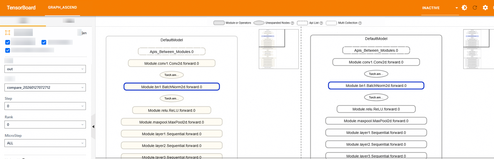

# Quick Start of msProbe in the MindSpore Scenario

## Overview

This document describes how to quickly get started with the precision debugging tool MindStudio Probe (msProbe) during the training development process in the MindSpore scenario.

For foundation models developed based on Ascend or migrated from GPU to Ascend NPU, training issues such as precision overflow/underflow, loss divergence, or non-convergent loss may arise. Since metrics such as the training loss cannot accurately locate the failed module, msProbe is recommended for rapid fault demarcation.

### Usage Process

When using msProbe for model precision debugging, perform the following operations:

   1. Configuration check before training

      Identify the configuration differences that affect the precision in two environments. For details, see [Pre-training Configuration Check](../user_guide/config_check_instruct.md).

   2. Training status monitoring

      Monitor exceptions that occur during computing, communication, and optimizer operations during training. For details, see [Training Status Monitoring](../user_guide/monitor_instruct.md).

   3. Precision data collection

      Collect the forward and backward input and output data at the API or module level during training. For details, see [Data Collection](../user_guide/dump/mindspore_data_dump_instruct.md).

   4. Precision pre-check

      Scan API data to identify APIs with precision issues. For details, see [Precision Pre-check](../user_guide/accuracy_checker/mindspore_accuracy_checker_instruct.md).

   5. Precision comparison

      Compare the API data on NPU with that in the benchmark environment to quickly locate precision issues. For details, see [Precision Comparison](../user_guide/accuracy_compare/mindspore_accuracy_compare_instruct.md).

This Quick Start guide focuses on rapid onboarding for precision data collection and precision comparison. For usage details of other tool functions, please refer to the relevant documentation.

### Environment Setup

1. Prepare a training server equipped with Ascend NPUs (such as Atlas A2 training servers) and install the NPU driver and firmware.

2. Install the CANN Toolkit and OPS (operator package) of the matching version and configure CANN environment variables. For details, see [CANN Software Installation Guide](https://www.hiascend.com/en/cann/download).

3. Install the framework.

   In the MindSpore training scenario, versions 2.6.0 and 2.7.0 are used as examples. For details, see [MindSpore Installation Guide](https://www.mindspore.cn/install/en).

4. Install msProbe by referring to [msProbe Installation Guide](../install_guide/msprobe_install_guide.md).

   ```bash
   pip install mindstudio-probe
   ```

## Precision Data Collection

Prerequisites

- Complete procedures listed in [Environment Setup](#environment-setup).

Data Collection

1. Prepare a training script.

   `mindspore_main.py` is used as an example. In the Ascend NPU environment, you can directly copy the sample code from [MindSpore Precision Data Collection Code Sample](#mindspore-precision-data-collection-code-sample).

2. Create a configuration file.

   Create a `config.json` file in the directory where the training script is located. Copy the file content as follows:

   ```json
   {
       "task": "statistics",
       "dump_path": "/home/dump/dump_data",
       "rank": [],
       "step": [0,1],
       "level": "L1",
       "async_dump": false,
   
       "statistics": {
           "scope": [], 
           "list": [],
           "tensor_list": [],
           "data_mode": ["all"]
       }
   }
   ```

3. Add the tool to the training script (`mindspore_main.py`) in the MindSpore 2.6.0 and MindSpore 2.7.0 environments.

   Note: Ensure that the tool has been added to the sample code in [MindSpore Precision Data Collection Code Sample](#mindspore-precision-data-collection-code-sample). Below is where the tool interface is added to the script.

   ```python
   ...
     7 from msprobe.mindspore import PrecisionDebugger    # Import the data collection API of the tool.
     8 debugger = PrecisionDebugger(config_path="./config.json")   # Instantiate PrecisionDebugger and load the dump configuration file.
   ...
    46 if __name__ == "__main__":
    47     step = 0
    48    # Train your model.
    49     for data, label in ds.GeneratorDataset(generator_net(), ["data", "label"]):
    50         debugger.start(model)    # Enable data dump.
    51         train_step(data, label)
    52         print(f"train step {step}")
    53         step += 1
    54         debugger.stop()    # Disable data dump. If you enable data dump again, the collected data will be recorded in the same step.
    55         debugger.step()    # End data dump. If you enable data dump again, the collected data will be recorded in the next step.
    56     print("train finish")
   ```

   Note: Precision data occupies certain drive space. As a result, the server may be unavailable when the drive space is used up. The space required by precision data is closely related to model parameters, collection configurations, and number of collection iterations. You need to ensure that the available drive space in the directory where precision data is flushed is sufficient.

4. Run the training script command. The tool collects precision data during model training.

   ```bash
   python mindspore_main.py
   ```

   If the following information is displayed in the log, the data is successfully collected. You can view the data after the collection is complete.

   ```txt
   The aip tensor hook function is successfully mounted to the model.
   msprobe: debugger.start() is set successfully
   Dump switch is turned on at step 0.
   Dump data will be saved in /home/dump/dump_data/step0.
   ```

Checking the Result

The following directory structure is displayed in the path specified by `dump_path`. Select data for analysis as required.

```ColdFusion
/home/dump/
├── step0
    └── proc1280778                  # In single-rank training, the training process has no rank information, so data is saved under proc{pid}. In multi-rank scenarios, this is rank{id}.
        ├── construct.json           # Saves Module hierarchy relationship information; empty in the current scenario
        ├── dump.json                # Saves statistics and overflow information for forward/backward API inputs and outputs
        └── stack.json               # Saves API call stack information
├── step1
...
```

The collected data needs to be further analyzed for precision comparison. For details, see [Precision Comparison](#precision-comparison).

## Precision Comparison

### Precision Comparison via compare Command

Prerequisites

- Complete procedures listed in [Environment Setup](#environment-setup).
- The following example illustrates cell comparison between different MindSpore versions (e.g. MindSpore 2.6.0 and MindSpore 2.7.0). For details about how to dump cell data, see [Precision Data Collection](#precision-data-collection).

Performing Comparison

1. Prepare data.

   Generate two precision data directories as described in the "Prerequisites" part. The following uses `dump_data_2.6.0` and `dump_data_2.7.0` as examples.

   The path of the `dump.json` file in the `dump_data_2.6.0` directory is `/home/dump/dump_data_2.6.0/step0/proc1280778/dump.json`.

   The path of the `dump.json` file in the `dump_data_2.7.0` directory is `/home/dump/dump_data_2.7.0/step0/proc1280779/dump.json`.

2. Perform the comparison.

   The command is as follows:

   ```bash
   msprobe compare -tp /home/dump/dump_data_2.7.0/step0/proc1280779/dump.json -gp /home/dump/dump_data_2.6.0/step0/proc1280778/dump.json -o ./compare_result/accuracy_compare
   ```

   If the following information is displayed, the comparison is successful:

   ```txt
   ...
   The result file path is: /xxx/compare_result/accuracy_compare/compare_result_{timestamp}.csv
   ...
   ************************************************************************************
   *                        msprobe compare ends successfully.                        *
   ************************************************************************************
   ```
   
3. Analyze the comparison result file.

   `compare` generates the following file in `./compare_result/accuracy_compare`:

   `compare_result_{timestamp}.csv`: This file lists the details about all APIs for precision comparison and comparison results. You can locate suspicious operators based on the comparison result (`Result`) and error message (`Err_Message`). However, each metric has a determination standard. Since each metric has its own evaluation criteria, make judgments based on actual circumstances.

   For more details, see [Output File Description](../user_guide/accuracy_compare/mindspore_accuracy_compare_instruct.md#output-file-description).

### Graph Comparison in Hierarchical Visualization Mode

Prerequisites

- Complete procedures listed in [Environment Setup](#environment-setup).

- The following example illustrates cell comparison between different MindSpore versions (e.g. MindSpore 2.6.0 and 2.7.0). For details about how to dump cell data, see [Precision Data Collection](#precision-data-collection).
  
  For hierarchical visualization, the `level` parameter in the `config.json` file must be set to `L0` or `mix` during a data dump. In this example, `mix` is used to re-collect precision data.

Performing Comparison

1. Prepare data.

   Generate two precision data directories as described in the "Prerequisites" part. The following uses `dump_data_2.6.0` and `dump_data_2.7.0` as examples.

   The path of the `dump_data_2.6.0` directory is `/home/dump/dump_data_2.6.0`.

   The path of the `dump_data_2.7.0` directory is `/home/dump/dump_data_2.7.0`.

2. Perform graph comparison. For details, see [Dual Graph Comparison](../user_guide/accuracy_compare/mindspore_visualization_instruct.md#dual-graph-comparison).

   ```bash
   msprobe graph_visualize -tp /home/dump/dump_data_2.7.0 -gp /home/dump/dump_data_2.6.0 -o /home/dump/output
   ```

   After the comparison is complete, a .vis file is generated in the `./output` directory.

3. Start TensorBoard.

   ```bash
   tensorboard --logdir /home/dump/output --bind_all
   ```

   The path specified by `logdir` is `/home/dump/output` in step 2.

   After the preceding command is executed, the following log is displayed:

   ```txt
   TensorBoard 2.20.0 at http://ubuntu:6006/ (Press CTRL+C to quit)
   ```

   Open a browser in any OS and access `http://ubuntu:6008/`, where `ubuntu` should be replaced with the IP address of your server, for example, `http://192.168.1.10:6008/`.

   After the access is successful, the TensorBoard page is displayed, as shown in the following figure.

   **Figure 1** Graph comparison in hierarchical visualization mode

   

## Code Sample

### MindSpore Precision Data Collection Code Sample

```python
import numpy as np
import mindspore
mindspore.set_device("Ascend")
import mindspore.mint as mint   
import mindspore.dataset as ds
from mindspore import nn
from msprobe.mindspore import PrecisionDebugger
debugger = PrecisionDebugger(config_path="./config.json")


class Net(nn.Cell):
    def __init__(self):
        super(Net, self).__init__()
        self.fc = nn.Dense(2, 2)

    def construct(self, x):
        # Full connection required
        y = self.fc(x)
        # Call mint.add to calculate the sum of y and itself.
        # You can also change it to mint.add(x, x) or mint.add(y, x) as required.
        z = mint.add(y, y)
        return z


def generator_net():
    for _ in range(10):
        yield np.ones([2, 2]).astype(np.float32), np.ones([2]).astype(np.int32)

def forward_fn(data, label):
    logits = model(data)
    loss = loss_fn(logits, label)
    return loss, logits

model = Net()
optimizer = nn.Momentum(model.trainable_params(), 1, 0.9)
loss_fn = nn.SoftmaxCrossEntropyWithLogits(sparse=True)
grad_fn = mindspore.value_and_grad(forward_fn, None, optimizer.parameters, has_aux=True)

# Define the single-step training function.
def train_step(data, label):
    (loss, _), grads = grad_fn(data, label)
    optimizer(grads)
    return loss


if __name__ == "__main__":
    step = 0
    # Train your model.
    for data, label in ds.GeneratorDataset(generator_net(), ["data", "label"]):
        debugger.start(model)
        train_step(data, label)
        print(f"train step {step}")
        step += 1
        debugger.stop()
        debugger.step()
    print("train finish")
```
