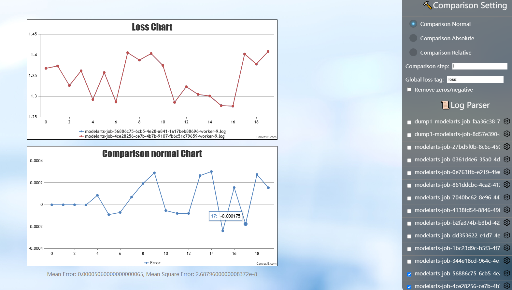
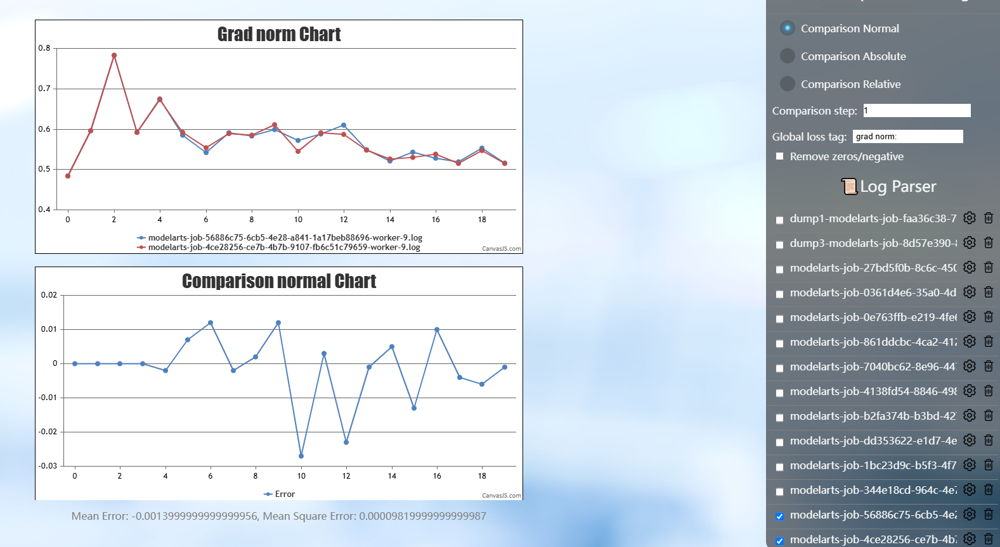
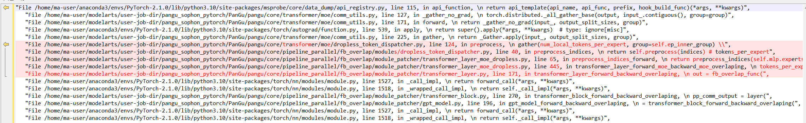
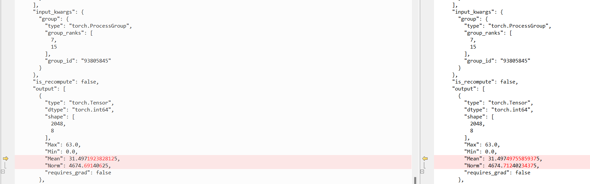
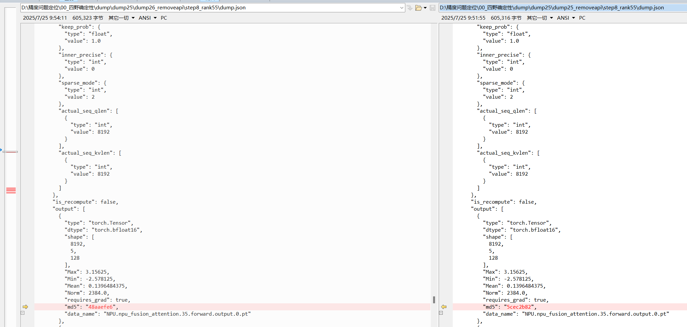
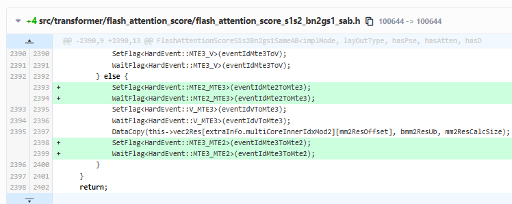

# 基于昇腾的80卡大模型训练确定性排查

## 背景概述

在大规模并行训练中，训练结果的确定性（Determinism）是影响可复现性的关键因素。多卡并行或高并发场景下，算子内部的数据搬迁若缺乏同步机制，会产生非确定性的计算结果。本文记录了 80 卡大规模训练任务中训练结果确定性无法固定的问题定位过程，最终定位到 Flash Attention 算子内部的数据竞争（Race Condition），并给出修复方案与排查方法，为类似确定性排查提供参考。

## 问题现象

在进行 80 卡大规模训练任务时，发现训练结果的确定性无法保证。详情如下：

- **环境版本差异**：
  - 在 CANN 8.0.0 RC4 版本下，连续运行两次训练作业，Loss 曲线完全一致。
  - 在 CANN 8.1.0 RC1 版本下，连续运行两次训练作业，Loss 曲线出现不一致。
- **并行策略**：TP8 PP5 VPP5 CP1 EP2。
- **复现特征**：
  - 在 8.1.0 RC1 版本中，Step 0 完全一致，但从 Step 1（日志对应 Step 2）开始，DP 第二组（Rank 8-15, 24-31 等）的反向传播梯度在 Unreduce 前即出现不一致。
  - 前向传播结果在 Step 1 即出现差异，导致后续 Loss 计算不一致。

## 问题定位过程

### 步骤一：初步定界与数据采集体系建立

1. **Monitor 数据分析**：初期采集 Monitor 数据，发现 Step 0 一致，Step 1 中 DP 第二组所有卡的梯度在 Unreduce 前不一致。结论：问题出现在前向传播阶段，且集中在 DP 第二组。
2. **Dump 工具尝试与受阻**：尝试使用 Dump 工具采集 L0 级别数据，但初期因报错或显存膨胀导致采集失败。关闭 overlap_1f1b 特性后问题依旧，排除该特性干扰。发现开启 Mix 级别全量 Dump 时，问题不复现（跑多步完全一致），推测采集行为本身影响了问题复现（可能引入了同步或改变了执行时序）。
3. **调整采集策略**：改为采集 L1 级别数据，成功复现不一致。尝试采集 MD5 校验值以定位源头，但因显存膨胀和异步 Dump 不支持 MD5 而受阻。最终通过缩小规模、关闭异步、限制步数（前 5 步）等方式，成功在 Step 16 复现并采集到关键数据。

   

   

### 步骤二：链路追踪与差异点定位

1. **通信链路回溯**：从 Rank 0 的 Distributed._all_gather_base 输出不一致入手，逐级向上游通信组（Group 0~7, 7~15 等）回溯。

   

   发现差异源头指向 Distributed.batch_isend_irecv 算子，其输入一致但输出不一致。

   

   进一步追踪至 Rank 35, 36, 37 等卡，发现差异源自 NPU.npu_fusion_attention 或 Distributed._reduce_scatter_base 等算子。
2. **锁定可疑算子**：重点怀疑 NPU.npu_fusion_attention（FA 算子），因为在 Rank 36 上，该算子输入完全一致，但输出不一致。专门采集 NPU.npu_fusion_attention 的 Tensor 数据，在 Step 8 的 Rank 55 处再次复现差异。

   

### 步骤三：单算子复现与根因分析

1. **构建单算子脚本**：提取差异点的 Input (Query, Key, Value, Mask) 和 Output，编写 Python 脚本调用 torch_npu.npu_fusion_attention 进行单算子验证。在定位机器上单算子循环运行数百遍，未复现问题。
2. **排除其他因素**：尝试关闭 FA 特性，问题仍存在。尝试设置环境变量 CLOSE_MATMUL_K_SHIFT=1，问题仍存在。
3. **引入内存竞争检测**：怀疑存在算子内部竞争（Race Condition）。使用 mssanitizer 进行静态插桩检测，确认存在竞争风险。在代码中临时添加同步机制后，报错消失，验证了竞争假设。

   

## 问题根因

- **根本原因**：CANN 8.1.0 RC1 版本中的 Flash Attention (FA) 算子内部存在数据竞争问题。
- **具体机制**：FA 算子内部在进行数据搬迁操作时，前后未添加必要的同步机制（Synchronization）。在多卡并行或高并发场景下，这种缺乏同步的操作导致数据读取或写入时序不确定，从而产生非确定性的计算结果。
- **版本差异**：8.0.0 RC4 版本无此问题，8.1.0 RC1 版本引入该缺陷。

## 解决方案与验证

1. **修复方案**：获取修复包，核心修改为：在算子内部的数据搬迁操作前后增加同步机制。
2. **验证结果**：使用修复后的算子包重新运行实验，连续多次训练作业，Loss 曲线完全一致，问题彻底修复。

## 经验总结与建议

1. **确定性调试技巧**：当全量 Dump 导致问题不复现时，应考虑采集行为对执行时序的影响，尝试降低采集粒度（如 L1 级别）或缩小模型规模。对于难以复现的随机性问题，单算子脚本结合 mssanitizer 是定位内存竞争的有效手段。
2. **算子开发规范**：在涉及多核并行或数据搬迁的算子开发中，必须严格检查同步机制，确保数据访问的原子性和顺序性，避免 Race Condition。
3. **环境配置参考**：若遇到类似算子间竞争问题，可尝试设置 ASCEND_LAUNCH_BLOCKING=1 强制算子串行下发，以辅助判断是否为算子间并发竞争问题。若遇到类似算子内竞争问题，可尝试在算子内部大量增加 flag 等待，以辅助判断是否为算子内并发竞争问题。
