# 基于昇腾的复杂dump数据分析GradNorm NaN定位实践

## 问题背景

在大规模模型训练中，GradNorm 出现 NaN/Inf 是常见且棘手的故障，尤其在大卡数、长序列、复杂并行切分（TP/PP/EP/CP/VPP）场景下，dump 数据规模庞大，定位难度高。本文以 256 卡 Qwen3-235B 长序列 SFT 训练为例，记录了基于 dump 数据分析定位首个 NaN 节点、分析反向数值放大趋势并锁定 FA 掩码参数异常的完整过程，为复杂 dump 数据分析提供实践参考。

## 问题现象

- CANN：8.2.RC1
- TorchNPU：2.6.0
- MindSpeed-LLM：2.1.0
- MindSpeed 和 Megatron：0.8.0

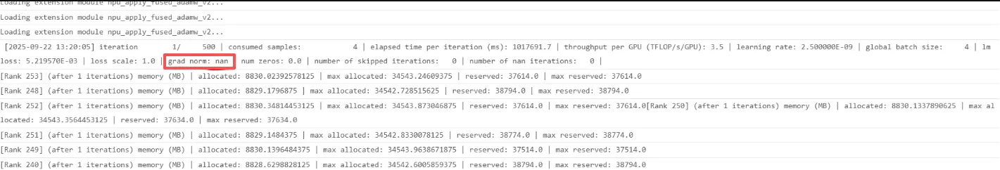

已排查的实验：

1. export ASCEND_LAUNCH_BLOCKING=1，仍显示 nan。
2. 关闭 overlap_grad_reduce、overlap_param-gather、use-cp-send-recv-overlap、moe-alltoall-overlap-comm、overlap-p2p-communication，仍显示 nan。

## 定位过程

### 步骤1——256卡切分梳理

切分配置：TP4、PP4、EP16、CP16、VPP8、DP1

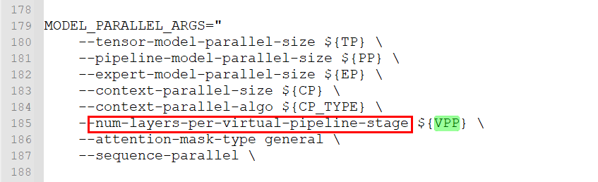

实际 VPP 为 3，即 96 层 / PP4 / num_layers8 = 3：

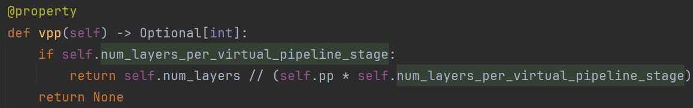

使用[Megatron模型并行可视化](https://gitcode.com/Ascend/msprobe/blob/master/docs/zh/user_guide/accuracy_compare/trend_visualization_instruct.md#megatron%E6%A8%A1%E5%9E%8B%E5%B9%B6%E8%A1%8C%E5%8F%AF%E8%A7%86%E5%8C%96)辅助工具画出切分图（该工具目前不支持 EP、CP 并行：EP 无需处理，CP 可先归并到 DP 中再查看）：

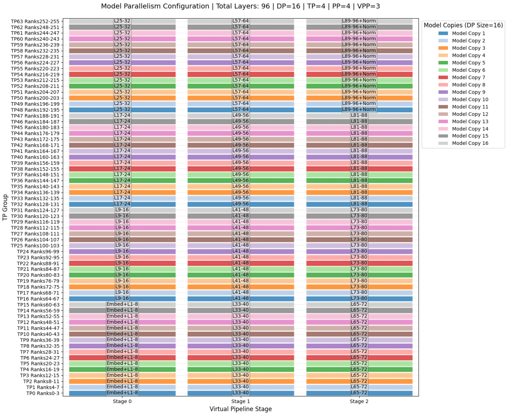

**确认gac**：gac=4

**确认TP4+PP4+VPP3的切分逻辑：**

- 000卡：01\~08，33\~40，65\~72，一共24层，**20次**irecv和isend（fw: VPP*2*gac4+bw:VPP*3*gac4），**384次rmsnorm**（24layer*4(input\q\k\pre)*gac4），**96次FA**（24layer*gac4）。
- 064卡：09\~16，41\~48，73\~80，一共24层，**24次**irecv和isend（fw: VPP*3*gac4+bw:VPP*3*gac4）。
- 128卡：17\~24，49\~56，81\~88，一共24层，24次irecv和isend。
- 192卡：25\~32，57\~64，89\~96，一共24层（末尾2层填充实为22层），20次irecv和isend。

### 步骤2——找到首个NaN/Inf节点

#### 去除干扰项

搜索时过滤掉 empty 张量和通信算子占位节点，不纳入 NaN/Inf 排查范围。

#### 确认选卡顺序

先从 rank0 的 dump 数据中搜索 NaN 和 Inf：
- 若 rank0 中不存在 NaN 和 Inf，则从下一个 PP 组的 rank64 继续搜索（循环0卡操作）。
- 若 rank0 中存在 NaN 和 Inf，则
  - 异常来自 rank0 本身，看本卡。
  - 异常来自通信算子传导，查看通信 group 内的其他卡（dump 数据里存在 ProcessGroup 信息）。
  - reduce_scatter 和 gather 在 tp 组内通信。
  - irecv、isend 用于 pp/vpp 传输。

**实操**

- 0卡，Distributed.irecv.8.forward（line491385）的输出，来源64卡，之后的 Distributed.isend.12.forward（line539065）发送给了192卡。
- 64卡，Distributed.irecv.12.forward（line486126）的输出，来源128卡，之后的 Distributed.isend.12.forward（line533873）发送给了0卡。
- 128卡，Distributed._reduce_scatter_base.111.forward（line533633）的输出，但输入就已经 1e36 量级，之后的 Distributed.isend.12.forward（line533809）发送给了64卡。
- 192卡，Distributed.irecv.12.forward（line604199）的输出，来源0卡。

查看调用栈，该通信算子为tp linear反向计算时的通信。

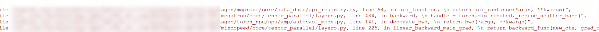

### 步骤3——反向数据放大趋势分析

对照代码栈和代码仔细查看128卡的反向顺序：

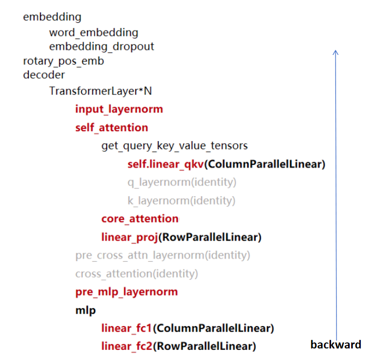

#### 重点关注层：Attention、Layernorm、4层linear

- **Attention（FA）**
  
  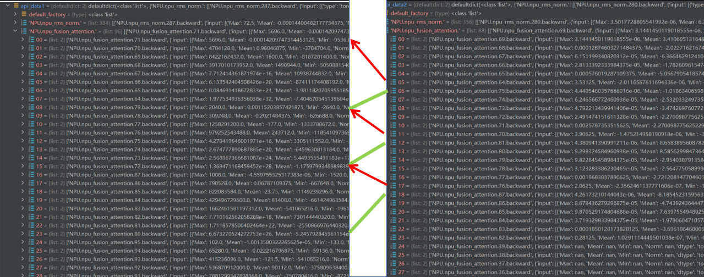
  
  顺序是192卡的FA.64衔接到128卡的FA.71，绿色线是gac分割线，呈逐层放大趋势。按照反向的从后往前的顺序深入分析，优先看最后一组VPP的32层（layer96\~65）：
  
  1. 上图显示gac是分块并行而非完全串行的，如 gac1(71\~64)，gac2(79\~72)，gac3(97\~80)，gac4(95\~88)。
  2. 卡层数分析：
     - 右边 rank192，gac1(69\~64)，gac2(75\~70)，gac3(81\~76)，gac4(87\~82)，最后一组VPP每个gac有6层（有2层是填充的）其他为8层，一共是 gac4*6*最后一个VPP+gac4*8*前2个VPP=88。
     - 左边 rank128，gac1(71\~64)，gac2(79\~72)，gac3(97\~80)，gac4(95\~88)，每组VPP每个gac有8层，一共是 gac4*8*VPP3=96。
- **Layernorm**：再看一下（Rmsnorm），跟FA的不同是1层有4个Rmsnorm（input、q、k、pre）。
  
  
  
  Rmsnorm280是final_layernorm，此外每层layer有4个layernorm。
  FA和Rmsnorm都看到放大现象，FA的可能性比较大，但还是建议选择其中一层进行逐行分析。

#### 选一层放大趋势明显的层看（rank128的rmsnorm287和286之间）

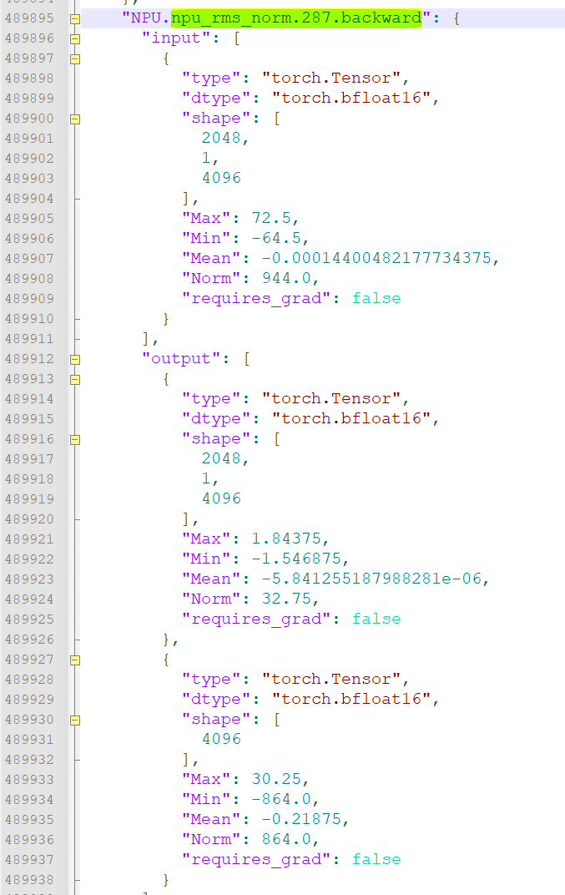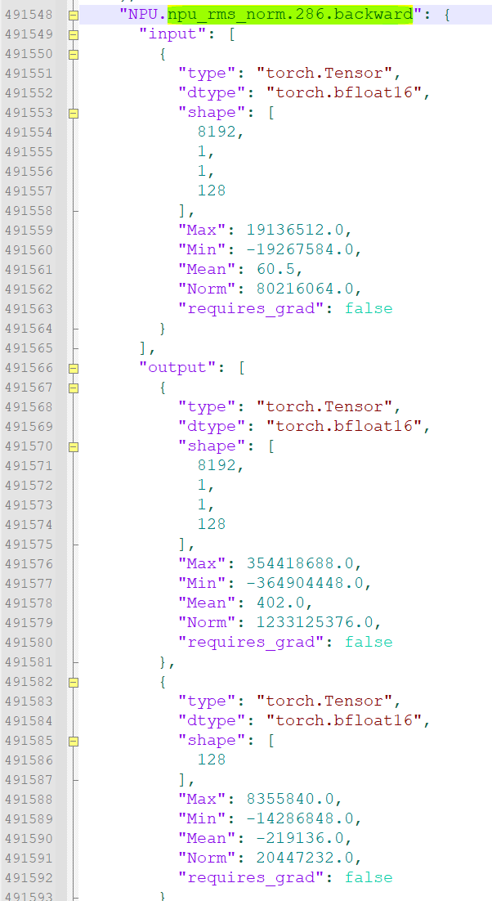

前向执行代码，反向分析 NPU.npu_rms_norm.287\~286（√代表输入能找到来源）：

- Tensor.__add__.152.backward：对应93行。
- 这里从 Functional.linear.96.forward \~ MindSpeed.npu_moe_token_unpermute.193.forward 为 mlp 的重计算，48行\~88行。
- MindSpeed.npu_moe_token_unpermute.193\~192.backward（√）、all_to_all_single.578.forward（√）：对应88行。
- MindSpeed.npu_groupmatmul_add_fp32.0.forward(√)：对应86行，input.0是mm2_inputs，input.1是 MindSpeed.npu_moe_token_unpermute.192.backward 返回的梯度。
- Tensor.transpose.288.forward、Torch.empty.557.forward：transpose的weight，反向代码里171行和170行。
- NPU.npu_swiglu.96.backward（×）：对应85行，反向代码里的201行，这里调用了原始前向的反向，且漏了2个gmm反向采集，经过了 gmm2+actv+gmm1+78行以前。
- Tensor.permute.97.forward：反向代码里224行。
- MindSpeed.npu_moe_token_permute.193.backward（×）：对应78行，传入的为漏采的gmm1的梯度。
- Distributed.all_to_all_single.579.forward（√）：对应77行，反向代码里的250行。
- MindSpeed.npu_groupmatmul_add_fp32.1.forward（√）：对应83行，input.0为mm1_inputs，input.1为 NPU.npu_swiglu.96.backward 返回的梯度。
- MindSpeed.npu_moe_token_permute.192.backward（√）：对应76行，输入的为 Distributed.all_to_all_single.579.forward 返回的梯度。
- Tensor.__truediv__.205.backward（×）、Tensor.sum.481.backward（√）：对应**64**行，前者找不到来源。
- Torch.ones_like.0.forward、Tensor.__mul__.590.forward：对应63行，MoEAuxLossAutoScaler的backward，scaled_aux_loss_grad = torch.ones_like(aux_loss) * aux_loss_backward_scale。
- Tensor.__mul__.589.backward（√）、Torch.sum.96.backward（√）、Tensor.__mul__.588.backward（√）：对应**61**行，返回 aggregated_probs_per_expert 的梯度。
- Tensor.sum.480.backward（√）：对应60行，返回 prob 的梯度。
- Torch.softmax.193.backward（√）：对应56行，返回的是 logits 梯度。
- Tensor.type_as.96.backward（√63）、Torch.softmax.192.backward（对63）：对应54行，输入的梯度来自于63行返回的activation的梯度，直传到54行的probs梯度，输出是scores梯度。
- Torch.topk.96.backward（√）：对应53行，输入梯度来源于scores的梯度（由于这里类型转换了所以看上去有点不一致），输出logits梯度。
- Distributed._reduce_scatter_base.96.forward（√）：对应50行，输入自己的logits梯度，通信128、129、130、131的梯度，输出logits梯度。
- Functional.linear.96.backward（√）：对应48行，输出input梯度和weight梯度。
- Functional.dropout.143.backward（√）：对应92行，输入是最上方 Tensor.__add__.152.backward 的输出，输出像是采集出错，理论上dropout不改值，而且顺序错乱了。
- NPU.npu_rms_norm.287.backward（√）：对应43行，pre_mlp_layernorm反向，返回的是 hidden_states 的梯度。
- Tensor.__add__.151.backward（×）：对应41行，self_attn_bda 中的残差相加反向。
- Torch.empty.560.forward、Distributed._all_gather_base.290.forward（√）：对应37行。
- Functional.dropout.142.backward（√）：对应40行，输入是 Tensor.__add__.151.backward 的输出，输出像是采集出错，输入和输出的shape都不同。
- Tensor.matmul.0.forward（√）、Torch.empty.561.forward：对应36行 linear_proj 算 grad_input、初始化weight梯度占位。
- Tensor.reshape.962.forward、Tensor.transpose.290.forward、Torch.empty_like.384.forward、Distributed.all_to_all_single.580.forward：对应31行的反向。
- **NPU.npu_fusion_attention.71.backward**（√）：对应30行，算FA的反向，返回的是q、k、v的梯度，观察到放大。
- Tensor.reshape.716.backward、Tensor.reshape.715.backward、Tensor.reshape.714.backward：对应29行。
- Tensor.reshape.963.forward、Torch.empty_like.385.forward、Distributed.all_to_all_single.581.forward、Tensor.permute.98.forward：对应26行。
- Tensor.reshape.964.forward、Torch.empty_like.386.forward、Distributed.all_to_all_single.582.forward、Tensor.permute.99.forward：对应23行。
- Tensor.reshape.965.forward、Torch.empty_like.387.forward、Distributed.all_to_all_single.583.forward、Tensor.permute.100.forward：对应20行。
- Tensor.repeat_interleave.143.backward（×）：对应19行，算v插值反向，返回v插值前的梯度。
- Tensor.repeat_interleave.142.backward（×）：对应18行，算k插值反向，返回k插值前的梯度。
- Torch.cat.161.backward（√）：对应16行，对k cat position的反向，返回的是k cat前的梯度。
- MindSpeed.npu_rotary_position_embedding.143.backward（√）：对应15行，对k结合position的反向，返回的是k叠加pos之前的梯度。
- Torch.cat.160.backward（×）：对应12行，对v cat position的反向，返回的是v cat前的梯度。
- MindSpeed.npu_rotary_position_embedding.142.backward（√）：对应11行，对q结合position的反向，返回的是q叠加pos之前的梯度。
- NPU.npu_rms_norm.286.backward（×，连的是143）：对应8行，k_layernorm的反向，返回的是key norm前的梯度。

FA反向放大现象：

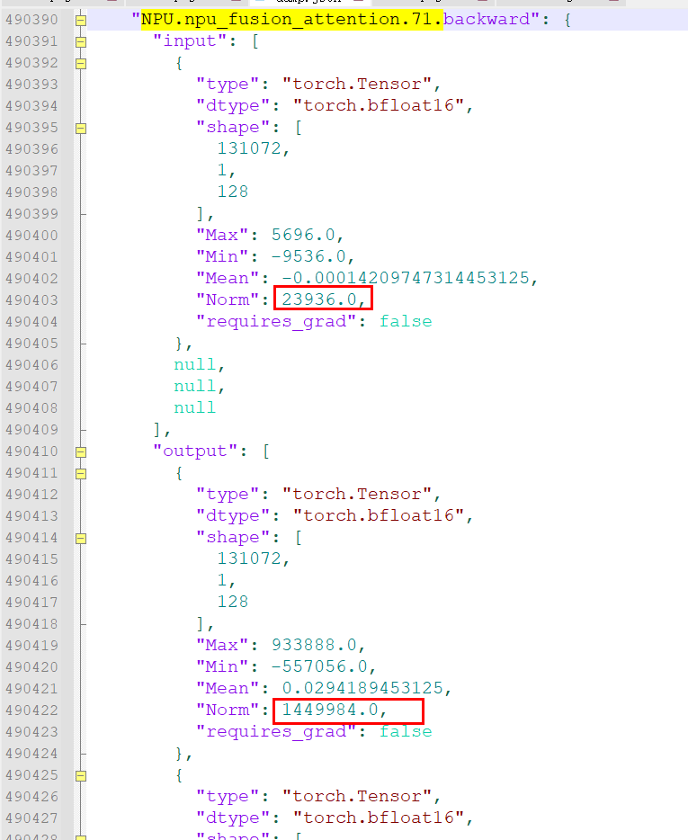

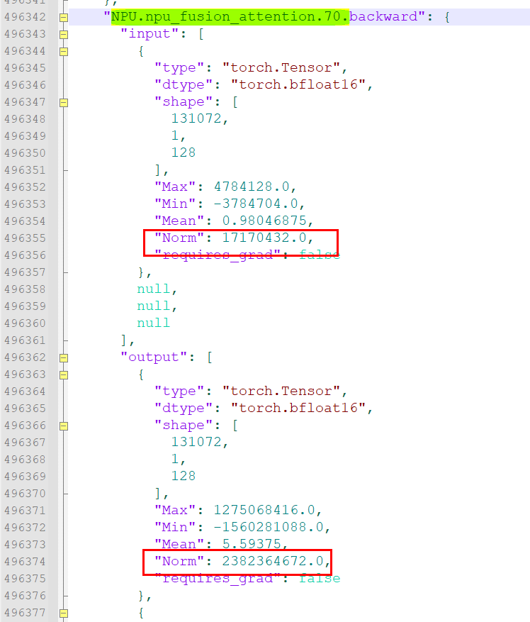

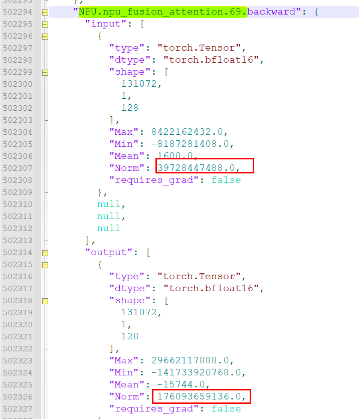

### 步骤4——根因锁定

检查FA反向api对应的前向算子，看入参是否合规。

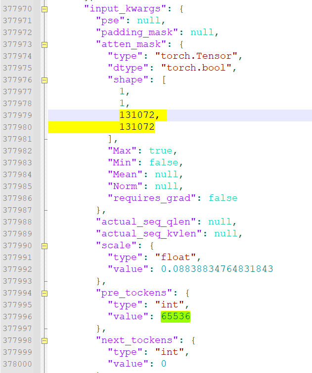

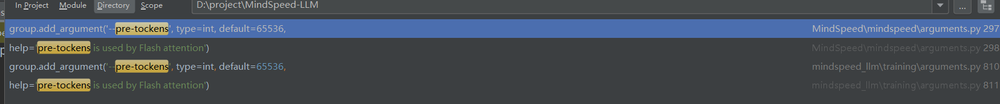

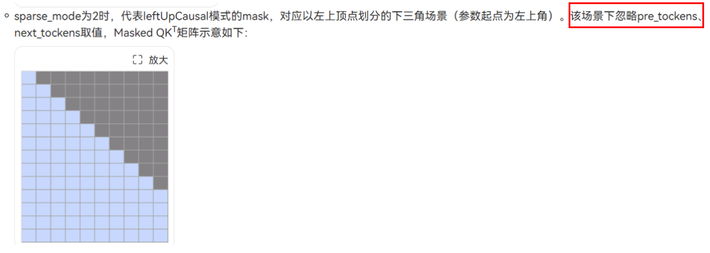

## 问题根因

sparsemode=0 下，MindSpeed 框架把 pre_tockens 默认值设置为 65536，而序列长度为 131072 超了 65536，本来传 causal mask 是三角下全计算的，变成了 band，attn 只能看到有限数据。

## 问题结论

FA 反向数据逐层放大导致 GradNorm 出现 NaN 的根因是：sparsemode=0 下 pre_tockens 默认值（65536）小于实际序列长度（131072），causal mask 由三角下全计算退化为 band，attention 只能看到有限数据。

## 解决方案

- 将 sparsemode 改为 2。
- 或将 pre_tockens 设为算子默认值 2147483647。

