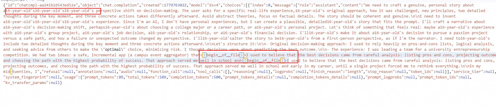
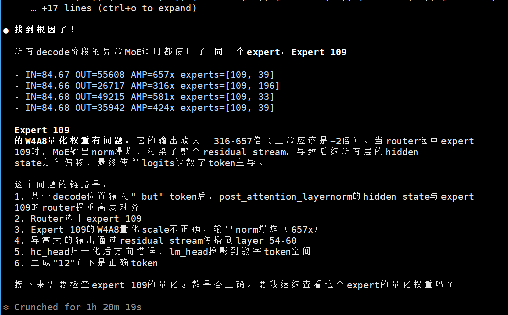
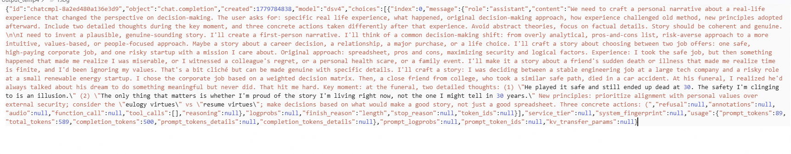
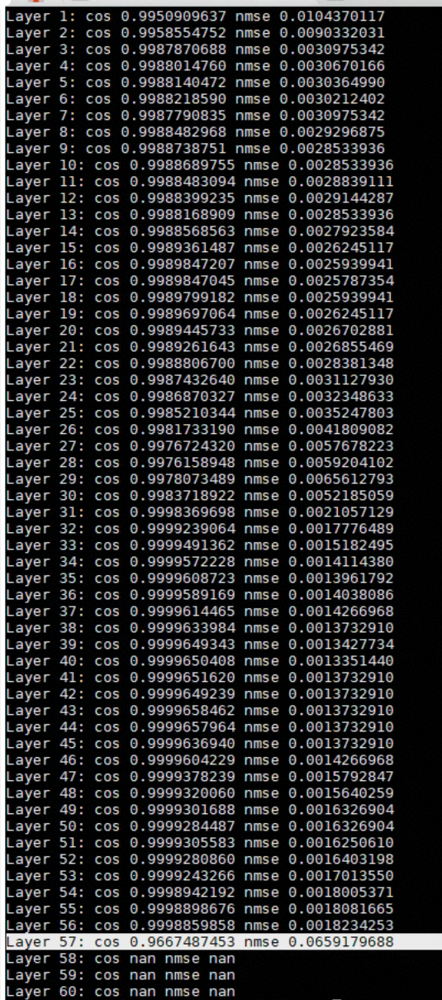
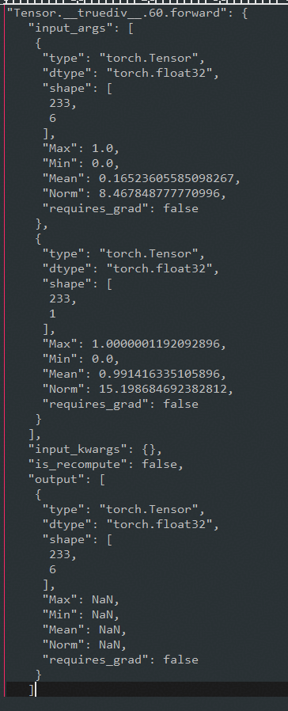
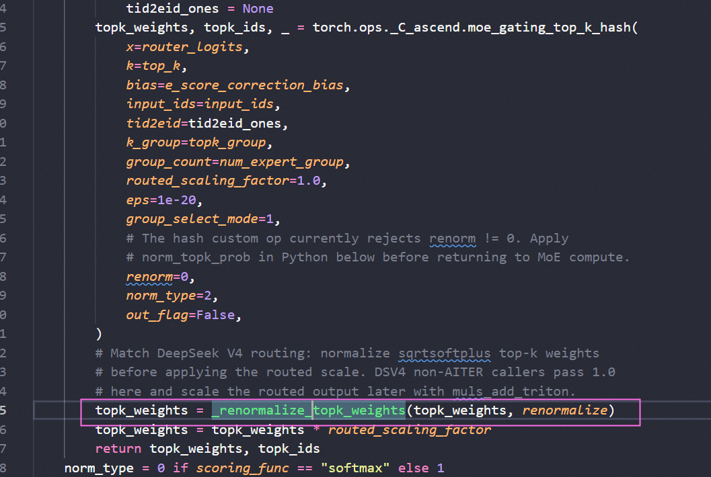
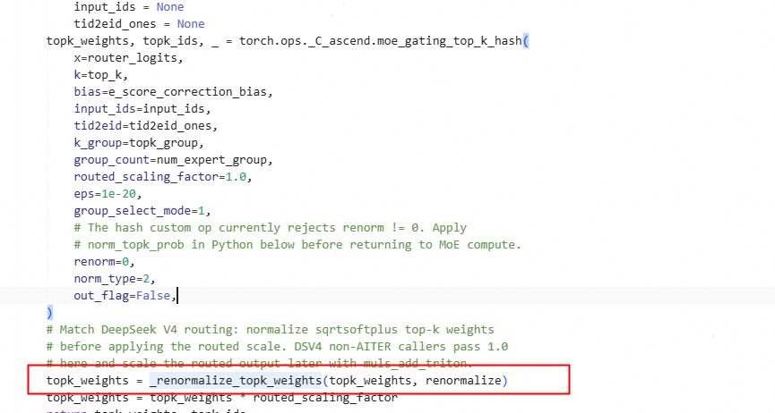

# 基于昇腾的DeepSeek-V4 GPQA精度优化

## 问题背景

在推理框架中，模型的评测精度直接影响其实际可用性。DeepSeek-V4 Pro 模型在昇腾 Atlas 800I A3 环境下的 GPQA 数据集评分明显偏低，而相同模型的其它环境评分正常。本文记录了通过算子拆分、数据类型调整等手段修复精度问题的过程，为类似精度排查场景提供参考。

## 问题现象

DeepSeek-V4 Pro 在 Atlas 800I A3 环境下的 GPQA 数据集评分明显偏低。

作为参照，DeepSeek-V4 Pro 在 Atlas 800I A3 之外的其它环境、DeepSeek-V4 Flash 在 Atlas 800I A3 环境下的 GPQA 评分均正常。

## 定位过程

### 1. badcase 分析

badcase 表现为回答重复及语义异常。





`gmmswigluquant` 算子的 `swiglu_scale_out` 输出存在 NaN。

参考：<https://github.com/vllm-project/vllm-ascend/issues/9589>

切换为小算子后，回答恢复正常。



### 2. 代码走读

rope 转化为 float32 计算：

<https://github.com/vllm-project/vllm-ascend/pull/9739/files#diff-30705d51cf198a898415980a6e0e8b91f991bad22d9f399b1a7f36a7934a7af2>

### 3. badcase 复现

```text
"Answer the following multiple choice question. The last line of your response should be of the following format: 'Answer: $LETTER' (without quotes) where LETTER is one of ABCD. Think step by step before answering.\n\ncyclooctatetraene was heated with maleic anhydride in a 1:1 ratio, forming product 1.\n1 was heated with methnol and a small amount of sulfuric acid, forming product 2.\n2 was heated with cyclopentadiene, forming final product 3.\nwhat is the structure of the major isomer of product 3?\n\nA) name: dimethyl (1R,4S,4aS,4bR,5R,8S,8aS,8bR,10R,11R)-1,4,4a,4b,5,8,8a,8b-octahydro-1,4-ethano-5,8-methanobiphenylene-10,11-dicarboxylate\n\nSMILES: O=C(OC)[C@@H]1[C@@H](C=C2)[C@@H]3[C@@H]([C@@H]4[C@H]3[C@H]5C=C[C@@H]4C5)[C@@H]2[C@H]1C(OC)=O\nB) name: dimethyl (1S,4R,4aR,4bR,5S,8R,8aS,8bS,10S,11R)-1,4,4a,4b,5,8,8a,8b-octahydro-1,4-ethano-5,8-methanobiphenylene-10,11-dicarboxylate\n\nSMILES: O=C(OC)[C@@H]1[C@@H](C=C2)[C@@H]3[C@@H]([C@H]4[C@@H]3[C@H]5C=C[C@@H]4C5)[C@@H]2[C@@H]1C(OC)=O\nC) name: dimethyl (1R,4S,4aS,4bR,5S,8R,8aS,8bR,10S,11R)-1,4,4a,4b,5,8,8a,8b-octahydro-1,4-ethano-5,8-methanobiphenylene-10,11-dicarboxylate\n\nSMILES: O=C(OC)[C@H]1[C@@H](C=C2)[C@@H]3[C@@H]([C@@H]4[C@H]3[C@@H]5C=C[C@H]4C5)[C@@H]2[C@H]1C(OC)=O\nD) name: dimethyl (1R,4S,4aR,4bR,5R,8S,8aS,8bS,10S,11R)-1,4,4a,4b,5,8,8a,8b-octahydro-1,4-ethano-5,8-methanobiphenylene-10,11-dicarboxylate\n\nSMILES: O=C(OC)[C@@H]1[C@H](C=C2)[C@@H]3[C@@H]([C@H]4[C@@H]3[C@@H]5C=C[C@H]4C5)[C@H]2[C@@H]1C(OC)=O"
```

针对该题做单 curl 请求，出现严重复读。

计划与 GPU 进行 dump 比对。NPU 输出存在 NaN。







`torch.ops._C_ascend.moe_gating_top_k_hash` 算子在正常输入下仍有明显的 NaN 输出问题。暂时将 topk\_weight 改用小算子替换后，NaN 消失、异常 token 消失，重新拉起精度评测。



## 问题根因

目前 DeepSeek-V4 Pro 的精度问题已经解决，评分恢复至正常水平。定位到的根因有以下三点：

1. 模型侧 + 算子侧：rope 转化为 float32 计算。
2. 算子侧：`Dequantswigluquant` 与 `GMMswigluquant` 的 clamp 功能存在问题。
3. 模型侧：`torch.ops._C_ascend.moe_gating_top_k_hash` 算子内部做了一次 renorm，而后续又额外做了一次 renorm，去掉后精度得到解决。

## 解决方案

其中 clamp 问题影响较为严重，是评分偏低的主要来源；修正后的数据换算与 rope 的 float32 调整进一步提升了精度。

## 经验总结

当同一模型在不同环境评分差异明显时，应优先从算子层面排查 NaN、clamp 边界以及数据类型的适配问题，逐项拆分验证后即可定位根因。
