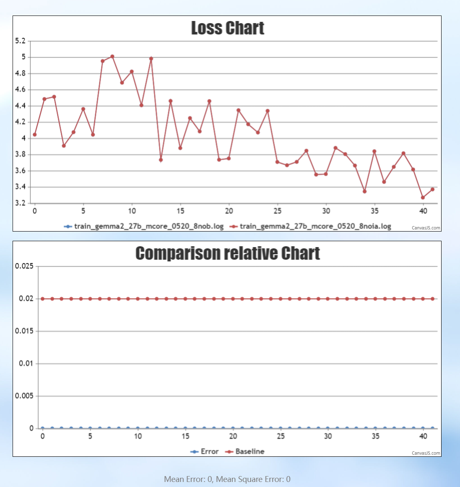
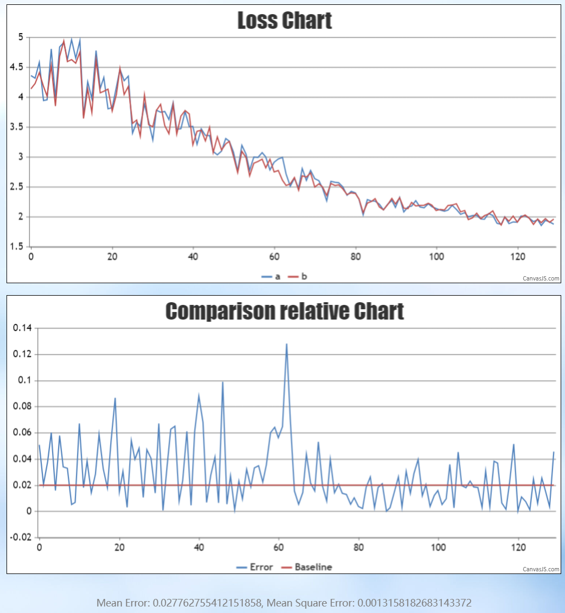
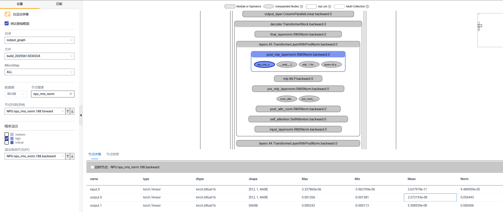
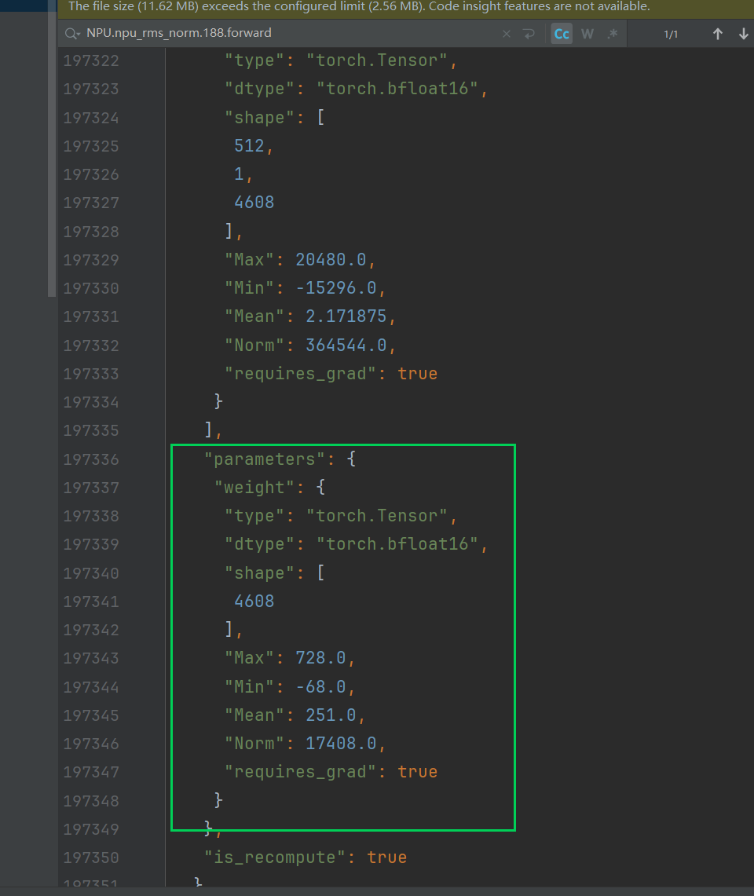
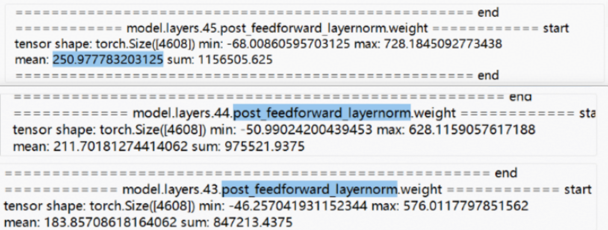
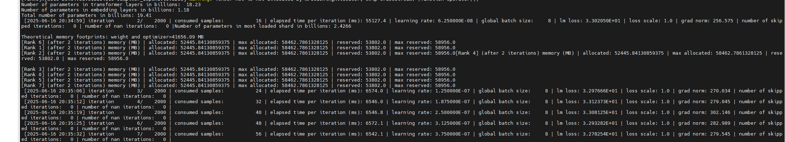
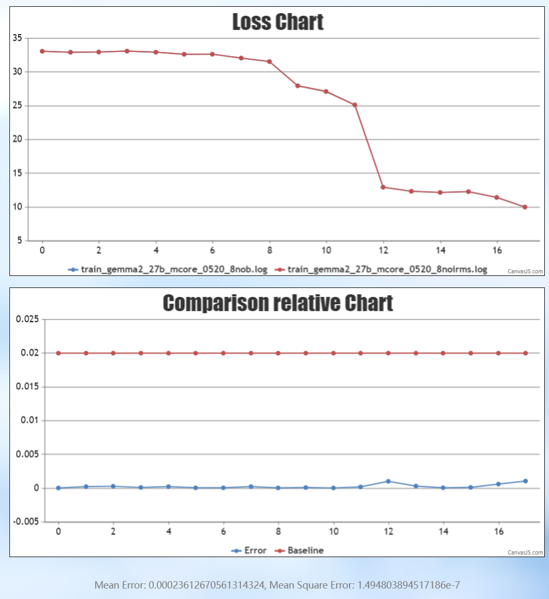

# 基于昇腾的Gemma模型重复训练Loss差异定位

## 问题背景

在昇腾平台上训练 Gemma 模型时，同样的权重与配置进行两遍训练，有时会出现 Loss/grad_norm 差异偏大的现象，给结果稳定性和问题定位带来困扰。本文记录了该问题的完整排查过程：通过字节粒度的数据 dump 与异常检测，最终定位到根因在于加载的 RMSNorm 权重数值异常放大，而非昇腾软件栈问题，为类似"重复训练结果不一致"场景提供排查思路。

## 问题现象

- **现象1**：随机初始化权重时两遍训练 Loss 对齐；加载权重时两遍 Loss 差异偏大，但两侧加载的权重确实完全一致。
- **现象2**：grad_norm 异常偏大。
- **现象3**：加载权重并减层处理后能对齐。
- **现象4**：master 分支与旧分支训练也存在差异。

**现象总结**：不开启确定性时，初始化权重两遍能对齐，加载权重两遍对不齐；开启确定性时，加载权重两遍能对齐。

初始化权重：

加载权重：

## 定位过程

使用 msprobe 工具对不开启确定性、加载权重的训练 dump 一遍数据，通过可视化工具的溢出检测功能可以看到 RMSNorm 反向位于 high level；进一步查看对应的前向过程 dump 数据，发现权重的统计值很大。

该模型中前期的 RMSNorm 值域普遍偏大，存在异常。对比其他模型中采集的 RMSNorm 权重数据，数值大多小于 1，起缩小作用；随机初始化时 RMSNorm 权重的初始值为全 1。

从现象上看，数值每经过一层都在迅速增大。

具体来看，前几层尚在正常范围，后面的层每经过一次 RMSNorm，数值量级约放大百倍。

- 确定性差异也与原始数值有关：RMSNorm 原始权重存在异常（逐层百倍放大），因此确定性差异同样偏大（小数值相乘的误差相对较小，大数值相乘的误差则被放大）。

## 问题根因

加载的 RMSNorm 权重数值异常放大，数值每经过一层 RMSNorm 放大约百倍，深层尤为严重。该异常导致两遍训练的 Loss/grad_norm 差异偏大，并放大了确定性计算误差。

## 问题结论

最终确认该问题由加载的 RMSNorm 权重数值异常偏大导致，而非昇腾软件栈问题。

## 解决方案

仅将 RMSNorm 权重随机初始化，其余权重正常加载，即可有效规避该问题。验证结果如下：

- master 分支的 grad_norm 从异常大的量级降为正常水平。

- 不开确定性时，两遍对比差异明显缩小，master 分支与旧分支成功对齐。

