# 基于昇腾的GLM5适配与训推一致性优化

## 案例简介

在大模型强化学习（RL）场景中，训练引擎与推理引擎的精度一致性是决定模型收敛效果的核心难点，训推任何一方的微小数值差异都会随层数累积放大。本文记录了在昇腾平台上使用 VeRL 框架适配 GLM-5 模型、并借助 msProbe 工具开展训推一致性对齐的完整过程，包括整网打通、精度差异点定位与修复、长跑稳定性优化等，为类似大模型强化学习的适配实践提供参考。

## 前期准备

### 任务要求

使用强化学习框架 VeRL，交付模型 GLM-5，训练一定 step 后在长序列推理场景下，各评测数据集的评测分数无明显下降，训练不崩且评测分数有上升。

### 阶段性规划

1. vllm-ascend 单推理模型跑通，精度满足要求，单推理评测分数复现论文，明确 vllm 以及 vllm-ascend 版本。
2. mindspeed-RL、megatron-bridge 适配，明确各版本及 transformer 使用的 tokenizer 版本。
3. VeRL 框架上训练和推理接入，减层端到端跑通，明确 VeRL 版本。
4. 验证权重保存和断点续训功能是否正常可用。
5. 对齐训推差异，验证精度。
6. 长跑验证训练稳定性，查看 step 曲线，评测权重。

本文确定的软件配套版本如下：

| 组件 | 配套版本 | 备注（commit） |
| --- | --- | --- |
| python | 3.11 | |
| pytorch | 2.9.0 | |
| vllm | v0.17.0 | commit b31e932 |
| vllm-ascend | v0.17.0rc1 | commit e20f0b1 |
| verl | 0.7.0 | commit 0c06358 |
| Megatron-LM | main | commit 1d462bd |
| Megatron-Bridge | main | commit 7cabf71 |
| Mindspeed | dev | commit 07056df5 |
| transformers | v5.4.0 | commit 276f140 |

### 模型权重

昇腾 NPU 环境统一采用 BF16 作为基准精度格式，权重需对齐 BF16，因此本文 GLM-5 模型适配使用的权重采用 BF16 数据类型：[权重链接](https://huggingface.co/zai-org/GLM-5)

### 训练数据集

本文使用 [dapo-math-17k](https://huggingface.co/datasets/BytedTsinghua-SIA/DAPO-Math-17k/blob/main/data/dapo-math-17k.parquet) 数据集，VeRL 已支持该数据集。

## GLM-5 模型结构及关键模块

### 训练引擎与推理引擎部分模型结构

在进行定位过程-精度对齐-训推一致性排查前，需先了解训练引擎和推理引擎分别实现GLM5模型中Attention模块计算的结构。

#### 训练侧 Megatron

```plain
(self_attention): MLASelfAttentionAbsorb(
             (core_attention): DSAttention(
               (indexer): DSAIndexer(
                 (rotary_pos_emb): YarnRotaryEmbedding()  # not using yarn 
                 (linear_wq_b): TELinear()
                 (linear_wk): TELinear()
                 (k_norm): FusedLayerNorm()
                 (linear_weights_proj): TELinear()
               )
             )
             (rotary_pos_emb): YarnRotaryEmbedding()
             (linear_q_down_proj): TELinear()
             (linear_q_up_proj): MindSpeedTEColumnParallelLinear(in_features=2048, out_features=16384, bias=False, TP=8)
             (linear_kv_down_proj): TELinear()
             (linear_k_up_proj): MindSpeedTEColumnParallelLinear(in_features=512, out_features=12288, bias=False, TP=8)
             (linear_v_up_proj): MindSpeedTEColumnParallelLinear(in_features=512, out_features=16384, bias=False, TP=8)
             (linear_proj): RowParallelLinear(in_features=16384, out_features=6144, bias=False, TP=8)
             (q_layernorm): RMSNorm()
             (kv_layernorm): RMSNorm()
       )
```

#### 推理侧 vLLM

```plain
(self_attn): DeepseekV2MLAAttention(
           (fused_qkv_a_proj): DeepSeekV2FusedQkvAProj(in_features=6144, output_features=2624, bias=False, tp_size=1, gather_output=False)
           (q_a_layernorm): AscendRMSNorm(hidden_size=2048, eps=1e-05)
           (q_b_proj): AscendColumnParallelLinear(in_features=2048, output_features=256, bias=False, tp_size=64, gather_output=False)
           (kv_a_layernorm): AscendRMSNorm(hidden_size=512, eps=1e-05)
           (kv_b_proj): AscendColumnParallelLinear(in_features=512, output_features=448, bias=False, tp_size=64, gather_output=False)
           (o_proj): AscendRowParallelLinear(in_features=256, output_features=6144, bias=False, tp_size=64, reduce_results=True)
           (rotary_emb): AscendRotaryEmbedding(
             head_size=64, rotary_dim=64, max_position_embeddings=202752, base=1000000, is_neox_style=False
             (apply_rotary_emb): AscendApplyRotaryEmb(is_neox_style=False, enable_fp32_compute=False)
           )
           (indexer_rope_emb): AscendRotaryEmbedding(
             head_size=64, rotary_dim=64, max_position_embeddings=202752, base=1000000, is_neox_style=False
             (apply_rotary_emb): AscendApplyRotaryEmb(is_neox_style=False, enable_fp32_compute=False)
           )
           (indexer): Indexer(
             (wq_b): AscendReplicatedLinear(in_features=2048, output_features=4096, bias=False)
             (wk): AscendReplicatedLinear(in_features=6144, output_features=128, bias=False)
             (k_norm): LayerNorm()
             (weights_proj): AscendReplicatedLinear(in_features=6144, output_features=32, bias=False)
             (k_cache): None
             (indexer_op): SparseAttnIndexer(
               (k_cache): DeepseekV32IndexerCache()
             )
           )
           (mla_attn): AscendMultiHeadLatentAttention(
             (mla_attn): MLAAttention(
               (kv_b_proj): AscendColumnParallelLinear(in_features=512, output_features=448, bias=False, tp_size=64, gather_output=False)
               (indexer): IndexerWrapper(
                 (wq_b): AscendReplicatedLinear(in_features=2048, output_features=4096, bias=False)
                 (wk): AscendReplicatedLinear(in_features=6144, output_features=128, bias=False)
                 (weights_proj): AscendReplicatedLinear(in_features=6144, output_features=32, bias=False)
                 (k_norm): LayerNorm()
               )
               (_decode_concat_quant_fp8_op): _DecodeConcatQuantFP8()
             )
           )
         )
```

### 关键模块——MLA+DSA

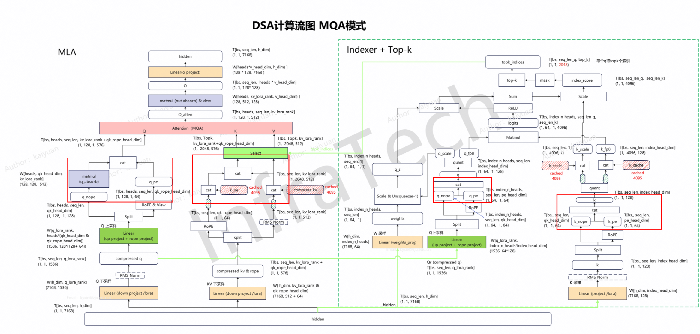

#### 整体结构：MLA + DSA 双分支联动

这张图展示了 GLM5 注意力层的完整前向计算流，分为两大块：

- 左侧：MLA（Multi-Latent Attention）主分支，实现低秩隐式注意力，是稠密计算的核心。
- 右侧：DSA（DeepSeek Sparse Attention）的 Indexer + Top-k 分支，实现长序列关键 Token 筛选，是稀疏优化的核心。两者共享同一个输入 `hidden`，最终协同影响注意力的计算范围和结果。

#### MLA 计算流

MLA 的核心是低秩压缩 + 隐式 KV 缓存，全程围绕"压缩 → 上采样 → 注意力计算"展开。

**1) 输入与压缩阶段**

```plain
hidden (T[bs, seq_len, h_dim])
    ↓
Linear(down project/lora) → compressed q/kv (低秩表示)
    ↓
RMSNorm
```

- 输入：模型层的隐藏状态 `hidden`，形状为 `(bs, seq_len, 7168)`。
- 第一步：通过 `Linear(down project/lora)` 做低秩下采样，得到压缩后的 `compressed q` 和 `compressed kv`。
- 目的：大幅降低 KV 缓存的维度，减少显存占用，适配超长序列。

**2) 上采样与 RoPE 嵌入**

以 Query（Q）为例，流程如下：

```plain
compressed q → Linear(up project + rope project) → Q上采样
    ↓
Split → q_nope（无位置信息部分） + q_pe（位置信息部分）
    ↓
q_pe → RoPE & View → 旋转位置编码
```

- 压缩后的 `compressed q` 通过 `Linear(up project + rope project)` 上采样，恢复到和注意力头匹配的维度。
- 上采样后 Split 为两部分：`q_nope`（不含位置信息的内容特征，后续用于隐式注意力计算）和 `q_pe`（用于 RoPE 旋转位置编码的位置特征，单独做位置嵌入）。

**3) KV 侧的处理与缓存复用**

Key（K）和 Value（V）的处理和 Q 对称，同时支持缓存复用：

```plain
compressed kv → Linear(down project/lora) → KV下采样
    ↓
Split → k_nope + k_pe
    ↓
k_pe → RoPE & View → 旋转位置编码
    ↓
cat(k_nope, cached_compress_kv) → 拼接缓存与新KV
    ↓
Select + cached_compress_kv → KV缓存更新
```

- 推理时，`k_pe` 和 `k_nope` 会和历史的 `cached_compress_kv` 拼接，实现 KV 缓存复用，大幅减少重复计算。
- 训练时无缓存，直接处理完整序列的 `compressed kv`。

**4) 隐式注意力计算（MQA 模式）**

```plain
Q分支：q_nope → cat + q_rope_head_dim → q_absorb
K分支：k_nope → cat + k_rope_head_dim → k_absorb
    ↓
Attention(MQA) → O_attn
    ↓
matmul(out_absorb) & view → O
```

- 把 `q_nope` 和 `k_nope` 分别和位置相关的特征拼接，通过 `matmul(q_absorb)` 完成隐式注意力计算。
- 这一步的 `matmul` 和 `view` 操作，是训练侧 Megatron 和推理侧 vLLM 实现差异的关键之一，直接影响输出精度。

#### DSA（Indexer + Top-k）计算流

DSA 的核心是 Indexer 打分 + Top-k 筛选，决定了长序列中哪些 Token 会参与注意力计算。

**1) Indexer 打分阶段**

```plain
hidden → Linear(project/lora) → K采样 → k (bs, seq_len, 128)
hidden → Linear(weights_proj) → weights (bs, index_n_heads, seq_len, 1)
    ↓
k → Scale & UnSqueeze → k_s
    ↓
q (from compressed q) → quant → q_fp8 → q_scale
k → quant → k_fp8 → k_scale
    ↓
q_nope + q_pe → cat → 融合位置与内容特征
k_nope + k_pe → cat → 融合位置与内容特征
    ↓
Matmul(q, k) → index_score (bs, index_n_heads, seq_len_q, seq_len_k)
```

- 输入 `hidden` 经过两个线性层：`Linear(project/lora)` 生成 K 侧特征 `k`；`Linear(weights_proj)` 生成权重 `weights`，作为 Indexer 的打分参数。
- `q` 和 `k` 分别做量化（`quant`）和缩放，再拼接位置与内容特征，通过 `Matmul` 计算 Token 间的重要性分数 `index_score`。

**2) Top-k 筛选阶段**

```plain
index_score → Scale → logits
logits → ReLU → Sum → Scale → topk_indices
    ↓
topk + mask → 筛选出Top-k个关键Token
```

- `index_score` 经过 `Scale → ReLU → Sum → Scale` 一系列变换，得到每个 Token 的最终重要性分数。
- 通过 `top-k` 算子，筛选出序列中最重要的 `topk_indices`，并结合 `mask` 生成稀疏注意力掩码。
- 训练侧使用确定性的 `torch.topk`，推理侧原生 vLLM 可能用非确定性加速算子，这是训推差异的核心来源。

**3) 筛选结果回传 MLA**

```plain
topk_indices → Select → 从MLA的KV中只保留Top-k Token
    ↓
只有筛选后的Token参与后续注意力计算
```

- 筛选出的 `topk_indices` 会回传给 MLA 的 `Select` 模块，让 MLA 只对关键 Token 做注意力计算，过滤冗余 Token，实现稀疏优化。

## 定位过程-整网功能适配

在 VeRL 框架上完成训练引擎和推理引擎的单独适配验证后，配置训练和推理的相关参数，拉起整网的训练任务时遇到一些适配问题。

### 报错：TO serve at least one request with the models's max seq len（202752）

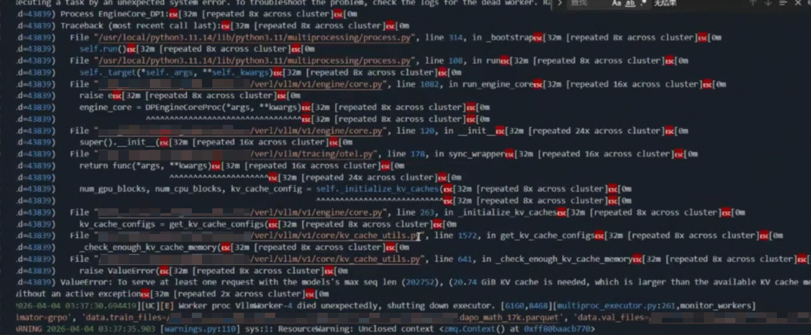

正常来说，max_seq_len 是通过 prompt_len 和 response_len 得到。在框架侧代码中搜索 202752，发现 max_position_embeddings=202752。

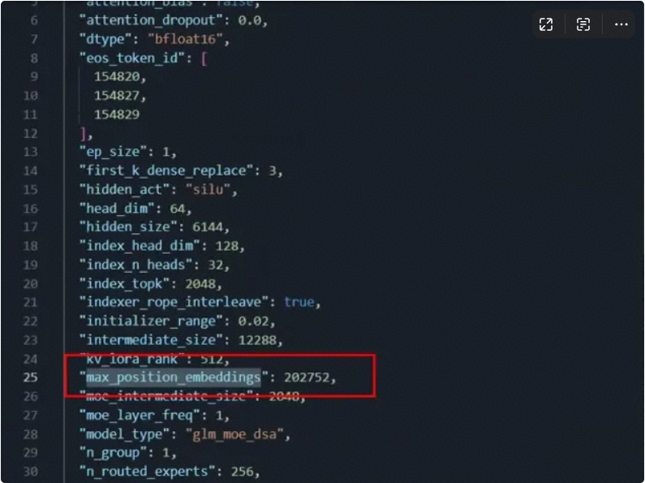

和预期不一致。查看源码中 max_seq_len 的定义，发现不同版本的定义逻辑不同：verl 0.7.1 版本在该参数未设置时会默认为 max_position_embeddings，而之前的 verl 版本默认设置为 prompt_len+response_len。最后修改 VeRL 训练启动脚本，添加 rollout.max_model_len=$prompt_length+$response_length 解决。

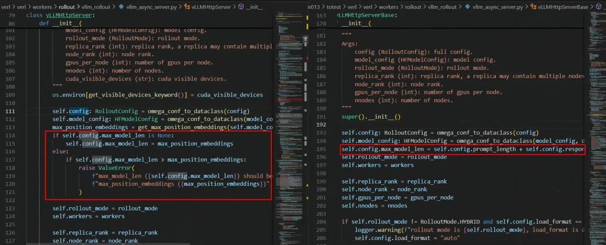

### AttributeError: 'NPUModelRunner' object has no attribute 'cudagraph_batch_sizes'

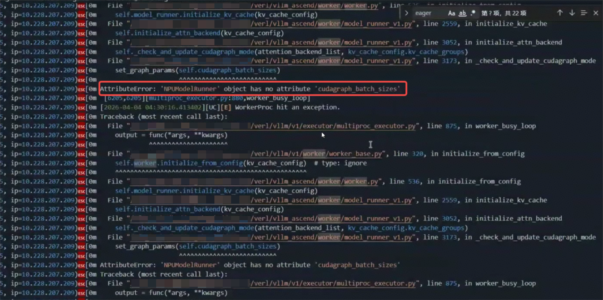

查看 VeRL 启动脚本，没有配置 cudagraph_batch_sizes，参考之前项目中图模式走 FULL_DECODE_ONLY 的配置：

```plain
"cudagraph_mode": "FULL_DECODE_ONLY",
"cudagraph_batch_sizes": [8,16,32,64,128,192,256,384]
```

尝试添加后发现会 OOM。

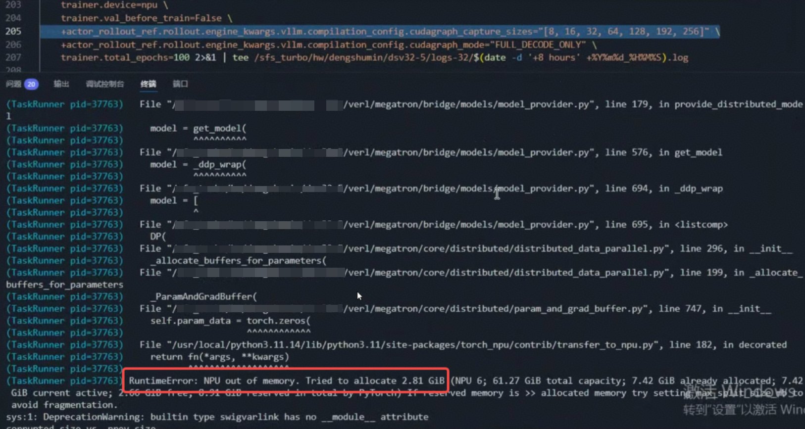

考虑到模型大小差异，batch_size 大的图预编译会需要更大的显存，尝试把 cudagraph_batch_sizes 改为 [1,2,4]，发现仍会报 OOM。查询资料，考虑可能是模型本身切分太大导致静态显存已经占用较满。

调整模型切分：

```plain
TP： 16 -> 8
DP： 4  -> 8
EP： 64 -> 64
```

发现在新的切分策略下，"cudagraph_batch_sizes": [8,16,32,64,128,192,256,384] 也可以正常放下。

### vllm 中 input_processor 类型报错：TypeError: '>' not supported between instance of 'str' and 'int'

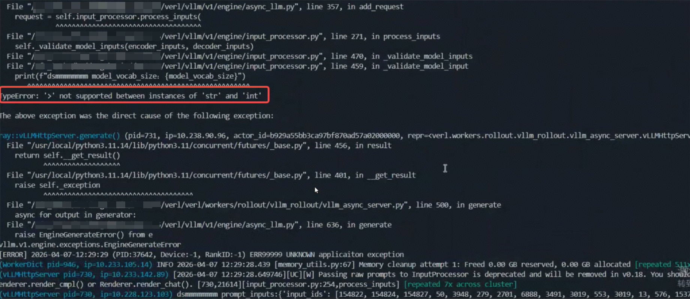

打印传入 vllm 侧的 request 的 prompt_input 结构：

```plain
prompt:{
  'prompt_token_ids':{
        'input_ids':[xxx],
        'attention_mask':[xxx]
        },
  'multi_modal_data':xxx
  }
```

对比之前在本地验证的版本下的 request 的 prompt_input 结构发现差异：

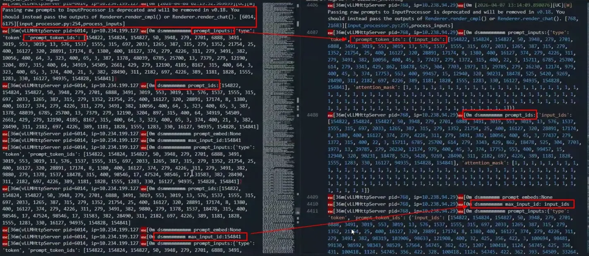

- vllm 0.17.0 + VeRL 0.7.1：结构是符合的，不会报错。
- vllm 0.17.0 + VeRL commit 0c06358：结构变化了，不兼容。

该问题报错出现在两处：vllm/v1/engine/input_processor.py、vllm/v1/engine/detokenizer.py。

后面对比不同 transformers 版本，发现这个问题是 transformers 版本更迭导致的，但 VeRL 在最新版本 0.7.1 中兼容掉了这个问题。因此在未兼容的 prompt_input 结构下，手动取 'input_ids' 和 'attention_mask'。

## 定位过程-精度对齐-训推一致性排查

大模型强化学习的精度问题定位链路复杂、影响因素繁多，基于 msProbe 精度工具，开展精度对齐落地实践与问题定位排查。

### 精度监控配置

整网跑通后，通过在 VeRL 训练启动脚本中配置精度监控参数计算关键指标，在训练过程中观察每个 step 的训推一致性以及训练的稳定性。

```python
actor_rollout_ref.rollout.calculate_log_probs=True
```

```python
training/rollout_probs_diff_mean: 训推前向 rollout 的 logprob 的 diff 平均值
training/rollout_probs_diff_max: 训推前向 rollout 的 logprob 的 diff 最大值
training/rollout_actor_probs_pearson_corr: rollout 和 actor 的概率的 pearson 相关系数
```

```python
critic/rewards_mean: 每一步所有输入的回答分别经 reward 打分器得分后的平均值
actor/grad_norm: 判断模型收敛趋势
actor/entropy: 策略熵，模型 rollout 的随机性，该值过大 rollout 生成可能存在乱码
```

此外，配置 rollout_data_dir 保存训练过程中 rollout 生成的结果，可用来查看 rollout 生成是否存在乱码、重复吐字等异常情况。

### msProbe 采集数据

通过观察训推一致性指标 training/rollout_probs_diff_mean，整网跑通后初始值较大，说明训推实现差异较大，需要结合该指标与单推理评测结果，使用 msProbe 工具采集训推阶段的数据做分析。

首先统一训练和推理的切分策略：TP=64, DP=1, EP=64，模型减层为 5 层（3 层 Dense + 2 层 MoE），其余相关设置如下：

```python
n_gpus_per_node=16
train_batch_size=1
n_resp_per_prompt=1
ppo_mini_batch_size=1
max_prompt_length=448
max_response_length=1
use_dynamic_bsz=False

actor_rollout_ref.actor.ppo_micro_batch_size_per_gpu=1 \
actor_rollout_ref.ref.log_prob_micro_batch_size_per_gpu=1 \
actor_rollout_ref.rollout.log_prob_micro_batch_size_per_gpu=1 \
```

参考 [msProbe-VeRL框架Megatron引擎采集训练侧数据](https://gitcode.com/Ascend/msprobe/blob/master/docs/zh/user_guide/dump/verl_megatron_consistency_preprocess_dump.md) 修改训练代码，将训练输入调整为单 prompt，推理侧工具使能已集成到 Vllm-ascend 官仓中可直接使用，统一训练和推理阶段的输入，同时修改配置，确保 prefill 阶段的数据具备可比性。

训练侧：verl/workers/actor/megatron_actor.py

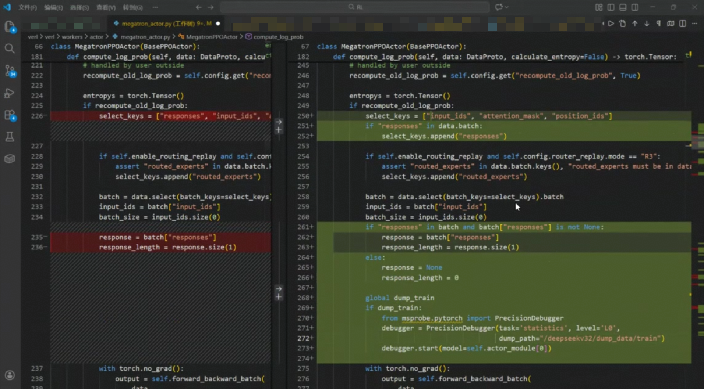

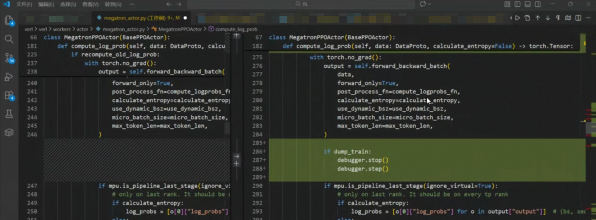

### 训推差异点排查

基于 msProbe 工具排查与定位思路：

完成数据采集后，首先需要确定比对的标杆。vllm-ascend 接 GLM-5 模型服务化启动后，以单推理对 aime2025 数据集做评测任务，对标 GLM-5 论文输出条件，表明单推理没有大的精度问题，可暂时作为训练侧的标杆，但最终还是要参考权威源码与技术报告为准。

读取 construction.json 文件进行模块级数据比对。先保证 layer.0.input_layernorm 输入数据完全一致，再逐模块逐层校验，定位训练与推理输出首次出现不一致的位置。

对于大尺寸模型，微小数值差异会随着逐层累积、放大，导致训练（training）和推理（rollout）的结果差异明显，甚至会出现同一个 token 训推输出概率分别为 0 和 1 的现象，因此需尽可能将每一处差异点对齐至完全相等。定位到差异节点后，适配修改方案同样是关键难点。

#### 差异点一：FFN 激活函数的框架实现不一致

通过 msProbe 采集的数据按照算子执行序依次比对，排查到 layers.0 的 MLP 模块激活函数输出不一致。

推理侧：

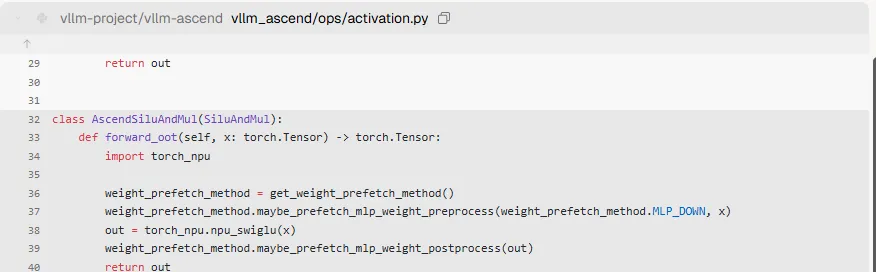

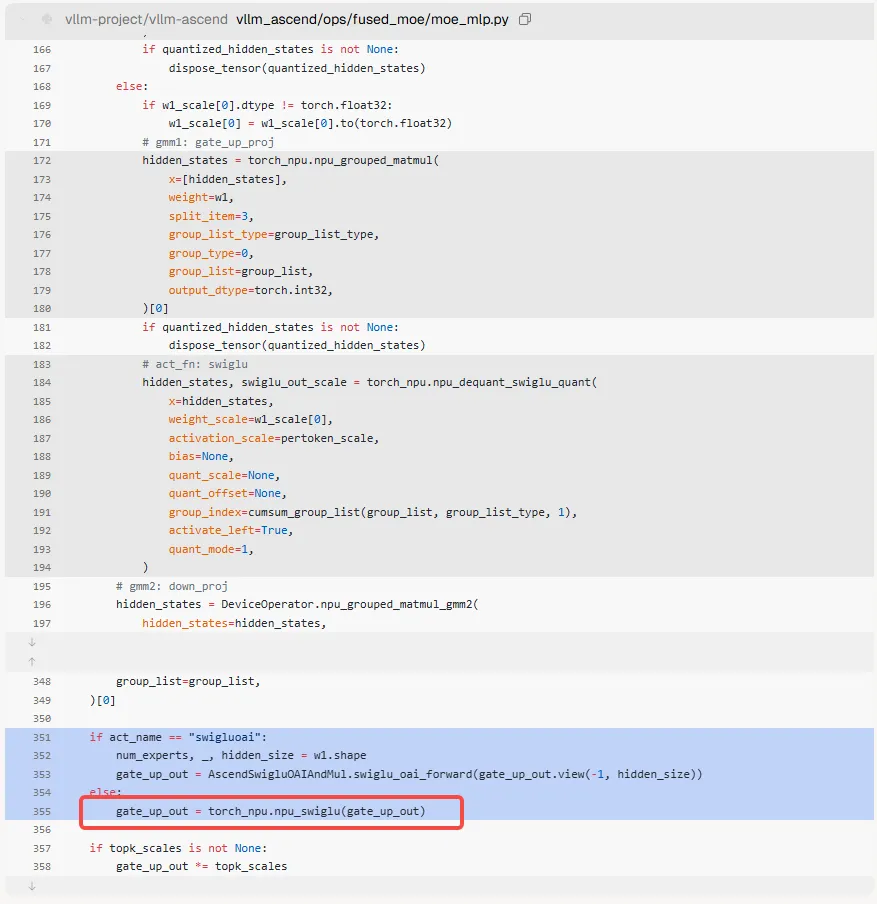

训练侧：

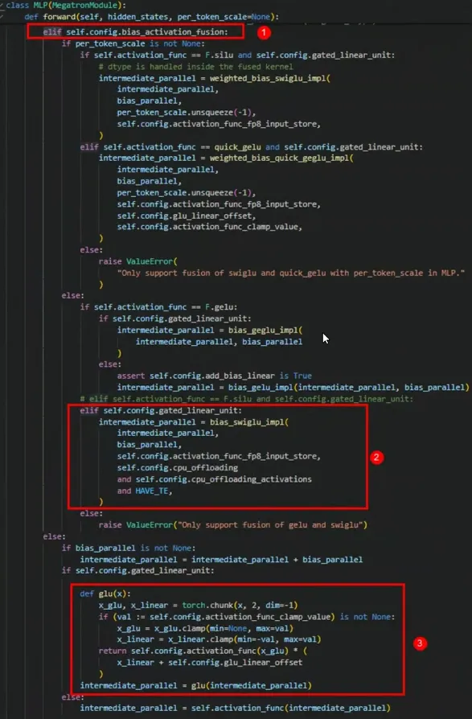

查看 stack 调用栈并检查代码后，明确 MLP 位置 Dense 层和 MoE 层的私有专家与共享专家的 act_fn 存在差异。推理侧以 npu_swiglu 融合算子实现，训练侧是因 mindspeed 的 patch 没生效，走的 glu 小算子实现，而 verl 的参数中已经添加 swiglu 使能参数。

```python
+actor_rollout_ref.actor.megatron.override_transformer_config.swiglu=True \ 
+actor_rollout_ref.actor.megatron.override_transformer_config.use_fused_swiglu=True \
```

经过排查确认为 Megatron-Bridge 的 PR 适配时没有直接设置 provider.bias_activation_fusion=True，本应走的 bias_swiglu_impl 走到了小算子实现。在 Bridge 中增加该配置后成功走入对应路径，被 mindspeed 成功 patch，调用 npu_swiglu 融合算子实现。修改后 training/rollout_probs_diff_mean 明显下降，但仍较大，需要继续排查。

#### 差异点二：indexer_k_norm

继续往下排查，发现推理侧 indexer_k_norm 存在先升 fp32、再降 bf16 的操作，训练侧是 bf16 实现。

推理侧：

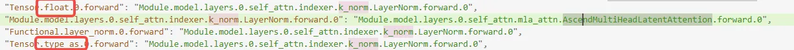

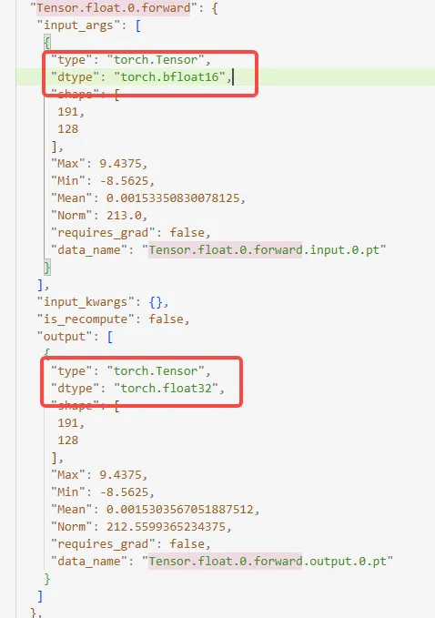

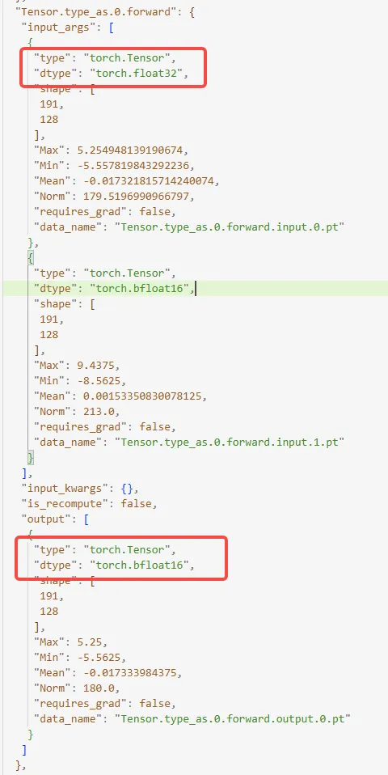

训练侧：

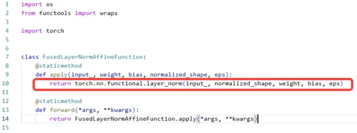

修改为：

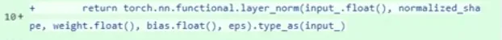

同时发现 k_norm 的 eps 入参有不一致之处：推理侧是 1e-6，训练侧是 1e-5，参考 GLM-5 技术报告采用 1e-5 进行对齐。修改后重新跑训练实验，观察指标 training/rollout_probs_diff_mean 进一步下降。

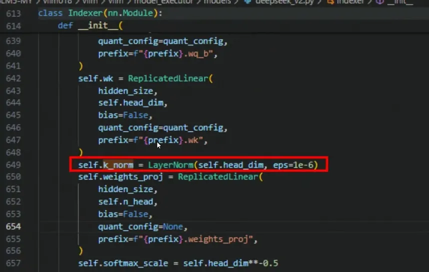

#### 差异点三：rope 模式 - half/interleave

Lightning Index 推理侧 RoPE 采用 Half 精度融合实现，训练侧基于 Interleave 小算子原生实现，二者模式不一致。因 GLM5 适配开发阶段暂无法获取公网 Triton-Ascend 实现，适配时手动配置 HAS_TRITON=False；且 GLM5 与 DeepSeekV32 复用 sfa_v1.py 文件，导致 Indexer 的 RoPE 逻辑默认走 half 精度分支，与技术报告指定的 Interleave 实现规范不符。多方确认后，将推理侧 q、k 替换为 torch_npu.npu_interleave_rope(x, cos, sin) 实现，经过验算输出与 Megatron 小算子结果完全一致。修改后重新跑训练实验，观察指标 training/rollout_probs_diff_mean 进一步下降。

训练使用小算子实现 interleave 格式：

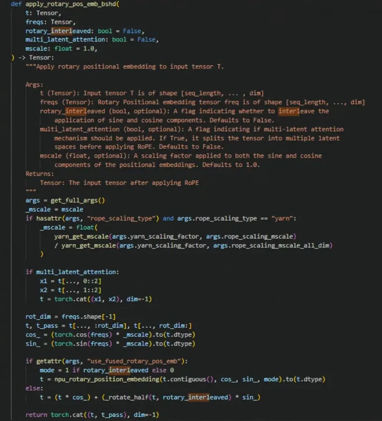

推理使用融合算子默认为 half 模式：

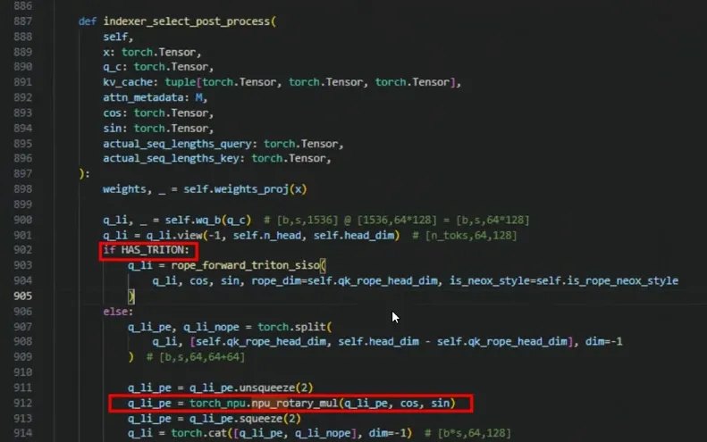

GLM-5 配置文件中采用 interleave 模式：

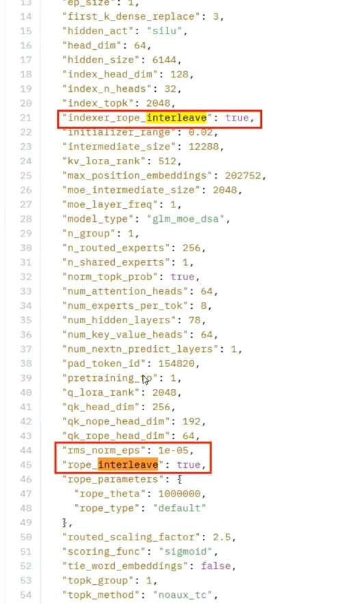

#### 差异点四：torch_npu.npu_add_rms_norm 与 add + torch_npu.npu_rms_norm 推理融合算子往训练小算子对齐

推理侧使用 torch_npu.npu_add_rms_norm，训练侧使用 torch_npu.npu_rms_norm，两个算子输出数据比对验证不一致。

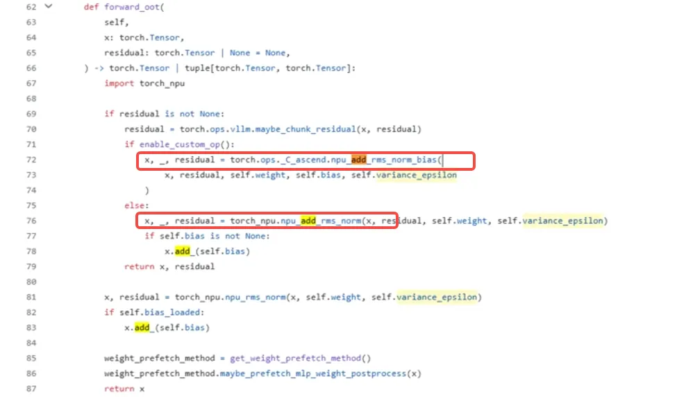

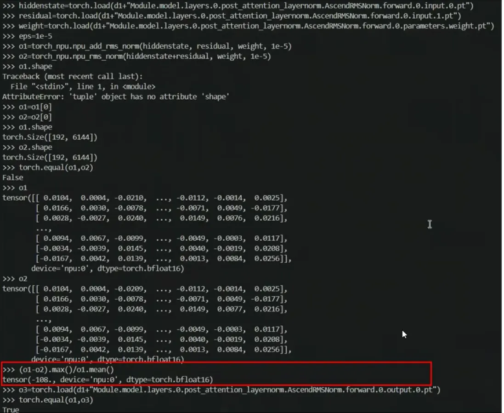

将推理侧 torch_npu.npu_add_rms_norm 替换为小算子实现（加法基础算子 + torch_npu.npu_rms_norm），经验证输出一致。修改后重新跑训练实验，观察指标 training/rollout_probs_diff_mean 持续下降。

### MSAgent 实践

数据：GLM-5 在 VeRL 框架上减层到 5 层（3 层 Dense + 2 层 MoE）采集的 L0 数据。

Agent 分析结论：

训练和推理数据中对应模块的 MLP 的 gate_up 和 linear_fc1 输出还是对齐的，但后面 rollout 比 train 多经过了 mlp.act_fn.AscendSiluAndMul.forward.0 计算，导致后续 train 和 rollout 的模块输入、输出都不对齐。

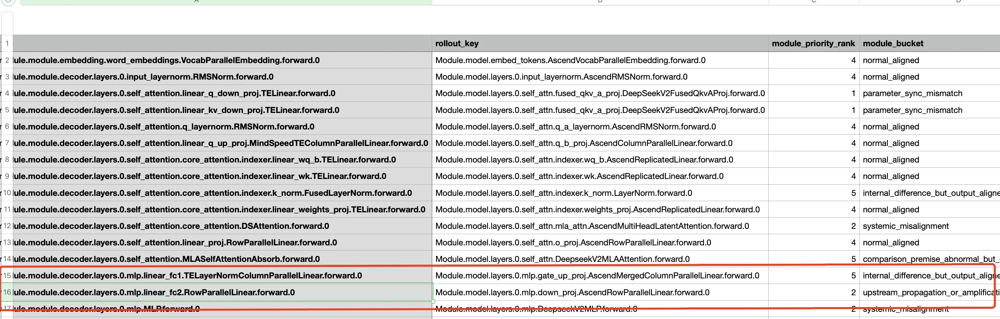

人工定位结论：

act_fn 的实现训练和推理不一致，vllm 侧走的是 vllm_ascend 的 swiglu 融合算子，megatron 走的是 megatron 的 gelu，这块 verl 配置了走 swiglu，但在 megatron_bridge 上参数没设置正确导致没有生效。

总结：通过 L0 级别的数据，人工定位和 Agent 定位界定的范围差不多。但由于 L0 级别的限制，以及 Agent 无法得到实际的框架实现代码，最终根因能确定的准确度是不一致的。现场允许的情况下，可以尝试将 Agent 连接 workspace 获取实际框架实现代码，同时读取 dump 下来的 tensor 数据进行自动化的比对。

## 训练长跑指标监控

### 训练长跑稳定性优化

将强化学习任务中训练和推理阶段的实现基本对齐后，进行长跑实验，得到初始的曲线图。通过观察训练稳定性指标的曲线趋势：

1. Critic/rewards_mean：在训练过程中没有明显的上升趋势。
2. Response length mean 和 Response length clip ratio：在训练过程中，推理 rollout 的长度越来越长，同时 rollout 结果被截断的比例越来越高。
3. 观察 rollout 生成的回答，发现大部分回答过长，存在重复 think 的现象，且没有在输出 eos 后正常停下。

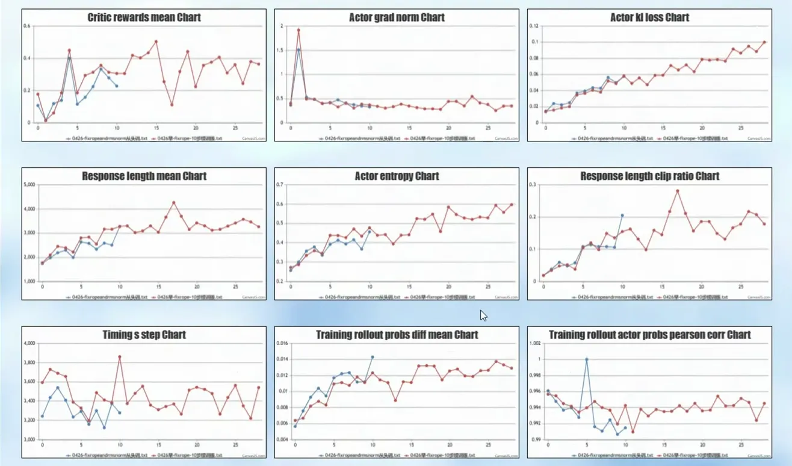

考虑到 think 模式生成的 token 序列长度较长，有可能会直接输出达到较长水平，尝试做关闭 think 的消融实验。可以观察到关闭 think 确实对 reward 上升有帮助，推理输出长度增速也较为平缓，因而 rollout 生成结果截断的比例也有所下降。

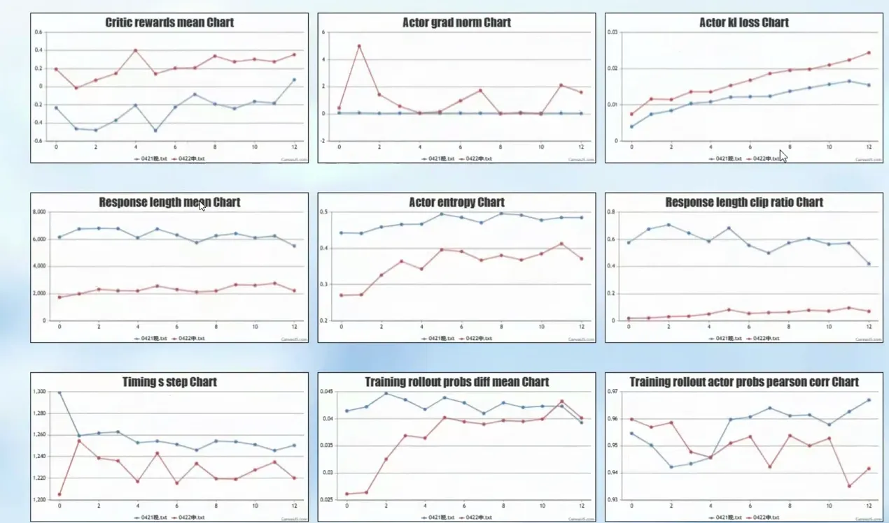

关闭 think 模式后，发现还存在重复吐字现象：rollout 生成结果中输出了 eos_token 并未停止回答。猜测可能是 eos_token 未生效。检查模型权重中的 config.json，发现 eos_token_id 集合值与原始模型不一致，定位发现是 VeRL 会覆写 config.json，导致 eos_token_id 被覆盖只剩一个 token_id，因此导致 rollout 生成结果中输出了 eos_token 并未停止回答的问题。

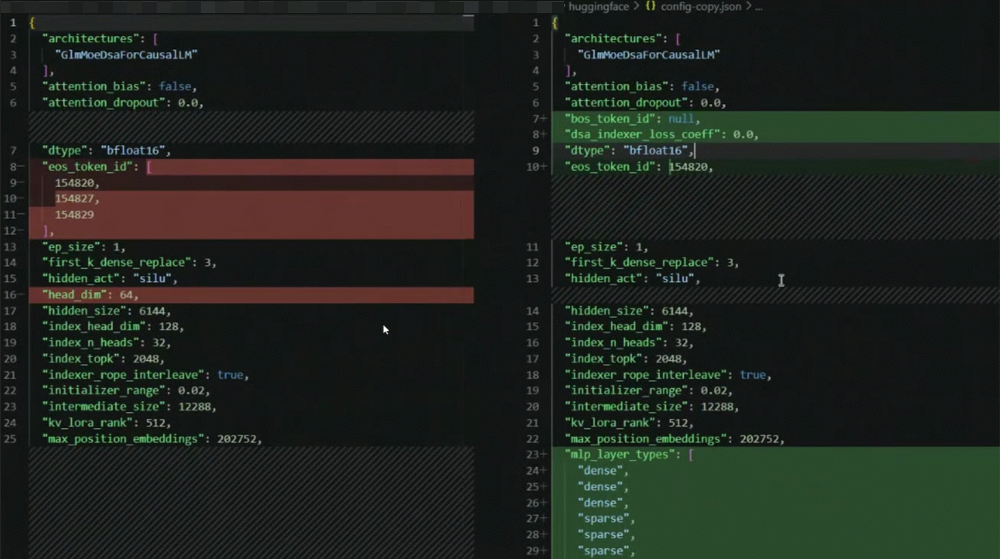

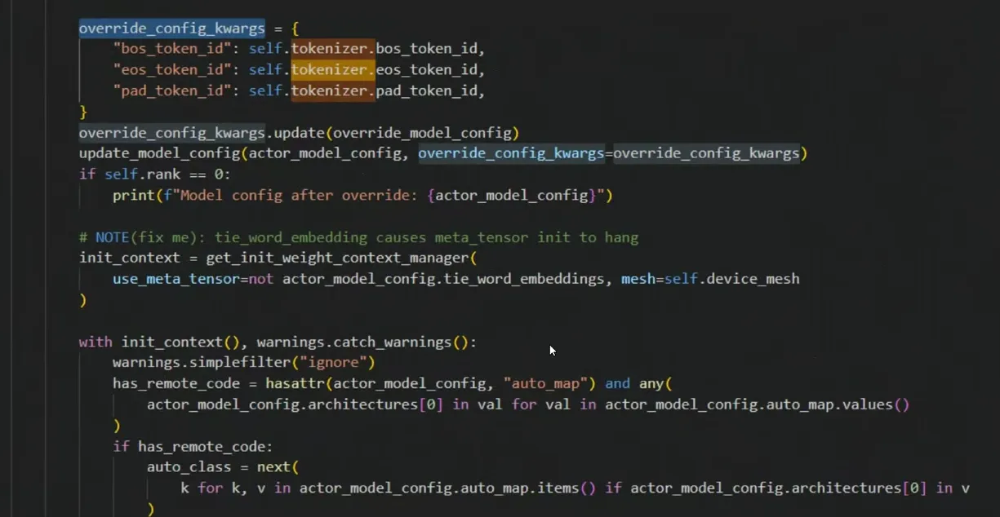

输出较长对数学类数据集 math-17k 确实有比较大的影响，限制模型的能力，但这是符合实际业务要求的。为了避免模型受截断影响学习不到完整的正确回答，考虑修改 reward 打分器的规则，尝试在 reward 规则中加入长度惩罚。进行长跑实验发现，开长度惩罚与不开长度惩罚相比，response_length_mean 上升更加缓慢且幅度较小，同时 rollout 的截断比例明显更小，reward 曲线趋势差不多，因此在长跑实验中加入长度惩罚条件。

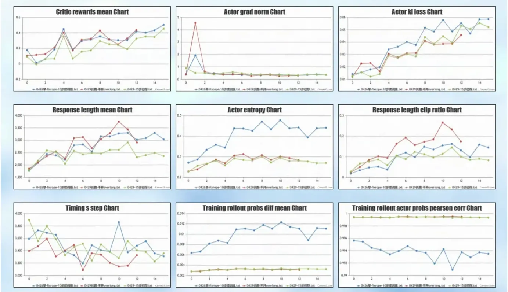


## 经验总结

在强化学习业务场景中，训推一致性是核心重难点，而训推数据差异比对是打通该问题的核心手段。msProbe 工具凭借采集范围全、采集效率高的优势，为排查训推差异筑牢基础，同时依托自动化精度比对能力，大幅提升问题定位与整改效率。

结合项目实际落地使用场景，提出三点工具优化建议：

1. 工具算子采集白名单暂未纳入部分自定义融合算子，当前需人工手动完成算子注册，使用流程繁琐。
2. 现有算子级训推差异比对功能，在跨模型泛用性与比对精准度上仍有不足。现阶段 MSAgent 仅可实现问题初步定位，建议升级优化 Agent 能力，实现仅依托 Dump 数据即可全自动完成算子层级训推差异精准定位。
3. 补充新增监测能力，支持对模型权重配置文件、训推引擎运行参数及框架级超参的变更进行实时感知与监控。

