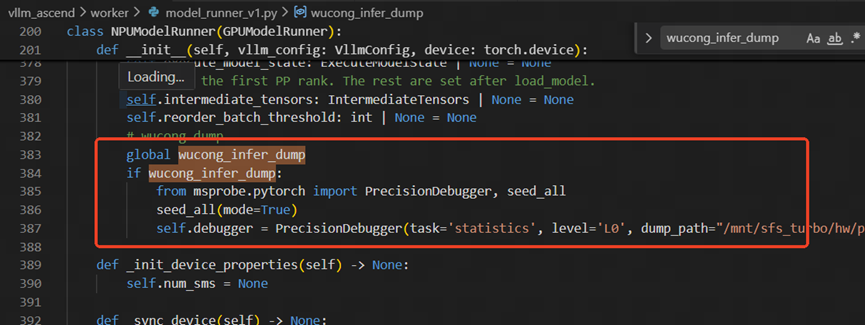
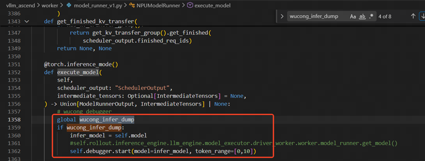
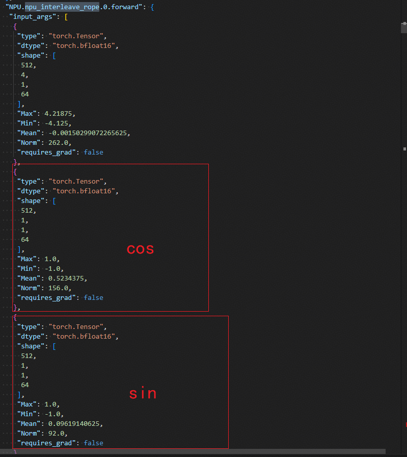
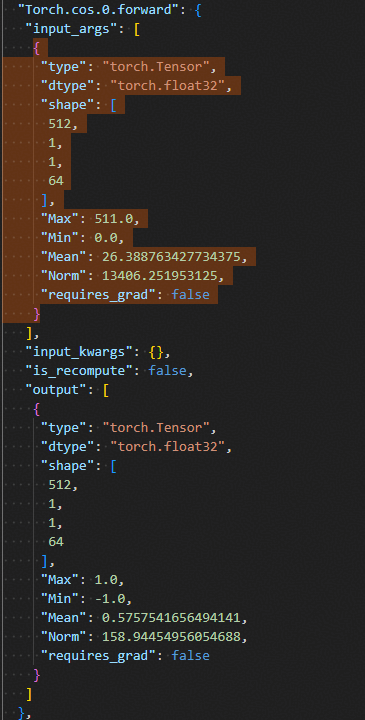
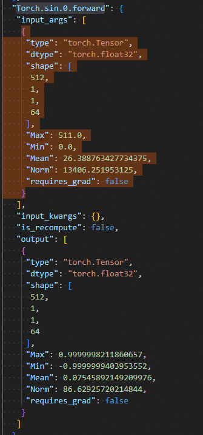
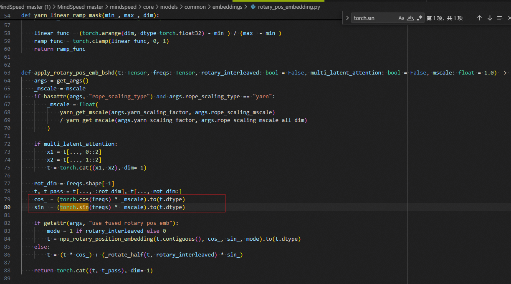
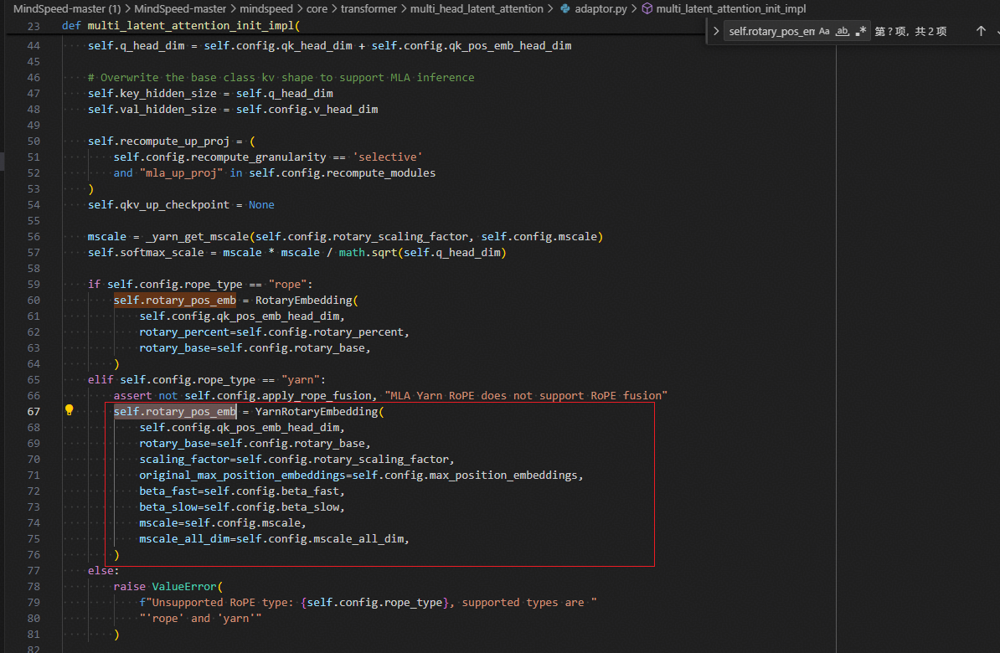

# 基于昇腾的Kimi2.5训推一致性优化

## 问题背景

在强化学习训练中，训练阶段与推理阶段的对齐程度直接决定训练精度与稳定性。Kimi2.5 模型在昇腾上训练时出现 log_prob 指数差异过大的现象，超出预期范围，本文记录了通过训推 dump 逐层比对定位根因并完成对齐的过程，为类似训推不一致场景提供参考。

## 问题现象

Kimi2.5 模型出现 log_prob 指数首 step 差异较大的现象。对于强化学习而言，该指标通常要求控制在一个极小范围以内。

基于此现象，优先怀疑训推不一致导致的训练精度问题。

## 定位过程

整体思路：

1. 缩小规模复现：整体数百卡场景下 log_prob 指数差异较大，缩小至双机多卡测试后差异仍然明显。
2. 训练、推理阶段使用相同输入分别执行，采集 dump 数据。
3. 优先尝试减层，先排查 dense 层，训推各减层至 1 层；确保 dense 层对齐后，再加层比较 moe 层，完成训推对齐。

### 推理阶段 dump

1. 在 `vllm_ascend/worker/model_runner_v1.py` 文件的 `NPUModelRunner.__init__` 方法中，增加工具初始化代码，同时增加确定性开关。

    

2. `execute_model` 方法开始执行时进行 debugger start（开始 dump）。

    

3. `execute_model` 方法中 `_generate_process_reqs_hidden_states` 执行完后进行 stop（结束 dump）。

    

### 训练阶段 dump

1. 在 `verl/workers/actor/megatron_actor.py` 文件的 `MegatronPPOActor.compute_log_prob` 方法中，调用 `forward_backward_batch` 前后增加工具初始化及 dump 开关。

### 训推比对

完成上述操作后，可得到 `train_dump.json` 和 `infer_dump.json` 两份文件，直接逐层比对即可。

## 问题根因

**1. 首先，第一个不一致模块 MLA 输出**

**2. 向前追溯**

推理侧：

训练侧：

训练代码实现：

**3. cos 和 sin 的计算均来自于 freqs，向上追溯 freqs 来源**

    

    

4. 打印 `YarnRotaryEmbedding` 入参，与推理做对比，发现 `original_max_position_embeddings=1024`，而实际外层配置为 4096。

## 解决方案

修正配置后，log_prob 指数首 step 差异明显下降至预期范围，持续训练后 reward 呈稳定上升趋势。
