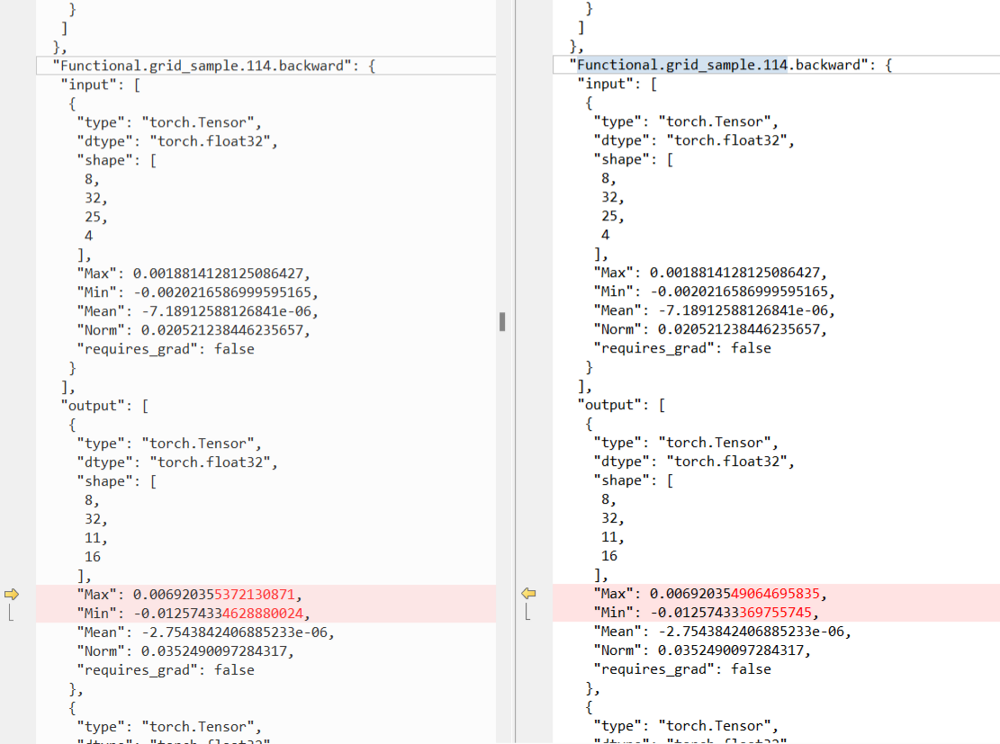
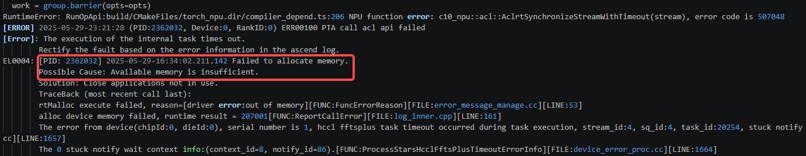
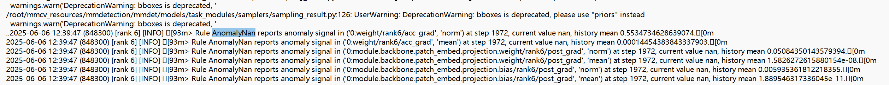
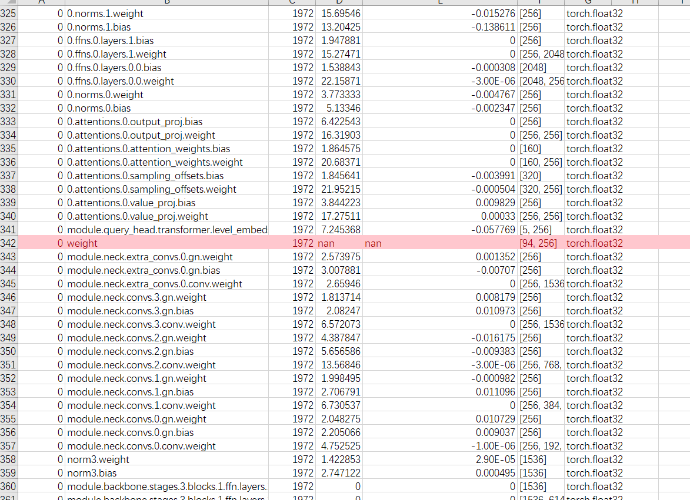
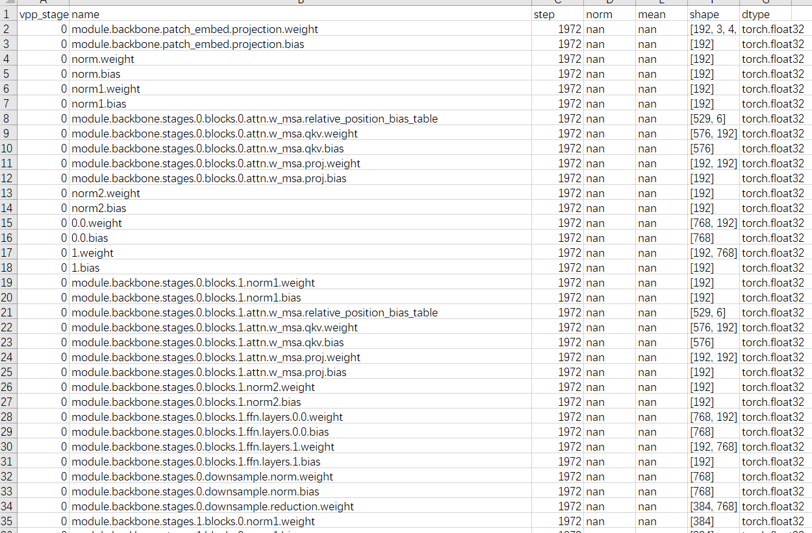
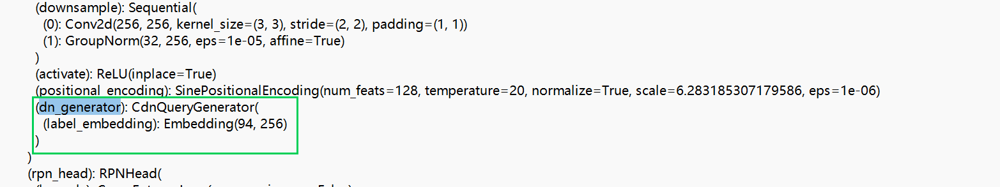
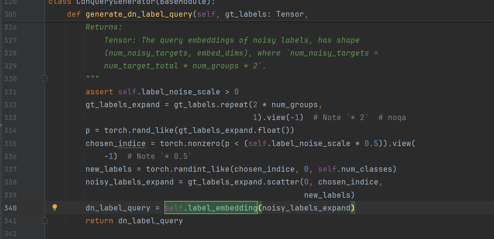
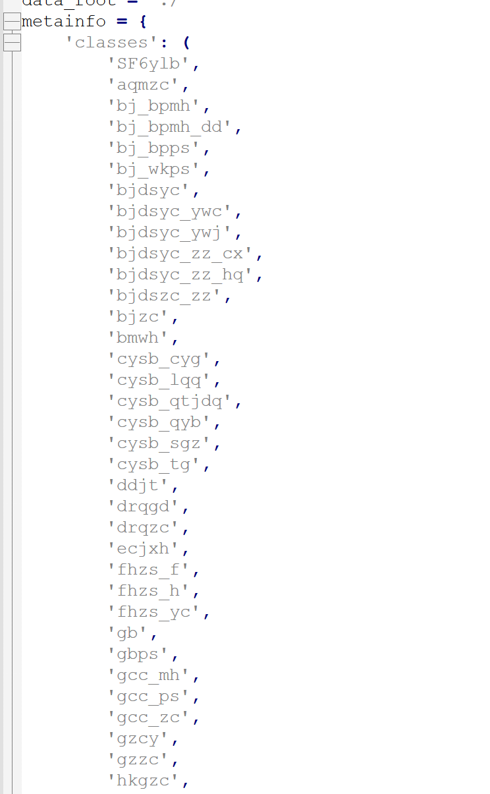
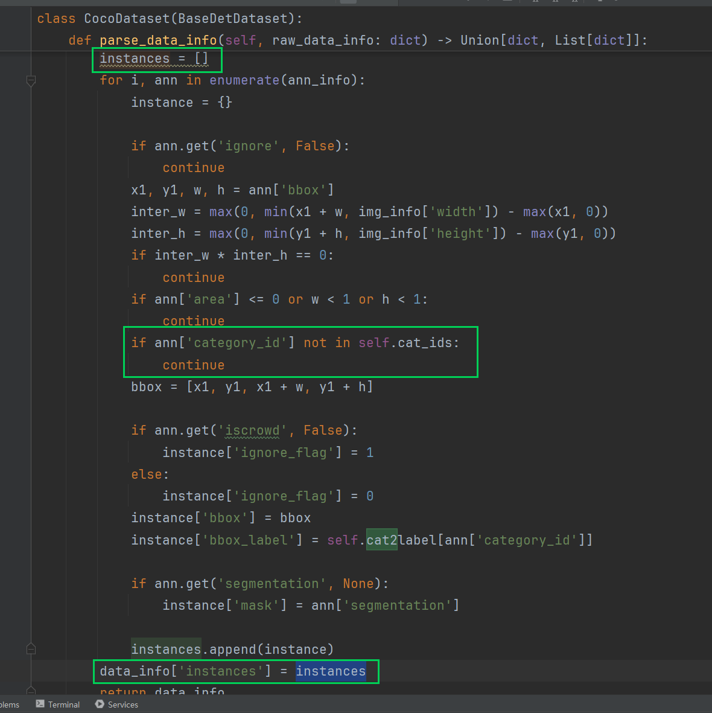

# 基于昇腾的mmdetection训练NaN问题定位

## 问题背景

在计算机视觉检测模型的训练中，换用新数据集后出现数值异常（NaN）是常见的排查难题。mmdetection 模型在昇腾 NPU 上换用新数据集训练后出现 NaN，且无标杆可供对照。本文记录了通过确定性控制、通信排查与数据流分析逐步定位根因的过程，为类似训练异常排查提供参考。

## 问题现象

8 卡训练 mmdetection 模型，旧数据集上精度对齐，换用新数据集后出现 NaN，而新数据集上没有标杆可供对照。

先做初步评估：

1. 检查数据集与数据预处理代码——业务方认为数据集没有问题，放到其它模型可以正常训练。
2. 调整无标杆条件下的预期与定位思路。

NaN 复现步数不定，但一定会在一定 epoch 数内报错。

## 定位过程

### 尝试固定随机性与确定性

固定数据集随机性（数据集中存在随机 resize，先尝试固定 resize 大小）+ seed_all + 开流同步，完整训练后无 NaN。

恢复随机 resize + seed_all + 开流同步，NaN 在后续 epoch 复现。查看 dump 数据发现 `grid_sample` 反向存在差异。



`grid_sample` 转 CPU 后，前几步确定性已固定。

转 CPU 操作代码示例如下：

```diff
value_l_ = value_list[level].flatten(2).transpose(1, 2).reshape(
-      bs * num_heads, embed_dims, H_, W_).to('cpu')
+      bs * num_heads, embed_dims, H_, W_)
# bs, num_queries, num_heads, num_points, 2 ->
# bs, num_heads, num_queries, num_points, 2 ->
# bs*num_heads, num_queries, num_points, 2
sampling_grid_l_ = sampling_grids[:, :, :,
-                                    level].transpose(1, 2).flatten(0, 1).to('cpu')
+                                    level].transpose(1, 2).flatten(0, 1)
# bs*num_heads, embed_dims, num_queries, num_points
sampling_value_l_ = F.grid_sample(
-    value_l_,
+    value_l_.to('cpu'),
-    sampling_grid_l_,
+    sampling_grid_l_.to('cpu'),
    mode='bilinear',
    padding_mode='zeros',
-    align_corners=False)
+    align_corners=False).to(value_l_.device)
sampling_value_list.append(sampling_value_l_)
```

### 开始长跑等待 NaN

长跑数小时后出现通信 + 显存溢出现象。



先尝试用环境变量把超时时间调大后重跑：

```bash
export HCCL_CONNECT_TIMEOUT=3600
export HCCL_EXEC_TIMEOUT=3600
```

仍然报同样的错误。仔细查看日志，发现显存溢出发生在 val 阶段。解决方案：直接关闭 val，不影响训练权重。

### 解决显存溢出问题再次长跑

长跑恢复后，即使关闭调试工具，训练速度仍明显劣化。排查 seed_all 配置后定位到性能瓶颈为 `grid_sample` 转 CPU 执行所致。经评估，目前暂无等效的快速替代方案。

当前处于长跑中（通过每个 epoch 存 checkpoint 来减少下次等待），已跑较长时间仍未遇到 NaN 位置。

### monitor 工具采集

为加快定位，通过 monitor 数据在不开确定性的条件下采集一次。借助 monitor 的 NaN 及时预警功能，可直接在日志中看到最先出现 NaN 的位置：



根据预警找到对应的落盘数据（某步的 rank6 中 unreduce），首次出现 nan，后续 post grad 均为 nan。





从 shape 上看，出现 NaN 对应的是 embedding。





### 分析

从 NaN 情况来看，可能是 label_embedding 的输入为空导致的，对应代码第 334 行和第 335 行。

当随机生成的 p 的每个数值都大于 `self.label_noise_scale * 0.5` 时，会得到空的 chosen_indices，从而导致 embedding 前向输入为空。

以往有一个已知问题：早期 CANN 版本（8.0.0 之前）embedding 输入 shape 为 0 会造成反向 NaN。

后续确认升级到新版 CANN 后该问题已修复，于是等待升级确认。通过打印 shape 确实存在输入为空的情况。

但情况有反转：以上截图代码中 scatter 接口生成的 noisy_labels_expand 不会改变 shape，因此只能是 gt_labels 原本就为空 shape。查看数据集生成代码可能找到原因。





当数据集中的分类标注不在规定范围内时，`data_info['instances'] = []`，而后续在 `pipeline -> pack_inputs -> DetDataSample.gt_instances.labels` 时，`gt_labels` 即为空。

> DetDataSample 类定义: 在 `mmdet/structures/det_data_sample.py` 中定义了 `gt_instances` 属性（通过 setter getter 实现）。无论实例是否为空，只要你给它传了 `InstanceData()`，它就存在，`gt_instances.labels` 可以安全访问（可能是空 tensor）。

数据打印进一步证实了这一判断：

```python
gt_labels_expand = noisy_labels_expand > torch.tensor([], device="npu:4", dtype=torch.int64)
gt_labels_expand > torch.tensor([], device="npu:4", dtype=torch.int64)
```

## 问题根因

最终根因是 `gt_labels` 输入为空，导致 embedding 输入为空，进而触发早期 CANN（8.0.0）在 embedding 反向时的 NaN 问题。

## 问题结论

这也变相验证了一开始的猜想：开源数据集可以正常训练，而该数据集的标注质量可能存在不足。

## 解决方案

- 升级到新版 CANN（8.0.0 及以上）：早期 CANN 版本在 embedding 输入 shape 为 0 时会造成反向 NaN，新版 CANN 已修复该问题。
- 修复数据集标注质量：数据集中分类标注不在规定范围内会导致 `gt_labels` 为空，需修正数据集标注使其落在规定范围内。
