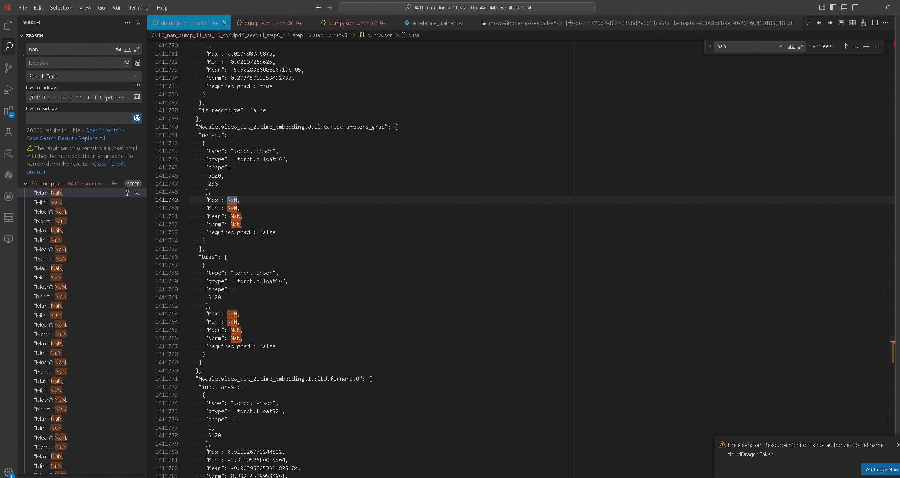
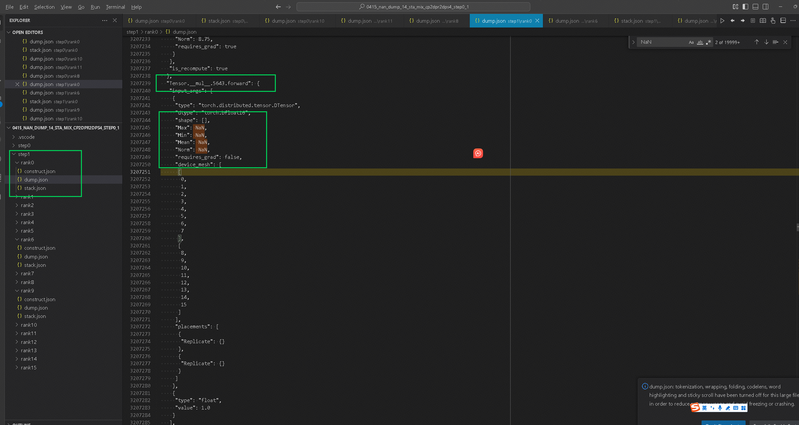
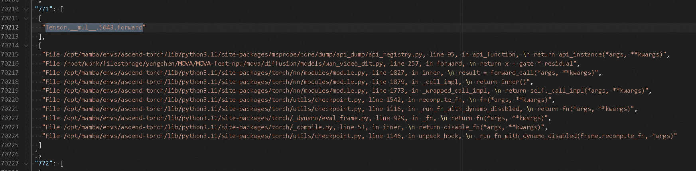
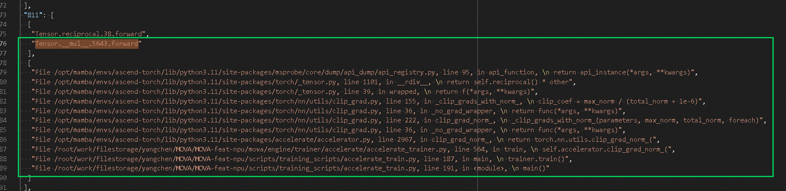
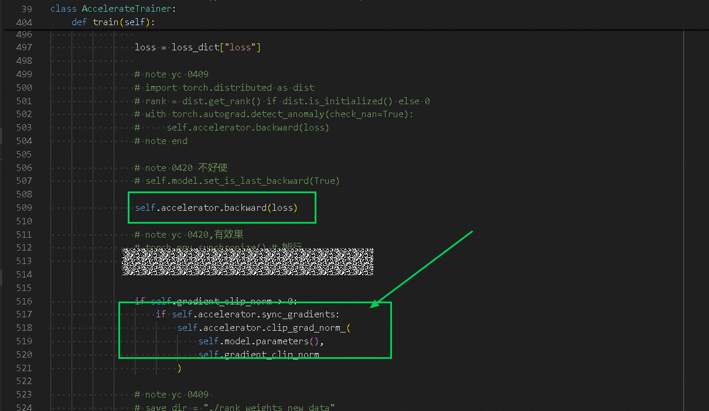
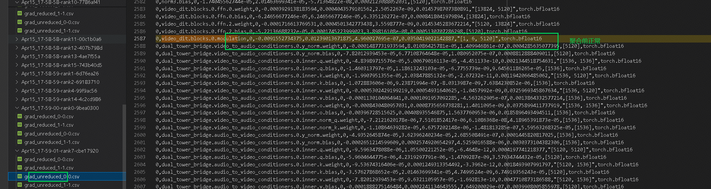
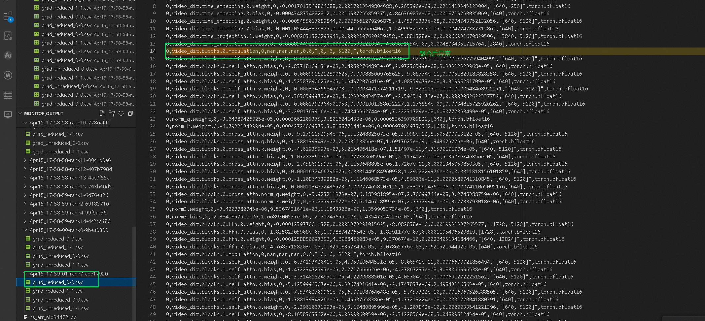
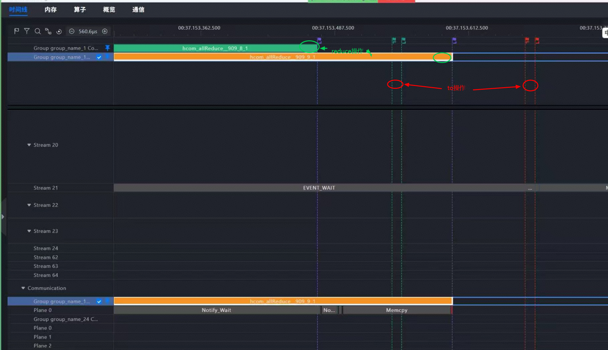
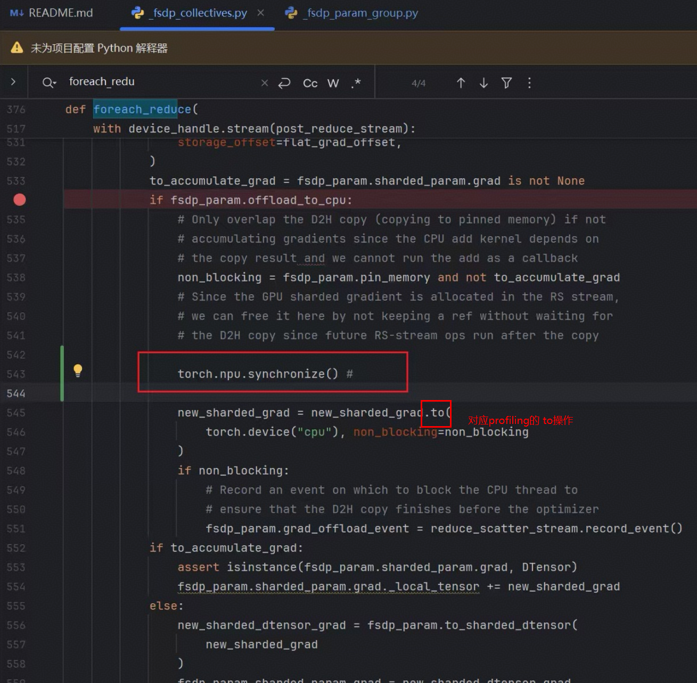

# 基于昇腾的MOVA模型NaN问题定位分析

# 问题背景

## 模型介绍


MOVA 使用的是**双向桥接模块**。从代码执行流程来看，整体是**先计算 video 分支，再计算 audio 分支，最后通过桥接模块进行通信与交互**。

# 定位方案

既然训练过程中出现了 `NaN`，整体定位思路比较明确：

1. 先通过 **msprobe 的 L0 dump** 做初步分析，快速确认 `NaN` 出现的大致阶段。
2. 再使用 **mix dump** 对可疑位置进行重点排查。
3. 由于 mix 采集耗时较长，为避免工具采集本身带来干扰，中间配合**手动打印权重、梯度和关键中间值**进行交叉验证。
4. 在定位到具体阶段后，再结合 **monitor** 和 **profiling** 工具进一步分析根因。

---

## L0 采集

L0 初步采集到的现象如下：



* 在 **step 1** 时，module 的前向和反向均未出现 `NaN`，但权重梯度优先出现nan
* 到了 **step 2** 时，module 前向使用到的权重也变为 `NaN`

因此，最初的关注点集中在：

> **step 1 的反向结束后权重更新过程中出现了问题，进而导致 step 2 前向计算出现 NaN**

当时的初步判断是：问题可能发生在 **step 1 的参数更新阶段**。

由于 mix dump 耗时较长，因此先通过**手动打印权重和权重梯度**来进行验证，以减少工具采集对结论的干扰。

---

## 手动打印验证

在将 DDP 域设置为 2 后，可以稳定复现问题。初期我们打印了权重和权重梯度，但由于**打印位置选择不够准确**，一度出现如下现象：

* 某些时刻看到**权重先出现异常**
* 但对应的**权重梯度仍然正常，没有 NaN**

这导致我们一度产生误判，因此又进一步通过**加载保存下来的权重进行验证**。

后续重新调整打印位置后，结果才逐渐趋于一致：

* 在 **DDP 域 1** 上会偶现少量梯度异常
* 异常随后会逐步传播到其他域

但这也导致了对结果一直存疑，无法断定（这块时期打印较多，没有截图与日志保存）

此时我们仍然只能得到一个初步猜测，尚无法完全确认异常链路，因此继续进行 **mix 采集**。

---

## mix 采集

### 全局搜索 NaN

在 mix dump 结果中，首先采用全局搜索 `NaN` 的方式进行定位。

前面 12 处 `NaN` 均出现在 `all_gather` 和 `reduce_scatter` 相关位置，其表现为：

* 输入为 `NaN`
* 输出正常

这部分暂时无须深入分析。原因是：

* 老版本工具会把这类算子采集出来
* 在 `all_gather` 和 `reduce_scatter` 调用前，会先通过 `empty` 创建一个初始值为 `NaN` 的 tensor
* 该 tensor 再传入通信算子中
* 这类 `empty` 相关算子会干扰判断

目前新工具已去掉这类无效干扰项，因此这部分可以先排除。

### 实际第1个 NaN



首 个 `NaN` 出现在：

```python
__mul__.5643.forward
```

该位置的现象为：

* input 已经出现 `NaN`
* output 也为 `NaN`

也就是说，这里的 `NaN` 并不是由当前乘法计算“新产生”的，更可能是**上游输入已经被污染**。

---

## 调用栈分析

继续查看 `__mul__.5643.forward` 的调用栈时，发现了一个问题：

> 在 `stack.json` 中，`__mul__.5643.forward` 重复出现了两次

对应两处调用位置分别是：

### 第一处



```python
return x + gate * residual
```

这一处调用栈中包含 `recompute_fn`，说明它属于**重计算路径**。

从语义上看，这里的输入应该是两个 tensor 相乘：

* `x`：主分支输出，shape 一般为 `[B, S, H]` 或 `[B, H]`
* `residual`：残差分支张量，shape 通常与 `x` 一致
* `gate`：门控系数，可能是：
  
  * 与 `residual` 同 shape 的张量
  * 或可广播到 `residual` 的张量

因此，这里的乘法输入通常应表现为 **tensor × tensor**。

---

### 第二处



```python
reciprocal() * other
```

这一处位于 `clip_grad_norm` 过程中，本质上是在计算 **clip 系数**。

结合代码逻辑可知：

* `reciprocal() * other` 对应的是梯度裁剪中的系数计算
* `clip_grad_norm` 涉及**通信操作**
* 且这一点能够与 `dump.json` 中的 `device_mesh` 信息对应上

而实际查看 `__mul__.5643.forward` 的输入时，发现它是：

> 一个 **2.7 的标量 × 1**

这与第一处 `gate * residual` 的预期输入形式并不一致。
因为如果是 `gate * residual`，通常应是 **tensor × tensor**，而不是标量乘法。

因此，我们最终判断：

> **第二处调用栈，即 `clip_grad_norm` 中的 `reciprocal() * other`，才是正确的问题位置**

为进一步排除重计算路径的干扰、方便确认结论，我们关闭了**重计算**并重新 dump，问题仍然可以稳定复现。

对应代码位置即 `loss.backward()` 之后：



---

## monitor 监控结果

随后我们使用 **monitor** 工具对关键参数进行进一步监控。

发现如下异常现象：

* 除了 **0 卡和 8 卡** 之外
* 其他卡在聚合后，`video_dit.block.0.modulation` 的 shape 从

```python
[1, 6, 5120]
```

变成了

```python
[0, 6, 5120]
```

同时其数值也变为了 `NaN`。





为了进一步确认，我们再次采用**手动打印**方式进行验证，得到的结论基本一致。

---

## 关键位置确认

通过手动打印可以明确看到：

> 在 **FSDP 的 post_backward 阶段**，`foreach_reduce` 前后，参数从正常常数值变成了 `NaN`

这意味着问题位置已经基本明确：

> **异常发生在 FSDP post_backward 附近，且与 foreach_reduce / 梯度归约阶段密切相关**

---

# 根因分析

在定位到异常点之后，下一步就是分析根因。

### 现象一：加同步后问题消失

我们在可疑位置添加同步后，问题消失，因此初步怀疑为：

> **流同步问题**

### 现象二：profiling 观察到通信与搬运时序异常



随后我们使用 **profiling** 工具观察算子执行时序，发现：

* 不同卡上的 `all_reduce` 并不是严格同步结束
* 执行 `.to()` 进行数据搬运的时机也不一致

虽然当时还不能完全排除 profiling 工具本身观测误差的可能性，但至少说明这一阶段存在明显的时序不确定性。

### 现象三：在 `.to()` 之前增加流同步后问题消失



进一步地，我们在调用栈中定位到 `.to()` 操作，并在其之前加入流同步。结果表明：

> **问题消失**

因此，最终可以基本确认该问题与以下因素相关：

* `accelerate` 开启 **offload**
* FSDP 训练过程中存在 **NPU 与 CPU 间的数据搬运**
* 某些场景下**流同步未正确完成**
* 导致后续使用到未完成搬运或未完成归约的数据，最终引发 `NaN`

---

## 结论

本次 MOVA 模型 `NaN` 问题的定位链路如下：

1. **L0 dump** 发现 `step 2` 前向权重已为 `NaN`
2. 初步怀疑为 `step 1` 权重更新过程异常
3. 通过**手动打印**修正观察位置后，发现异常在 DDP 域中传播
4. 使用 **mix dump** 定位到 `__mul__.5643.forward`
5. 结合调用栈分析，排除 `gate * residual` 路径，确认问题点位于：
   
   * `clip_grad_norm`
   * `reciprocal() * other`
6. 使用 **monitor** 观察到 `video_dit.block.0.modulation` 聚合后 shape 异常，数值变为 `NaN`
7. 手动打印确认问题发生在：
   
   * **FSDP post_backward**
   * **foreach_reduce 前后**
8. 最终通过加同步验证，确认根因与：
   
   * **offload 场景下的流同步问题**
   * **`.to()` 前后的数据搬运时序异常**
     密切相关

---

## 后续建议

1.重点检查 accelerate + FSDP +offload场景下的同步机制
2.若条件允许，可进一步对accelerate 封装链路进行源码级分析，确认offload场景下同步异常落点。

