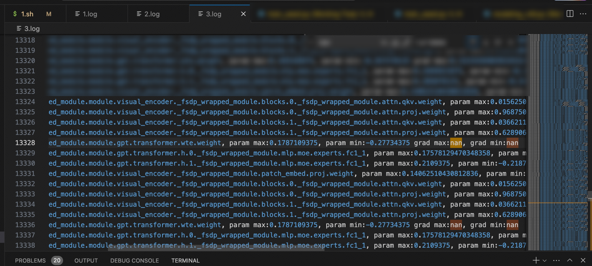
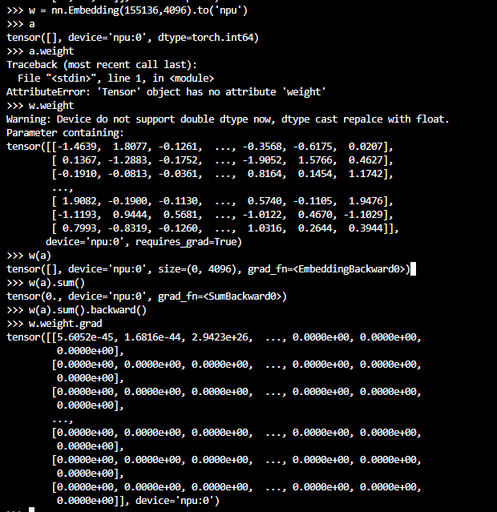

# 基于昇腾的多模态理解训练NaN问题定位

## 问题背景

在大模型微调训练中，Loss 出现 NaN 是常见故障，其根因往往隐藏在分布式并行特性与算子边界行为中。本文记录了一个多模态理解模型在 FSDP 全参微调时出现 Loss NaN 的问题定位过程，最终定位到 embedding 反向输入为空时返回未初始化数据的边界问题，并给出修复方案，为类似的梯度 NaN 排查提供参考。

## 问题现象

模型是多模态理解模型，FSDP 全参微调，出现 loss NaN。打印 grad 信息，首个 NaN 出现在 wte 层：

有如下实验尝试：

- 把 embedding 的 require grad 关掉的话，NaN 问题消失，说明大概率反向梯度更新问题。
- 开启 LAUNCH_BLOCKING=1 问题依旧，说明不是同步问题。

## 定位过程

### dump embedding tensor数据

发现 embed grad 出现 NaN 时，其中一个 rank 上的输入为空，shape: [0]，相应的反向输入 shape 为 [0, 4096]，输出疑似未初始化的内存。模型训练开启的 dsp（distributed sequence parallel）特性会对输入做切分，可能使某张卡上没有 token 输入。随机数据有几率复现：

aclnnEmbeddingDenseBackward 输入为空时，返回值会是默认内存中的值，因为空 tensor 不做任何处理。

### 修改aclnnEmbeddingDenseBackward逻辑

反向如果输入为空，则返回 0 的梯度，重新出包、验证。修改后，反向输出为 0。

## 问题根因

embedding 反向输入为空时，返回了未初始化的数据。

## 问题结论

多模态理解模型在 FSDP 全参微调时出现 Loss NaN 的根因是：开启 dsp（distributed sequence parallel）特性后，部分卡上没有 token 输入，embedding 反向输入为空，aclnnEmbeddingDenseBackward 返回了默认内存中的未初始化数据。

## 解决方案

修改 aclnnEmbeddingDenseBackward 逻辑：反向输入为空时返回 0 梯度，重新出包、验证后反向输出为 0。

