# 基于昇腾的Qwen2.5-omni模型确定性排查

## 问题背景

在深度学习训练中，结果的可复现性（确定性）直接关系到问题定位与实验的可信度。本文记录了在昇腾平台上，Qwen2.5-omni 模型重复训练时 loss 与 grad_norm 不一致的排查过程。通过 Dump 比对、单算子复现与 PLOG 分析等手段逐层收敛，最终定位到业务代码中随机种子重复设置导致确定性失效的问题，为类似的复现性问题提供了排查思路。

## 问题现象

在 NPU 上对 Qwen2.5-omni 模型进行重复训练时，得到的 loss 与 grad_norm 不一致。

## 定位过程

### 步骤 1：dump 两次数据进行比对

比对发现 cross_entropy 存在确定性问题。

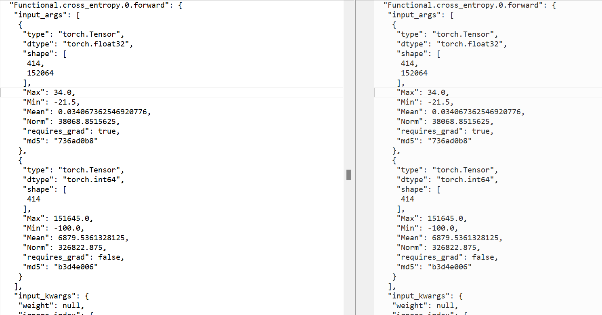

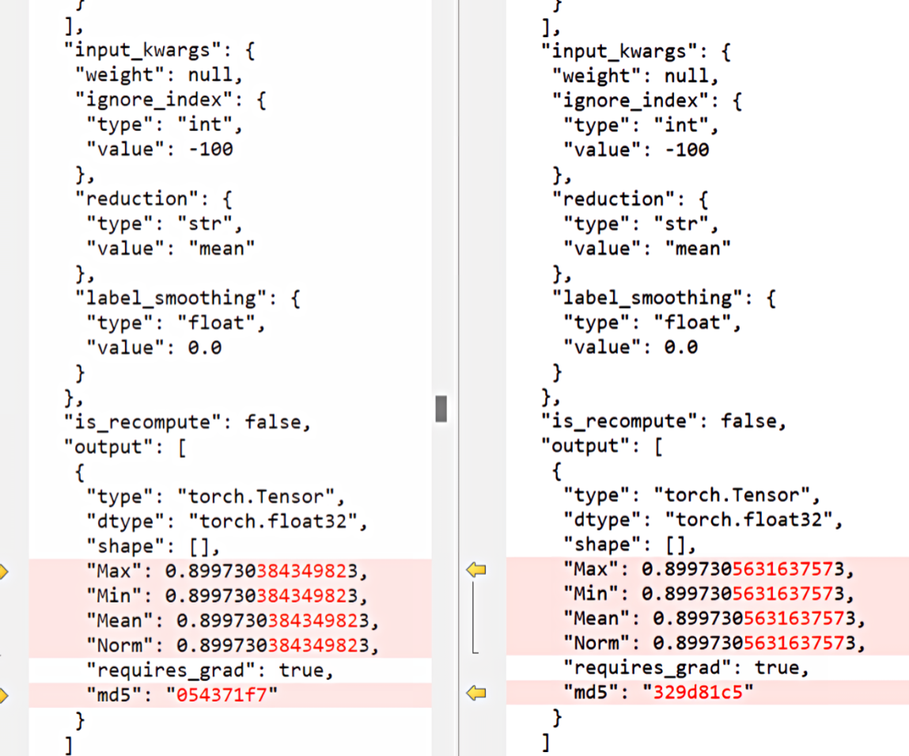

尝试通过 to cpu 后进行对齐。to cpu 后第一步 loss 一致，grad_norm 仍偶现不一致，且经过几步后会累积到 loss 不一致。

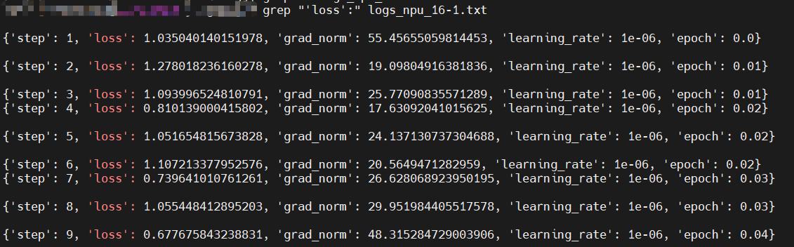

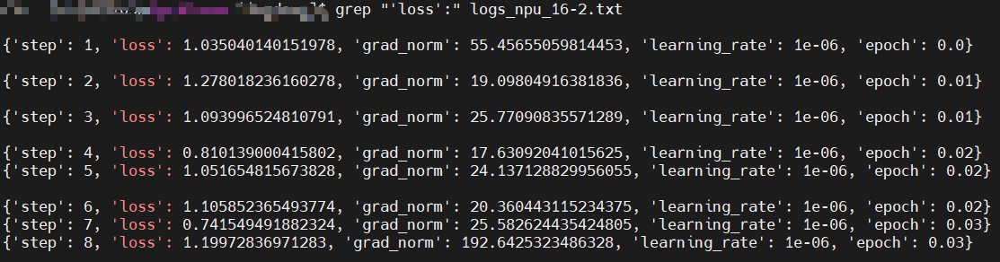

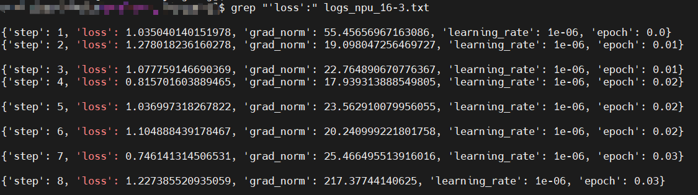

继续分析发现 grad_norm 差异来源：grad_norm 差异来源为第 0 步 rank3 上的 embed_token 反向存在偶现的差异，前向完全一致。

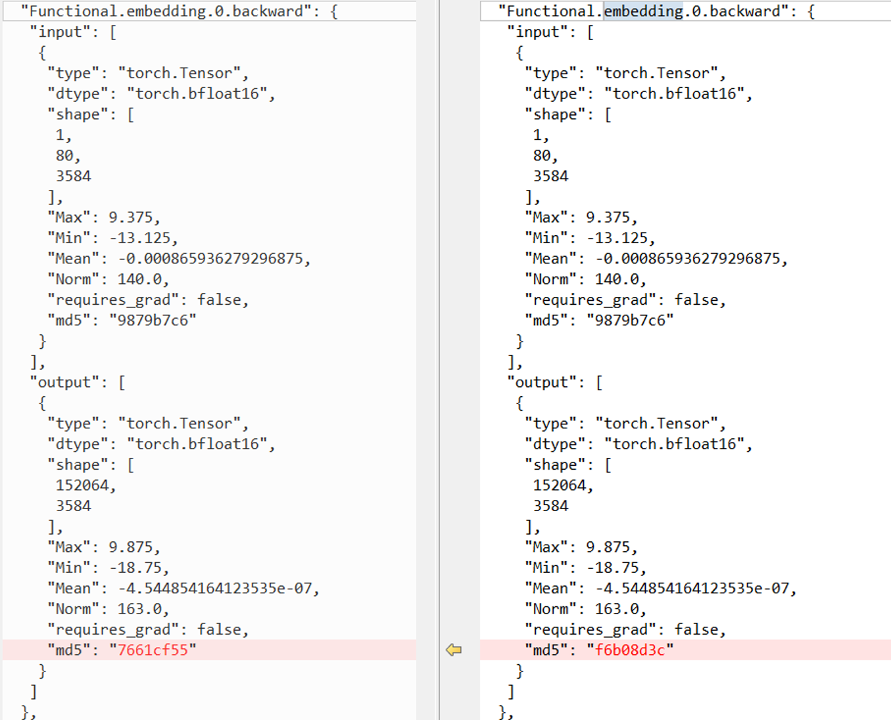

### 步骤 2：多次采集 embed_token 的 tensor 数据，直到采集到 2 次不一样的

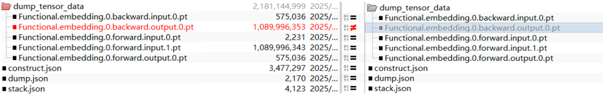

### 步骤 3：进行单算子复现

复现脚本：

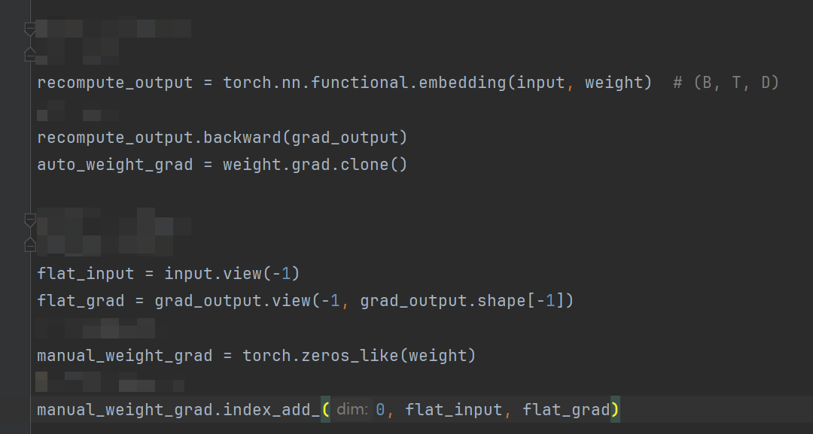

单算子结果：单算子复现和整网训练的结果不一致。整网跑几遍 embedding backward 结果概率性有变化，本地单算子重复跑很多遍都没有变化。整网采集的 2 次结果中，1 次跟单算子的自动 backward 一致，1 次跟单算子的手动算梯度一致。

### 步骤 4：怀疑存在其他干扰，排查 plog

plog 中底层 aclnn 算子 deterministic 为 0，中途操作部分为 1 部分为 0，确认为中途 1 改 0。

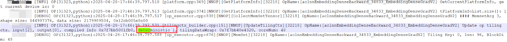

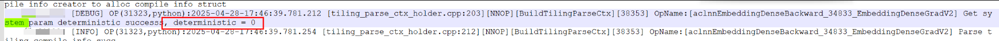

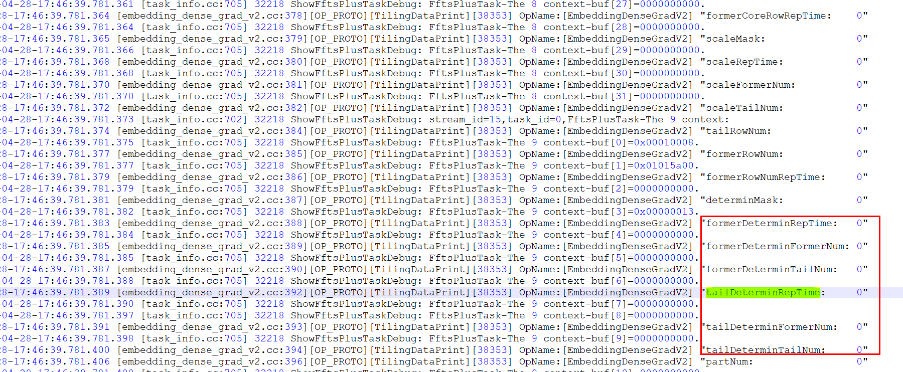

### 步骤 5：检查固定的代码

项目中全局搜索 torch.use_deterministic_algorithms，只有这一个地方用到。

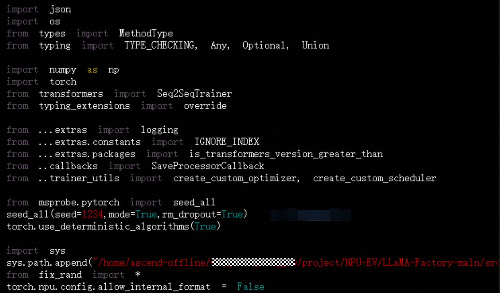

发现第 40 行有一个 fix_rand。点开看到，除了 trainer 中的 seed_all(mode=True) 外，业务代码中自定义了 fix_randn 对 randn 接口进行了装饰 wrap，该 wrap 内重复进行了 seed_all() 且没带 mode。

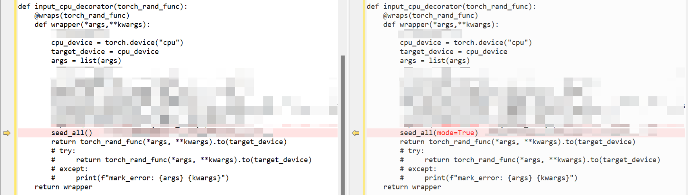

修改为 seed_all(mode=True) 后，确定性固定成功。

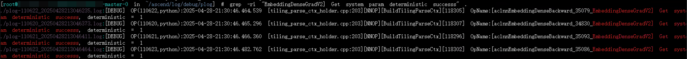

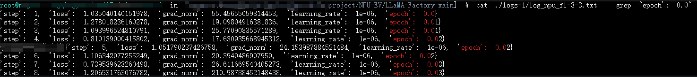

## 问题根因

业务代码中自定义了 fix_randn，对 randn 接口进行了装饰 wrap，该 wrap 内重复进行了 seed_all() 且没带 mode，覆盖了环境变量，导致确定性无法固定。

## 问题结论

1. 本次 Qwen2.5‑omni 训练 loss、grad_norm 复现失败，**并非昇腾算子本身非确定性缺陷**，而是上层业务代码逻辑破坏确定性开关状态引发的偶现问题。
2. `seed_all()` 不传 `mode=True` 时，不会开启 PyTorch 确定性算法开关 `torch.use_deterministic_algorithms(True)`；业务装饰器 `fix_randn` 在运行过程中反复调用无参 `seed_all()`，会将已经置为 True 的确定性开关重置为 False，传导到底层 CANN，使得 aclnn 算子 deterministic 标识由 1 变为 0，算子切换到非确定路径执行。

## 解决方案

上层业务代码修改 `fix_randn` 装饰器内部调用，将 `seed_all()` 修改为 `seed_all(mode=True)`，保证每次设置随机种子时，同步维持 `torch.use_deterministic_algorithms(True)` 确定性开关处于打开状态，避免开关被意外重置。