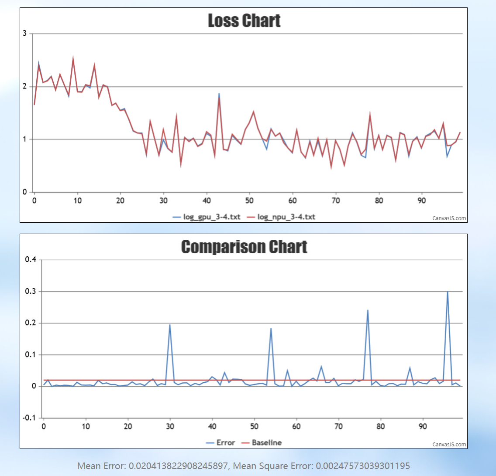
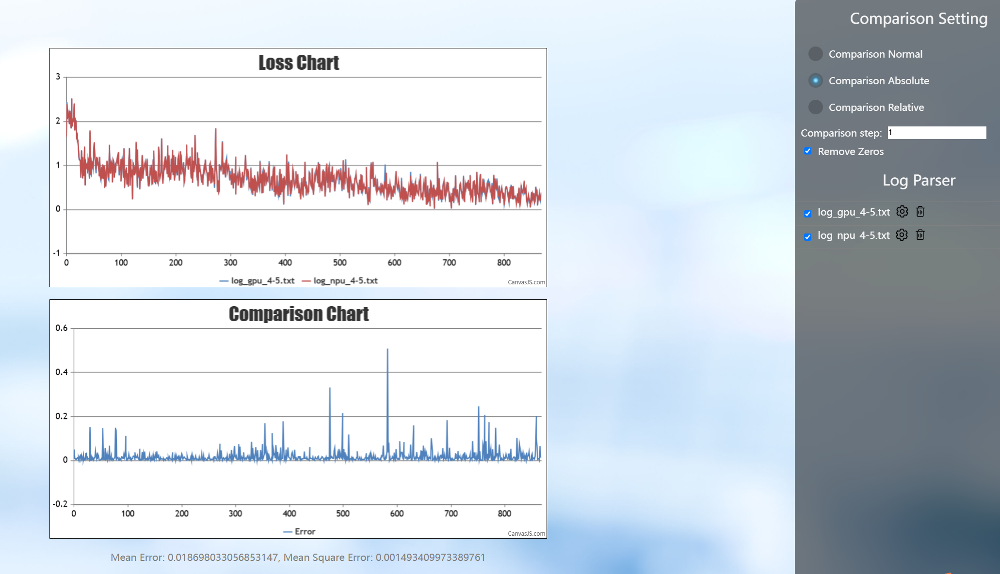
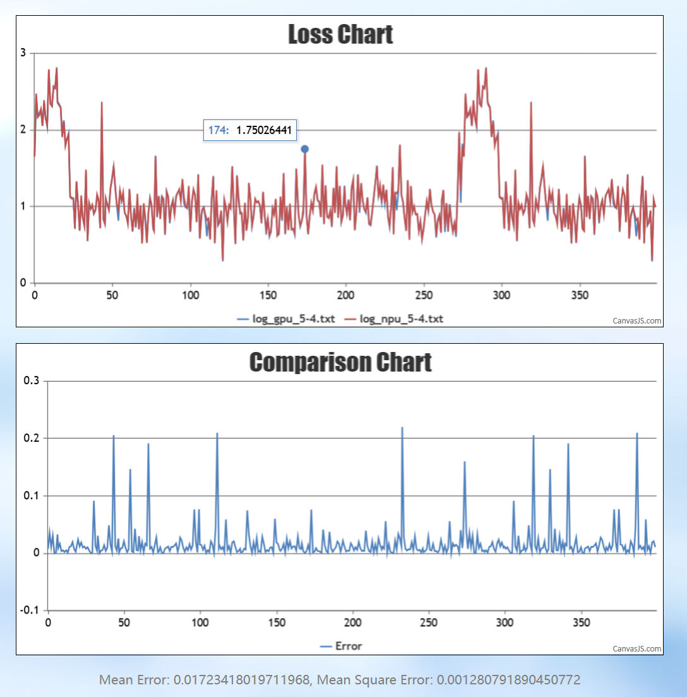
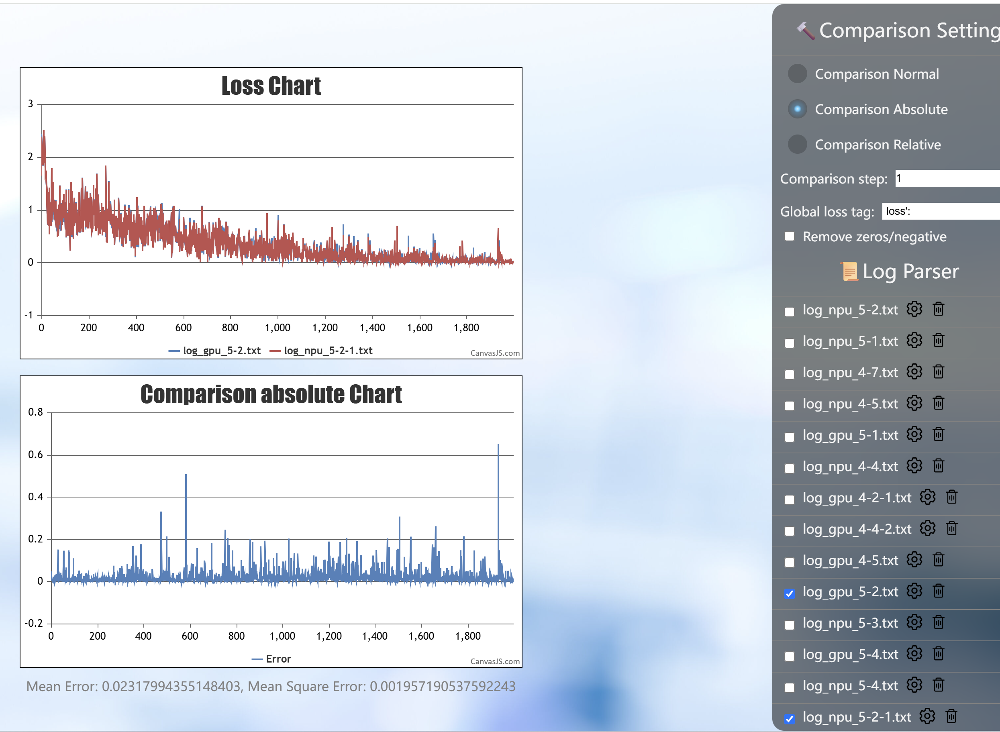
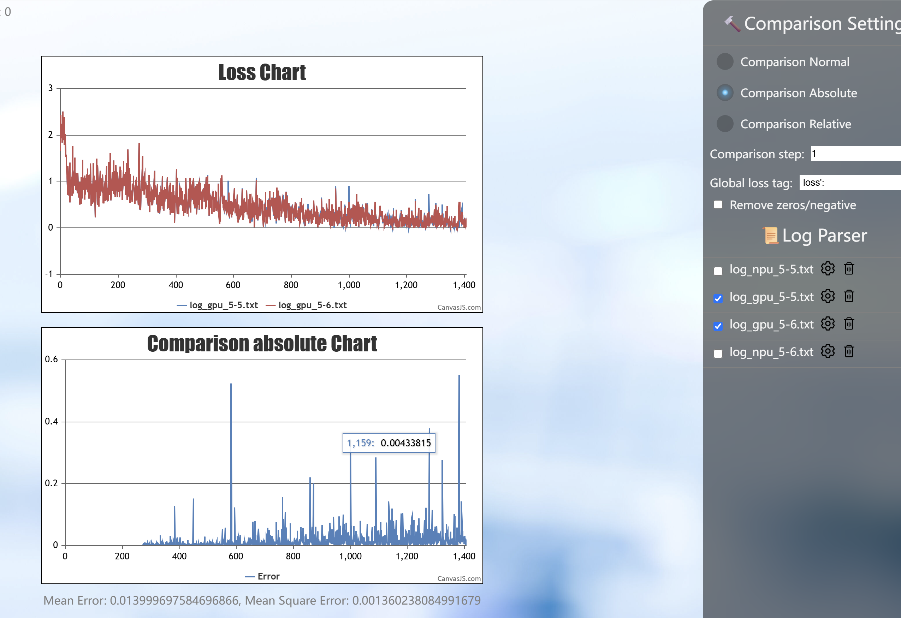

# 基于昇腾的Qwen2.5-omni框架迁移Loss差异定位

## 背景概述

将基于 LLaMA-Factory 框架的 Qwen2.5-omni 训练服务从 GPU 迁移到昇腾平台时，会遇到相同框架下 Loss 对不齐、训练结果存在误差的问题。此类跨平台精度差异直接影响模型迁移后的效果评估。本文记录了该问题的系统排查过程：通过逐步排除 layernorm、gelu、学习率等因素，最终确认是网络对细微累积误差敏感所致，而非昇腾软件栈问题，为同类框架迁移的精度对齐排查提供参考。

## 问题现象

同一 LLaMA-Factory 框架从 GPU 迁移到 NPU 训练，训练一定步数后相对误差明显。

## 定位过程

首 Loss 差异在千分位，但整体相对误差明显偏大，绝对误差也未达预期（希望绝对误差收敛到较小范围）。

第 0 步看到在 layerNorm、linear、gelu 三处出现了统计值差异从无到有的现象。

**背景**：已固定确定性，并关闭 linear 错峰策略。

**尝试1**：layerNorm、gelu 都转到 CPU → 无改善，基本无变化。

**尝试2**：关闭学习率，判断前向还是反向问题更大 → 前向问题偏大；相同权重下对数据较敏感。

**尝试3**：查看下游任务 → 训练的是基模，暂无下游任务。

**尝试4**：长跑更多步数，观察绝对误差是否有收敛趋势 → 与之前基本持平。

**尝试5**：把 gelu 和 norm 转移到 CPU 后 dump，继续查看除 linear 之外的其他差异 → 基本保持一致。

**尝试6**：GPU 侧关闭确定性，看 Loss 曲线差异有多大；若 GPU 关闭确定性差异也超出阈值，则需重新评估判定标准 → 无确定性问题。

其中尝试 5 中观测到一个现象：GPU 的 layerNorm 转 CPU 后差异同样超出阈值。

## 问题根因及总结

**结论**：非昇腾软件栈问题。

1. GPU 的 layerNorm 转 CPU 后作为绝对标杆，Loss 差异依然存在且超出阈值，说明网络对细微的累积误差比较敏感（来自尝试 5）。
2. NPU 和 GPU 学习率置为 0 之后，权重不更新，随着不同输入的数据，Loss 差异波动也较大，说明网络对输入也比较敏感（来自尝试 2）。
3. GPU 和 NPU 的 Loss 差异有上有下，并不是 GPU 的 Loss 整体比 NPU 小；若不看绝对误差、看带正负的归一化误差，差异在一个很小的量级，说明均线在同一水平（来自较长步数的长跑结果）。
