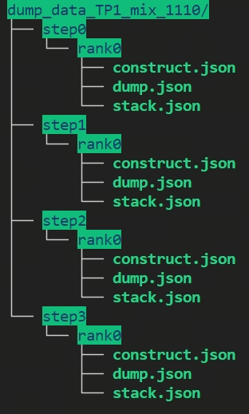
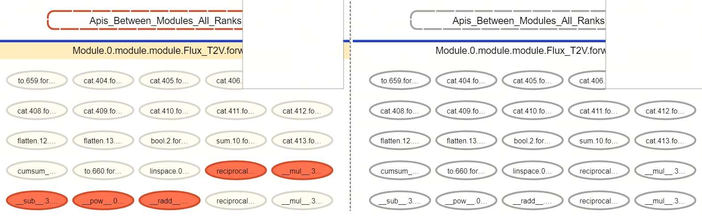
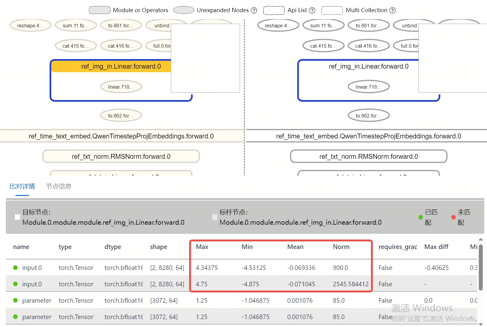
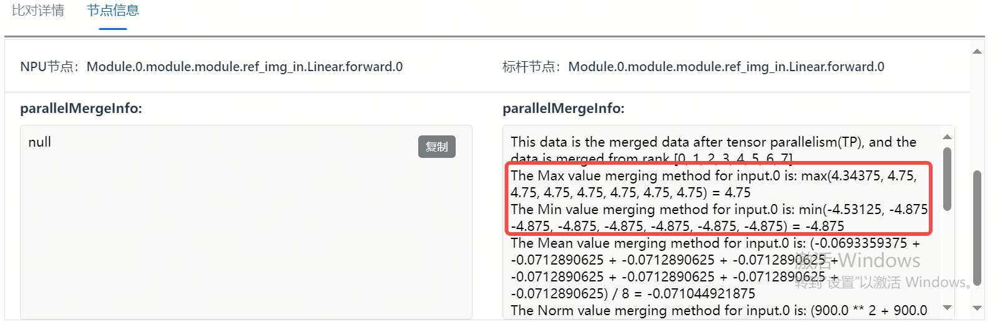
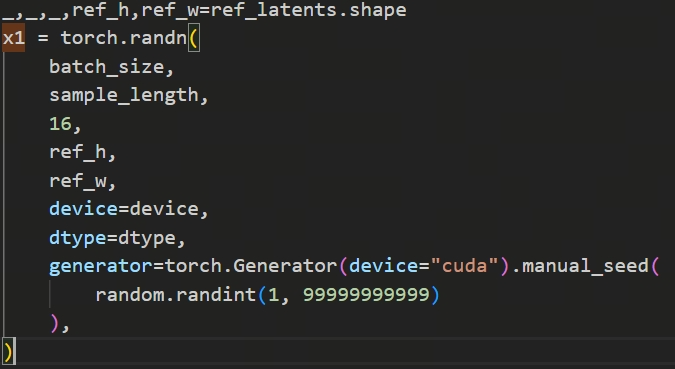

# 基于昇腾的Qwen-Image-Edit模型TP8花图问题定位

## 背景概述

在昇腾平台上，基于 Megatron 对 Qwen-Image-Edit 图像编辑模型进行多卡并行适配并用于数据合成时，使用张量并行（TP）推理会在并行度较高的情况下出现生成图片异常（俗称"花图"）的阻塞问题。本文记录了该问题的完整定位过程：通过 msprobe 分级可视化比对单卡与多卡的算子精度差异，最终定位到根因是并行组内随机种子不一致，并给出同步广播的修复方案，为同类多卡推理精度差异问题提供排查思路。

## 问题现象

基于 Megatron 在 NPU 上适配 Qwen-Image-Edit 模型，主要用于数据合成、作为后续其他模型的训练输入。当前遇到如下阻塞问题：

1. 在 TP=8 时，跑多个请求时，第 3 张生成的图片必然花图。
2. 在 TP=1 时，低分辨率推理跑 100 个实例未发现花图问题。

## 定位过程

根据现象，NPU 上不同配置导致出现问题，故优先在 NPU 上对 TP1 和 TP8 进行对比，定位模型的精度差异原因。使用的工具为 msprobe（MindStudio 工具链下精度调试部分的工具包，主要包括精度采集、精度比对和可视化分析等功能，目前适配 [PyTorch](https://gitee.com/link?target=https%3A%2F%2Fpytorch.org%2F) 和 [MindSpore](https://gitee.com/link?target=https%3A%2F%2Fwww.mindspore.cn%2F) 框架）。

问题定位流程如下：数据采集 → 分级可视化构图对比 → 代码定位及解决方案

### 步骤1：采集 TP1 和 TP8 数据

msprobe 工具主要通过在训练推理脚本内添加 dump 接口，具体使用函数 PrecisionDebugger 进行数据采集。训练结束后，工具将 dump 的数据保存在 dump_path 指定的目录下，目录结构如下：



### 步骤2：分级可视化切分合并比对

分级可视化构图支持不同切分配置的数据对比，因此使用如下命令进行 TP8 与 TP1 的数据比对：

```bash
msprobe graph_visualize -tp tp8_data -gp tp1_data -o output_path
```

执行过程视模型大小而不同，较大规模模型构图约需数分钟，结束后会在 output 文件夹下生成 XXX.vis.db 的文件，之后使用 tensorboard 进行可视化对比：

```bash
tensorboard --logdir out_path --bind_all --port [可选，端口号]
```



在上图可以看到，Module.0.module.module.Flux_T2V.forward 内包含整个 nn 部分的所有 module（长方形边框），其采用分级结构进行展示，一级 module 中存在多个二级 module，同时多个二级 module 之间的 API 也以椭圆形边框进行展示。可以看到第一个 nn.Module（Linear）就出现了精度不一致的问题，故开始查看 Linear 的对比详情。



经过对比发现，Linear 的输入数据中，多个统计值都不同，说明数据在进入第一个 module 前就是不同的。因为两个数据文件涉及单卡和多卡对比，所以需要进一步查看节点信息来分析具体是哪张卡出现了异常。



因为多卡配置是 TP=8，没有使用 DP 进行数据切分，且该层为非行切、列切层，从 shape 处可以看到为未进行 TP 切分的原始结构，多卡间的统计值应该完全相同。如图红色框图可以发现，这里卡 0 的数据明显与其他卡不同。

### 步骤3：代码回溯

下一步需要回到代码，分析送给第一个 module 的数据传输轨迹。



该场景为基于 Diffusion 的图像生成模型，在模型初始阶段需要生成随机数。经过分析后定位到这里的 random.randint 在卡 0 上的表现与其他卡不同。预期在同一个 step 内所有卡的随机种子相同，而实际卡 0 与卡 1~7 不同，导致后续模型输出不同，最后拼接为完整图片后，出现了花图问题。

## 修复与根因

**修复方案**：

建议在这里增加同步广播机制，即随机种子生成后，由主卡广播到副卡进行同步，确保所有卡拿到的随机种子相同。

**结果验证**：

经过长稳测试后，图像生成正常，无花图现象。问题根因在于并行场景下随机种子未同步的代码缺陷，修复代码后长稳测试未再出现花图现象。

**根因总结**：

使用 TP8 时，未控制统一 TP 组内的不同卡输入一致，单纯依赖初始随机种子来控制。实际上 0 卡由于作为通信主卡 random 的次数与其他 TP 卡的次数并不一致，导致花图。
