# 基于昇腾的tora模型推理差异定位

## 问题背景

**模型结构：** tora模型+vllm（vllm-ascend）推理框架

**问题表现：** 统一数据集推理，下游评分NPU（54.4分）明显差于GPU（80.6分）
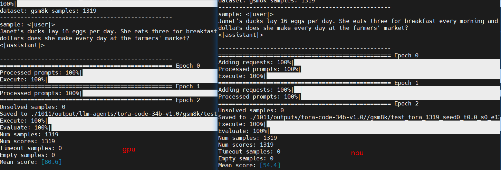
**BadCase详情**：

prompt：
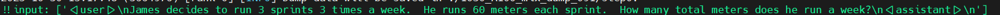
GPU推理结果为540（正确答案）：

NPU推理结果为1260（错误答案）：


## 定位过程

### 步骤1：排查环境差异

排查版本发现GPU与NPU存在较大差异：

* GPU vllm版本为0.1.4（较老）且使用图模式，mode为V0
* NPU vllm及vllm-ascend版本为0.9.1且使用enforce_eager=True，mode为V0

由于GPU版本较老，优先升级0.8.1版本且使用enforce_eager=True开启单算子模式，即与NPU对齐

发现GPU改为0.9.1版本+单算子模式下也存在badcase的回答错误：
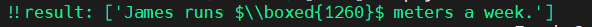
单case评测（0.1.4版本评分100，0.9.1版本评分0）：
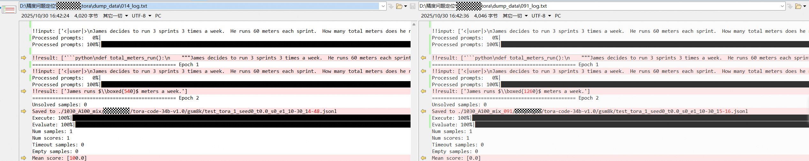

因此，GPU与NPU的差异此刻被缩小范围为VLLM版本的差异

### 步骤2：详细比对

由于步骤1范围缩小，可直接在同一台GPU机器上采集不同版本的VLLM数据进行比对

#### 差异点1

采集数据后首先两个版本输入shape不一致，014会对input_token做pad，pad成8的整数倍（不止是prefill，后续每次decode也会pad成8）
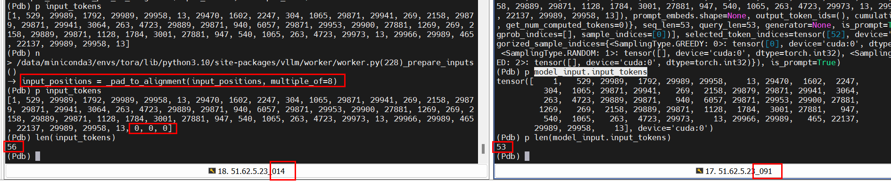

#### 差异点2

014 load embedding weight（32064,8192）时后（32000：，：）填充的是随机值（可能有极大值和nan），而091填充的是0
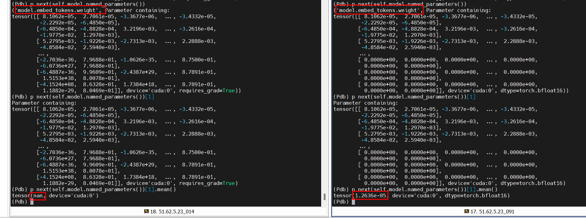
014的未知权重初始化：
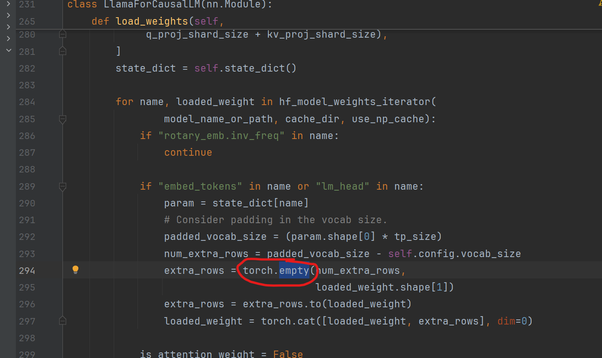

以上两个问题会导致DUMP数据比对统计值时受到shape以及随机值的影响，无法直接进行比对

应对策略：先把014的pad注释掉并把empty改为zeros，保证两边一致可比

此处发现以上操作并不对评测结果造成影响，014仍精度达标，可明确以上2个问题并不是根因

#### 差异点3

对齐差异点1、2的pad和empty操作后，可进入真正的数据比对

比对时发现rotary+attention的输出存在差异，输入采集局部缺失，但该模块前上一模块输出一致，因此深入该模块进行排查
014 Attention：

```
qkv, _ = self.qkv_proj(hidden_states)
q, k, v = qkv.split([self.q_size, self.kv_size, self.kv_size], dim=-1)
k_cache, v_cache = kv_cache
attn_output = self.attn(positions, q, k, v, k_cache, v_cache, input_metadata, cache_event)  # PagedAttentionWithRoPE
    pos_encoding_ops.rotary_embedding_neox(
            positions,
            query,
            key,
            self.head_size,
            self.cos_sin_cache,
    )
    super().forward()  
        query = query.view(-1, self.num_heads, self.head_size)
        key = key.view(-1, self.num_kv_heads, self.head_size)
        value = value.view(-1, self.num_kv_heads, self.head_size)
        # multi_query_kv_attention
        key = torch.repeat_interleave(key, self.num_queries_per_kv, dim=1)
        value = torch.repeat_interleave(value, self.num_queries_per_kv, dim=1)
        out = xops.memory_efficient_attention_forward(
                query.unsqueeze(0),
                key.unsqueeze(0),
                value.unsqueeze(0),
                attn_bias=input_metadata.attn_bias[0],
                p=0.0,
                scale=self.scale,
                op=self.attn_op,
            )
        output.copy_(out.squeeze(0))
output, _ = self.o_proj(attn_output)

```

091 Attention：

```
qkv, _ = self.qkv_proj(hidden_states)
q, k, v = qkv.split([self.q_size, self.kv_size, self.kv_size], dim=-1)
q, k = self.rotary_emb(positions, q, k)  # self_attn.rotary_emb.RotaryEmbedding.forward
    torch.ops._C.rotary_embedding
attn_output = self.attn(q, k, v)  # Attention
    torch.ops._C_cache_ops.reshape_and_cache_flash(
            key,
            value,
            kv_cache[0],
            kv_cache[1],
            updated_slot_mapping.flatten(),  # type: ignore[union-attr]
            kv_cache_dtype,
            layer._k_scale,
            layer._v_scale,
        )
    flash_attn_varlen_func(  # 直接调用的torch.ops._vllm_fa2_C.varlen_fwd或torch.ops._vllm_fa3_C.fwd
            q=query,
            k=key,
            v=value,
            cu_seqlens_q=q_seq_start_loc,
            cu_seqlens_k=k_seq_start_loc,
            max_seqlen_q=q_seq_len,
            max_seqlen_k=k_seq_len,
            softmax_scale=softmax_scale,
            causal=_get_causal_option(attn_type),
            window_size=window_size,
            alibi_slopes=alibi_slopes,
            softcap=logits_soft_cap,
            out=prefill_output,
            fa_version=self.vllm_flash_attn_version,
            q_descale=layer._q_scale.expand(descale_shape),
            k_descale=layer._k_scale.expand(descale_shape),
            v_descale=layer._v_scale.expand(descale_shape),
        )
output, _ = self.o_proj(attn_output)
output, _ = self.o_proj(attn_output)
```

* 091进入Attention外的torch.ops._C.rotary_embedding
* 014进入PagedAttentionWithRoPE内的 pos_encoding_ops.rotary_embedding_neox

左014，右091：
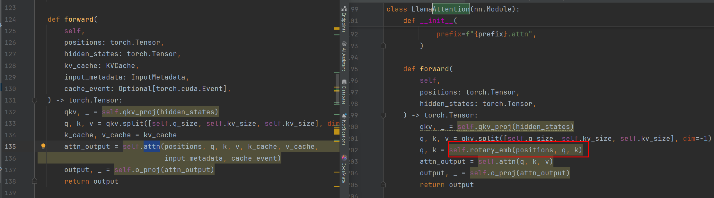
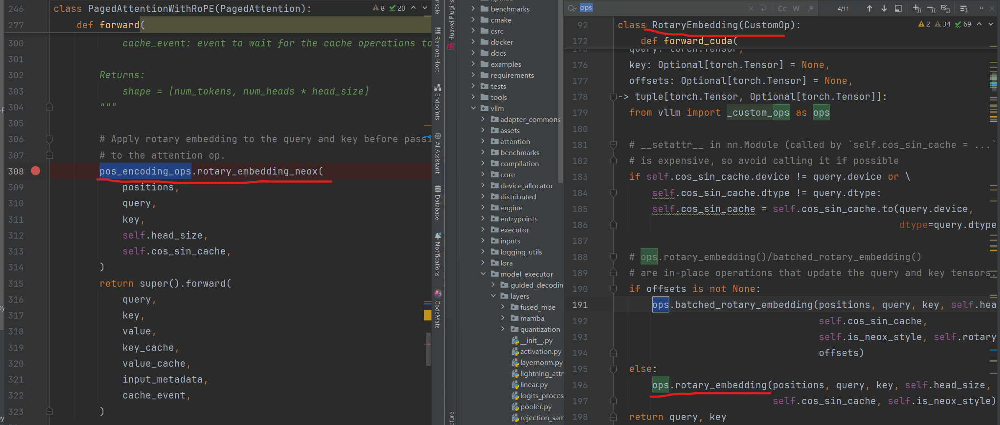

**输入进行手动打印：**

qk一致
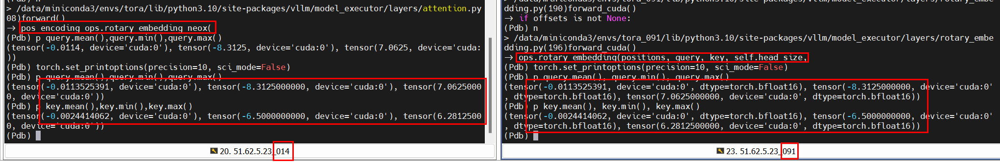
cos_sin_cache不一致
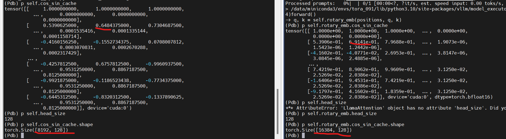
输出不一致：
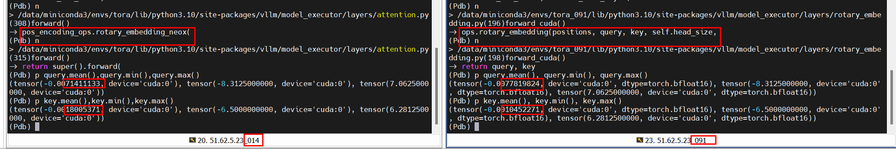

查看cos_sin_cache生成时，有个max_position_embeddings参数指定长度，014是默认的8192，091外层传入了16384

014使用默认max_position，值为8192：

```
inv_freq = 1.0 / (base**(torch.arange(0, rotary_dim, 2) / rotary_dim))
t = torch.arange(max_position).float()
freqs = torch.einsum("i,j -> ij", t, inv_freq.float())
cos = freqs.cos()
sin = freqs.sin()
cache = torch.cat((cos, sin), dim=-1)
```

091使用外部传入self.base和self.max_position_embeddings配置

```
inv_freq = 1.0 / (self.base**(torch.arange(0, self.rotary_dim, 2, dtype=torch.float) / self.rotary_dim))
t = torch.arange(self.max_position_embeddings, dtype=torch.float)
freqs = torch.einsum("i,j -> ij", t, inv_freq)
cos = freqs.cos()
sin = freqs.sin()
cache = torch.cat((cos, sin), dim=-1)
```

发现max_position_embedding值与base值在两个版本上存在差异

## 修复与根因

**修复方案：**

在模型文件中，将hf config.json如下属性做改动：

* hf config.json中max_position_embedding的值16384改为8192
* hf config.json中rope_theta 的值1000000改为10000
  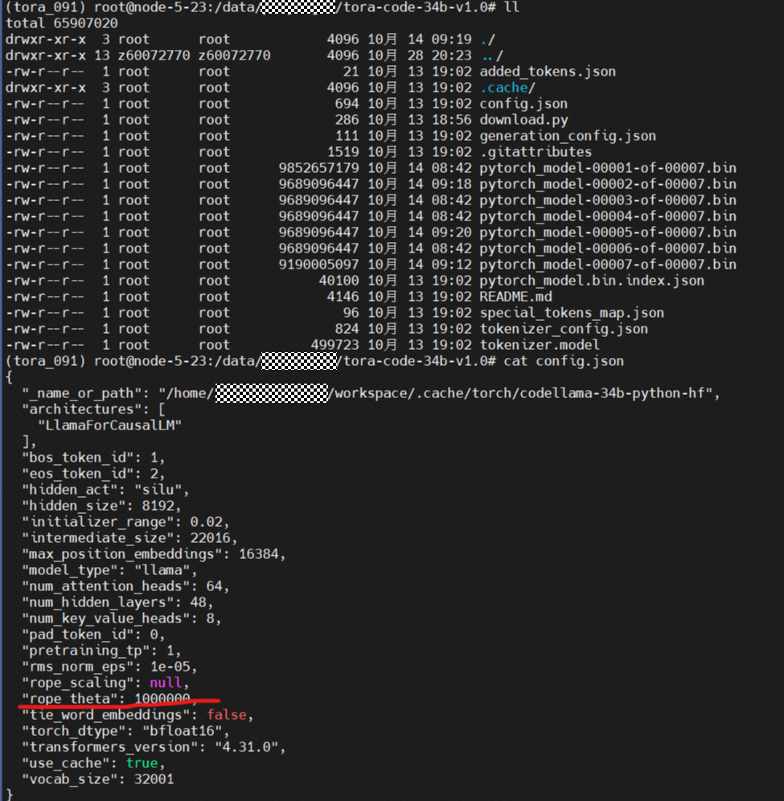

**结果验证：**

改动配置后，GPU 091版本的评测精度达标：
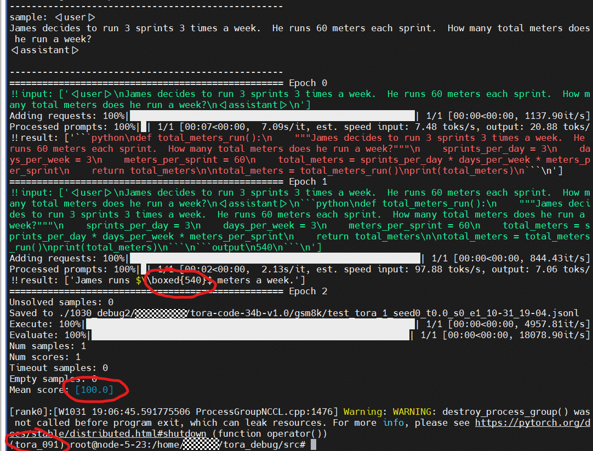
NPU做badcase验证，精度达标：
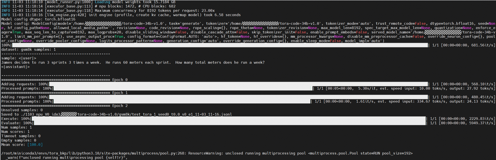

全量数据集评分达标
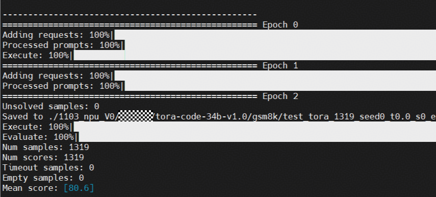

**根因总结：**

计算`rotary_embdding`的初始化`cos_sin_cache`时，存在差异，导致`rotary_embdding output`不一致：

* `max_position_embeddings`差异，`014`为`8192`（没传入，默认`8192`），`091`为`16384`（根据hf model路径中的`max_position_embedding`自动赋值）
* `base`差异，`014`为`10000`（没传入，默认`10000`）， `091`是`100000`（根据hf model路径中的`rope_theta`自动赋值）

