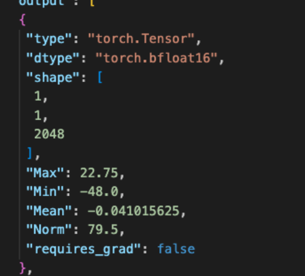
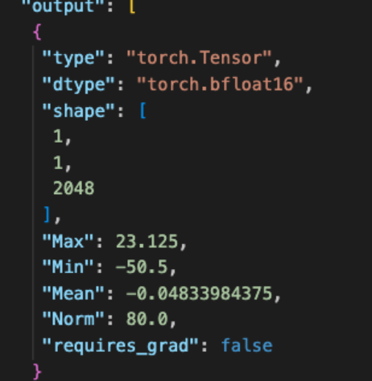
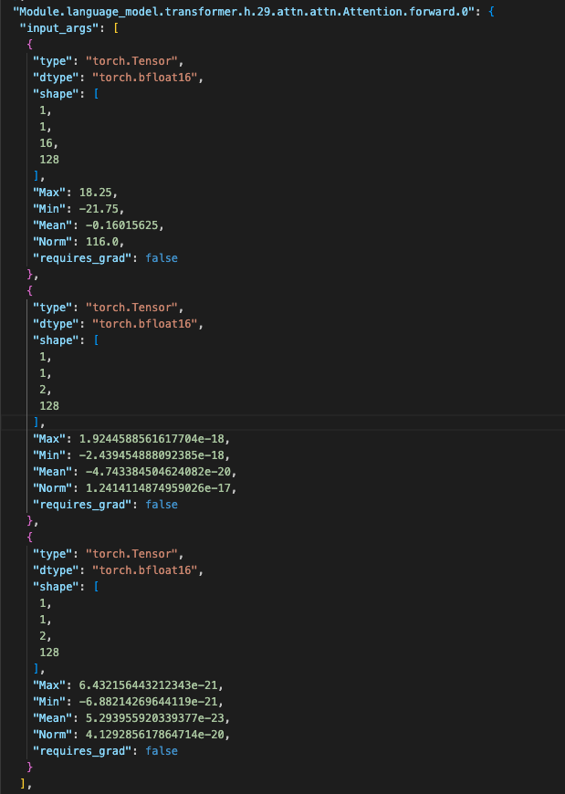
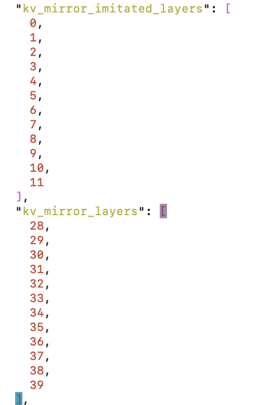

# 基于昇腾的VL模型迁移vLLM精度问题

## 问题背景

在视觉语言（VL）模型迁移到昇腾 vLLM 推理平台时，推理结果与参照平台的精度对齐是决定迁移是否成功的关键。某 VL 模型从 transformers 推理框架迁移到昇腾 vLLM 后，发现从第 7 个 token 起推理结果与参照输出对不上，且后续出现乱码。本文记录了通过逐层对比定位到 Attention 模块迁移缺失问题的过程，为类似模型迁移提供参考。

## 问题现象

VL 模型从 H20 + transformers 推理框架迁移到昇腾 + vLLM 推理框架之后，发现从第 7 个 token 开始 NPU 的推理结果与 GPU 对应不上，且后面还出现乱码。

## 定位过程

### 精度对齐思路

| 确认项                          | 确认结果                                                                                                                      |
| --------------------------------- | ------------------------------------------------------------------------------------------------------------------------------- |
| transformers 版本排查            | NPU 的 transformers 版本与 GPU 的版本不同；NPU 上的 vLLM 版本要求 transformers 必须大于指定版本，无法降低 NPU 侧版本                      |
| 旋转位置编码误差                | 经过旋转位置编码后余弦相似度接近 1，优先级低                                                          |
| sliding_window 确认             | 确认没有使用该特性                                                                                                            |
| decode_layer 对比（Att 和 mlp）   | 各层余弦相似度均接近 1，msprobe 的统计信息找不到差异，需要再采集 tensor； |
| GPU 和 NPU 的模型配置对比          | 确认一致                                                                                                                      |
| NPU + transformers 的推理和 GPU 对比 | 优先级低                                                                                                                      |
| NPU 两卡使用 H20 的 input_embeds   | 结果会变好，不会出现乱码，但内容和 H20 还是有差距                                                                             |

### 正向定位：从第 7 个字符的 logits 往前看

进一步分析 step6 GPU 和 NPU 侧的数据，发现在 `Module.language_model.transformer.h.29.DecoderLayer.forward.0` 的输出 GPU 和 NPU 的差异较大。

GPU 的输出：

NPU 的输出：

往前找，进一步分析 NPU 的 `Module.language_model.transformer.h.29.attn.attn.Attention.forward.0` 中 k 和 v 的值非常小：由于 GPU 侧没有 Attention 模块，NPU 侧看 28 层也是同样的问题，而 27 层及以前是正常的。

对应看模型配置文件，其中有以下配置，该配置主要在 `KVMirrorManagerHook` 和 `KVMirrorManager` 中使用，而这两个模块没有移植到 vLLM 的模型上，导致上面的差异。这两个函数的作用是在 `kv_mirror_imitated_layers` 保存 key_states 和 value_states，而在 `kv_mirror_layers` 则取对应的 key_states 和 value_states。由于在 `kv_mirror_layers` 对应的 layer 上 K 和 V 的 parameter 值非常小，如果不做这个处理，key_states 和 value_states 的值也会非常小，最终导致给到 attention 计算的 key_states 和 value_states 是异常小的值。

## 问题根因

在模型移植时，Attention 模块的 `KVMirrorManagerHook` 和 `KVMirrorManager` 没有移植，导致在 28 层以后得到的 K 和 V 的值异常，与 GPU 无法对齐。

## 问题结论

VL 模型从第 7 个 token 起推理结果与 GPU 对不上、后续出现乱码的根因是：模型迁移到昇腾 vLLM 后，`KVMirrorManagerHook` 和 `KVMirrorManager` 两个模块未随模型移植，`kv_mirror_imitated_layers` 层保存的 key_states、value_states 在 `kv_mirror_layers` 层无法正常取用，导致 28 层以后 K 和 V 的值异常。

## 解决方案

在 vLLM 模型中补齐 `KVMirrorManagerHook` 和 `KVMirrorManager` 两个模块的移植，使 key_states、value_states 的保存与取用逻辑与 GPU 侧一致。

