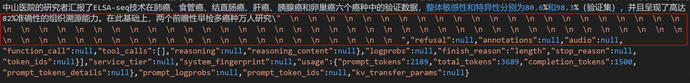
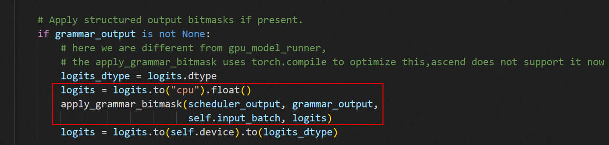
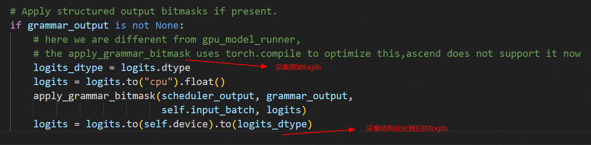
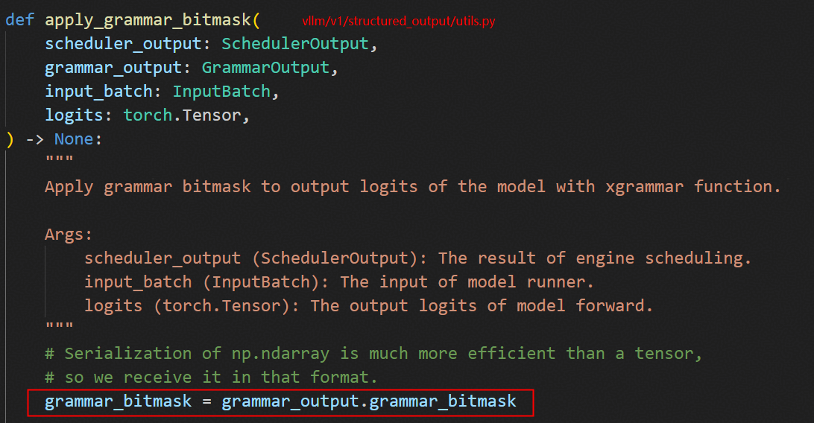
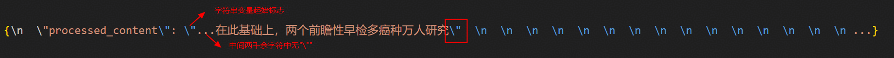

# Qwen2.5模型推理回复复读问题

## 案例简介

在基于 vLLM 推理框架的服务中，模型回复不终止、持续输出换行符会严重影响服务可用性。本文记录了在昇腾环境中部署 Qwen2.5-7B-Instruct 模型时偶发"回复不终止"问题的完整定位过程。通过逐步排除 eager 模式、采样参数与结构化输出等环节，最终确认问题源于结构化输出（xgrammar）的 JSON 约束解码与模型回复内容完整性之间的冲突，并给出通用解法，为类似推理问题提供参考。

## 问题现象

在昇腾环境上，基于 vLLM 推理框架部署 Qwen2.5-7B-Instruct 模型后，某个推理用例偶现持续输出"\n、回复不终止的问题。问题回复如下图所示。



最早发生问题时的模型部署配置如下：

```shell
# FlashComm1
export VLLM_ASCEND_ENABLE_DENSE_OPTIMIZE=1
export VLLM_ASCEND_ENABLE_FLASHCOMM=1

export VLLM_SERVER_DEV_MODE=1
export VLLM_ASCEND_ENABLE_NZ=0
export TASK_QUEUE_ENABLE=1

export VLLM_USE_V1=1
export VLLM_VERSION=0.11.0
export VLLM_EXECUTE_MODEL_TIMEOUT_SECONDS=380
```

推理请求使用了系统提示词，要求模型对指定的医学文章按 JSON 格式输出处理结果；请求中还启用了 `response_format` 结构化输出功能。请求内容（节选）如下：

```json
{
    "messages": [
        {
            "role": "system",
            "content": "作为医疗文本处理引擎，请接收一篇微信公众号文章进行处理，并严格按照 JSON 格式输出，如 {processed_content: \"<处理后的正文内容>\"}"
        },
        {
            "role": "user",
            "content": "**待修改文本**: <一段医学科普文章正文>"
        }
    ],
    "temperature": 0.3,
    "top_p": 0.8,
    "top_k": 20,
    "max_tokens": 20480,
    "ignore_eos": false,
    "response_format": {"type": "json_object"}
}
```

## 定位过程

### 定位环境

试验发现，在 0.11.0、0.12.0、0.13.0 以及 0.14.0 版本的 vLLM 上，即使单卡部署，也均存在该问题，且问题现象一致。实际定位环境如下：

```bash
NPU: Atlas 800I A2
CANN: 8.3.RC2
vllm_ascend: 0.13.0rc1
并行配置：单卡，无并行
```

### eager 模式验证

使能 eager 模式后问题依旧存在，排除 AclGraph 相关问题。

### 采样参数验证

将请求中的 temperature 参数设为 0 后，问题消失，怀疑是采样方面存在问题。

### 结构化输出配置验证

观察测试用例的请求参数，发现请求中携带了 response_format 参数，使能了 vLLM 的结构化输出功能，指定以 JSON 格式回复。

结构化输出的实现原理是使用解码后端对模型原始 logits 输出进行约束解码，而这一过程恰好发生在采样阶段。

去除 response_format 参数，其余参数保持不变，验证是否结构化输出导致了问题。主要采样参数如下：

```bash
"temperature": 0.3,
"top_p": 0.8,
"top_k": 20,
"max_tokens": 20480,
"ignore_eos": false
```

验证结果为：不设置结构化输出时，问题消失。

### 硬件相关性排除

因为结构化输出的核心操作与硬件环境无关，实现代码在 vllm/v1/structured_output/utils.py 中，计算过程发生在 CPU 上，所以推测 GPU 平台上也会发生相同问题，与昇腾的硬件、软件无关。



在 GPU 环境（SGLang+GPU）上进行相同实验，发现回复不终止问题同样发生，证明了该问题的发生与硬件环境无关。

### 根因探究

观察正常回复与异常回复之间的差异，发现首个显著输出差异发生在"万人研究"之后。

```bash
# 正常回复
{\n  \"processed_content\": \"...在此基础上，两个前瞻性早检多癌种万人研究\\\"PREDICT\\\"和\\\"PRESCIENT\\\"已前后开启，正在有序进展中。\"\n}
# 异常回复
{\n  \"processed_content\": \"...在此基础上，两个前瞻性早检多癌种万人研究\"  \n  \n  \n  ...}
```

采集"万人研究"后两个 token 的原始 logits 与结构化处理后的 logits。



采集到的 logits 数据显示：输出第 1 个 token 时，无论原始 logits 还是结构化处理后的 logits，正常回复与异常回复之间都无明显差异；但输出第 2 个 token 时，原始 logits 差异较小，结构化处理后的 logits 差异巨大。

着重关注异常回复中的第 2 个 token。其原始 logits 满足输出预期（Pxx），说明 Qwen2.5 模型本身推理正常，但结构化后的 logits 中丢失了有效字符 `P` 的内容，变成 `" "`、`"\n"` 等无意义 token。这再次证实了是结构化输出导致的问题。

接下来，对 apply_grammar_bitmask 函数进行分析。从代码中可以看出，结构化的本质是使用 grammar_bitmask Numpy 数组对原始 logits 进行掩码操作。因此，采集了"万人研究"后若干 token 的 grammar_bitmask 数据。

apply_grammar_bitmask 函数源码如下：



采集 grammar_bitmask 数据的关键代码如下：

```python
# vllm-ascend/vllm_ascend/worker/model_runner_v1.py

class NPUModelRunner(GPUModelRunner):

    def __init__(self, vllm_config: VllmConfig, device: torch.device):
        ......
        self.debug_enable = False
        self.debug_tokens_num = 0
        self.dumped_tokens_num = 0
        self.last_valid_sampled_token_ids = [[0]]
    ......
    @torch.inference_mode
    def sample_tokens(
        self, grammar_output: "GrammarOutput | None"
    ) -> ModelRunnerOutput | AsyncModelRunnerOutput | IntermediateTensors:
        kv_connector_output = self.kv_connector_output
        self.kv_connector_output = None
        ......
        # Apply structured output bitmasks if present.
        if grammar_output is not None:
            logits_dtype = logits.dtype

            self.debug_tokens_num += 1
            if self.debug_enable:
                np.save(f'/xxx/grammar_bitmask_{self.debug_tokens_num}', grammar_output.grammar_bitmask)
                self.dumped_tokens_num += 1

            logits = logits.to("cpu").float()
            apply_grammar_bitmask(scheduler_output, grammar_output,
                                  self.input_batch, logits)
            logits = logits.to(self.device).to(logits_dtype)
        ......
        if valid_sampled_token_ids == [[102266]] and self.last_valid_sampled_token_ids == [[86402]]:
            self.debug_enable = True
        self.last_valid_sampled_token_ids = valid_sampled_token_ids
        if self.dumped_tokens_num >= 15:
            self.debug_enable = False
            self.dumped_tokens_num = 0
```

采集到的 grammar_bitmask 数据中，可以发现输出"\""前后，grammar_bitmask 的取值发生了改变，说明解码后端认为回复输出进入了新的 JSON 状态。因此可以想到，解码后端可能将"\""当作了某个字符串的闭合标志，而非普通的 token 输出。

在回复中搜索"\""，发现"万人研究\""中的"\""确实是 processed_content 这个字符串变量内容里的第一个"\""，按照 JSON 格式标准，应被视为字符串变量的闭合标志。



这一发现恰能解释以下两个现象：

| 问题现象 | 解释 |
| --- | --- |
| 当"万人研究"后的第 1 个 token 为"\\\""，而非"\""时，回复正常 | "\\\""在字符串定义时，可作为普通字符出现在"..."之间，不代表字符串的闭合 |
| 当"万人研究"后的第 1 个 token 为"\""时，第 2 个 token 原始 logits 中的"P"内容经结构化后丢失 | JSON 字符串中，key: value 后应为","、"""、"}"、" "、"\n"、"\t"等字符，而非法字符"P" |

为了验证以上猜想，将 prompt 中的"\""改为"'"（单引号），进行推理请求实验，结果为问题不复现，证明猜想正确。

## 问题根因

预期输出"万人研究\\\"PREDICT\\\"和..."中的"\\\"" token 因采样随机性被替换为"\""时，解码后端（xgrammar）会认为字符串变量已闭合，掩盖"PREDICT..."的输出，以保证回复内容为合法的 JSON 字符串。然而，从 Qwen2.5 模型推理角度看，prompt 中"万人研究"后还有大量有意义内容，不应停止推理。

JSON 格式合法性（xgrammar）与回复内容完整性（Qwen2.5-7B-Instruct）之间的冲突，导致了持续输出"\n、回复不终止现象的发生。

## 解决方案

将 prompt 里需要格式化的内容中的"\""替换为"'"（单引号）或"“"（中文双引号），避免与 JSON 格式中具有特殊意义的字符冲突。

## 经验总结

整个推理过程大致可以分为"输入预处理 → 模型前向执行 → 数据后处理"三个阶段。定位问题时可以先定界，明确问题发生在哪个阶段，再做深入分析。例如本次定位过程中，便先通过修改请求参数，确定问题发生在模型前向执行结束后的采样阶段（数据后处理），从而实现了问题的快速定位。
