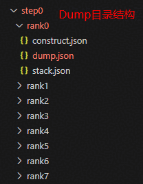
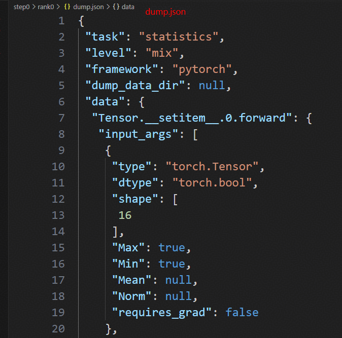
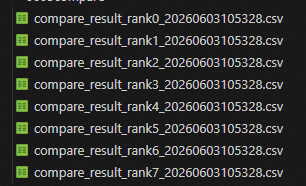
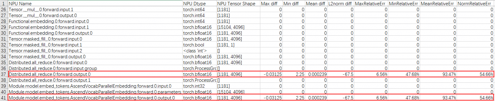
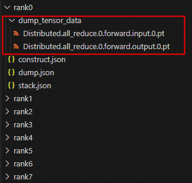
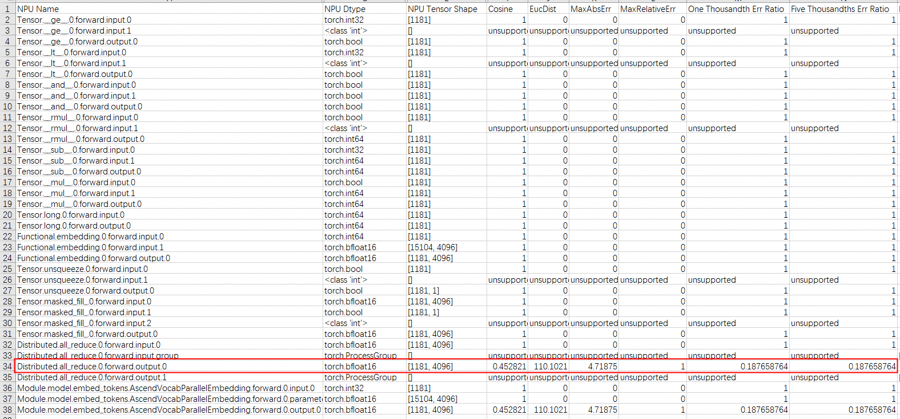
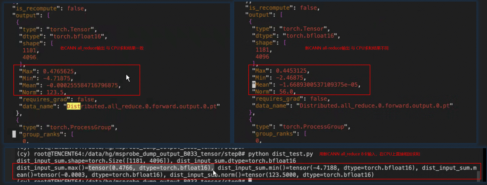
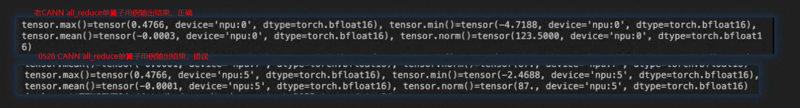

# CANN版本升级后的推理请求回复乱码问题

## 案例简介

在大模型推理服务中，CANN 版本升级后可能出现回复乱码等精度异常，影响在线服务的可用性。本文介绍了一种基于 msProbe 工具的系统性定位方法，通过"Dump → 比对 → 单算子复现"的流程，将整网精度问题逐步收敛为单个算子的数值偏差问题。该方法适用于 vLLM Ascend 推理场景，为 CANN 升级后的精度问题排查提供了可复用参考。

## 问题现象

升级 CANN 版本后，某模型出现回复乱码的精度问题。回退 CANN 版本后，问题消失。

| 场景 | CANN 版本 | 请求回复 |
| --- | --- | --- |
| 正常场景 | 9.0.0 | 以下是人工智能发展史上五个最重要的里程碑事件及对应意义 |
| 异常场景 | 9.1.0 | 乱码数据 |

## 定位过程

### 定位环境

- NPU 型号：Ascend 950 PR
- CANN 版本：9.1.0、9.0.0

该问题属于典型的 CANN 版本升级后出现的精度异常。因升级前后模型结构、API 调用逻辑等均未改变，可以将问题收敛到新版本 CANN 中数值行为发生变化的算子。正常情况下，可使用 msProbe 精度工具，通过"Dump → 比对 → 单算子复现"的定位流程明确问题算子。

### 工具安装

详细安装步骤见《[msProbe工具安装指南](https://gitcode.com/Ascend/msprobe/blob/master/docs/zh/install_guide/msprobe_install_guide.md)》。因本问题发生在 vLLM 推理场景，安装基础工具包即可。

### 一次 Dump 比对

Dump 步骤见《[vLLM推理数据采集](https://gitcode.com/Ascend/msprobe/blob/master/docs/zh/user_guide/dump/vllm_dump_instruct.md)》，比对步骤见《[vLLM推理精度数据比对](https://gitcode.com/Ascend/msprobe/blob/master/docs/zh/user_guide/accuracy_compare/pytorch_accuracy_compare_instruct.md)》。

进行第一次 Dump、比对，初步排查问题发生点。

首先，需根据问题现象确定合适的 Dump 配置参数。因首 token 即为乱码，采集首次 forward 整网数据即可，Dump 配置（具体介绍见《[配置文件介绍](https://gitcode.com/Ascend/msprobe/blob/master/docs/zh/user_guide/dump/config_json_introduct.md)》）如下：

```json
{
    "task": "statistics",
    "dump_path": "./dump_data",
    "rank": [],
    "step": [0],
    "level": "mix",
    "statistics": {
        "scope": [],
        "list": [],
        "data_mode": ["all"],
        "summary_mode": "statistics"
    }
}
```

接着，在 vLLM 服务启动脚本中，增加 `--additional-config '{"dump_config_path": "/xxx/msprobe_config.json"}'` 参数，传入 Dump 配置文件路径。

最后，拉起 vLLM 服务并发送请求。回复结束后，查看 Dump 目录，确认是否 Dump 成功，目录结构及 dump.json 内容如下图所示。

 

重复以上步骤，分别 Dump 使用新版本、旧版本 CANN 时的首 token 整网精度数据。而后执行以下比对命令，进行精度数据比对。

```bash
msprobe compare -tp [new_cann_dump_data]/step0 -gp  [old_cann_dump_data]/step0 -o ./output
```

比对结果将以 csv 文件形式保存在 output 目录下。



打开 rank0 比对结果表，可以很快发现首个差异点为 all_reduce API 的输出，同时因其输出的差异，导致 Embedding 层的总输出也存在相同差异。



rank0 all_reduce API 输出不一致的可能原因有：

1. rank1~rank7 中存在部分 rank 的 all_reduce 输入不同。
2. rank0 all_reduce API 的输入仅是统计指标相同，逐元素相比结果有差异。
3. all_reduce 算子存在数值偏差。

原因 2、3 的验证需要采集 all_reduce API 的输入输出真实 Tensor，所以先通过查看 rank1~rank7 的比对结果表，确认原因 1 是否存在。

查看比对结果表后，发现与 rank0 情况相同，rank1~rank7 的 all_reduce API 输入在升级 CANN 版本前后统计指标上无差异，而输出存在明显差异。因此，排除原因 1。

### 二次 Dump 比对

通过第一次 Dump 比对锁定到 all_reduce API 后，进行细粒度的二次 Dump，验证 all_reduce 算子是否存在数值偏差。

Dump Embedding 层内所有 API 的输入输出真实数据。

- 只 Dump Embedding 层，是为了减小数据采集量，减少 Dump 耗时。
- Dump Embedding 层内所有 API，是为了采集 all_reduce 的上游 API，查看 all_reduce 的差异是否来源于上游 API 的差异传播。
- Dump 真实 Tensor 数据（而非统计量），是为了准确比对新旧 CANN 下 API 的输入输出差异，并为后续单算子复现提供输入。

二次 Dump 使用的配置如下，与一次 Dump 配置的主要不同在"task"、"list"字段。

```json
{
    "task": "tensor",
    "dump_path": "./dump_data_tensor",
    "rank": [],
    "step": [0],
    "level": "mix",
    "tensor": {
        "scope": [],
        "list": ["Module.model.embed_tokens.AscendVocabParallelEmbedding.forward.0"],
        "data_mode": ["all"],
        "summary_mode": "statistics"
    }
}
```

配置文件修改后的 Dump、比对步骤与一次 Dump 完全相同。最终得到的 Dump 数据如下，相比第一次 Dump，额外创建了 dump_tensor_data 文件夹用于存放输入输出 Tensor 数据。



比对结果如下：



可以看到，依旧是 all_reduce API 的输出首先存在差异，因此有充足理由怀疑 all_reduce 算子存在数值偏差。

### 单算子复现

单算子复现的目的是为新版 CANN 的 all_reduce 算子数值偏差提供确凿证据，以便与算子开发团队反馈并推动解决。

首先，根据 all_reduce 的实现原理，计算相同输入下的预期输出。计算脚本如下：

```python
import torch

dist_input_rank0 = torch.load("./rank0/dump_tensor_data/Distributed.all_reduce.0.forward.input.0.pt", "cpu")
dist_input_rank1 = torch.load("./rank1/dump_tensor_data/Distributed.all_reduce.0.forward.input.0.pt", "cpu")
dist_input_rank2 = torch.load("./rank2/dump_tensor_data/Distributed.all_reduce.0.forward.input.0.pt", "cpu")
dist_input_rank3 = torch.load("./rank3/dump_tensor_data/Distributed.all_reduce.0.forward.input.0.pt", "cpu")
dist_input_rank4 = torch.load("./rank4/dump_tensor_data/Distributed.all_reduce.0.forward.input.0.pt", "cpu")
dist_input_rank5 = torch.load("./rank5/dump_tensor_data/Distributed.all_reduce.0.forward.input.0.pt", "cpu")
dist_input_rank6 = torch.load("./rank6/dump_tensor_data/Distributed.all_reduce.0.forward.input.0.pt", "cpu")
dist_input_rank7 = torch.load("./rank7/dump_tensor_data/Distributed.all_reduce.0.forward.input.0.pt", "cpu")

dist_input_sum = dist_input_rank0 + dist_input_rank1 + dist_input_rank2 + dist_input_rank3 + dist_input_rank4 + dist_input_rank5 + dist_input_rank6 + dist_input_rank7

print(f'{dist_input_sum.shape=}, {dist_input_sum.dtype=}')
print(f'{dist_input_sum.max()=}, {dist_input_sum.min()=}, {dist_input_sum.mean()=}, {dist_input_sum.norm()=}')
```

计算结果如下：



计算结果与旧版 CANN 下采集到的整网中的 all_reduce 算子输出一致，与新版的输出差异较大，说明整网中，新版 CANN 的 all_reduce 输出存在偏差。

然后，使用以下单算子脚本，获取单算子场景下新旧版本 CANN 的 all_reduce 输出。

```python
import torch
import torch.distributed as dist
import torch.multiprocessing as mp
import os

# ----------------------
# NPU 分布式环境初始化
# ----------------------
def setup_distributed(rank, world_size):
    """
    rank: 当前 NPU 编号 (0~7)
    world_size: 总 NPU 数量
    """
    # 单机多 NPU 必须配置
    os.environ['MASTER_ADDR'] = 'localhost'
    os.environ['MASTER_PORT'] = '12345'

    # ========== NPU 关键：backend = hccl ==========
    dist.init_process_group(
        backend="hccl",  # NPU 必须用 HCCL
        rank=rank,
        world_size=world_size
    )

    # 绑定当前进程到对应 NPU
    torch.npu.set_device(rank)

# ----------------------
# NPU all_reduce 核心演示
# ----------------------
def run_all_reduce_demo(rank, world_size):
    # 1. 初始化分布式
    setup_distributed(rank, world_size)
    device = torch.device(f"npu:{rank}")  # NPU 设备

    # 2. 每个 NPU 加载不同张量
    tensor = torch.load(f"./rank{rank}/dump_tensor_data/Distributed.all_reduce.0.forward.input.0.pt", "cpu")
    tensor = tensor.to(device)
    #print(f"NPU {rank} | 聚合前: {tensor.item()}")

    # 3. NPU 上执行 all_reduce
    dist.all_reduce(tensor=tensor)

    # 4. 所有 NPU 都会拿到相同结果
    print(f'{tensor.max()=}, {tensor.min()=}, {tensor.mean()=}, {tensor.norm()=}')

    # 清理
    dist.barrier()
    dist.destroy_process_group()

# ----------------------
# 启动 8 卡 NPU 进程
# ----------------------
if __name__ == "__main__":
    WORLD_SIZE = 8  # 8 张 NPU
    mp.set_start_method("spawn")

    processes = []
    for rank in range(WORLD_SIZE):
        p = mp.Process(
            target=run_all_reduce_demo,
            args=(rank, WORLD_SIZE)
        )
        p.start()
        processes.append(p)

    for p in processes:
        p.join()
```

执行结果如下：



至此，将整网精度问题成功转换为单算子数值偏差问题。

## 解决方案

将 CANN 环境升级至已修复 all_reduce 算子数值偏差的 9.1.0 B037 版本。

## 经验总结

版本升级后出现的精度异常问题可使用 msProbe 精度工具完成快速定位。
