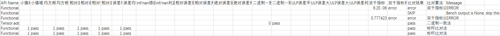

# PyTorch场景离线精度预检

## 简介

**PyTorch离线精度预检**：通过扫描昇腾 NPU 上用户训练模型中的PyTorch API，输出模型精度的诊断和分析结果。具体而言，该工具通过采集模型中所有 API 的前向和反向信息，构造相应的单元测试，将 NPU 输出与标杆（CPU 高精度）比对，从而计算对应的精度指标，该过程通过子命令 acc_check 执行；将 NPU 环境下采集的预检数据拷贝至 GPU 环境，同样执行 acc_check；最后通过**新精度标准比对法**将 NPU 和 GPU 的预检结果进行比对，从而找出 NPU 中存在精度问题的 API。同时，本工具支持**随机生成模式和真实数据模式**。

**基本概念**

- 新精度标准比对法：依据新精度标准，对不同的API采取不同的比对算法（包括绝对阈值法、标杆比对法、二进制一致法、ULP误差比对法和双千指标法），最终给定预检判定结果。
- 随机生成模式和真实数据模式：在预检 dump 时可以选择由工具构造随机数获得 dump 数据或选择真实输入的数据进行预检 dump 操作。随机生成模式（对应 task: "statistics"）执行效率高，可以快速获得结果，但数据精度低，只能大致判断精度问题；真实数据模式（对应 task: "tensor"）执行效率略低于随机生成模式，但是数据精度高，可以准确判断精度问题。

**离线预检流程**

1. 在 NPU 和 GPU 环境下分别安装 msProbe。
2. 在 NPU 训练脚本内添加 msProbe 工具 dump 接口 PrecisionDebugger，采集待预检数据。注意需要配置 level="L1"。
3. 将 NPU 环境下 dump 的预检数据拷贝至 GPU 环境。
4. 在 NPU 和 GPU 环境下分别执行 acc_check，生成的结果最终用于 api_precision_compare 的输入。详见 [离线精度预检](#离线精度预检)。
5. 将 NPU 和 GPU 执行 acc_check 生成的 `accuracy_checking_details_{timestamp}.csv` 结果文件拷贝至同一环境下。
6. 运行 api_precision_compare，输出结果为预检操作的最终结果。详见 [预检结果比对](#预检结果比对)章节。

## 使用前准备

**环境准备**

安装msProbe工具，详情请参见《[msProbe安装指南](../../install_guide/msprobe_install_guide.md)》。

**约束**

仅支持PyTorch场景。

## 离线精度预检

完成预检数据采集后，仅获取了 API 的输入数据，为了得到 NPU vs. CPU 高精度（标杆）的预检比对结果和 GPU vs. CPU 高精度（标杆）的预检比对结果，还需要进行 acc_check 操作。

acc_check 预检操作包括以下两种方式：

- 使用 acc_check 子命令执行预检：适用于数据量较小的单卡场景。
- 使用 multi_acc_check 子命令执行多线程预检：适用于数据量较大的大模型场景。

### 使用acc_check执行预检

**功能说明**

将 API 信息输入到 acc_check 模块进行精度检测并比对。

**命令格式**

```bash
msprobe acc_check -api_info <dump_json_path> [-save_error_data] [-o <out_path>] [-j] [-d <device_id>] [-csv_path <result_csv_path>] [-f] [-config <config_path>]
```

可选字段使用 [] 表示，变量使用 < > 表示。

**参数说明**

| 参数                          | 可选/必选                        | 说明                                                                                                                                                                      |
|-------------------------------| ---------------------------------- |-------------------------------------------------------------------------------------------------------------------------------------------------------------------------------|
| -api_info 或 --api_info_file   | 必选                               | 指定 API 信息文件 dump.json。                                                                                                                                                        |
| -save_error_data              | 可选                               | 保存精度未达标的 API 输入输出数据。                                                                                                                                                          |
| -o 或 --out_path               | 可选                               | 指定 acc_check 执行结果存盘路径，默认“./”。                                                                                                                                                    |
| -j 或 --jit_compile            | 可选                               | 开启 jit 编译。                                                                                                                                                                    |
| -d 或 --device                 | 可选                               | 指定 Device ID，选择 UT 代码运行所在的卡，默认值为 0。                                                                                                                                           |
| -csv_path 或 --result_csv_path | 可选 | 指定本次运行中断时生成的 `accuracy_checking_result_{timestamp}.csv` 文件路径。<br>执行 acc_check 中断时，若想从中断处继续执行，必须配置此参数。<br/>需要指定为上次中断的 `accuracy_checking_result_{timestamp}.csv` 文件。详见 [断点续检](#断点续检)。 |
| -f 或 --filter_api             | 可选                               | 过滤模型中除最大值和最小值以外其他参数和结构相同的 API。适用于模型较大且重复 API 较多的场景。                                                                                                                           |
| -config 或 --config_path       | 可选                               | 指定离线预检操作过程中额外配置（包括黑名单、白名单等）的 [config.json](../../../../python/msprobe/config.json) 文件，默认未配置。config.json 文件的配置可参考[配置文件介绍](../dump/config_json_introduct.md)。 |

**示例1：执行预检**

```bash
msprobe acc_check -api_info ./dump_path/step{step_number}/rank{rank_number}/dump.json
```

acc_check执行结果在-o参数指定路径下生成，包括 `accuracy_checking_result_{timestamp}.csv` 和 `accuracy_checking_details_{timestamp}.csv` 两个文件。`accuracy_checking_result_{timestamp}.csv` 属于 API 级，标明每个 API 是否通过测试。建议用户先查看 `accuracy_checking_result_{timestamp}.csv` 文件，对于其中没有通过测试的或者特定感兴趣的 API，根据其 API name 字段在 `accuracy_checking_details_{timestamp}.csv` 中查询其各个输出的达标情况以及比较指标。详细介绍请参见[预检结果说明](#预检结果说明)。

**示例2：保存未达标输入输出数据**

如果需要保存比对不达标的输入和输出数据，可以在 acc_check 执行命令结尾添加 `-save_error_data`，例如：

```bash
msprobe acc_check -api_info ./dump_path/step{step_number}/rank{rank_number}/dump.json -save_error_data
```

数据默认会保存到`./ut_error_data{timestamp}`路径下，如有需要，用户可以通过 error_data_path 参数来配置保存路径。error_data_path 参数可在 [config.json](../../../../python/msprobe/config.json) 文件或 [config.yaml](../../../../python/msprobe/pytorch/api_accuracy_checker/config.yaml) 文件配置。config.json 文件需要在 acc_check 操作时通过 -config 参数指定；config.yaml文件配置请参见[config.yaml文件说明](#configyaml文件说明)。

#### config.yaml文件说明

   config.yaml 文件可以通过配置参数来控制 dump 和 acc_check 操作的白名单、黑名单等功能。操作步骤如下：

   - config.yaml 文件通常位于类似 /home/xxx/miniconda3/envs/xxx/lib/python3.8/site-packages/msprobe/pytorch/api_accuracy_checker/config.yaml 的路径中。

   - 进入 config.yaml 文件

      ```bash
      vim /home/xxx/miniconda3/envs/xxx/lib/python3.8/site-packages/msprobe/pytorch/api_accuracy_checker/config.yaml
      ```

   - 修改 config.yaml 文件参数。

      ```yaml
      white_list: []
      black_list: []
      error_data_path: './'
      precision: 14
      quantization_api_list: []
      ```

      | 参数        | 可选/必选 | 说明 |
      | ----------- | -------- | -----------|
      | white_list      | 可选     | API dump 白名单，仅对指定的 API 进行 dump。<br>**配置示例**：white_list=["conv1d", "conv2d"]。默认未配置白名单，即 dump 全量 API 数据。 |
      | black_list      | 可选     | API dump 黑名单，被指定的 API 不进行 dump。<br>**配置示例**：black_list=["conv1d", "conv2d"]。默认未配置黑名单，即 dump 全量 API 数据。 |
      | error_data_path | 可选     | 配置保存精度未达标的 API 输入输出数据路径。<br>**配置示例**：error_data_path: './'。默认为当前路径。 |
      | precision       | 可选     | 浮点数表示位数，默认取小数点后14位。                         |
      | quantization_api_list       | 可选     | 浮点输入且整型输出的量化算子API列表，配置后表示该类型API只需满足绝对误差 ≤ 1即为PASS                         |

      **说明**：white_list 和 black_list 同时配置时，二者配置的 API 名单若无交集，则白名单生效，若 API 名单存在交集，则白名单排除的部分以及交集的 API 不进行 dump。

#### API预检黑名单和白名单

acc_check过程支持 API 预检黑名单和白名单，通过如下文件配置 black_list（黑名单）或 white_list（白名单）参数来指定不需要或需要预检的 API 名称：

   - 配置 [config.json](../../../../python/msprobe/config.json) 文件，该文件需要在 acc_check 操作时通过 -config 参数指定。

   - config.json 文件的优先级高于 config.yaml 文件，即执行 config.json 文件时，config.yaml 文件的配置不生效。

#### API输出后处理配置说明

为适配部分 API 在真实场景中的变长输出（例如尾部 padding 区域携带无效值），acc_check 在比对前支持按规则对 cpu 侧和 device 侧输出分别做后处理。后处理配置文件为 [api_output_postprocess.yaml](../../../../python/msprobe/core/common/output_postprocess/api_output_postprocess.yaml)。

执行时，框架会在统一后处理入口中通过 `backend`（`cpu` 或 `device`）选择对应侧规则；未命中配置的 API 会直接跳过对应侧后处理逻辑。

**配置结构**

```yaml
acc_check_handlers:
   target:
      npu_dequant_swiglu_quant: "builtin_handlers.py:postprocess_by_group_index"
      npu_grouped_matmul: "builtin_handlers.py:postprocess_by_group_list"
   golden: {}
```

**字段说明**

| 字段 | 说明 |
| --- | --- |
| acc_check_handlers.target | 按 API 名称配置 target 侧后处理函数，值格式为 `python文件路径:函数名`。支持相对路径（相对于 `output_postprocess` 目录）或绝对路径。未配置可写为 `{}`。 |
| acc_check_handlers.golden | 按 API 名称配置 golden 侧后处理函数，值格式为 `python文件路径:函数名`。支持相对路径（相对于 `output_postprocess` 目录）或绝对路径。未配置可写为 `{}`。 |

当前默认已预置 handler 的 API 如下：

- `npu_dequant_swiglu_quant`：使用 `group_index` 作为有效长度依据。
- `npu_grouped_matmul`：使用 `group_list` 作为有效长度依据。

新增处理规则时，直接在对应侧继续追加 `API -> handler` 映射即可；默认 handler 和用户扩展 handler 共用同一套加载与执行逻辑。

**acc_check_handlers 配置示例**

```yaml
acc_check_handlers:
   target:
      npu_dequant_swiglu_quant: "builtin_handlers.py:postprocess_by_group_index"
      npu_other_api: "custom_postprocess.py:handle_api"
      npu_another_api: "/home/xxx/msprobe/core/common/output_postprocess/custom_postprocess.py:handle_another_api"
   golden: {}
```

说明：

- 当前配置语义是“一个 API 对应一个 handler”。
- 如果同一个 API 需要多个处理步骤，建议在该 API 对应的 handler 内部自行串联这些逻辑。
- 不同 API 可以复用同一个 handler，也可以分别配置不同 handler。

函数签名要求：

```python
def handle_api(api_name, output, args, kwargs):
   return new_output
```

约束说明：

- 处理函数脚本需放在 [output_postprocess](../../../../python/msprobe/core/common/output_postprocess/) 目录路径下。
- 处理函数执行失败或返回 `None` 时，框架会自动回退为原始 `output`。

### 使用multi_acc_check执行多线程预检

**功能说明**

通过multi_acc_check脚本并行执行多个acc_check操作，减少预检耗时。

**命令格式**

```bash
msprobe multi_acc_check -api_info <dump_json_path> [-save_error_data] [-o <out_path>] [-j] [-n <num_splits>] [-d <device_id>] [-csv_path <result_csv_path>] [-f] [-config <config_path>]
```

**参数说明**

| 参数                           | 可选/必选                                  | 说明                                                         |
| ---------------------------- | ---------------------------------- | ------------------------------------------------------------ |
| -api_info 或 --api_info_file   | 必选                               | 指定 API 信息文件 dump.json。                                   |
| -save_error_data             | 可选                               | 保存精度未达标的 API 输入输出数据。                            |
| -o 或 --out_path               | 可选                               | 指定 acc_check 执行结果存盘路径，默认“./”。 |
| -j 或 --jit_compile            | 可选                               | 开启 jit 编译。                                                |
| -n 或 --num_splits           | 可选                               | 同时执行 acc_check 线程的数量，默认为 8，最大支持 64，但每个 Device 最大支持 8 个线程。当指定多个线程和多个 Device 时，线程数在每张卡上均分。 |
| -d 或 --device                 | 可选                               | 指定 Device ID，选择 UT 代码运行所在的卡，默认值为 0，支持同时指定 0~7，共 8 个 Device。 |
| -csv_path 或 --result_csv_path | 可选 | 指定本次运行中断时生成的 `accuracy_checking_result_{timestamp}.csv` 文件路径。<br>执行 multi_acc_check 中断时，若想从中断处继续执行，必须配置此参数。<br>需要指定为上次中断的 `accuracy_checking_result_{timestamp}.csv` 文件。详见 [断点续检](#断点续检)。 |
| -f 或 --filter_api             | 可选                               | 过滤模型中除最大值和最小值以外其他参数和结构相同的 API。适用于模型较大且重复 API 较多的场景。 |
| -config 或 --config_path | 可选 | 指定离线预检操作过程中额外配置（包括黑名单、白名单等）的 [config.json](../../../../python/msprobe/config.json) 文件，默认未配置。config.json 文件的配置可参考[配置文件介绍](../dump/config_json_introduct.md)。 |

**使用示例**

```bash
msprobe multi_acc_check -api_info ./dump_path/step{step_number}/rank{rank_number}/dump.json -n 32 -d 0 1 2 3
```

**输出说明**

multi_acc_check预检执行后，会在每个Device下各自生成两个csv文件，详细介绍请参见[预检结果说明](#预检结果说明)。

### 断点续检

**功能说明**

精度预检 acc_check 过程中，若因环境、数据量过大等原因导致预检进程中断，那么当用户解决这些问题后，重新执行 acc_check 操作，可以通过断点续检操作继续前面未完成的预检。

**注意事项**

- 须指定为上次预检中断的 `accuracy_checking_result_{timestamp}.csv` 文件。
- 请勿修改 `accuracy_checking_result_{timestamp}.csv` 和 `accuracy_checking_details_{timestamp}.csv` 文件名，包括时间戳，否则断点续检会因无法识别到文件名而失败。
- 断点续检不会重新创建csv文件，而是在-csv_path指定的`accuracy_checking_result_{timestamp}.csv`文件以及对应的 `accuracy_checking_details_{timestamp}.csv` 文件中继续写入后续的结果。

**使用示例**

```bash
msprobe acc_check -api_info ./dump_path/step{step_number}/rank{rank_number}/dump.json -csv_path /home/xxx/ut/accuracy_checking_result_{timestamp}.csv
```

### 自定义融合算子接入

用户可以通过配置文件添加自定义融合算子标杆函数，无需修改预检工具源代码。

**接入流程**

**Step 1：编写标杆函数文件**

在 `bench_functions/` 目录下创建 Python 文件，实现融合算子的前向标杆函数（CPU 参考实现）。如有需要，同时实现反向标杆函数。

标杆函数规范：

- 函数签名应与 NPU 融合算子的入参一致，使用纯 PyTorch 算子实现，不依赖 NPU 特有算子。
- 函数名以 `npu_` 开头。
- 返回结果必须在 CPU 上。

参考模板文件 `bench_functions/template.py`：

```python
import torch

def npu_my_op_forward(x, weight, bias=None):
    result = torch.matmul(x, weight.t())
    if bias is not None:
        result = result + bias
    return result

def npu_my_op_backward(grad_output, x, weight):
    grad_x = torch.matmul(grad_output, weight)
    grad_weight = torch.matmul(grad_output.t(), x)
    return grad_x, grad_weight
```

**Step 2：注册融合算子至配置文件**

编辑 `bench_functions/fusion_operator_config.yaml`，添加算子条目：

```yaml
operators:
  # 已注册算子...

  # 新增自定义算子
  npu_my_op:
    forward: npu_my_op_forward
    backward: npu_my_op_backward      # 可选，无反向可不填
    description: "自定义融合算子示例"
```

配置项说明：

| 配置项 | 必填 | 说明 |
|--------|------|------|
| `forward` | 是 | 前向标杆函数名，必须与 `bench_functions/` 下文件中的函数名一致 |
| `backward` | 否 | 反向标杆函数名，不需要反向计算的算子可不填 |
| `description` | 否 | 算子描述，仅用于文档说明 |

**Step 3：运行预检**

```bash
msprobe acc_check -api_info ./dump.json
```

预检工具会自动加载配置中的标杆函数并进行精度比对。

**工作原理**

预检工具在 `acc_check` 过程中，对于 NPU 类型的 API：

1. 在 CPU 上执行时，通过 `npu_custom_functions` 注册表查找对应的标杆函数并执行，得到 CPU 高精度结果（标杆数据）。
2. 在 NPU 上执行时，调用实际的 NPU 算子，得到待比对的结果。
3. 将两个结果送入比较器进行精度指标计算（余弦相似度、相对误差等），最终给出判断。

所有注册信息通过 `fusion_operator_config.yaml` 统一管理，工具启动时自动加载，无需手动编写注册代码。

## 预检结果说明

精度预检生成的 `accuracy_checking_result_{timestamp}.csv` 和 `accuracy_checking_details_{timestamp}.csv` 文件示例如下：

可以通过先查看 `accuracy_checking_result_{timestamp}.csv` 文件的 Forward Test Success 和 Backward Test Success，判断是否存在未通过测试的 API，再查看 `accuracy_checking_details_{timestamp}.csv` 文件的 API 详细达标情况，详细介绍请参见[API预检指标](#api预检指标)。

`accuracy_checking_result_{timestamp}.csv`


| 字段                  | 含义     |
| --------------------- | ------------------------- |
| API name              | API 名称。                    |
| Forward Test Success  | 前向 API 是否通过测试，pass 为通过，warning 为待观察，error 为错误。SKIP 表示跳过该 API 的计算，跳过原因在 Message 字段中提示，包括：该 API 不支持精度预检，或该 API 被黑名单过滤或不在白名单上，或运行错误等。 |
| Backward Test Success | 反向 API 是否通过测试，pass 为通过，warning 为待观察，error 为错误。如果是空白的话代表该 API 没有反向输出。SKIP 表示跳过该 API 的计算，跳过原因在 Message 字段中提示，包括：该 API 不支持精度预检，或该 API 被黑名单过滤或不在白名单上，或运行错误等。 |
| Message               | 提示信息。             |

该结果为中间结果，仅作为参考，建议完成[预检结果比对](#预检结果比对)后查看比对结果。该结果后续将会删除。

Forward Test Success 和 Backward Test Success 是否通过测试是由 `accuracy_checking_details_{timestamp}.csv` 中的余弦相似度、最大绝对误差、双百、双千、双万指标判定结果决定的。

需要注意的是 `accuracy_checking_details_{timestamp}.csv` 中可能存在一个 API 的前向（反向）有多个输出，那么每个输出记录一行，而在 `accuracy_checking_result_{timestamp}.csv` 中的结果需要该 API 的所有结果均为 pass 才能标记为 pass，只要存在一个 error 则标记为 error，仅存在 warning 和 pass 且不存在 error 则标记为 warning。

`accuracy_checking_details_{timestamp}.csv`


| 字段                | 含义                                                         |
| ------------------- | ------------------------------------------------------------ |
| API name            | NPU 或 GPU下的 API 名称。       |
| Bench Dtype         | 标杆数据的 API 数据类型。                                      |
| DEVICE Dtype        | NPU 或 GPU 数据的 API 数据类型。      |
| Shape               | API 的 Shape 信息。           |
| 余弦相似度          | NPU 或 GPU 数据与标杆数据的余弦相似度。       |
| 最大绝对误差        | NPU 或 GPU 数据与标杆数据的最大绝对误差。   |
| 双百指标            | 双百精度指标。是指 NPU 或 GPU 的 Tensor 中的元素逐个与对应的标杆数据对比，相对误差小于百分之一的个数占总元素个数的比例。测试通过标准为相对误差大于百分之一的个数占总元素个数的比例小于百分之一。 |
| 双千指标            | 双千精度指标。是指 NPU 或 GPU 的 Tensor 中的元素逐个与对应的标杆数据对比，相对误差小于千分之一的个数占总元素个数的比例。测试通过标准为相对误差大于千分之一的个数占总元素个数的比例小于千分之一。 |
| 双万指标            | 双万精度指标。是指 NPU 或 GPU 的 Tensor 中的元素逐个与对应的标杆数据对比，相对误差小于万分之一的个数占总元素个数的比例。测试通过标准为相对误差大于万分之一的个数占总元素个数的比例小于万分之一。 |
| 二进制一致错误率    | NPU 或 GPU 数据中每个 Tensor 精度不一致的数值的数量与 Tensor 中数值数量的比值。只有数据是 builtin 类型（bool、int、float、str）、torch.bool 和 torch 的 int 类型或者在新精度标准中使用二进制一致算法进行比对的 API 才会展示。 |
| 误差均衡性          | NPU 或 GPU 数据与标杆数据精度差的上下浮动情况。                 |
| 均方根误差          | NPU 或 GPU 数据与标杆数据的均方根误差。                         |
| 小值域错误占比      | NPU 或 GPU Tensor 中与标杆的绝对误差大于错误阈值的小值在小值域（小值的总数量）中的占比。判断为小值以及绝对误差的错误阈值参见[小值域阈值](#小值域阈值)。 |
| 相对误差最大值      | NPU 或 GPU 数据与标杆数据相对误差的最大值。         |
| 相对误差平均值      | NPU 或 GPU 数据与标杆数据相对误差的平均值。            |
| inf/nan 错误率       | NPU 与标杆 inf/nan 计算不一致的元素个数占总元素的个数比例。  |
| 相对误差错误率      | NPU 与标杆的正常值计算相对误差，其大于错误阈值的元素个数占正常值元素个数的比例。 |
| 绝对误差错误率      | NPU 与标杆的小值计算绝对误差，其大于错误阈值的元素个数占小值元素个数的比例。 |
| ULP 误差最大值       | NPU 或 GPU 数据与标杆数据 ULP 误差的最大值（取绝对值后）。        |
| ULP 误差平均值       | NPU 或 GPU 数据与标杆数据 ULP 误差的平均值（取绝对值后）。  |
| ULP 误差大于阈值占比 | NPU 或 GPU 数据与标杆数据的 ULP 误差（取绝对值后）大于阈值（当 NPU 或 GPU 数据类型为 float16 或 bfloat16 时，阈值为 1；当 NPU 或 GPU 数据类型为 float32 时，阈值为 32）的元素个数占总元素的个数比例。 |
| Status              | API 预检通过状态。pass 表示通过测试；error 表示未通过；warning 表示测试未通过双千或双万精度指标；SKIP 表示跳过该 API 的计算，跳过原因在 Message 字段中提示，包括：该 API 的某个参数的反向不计算梯度，没有任何计算过程，其他信息均为空，或该 API 的数据类型不支持使用新精度标准进行比对（如 float64），或该 API 不支持精度预检，或该 API 被黑名单过滤或不在白名单上，或运行错误等。 |
| Message             | 提示信息。                     |

### API预检指标

   API 预检指标是通过对 `accuracy_checking_details_{timestamp}.csv` 中的余弦相似度、最大绝对误差双百、双千、双万精度指标的数值进行判断，得出该 API 是否符合精度标准的参考指标，建议在初步预检完成后执行[预检结果比对](#预检结果比对)，获取更精确的精度结果。

   API 预检通过测试，则在`accuracy_checking_details_{timestamp}.csv`文件中的 Status 列标记为 pass，否则标记为 error 或 warning，详细规则如下：

   - 余弦相似度 > 0.99：≤ 0.99 为不达标，标记为 error，> 0.99 达标，进行下一步；
   - 最大绝对误差 ＜ 0.001：＜ 0.001 达标，标记为 pass，≥ 0.001 为不达标，进行下一步；
   - 双百、双千、双万精度指标：
     + 对于 float16 和 bfloat16 数据：双百指标不通过，标记为 error；双百指标通过，双千指标不通过，标记为 warning；双百、双千指标均通过，标记为 pass。
     + 对于 float32 和 float64 数据：双千指标不通过，标记为 error；双千指标通过，双万指标不通过，标记为 warning；双千、双万指标均通过，标记为 pass。
   - 在 `accuracy_checking_result_{timestamp}.csv` 中以 Forward Test Success 和 Backward Test Success 字段统计该算子前向反向输出的测试结果，对于标记为 pass 的算子，则在 `accuracy_checking_result_{timestamp}.csv` 中标记为 TRUE 表示测试通过，对于标记为 error 或 warning 的算子，则在 `accuracy_checking_result_{timestamp}.csv` 中标记为 FALSE 表示测试不通过。由于一个算子可能有多个前向或反向的输入或输出，那么该类算子的输入或输出中必须全为 pass，才能在 `accuracy_checking_result_{timestamp}.csv` 中标记为 TRUE，只要有一个输入或输出标记为 error 或 warning，那么在 `accuracy_checking_result_{timestamp}.csv` 中标记为 FALSE。

### 小值域阈值

   判定为小值的阈值：

   - torch.float32：2**-14
   - torch.float16：2**-11
   - torch.bfloat16：2**-8

   小值域的绝对误差阈值：

   - torch.float32：2**-30
   - torch.float16：2**-16
   - torch.bfloat16：2**-16

## 预检结果比对

**功能说明**

同时获取NPU和GPU环境下acc_check操作的预检结果`accuracy_checking_details_{timestamp}.csv`文件后，可通过执行预检结果比对操作，来比较NPU和GPU环境的精度差异。

**命令格式**

```bash
msprobe api_precision_compare -npu <npu_csv_path> -gpu <gpu_csv_path> [-o <out_path>]
```

可选字段使用 [] 表示，变量使用 < > 表示。

**参数说明**

| 参数                   | 可选/必选 | 说明                                                         |
| ---------------------- | --------- | ------------------------------------------------------------ |
| -npu 或 --npu_csv_path | 必选      | NPU 预检结果 `accuracy_checking_details_{timestamp}.csv` 文件路径。默认从当前目录下识别该文件。 |
| -gpu 或 --gpu_csv_path | 必选      | GPU 预检结果 `accuracy_checking_details_{timestamp}.csv` 文件路径。默认从当前目录下识别该文件。 |
| -o 或 --out_path       | 可选      | 指定 api_precision_compare.py 执行结果存盘路径，默认为当前目录。 |

**使用示例**

```bash
msprobe api_precision_compare -npu /home/xxx/npu/accuracy_checking_details_{timestamp}.csv -gpu /home/xxx/gpu/accuracy_checking_details_{timestamp}.csv -o /home/xxx/
```

**输出说明**

预检结果比对执行完成后在-o参数指定路径下生成`api_precision_compare_result_{timestamp}.csv`和`api_precision_compare_details_{timestamp}.csv`文件。文件示例如下：

可以通过先查看`api_precision_compare_result_{timestamp}.csv`文件的Forward Test Success和Backward Test Success，判断是否存在未通过测试的 API，再查看`api_precision_compare_details_{timestamp}.csv`文件的API详细达标情况。

`api_precision_compare_result_{timestamp}.csv`


| 字段                  | 含义                                                         |
| --------------------- | ------------------------------------------------------------ |
| API name              | API 名称。                                                   |
| Forward Test Success  | 前向 API 是否通过测试。pass 为通过；error 为错误；SKIP 表示跳过该 API 的计算，跳过原因在 Message 字段中提示，包括：该 API 的数据类型不支持使用新精度标准进行比对（如 float64），或该 API 不支持精度预检，或该 API 被黑名单过滤或不在白名单上，或运行错误等。 |
| Backward Test Success | 反向 API 是否通过测试。pass 为通过；error 为错误；如果是空白的话代表该 API 没有反向输出；SKIP 表示该 API 的数据类型不支持使用新精度标准进行比对（如 float64）。 |
| Message               | 提示信息。                                                   |

Forward Test Success 和 Backward Test Success 是否通过测试是由 `api_precision_compare_details_{timestamp}.csv` 中的各个指标判定结果决定的。需要注意的是 `api_precision_compare_details_{timestamp}.csv` 中可能存在一个 API 的前向（反向）有多个输出，那么每个输出记录一行，而在 `api_precision_compare_result_{timestamp}.csv` 中的结果需要该 API 的所有结果均为 pass 才能标记为 pass，只要存在一个 error 则标记为 error，仅存在 warning 和 pass 且不存在 error 标记为 warning。

`api_precision_compare_details_{timestamp}.csv`



| 字段                     | 含义                                                                                                                                                                                                                                                                                                                                                                                     |
| ------------------------ |----------------------------------------------------------------------------------------------------------------------------------------------------------------------------------------------------------------------------------------------------------------------------------------------------------------------------------------------------------------------------------------|
| API name                 | NPU 或 GPU 下的 API 名称。                                                                                                                                                                                                                                                                                                                                                                   |
| 小值域错误比值           | NPU 与 CPU 的小值域的错误比率 / GPU 与 CPU 的小值域的错误比率。标杆比对法指标。                                                                                                                                                                                                                                                                                                                                     |
| 小值域错误判定结果       | 小值域错误比值小于等于 2 标记为 pass，大于 2 标记为 error。                                                                                                                                                                                                                                                                                                                                                 |
| 均方根误差比值           | NPU 与 CPU 的均方根误差 / GPU 与 CPU 的均方根误差。标杆比对法指标。                                                                                                                                                                                                                                                                                                                                           |
| 均方根误差判定结果       | 均方根误差比值小于等于 (2/1.5/1.2) 标记为 pass，大于 (2/1.5/1.2) 标记为 error，其中分别对应算子看护等级 L0/L1/L2，参考 [算子看护等级](#算子看护等级)。                                                                                                                                                                                                                                                                                  |
| 相对误差最大值比值       | NPU 与 CPU 的相对误差最大值 / GPU 与 CPU 的相对误差最大值。标杆比对法指标。                                                                                                                                                                                                                                                                                                                                       |
| 相对误差最大值判定结果   | 相对误差最大值比值小于等于 (10/5/2) 标记为 pass，大于 (10/5/2) 标记为 error，其中分别对应算子看护等级 L0/L1/L2，参考 [算子看护等级](#算子看护等级)。                                                                                                                                                                                                                                                                                                           |
| 相对误差平均值比值       | NPU 与 CPU 的相对误差的平均值 / GPU 与 CPU 的相对误差的平均值。标杆比对法指标。                                                                                                                                                                                                                                                                                                                                     |
| 相对误差平均值判定结果   | 相对误差平均值比值小于等于 (2/1.5/1.2) 标记为 pass，大于 (2/1.5/1.2) 标记为 error，其中分别对应算子看护等级 L0/L1/L2，参考 [算子看护等级](#算子看护等级)。                                                                                                                                                                                                                                                                                                                                    |
| 误差均衡性比值           | NPU 与 CPU 的误差均衡性 / GPU 与 CPU 的误差均衡性。标杆比对法指标。                                                                                                                                                                                                                                                                                                                                           |
| 误差均衡性判定结果       | 误差均衡性比值小于等于 2 标记为 pass，大于 2 标记为 error。该字段暂不参与 api_precision_compare_result 的结果判定。                                                                                                                                                                                                                                                                                                      |
| inf / nan 错误率            | NPU 与标杆 inf / nan 计算不一致的元素个数占总元素的个数比例。绝对阈值法指标。                                                                                                                                                                                                                                                                                                                                         |
| inf / nan 判定结果          | inf / nan 错误率判定结果，等于 0 标记为 pass，其余情况标记为 error。                                                                                                                                                                                                                                                                                                                                         |
| 相对误差错误率           | NPU 与标杆的正常值计算相对误差，其大于错误阈值的元素个数占正常值元素个数的比例。绝对阈值法指标。                                                                                                                                                                                                                                                                                                                                     |
| 相对误差判定结果         | 相对误差错误率判定结果，等于 0 标记为 pass，其余情况标记为 error。                                                                                                                                                                                                                                                                                                                                               |
| 绝对误差错误率           | NPU 与标杆的小值计算绝对误差，其大于错误阈值的元素个数占小值元素个数的比例。绝对阈值法指标。                                                                                                                                                                                                                                                                                                                                       |
| 绝对误差判定结果         | 绝对误差错误率判定结果，等于 0 标记为 pass，其余情况标记为 error。                                                                                                                                                                                                                                                                                                                                               |
| 二进制一致错误率         | NPU 或 GPU 数据中每个 Tensor 精度不一致的数值的数量与 Tensor 中数值数量的比值。只有数据是 builtin 类型（bool、int、float、str）、torch.bool 和 torch 的 int 类型或者在新精度标准中使用二进制一致算法进行比对的 API 才会展示。二进制一致法指标。                                                                                                                                                                                                                         |
| 二进制一致错误率判定结果 | 二进制一致错误率判定结果，等于 0 标记为 pass，其余情况标记为 error。                                                                                                                                                                                                                                                                                                                                              |
| ULP 误差平均值  | NPU 数据与标杆数据 ULP 误差的平均值（取绝对值后）。                                                                                                                                                                                                                                                                                                                                                         |
| ULP 误差大于阈值占比      | NPU 数据与标杆数据的 ULP 误差（取绝对值后）大于阈值（当 NPU 数据类型为 float16 或 bfloat16 时，阈值为 1；当 NPU 数据类型为 float32 时，阈值为 32）的元素个数占总元素的个数比例。                                                                                                                                                                                                                                                                     |
| ULP 误差大于阈值占比比值  | NPU 与 CPU 的 ULP 误差大于阈值占比 / GPU 与 CPU 的 ULP 误差大于阈值占比。                                                                                                                                                                                                                                                                                                                                   |
| ULP 误差判定结果          | ULP 误差判定结果。<br/>     当 NPU 或 GPU 数据类型是 float16 或 bfloat16 时，以下两条标准满足其一标记为 pass，否则标记为 error：<br>          NPU ULP 误差大于阈值占比小于 0.001；<br/>          NPU ULP 误差大于阈值占比小于 GPU ULP 误差大于阈值占比。<br/>     当 NPU 或 GPU 数据类型是 float32 时，以下三条标准满足其一标记为 pass，否则标记为 error：<br/>          NPU ULP 误差平均值小于 64；<br/>          NPU ULP 误差大于阈值占比小于 0.05；<br/>          NPU ULP 误差大于阈值占比小于 GPU ULP 误差大于阈值占比。 |
| 双千指标                 | 双千精度指标。是指 NPU 的 Tensor 中的元素逐个与对应的标杆数据对比，相对误差小于千分之一的个数占总元素个数的比例。测试通过标准为相对误差大于千分之一的个数占总元素个数的比例小于千分之一。仅 conv1d 和 conv2d 使用该指标。双千指标法指标。                                                                                                                                                                                                                                                    |
| 双千指标判定结果         | 双千指标判定结果。双千指标大于 0.999 标记为 pass，否则标记为 error。                                                                                                                                                                                                                                                                                                                                            |
| 比对结果                 | 综合所有指标的最终结果。如果比对指标中有 error，则标记为 error，在 Message 字段中提示该 API 比对结果不符合标准的指标；有 warning，则标记为 warning，在 Message 字段中提示该 API 比对结果不符合标准的指标；否则标记为 pass；SKIP 表示跳过该 API 的计算，跳过原因在 Message 字段中提示，包括：该 API 的某个参数的反向不计算梯度，没有任何计算过程，其他信息均为空，或该 API 的数据类型不支持使用新精度标准进行比对（如 float64），或该 API 不支持精度预检，或该 API 被黑名单过滤或不在白名单上，或运行错误等。                                                                           |
| 比对算法                 | API 使用的比对算法，为标杆比对法、二进制一致法、绝对阈值法和 ULP 误差比对法中的一种。                                                                                                                                                                                                                                                                                                                                        |
| Message                  | 提示信息。                                                                                                                                                                                                                                                                                                                                                                                  |

## 附录

### 支持的融合算子列表

预检工具当前支持的融合算子如下：

- npu_apply_adam_w

- npu_confusion_transpose

- fast_gelu

- npu_layer_norm_eval

- npu_linear

- npu_fusion_attention（该算子在 GPU 上预检时，需要额外安装 flash_attn，建议安装2.1以上版本。）

- npu_rms_norm

- npu_rotary_mul

- npu_scaled_masked_softmax

- npu_swiglu

- npu_apply_adam

- npu_group_norm_silu

- npu_mish

- npu_moe_gating_top_k_softmax

- npu_sort_v2

### 算子看护等级

预检工具当前支持的算子看护等级如下，其余未列出的算子均默认使用 L0 级看护：

#### L1 级算子列表

- embedding

- npu_fusion_attention_grad

- npu_fusion_attention

- scatter_

- scatter_add_

#### L2 级算子列表

- addmm

- npu_cross_entropy_loss

- npu_cross_entropy_loss_backward

- GELU

- layer_norm

- matmul

- mm

- index

- one_hot

- sum

- npu_rms_norm

- npu_rms_norm_backward

- nonzero
