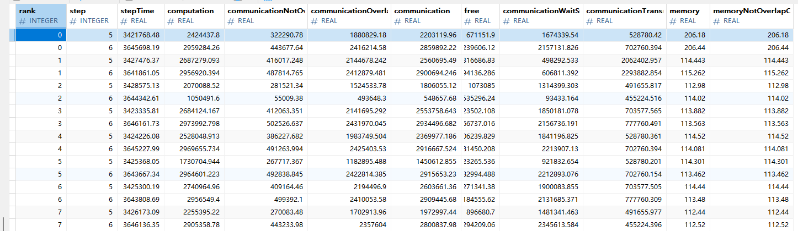

# cluster_time_summary

## 1. Overview

Large-scale cluster scenarios involve multiple compute nodes and massive amounts of data. Single-rank profile data statistics and analysis cannot evaluate the overall operational performance of a cluster.

The original deliverable `cluster_step_trace_time.csv` does not have a dedicated execution command, making it inconvenient to use. Additionally, it does not provide metrics such as memory copies. Therefore, enhancement is required.

Fine-grained cluster profile data breakdown (`cluster_time_summary`) provides a breakdown of iteration duration during cluster training. By analyzing the computation, communication, and memory copy durations, it helps users identify performance bottlenecks.

## 2. Preparations

**Environment Setup**

Install `msprof-analyze`. For details, see [msprof-analyze Installation Guide](../install_guide/msprof-analyze_install_guide.md).

**Data Preparation**

`msprof-analyze` requires an input directory containing the collected profile data. For instructions on how to collect such data, see [Preparations](./README.md#2-preparations).

## 3. Function

**Description**

Analyzes the collected cluster data by using the `cluster_time_summary` feature of `msprof-analyze`.

**Syntax**

```bash
msprof-analyze -m cluster_time_summary -d <cluster_data> [-o <output_path>]
```

**Command-line Options** 

| Option | Required (Yes/No) | Description |
| --- | --- | --- |
| -m | Yes | Specifies the analysis feature. Set it to `cluster_time_summary` to enable fine-grained cluster profile data breakdown. |
| -d | Yes | Specifies the parent directory of the cluster profile data files. |
| -o | No | Specifies the analysis result output directory. If not specified, results are saved to the directory specified by `-d`. |
| --export_type | No | Specifies the output file type. Valid values: `db` (default) or `text`. |

For details about more options, see [Command-line Options and Parameters](./README.md#51-command-line-options-and-parameters) of `msprof-analyze`.

**Example**

Perform fine-grained breakdown of cluster profile data.

```bash
msprof-analyze -m cluster_time_summary -d ./xxx/cluster_data -o ./xxx/output_path
```

**Output Description** 

- When `--export_type` is set to `db`, the `cluster_analysis_output/cluster_analysis.db` file is generated under the directory specified by `-o`, and the `ClusterTimeSummary` table is generated in this file.
- When `--export_type` is set to `text`, the `cluster_analysis_output/ClusterTimeSummary/cluster_time_summary_{timestamp}.csv` file is generated under the directory specified by `-o`.

For details about the output files, see [Output File Description](#4-output-file-description).

## 4. Output File Description

The following table describes the fields in the `ClusterTimeSummary` table.

**`ClusterTimeSummary`**



**Fields**

| Field                                     | Type   | Description                                          |
| ---------------------------------------- | ------- | ---------------------------------------------- |
| rank                                     | INTEGER | Rank ID                                        |
| step                                     | INTEGER | Iteration number                                    |
| stepTime                                 | REAL    | Total iteration duration                                  |
| computation                              | REAL    | Total computation duration of operators on the NPU                       |
| communicationNotOverlapComputation       | REAL    | Communication duration not overlapped by computation                      |
| communicationOverlapComputation          | REAL    | Overlap duration of computation and communication                        |
| communication                            | REAL    | Total communication duration of operators on the NPU                       |
| free                                     | REAL    | Idle duration (total iteration duration minus computation, communication, and copy durations)|
| communicationWaitStageTime               | REAL    | Total wait duration during communication                          |
| communicationTransmitStageTime           | REAL    | Total transmission duration during communication                          |
| memory                                   | REAL    | Copy duration                                    |
| memoryNotOverlapComputationCommunication | REAL    | Copy duration not overlapped by computation or communication                |

Time-related fields in the preceding table are in microseconds (μs).

Except for the header format, the data in `cluster_time_summary_{timestamp}.csv` is consistent with that in the .db file.

**Output Analysis**

* Identify performance bottlenecks by analyzing the proportions of computation, communication, memory copy, and idle durations.
* Compare duration metrics across ranks within the cluster to locate performance issues. For example, significant fluctuations in computation duration typically indicate inter-rank desynchronization or uneven compute rank performance. Excessive variance in communication duration suggests a need to prioritize troubleshooting for parameter plane network congestion or configuration anomalies.
* You can use `cluster_time_compare_summary` together with this feature to effectively locate the root cause of cluster performance deterioration.
