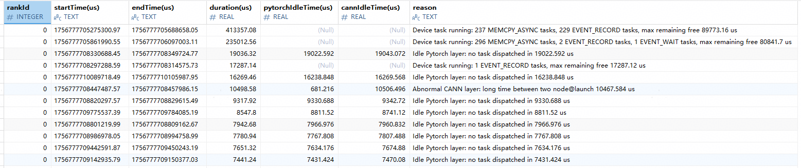

# free_analysis

## 1. Overview

Idle time cause analysis (`free_analysis`) provides automated analysis of significant idle blocks on the device to identify their root causes and help users troubleshoot performance issues. This feature can identify the following scenarios:

* Tasks are still being executed on the device but fall outside the scope of compute or communication statistics.
* The PyTorch layer has not dispatched tasks for an extended period (host- or framework-side idle period).
* The CANN layer exhibits abnormal dispatch or launch intervals or excessive node@launch durations.

## 2. Preparations

**Environment Setup**

Install `msprof-analyze`. For details, see [msprof-analyze Installation Guide](../install_guide/msprof-analyze_install_guide.md).

**Data Preparation**

`msprof-analyze` requires an input directory containing the collected profile data. For instructions on how to collect such data, see [Preparations](./README.md#2-preparations).

## 3. Function

**Description**

Analyzes the collected cluster data by using the `free_analysis` feature of the `msprof-analyze` tool to identify the longest idle period and its root cause in each rank.

**Syntax**

```bash
msprof-analyze -m free_analysis -d <cluster_data> [-o <output_path>] [--export_type <export_type>] [--top_num <top_num>]
```

**Command-line Options**

| Option| Required (Yes/No)| Description                                    |
| ---- | --------- |----------------------------------------|
| -m   | Yes     | Specifies the analysis feature. Set it to `free_analysis` to enable idle time cause analysis.        |
| -d   | Yes     | Specifies the parent directory of the cluster profile data files.                          |
| -o   | No     | Specifies the analysis result output directory. If not specified, results are saved to the directory specified by `-d`.                |
| --export_type | No| Specifies the output file type. The value can be `db` (default) or `text`.             |
| --top_num | No| Specifies the number of top idle periods to output for each rank (sorted by duration). The default value is `10`.|

For details about more options, see [Command-line Options and Parameters](./README.md#51-command-line-options-and-parameters) of `msprof-analyze`.

**Examples**

Analyze the cause of the idle period.

```bash
msprof-analyze -m free_analysis -d ./xxx/cluster_data -o ./xxx/output_path --top_num 10 --export_type text
```

**Output Description**

* When `--export_type` is set to `db`, a `cluster_analysis_output/cluster_analysis.db` file is generated in the output path. The `FreeAnalysis` table is generated within this file.
* When `--export_type` is set to `text`, the `cluster_analysis_output/FreeAnalysis/free_analysis.csv` file is generated in the output directory.

For details, see [Output File Description](#4-output-file-description).

## 4. Output File Description

### 4.1 `FreeAnalysis`



The following table describes fields in this table.

| Field| Description                                        |
| ---- |--------------------------------------------|
| rankId | Rank ID (`INTEGER` type)                       |
| startTime(us) | Start timestamp (`TEXT` type) of the idle period (μs)                 |
| endTime(us) | End timestamp (`TEXT` type) of the idle period (μs)                  |
| duration(us) | Duration (`REAL` type) of the idle period (μs)                  |
| pytorchIdleTime(us) | Idle time (`REAL` type) at the PyTorch layer (μs) (may be `0` or `NULL` when no data exists)|
| cannIdleTime(us) | Idle time (`REAL` type) at the CANN layer (μs) (may be `0` or `NULL` when no data exists) |
| reason | Analysis result (`TEXT` type)                      |

### 4.2 `free_analysis.csv`

The following table describes fields in this CSV file.

| Field| Description|
| ---- | ---- |
| Rank ID | Rank ID (`TEXT` type)|
| Start Time(us) | Start timestamp (`TEXT` type) of the idle period (μs)|
| End Time(us) | End timestamp (`TEXT` type) of the idle period (μs)|
| Duration(us) | Duration (`REAL` type) of the idle period (μs)|
| Pytorch Idle Time(us) | Idle time (`REAL` type) at the PyTorch layer (μs)|
| Cann Idle Time(us) | Idle time (`REAL` type) at the CANN layer (μs)|
| Reason | Analysis result (`TEXT` type)|
