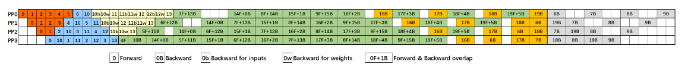
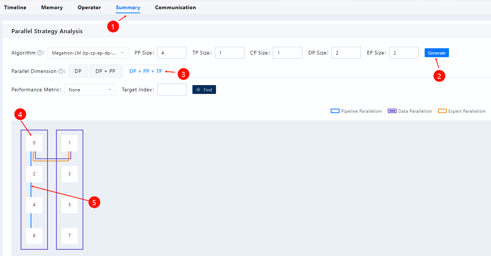

# pp_chart

## Overview

This document describes how to collect pipeline parallelism (PP) chart data, use MindStudio Profiler Analyze (msprof_analyze) to analyze the PP chart, and use MindStudio Insight to display the PP chart for data analysis.

The pp chart data analysis (`pp_chart`) feature provides a visual representation of the actual pipeline layout within the PP domain, enabling the analysis of global communication as well as key forward and backward durations. Currently, PP parallelism strategies for transformer models, such as `1F1B` and `DualPipeV`, cannot be visualized.

**Theoretical Visualization of 1F1B and DualPipeV**




## Preparations

**Environment Setup**

Install `msprof-analyze`. For details, see [MindStudio Profiler Analyze Installation Guide](../getting_started/install_guide.md).

**Data Preparation**

To collect forward and backward data by using MSTX APIs in Ascend PyTorch Profiler, first locate the forward and backward functions in the source code. The results are displayed on the **Ascend Hardware** track within the performance timeline.

If you require only the PP chart, set the `profiler_level` parameter to `Level_none`. To include forward and backward passes, communication, and `send` and `recv` correlations, set `profiler_level` to `Level1` or higher.

**Constraints**

* During data collection, set `export_type` to `db` and enable `mstx`.
* The code provided for the following two scenarios is for instrumentation reference only. You must accurately locate the forward and backward functions in your actual code and implement instrumentation using a decorator.

* If the project uses the Megatron framework, perform instrumentation as described in Scenario 1. If the project uses the MindSpeed framework, confirm whether the `DualPipeV` feature is enabled. If it is enabled, perform instrumentation as described in **Scenario 2**. If the framework cannot be clearly identified, locate the two core files related to instrumentation in your project. Add the corresponding instrumentation logic at the appropriate locations in these files to ensure all possible scenarios are covered.

**Scenario 1: Traditional Pipeline with `DualPipeV` Disabled**

1. Add the following code to `megatron/core/pipeline_parallel/schedules.py` after the definition of the `backward_step` function, as shown in the following example:

   ```python
   import torch_npu
   def step_wrapper(func, msg: str):
       def wrapper(*args, **kwargs):
           new_msg = {"name": msg}
           mstx_state_step_range_id = torch_npu.npu.mstx.range_start(str(new_msg), torch_npu.npu.current_stream())
           out = func(*args, **kwargs)
           if mstx_state_step_range_id is not None:
               torch_npu.npu.mstx.range_end(mstx_state_step_range_id)
               mstx_state_step_range_id = None
           return out
       return wrapper
   
   forward_step = step_wrapper(forward_step, "forward_step")
   backward_step = step_wrapper(backward_step, "backward_step")
   ```

2. Save the script file and perform training. After training is complete, profile data is generated in the specified output directory for subsequent analysis by `msprof-analyze`.

**Scenario 2: DualPipeV with Forward and Backward Code Located**

1. Add the following code to `mindspeed/core/pipeline_parallel/dualpipev/dualpipev_schedules.py` before the definition of the `forward_backward_pipelining_with_cutinhalf` function, as shown in the following example:

   ```python
   import torch_npu
   def step_wrapper(func, msg: str):
       def wrapper(*args, **kwargs):
           new_msg = {"name": msg}
           if msg == "forward_step_with_model_graph" and kwargs.get("extra_block_kwargs") is not None:
               new_msg["name"] = "forward_backward_overlaping"
           if "current_microbatch" in kwargs:
               new_msg["current_microbatch"] = kwargs["current_microbatch"]
           if msg == "WeightGradStore_pop" and len(WeightGradStore.cache) == 0:
               mstx_state_step_range_id = None
           else:
               mstx_state_step_range_id = torch_npu.npu.mstx.range_start(str(new_msg), torch_npu.npu.current_stream())
           out = func(*args, **kwargs)
           if mstx_state_step_range_id is not None:
               torch_npu.npu.mstx.range_end(mstx_state_step_range_id)
               mstx_state_step_range_id = None
           return out
       return wrapper
   
   forward_step_with_model_graph = step_wrapper(forward_step_with_model_graph, "forward_step_with_model_graph")
   forward_step_no_model_graph = step_wrapper(forward_step_no_model_graph, "forward_step_no_model_graph")
   backward_step_with_model_graph = step_wrapper(backward_step_with_model_graph, "backward_step_with_model_graph")
   backward_step = step_wrapper(backward_step, "backward_step")
   WeightGradStore.pop = step_wrapper(WeightGradStore.pop, "WeightGradStore.pop")
   ```

   If `DW` separation is not enabled for `DualPipeV`, adding this code enables the full display of all forward and backward phases of model execution. For details, see [Theoretical Visualization of 1F1B and DualPipeV](#overview). Without this code, the chart only displays whether the current phase is forward or backward.

   If MindSpeed is used without `MindSpeed-LLM` during profile data collection, add the `metadata` code after the `prof` definition (`prof = torch_npu.profiler.profile(...)`), as shown in the following example:

   ```python
   prof.add_metadata_json('pp_info', json.dumps(
       {
           'pp_type': 'dualpipev',
           'microbatch_num': 10,
       }
   ))
   # Calculate the value of microbatch_num using the following formula: microbatch_num = global_batch_size // micro_batch_size // data_parallel_size
   ```

   If `MindSpeed-LLM` is used, add the metadata code after `prof.add_metadata_json('distributed_args'...)` in `mindspeed-llm/training/training.py`, as shown in the following example:

   ```python
   prof.add_metadata_json('pp_info', json.dumps(
       {
           'pp_type': args.schedules_method,
           'microbatch_num': args.global_batch_size // args.micro_batch_size // args.data_parallel_size
       }
   ))
   ```

2. Save the script file and perform training. After training is complete, profile data is generated in the specified output directory for subsequent analysis by `msprof-analyze`.

## PP Chart Data Analysis

**Function**

Analyzes the collected profile data by using `msprof-analyze`.

**Precautions**

None

**Syntax**

```bash
msprof-analyze cluster -m pp_chart -d <cluster_data_path>
```

**Command-line Options**

| Option| Mandatory (Yes/No)| Description                                             |
| ---- | --------- | ------------------------------------------------- |
| -d   | Yes     | Specifies the directory for cluster data collected in [Data Preparation](#preparations).|

For details about more options, see [Command-line Options and Parameters](./README.md#command-line-options-and-parameters) of `msprof-analyze`.

**Example**

Run the following command to analyze data:

```bash
msprof-analyze cluster -m pp_chart -d ./cluster_data
```

**Output File Description**

After analysis is complete, the `StepTaskInfo` table is added to the `ASCEND_PROFILER_OUTPUT/ascend_pytorch_profiler_{rank_id}.db` file for each rank.

The following table describes the fields in the `StepTaskInfo` table.

| Field| Description|
| ------ | ---- |
| name    | Forward and backward information (`TEXT` type), corresponding to the color block name in the PP chart|
| startNs | Start time (`INTEGER` type) of the forward or backward task on the device|
| endNs   | End time (`INTEGER` type) of the forward or backward task on the device|
| type    | Type (`INTEGER` type) used to display different colors|

You do not need to focus on the specific meanings of these fields. The data can be displayed directly using MindStudio Insight. For details about the installation and operation of this tool, see [MindStudio Insight User Guide](https://gitcode.com/Ascend/msinsight).

Import the analyzed profile data into MindStudio Insight, click **Generate** on the **Summary** page, and configure the parameters as shown in the following figure.



The following figure shows the visualization result after the PP chart analysis is completed by using `pp_chart`.


