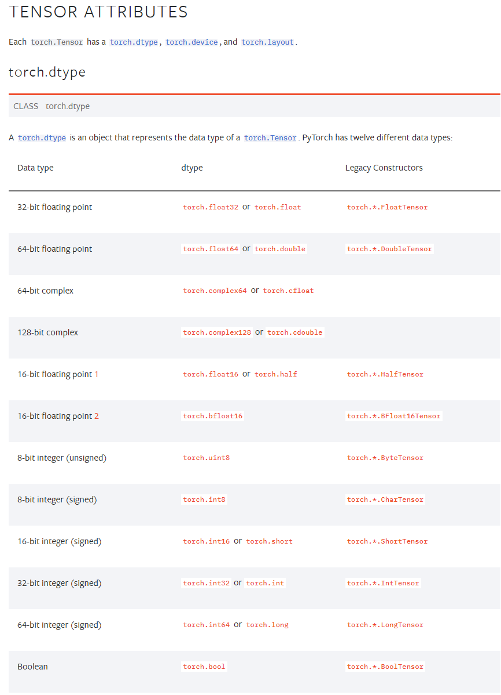
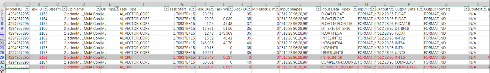
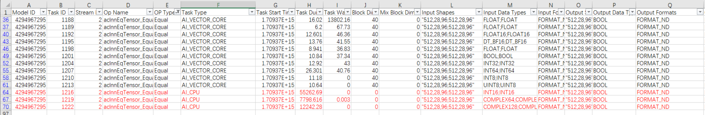
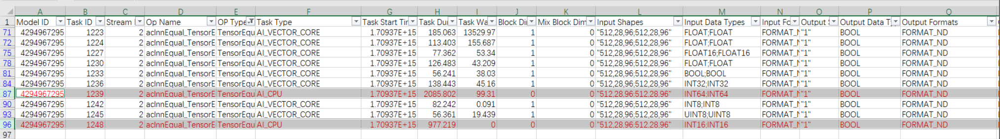
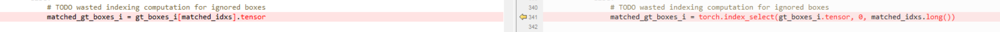
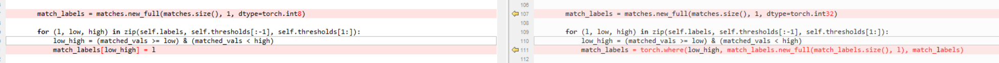
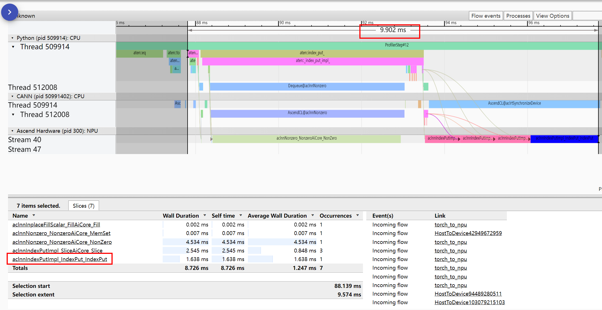
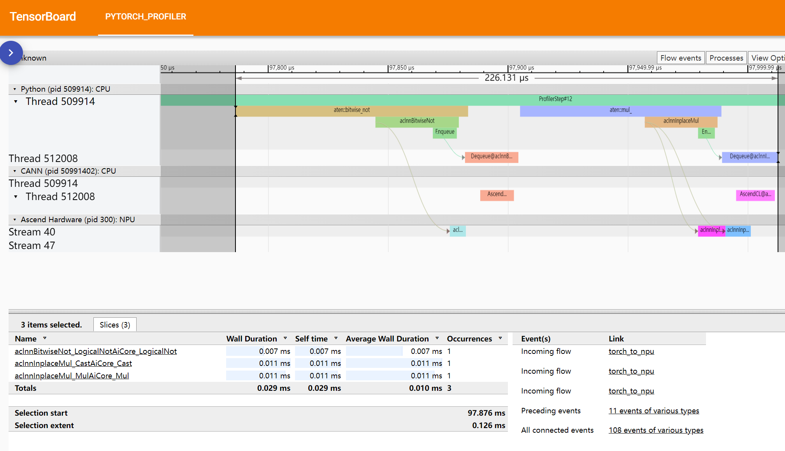
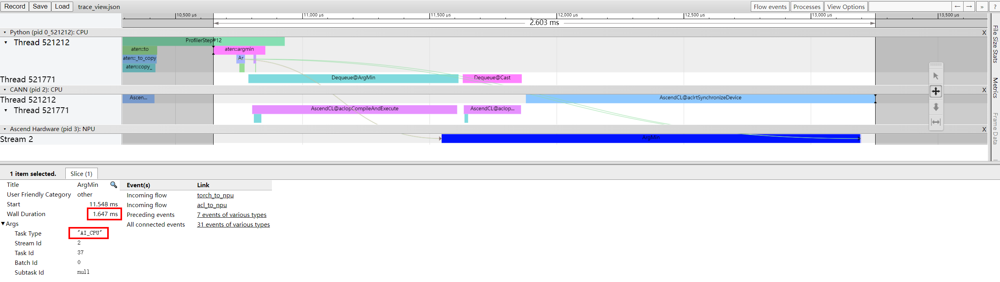
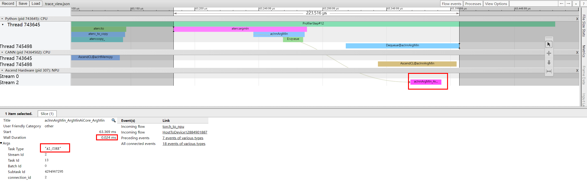

# AICPU Operator Replacement Examples

Some operators are executed on the AICPU of the Ascend chip due to data input type or operator implementation issues. Consequently, AICORE resources are not fully utilized, leading to poor compute performance and affecting training speed. In certain scenarios, you can modify the Python code to reduce these AICPU operators to improve training performance.

Currently, there are primarily two tuning methods for the identified AICPU operator issues:

- PyTorch data type conversion: Operators executed on the AICPU are converted into operators executed on AICORE units
- Equivalent operator replacement

## Type Conversion

PyTorch currently supports the following data types. For details, see [Tensor Attributes](https://pytorch.org/docs/stable/tensor_attributes.html).

**Figure 1** Data types supported by PyTorch



Perform single-operator tests on common operators such as `MUL`, `Equal`, and `TensorEqual` to identify which operators are executed on the AICPU. Then, try converting them to data types supported by AICORE units to improve efficiency.

### MUL

**Figure 2** Mul



Data types supported by AICORE:

```python
float, float32, float16, dt_bf16, int32, int64, int8, uint8, complex64
```

Data types supported by AICPU:

```python
int16, complex128
```

### Equal

**Figure 3** Equal



Data types supported by AICORE:

```python
float, float32, float16, dt_bf16, bool, int32, int64, int8, uint8
```

Data types supported by AICPU:

```python
int16, complex64, complex128
```

### TensorEqual

**Figure 4** TensorEqual



Data types supported by AICORE:

```python
float, float32, float16, dt_bf16, float64, bool, int32, int8, uint8
```

Data types supported by AICPU:

```python
int16, int64
```

## Equivalent Operator Replacement

### `Index` Operator Replacement

- Case 1: index by index

  This operation causes inconsistent input and output shapes. It can be directly replaced with `index_select` (`gatherV2`), which provides significantly higher compute performance on AICORE.

  **Figure 5** index by index

  

- Case 2: index_put by index

  ```python
  tensor[index] = 3
  ```

  Such operations should be avoided as there is no ideal alternative. Consider converting the index into a mask, or generating a mask as the initial index.

  If replacement is necessary, the scatter operator can be used. However, it has been observed that the number of indices is generally small in this scenario. Therefore, the index method may offer higher compute performance.

- Case 3: index\_put by mask

  ```python
  tensor_a[mask] = 3
  ```

  index_put by mask can be replaced by the `where` (`selectV2`) operator. Unlike the original semantics, this method returns a new tensor.

  **Figure 6** index_put by mask
  
  
  
  index by mask and index_put by mask are relatively friendly to the NPU and the framework. The key is to keep the shape unchanged to avoid calling `contiguous`, and then defer necessary index extraction to the final step. When the number of indices is small, the index operation is faster and may be preferable to replacement.

### `IndexPut` Operator Replacement

The `IndexPut` operator is used for tensor assignment and slicing. It is generally executed on the AICPU. These operations can be converted into equivalent tensor operations that are executed on Cube units, as shown in the following example:

```python
masked_input[input_mask] = 0
```

Recommended replacement:

```python
masked_input *= ~input_mask
```

In this case, `masked_input` is a `float` tensor, and `input_mask` is a boolean tensor or a 0/1 matrix with the same shape as `masked_input`. Since this is a 0-assignment operation, `input_mask` is bitwise inverted before the multiplication.

Taking 0-assignment as an example, the test on `float32` data with `shape = (512, 32, 64)` shows that the duration before replacement is 9.639978408813477 ms, while the duration after replacement is 0.1747608184814453 ms. As shown in the following figure, the total duration before replacement is 9.902 ms. The host delivers five operators to the device for execution, and `aclnnIndexPutImpl_IndexPut_IndexPut` is executed on the AICPU.

**Figure 7** Duration before replacement



After replacement, the total duration is 226.131 μs. Three operators are delivered, all of which are executed on AICORE.

**Figure 8** Duration after replacement



### `ArgMin` Operator Optimization

In CANN 6.3 RC2, the `ArgMin` operator is delivered to the AICPU for execution. In CANN 7.0 RC1, it is delivered to the AICORE for execution. In this case, you are advised to upgrade the CANN package version.

Testing on a tensor with `shape = (1024, 1024)` yields the following results: On CANN 6.3 RC2, the single-operator duration is 2.603 ms.

**Figure 9** Single-operator duration (CANN 6.3 RC2)



On CANN 7.0 RC1, the single-operator duration is 223.516 μs.

**Figure 10** Single-operator duration (CANN 7.0 RC1)



### `nonzero` Operator Optimization

Converting a mask to an index can be replaced by multiplication in certain calculations for any tensor where all values are greater than 0. For example, to sum a masked tensor, `tensor_a[mask].sum()` is equivalent to `(tensor_a * mask).sum()`.

For example:

```python
shape = (1024, )
mask= torch.randint(-1, 2, shape).npu()
tensor_a = torch.ones(shape).float().npu()
mask_inds = torch.nonzero(gt_inds > 0, as_tuple=False).squeeze(1)
tensor_sum = tensor_a[mask_inds].sum()
```

is equivalent to:

```python
shape = (1024, ) 
mask= torch.randint(-1, 2, shape).npu() 
tensor_a = torch.ones(shape).float().npu() 
mask_inds = torch.nonzero(gt_inds > 0, as_tuple=False).squeeze(1)
tensor_sum2 = (tensor_a * mask_inds2).sum()
```
