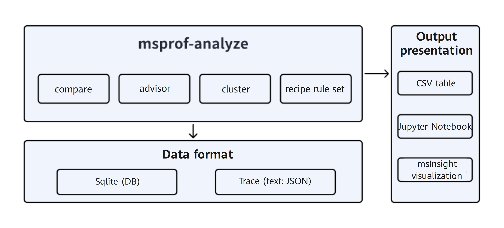
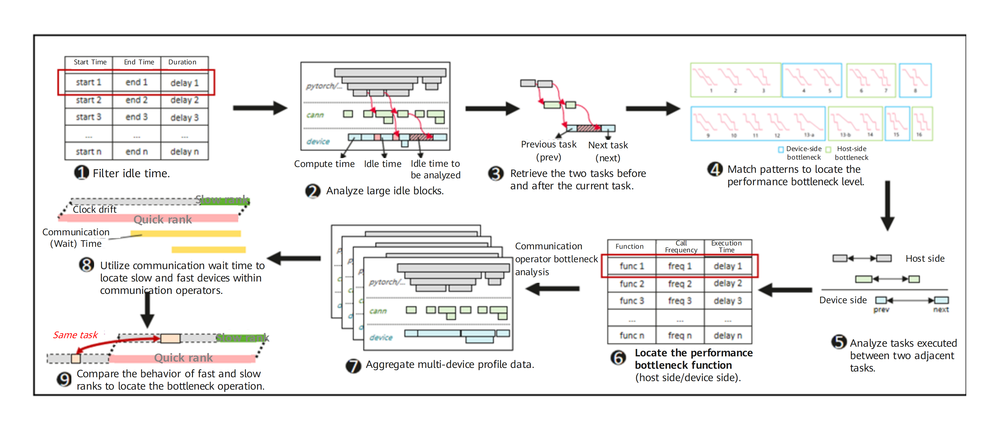
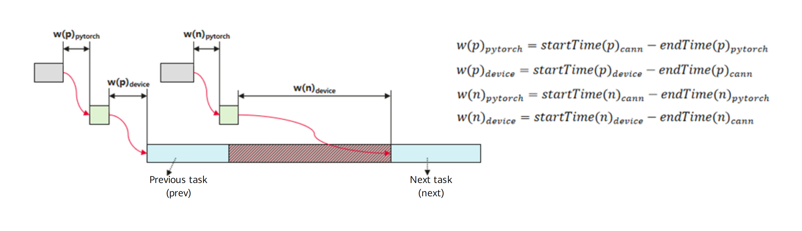
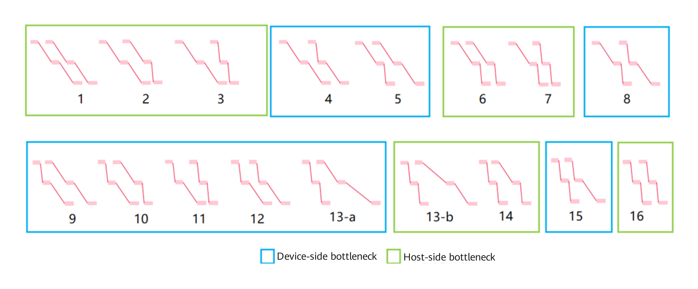
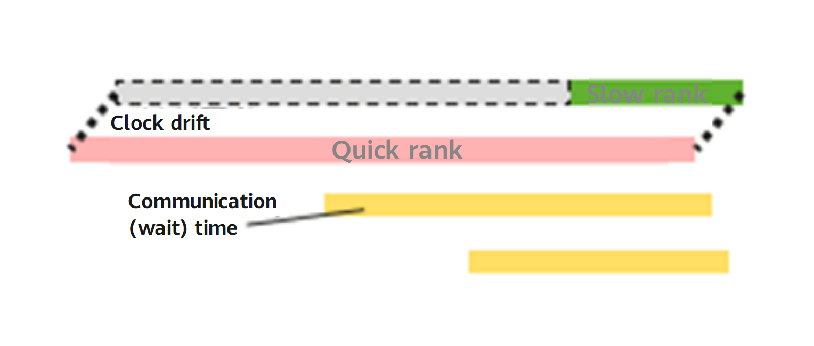
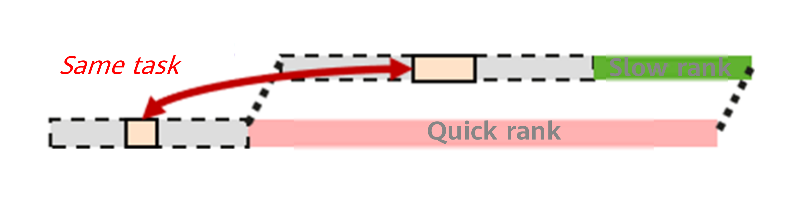

# MindStudio Profiler Analyze Feature Analysis and Design Specifications

<table>
    <tr>
        <td>SIG group:</td>
        <td>mstt-sig</td>
    </tr>
    <tr>
        <td>Target Version:</td>
        <td>MindStudio 26.0.0</td>
    </tr>
    <tr>
        <td>Designer:</td>
        <td>Chen Hao</td>
    </tr>
    <tr>
        <td>Date:</td>
        <td>2026.01.21</td>
    </tr>
</table>

Your replication, use, modification, and distribution of this document are governed by the Creative Commons Attribution-ShareAlike 4.0 International Public License (CC BY-SA 4.0).
You can visit [https://creativecommons.org/licenses/by-sa/4.0/](https://creativecommons.org/licenses/by-sa/4.0/) to view a summary of (not a substitute for) CC BY-SA 4.0.
For the complete CC BY-SA 4.0, visit [https://creativecommons.org/licenses/by-sa/4.0/legalcode](https://creativecommons.org/licenses/by-sa/4.0/legalcode).

**Change History**

<table>
    <tr>
        <th>Date</th>
        <th>Version</th>
        <th>Description</th>
        <th>Author</th>
        <th>Reviewer</th>
    </tr>
    <tr>
        <td>2026.01.21</td>
        <td>1.0</td>
        <td>Initial draft.</td>
        <td>Chen Hao</td>
        <td>Chen Hao</td>
    </tr>
</table>

# 1. Overview

MindStudio Profiler Analyze (msprof-analyze) primarily focuses on the analysis and processing of profile data. It consists of core modules such as `compare`, `advisor`, and `cluster` to support the identification of service performance bottlenecks.

## 1.1 Scope

## 1.2 Feature Requirement List

Table 1 List of feature requirements

<table>
    <tr>
        <th>Requirement No.</th>
        <th>Requirement</th>
        <th>Feature Description</th>
        <th>Remarks</th>
    </tr>
    <tr>
        <td>1</td>
        <td>Model performance breakdown and comparison</td>
        <td>Analysis and report of the model operator breakdown and comparison capability</td>
        <td></td>
    </tr>
    <tr>
        <td>2</td>
        <td>Host analysis</td>
        <td>Automatic identification of host bound performance issues</td>
        <td></td>
    </tr>
</table>

# 2. Requirement Scenario Analysis

## 2.1 Requirement Origin and Benefits

1. In terms of out-of-the-box performance breakdown and optimization of models, automated breakdown and comparison capabilities are required to improve the efficiency of performance tuning analysis.

2. Automated identification and analysis of host bound issues are required to quickly demarcate bottlenecks in foundation model and cluster scenarios.

## 2.2 Feature Scenario Analysis

Identify performance improvement directions based on out-of-the-box model performance and baseline versions.

## 2.3 Feature Impact Analysis

_Describe the position of the feature in the system and peripheral interfaces, as well as the key restrictions and conflicts with other features._

Interaction analysis with other requirements and features: Only the independent breakdown module of msprof-analyze is involved.

Platform difference analysis: Windows/Linux

Compatibility analysis: New module capabilities are added, and there is no compatibility issue.

Constraints: None

### 2.3.1 Hardware Restrictions

 | Product Type | Supported |
 | --- | --- |
 | Atlas A3 training products/inference products | Yes |
 | Atlas A2 training products/inference products | Yes |

### 2.3.2 Technical Restrictions

Operating system: Linux

Programming language: C/Python

### 2.3.3 Impact on Licenses

N/A

### 2.3.4 Impact on System Performance Specifications

Resources are allocated on demand, and there are no specific specification requirements.

### 2.3.5 Impact on System Reliability Specifications

N/A

### 2.3.6 Impact on System Compatibility

These are new features of msprof-analyze and do not involve compatibility impacts.

### 2.3.7 Impact on Interactivity and Conflicts with Other Major Features

N/A

## 2.4 Analysis on Solutions of Similar Community or Commercial Software

N/A

# 3. Feature/Function Implementation Principles (Decomposable into Multiple Use Cases)

## 3.1 Objectives

## 3.2 Overall Solution

msprof-analyze is a performance analysis tool of the MindStudio full-process toolchain. It performs analysis based on collected profile data to identify performance bottlenecks in AI tasks.

Figure 2: Overall solution of msprof-analyze

# 4. msprof-analyze supports breakdown, comparison, and automatic host bound analysis and identification

## 4.1 Design Rationale

Model the patterns of adjacent tasks by identifying idle time within the same communication group of a cluster to locate performance bottlenecks and improve automation efficiency through automatic identification.

## 4.2 Constraints

N/A

## 4.3 Detailed Implementation (Module- or Process-Level Message Sequence Diagrams from the User Entry)

Figure 3: Host bound issue identification process

The implementation details are as follows:

1. Calculate and filter NPU hardware idle time, focusing on large idle blocks.

2. Identify the level of the performance bottleneck for a large idle block, categorizing it as either a host-side or device-side bottleneck:

   1. Analyze the hardware tasks immediately preceding and following a large idle block, along with their corresponding CANN layer delivery operations and PyTorch layer tasks on the host.

   2. Calculate inter-layer latency based on the host-side delivery and hardware-side execution patterns of these two adjacent hardware tasks.

      

   3. Construct a behavioral pattern based on the inter-layer waiting durations of the adjacent tasks.

      

3. For host-side bottlenecks, analyze all PyTorch and CANN layer tasks occurring between the adjacent tasks and identify the PyTorch and CANN functions with the longest execution durations.

4. For device-side bottlenecks, analyze all device-side tasks executed between the adjacent tasks. Calculate a weighted latency by factoring in both the duration and frequency of these operations. The operation with the highest weighted latency is identified as the performance bottleneck.

5. For communication operator task-related bottlenecks, perform multi-rank joint analysis:

   1. Aggregate the communication execution durations for all ranks within the communication group. Identify the fastest and slowest ranks (those with the shortest and longest waiting durations, respectively). Align the completion timestamps of the communication tasks for both ranks to calibrate inter-rank clock drift.

      

   2. Analyze tasks on the slow rank during the waiting interval of the fast rank. Match corresponding tasks between the ranks, compare the latency deltas for identical tasks, and identify the task with the largest latency delta as the bottleneck operation for the slow rank.

      

## 4.4 Inter-Subsystem Interfaces (Mainly Module Interface Definitions)

_Describe which interface in which .h file is modified and briefly summarize the modification content._

## 4.5 Detailed Subsystem Design

For details, see section 4.3.

## 4.6 DFX Attribute Design

### 4.6.1 Performance Design

A new analysis capability and the profile data comparison and identification capabilities for local compute nodes are added to the module, with controllable performance impact.

### 4.6.2 Upgrade and Capacity Expansion Design

N/A

### 4.6.3 Exception Handling Design

N/A

### 4.6.4 Resource Management Design

N/A

### 4.6.5 Compact Design

N/A

### 4.6.6 Testability Design

N/A

### 4.6.7 Security Design

#### 4.6.7.1 Security Design Confirmation

_Confirm the security design by referring to the security design checklist._

| Security Attribute | Check Item | Description | Involved (Yes/No) | Satisfied (Yes/No) |
| --- | --- | --- | --- | --- |
| Access channel control | Whether any listening port is added                                            | If any listening port is added, update the communication matrix.                                  | No   |      |
| Access channel control| Whether any process or inter-component communication method is added                                    | If any process or inter-component communication method is added, update the communication matrix.                            | No   |      |
| Access channel control| Whether any authentication mode is added                                            | If any authentication mode is added, update the communication matrix and product documentation.                        | No   |      |
| Permission control    | Whether any file or directory needs to be created                                      | If any file or directory needs to be created, explicitly specify the access permission of the file or directory.                | Yes   | Yes   |
| Permission control    | Whether the account permission meets the principle of least privilege                            | Assign the minimum permissions to each account in the system.                                  | No   |      |
| Permission control    | Whether user privilege escalation exists                                        | User privilege escalation is prohibited.                                    | No   |      |
| Undisclosed interface  | Whether any grand unified configuration (GUC) parameter is added                                             | If any GUC parameter is added, update the product documentation.                                   | No   |      |
| Undisclosed interface  | Whether any function, view, or system table is added or modified                            | If any function, view, or system table is added or modified, update the product documentation and consider updating the permission control policy.    | Yes   | Yes   |
| Undisclosed interface  | Whether any SQL syntax is added                                             | If any SQL syntax is added, update the product documentation and add support for recording audit logs.                 | No   |      |
| Undisclosed interface  | Whether any internal tool is added                                            | If any internal tool is added, update the product documentation.                                  | Yes   | Yes   |
| Undisclosed interface  | Whether the script contains commented-out code                                      | Commented-out code is prohibited in interpreted languages such as Shell and Python and must be deleted.      |   No  |      |
| Undisclosed interface  | Whether there are hidden access methods such as commands, parameters, and ports                      | Access methods such as commands, parameters, and ports (including but not limited to those for product production, commissioning, and maintenance) that are not used during live network maintenance must be deleted (for example, by using compilation macros).|   No  |      |
| Undisclosed interface  | Whether the system has hidden backdoors                                        | No undocumented accounts may be reserved in the system. All accounts must be manageable by the system and documented accordingly.|   No  |      |
| Undisclosed interface  | Whether any cracking or network sniffing tool is provided in the software (including software packages and patch packages) released to external users| 1. Do not provide any function or tool that can change user passwords, perform exhaustive password search (including malicious cracking of passwords by exploiting system or algorithm vulnerabilities), or decrypt files containing sensitive data (such as configuration files and databases containing keys) in the software (including software packages and patch packages) released to external users. 2. Third-party network sniffing tools (such as tcpdump, gdb, strace, and readelf), debugging tools (such as cpp, gcc, dexdump, and mirror), JDK development or compilation tools, and proprietary debugging tools and scripts (such as encryption/decryption scripts, debugging functions, and privilege escalation commands) used only for commissioning must not be retained in the system. If retention is required for service needs, strict access control must be enforced. The scenarios, risks, and reasons for keeping them must also be explained in the product documentation.|   No  |      |
| Sensitive data protection| Whether authentication credentials are encrypted before being stored in the system              | Authentication credentials (such as passwords and private keys) must be encrypted for storage in the system.|   No  |      |
| Sensitive data protection| Whether keys for encrypting sensitive data during transmission are hard-coded            | Hard-coded passwords and keys are prohibited.                                      |  No   |      |
| Sensitive data protection| Whether sensitive information such as passwords or keys is recorded in plaintext                            | It is prohibited to display sensitive information (including passwords, private keys, and pre-shared keys) in plaintext in logs stored in the system, debugging information, error messages, and ps commands.|   No  |      |
| Sensitive data protection| Whether passwords are displayed in plaintext in command output                                            | It is prohibited to display passwords in plaintext in command output.                                          |   No  |      |
| Sensitive data protection| Whether the default passwords of third-party and open source software are used                          | It is prohibited to use the default passwords of third-party and open source software. For details, see section 1.5 in the _Security Design Guide_.|  No   |      |
| Sensitive data protection| Whether passwords are stored in plaintext in configuration files                              | Passwords must not be written into configuration files in plaintext (except for scenarios where passwords must be specified during the installation, deployment, and use of the CLI tool).|   No  |      |
| Sensitive data protection| Whether any insecure encryption algorithm is used                                    | It is prohibited to use proprietary or insecure encryption algorithms known in the industry. For recommended encryption algorithms, see section 6.2 in _Security Design Guide_.|   No  |      |
| Sensitive data protection| Whether sensitive information such as passwords is transmitted through secure channels                        | Sensitive information must be transmitted through secure channels or encrypted before transmission on untrusted networks. For details, see chapter 10 in _Security Design Guide_.|   No  |      |
| Sensitive data protection| Whether sensitive information such as passwords and keys in the memory is destroyed after use                    | Sensitive information such as passwords and keys in the memory must be cleared immediately after use                 |   No  |      |
| Sensitive data protection| Whether random numbers used by cryptographic algorithms are cryptographically secure    | Random numbers used by cryptographic algorithms must be cryptographically secure. For details, see section 6.3 in _Security Design Guide_.|   No  |      |
| Sensitive data protection| Whether there are insecure examples in the documentation                                  | Examples in the documentation must be secure and provide correct guidance for users. If there are potential risks in the examples, describe the risks in the documentation.|   No  |      |
| Authentication        | Whether an authentication mechanism is provided                                            | An authentication mechanism must be provided and enabled by default for the new system.                          |   No  |      |
| Authentication        | Whether authentication is performed on the server                                        | Authentication must be performed on the server.                              |   No  |      |
| Authentication        | Whether the server returns valid information upon an authentication failure                            | Upon an authentication failure, the server must return detailed information of the failure to help the user locate the cause of the failure.|   No  |      |
| External parameter verification| Whether the validity of external input is verified                                | 1. The use of external input data as parameters such as loop termination conditions, array indices, and memory allocation sizes may lead to system behaviors such as infinite loops, buffer overflows, memory out-of-bounds access, and denial of service. 2. The validity of external input such as file paths must be verified to prevent injection risks.|   No  |      |
| Third-party component introduction  | Whether any new third-party component is introduced                                          | 1. New third-party components must pass security compilation options, virus and vulnerability scanning, open source snippet detection, license compliance checks, and open source component scanning. For details, see the network security requirements for version releases. 2. Ensure new third-party components originate from trusted sources.|  No   |      |

#### 4.6.7.2 Sensitive Data Analysis

##### 1. Sensitive data list

_The specific scope of sensitive data depends on the application scenario of the system. Designers must determine this scope through risk assessment. Typical sensitive data includes authentication credentials (such as passwords) and keys._

| **Data Field**   | **Description**         | **Data Field Sensitivity**| **Associated Processing Module**| **Mandatory Operations**            | **Prohibited Operations**|
| --------------- | ---------------------- | ------------------ | ---------------- | -------------------------- | -------------- |
| Administrator account and password| System administrator account and password| High                | Login and authentication       | Encrypted transmission, encrypted storage, and anonymization| Command output and logging   |
| ...             | ...                    | ...                | ...              | ...                        | ...            |
|                 |                        |                    |                  |                            |                |

##### 2. Sensitive operation check

_(1) Lifecycle dimension_
_For identified sensitive data, identify its lifecycle, covering the processes of generation, use, transmission, persistence, and destruction, to avoid unintentional omissions in subsequent risk identification._
_(2) High-risk processes_
_Identify whether high-risk processes exist during the handling of sensitive data. Typical high-risk processes include printing, command output, storage, hard-coding, and the use of insecure algorithms. From an information processing perspective, these high-risk processes are prone to security vulnerabilities when handling sensitive data and require detailed inspection. All identified sensitive data items must be checked. The sensitive data check matrix is as follows:_

For example, in a typical web system, the check results of the identified sensitive data (administrator account and password) in its lifecycle are as follows:

- Generation: The administrator sets the password upon the first login.
- Use: The administrator uses the password for authentication when logging in to the system.
- Transmission: After the administrator enters the login password on the client, the password is transmitted to the server through the network.
- Persistence: After the administrator sets the password for the first time, the server persists the password in the backend database.
- Destruction: After a certain period, the administrator must change the password and the old password is deleted.

|            |                             Generation                            |                  Use                 |                        Transmission                       |       Persistence      |                 Destruction                |
| :--------: | :----------------------------------------------------------: | :------------------------------------: | :------------------------------------------------: | :----------------: | :----------------------------------: |
|    Printing   |                            N/A                           | During the use, the password is not printed in any form.| Encryption is not required for secure transmission channels. Data is encrypted for transmission on insecure transmission channels.|       N/A      | During the destruction, the password is not printed, but the operation log must be recorded.|
|    Command output   |            Passwords are displayed as asterisks (*) in the command output on the client.            |                 N/A                |                       N/A                      |       N/A      |                N/A               |
|    Storage   | After a user enters the password, the password is encrypted using a secure encryption algorithm and saved to the backend database.|               Same as that for [Generation]              |                       N/A                      | Encrypted storage in the backend database|    Delete the corresponding password from the backend database table.    |
|   Hard coding  |                            N/A                           |                 N/A                |                       N/A                      |       N/A      |                N/A               |
| Insecure algorithm|                  Use a secure algorithm (AES256) for encryption.                 |            Employ in-memory decryption during use.           |           Use secure encryption algorithms for non-secure transmission channels.          |     Same as that for [Generation]    |                N/A               |

#### 4.6.7.3 Design Implementation

_Describe the overall security design solution, detailed implementation, and interface definition._

## 4.7 External Interfaces

N/A

## 4.8 Self-test Case Design

N/A

# 5. Reliability and Availability Design

## 5.1 Redundancy Design

_Redundancy considered in feature design is primarily the redundancy design of the system. In feature design, consider information such as mirror backup, configuration parameter backup, and data synchronization between the active and standby redundant systems._

_During feature design, the following must be provided: a list of key configuration parameters for backup; the time, policy, and key data list for data synchronization between active and standby systems; a data verification mechanism, dirty data handling policy, and backup recovery policy for active/standby switchover._

_For image-based backups such as snapshot and checkpoint mechanisms, the backup cycle, data verification mechanism, dirty data handling policy, and recovery policy must be specified. For features that significantly impact system performance, design constraints must be defined._

## 5.2 Fault Management

_Fault management includes fault detection, fault isolation, fault locating, fault recovery, and correlation design._

_Fault management of a feature primarily involves feature-specific fault detection, alarm and log design, fault recovery mechanism, and fault interface design._

_Key design principles for fault management include:_

1. _Comprehensive and rapid fault detection: covers the detection scope, backup detection, detection speed, and impact._
2. _Failure impact control: involves the division of isolation domains by multiple planes, granularities, and isolation units._
3. _Rapid fault recovery: involves automatic recovery, preferential recovery, hierarchical reset, decoupled recovery, and layered protection._

_Common fault management design modes include rollback mode, fault bypass mode, circuit breaker mode, and isolation cabin mode._

## 5.3 Overload Control Design

_In overload control design of a feature, consider the following elements: feature-specific service traffic detection, detection points, service discard points, response messages upon service discard, and bidirectional interactions (including caller/callee relationships and interfaces) with the unified overload control mechanism._

_The simple overload control mechanism of a feature typically adopts the rate limiting approach, which requires configuration of the rate limiting location, default rate limit value, logs, and alarms._

_Common overload control design principles include dynamic rate limiting, elastic scaling, load balancing before traffic control, early-stage control, priority assurance, and graceful degradation:_

1. _Early-stage control: When the system is overloaded, restrict service access at the front-end or early-stage processing modules to avoid unnecessary performance overhead from intermediate control._
2. _Priority assurance: When the system is overloaded, ensure high-priority services obtain resources and get processed first to maximize social benefits._
3. _Graceful degradation: Implement non-core service degradation and core function preservation to minimize user experience degradation._

## 5.4 Hitless Upgrade

Offline Python processing module script, which is not involved in service process running and does not involve terminal service upgrade scenarios.

## 5.5 Human Error-Prevention Design

_Human error-prevention design primarily focuses on mitigating risks associated with human-machine interface errors related to commands, operations, configuration files, and data. The following aspects are considered in general:_

1. _High-risk prompts and double confirmation are required for deletions and destructive modifications, with the page focus defaulting to **Cancel**. This applies to all user-visible interfaces (CLI and Web), including command interfaces provided by open source components.
2. _Before restarting a node, the system must first check if it will impact customer VMs and provide clear operational suggestions._
3. _Audit logs must be recorded for all high-risk operations._
4. _Prevention and recovery measures, including preventing configuration and hardware errors, performing pre-operation system checks, and enabling quick rollback after errors occur._

_The general design principles for human error prevention include:_

1. _Role restriction: Restrict configuration permissions by role to prevent errors resulting from unauthorized access or actions._
2. _Configuration verification: Implement a configuration validation mechanism to ensure that necessary checks are performed before configurations take effect, preventing erroneous settings from being applied._
3. _Backup and restoration: Design a configuration data backup and restoration mechanism to ensure that the system can quickly restore to a valid state in the event of a configuration error._

## 5.6 Fault Prediction and Prevention Design

_Provide necessary data collection and statistical interfaces for the feature to support the fault prediction and prevention mechanisms of the system, such as drive space detection._

# 6. Non-functional Quality Attribute Design

## 6.1 Testability

_Focus on the test scope and specifications of the feature. Define the specific aspects to be tested and identify critical boundary values, invalid values, and exception scenarios for test personnel to consider._

## 6.2 Serviceability

_Provide extensive maintainability and serviceability measures for the feature, along with comprehensive documentation covering usage, maintenance, and troubleshooting._

## 6.3 Evolvability

_Focus on the feature architecture and functional evolvability._

## 6.4 Openness

_Focus on the openness of external interfaces for the feature, including adherence to specifications such as the SQL:2011 standard._

## 6.5 Compatibility

_Focus on whether the feature affects the forward compatibility of the system—specifically, whether existing functions remain usable after upgrading to future versions and whether their behavior remains consistent with previous versions._

## 6.6 Scalability

_Describe whether the feature effectively meets system capacity requirements, including the scaling of database nodes and database servers._

## 6.7 Maintainability

_Focus on the maintainability of the feature, such as diagnostic views and logging._

## 6.8 Documentation

_Refer to the following table to evaluate changes to various documentation related to the feature and describe the specific changes._

<table>
    <tr>
        <th>Category</th>
        <th>Document Name</th>
        <th>Involved or Not (Y/N)</th>
        <th>Change or New Content Description</th>
    </tr>
    <tr>
        <td>White Paper</td>
        <td>Technical White Paper</td>
        <td>N</td>
        <td>Added the XX technology to section XX.</td>
    </tr>
    <tr>
        <td rowspan="8">Product Documentation</td>
        <td>Product Description</td>
        <td>Y</td>
        <td>Updated the technical indicators to XX</td>.
    </tr>
    <tr>
        <td>Feature Description</td>
        <td>Y</td>
        <td>Added the XX feature.</td>
    </tr>
    <tr>
        <td>Compilation Guide</td>
        <td>Y</td>
        <td>XXX</td>
    </tr>
    <tr>
        <td>Installation Guide</td>
        <td>Y</td>
        <td>Updated the XX scenario in the cluster installation section.</td>
    </tr>
    <tr>
        <td>Administrator Guide</td>
        <td>N</td>
        <td>XXX</td>
    </tr>
    <tr>
        <td>Developer Guide (including development tutorials, SQL reference, system tables and views, GUC parameters, error codes, and API reference)</td>
        <td>Y</td>
        <td>Added the XXX function to section XX.</td>
    </tr>
    <tr>
        <td>Tool Reference</td>
        <td>Y</td>
        <td>Added the XX tool.</td>
    </tr>
    <tr>
        <td>Glossary</td>
        <td>Y</td>
        <td>Added the term XX</td>.
    </tr>
    <tr>
        <td>Getting Started</td>
        <td>Simple Tutorials</td>
        <td>N</td>
        <td>XXX</td>
    </tr>
</table>

# 7. (Optional) Data Structure Design

_This section is optional. Describe the database structure design (including database system table structures, which can be generated using Power Designer) in this section._
