# advisor

## Overview

The expert suggestion (`advisor`) feature analyzes profile data collected by using Ascend PyTorch Profiler or MindSpore Profiler and provides performance tuning suggestions.

For details about how to collect profile data by using Ascend PyTorch Profiler, see [Ascend PyTorch Profiler](https://gitcode.com/Ascend/pytorch/blob/v2.7.1/docs/zh/ascend_pytorch_profiler/ascend_pytorch_profiler_user_guide.md). For details about how to collect profile data using MindSpore Profiler, see [Performance Profiling](https://www.mindspore.cn/mindinsight/docs/en/r2.3/performance_profiling_ascend.html).

## Preparations

**Environment Setup**

* To use the `advisor` feature through the CLI, you must install MindStudio Profiler Analyze (`msprof-analyze`). For details, see [msprof-analyze Installation Guide](../getting_started/install_guide.md).
* Using the `advisor` feature through Jupyter Notebook requires the following preparations:

  1. Install Jupyter Notebook. For details about how to install and use Jupyter Notebook, visit the Jupyter Notebook official website.

  ```bash
  pip install jupyter notebook
  ```

  2. Download the `msprof-analyze` source code.

   ```bash
   git clone https://gitcode.com/Ascend/msprof-analyze
   ```

**Data preparation**

`msprof-analyze` requires an input directory containing the collected profile data. For instructions on how to collect such data, see [Data Preparation](../getting_started/profiling_data_guide.md).

**Constraints**

- CANN versions earlier than 8.0RC1 support only text format analysis. CANN 8.0RC1 and later versions support both `text` and `db` formats.
- Jupyter Notebook is not supported for MindSpore.

## `advisor` Functions (CLI)

**Function**

The `msprof-analyze advisor` command line includes the following subcommands:

- all

  Analyzes overall performance bottlenecks: including all functions listed in the following table.

- computation

  Analyzes compute bottlenecks: including the `computation` and `Kernel compare` functions in the following table.

- schedule

  Analyzes scheduling bottlenecks: including the `schedule` and `API compare` functions in the following table.

The following table describes the complete functions of `advisor`, which are controlled by `all`, `computation`, and `schedule`.

| dimension  | mode                                  | Description                                                                               | Supported Scenario                        |
| ---------- |---------------------------------------|-------------------------------------------------------------------------------------| ------------------------------------ |
| overall    | Overall Summary                       | Breaks down profile data by dimensions such as computation, communication, and idle time.                                                               | PyTorch, MindSpore|
|            | Environment Variable Issues | Recommends environment variable settings.                                                                           | PyTorch |
|     | slow rank                             | Identifies slow ranks.                                                                               | PyTorch, MindSpore           |
|            | slow link                             | Identifies slow links.                                                                              | PyTorch, MindSpore         |
| computation | AICPU Issues              | Identifies AICPU issues for performance tuning.                                                                           | PyTorch, MindSpore         |
|            | Operator Dynamic Shape Issues | Identifies dynamic-shape operators.                                                                        | PyTorch   |
| | AI Core Performance Analysis | Analyzes the performance of MatMul, FlashAttentionScore, AI_VECTOR_CORE, and MIX_AIV operators.                          | PyTorch |
|            | Block Dim Issues                   | Identifies Block Dim operator issues for performance tuning.                                                                      | PyTorch, MindSpore  |
|            | Operator No Bound Issues     | Analyzes operator bottlenecks.                                                                             | PyTorch, MindSpore|
|            | Fusion Issues                    | Analyzes operator fusion issues for graph tuning.                                                                            | PyTorch, MindSpore      |
|            | AI Core Frequency Issues | Analyzes AI Core operator frequency reduction issues.                                                                      | PyTorch, MindSpore|
|communication| Packet Analysis                       | Detects small communication packets.                                                                             |PyTorch, MindSpore                         |
|| Bandwidth Contention Analysis | Detects bandwidth contention between communication and computation.                                                                         |PyTorch, MindSpore|
|| Communication Retransmission Analysis | Detects communication retransmission.                                                                             |PyTorch, MindSpore|
|| Byte Alignment Analysis | Detects byte alignment for communication operators. For communication operators using the SDMA transmission type, the data volume must be a multiple of 512 bytes to prevent bandwidth degradation.                                 |PyTorch, MindSpore|
| schedule | Affinity API Issues     | Analyzes affinity API replacement for performance tuning                                                                          | PyTorch, MindSpore    |
|            | Operator Dispatch Issues   | Identifies operator delivery issues (path 3/path 5).                                                                  | PyTorch |
| | SyncBatchNorm Issues | Detects BatchNorm synchronization issues.                                                                      | PyTorch, MindSpore|
| | Synchronize Stream Issues | Detects stream synchronization issues.                                                                              | PyTorch, MindSpore|
| | GC Analysis | Identifies abnormal garbage collection events. This feature requires enabling `gc_detect_threshold` under `experimental_config` during data collection using Ascend PyTorch Profiler.| PyTorch |
| | Fusible Operator Analysis | Detects operator sequences with host or MTE bottlenecks for code optimization or the development of fusion operators.                                             | PyTorch, MindSpore|
| dataloader | Slow Dataloader Issues | Detects abnormal DataLoaders.                                                                     | PyTorch, MindSpore|
| memory | Memory Operator Issues | Identifies abnormal memory allocation and release operations.                                                                      | PyTorch, MindSpore|
| comparison | Kernel compare of Rank\* Step\* and Rank\* Step\* | Identifies the kernel data of the benchmark and that of the profile data to be compared. In scenarios without a benchmark, it compares fast and slow ranks within a cluster. In scenarios with a benchmark, it compares identical ranks across clusters with significant performance gaps.      | PyTorch, MindSpore|
|  | Api compare of Rank\* Step\* and Rank\* Step\* | Identifies the API data of the benchmark and that of the profile data to be compared. In scenarios without a benchmark, it compares fast and slow ranks within a cluster. In scenarios with a benchmark, it compares identical ranks across clusters with significant performance gaps.         | PyTorch |

The tool automatically performs cluster and overall `environment_variable_analysis` in cluster scenarios, whereas it performs only the overall analysis in single-rank scenarios.

**Precautions**

None

**Syntax**

- Overall performance bottlenecks

  ```bash
  msprof-analyze advisor all -d <profiling_path> [-bp <benchmark_profiling_path>] [-o <output_path>] [-cv <cann_version>] [-tv <torch_version>] [-pt <profiling_type>] [--force] [-l <language>] [--debug] [-h]
  ```

- Compute bottlenecks

  ```bash
  msprof-analyze advisor computation -d <profiling_path> [-o <output_path>] [-cv <cann_version>] [-tv <torch_version>] [-pt <profiling_type>] [--force] [-l <language>] [--debug] [-h]
  ```

- Scheduling bottlenecks

  ```bash
  msprof-analyze advisor schedule -d <profiling_path> [-o <output_path>] [-cv <cann_version>] [-tv <torch_version>] [--force] [-l <language>] [--debug] [-h]
  ```

**Command-line Options**

| Option                              | Mandatory (Yes/No)| Description                                                        |
| ---------------------------------- | --------- | ------------------------------------------------------------ |
| -d<br>--profiling_path             | Yes     | Specifies the path to the profile data file or directory. For Ascend PyTorch Profiler, set this option to the `*_ascend_pt` profile data result directory. For MindSpore Profiler, set it to the `*_ascend_ms` profile data result directory. For cluster data, set it to the parent directory of `*_ascend_pt` or `*_ascend_ms`.|
| -bp<br>--benchmark_profiling_path | No     | Specifies the directory containing the benchmark profile data used for performance comparison. The profile data is obtained using the profiling tool.<br>**This option is not supported by the `computation` or `schedule` subcommands.**|
| -o<br>--output_path               | No     | Specifies the output path for analysis results. After the `advisor` analysis is complete, the results are saved to this directory. This option defaults to the current directory if not specified.|
| -cv<br>--cann_version             | No     | Specifies the CANN software version corresponding to the profiling tool used for data collection. Supported compatible versions are 6.3.RC2, 7.0.RC1, 7.0.0, and 8.0.RC1. If this option is not specified, 8.0.RC1 is used by default. Profile data collected using other CANN versions may cause unpredictable issues during analysis. You can obtain the version by running the following command and checking the version field: `cat /usr/local/Ascend/cann/aarch64-linux/ascend_toolkit_install.info`.|
| -tv<br>--torch_version            | No     | Specifies the PyTorch version of the runtime environment. The default value is `1.11.0`. Supported versions are `1.11.0` and `2.1.0`. If the runtime uses a different version (such as `1.11.3`), you can ignore minor version differences and select the closest supported version (such as `1.11.0`).|
| -pt<br>--profiling_type           | No     | Specifies the type of the profiling tool used for profile data collection. Valid values:<br>        `pytorch` (default): used for profile data collected using the Ascend PyTorch Profiler API.<br>        `mindspore`: used for profile data collected using the MindSpore Profiler API.<br>        `mslite`: used for profile data collected using the [Benchmark](https://gitee.com/ascend/tools/tree/master/ais-bench_workload/tool/ais_bench) tool (not recommended).<br>**This option is not supported by the `schedule` subcommand.**|
| --force                            | No     | Forcibly executes `advisor`. This option forcibly skips the following checks:<br>        Ownership check: Proceed even if the current user is not the owner of the specified directory or files.<br>        File size check: Proceed even if a CSV file exceeds 5 GB, a JSON file exceeds 10 GB, or a DB file exceeds 8 GB.<br>Specifying this option enables forced execution, which is disabled if not specified.|
| -l<br>--language                  | No     | Specifies the output language for the analysis results. Valid values:<br>        `cn` (default): Chinese<br>        `en`: English|
| --debug                            | No     | Enables detailed stack trace printing if a tool error occurs. Specifying this option enables debug mode, which is disabled if not specified.|
| -h, -H<br>--help                  | No     | Displays help information for the subcommands and parameters of the current command.    |

**Examples**

   - Overall performance bottlenecks

     ```bash
     msprof-analyze advisor all -d $HOME/profiling_data/
     ```

   - Compute bottlenecks

     ```bash
     msprof-analyze advisor computation -d $HOME/profiling_data/
     ```

   - Scheduling bottlenecks

     ```bash
     msprof-analyze advisor schedule -d $HOME/profiling_data/
     ```

   In single-rank scenarios, specify the `*_ascend_pt` or `*_ascend_ms` directory of the profile data. In multi-rank and cluster scenarios, specify the parent directory of `*_ascend_pt` or `*_ascend_ms`.

**Output Description**

- Brief analysis suggestions are displayed in the terminal, and `mstt_advisor_{timestamp}.html` and `mstt_advisor_{timestamp}.xlsx` files are generated for preview.
- The content of the `mstt_advisor_{timestamp}.xlsx` file is identical to the terminal output.
- For details about the analysis of the `mstt_advisor_{timestamp}.html` file, see [Output File Description](#output-file-description).
- The following examples show the content format of the command output.
  
   Overall performance bottlenecks
   
   
   
   Compute bottlenecks
   
   
   
   Scheduling bottlenecks
   
   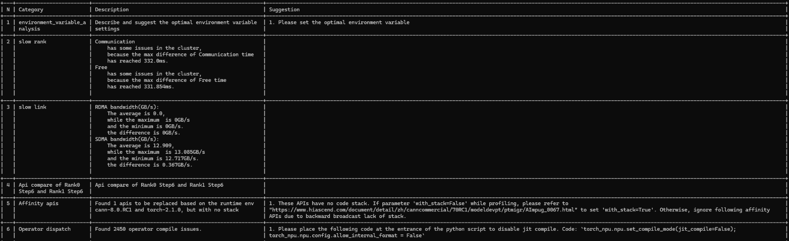

## `advisor` Functions (Jupyter Notebook)

1. Go to the `msprof_analyze/advisor` directory and run the following command to start Jupyter Notebook:

   ```bash
   jupyter notebook
   ```

   If the command is executed successfully, the browser automatically opens the `msprof_analyze/advisor` directory, as shown in the following example.

   

   In a Linux environment, the command output displays the URL for the Jupyter Notebook page. Copy this URL and open it in a browser to access the Jupyter Notebook interface. When using a remote server, replace the domain name `localhost` with the server IP address.

2. Open the required .ipynb file and copy the path to the profile data collected by Ascend PyTorch Profiler. Each .ipynb file represents a profile data analysis task. Then, specify the `*_path` parameter by using the copied path, as shown in the following figure.

   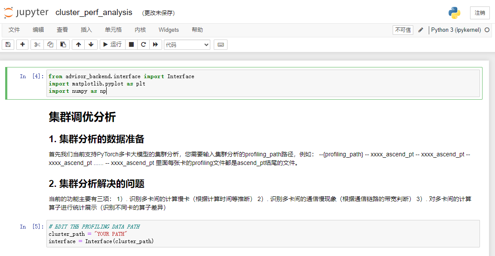

3. Click **Run** to start profile data analysis.

   Detailed analysis results will be displayed directly on the .ipynb page.

## Output File Description

### Report Analysis (Without Benchmark)

"Without benchmark" refers to executing `msprof-analyze advisor` without specifying the `-bp` option. In this scenario, the tool evaluates `Computing Time` and `Free Time` (idle time) to determine whether to compare the kernel and API profile data. Data from the slowest rank is used as the benchmark, while data from the fastest rank serves as the comparison target.

As shown in the following figure, the tool diagnoses issues across dimensions (including cluster, single-rank performance breakdown, scheduling, and computation) and provides the corresponding optimization suggestions. Red, yellow, and green indicators represent high, medium, and low issue priorities, respectively.


#### Analysis of the overall Module

The **overall** module displays the identified issues but does not provide optimization suggestions.

- In single-rank scenarios without a benchmark, the **Environment Variable Issues** section of the overall module provides environment variable setting suggestions.

  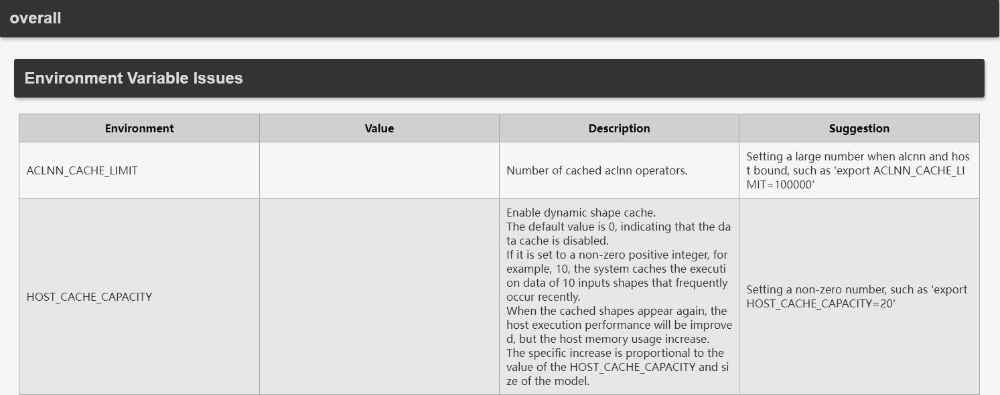

  For a detailed introduction to the environment variables shown in the preceding figure, see [ACL_NN_CACHE_LIMIT](https://www.hiascend.com/document/detail/zh/canncommercial/80RC22/apiref/envvar/envref_07_0031.html) and [HOST_CACHE_CAPACITY](https://www.hiascend.com/document/detail/zh/canncommercial/80RC22/developmentguide/appdevg/aclpythondevg/aclpythondevg_0045.html).

- In single-rank scenarios without a benchmark, the **overall summary** section of the **overall** module provides an analysis including the performance breakdown of the slow rank in the current training task. It displays duration statistics across three dimensions: computation, communication, and scheduling. This analysis helps identify whether the training performance bottleneck is a computation, communication, or scheduling issue. It does not provide optimization suggestions.

  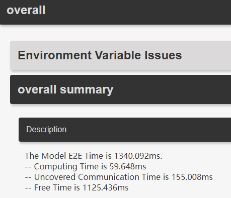

  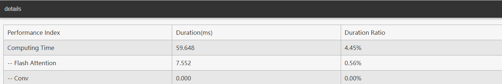

- In cluster scenarios without a benchmark, the **overall** module provides fast/slow rank and fast/slow link analysis.

  

  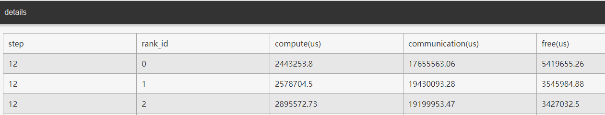

  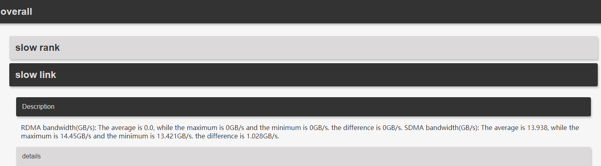

  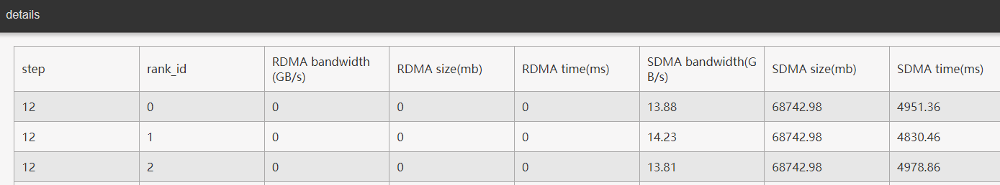

#### Analysis of the comparison Module

The following figure shows the content of the **comparison** module, which identifies kernel and API data for both the benchmark and that of the target profile data to be compared. In scenarios without a benchmark, this module presents the comparison results of the fast and slow rank profile data within the cluster, including the following sections:

- __Kernel compare of Rank* Step* and Rank* Step*__: provides the target total, average, maximum, and minimum durations, the number of calls, the corresponding benchmark data, and the calculated **Diff Total Ratio** (benchmark total duration/target total duration) and **Diff Avg Ratio** (benchmark average duration/target average duration).

  If the **Diff Total Ratio** or **Diff Avg Ratio** is greater than 1, the performance of the current environment is better. If the ratio is less than 1, the current environment requires optimization. If the ratio is equal to 1, the performance of the current environment is close to the benchmark environment.

  

  In the preceding figure, **inf** indicates a denominator of 0 (target data not obtained or is zero); **None** indicates that no data was obtained.

- __Api compare of Rank* Step* and Rank* Step*__: provides the target total duration, self-duration (excluding sub-API calls), average duration, and number of calls of the API data to be compared, as well as the corresponding data of the benchmark. This section also provides the calculated **Diff Total Ratio** (benchmark total duration/target total duration), **Diff Self Ratio** (benchmark self-duration/target self-duration), **Diff Avg Ratio** (benchmark average duration/target average duration), and **Diff Calls Ratio** (benchmark number of calls/target number of calls).

  If the **Diff Total Ratio**, **Diff Self Ratio**, **Diff Avg Ratio**, or **Diff Calls Ratio** is greater than 1, the performance of the current environment is better. If the ratio is less than 1, the current environment requires optimization. If the ratio is equal to 1, the performance of the current environment is close to the benchmark environment.

  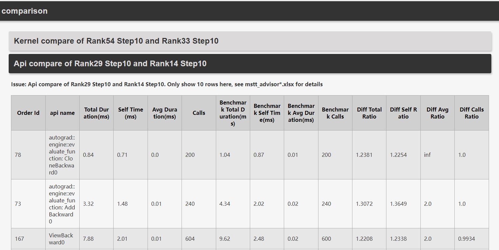
  
  In the preceding figure, **inf** indicates a denominator of 0 (target data not obtained or is zero); **None** indicates that no data was obtained.

The **comparison** module in the `mstt_advisor_{timestamp}.html` file displays only the top 10 kernel and API records. For details, refer to the `mstt_advisor_{timestamp}.xlsx` file.

#### Analysis of the **performance problem analysis** Module

The **performance problem analysis** module consists of the following submodules:

The **memory** module analyzes abnormal memory allocation and release operations.

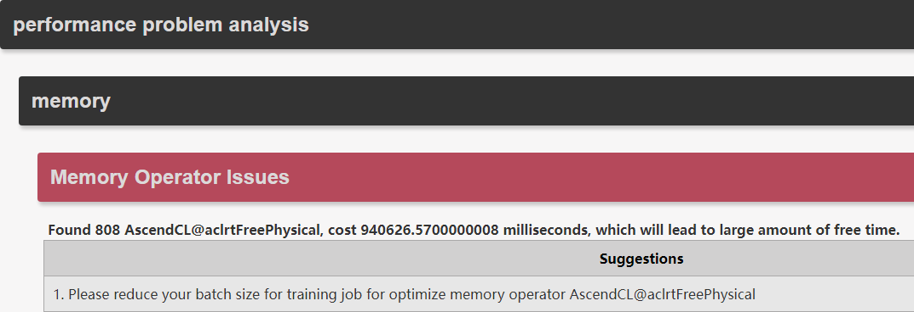

The **communication** module analyzes performance from the communication dimension. It currently supports detection of small communication packets, bandwidth contention between communication and computation, communication retransmission, and communication operator byte alignment.

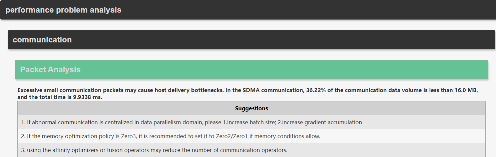

The meanings of **Zero1**, **Zero2**, and **Zero3** in the preceding figure are as follows:

- **Zero1**: Each NPU stores a complete set of gradients and model parameters but only 1/N of the optimizer states. Each NPU uses its data for forward and backward propagation. After backward propagation, each NPU synchronizes gradients across all ranks through `all-reduce` communication so that each rank has the gradients for all operators. Each rank updates the 1/N model parameters based on the gradients and the 1/N optimizer states. Then, it uses `all-gather` communication to send the updated 1/N model parameters to other ranks because each rank has a complete set of model parameters to be updated.
- **Zero2**: Each NPU stores a complete set of model parameters but only 1/N of the optimizer states and 1/N of the gradients. Each NPU uses its data for forward propagation. After backward propagation, each rank calculates the local gradients and uses `reduce-scatter` communication to aggregate them, ensuring each rank stores only 1/N of the gradients. Each rank updates the 1/N model parameters based on the 1/N optimizer states and 1/N gradients. Then, it uses `all-gather` communication to send the updated model parameters to other ranks because each rank has a complete set of model parameters to be updated.
- **Zero3**: Each NPU stores 1/N of the model parameters, 1/N of the optimizer states, and 1/N of the gradients. Before forward propagation, each rank obtains the complete model parameters through `all-gather` communication and then performs forward propagation computation. It evicts the model parameters part by part after use. Before backward propagation, each rank obtains complete model parameters through `all-gather` communication. It evicts the model parameters part by part after use. Gradients are aggregated using `reduce-scatter`. Each rank updates the 1/N model parameters based on the 1/N optimizer states and 1/N gradients. Since each rank stores only 1/N model parameters, there is no need to send the updated model parameters to other ranks.

**Communication Retransmission Analysis**: identifies communication groups where retransmission occurs and provides optimization suggestions.

As shown in the following figure, this module identifies communication retransmission issues in the current training task and provides the corresponding optimization suggestions.

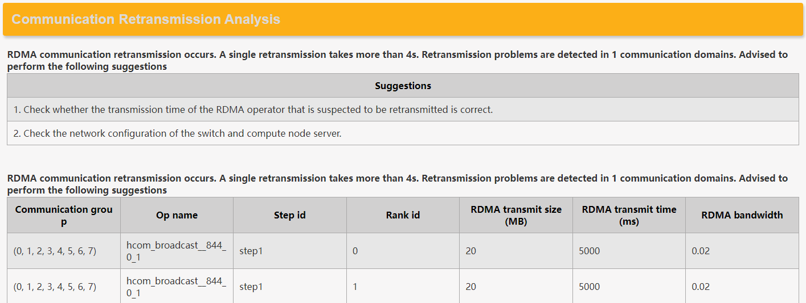

**Bandwidth Contention Analysis**: detects communication bandwidth contention during concurrent computation and communication.

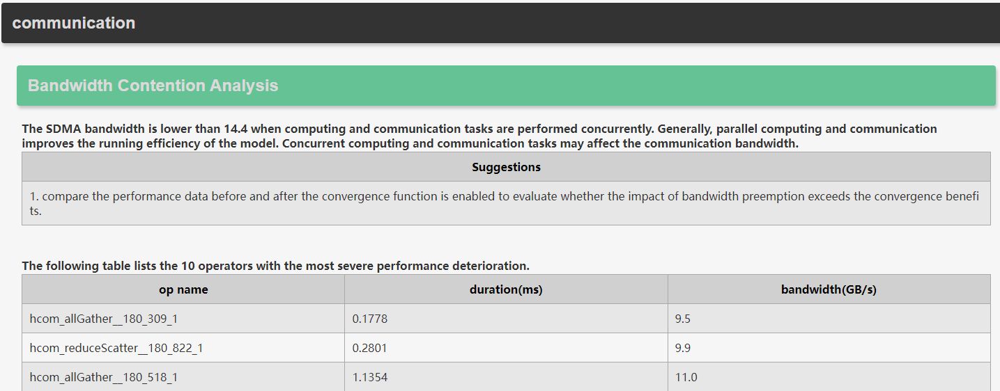

**Byte Alignment Analysis**: For communication operators using the SDMA transmission type, the data volume must be a multiple of 512 bytes to prevent bandwidth degradation.


The **computation** module analyzes the compute performance of the device. It identifies potential bottlenecks within categories such as AICPU, dynamic shape, AI Core performance, Block Dim, operator fusion graphs, and AI Core frequency reduction, providing the corresponding suggestions. Perform performance tuning based on the report details. Examples:


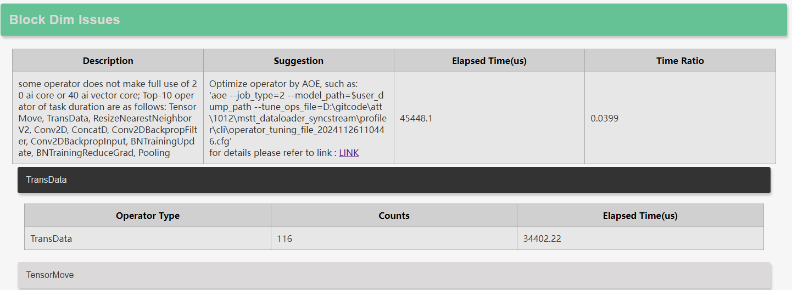


For details about the `torch_npu.npu.set_compile_mode` API, see [torch_npu.npu.set_compile_mode](https://www.hiascend.com/document/detail/zh/Pytorch/710/apiref/torchnpuCustomsapi/context/%EF%BC%88beta%EF%BC%89torch_npu-npu-set_compile_mode.md). For details, see [AICPU Operator Replacement Examples](../aicpu_operator_replacement_example.md).

When pipeline parallel (PP) stage issues exist, the **computation** module analyzes the issues by stage. Each stage represents a pipeline partition. For example, ranks 0–7 belong to **stage-0** and ranks 8–15 belong to **stage-1**.


The **dataloader** module detects **Slow DataLoader Issues**, primarily including abnormally high-latency calls, and provides optimization suggestions.

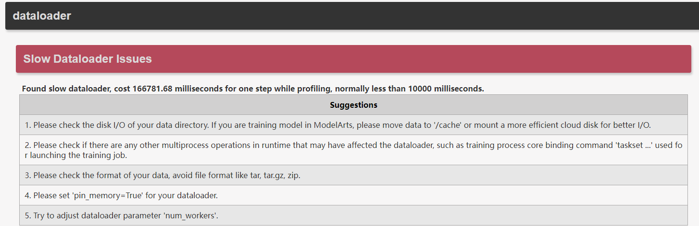

In the preceding figure, the `pin_memory` (memory locking) and `num_workers` (number of data loading subprocesses) parameters are used for [data loading optimization](https://www.hiascend.com/document/detail/zh/Pytorch/710/ptmoddevg/trainingmigrguide/performance_tuning_0026.html).

The **schedule** module presents analysis results for **GC Analysis**, **Affinity API Issues**, operator compile (aclOpCompile) issues, **SyncBatchNorm Issues**, **Synchronize Stream Issues**, and **Fusible Operator Analysis**.

The results of **Fusible Operator Analysis** are displayed only on the terminal and saved in the `mstt_advisor_{timestamp}.xlsx` file. This includes the host bottleneck-based operator sequence analysis and MTE bottleneck-based operator sequence analysis tabs, as shown in the following figure.


| Field              | Description                                                        |
| ------------------ | ------------------------------------------------------------ |
| start index        | Index position of the sequence start operator in `kernel_details.csv` or `op_summary.csv` (header excluded; the first index is `0`)|
| end index          | Index position of the sequence end operator in `kernel_details.csv` or `op_summary.csv`|
| total time(us)     | Total duration of the operator sequence (operator gaps included) (μs)                    |
| execution time(us) | Total execution duration of operators within the sequence (μs)                              |
| mte time(us)       | Total data movement duration of operators within the sequence (μs)                              |
| occurrences        | Number of sequence occurrences                                              |
| mte bound          | Flag indicating an MTE bottleneck                                             |
| host bound         | Flag indicating a host bottleneck                                            |

As shown in the following figure, **GC Analysis** indicates the existence of abnormal garbage collection events. You can address GC issues through effective Python memory management, using `gc.set_threshold()` to adjust GC thresholds, or using `gc.disable()` to disable GC.

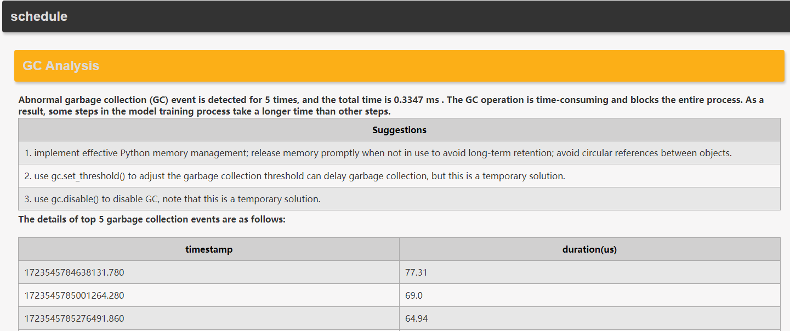

The `gc.set_threshold()` and `gc.disable()` functions in the figure are described as follows:

In Python, the gc module provides control over the garbage collector.

- `gc.set_threshold(threshold0, threshold1, threshold2)`: sets the thresholds for garbage collection. The garbage collector divides all objects into three generations (Generation 0, 1, and 2), and objects in each generation move to the next generation after garbage collection. `threshold0` controls the Generation 0 garbage collection frequency, `threshold1` controls the Generation 1 frequency, and `threshold2` controls the Generation 2 frequency. Setting `threshold0` to `0` disables garbage collection.
- `gc.disable()`: disables automatic garbage collection. After a `gc.disable()` call, the garbage collector will not run automatically until a manual `gc.enable()` call.

As shown in the following figure, the **Affinity API Issues** section identifies replaceable affinity APIs and provides the corresponding code stack. You can locate the code requiring modification based on the stack and refer to the provided modification examples ([Examples for Fused Operator API Replacement During Migration to Ascend](../fused_operator_api_replacement_example.md)).


As shown in the following figure, the **Synchronize Stream Issues** section identifies time-consuming synchronization streams and provides the triggering code stack. The corresponding code must be modified based on the stack to eliminate these synchronization streams.

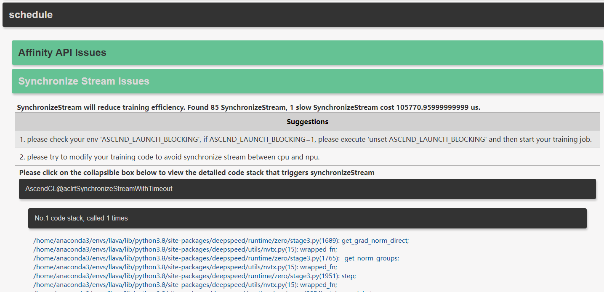

For details regarding the `ASCEND_LAUNCH_BLOCKING` environment variable, see [ASCEND_LAUNCH_BLOCKING](https://www.hiascend.com/document/detail/zh/Pytorch/710/comref/Envvariables/Envir_006.html).

As shown in the following figure, the **Operator Dispatch Issues** section indicates that the following code must be added at the beginning of the execution script to eliminate `aclOpCompile` issues.

```python
torch_npu.npu.set_compile_mode(jit_compile=False);
torch_npu.npu.config.allow_internal_format = False
```

For details regarding these APIs, see [torch_npu.npu.set_compile_mode](https://www.hiascend.com/document/detail/zh/Pytorch/710/apiref/torchnpuCustomsapi/context/%EF%BC%88beta%EF%BC%89torch_npu-npu-set_compile_mode.md) and [torch_npu.npu.config.allow_internal_format](https://www.hiascend.com/document/detail/zh/Pytorch/710/apiref/torchnpuCustomsapi/context/%EF%BC%88beta%EF%BC%89torch_npu-npu-config-allow_internal_format.md).

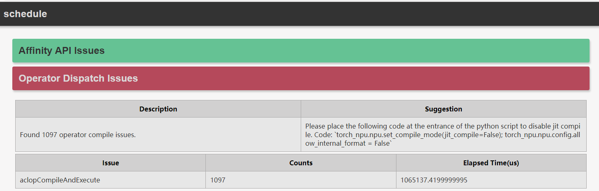

For details regarding the `aclopCompileAndExecute` API, see [aclopCompileAndExecute](https://www.hiascend.com/document/detail/zh/canncommercial/82RC1/API/appdevgapi/aclcppdevg_03_0251.html).

### Report Analysis (With Benchmark)

"With benchmark" refers to executing the `msprof-analyze advisor` command after specifying the `-bp` option with the directory of the benchmark profile data for comparison.

Single-rank scenarios with a benchmark: the **overall** module is not analyzed here. The **performance problem analysis** module yields the same results as the scenario without a benchmark.

Cluster scenarios with a benchmark:

- The **overall** module analyzes fast/slow ranks and fast/slow links, which are consistent with the cluster scenarios without a benchmark. For details, see "**Report Analysis (Without Benchmark)** > [**Analysis of the overall Module**](#analysis-of-the-overall-module)".
- The **Environment Variable Issues** section is provided and is the same as that in single-rank scenarios without a benchmark. For details, see "**Report Analysis (Without Benchmark)** > [**Analysis of the overall Module**](#analysis-of-the-overall-module)".
- The **comparison** module is also provided. (In scenarios without a benchmark, the tool compares the profile data of the slowest rank against the fastest rank within a cluster. In scenarios with a benchmark, the comparison is between the same rank across two clusters where significant duration differences exist.)

The following figure shows an example of the **comparison** module, which identifies the comparison results of Kernel and API data for the benchmark and the target profile data, including:

- __Kernel compare of *Target* and *Benchmark*__: provides the target total, average, maximum, and minimum durations, the number of calls, the corresponding benchmark data, and the calculated **Diff Total Ratio** (benchmark total duration/target total duration) and **Diff Avg Ratio** (benchmark average duration/target average duration)

  If the **Diff Total Ratio** or **Diff Avg Ratio** is greater than 1, the performance of the current environment is better. If the ratio is less than 1, the current environment requires optimization. If the ratio is equal to 1, the performance of the current environment is close to the benchmark environment.

  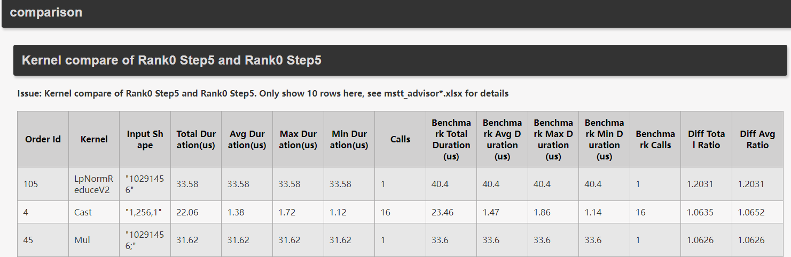

  In the preceding figure, **inf** indicates a denominator of 0 (target data not obtained or is zero); **None** indicates that no data was obtained.

- __Api compare of *Target* and *Benchmark*__: provides the target total duration, self-duration (excluding sub-API calls), average duration, and number of calls of the API data to be compared, as well as the corresponding data of the benchmark. This section also provides the calculated **Diff Total Ratio** (benchmark total duration/target total duration), **Diff Self Ratio** (benchmark self-duration/target self-duration), **Diff Avg Ratio** (benchmark average duration/target average duration), and **Diff Calls Ratio** (benchmark number of calls/target number of calls).

  If the **Diff Total Ratio**, **Diff Self Ratio**, **Diff Avg Ratio**, or **Diff Calls Ratio** is greater than 1, the performance of the current environment is better. If the ratio is less than 1, the current environment requires optimization. If the ratio is equal to 1, the performance of the current environment is close to the benchmark environment.

  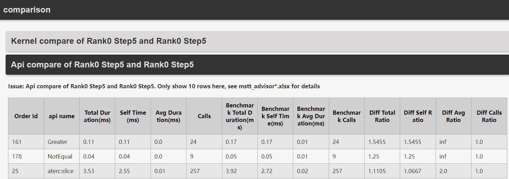
  
  In the preceding figure, **inf** indicates a denominator of 0 (target data not obtained or is zero); **None** indicates that no data was obtained.

The **comparison** module in the `mstt_advisor_{timestamp}.html` file displays only the top 10 kernel and API records. For details, refer to the `mstt_advisor_{timestamp}.xlsx` file.
