# advisor

## 1. Overview

The expert suggestions (`advisor`) feature analyzes profile data collected by Ascend PyTorch Profiler or MindSpore Profiler and provides performance tuning suggestions.

## 2. Quick Start

### 2.1 Minimal Command

If you are unsure about which issues to analyze, run the `advisor all` command first:

```bash
msprof-analyze advisor all -d /path/to/profiling_data/
```

Output files are saved to the current directory by default. To specify an output directory, run the following command:

```bash
msprof-analyze advisor all -d /path/to/profiling_data/ -o /path/to/advisor_output/
```

> For single-rank scenarios, specify the `*_ascend_pt` or `*_ascend_ms` directory containing the profile data files. For multi-rank or cluster scenarios, specify the parent directory of the `*_ascend_pt` or `*_ascend_ms` directories.

### 2.2 Common Commands

| Scenario | Use Case | Copyable Command |
| --- | --- | --- |
| Full analysis without a benchmark | Unsure of the bottleneck source and want an overall diagnosis first | `msprof-analyze advisor all -d /path/to/profiling_data/` |
| Full analysis with a benchmark | Benchmark profile data is available and differences need to be compared | `msprof-analyze advisor all -d /path/to/profiling_data/ -bp /path/to/benchmark_profiling_data/` |
| Computation bottleneck analysis | Focus on issues such as AICPU, dynamic shape, Block Dim, operator bottlenecks, fusion operator graphs, and AI Core frequency reduction | `msprof-analyze advisor computation -d /path/to/profiling_data/` |
| Scheduling bottleneck analysis | Focus on issues such as GC, affinity APIs, `aclopCompile`, `SyncBatchNorm`, `SynchronizeStream`, and fusible operator sequences | `msprof-analyze advisor schedule -d /path/to/profiling_data/` |
| English report output | English output is required | `msprof-analyze advisor all -d /path/to/profiling_data/ -l en` |
| Forced execution | Ownership or large file checks need to be bypassed | `msprof-analyze advisor all -d /path/to/profiling_data/ --force` |

## 3. Preparations

**Environment Setup**

Install the `msprof-analyze` tool. For details, see the [msprof-analyze Installation Guide](../install_guide/msprof-analyze_install_guide.md).

**Data Preparation**

`msprof-analyze` requires an input directory containing the collected profile data files. The input path can be a cluster profile data path or a single-rank profile data path. For details about how to collect profile data, see the [Ascend PyTorch Profiler](https://gitcode.com/Ascend/pytorch/blob/master/docs/en/developer_notes/ascend_pytorch_profiler_user_guide.md) or the [MindSpore Profiler](https://gitcode.com/Ascend/docs/blob/master/MindStudio/master/en/menu/mindspore_profiler_user_guide.md).

**Constraints**

- CANN versions earlier than 8.0RC1 support only the analysis of text-format files. CANN 8.0RC1 and later versions support analysis of collected profile data in both `text` and `db` formats.
- For CCU scenarios on the Ascend 950 products, the `slow rank`, `slow link`, and `communication` analysis features do not provide meaningful results because communication matrix data and communication operator bandwidth data cannot be collected.

## 4. Feature Introduction (`advisor` Command-line Mode)

### 4.1 Feature Description

The `msprof-analyze advisor` command provides the following three subcommands:

- `all`: Overall performance bottlenecks, including all features listed in the following table.
- `computation`: Computation bottlenecks, including the `computation` and `Kernel compare` features listed in the following table.
- `schedule`: Scheduling bottlenecks, including the `schedule` and `API compare` features listed in the following table.

The following table lists the complete set of `advisor` features, which are enabled by `all`, `computation`, and `schedule`.

| Dimension | Mode | Description | Supported Scenario |
| --- | --- | --- | --- |
| overall | Overall Summary | Breaks down profile data by dimensions such as computation, communication, and idle time. | PyTorch, MindSpore |
|  | Environment Variable Issues | Provides suggestions for environment variable settings. | PyTorch |
|  | slow rank | Identifies slow ranks. | PyTorch, MindSpore |
|  | slow link | Identifies slow links. | PyTorch, MindSpore |
| computation | AICPU Issues | Provides AICPU performance tuning suggestions. | PyTorch, MindSpore |
|  | Operator Dynamic Shape Issues | Identifies operators with dynamic shapes. | PyTorch |
|  | AI Core Performance Analysis | Analyzes the performance of operators such as MatMul, FlashAttentionScore, AI_VECTOR_CORE, and MIX_AIV. | PyTorch |
|  | Block Dim Issues | Provides Block Dim operator tuning suggestions. | PyTorch, MindSpore |
|  | Operator No Bound Issues | Analyzes operator bottlenecks. | PyTorch, MindSpore |
|  | Fusion Issues | Provides operator fusion graph tuning suggestions. | PyTorch, MindSpore |
|  | AI Core Frequency Issues | Analyzes reductions in AI Core operator frequency. | PyTorch, MindSpore |
| communication | Packet Analysis | Detects small communication packets. | PyTorch, MindSpore |
|  | Bandwidth Contention Analysis | Detects bandwidth contention between communication and computation. | PyTorch, MindSpore |
|  | Communication Retransmission Analysis | Detects communication retransmissions. | PyTorch, MindSpore |
|  | Byte Alignment Analysis | Detects byte alignment issues for communication operators. For communication operators using SDMA as the transmission type, the data volume must be a multiple of 512 bytes to prevent bandwidth degradation. | PyTorch, MindSpore |
| schedule | Affinity API Issues | Provides performance tuning suggestions for affinity API replacement. | PyTorch, MindSpore |
|  | Operator Dispatch Issues | Identifies operator dispatch issues (Path 3/Path 5). | PyTorch |
|  | SyncBatchNorm Issues | Detects BatchNorm synchronization issues. | PyTorch, MindSpore |
|  | Synchronize Stream Issues | Detects stream synchronization issues. | PyTorch, MindSpore |
|  | GC Analysis | Identifies abnormal garbage collection events. This feature requires enabling `gc_detect_threshold` under `experimental_config` when collecting profile data using Ascend PyTorch Profiler. | PyTorch |
|  | Fusible Operator Analysis | Detects operator sequences with Host or MTE bottlenecks for code optimization or the development of fusible operators. | PyTorch, MindSpore |
| dataloader | Slow Dataloader Issues | Detects abnormal DataLoader behavior. | PyTorch, MindSpore |
| memory | Memory Operator Issues | Identifies abnormal memory allocation and release operations. | PyTorch, MindSpore |
| comparison | Kernel compare of Rank\* Step\* and Rank\* Step\* | Identifies the kernel data in the benchmark and profile data to be compared. In scenarios without a benchmark, it compares the profile data of fast and slow ranks within a cluster. In scenarios with a benchmark, it compares the profile data of the same ranks across two clusters with significant differences in duration. | PyTorch, MindSpore |
|  | API compare of Rank\* Step\* and Rank\* Step\* | Identifies the API data in the benchmark and profile data to be compared. In scenarios without a benchmark, it compares the profile data of fast and slow ranks within a cluster. In scenarios with a benchmark, it compares the profile data of the same ranks across two clusters with significant differences in duration. | PyTorch |

### 4.2 Syntax

**Overall performance bottlenecks**

```bash
msprof-analyze advisor all -d <profiling_path> [-bp <benchmark_profiling_path>] [-o <output_path>] [-cv <cann_version>] [-tv <torch_version>] [-pt <profiling_type>] [--force] [-l <language>] [--debug] [--agent] [-h]
```

**Computation bottlenecks**

```bash
msprof-analyze advisor computation -d <profiling_path> [-o <output_path>] [-cv <cann_version>] [-tv <torch_version>] [-pt <profiling_type>] [--force] [-l <language>] [--debug] [-h]
```

**Scheduling bottlenecks**

```bash
msprof-analyze advisor schedule -d <profiling_path> [-o <output_path>] [-cv <cann_version>] [-tv <torch_version>] [--force] [-l <language>] [--debug] [-h]
```

### 4.3 Command-line Options

#### 4.3.1 Input and Output Configuration

| Option | Required (Yes/No) | Description |
| --- | --- | --- |
| `-d`<br>`--profiling_path` | Yes | Specifies the path to the profile data file or directory. For profile data collected using Ascend PyTorch Profiler, specify the `*_ascend_pt` profile data result directory. For profile data collected using MindSpore Profiler, specify the `*_ascend_ms` profile data result directory. For cluster data, specify the parent directory of `*_ascend_pt` or `*_ascend_ms`. |
| `-bp`<br>`--benchmark_profiling_path` | No | Specifies the directory containing benchmark profile data for performance comparison. The profile data is collected using the profiling tool.<br>**This option is not supported by `computation` or `schedule`.** |
| `-o`<br>`--output_path` | No | Specifies the output path for analysis results. After the `advisor` analysis is complete, the results are saved to this directory. If not specified, the current directory is used by default. |
| `--agent` | No | Outputs analysis results in JSON format to standard output without writing them to a file. Specifying this option enables `stdout` output. If not specified, `stdout` output is disabled by default. |

#### 4.3.2 Execution Behavior Control

| Option | Required (Yes/No) | Description |
| --- | --- | --- |
| `--force` | No | Forces `advisor` to run. When specified, the following checks are skipped: ownership check (allowing execution even if the current user is not the owner of the specified directory or files) and file size check (allowing execution even if a CSV file exceeds 5 GB, a JSON file exceeds 10 GB, or a DB file exceeds 8 GB). Specifying this option enables forced execution. If not specified, forced execution is disabled by default. |
| `-l` `--language` | No | Specifies the language of the analysis results. Valid values: `cn` (Chinese, default) or `en` (English). |
| `--debug` | No | Enables detailed stack trace information when a tool error occurs. Specifying this option enables debug mode. If not specified, debug mode is disabled by default. |
| `-h`, `-H` `--help` | No | Displays help information for the subcommands and options of the current command. |

#### 4.3.3 Environment and Version configuration

| Option | Description |
| --- | --- |
| `-cv`<br>`--cann_version` | Specifies the CANN software version corresponding to the Profiling tool used to collect profile data. The currently supported compatible versions are `6.3.RC2`, `7.0.RC1`, `7.0.0`, and `8.0.RC1`. If this option is not specified, profile data is processed as data collected using version `8.0.RC1` by default. Analysis of profile data collected using other versions may result in unexpected results. You can obtain the `version` field by running the following command in the environment: `cat /usr/local/Ascend/cann/aarch64-linux/ascend_toolkit_install.info` |
| `-tv`<br>`--torch_version` | Specifies the Torch version of the runtime environment. The default value is `1.11.0`. `torch1.11.0` and `torch2.1.0` are supported. If the runtime environment uses another version, such as `torch1.11.3`, you can ignore the minor version difference and select the closest supported version, such as `1.11.0`. |
| `-pt`<br>`--profiling_type` | Specifies the type of Profiling tool used to collect profile data. Valid values:<br>`pytorch`: specifies that profile data was collected using the Ascend PyTorch Profiler API. This is the default value.<br>`mindspore`: specifies that profile data was collected using the MindSpore Profiler API.<br>`mslite`: specifies that profile data was collected using the [Benchmark](https://gitee.com/ascend/tools/tree/master/ais-bench_workload/tool/ais_bench) tool. This option is not recommended.<br>**This option is not supported by `schedule`.** |

### 4.4 Examples

**Overall performance bottlenecks**

```bash
msprof-analyze advisor all -d /path/to/profiling_data/
```

**Computation bottlenecks**

```bash
msprof-analyze advisor computation -d /path/to/profiling_data/
```

**Scheduling bottlenecks**

```bash
msprof-analyze advisor schedule -d /path/to/profiling_data/
```

For single-rank scenarios, specify the `*_ascend_pt` or `*_ascend_ms` directory containing the profile data. For multi-rank or cluster scenarios, specify the parent directory of `*_ascend_pt` or `*_ascend_ms`.

### 4.5 Output Description

`advisor` displays brief analysis suggestions in the terminal and generates an HTML report and an XLSX file (containing detailed data). If `-o <output_path>` is specified, the output files are saved to the specified directory. If not specified, the current directory is used by default.

```text
<output_path>/
├── mstt_advisor_<timestamp>.html
└── mstt_advisor_<timestamp>.xlsx
```

| Output | Purpose | Recommended Use |
| --- | --- | --- |
| Terminal output | Displays brief suggestions related to the analysis results. | Suitable for quickly determining whether any obvious issues exist. |
| `mstt_advisor_{timestamp}.html` | Provides overall conclusions, issue priorities, causes, and optimization suggestions. | Recommended to open first and read according to the [Report Interpretation Guide](#5-report-interpretation-guide). |
| `mstt_advisor_{timestamp}.xlsx` | Contains the same content as the terminal output, together with detailed data. | Used to locate specific operators, APIs, or communication items. Detailed comparison data is available in this file. |

The following figures show terminal output examples.

**Overall performance bottlenecks**

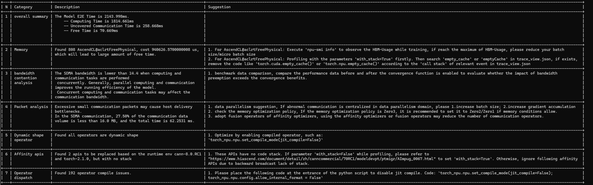

**Computation bottlenecks**

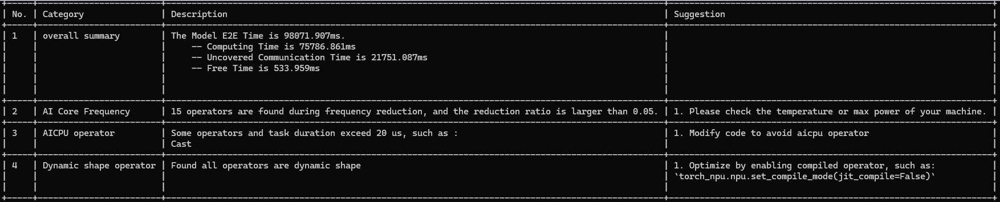

**Scheduling bottlenecks**

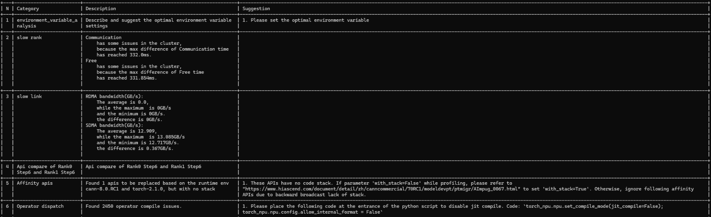

For details, see the [Report Interpretation Guide](#5-report-interpretation-guide).

## 5. Report Interpretation Guide

### 5.1 Quick Navigation

When reading the HTML report, you are advised to first review the overall conclusions and high-priority issues, and then review the cause descriptions and optimization suggestions for the corresponding modules.

| Reading Order | Module | What This Module Provides  | How to Use      |
| ------------- | ----- | ------------- | ------------------- |
| 1             | `overall`    | Performance breakdown, environment variable suggestions, fast/slow rank and link analysis | First determine whether the main bottleneck is computation, communication, or dispatch, and check for slow ranks or slow links.                         |
| 2             | `comparison`  | Kernel/API comparison results     | Check the Kernels or APIs with the largest differences. The HTML report displays only the top 10 records; see the XLSX file for detailed data.   |
| 3             | `performance problem analysis` | Specific issues involving memory, communication, computation, dataloader, and schedule    | Address issues in descending priority: high, medium, and low, and use stacks, operators, APIs, or communication items to locate the relevant code and configuration. |

As shown in the following figure, the tool diagnoses issues from dimensions such as cluster performance, single-rank performance breakdown, scheduling, and computation, and provides corresponding optimization suggestions. Red, yellow, and green blocks indicate High, Medium, and Low issue priorities, respectively.

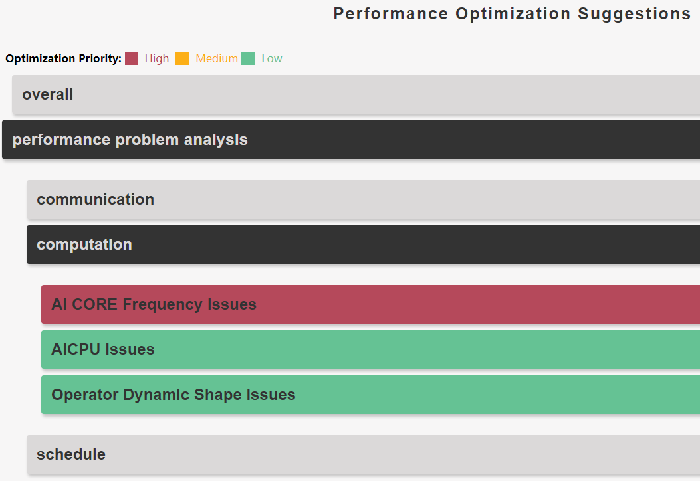

### 5.2 Scenario 1: Without a Benchmark (Without `-bp`)

A scenario without a benchmark is one in which the `-bp` option is not specified when `msprof-analyze advisor` is executed. Depending on whether the profile data is cluster data and whether there are significant differences in computation time and free time among ranks in the cluster, the tool determines whether to compare kernel and API profile data. The slow-rank data serves as the benchmark, and the fast-rank data serves as the target.

#### 5.2.1 `overall` Module

The **`overall`** module only identifies issues and does not provide optimization suggestions.

| Scenario | What This Module Provides | How to Use |
| --- | --- | --- |
| Single-rank without benchmark, Environment Variable Issues | Recommendations for environment variable settings | Check the environment variable settings based on the recommendations in the report  |
| Single-rank without benchmark, Overall Summary  | Performance breakdown of the slow rank in the current training task, including duration statistics across computation, communication, and dispatch dimensions | Determine whether the training performance bottleneck is computation, communication, or dispatch    |
| Cluster without benchmark | Analysis of fast and slow ranks and links  | Locate slow ranks and slow links, and then go to the **`comparison`** and specific issue modules to identify the causes |

The following figure shows an example of **Environment Variable Issues** in the **`overall`** module for a single-rank scenario without a benchmark.

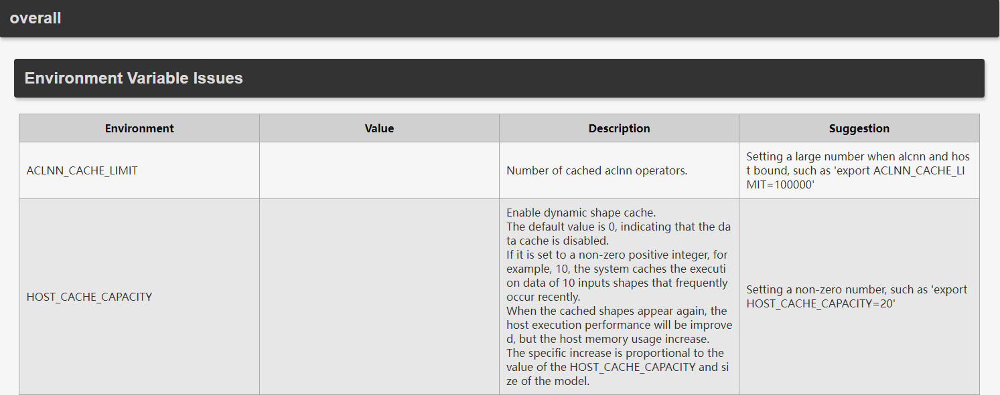

For detailed information about the environment variables shown in the preceding figure, see [`ACLNN_CACHE_LIMIT`](https://www.hiascend.com/document/detail/en/CANNCommunityEdition/900/maintenref/envvar/envref_07_0031.html).

The following figures show examples of the **Overall Summary** analysis in a single-rank scenario without a benchmark.

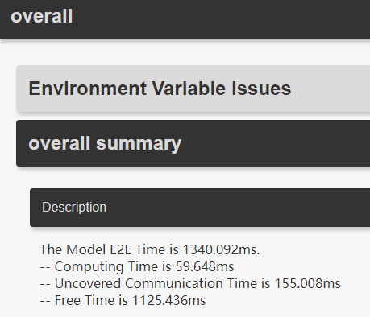

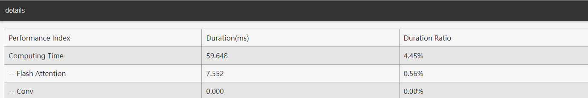

The **`overall`** module in a cluster scenario without a benchmark includes fast/slow rank and fast/slow link analysis, as shown in the following examples.

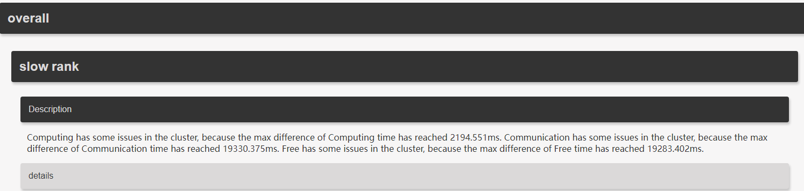

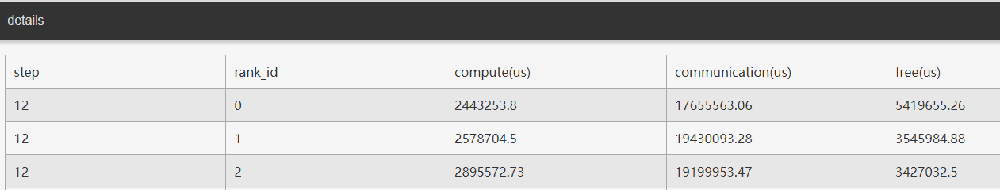

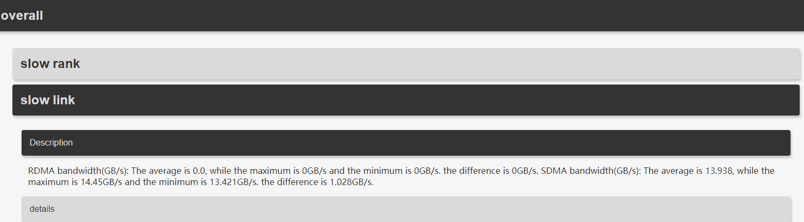

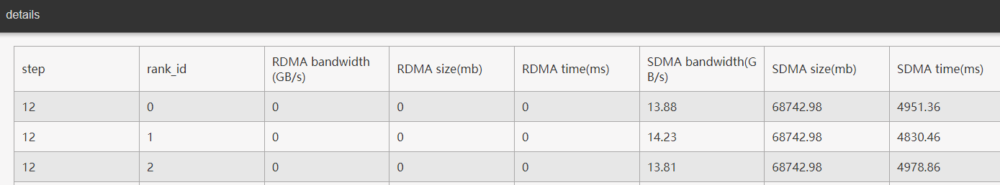

#### 5.2.2 `comparison` Module

The **`comparison`** module identifies kernel and API data for the benchmark and target profile data. In a scenario without a benchmark, `comparison` compares the profile data of fast and slow ranks within the cluster.

* **Kernel Compare of RankStep and RankStep**: Provides the target total duration, average duration, maximum duration, minimum duration, and number of calls for Kernels, together with the corresponding benchmark data. It then calculates **Diff Total Ratio** (benchmark total duration / target total duration) and **Diff Avg Ratio** (benchmark average duration / target average duration).

  If **Diff Total Ratio** or **Diff Avg Ratio** is greater than 1, the performance of the current environment is better. If the ratio is less than 1, the current environment requires optimization. If the ratio is equal to 1, the performance of the current environment is close to that of the benchmark environment.

  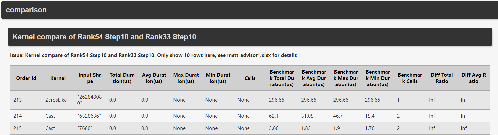

  In the preceding figure, `inf` indicates that the denominator is 0 (target data was not obtained or the target data is 0), and `None` indicates that no data was obtained.

* **API Compare of RankStep and RankStep**: Provides the target total duration, target API self-duration (excluding the duration of sub-APIs called by the API), target average duration, and target number of calls, together with the corresponding benchmark data. It then calculates **Diff Total Ratio** (benchmark total duration / target total duration), **Diff Self Ratio** (benchmark API self-duration / target API self-duration), **Diff Avg Ratio** (benchmark average duration / target average duration), and **Diff Calls Ratio** (benchmark number of calls / target number of calls).

  If **Diff Total Ratio**, **Diff Self Ratio**, **Diff Avg Ratio**, or **Diff Calls Ratio** is greater than 1, the performance of the current environment is better. If the ratio is less than 1, the current environment requires optimization. If the ratio is equal to 1, the performance of the current environment is close to that of the benchmark environment.

  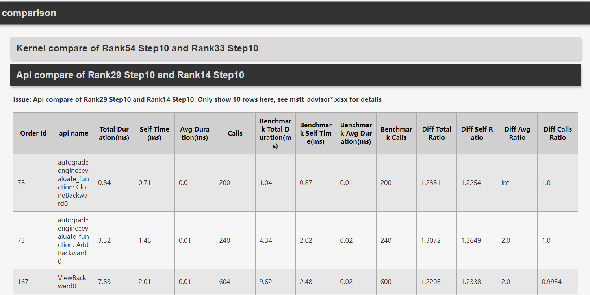

  In the preceding figure, `inf` indicates that the denominator is 0 (target data was not obtained or the target data is 0), and `None` indicates that no data was obtained.

The **`comparison`** module in the `mstt_advisor_{timestamp}.html` file displays only the top 10 kernel and API records. For detailed data, see the `mstt_advisor_{timestamp}.xlsx` file.

#### 5.2.3 `performance problem analysis` Module

The **`performance problem analysis`** module consists of submodules such as **`memory`**, **`communication`**, **`computation`**, **`dataloader`**, and **`schedule`**. For the functions and examples of each submodule, see [Detailed Problem Type Descriptions](#54-detailed-problem-type-descriptions).

### 5.3 Scenario 2: With a Benchmark (With `-bp`)

A scenario with a benchmark is one in which the `-bp` option is specified when `msprof-analyze advisor` is executed to designate benchmark profile data for comparison.

#### 5.3.1 `overall` Module

In a single-rank scenario with a benchmark, the **`overall`** module is not analyzed. The results of the **`performance problem analysis`** module are the same as those in the scenario without a benchmark.

In a cluster scenario with a benchmark:

* The **`overall`** module provides fast/slow rank and fast/slow link analysis, which is the same as in the cluster scenario without a benchmark. For details, see the **`overall`** module in [Scenario 1: Without a Benchmark (Without `-bp`)](#52-scenario-1-without-a-benchmark-without--bp).
* The **Environment Variable Issues** section is provided, which is the same as that in the single-rank scenario without a benchmark. For details, see the **`overall`** module in [Scenario 1: Without a Benchmark (Without `-bp`)](#52-scenario-1-without-a-benchmark-without--bp).

#### 5.3.2 `comparison` Module

The **`comparison`** module is also provided in a cluster scenario with a benchmark. In a scenario without a benchmark, the tool compares the profile data of fast and slow ranks within the cluster. In a scenario with a benchmark, the tool compares the profile data of the same ranks across two clusters whose durations differ significantly.

* **Kernel Compare of Target and Benchmark**: Provides the total, average, maximum, and minimum target durations and the number of kernel calls, together with the corresponding benchmark data. It then calculates **Diff Total Ratio** (benchmark total duration / target total duration) and **Diff Avg Ratio** (benchmark average duration / target average duration).

  If **Diff Total Ratio** or **Diff Avg Ratio** is greater than 1, the performance of the current environment is better. If the ratio is less than 1, the current environment requires optimization. If the ratio is equal to 1, the performance of the current environment is close to that of the benchmark environment.

  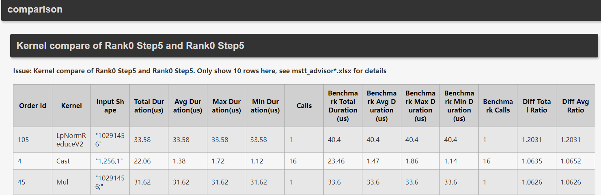

  In the preceding figure, `inf` indicates that the denominator is 0 (target data was not obtained or the target value is 0), and `None` indicates that no data was obtained.

* **API Compare of Target and Benchmark**: Provides the target total duration, target API self-duration (excluding the duration of sub-APIs called by the API), target average duration, and target number of calls, together with the corresponding benchmark data. It then calculates **Diff Total Ratio** (benchmark total duration / target total duration), **Diff Self Ratio** (benchmark API self-duration / target API self-duration), **Diff Avg Ratio** (benchmark average duration / target average duration), and **Diff Calls Ratio** (benchmark number of calls / target number of calls).

  If **Diff Total Ratio**, **Diff Self Ratio**, **Diff Avg Ratio**, or **Diff Calls Ratio** is greater than 1, the performance of the current environment is better. If the ratio is less than 1, the current environment requires optimization. If the ratio is equal to 1, the performance of the current environment is close to that of the benchmark environment.

  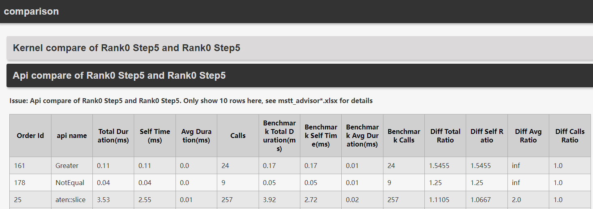

  In the preceding figure, `inf` indicates that the denominator is 0 (target data was not obtained or the target data is 0), and `None` indicates that no data was obtained.

The **`comparison`** module in the `mstt_advisor_{timestamp}.html` file displays only the top 10 kernel and API records. For detailed data, see the `mstt_advisor_{timestamp}.xlsx` file.

#### 5.3.3 `performance problem analysis` Module

In a scenario with a benchmark, the **`performance problem analysis`** module is the same as that in a scenario without a benchmark. You are advised to review the **`memory`**, **`communication`**, **`computation`**, **`dataloader`**, and **`schedule`** modules in that order and address high-priority issues first.

### 5.4 Detailed Problem Type Descriptions

#### 5.4.1 `computation` Module Quick Reference

The **`computation`** module analyzes device computation performance. It identifies issues such as AICPU, dynamic shape, AI Core Performance Analysis, Block Dim, operator bottlenecks, operator fusion graphs, and AI Core operator frequency reduction, and provides corresponding suggestions. Perform optimization based on the suggestions in the report.

| Issue Type| What It Identifies | Suggested Action |
| ------------- | ----------------- | ---------------------- |
| AICPU Issues  | AICPU issues | Address the issue based on the suggestions in the report and the AICPU operator replacement examples |
| Operator Dynamic Shape Issues | Operators with dynamic shapes | Pay attention to compilation or execution overhead caused by dynamic shapes |
| AI Core Performance Analysis  | Performance analysis of operators such as MatMul, FlashAttentionScore, AI_VECTOR_CORE, and MIX_AIV | Analyze the performance of AI Core operators based on the report |
| Block Dim Issues | Operators with Block Dim issues | Adjust the relevant operator configuration based on the suggestions in the report |
| Operator No Bound Issues | Operator bottlenecks | Locate operators with no obvious bound but abnormal duration |
| Fusion Issues | Operator fusion graph issues | Optimize the fusion graph based on the suggestions in the report |
| AI Core Frequency Issues | AI Core operator frequency reduction analysis | Investigate the causes of AI Core operator frequency reduction |

The following figures are some examples.

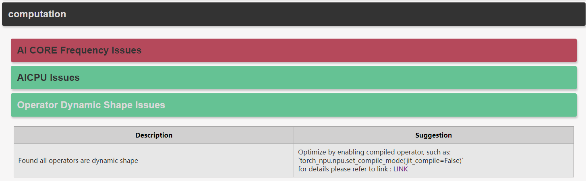

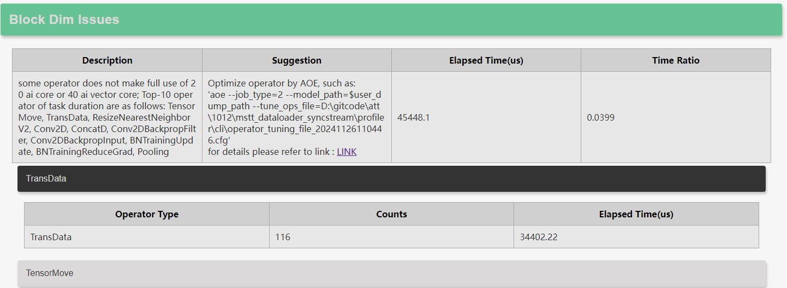

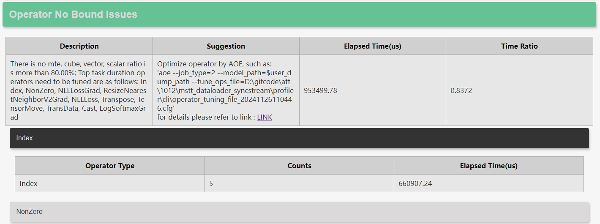

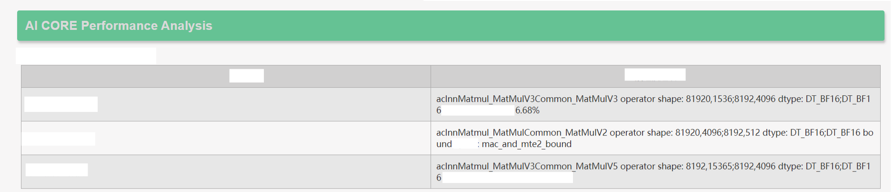

For details about the `torch_npu.npu.set_compile_mode` API shown in the preceding figure, see [`torch_npu.npu.set_compile_mode`](https://gitcode.com/Ascend/op-plugin/blob/master/docs/en/custom_APIs/torch_npu-npu/(beta)torch_npu-npu-set_compile_mode.md). For an AICPU operator replacement example, see [AICPU Operator Replacement Examples](../aicpu_operator_replacement_example.md).

When pipeline parallelism (PP) is used, the **computation** module analyzes the issues by stage. Each stage represents a pipeline partition. For example, ranks 0–7 belong to `stage-0`, and ranks 8–15 belong to `stage-1`.

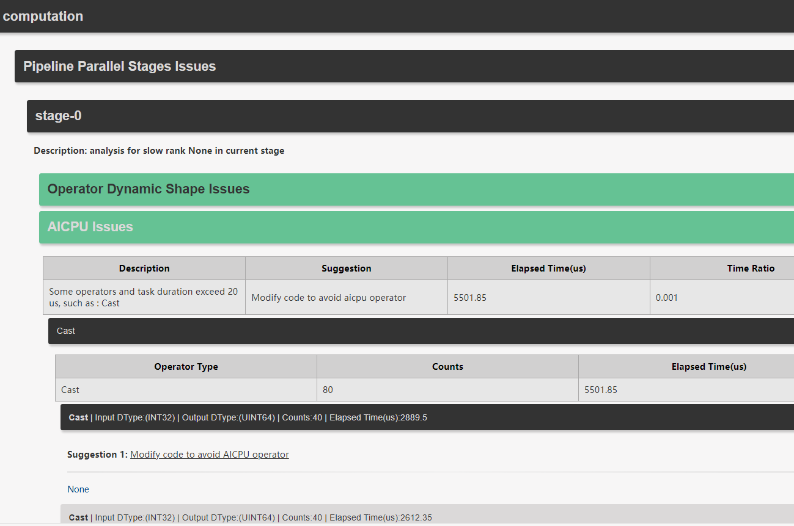

#### 5.4.2 `communication` Module Quick Reference

The **communication** module analyzes communication performance. It currently detects small communication packets, bandwidth contention between communication and computation, communication retransmissions, and byte alignment issues for communication operators.

| Issue Type  | What It Identifies | Suggested Action |
| --- | --- | --- |
| Packet Analysis | Small communication packets | Check whether there are excessive small communication packets and optimize communication granularity based on the suggestions in the report |
| Bandwidth Contention Analysis | Bandwidth contention between communication and computation | Detect scenarios in which communication and computation contend for bandwidth when running concurrently |
| Communication Retransmission Analysis | Communication retransmissions | Identify the communication domains where retransmissions occur and review the corresponding optimization suggestions |
| Byte Alignment Analysis | Byte alignment issues for communication operators | For communication operators using SDMA as the transmission type, ensure that the data volume is a multiple of 512 bytes to prevent bandwidth degradation |

The following figure shows an example of the **`communication`** module.

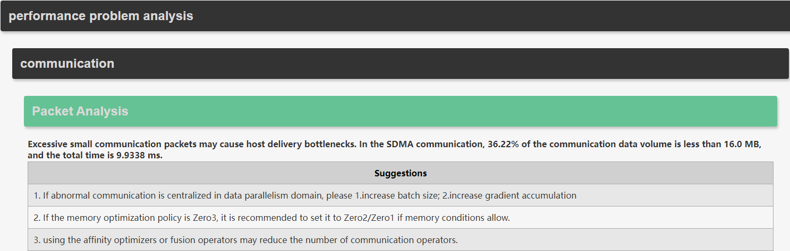

The meanings of **Zero1**, **Zero2**, and **Zero3** in the preceding figure are as follows:

* **Zero1**: Each NPU stores a complete set of gradients and model parameters but only 1/N of the optimizer states. Each NPU uses its own data for forward and backward propagation. After backward propagation, each NPU synchronizes gradients across all ranks through `all-reduce` communication so that each rank has the gradients for all operators. Each rank updates 1/N of the model parameters based on the gradients and 1/N of the optimizer states. It then uses `all-gather` communication to send the updated 1/N of the model parameters to the other ranks because each rank has a complete set of model parameters that need to be updated.
* **Zero2**: Each NPU stores a complete set of model parameters but only 1/N of the optimizer states and 1/N of the gradients. Each NPU uses its own data for forward propagation. After backward propagation, each rank calculates the local gradients and uses `reduce-scatter` communication to aggregate the gradients, ensuring that each rank stores only 1/N of the gradients. Each rank updates 1/N of the model parameters based on 1/N of the optimizer states and 1/N of the gradients. It then uses `all-gather` communication to send the updated model parameters to the other ranks because each rank has a complete set of model parameters that need to be updated.
* **Zero3**: Each NPU stores 1/N of the model parameters, 1/N of the optimizer states, and 1/N of the gradients. Before forward propagation, each rank obtains the complete model parameters through `all-gather` communication and then performs forward propagation. After each part of the model parameters is used, it is deleted. Before backward propagation, each rank obtains the complete model parameters through `all-gather` communication. After each part of the model parameters is used, it is deleted. Gradients are aggregated using `reduce-scatter` communication. Each rank updates 1/N of the model parameters based on 1/N of the optimizer states and 1/N of the gradients. Because each rank stores only 1/N of the model parameters, the updated model parameters do not need to be sent to other ranks.

The following figure shows an example of **Communication Retransmission Analysis**.

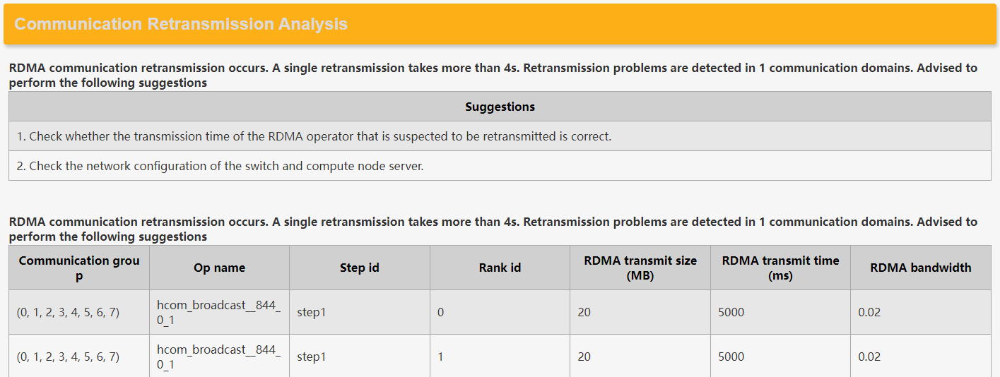

The following figure shows an example of **Bandwidth Contention Analysis**.

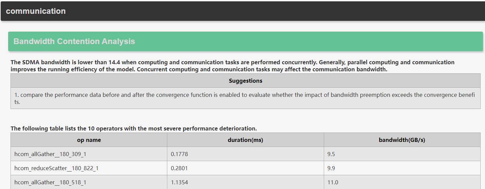

The following figure shows an example of **Byte Alignment Analysis**.

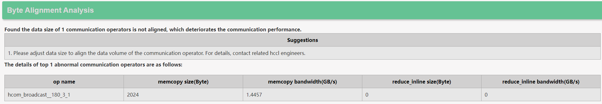

#### 5.4.3 `schedule` Module Quick Reference

The **`schedule`** module includes several checks, such as **GC Analysis**, **Affinity API Issues**, **`aclopCompile`**, **SyncBatchNorm Issues**, **Synchronize Stream Issues**, and **Fusible Operator Analysis**.

| Issue Type | What It Identifies | Suggested Action |
| --- | --- | --- |
| GC Analysis | Abnormal garbage collection events | Address the issue through effective Python memory management, by using `gc.set_threshold()` to adjust garbage collection thresholds, or by using `gc.disable()` to disable garbage collection |
| Affinity API Issues | Affinity API replacement issues | Locate the code that needs to be modified based on the stack and refer to the API replacement examples |
| Operator Dispatch Issues  | Operator dispatch issues (Path 3/Path 5) | Pay attention to operator dispatch issues such as `aclopCompile` and modify the execution script based on the suggestions in the report |
| SyncBatchNorm Issues | BatchNorm synchronization issues | Check whether synchronized BatchNorm introduces scheduling overhead |
| Synchronize Stream Issues | Stream synchronization issues | Modify the corresponding code based on the stack to eliminate unnecessary stream synchronization |
| Fusible Operator Analysis | Operator sequences with host or MTE bottlenecks | Use the results for code optimization or development of fusible operators |

The results of **Fusible Operator Analysis** are displayed in the terminal and saved in the `mstt_advisor_{timestamp}.xlsx` file. The file contains the **Host bottleneck-based operator sequence analysis** and **MTE bottleneck-based operator sequence analysis** tabs, as shown in the following figure.

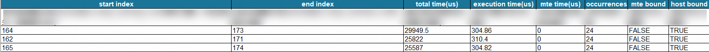

| Field | Description |
| --- | --- |
| start index | Index of the sequence's starting operator in `kernel_details.csv` or `op_summary.csv` (excluding the header; the starting index is `0`) |
| end index | Index of the sequence's ending operator in `kernel_details.csv` or `op_summary.csv` |
| total time(us) | Total duration of the operator sequence, including operator gaps, in μs |
| execution time(us) | Total execution duration of the operators in the sequence, in μs |
| mte time(us) | Total data movement duration of the operators in the sequence, in μs  |
| occurrences | Number of times the sequence occurs |
| mte bound | Indicates whether the sequence is MTE-bound |
| host bound  | Indicates whether the sequence is Host-bound |

The following figure shows an example of **GC Analysis**.

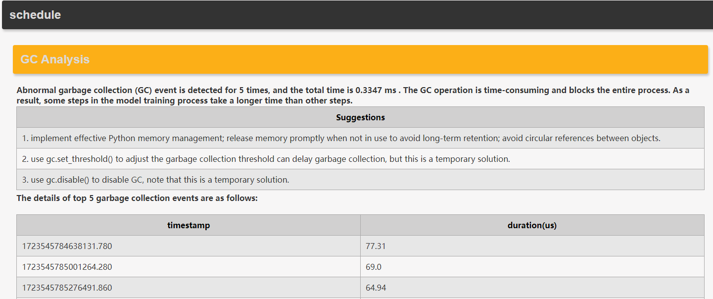

The `gc.set_threshold()` and `gc.disable()` functions shown in the preceding figure are described as follows:

In Python, the **`gc`** module provides control over the garbage collector.

* `gc.set_threshold(threshold0, threshold1, threshold2)`: Sets the garbage collection thresholds. The garbage collector divides all objects into three generations (Generation 0, Generation 1, and Generation 2), and objects in each generation move to the next generation after garbage collection. `threshold0` controls the garbage collection frequency for Generation 0, `threshold1` controls the frequency for Generation 1, and `threshold2` controls the frequency for Generation 2. Setting `threshold0` to `0` disables garbage collection.
* `gc.disable()`: Disables automatic garbage collection. After `gc.disable()` is called, the garbage collector does not run automatically until `gc.enable()` is called manually.

An example of **Affinity API Issues** is shown below. Based on the stack, users can locate the code that needs to be modified and refer to the provided modification example ([Examples for Fused Operator API Replacement During Migration to Ascend](../fused_operator_api_replacement_example.md)).

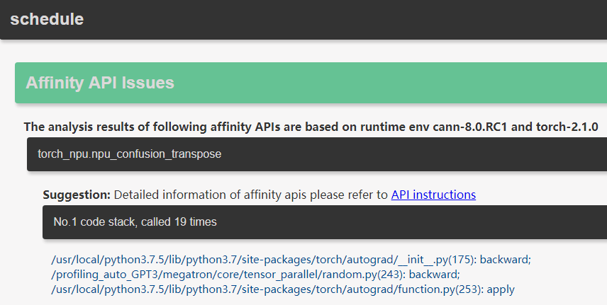

An example of **Synchronize Stream Issues** is shown below. Modify the corresponding code based on the stack to eliminate stream synchronization.

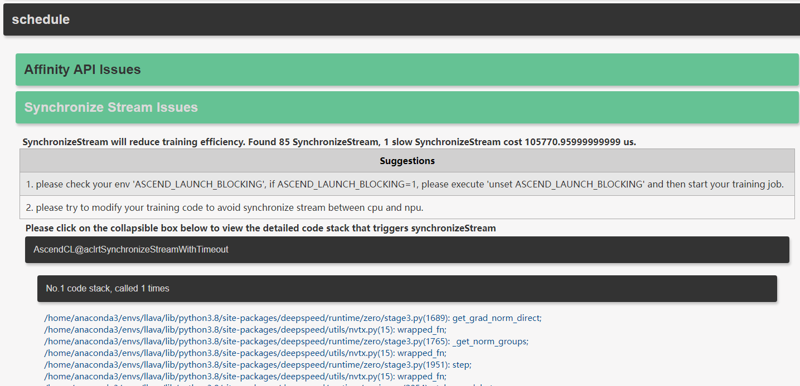

For details about the `ASCEND_LAUNCH_BLOCKING` environment variable shown in the preceding figure, see [`ASCEND_LAUNCH_BLOCKING`](https://gitcode.com/Ascend/pytorch/blob/master/docs/en/api/environment_variable/op_execution/ASCEND_LAUNCH_BLOCKING.md).

An example of **Operator Dispatch Issues** is shown below. Add the following code at the beginning of the execution script to eliminate `aclopCompile`:

```python
torch_npu.npu.set_compile_mode(jit_compile=False);
torch_npu.npu.config.allow_internal_format = False
```

For details about the APIs, see [`torch_npu.npu.set_compile_mode`](https://gitcode.com/Ascend/op-plugin/blob/master/docs/en/custom_APIs/torch_npu-npu/(beta)torch_npu-npu-set_compile_mode.md) and [`torch_npu.npu.config.allow_internal_format`](https://gitcode.com/Ascend/op-plugin/blob/master/docs/en/custom_APIs/torch_npu-npu/(beta)torch_npu-npu-config-allow_internal_format.md).

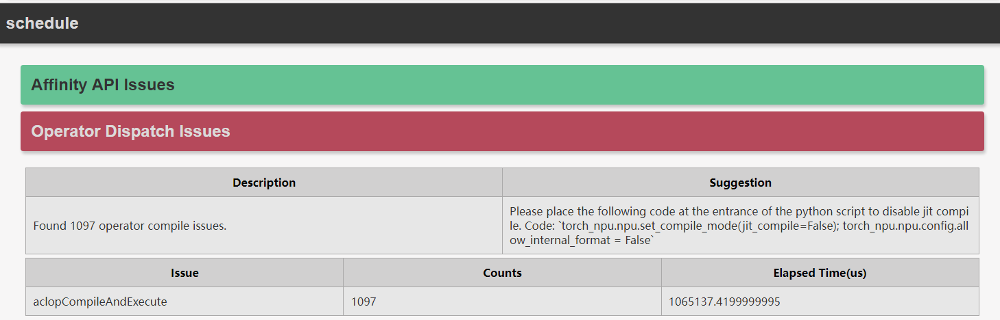

For details about the `aclopCompileAndExecute` API shown in the preceding figure, see [`aclopCompileAndExecute`](https://www.hiascend.com/document/detail/en/CANNCommunityEdition/latest/API/ascendgraphapi/aclcppdevg_03_0251.html).

#### 5.4.4 `memory` and `dataloader` Quick Reference

| Module | Issue Type | What It Identifies | Suggested Action |
| --- | --- | --- | --- |
| `memory` | Memory Operator Issues | Abnormal memory allocation and release operations | Review the abnormal allocation and release operations and locate the corresponding operator or API based on the report |
| `dataloader` | Slow Dataloader Issues | Abnormally high latency DataLoader calls | Optimize data loading using parameters such as `pin_memory` and `num_workers` |

The **`memory`** module analyzes abnormal memory allocation and release operations.

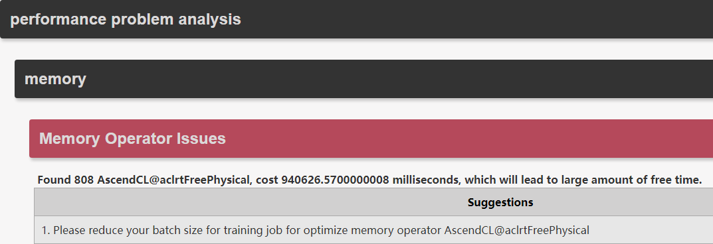

The **`dataloader`** module includes **Slow Dataloader Issues**. It primarily detects DataLoader calls with abnormally high latency and provides optimization suggestions.

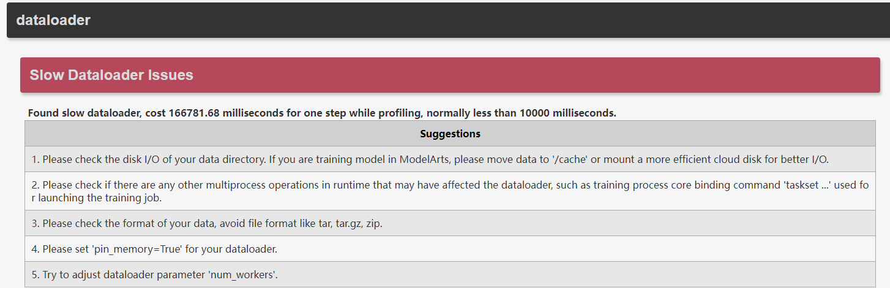

The `pin_memory` (memory locking) and `num_workers` (number of data loading subprocesses) parameters shown in the preceding figure are used for [data loading optimization](https://gitcode.com/Ascend/ModelZoo-PyTorch/blob/master/PyTorch/docs/en/performance_tuning/performance_tuning_methods/data_loading_optimization.md).

## 6. Feature Introduction (`advisor` Jupyter Notebook Mode)

### 6.1 Feature Description

The Jupyter Notebook mode of `advisor` is used to interactively view the profile data analysis process and analysis results in a Notebook.

Before using Jupyter Notebook mode, prepare the profile data collected using Ascend PyTorch Profiler. For details about how to collect profile data, see the [Ascend PyTorch Profiler](https://gitcode.com/Ascend/pytorch/blob/master/docs/en/developer_notes/ascend_pytorch_profiler_user_guide.md).

> Jupyter Notebook mode supplements command-line mode and is not part of the main command-line workflow. Jupyter Notebook mode is not supported for MindSpore scenarios.

### 6.2 Preparations

**Installing Jupyter Notebook**

Install the Jupyter Notebook tool. For detailed installation and usage instructions, visit the official Jupyter Notebook website.

```bash
pip install jupyter notebook
```

**Downloading the `msprof-analyze` Source Code**

```bash
git clone https://gitcode.com/Ascend/msprof-analyze -b master
```

**Preparing Profile Data**

`advisor` requires a directory containing the collected profile data. For details about how to collect profile data, see the [Ascend PyTorch Profiler](https://gitcode.com/Ascend/pytorch/blob/master/docs/en/developer_notes/ascend_pytorch_profiler_user_guide.md).

**Constraints**

Jupyter Notebook mode is not supported for MindSpore scenarios.

### 6.3 Starting Jupyter Notebook

Go to the `msprof_analyze/advisor` directory and run the following command to start Jupyter Notebook:

```bash
jupyter notebook
```

After the command execution is complete, the browser automatically opens the `msprof_analyze/advisor` directory, as shown in the following example.

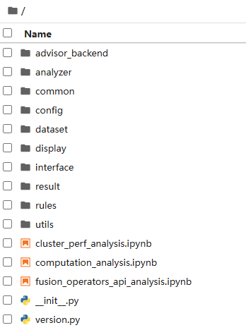

In a Linux environment, the terminal displays the URL of the Jupyter Notebook page. Copy the URL and access it using a browser. When running on a remote server, replace `localhost` in the URL with the IP address of the remote server.

### 6.4 Running an Analysis Task

Each `.ipynb` file corresponds to a profile data analysis task. Open the required `.ipynb` file and enter the path to the profile data collected using Ascend PyTorch Profiler in the `*_path` parameter, as shown in the following example.

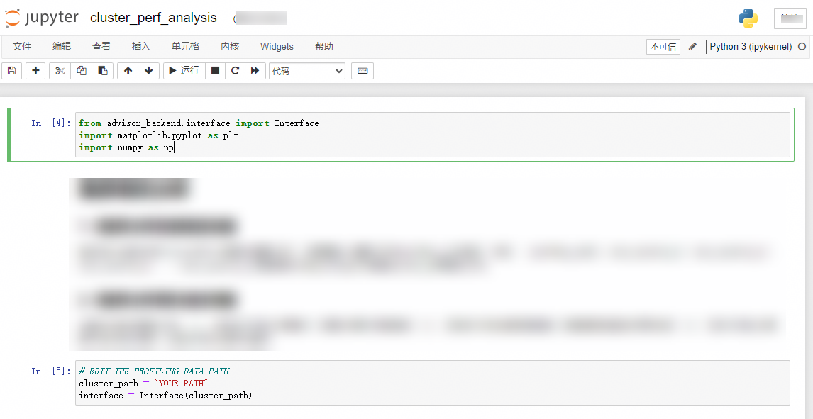

Click **Run** to run the profile data analysis task.

The analysis results are displayed on the `.ipynb` page.

## 7. Frequently Asked Questions (FAQ)

**Q1: Which Command Should I Use for the First Run?**

Use `advisor all` first. This command covers overall performance bottlenecks, computation, communication, scheduling, memory, data loading, and comparison analysis.

```bash
msprof-analyze advisor all -d /path/to/profiling_data/
```

**Q2: Can I Perform Analysis Without Benchmark Data?**

Yes. A scenario without a benchmark is used when `-bp` is not specified. The tool determines whether to compare kernel and API profile data based on computation and idle durations in the profile data, using the slow-rank data as the benchmark data and the fast-rank data as the target data.

**Q3: How Do I Run the Tool with Benchmark Data?**

Run `advisor all` with the `-bp` option:

```bash
msprof-analyze advisor all -d /path/to/profiling_data/ -bp /path/to/benchmark_profiling_data/
```

**Q4: Can I Use `-bp` with `computation` and `schedule`?**

No. The `computation` and `schedule` subcommands do not support the `-bp` option.

**Q5: Which Should I Review First, the HTML or XLSX Report?**

You are advised to first review the **`overall`**, **`comparison`**, and **`performance problem analysis`** modules in the HTML report to confirm the overall conclusions and high-priority issues, and then use the XLSX details to locate specific operators, APIs, or communication items.

**Q6: Why Does the `comparison` Module Show Only the Top 10 Records?**

The **`comparison`** module in the `mstt_advisor_{timestamp}.html` file displays only the top 10 kernel and API records. For detailed data, see the `mstt_advisor_{timestamp}.xlsx` file.

**Q7: How Should I Specify the Data Path for Single-Rank and Cluster Scenarios?**

For a single-rank scenario, specify the `*_ascend_pt` or `*_ascend_ms` directory containing the profile data. For a multi-rank or cluster scenario, specify the parent directory of the `*_ascend_pt` or `*_ascend_ms` directory.

**Q8: What Should I Do If the Tool Does Not Run Because the File Is Too Large or the Ownership Is Inconsistent?**

After confirming the risks, you can use `--force`. This option forces the tool to skip directory or file ownership checks and ignore the file size checks for CSV files larger than 5 GB, JSON files larger than 10 GB, and DB files larger than 8 GB.
