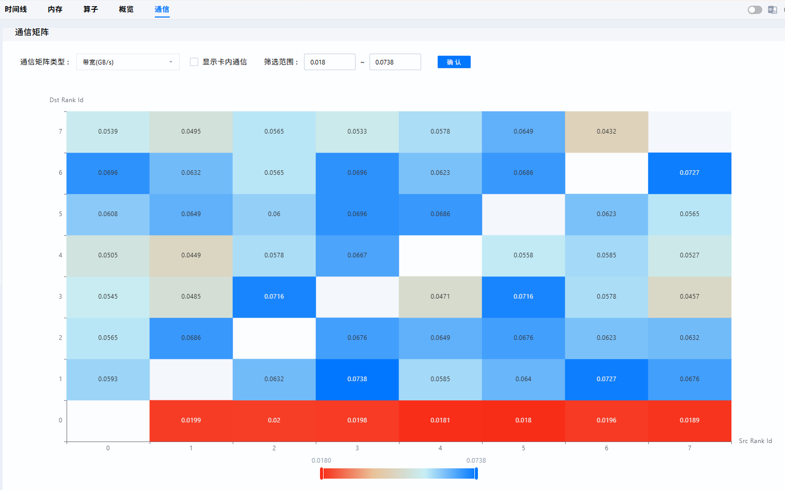

# cluster_analyse

## Overview

The cluster analysis (`cluster_analyse`) feature is designed for cluster scenarios. Basic functions include analysis of durations within iterations of the communication group, communication time analysis, and communication matrix analysis. This tool can be used to locate issues of slow ranks, slow nodes, and slow links.

## Profile Data Collection

Currently, `cluster_analyse` supports the following four types of profile data.

| Collection Tool| Supported Result Type| Collection Guide                                                                                                                                         |
| --- | --- |-----------------------------------------------------------------------------------------------------------------------------------------------|
| msProf | db | [MindStudio Profiler](https://gitcode.com/Ascend/msprof)                                                                                                |
| Ascend PyTorch Profiler | text, db| [Ascend PyTorch Profiler](https://gitcode.com/Ascend/pytorch/blob/v2.7.1/docs/zh/ascend_pytorch_profiler/ascend_pytorch_profiler_user_guide.md)|
| MindSpore Profiler | text, db|                 |
| msMonitor | db | [msMonitor](https://gitcode.com/Ascend/msmonitor)                                                                             |

## Data Requirements

Ascend PyTorch Profiler is used an example to describe the input data requirements.

### Collection Configuration

You are advised to set `profiler_level` to `Level1` or higher. If `profiler_level` is set to `Level0` or lower, the tool does not collect data for small communication operators. Therefore, the communication bandwidth and communication matrix information cannot be obtained, and the tool can only aggregate the durations within iterations of `step_trace_time` for the cluster.

```python
experimental_config = torch_npu.profiler._ExperimentalConfig(
    profiler_level=torch_npu.profiler.ProfilerLevel.Level1
)
```

### Data Format

Ascend PyTorch Profiler supports the following two result formats (either can be used):

#### Text format results

In the `*_ascend_pt` directory collected for a rank, the available text format results must contain the following files:

- `profiler_info_*.json`
- `ASCEND_PROFILER_OUTPUT/step_trace_time.csv`
- `ASCEND_PROFILER_OUTPUT/communication.json`
- `ASCEND_PROFILER_OUTPUT/communication_matrix.json`

#### DB format results

In the `*_ascend_pt` directory collected for a rank, the available `db` format results typically contain the following files:

- `ASCEND_PROFILER_OUTPUT/analysis.db`
- `ASCEND_PROFILER_OUTPUT/ascend_pytorch_profiler_{rank_id}.db`

### Requirements for the Cluster Input Directory

During cluster analysis, the `-d` option must point to the root directory of the cluster profile data. The root directory must contain profiling subdirectories for multiple ranks collected during the same task. To ensure analysis result accuracy, the cluster directory must meet the following requirements:

- Contain only the full data of all ranks collected during the same task to avoid introducing data from different tasks or missing data of any rank.
- Maintain the complete directory hierarchy and naming for each rank to ensure the tool correctly identifies rank relationships.

If data from different tasks is introduced or data of any rank is missing, the `src_rank` and `dst_rank` mappings in the communication matrix may be inaccurate, and warnings will be generated.

## Cluster Communication Data Summary

### Procedure

1. Install the tool by referring to [msprof-analyze Installation Guide](../getting_started/install_guide.md). You are advised to install the latest version.

2. Copy and aggregate the data of all ranks to a directory and run the following command to generate the `cluster_analysis_output` folder:

   ```bash
   # Command-line mode
   msprof-analyze cluster -d {cluster profiling data path} [-m mode] [-o output_path] [--data_simplification] [--force]
   # Example
   msprof-analyze cluster -m all -d ./cluster_data -o ./output
   ```

   or

   ```bash
   # Script mode
   python3 cluster_analysis.py -d {cluster profiling data path} [-m mode] [-o output_path] [--data_simplification] [--force]
   # Example
   python3 cluster_analysis.py -d ./cluster_data -o ./output
   ```

   Command-line Options

   | Option               | Description                                                        | Mandatory (Yes/No)|
   | --------------------- | ------------------------------------------------------------ | -------- |
   | --profiling_path or -d | Specifies the profile data collection directory. If the `-o` option is not specified, running the analysis script automatically creates the `cluster_analysis_output` folder in this directory to save the analysis data.| Yes      |
   | --output_path or -o    | Specifies a custom output path. Running the analysis script automatically creates the `cluster_analysis_output` folder in this directory to save the analysis data.| No      |
   | --mode or -m           | Specifies the data parsing mode to execute. For details about the values, see the **Arguments for `--mode`** table.              | No      |
   | --force               | Forcibly executes `cluster`. This option forcibly skips the following checks:<br>        Ownership check: Proceed even if the current user is not the owner of the specified directory or files.<br>        File size check: Proceed even if a CSV file exceeds 5 GB, a JSON file exceeds 10 GB, or a DB file exceeds 8 GB.<br>Specifying this option enables forced execution, which is disabled if not specified.| No      |

   Arguments for `--mode`

   | Argument              | Description                                                        | Mandatory (Yes/No)|
   | -------------------- | ------------------------------------------------------------ | -------- |
   | communication_matrix | Parses the communication matrix data.                                          | No      |
   | communication_time   | Parses the communication duration data.                                          | No      |
   | all                  | Parses both the communication matrix (`communication_matrix`) and communication duration (`communication_matrix`) data. The default value of `--mode` is `all`.| No      |

3. You are advised to use MindStudio Insight to import the generated `cluster_analysis_output` folder for visualized display, as shown in the following figure. For details, see [MindStudio Insight User Guide](https://www.hiascend.com/document/detail/zh/mindstudio/830/GUI_baseddevelopmenttool/msascendinsightug/Insight_userguide_0002.html).

    
        <div style="text-align: center;">
        **Figure 1** Cluster computing/communication overview
        </div>

    
        <div style="text-align: center;">
        **Figure 2** Cluster communication matrix
        </div>

### Deliverables

#### `cluster_step_trace_time.csv`

This file is generated when the data parsing mode is `communication_matrix`, `communication_time`, or `all`.

Column A: **Steps**. This column is set during profile data collection. Generally, profile data for a single step is sufficient for cluster performance analysis. If multiple steps are collected, filter them first.

Column B: **Type**. Valid values are `rank` and `stage`, which are closely related to the index. `rank` represents a single rank, while `stage` represents a rank group (PP parallel stage). If the type is `stage`, the information in columns D through K represents the maximum values within the rank group.

Column C: **Index**. This column is related to the type and indicates the device ID.

Column D: **Computing**. This column displays the computation duration.

Column E: **Communication (Not Overlapped)**. This column displays the communication duration not overlapped by computation.

Column F: **Overlapped**. This column displays the duration where computation and communication overlap.

Column G: **Communication**. This column displays the total communication duration.

Column H: **Free**. This column displays the idle duration, which indicates the duration where the device is neither communicating nor computing. This may include the SDMA copy and idle wait durations.

Column I: **Stage**. This column and the following two columns are valid only for PP parallelism. Stage duration represents the total time excluding the duration of `receive` operators.

Column J: **Bubble**. This column displays the bubble time, which is the sum of the duration of all `receive` operators.

Column K: **Communication (Not Overlapped and Exclude Receive)**. This column indicates the communication duration that is not overlapped and excludes the duration of `receive` operators.

Column L: **Preparing**. This column displays the duration from the start of an iteration to the execution of the first computation or communication operator.

Column M: **DP Index**. This column displays the index of the DP group to which the cluster data belongs after being partitioned based on the parallel strategy. If the data is not collected, this column is not displayed.

Column N: **PP Index**. This column displays the index of the PP group to which the cluster data belongs after being partitioned based on the parallel strategy. If not collected, this column is not displayed.

Column O: **TP Index**. This column displays the index of the TP group to which the cluster data belongs after being partitioned based on the parallel strategy. If not collected, this column is not displayed.

**Tips**: Filter Column B by the `stage` type to check for issues between stages. Then, filter Column B by the `rank` type to check for issues between ranks. Perform the following troubleshooting checks:

- Check for slow ranks or load imbalance based on the computation duration difference.

- Check for host bound issues or uneven distribution based on the idle duration statistics.

- Check for excessive communication duration based on the duration displayed in the **Communication (Not Overlapped and Exclude Receive)** column.

- Check whether the bubble configuration is appropriate and whether imbalance exists between stages based on the proportion of bubble time and the theoretical calculation formula.

Theoretically, the values for these durations should remain relatively consistent. If the difference between the maximum and minimum values exceeds 5%, a slow rank may exist.

#### `cluster_communication_matrix.json`

Generated when the data parsing mode is `communication_matrix` or `all`.

Open the JSON file using VS Code or a JSON viewer and search for `Total`. There will be multiple results. Generally, the structure of the link bandwidth information is as follows:

```bash
{src_rank}-{dst_rank}: {
    "Transport Type": "LOCAL",
    "Transit Time(ms)": 0.02462,
    "Transit Size(MB)": 16.777216,
    "Bandwidth(GB/s)": 681.4466
}
```

**Tips**: You can identify slow link issues based on the rank interconnection bandwidth and the link type.

- `LOCAL`: represents on-chip copy, which provides the highest speed.
- `HCCS` or `PCIE`: represents intra-node inter-chip copy, which provides medium speed.
- `RDMA`: represents inter-node copy, which provides the lowest speed.

#### `cluster_communication.json`

Generated when the data parsing mode is set to `communication_time` or `all`.

It mainly provides the communication duration data.

#### `communication_group.json`

Records communication group information. It is generated by parsing `analysis.db`. `collective` indicates a collective communication group, and `P2P` indicates point-to-point communication. Ignore this file.

#### `cluster_analysis.db`

Generated by parsing `analysis.db` or `ascend_pytorch_profiler_{rank_id}.db`. The tool parses different data based on the data parsing mode. You can use the MindStudio Insight tool to display the data.
