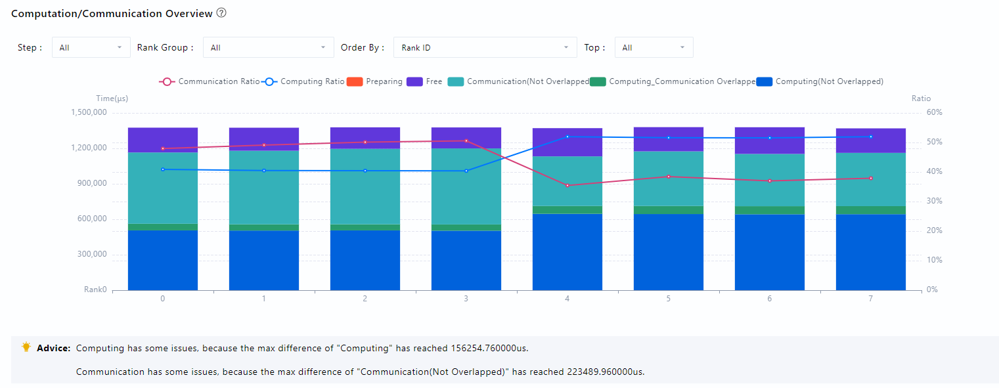
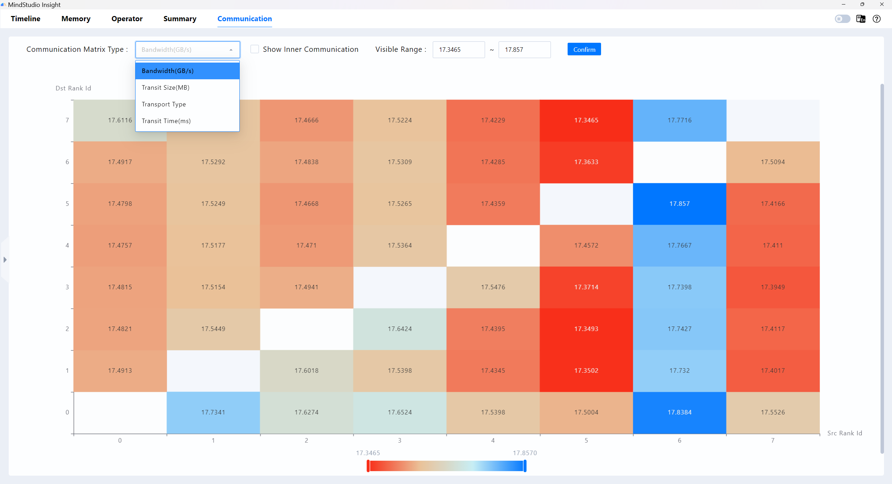

# cluster_analyse

## 1. Overview

The cluster analysis (`cluster_analyse`) feature is designed for cluster scenarios. Its basic functions include analysis of durations within communication domains during iterations, communication time analysis, and communication matrix analysis. It can be used to locate slow ranks, slow nodes, and slow links. The generated deliverables are recommended for visualization in `MindStudio Insight`. Typical application scenarios include:

* **Determining whether slow ranks or load imbalance exist**: Compare the computation time, communication time, and idle time of each rank or stage. If the difference between durations of the same type exceeds 5%, further investigation into slow ranks or communication bottlenecks can be performed.
* **Determining whether slow links or bandwidth anomalies exist**: Check the link type (`LOCAL`, `HCCS`, `PCIE`, or `RDMA`) and transmission bandwidth between ranks. The bandwidth of links of the same type should generally be similar. Significant differences can be used to locate specific slow links.
* **Locating communication operators or communication domains where durations are concentrated**: Check the duration distribution of communication operators and the rank range within communication domains to quickly locate abnormal communication operations.

## 2. Preparations

### 2.1 Environment Setup

Install the `msprof-analyze` tool. For details, see [msprof-analyze Installation Guide](../install_guide/msprof-analyze_install_guide.md). You are advised to install the latest version.

### 2.2 Data Preparation

The current cluster analysis capability supports the following four types of profile data as input.

| Collection Tool | Supported Result Type | Collection Guide |
| --- | --- | --- |
| msProf | db | [MindStudio Profiler](https://gitcode.com/Ascend/msprof/blob/master/docs/en/quick_start/msprof_quick_start.md) |
| Ascend PyTorch Profiler | text, db | [Ascend PyTorch Profiler](https://gitcode.com/Ascend/pytorch/blob/master/docs/en/developer_notes/ascend_pytorch_profiler_user_guide.md) |
| MindSpore Profiler | text, db | [MindSpore Profiler](https://gitcode.com/Ascend/docs/blob/master/MindStudio/master/en/menu/mindspore_profiler_user_guide.md) |
| msMonitor | db | [MindStudio Monitor](https://gitcode.com/Ascend/msmonitor/blob/master/docs/en/quick_start/msmonitor_quick_start.md) |

The following sections use Ascend PyTorch Profiler as an example to describe the input data requirements.

#### 2.2.1 Collection Configuration

You are advised to set `profiler_level` to `Level1` or higher. `Level0` or lower does not collect data for small communication operators. Therefore, communication bandwidth and communication matrix information cannot be obtained, and only the `step_trace_time` durations within each cluster iteration can be aggregated.

```python
experimental_config = torch_npu.profiler._ExperimentalConfig(
    profiler_level=torch_npu.profiler.ProfilerLevel.Level1
)
```

#### 2.2.2 Data Format

Ascend PyTorch Profiler supports the following two result formats. Either format can be used. You are advised to use the `db` format for profile data because it provides higher processing efficiency.

##### 2.2.2.1 `db`-Format Profile Data

Open the `*_ascend_pt` directory of the profile data collected from a device. The available `db`-format profile data should normally contain the following directories and files:

```text
*_ascend_pt
├── ASCEND_PROFILER_OUTPUT
    ├── analysis.db # Communication details, including the transmission volume, transmission links, and communication matrix
    └── ascend_pytorch_profiler_{rank_id}.db
└── profiler_info_*.json
```

> [!NOTE]
>
> For scenarios where profile data from an ultra-large cluster needs to be aggregated for analysis, the data volume is large and the data transfer overhead is high. You can save only the `analysis.db` and `profiler_info_*.json` files (the original directory structure must be retained) and use them for `msprof-analyze cluster` analysis. This can reduce the time required to transfer and store files while completing basic performance analysis.

##### 2.2.2.2 `text`-Format Profile Data

If `text`-format results are already available, they can also be used directly as input. Open the `*_ascend_pt` directory of the profile data collected from a device. The available `text`-format results must contain the following directories and files:

```text
*_ascend_pt                         # Single-device profile data
├── ASCEND_PROFILER_OUTPUT
    ├── step_trace_time.csv         # Iteration duration
    ├── communication.json          # Communication duration
    └── communication_matrix.json   # Communication matrix information
└── profiler_info_*.json
```

### 2.3 Requirements for the Cluster Input Directory

During cluster analysis, the `-d` option must point to the root directory of the cluster profile data. The root directory must contain profiling subdirectories for multiple devices collected during the same profiling session. To ensure analysis result accuracy, the cluster directory must meet the following requirements:

* Contain only the complete data of all devices collected during the same profiling session to avoid mixing data from different batches or missing data of some ranks.
* Maintain the complete directory hierarchy and naming for each device to ensure that the tool correctly identifies rank relationships.

If data from different batches is mixed or some ranks are missing, the `src_rank` and `dst_rank` mappings in the communication matrix may be inaccurate, and warnings will be generated.

A recommended input directory structure is as follows:

```text
profiling_data/
├── dp0_pp0_tp0_dcp0_ep0_rank0_167032_20260527143703527_ascend_pt/
│   ├── ASCEND_PROFILER_OUTPUT
│   └── profiler_info_*.json
├── dp0_pp0_tp1_dcp0_ep1_rank1_167033_20260527143703524_ascend_pt/
│   ├── ASCEND_PROFILER_OUTPUT
│   └── profiler_info_*.json
├── dp0_pp0_tp2_dcp0_ep2_rank2_167034_20260527143703524_ascend_pt/
│   ├── ASCEND_PROFILER_OUTPUT
│   └── profiler_info_*.json
└── dp0_pp0_tp3_dcp0_ep3_rank3_167035_20260527143703524_ascend_pt/
    ├── ASCEND_PROFILER_OUTPUT
    └── profiler_info_*.json
```

### 2.4 Constraints

For CCU scenarios on Ascend 950 products, the communication-related analysis features do not provide meaningful results because communication matrix and communication operator bandwidth data cannot be collected.

## 3. Feature Introduction

### 3.1 Feature Description

Analyzes profile data for the input cluster scenario.

### 3.2 Command Format

**Command-line execution (recommended)**

```bash
msprof-analyze cluster -d <profiling_path> [-m <mode>] [-o output_path] [--agent] [--force]
```

**Script execution**

```bash
python3 cluster_analysis.py -d <profiling_path> [-m mode] [-o output_path] [--agent] [--force]
```

### 3.3 Command-line Options

| Option | Required (Yes/No) | Description |
| ---- | --- | --- |
| `--profiling_path` or `-d` | Yes | Specifies the directory where profile data is aggregated. If `-o` is not specified, the `cluster_analysis_output` folder is automatically created in this directory after the analysis command is run to save the analysis data.  |
| `--output_path` or `-o` | No | Specifies a custom output path. After the analysis command is run, the `cluster_analysis_output` folder is automatically created in this directory to save the analysis data. |
| `--mode` or `-m` | No | Specifies the data parsing mode. For details about the available values, see the **Arguments for `--mode`** table. |
| `--agent` | No | Outputs the analysis results in JSON format to standard output. Specifying this option enables this function. If this option is not specified, this function is disabled by default. |
| `--force` | No | Forcibly executes `cluster`. Specifying this option forcibly skips the following checks:<br>• Ownership check: Proceed even if the current user is not the owner of the specified directory or files.<br>• File size check: Proceed even if a CSV file exceeds 5 GB, a JSON file exceeds 10 GB, or a DB file exceeds 8 GB.<br>• Permission check: Proceed even if the read or write permissions of the specified directory or file do not meet the validation requirements.<br>Specifying this option enables forced execution, which is disabled if this option is not specified. |

**Arguments for `--mode`**

| Argument | Required (Yes/No) | Description |
| --- | --- | --- |
| `communication_matrix` | No | Parses communication matrix data. |
| `communication_time` | No | Parses communication duration data. |
| `all` | No | Parses both communication matrix (`communication_matrix`) and communication duration (`communication_time`) data. The default value of `--mode` is `all`. |

### 3.4 Usage Example

Copy and aggregate the data from all devices into one directory, and run the following commands:

**Command-line execution (recommended)**

```bash
msprof-analyze cluster -m all -d ./cluster_data -o ./output
```

**Script execution**

```bash
python3 cluster_analysis.py -m all -d ./cluster_data -o ./output
```

### 3.5 Output Description

The `cluster_analysis_output` directory is generated under the output path. For details about the result files, see [4. Output File Description](#4-output-file-description).

## 4. Output File Description

### 4.1 Deliverables

| Deliverable | Input Format | Description |
| --- | --- | --- |
| `cluster_analysis.db` | db | Contains data that can be imported into MindStudio Insight for visualization and is suitable for large-scale cluster data. |
| `cluster_step_trace_time.csv` | text | Contains details of cluster iteration durations, including rank/stage-level durations, and is used to assist in identifying slow ranks, load imbalance, and other issues. |
| `cluster_communication.json` | text | Provides details of cluster communication operator durations. |
| `cluster_communication_matrix.json` | text | Provides the cluster communication matrix, including the link type, bandwidth, and transmission time between ranks. |
| `communication_group.json` | text | Provides information about cluster collective communication and point-to-point communication domains. |

### 4.2 Recommended Viewing Method

**Recommended viewing order**

1. After the analysis is complete, you are strongly advised to import the entire `cluster_analysis_output` folder into MindStudio Insight.
2. On the cluster overview page, view the computation, communication, idle, and Bubble durations by rank/stage, and first determine whether there are slow ranks or load imbalance between stages.
3. On the communication matrix page, view the link type, communication data volume, bandwidth, and transmission time between ranks to determine whether there are slow links or abnormal bandwidth.
4. To further locate communication operators or communication domains, view the communication duration details and communication domain information on the visualization page.

**Recommended viewing tool**

You are advised to use MindStudio Insight to import the generated `cluster_analysis_output` folder for visualization, as shown in the following figures. For details about how to use the tool, see the [MindStudio Insight User Guide](https://gitcode.com/Ascend/msinsight/blob/master/docs/en/user_guide/overview.md).


    <div style="text-align: center;">
    **Figure 1** Cluster computation/communication overview
    </div>


    <div style="text-align: center;">
    **Figure 2** Cluster communication matrix
    </div>

### 4.3 Fields in Deliverables

#### 4.3.1 `cluster_step_trace_time.csv`

Generated when the data parsing mode is `communication_matrix`, `communication_time`, or `all`.

| Field | Description |
| --- | --- |
| Step | Step number set when the profile data is collected. Generally, profile data for a single step is sufficient for cluster performance analysis. If multiple steps are collected, filter the target step first. |
| Type | Data type, which mainly includes `rank` and `stage`. `rank` represents a single-device rank, while `stage` represents a rank group in a PP parallel scenario. |
| Index | Index associated with `Type`. When `Type` is `rank`, it indicates the device ID; when `Type` is `stage`, it indicates the stage number. |
| Computing | Computation time. |
| Communication(Not Overlapped) | Communication duration that is not overlapped by computation. |
| Overlapped | Duration during which computation and communication overlap. |
| Communication | Total communication time. |
| Free | Idle time on the device when it is neither communicating nor computing. This may result from SDMA copies, host bound, or waiting. |
| Stage | Valid for PP parallelism. Indicates the stage duration excluding the duration of `receive` operators. |
| Bubble | Sum of the durations of all `receive` operators. |
| Communication(Not Overlapped and Exclude Receive) | Communication duration that is not overlapped by computation, excluding `receive` operators. |
| Preparing | Preparation time from the start of an iteration to the execution of the first computation or communication operator. |
| DP Index | Index of the DP group to which the data belongs after being partitioned according to the parallel strategy. This field is not displayed if the data is not collected. |
| PP Index | Index of the PP group to which the data belongs after being partitioned according to the parallel strategy. This field is not displayed if the data is not collected. |
| TP Index | Index of the TP group to which the data belongs after being partitioned according to the parallel strategy. This field is not displayed if the data is not collected. |

For troubleshooting, you can first filter `Type` by `stage` to determine whether there are significant duration differences between stages, and then filter `Type` by `rank` to determine whether any individual rank is abnormal. In principle, durations of the same type should be relatively consistent. If the difference between the maximum and minimum values exceeds 5%, you can focus on investigating slow ranks, load imbalance, host bound, or an excessively high proportion of communication duration.

#### 4.3.2 `cluster_communication_matrix.json`

Generated when the data parsing mode is `communication_matrix` or `all`. It records communication matrix information between ranks. You are advised to view this information first on the communication matrix page of MindStudio Insight. When processing the file programmatically, you can focus on the following structure:

```json
{
    "{src_rank}-{dst_rank}": {
        "Transport Type": "LOCAL",
        "Transit Time(ms)": 0.02462,
        "Transit Size(MB)": 16.777216,
        "Bandwidth(GB/s)": 681.4466
    }
}
```

| Field | Description |
| --- | --- |
| `{src_rank}-{dst_rank}` | Rank IDs at the two ends of the communication link. |
| `Transport Type` | Link type. `LOCAL` indicates on-chip copying; `HCCS` or `PCIE` indicates intra-node inter-chip copying; and `RDMA` indicates inter-node copying. |
| `Transit Time(ms)` | Transmission duration of the link. |
| `Transit Size(MB)` | Amount of data transmitted over the link. |
| `Bandwidth(GB/s)` | Bandwidth of the link. |

The bandwidth of links of the same type should generally be similar. If the `Bandwidth(GB/s)` of a `{src_rank}-{dst_rank}` link is significantly lower than that of links of the same type, you can determine whether a slow link exists by considering the link type, transmission data volume, and transmission duration.

#### 4.3.3 `cluster_communication.json`

Generated when the data parsing mode is `communication_time` or `all`. It records details of communication durations and can be used to programmatically extract communication operator durations, communication domains, and rank ranges. If the proportion of communication duration in `cluster_step_trace_time.csv` is relatively high, this file can be used to further locate communication operators or communication domains where durations are concentrated.

#### 4.3.4 `communication_group.json`

Records communication domain information. `collective` indicates a collective communication domain, and `P2P` indicates a point-to-point communication domain. When you need to determine which ranks are included in a communication domain or understand the correspondence between communication operators and communication domains, you can use this file together with `cluster_communication.json`.

#### 4.3.5 `cluster_analysis.db`

Generated after parsing `db`-format profile data. It is used to support visualization in MindStudio Insight and can also be used for subsequent database analysis. The following table describes tables generated during cluster analysis.

| Table | Generation Scenario | Purpose |
| --- | --- | --- |
| `ClusterBaseInfo` | `db`-format profile data | Records basic cluster information, such as parallel strategy parameters. |
| `ClusterStepTraceTime` | `db`-format profile data | Records the breakdown of iteration durations at the rank/stage level and corresponds to `cluster_step_trace_time.csv`. |
| `CommunicationGroupMapping` | `db`-format profile data, with communication domain information available | Records communication domains, rank sets, and parallel group information. |
| `ClusterCommunicationTime` | `db`-format profile data, with `communication_time` or `all` executed | Records aggregated communication operator duration information at the cluster level. |
| `ClusterCommunicationBandwidth` | `db`-format profile data, with `communication_time` or `all` executed | Records aggregated cluster-level communication bandwidth, packet size distribution, and transmission duration information. |
| `ClusterCommunicationMatrix` | `db`-format profile data, with `communication_matrix` or `all` executed | Records cluster-level communication matrix information between ranks. |

The actual tables generated depend on the collection tool, collection level, `--mode` value, and completeness of the original profile data. If a type of original data is missing, the corresponding table may not be generated.

##### 4.3.5.1 `ClusterBaseInfo`

| Field | Description |
| --- | --- |
| `key` | Name of the basic information, such as distributed parameters |
| `value` | Content of the basic information, usually a serialized string |

##### 4.3.5.2 `ClusterStepTraceTime`

| Field | Description |
| --- | --- |
| `step` | Step number. |
| `type` | Data type, which mainly includes `rank` and `stage`. |
| `index` | Rank ID or stage ID. |
| `computing` | Computation time, in ms. |
| `communication_not_overlapped` | Communication duration not overlapped by computation, in ms. |
| `overlapped` | Duration during which computation and communication overlap, in ms. |
| `communication` | Total communication time, in ms. |
| `free` | Idle time on the device, in ms. |
| `stage` | Stage time in a PP parallel scenario, in ms. |
| `bubble` | Sum of the durations of all `receive` operators, in ms. |
| `communication_not_overlapped_and_exclude_receive` | Communication duration not overlapped by computation, excluding `receive` operators, in ms. |
| `preparing` | Preparation time from the start of an iteration to the execution of the first computation or communication operator, in ms. |
| `dp_index` | Index of the DP group to which the data belongs. If the data is not collected, this field is empty or has a default value. |
| `pp_index` | Index of the PP group to which the data belongs. If the data is not collected, this field is empty or has a default value. |
| `tp_index` | Index of the TP group to which the data belongs. If the data is not collected, this field is empty or has a default value. |

##### 4.3.5.3 `CommunicationGroupMapping`

| Field | Description |
| --- | --- |
| `type` | Communication domain type, such as collective communication or point-to-point communication |
| `rank_set` | Set of ranks included in the communication domain |
| `group_name` | Name of the communication domain |
| `group_id` | ID of the communication domain |
| `pg_name` | Name of the parallel group |

##### 4.3.5.4 `ClusterCommunicationTime`

| Field | Description |
| --- | --- |
| `step` | Step number. |
| `type` | Communication operator type, including collective communication and point-to-point communication |
| `hccl_op_name` | HCCL communication operator name |
| `group_name` | Communication domain name |
| `start_timestamp` | Start timestamp of the communication operator, in us |
| `elapsed_time` | Total duration of the communication operator, in ms |
| `transit_time` | Data transmission duration, in ms |
| `wait_time` | Waiting duration, in ms |
| `synchronization_time` | Synchronization duration, in ms |
| `idle_time` | Idle duration, in ms |
| `synchronization_time_ratio` | Proportion of synchronization duration, ranging from 0 to 1 |
| `wait_time_ratio` | Proportion of waiting duration, ranging from 0 to 1 |

##### 4.3.5.5 `ClusterCommunicationBandwidth`

| Field | Description |
| --- | --- |
| `step` | Step number |
| `type` | Communication operator type, including collective communication and point-to-point communication |
| `hccl_op_name` | HCCL communication operator name |
| `group_name` | Communication domain name |
| `band_type` | Communication link type |
| `transit_size` | Amount of data transmitted, in MB |
| `transit_time` | Transmission duration, in ms |
| `bandwidth` | Bandwidth, in GB/s |
| `large_packet_ratio` | Proportion of large packets, ranging from 0 to 1 |
| `package_size` | Packet size, in MB |
| `count` | Number of communications corresponding to the packet size |
| `total_duration` | Total duration corresponding to the packet size, in ms |

##### 4.3.5.6 `ClusterCommunicationMatrix`

| Field | Description |
| --- | --- |
| `step` | Step number |
| `type` | Communication operator type, including collective communication and point-to-point communication |
| `hccl_op_name` | HCCL communication operator name |
| `group_name` | Communication domain name |
| `src_rank` | Source rank |
| `dst_rank` | Destination rank |
| `transit_size` | Amount of data transmitted, in MB |
| `transit_time` | Transmission duration, in ms |
| `bandwidth` | Link bandwidth, in GB/s |
| `transport_type` | Link type |
| `op_name` | Name of the operation corresponding to the communication operator or link |
