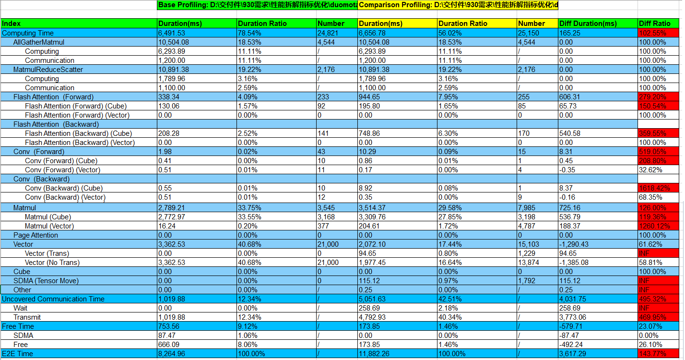

# compare

## Overview

The performance comparison (`compare`) feature analyzes performance gaps between GPUs and NPUs or between different NPUs. By comparing training duration and memory usage, it identifies specific bottleneck operators, helping users improve tuning efficiency. The tool breaks down the training duration into three dimensions (computation, communication, and scheduling) and performs operator-level comparisons for computation and communication. It also breaks down total training memory into operator-level usage for detailed analysis.

**Application Scenarios**

- Scenario 1: Performance drops after a PyTorch training project is migrated from a GPU to an NPU. You can use the tool to identify performance bottlenecks.

- Scenario 2: Performance varies between different versions of PyTorch or MindSpore training projects on NPUs. You can use the tool to locate specific differences.

- Scenario 3: Performance drops after a PyTorch training project is migrated from a GPU to a MindSpore NPU. You can use the tool to identify performance bottlenecks.

## Preparations

### Environment Setup

Install `msprof-analyze`. For details, see [MindStudio Profiler Analyze Installation Guide](../getting_started/install_guide.md).

### Data Preparation

**Profile Data Collection Using PyTorch Profiler**

Before using this tool, collect profile data from the GPU or NPU. You are advised to collect profile data for only a single step for performance comparison and analysis.

- GPU Profile Data Collection

  Collect GPU profile data by using PyTorch Profiler. For details, see [torch.profiler](https://pytorch.org/docs/stable/profiler.html).

  Collection code example 1:

  ```Python
  with torch.profiler.profile(
          profile_memory=True,  # Enables memory profile data collection
          record_shapes=True,  # Enables operator input shape collection
          schedule=torch.profiler.schedule(wait=10, warmup=0, active=1, repeat=1),
          on_trace_ready=torch.profiler.tensorboard_trace_handler("./result_dir")
  ) as prof:
      for step in range(step_number):
          train_one_step()
          prof.step()
  ```

  Collection code example 2:

  ```Python
  prof = torch.profiler.profile(
      profile_memory=True,  # Enables memory profile data collection
      record_shapes=True,  # Enables operator input shape collection
      on_trace_ready=torch.profiler.tensorboard_trace_handler("./result_dir"))
  for step in range(step_number):
      if step == 11:
          prof.start()
      train_one_step()
      if step == 11:
          prof.stop()
  ```

  The directory structure of the Ascend PyTorch Profiler collection results is as follows:

  ```Python
  |- pytorch_profiling
      |- *.pt.trace.json
  ```

- NPU Profile Data Collection

  Use Ascend PyTorch Profiler to collect NPU profile data. The configuration parameters are basically the same as those for GPU. You only need to replace `torch.profiler` in the GPU profile data collection code with `torch_npu.profiler`. For details, see the [Data Preparation](../getting_started/profiling_data_guide.md).

  The directory structure of the Ascend PyTorch Profiler collection results is as follows:

  ```bash
  |- ascend_pytorch_profiling
      |- *_ascend_pt
          |- ASCEND_PROFILER_OUTPUT
              |- kernel_details.csv
              |- op_statistic.csv
              |- trace_view.json
          |- FRAMEWORK
          |- PROF_XXX
      |- *_ascend_pt
  ```

  or

  ```bash
  |- ascend_pytorch_profiling
      |- *_ascend_pt
          |- ASCEND_PROFILER_OUTPUT
              |- analysis.db
              |- ascend_pytorch_profiler_{rank_id}.db
          |- FRAMEWORK
          |- PROF_XXX
      |- *_ascend_pt
  ```

  The preceding directories represent Ascend PyTorch Profiler output in different file formats. You can use either for comparison. If both formats are present in the directory, the tool uses the `db` format by default.

**Profile Data Collection Using MindSpore Profiler**

- NPU Profile Data Collection

  Currently, in MindSpore scenarios, comparisons are supported between NPU profile data and PyTorch GPU profile data, as well as between different versions of MindSpore training projects on NPU.

  Use MindSpore Profiler to collect NPU profile data. You are advised to collect or parse profile data for only a single step. For details, see [Performance Profiling (Ascend)](https://www.mindspore.cn/mindinsight/docs/en/r2.3/performance_profiling_ascend.html).

  The directory structure for MindSpore Profiler results is as follows: 

  ```bash
  |- profiler/{rank-*}_{timestamps}_ascend_ms
     |- ASCEND_PROFILER_OUTPUT
        |- kernel_details.csv
        |- op_statistic.csv
        |- trace_view.json
  ```

  or

  ```bash
  |- profiler/{rank-*}_{timestamps}_ascend_ms
     |- ASCEND_PROFILER_OUTPUT
        |- analysis.db
        |- ascend_mindspore_profiler_{rank_id}.db
  ```

  The preceding directories represent MindSpore Profiler output in different formats, depending on whether the `--export_type` option is set to `text` or `db`. You can use either for comparison. If both formats are present in the directory, the tool uses the `db` format by default.

  For performance comparison, the MindSpore profile data path must be specified at the `profiler/{rank-*}_{timestamps}_ascend_ms` or `ASCEND_PROFILER_OUTPUT directory level`.

## Profile Data Comparison

**Function**

The `compare` tool breaks down overall performance into training duration and memory usage. Training duration is further analyzed across three dimensions: operators (including `nn.Module`), communication, and scheduling. The tool outputs overall metrics to the terminal, helping users identify the primary source of performance bottlenecks.

The `compare` tool supports profile data comparison using CLI or scripts. Both methods support **common options** and **operator performance comparison options**.

**Enabling Methods**

- CLI

   ```bash
   msprof-analyze compare -d <profiling_path> -bp <benchmark_profiling_path> --output_path=<output_path>
   ```

- Script

    ```bash
    # Download the msprof-analyze repository and go to the compare_tools directory.
    cd msprof_analyze/compare_tools
    # # Run a basic comparison command.
    python performance_compare.py <benchmark_profiling_path> <profiling_path> --output_path=<output_path>
    ```

**Command-line Options**

| Option   | Mandatory (Yes/No)| Description | Supported by torch_npu (Yes/No)| Supported by MindSpore (Yes/No)|
| -------- | ------- | ----- | ------------- | ------------- |
| -d or --profiling_path | Yes| Specifies the profile data file or directory for comparison. You can specify a directory ending with `ascend_pt` or `ascend_ms`, an `ASCEND_PROFILER_OUTPUT` directory, or `trace_view.json` and `msmonitor_*.db` files. Note that `trace_view.json` does not support operator memory usage display. `msmonitor_*.db` only supports the output of the overall performance, communication, and kernel comparison pages.| Yes           | Yes           |
| -bp or --benchmark_path | Yes| Specifies the path to the benchmark profile data. If GPU profile data is used as the benchmark, specify the path to the JSON file ending with `.pt.trace`. If profile data from a different NPU version is used as the benchmark, set this option to the same value as that specified for `-d`.| Yes           | Yes           |
| -o or --output_path    | Yes| Specifies the directory for storing comparison results. The results are saved in the current directory by default.| Yes           | Yes           |
| --enable_profiling_compare     | No    | Enables overall performance comparison.      | Yes           | Yes           |
| --enable_operator_compare      | No    | Enables operator performance comparison. This option is time-consuming. You are advised to collect profile data for only a single step. For supported extended options, see the **operator performance comparison options** below.        | Yes           | No           |
| --enable_communication_compare | No    | Enables communication performance comparison.                                                                 | Yes           | Yes           |
| --enable_memory_compare        | No    | Enables operator memory comparison. This option is time-consuming. You are advised to collect profile data for only a single step.                         | Yes           | No           |
| --enable_kernel_compare        | No    | Enables kernel performance comparison. This option applies only to NPU-to-NPU comparison scenarios. For supported extended options, see the **kernel performance comparison options** below.  | Yes           | Yes           |
| --enable_api_compare           | No    | Enables API performance comparison. The `trace_view.json` file in the profile data is required.  | Yes           | No           |
| --disable_details              | No    | Hides detailed comparison and performs only statistics-level comparison.      | Yes           | Yes           |
| --base_step                    | No    | Sets the step ID for baseline profile data. Once set, the tool uses data from the corresponding step for comparison. The value must be an integer matching an existing step ID. By default, it is not set (all data is compared). This option must be used with `--comparison_step`. Example: `--base_step=1`.<br>**This option takes effect only when `-enable_profiling_compare` (db data only), `--enable_operator_compare`, `--enable_communication_compare`, `--enable_memory_compare`, `--enable_kernel_compare`, or `--enable_api_compare` is enabled.** | Yes           | Yes           |
| --comparison_step              | No    | Sets the step ID for target profile data for comparison. Once set, the tool uses data from the corresponding step for comparison. The value must be an integer matching an existing step ID. By default, it is not set (all data is compared). This option must be used with `--base_step`. Example: `--comparison_step=1`.<br>**This option takes effect only when `-enable_profiling_compare` (db data only), `--enable_operator_compare`, `--enable_communication_compare`, `--enable_memory_compare`, `--enable_kernel_compare`, or `--enable_api_compare` is enabled.**| Yes           | Yes           |
| --force                        | No    | Forcibly executes the `compare` operation. This option forcibly skips the following checks:<br>        Ownership check: Proceed even if the current user is not the owner of the specified directory or files.<br>        File size check: Proceed even if a CSV file exceeds 5 GB, a JSON file exceeds 10 GB, or a DB file exceeds 8 GB.<br>Specifying this option enables forced execution, which is disabled if not specified.   | Yes           | Yes           |
| --debug                        | No    | Enables detailed stack trace printing if a tool error occurs. Specifying this option enables debug mode, which is disabled if not specified. | Yes           | Yes           |
| -h, -H<br>--help              | No    | Displays help information for the subcommands and parameters of the current command.   | Yes           | Yes           |

Note: The optional parameters above serve as performance comparison switches. If no switches are set, the **tool enables all comparisons by default**. If any switches are set, the tool performs only the specified comparisons.

```bash
msprof-analyze compare -d [profiling_path] -bp [baseline profile data file or directory] --output_path=./result_dir --enable_profiling_compare
```

or

```bash
python performance_compare.py [baseline profile data file] [profile data file to be compared] --output_path=./result_dir --enable_profiling_compare
```

In this case, only overall performance comparison is enabled.

**Operator Performance Comparison Options**

Supported when `--enable_operator_compare` is used.

| Option | Mandatory (Yes/No)| Description   |
| ----------------- | --------- | ------------------------------------------------------------ |
| --gpu_flow_cat    | No     | Sets the connection identifier between CPU operators and device kernels in the GPU trace. This should be set when the GPU `Device Duration(us)` values are all `0`. To find the identifier, open the GPU JSON file in `chrome://tracing`, locate the connection label in **Flow events** in the upper right corner, and set that label as the parameter value. Example: `--gpu_flow_cat=async_gpu`|
| --use_input_shape | No     | Enables precise operator matching. This option is disabled by default. Example: `--use_input_shape`     |
| --max_kernel_num  | No     | Sets the maximum number of kernels delivered by a CPU-side operator. If the number of kernels exceeds this value, the tool automatically searches for sub-operators until the condition is met. By default, the tool only compares top-level operators (coarse granularity). For operator performance comparison in finer granularity, set this value to `4` or greater. A smaller value results in finer comparison granularity. Example: `--max_kernel_num=10`|
| --op_name_map     | No     | Sets the mapping between equivalent GPU and NPU operator names. The mapping should be provided in dictionary format. Example: `--op_name_map={'Optimizer.step#SGD.step':'Optimizer.step#NpuFusedSGD.step'}`|
| --disable_module  | No     | Forces operator-level performance comparison. When this option is specified, the tool performs comparison at the operator level regardless of whether module information was collected.|

**Kernel Performance Comparison Options**

Supported when `--enable_kernel_compare` is used.

| Option             | Mandatory (Yes/No)| Description                                                        |
| ----------------- | --------- | ------------------------------------------------------------ |
| --use_kernel_type | No     | Specifies the kernel comparison mode. Valid values:<br>        `true`: uses `op_statistic.csv` to perform profile data comparison. This provides simplified comparison results and reduces comparison time.<br>        `false` (default): uses `kernel_details.csv` to perform profile data comparison. This provides complete comparison results.|

**Custom Operator Comparison**

Generally, the `compare` function compares the performance of operators based on the default configuration. To compare and analyze the performance of a specific operator, you can configure the keyword for identifying the operator to be compared in the [compare_config.ini](../../../msprof_analyze/compare_tools/compare_backend/compare_config/compare_config.ini) file, and then run the comparison command (`msprof-analyze compare`). The `performance_comparison_result_{timestamp}.xlsx` file displays the comparison result.

The tool identifies an operator if its name contains any of the specified keywords. If a keyword matches any part of an operator name, that operator is included in the comparison.

The following figure shows an example of the configuration format. The operator name identification keywords must be in lowercase and separated by commas (,).


The preceding figure shows the default configuration in `compare_config.ini`, indicating the operator types compared by default.

`FA_MASK`, `CONV_MASK`, and `MATMUL_MASK` are the identification keywords of the upper-layer application operators shared by the GPU and NPU. `CUBE_MASK` is the identification keyword for bottom-layer GPU kernel cube operators. `TRANS_MASK` is the identification keyword for bottom-layer NPU conversion kernel operators.

The comparison results are provided in two forms: terminal output (displays summary information) and `performance_comparison_result_{timestamp}.xlsx` (saves detailed results).

**Output Description**

- The overall comparison result is output to the execution terminal. For details about the comparison result, see `performance_comparison_result_*.xlsx`.
- For details about the `performance_comparison_result_*.xlsx` file, see "Output Description of Result Files".
- The following table describes the fields displayed in the terminal for the overall performance comparison results.

| Field                                   | Description                                                        |
| --------------------------------------- | ------------------------------------------------------------ |
| Cube Time(Num)                          | Total duration of Cube operators. `Num` indicates the invocation count.                         |
| Vector Time(Num)                        | Total duration of Vector operators. `Num` indicates the invocation count.                       |
| Conv Time(Forward)(Num)                 | Duration of forward convolution operators. `Num` indicates the invocation count.                       |
| Conv Time(Backward)(Num)                | Duration of backward convolution operators. `Num` indicates the invocation count.                       |
| Flash Attention Time(Forward)(Num)      | Forward duration of Flash Attention operators. `Num` indicates the invocation count.            |
| Flash Attention Time(Backward)(Num)     | Backward duration of Flash Attention operators. `Num` indicates the invocation count.            |
| Paged Attention Time(Num)               | Duration of `Paged Attention` operators. `Num` indicates the invocation count.                |
| Lccl Time(Num)                          | Total duration of `LCCL` operators. `Num` indicates the invocation count.                           |
| Computing Time                          | Total duration of all events in the compute stream. Overlapping periods of concurrent compute tasks are counted only once.|
| Mem Usage                               | Memory usage. You can check GPU usage by using `nvidia-smi` and NPU usage by using `npu-smi`. When `profile_memory=True` is set during profiling, this field displays the maximum reserved value in `memory_record`, which generally represents process-level memory.|
| Uncovered Communication Time(Wait Time) | The communication duration is not covered. Communication duration not covered by computation. `Wait Time` indicates the waiting time between NPUs (exists only in NPU scenarios).|
| RDMA Bandwidth(GB/s)                    | RDMA bandwidth (GB/s).                                        |
| SDMA Bandwidth(GB/s)                    | SDMA bandwidth (GB/s).                                        |
| SDMA Time(Num)                          | Duration of copy-related tasks. `Num` indicates the invocation count.                         |
| Free Time                               | Scheduling duration calculated as: `E2E Time` – `Computing Time`  – `Uncovered Communication Time`. It represents the idle duration during which the device is neither computing nor communicating, and therefore includes copy time (SDMA Time).|
| E2E Time(Not minimal profiling)         | Total end-to-end duration of the compute stream. `Not minimal profiling`, if exists, indicates performance overhead, which may affect communication and scheduling durations.|
| Other Time                              | Duration of other operators, such as AICPU, DSA, and TensorMove.                     |

## Output File Description

### Overall Performance

The overall performance comparison result is displayed on the `OverallMetrics` sheet of the `performance_comparison_result_*.xlsx` file, as shown in the following figure.



The following table describes the table fields.

| Field          | Description                       |
| -------------- | --------------------------- |
| Index          | Metric identifier                     |
| Duration(ms)   | Execution duration (ms)         |
| Duration Ratio | Ratio of execution duration to total E2E duration|
| Number         | Number of compute operators           |

The following table describes all fields in the **Index** column.

| Field                        |                                                |                                     | Description                                                        |
| ---------------------------- | :--------------------------------------------- | ----------------------------------- | ------------------------------------------------------------ |
| Computing Time               |                                                |                                     | Total duration of all events in the compute stream. Overlapping periods of concurrent compute tasks are counted only once.<br>In NPU scenarios, secondary fields under `Computing Time` (such as `Flash Attention` and `Conv`) are available only when the `Level` is set to `L1` or higher for the `text` format using `--export_type`, or `L0` or higher for the `db` format.|
|                              | AllGatherMatmul                                |                                     | `AllGatherMatmul` operator. This is an MC<sup>2</sup> fused operator (example only).                    |
|                              |                                                | Computing                           | Compute operator of the `AllGatherMatmul` operator.                             |
|                              |                                                | Communication                       | Communication operator of the `AllGatherMatmul` operator.                             |
|                              | MatmulReduceScatter                            |                                     | `MatmulReduceScatter` operator. This is an MC<sup>2</sup> fused operator (example only).                |
|                              |                                                | Computing                           | Compute operator of the `MatmulReduceScatter` operator.                         |
|                              |                                                | Communication                       | Communication operator of the `MatmulReduceScatter` operator.                         |
|                              | Flash Attention                                |                                     | Flash Attention operators.                                       |
|                              |                                                | Flash Attention (Forward) (Cube)    | Cube kernel operators delivered by the `Flash Attention (Forward)` operator. Generally, they are core compute operators of this operator.|
|                              |                                                | Flash Attention (Forward) (Vector)  | Vector kernel operators delivered by the `Flash Attention (Forward)` operator. Generally, they are inserted conversion operators, such as `TransData`.|
|                              |                                                | Flash Attention (Backward) (Cube)   | Cube kernel operators delivered by the `Flash Attention (Backward)` operator. Generally, they are core compute operators of this operator.|
|                              |                                                | Flash Attention (Backward) (Vector) | Vector kernel operators delivered by the `Flash Attention (Backward)` operator. Generally, they are inserted conversion operators, such as `TransData`.|
|                              | Conv                                           |                                     | `Conv` (convolution) operators.                                                  |
|                              |                                                | Conv (Forward) (Cube)               | Cube kernel operators delivered by the `Conv (Forward)` operator. Generally, they are core compute operators of this operator.|
|                              |                                                | Conv (Forward)  (Vector)            | Vector kernel operators delivered by the `Conv (Forward)` operator. Generally, they are inserted conversion operators, such as `TransData`.|
|                              |                                                | Conv (Backward) (Cube)              | Cube kernel operators delivered by the `Conv (Backwards)` operator. Generally, they are core compute operators of this operator.|
|                              |                                                | Conv (Backward) (Vector)            | Vector kernel operators delivered by the `Conv (Backward)` operator. Generally, they are inserted conversion operators, such as `TransData`.|
|                              | Matmul                                         |                                     | `Matmul` (matrix multiplication) operators.                                                |
|                              |                                                | Matmul (Cube)                       | Cube kernel operators delivered by the `Matmul` operator. Generally, they are core compute operators of this operator.|
|                              |                                                | Matmul (Vector)                     | Vector kernel operators delivered by the `Matmul` operator. Generally, they are inserted conversion operators, such as `TransData`.|
|                              | Paged Attention                                |                                     | `Paged Attention` operator.                                       |
|                              | Vector                                         |                                     | Vector operators.                                                |
|                              |                                                | Vector (Trans)                      | Conversion vector operators, including `Cast`, `TransPose`, and `TransData` operators. (NPU data only)|
|                              |                                                | Vector ( No Trans)                  | Non-conversion vector operators.                                        |
|                              | Cube                                           |                                     | Cube operators not identified as `Flash Attention`, `Conv`, or `Matmul`.           |
|                              | SDMA (Tensor Move)                             |                                     | Data copy tasks related to TensorMove.                                                |
|                              | Other                                          |                                     | Other operators such as AICPU and DSA.                                      |
| Uncovered Communication Time |                                                |                                     | Non-overlapped communication duration, including inter-rank waiting time.                          |
|                              | {group_name}: Group group_name_* Communication |                                     | Communication group. The format is `{communication group name}: Group group_name_* Communication`, where * indicates the ID of the communication group.|
|                              |                                                | Wait                                | Synchronization wait time between NPUs. (NPU data only)                         |
|                              |                                                | Transmit                            | Communication transmission duration.                                              |
|                              | Uncovered Communication Overlapped             |                                     | Parallel duration between two communication groups that is not overlapped by computation.                    |
|                              |                                                | {group_name} & {group_name}         | Parallel non-overlapped duration between two specific communication groups (such as `tp` and `pp`).|
| Free Time                    |                                                |                                     | Scheduling duration calculated as: `E2E Time` – `Computing Time`  – `Uncovered Communication Time`. It represents the idle duration during which the device is neither computing nor communicating, and therefore includes copy time (SDMA Time).|
|                              | SDMA                                           |                                     | Copy-related tasks. For NPU, these include copy tasks excluding TensorMove. For GPU, these include all copy tasks.     |
|                              | Free                                           |                                     | Idle duration excluding `SDMA Time`.                                        |
| E2E Time                     |                                                |                                     | Total end-to-end duration of the compute stream. `Not minimal profiling`, if exists, indicates performance overhead from data collection, which may affect communication and scheduling durations.|

You can use minimal profile data collection to reduce E2E duration overhead. The sample code is as follows:

```python
with torch_npu.profiler.profile(
        activities=[torch_npu.profiler.ProfilerActivity.NPU],
        schedule=torch_npu.profiler.schedule(wait=1, warmup=1, active=1, repeat=1, skip_first=10),
        on_trace_ready=torch_npu.profiler.tensorboard_trace_handler("./result"),
) as prof:
        for step in range(steps):
            train_one_step()
            prof.step()
```

Configure activities to collect only NPU data, without configuring `experimental_config` parameters or other optional switches.

- If `Computing Time` increases, analyze **operator performance**.
- If `Uncovered Communication Time` increases, analyze communication performance. If no bottleneck communication operators are identified, it indicates poor parallelism between communication and computation. Proceed with NPU cluster performance analysis.
- If `Mem Usage` increases, analyze **operator memory**. If no operators show significantly higher usage, the memory allocation is consistent, and the issue lies in memory release (held for too long). Use TensorBoard or MindStudio Insight for further NPU memory analysis.

### Operator Performance

**Profile Data Without Python Function Events**

The operator performance comparison results are displayed on the `OperatorCompareStatistic` and `OperatorCompare` sheets of the `performance_comparison_result_{timestamp}.xlsx` file.

- `OperatorCompareStatistic`: operator-level statistics. Rows are sorted in descending order based on the difference between the total device duration of the operator and the benchmark operator (`Diff Duration(ms)` column).
- `OperatorCompare`: detailed operator comparison. You can view the kernel details for each operator.
- `Diff Ratio`: ratio of the total device execution duration of the target operator to that of the benchmark operator. Red indicates a performance bottleneck.
- `Device Duration(us)`: total duration of all kernels delivered by the operator to the device.

To identify the performance bottlenecks, perform the following steps: 

* Step 1: Check the `OperatorCompareStatistic` sheet for operators with the largest time differences.
* Step 2: Search for these operators on the `OperatorCompare` sheet, check the specific kernel durations, and identify optimization points. 

**Profile Data With Python Function Events**

The operator performance comparison results are displayed on the `ModuleCompareStatistic` and `ModuleCompare` sheets of the `performance_comparison_result_*.xlsx` file.

If the `with_stack` option is enabled during profile data collection, Python function events are reported. If both sets of profile data contain these events, module-level comparison is supported.

- `Module Class`: class name of the module (such as `nn.Module: Linear`).
- `Module Level`: hierarchy level of the module.
- `Module Name`: unique identifier of the module (such as `/ DynamicNet_0/ Linear_0`).
- `Operator Name`: name of the framework-side operator (such as `aten::add`). The `[ TOTAL ]` field represents the overall metrics for the module.
- `Kernel Details`: operator details, including the operator name, task ID, task type, input shape, and execution duration.
- `Device Self Time(ms)`: total device-side execution duration of the operators (excluding submodules) called by the module (ms).
- `Number`: number of times that the module or operator is called.
- `Device Total Time(ms)`: total device-side execution duration of the operators (including submodules) called by the module (ms).
- `Device Total Time Diff(ms)`: difference in `Device Total Time(ms)` between GPUs and NPUs.
- `Device Self Time Diff(ms)`: difference in `Device Self Time(ms)` between GPUs and NPUs.
- `Diff Total Ratio`: ratio of the `Device Total Time(ms)` of GPUs to that of NPUs.
- `Base Call Stack`: call stack of the module in the baseline file.
- `Comparison Call Stack`: call stack of the module in the comparison file.

`ModuleCompare`: module and operator comparison details. You can view the kernel details for each operator on this sheet.

- `Module Class`: class name of the module (such as `nn.Module: Linear`).
- `Module Level`: hierarchy level of the module.
- `Module Name`: unique identifier of the module (such as `/ DynamicNet_0/ Linear_0`).
- `Operator Name`: name of the framework-side operator (such as `aten::add`). The `[ TOTAL ]` field represents the overall metrics for the module.
- `Kernel Details`: operator details, including the operator name, task ID, task type, input shape, and execution duration.
- `Device Self Time(us)`: total device-side execution duration of the operators (excluding submodules) called by the module (μs).
- `Device Total Time(us)`: total device-side execution duration of the operators (including submodules) called by the module (μs).
- `Device Total Time Diff(us)`: difference in `Device Total Time(us)` between GPUs and NPUs.
- `Device Self Time Diff(us)`: difference in `Device Self Time(us)` between GPUs and NPUs.
- `Total Time Ratio`: ratio of the `Device Total Time(us)` of GPUs to that of NPUs.
- `Base Call Stack`: call stack of the bottleneck module or operator in the baseline file.
- `Comparison Call Stack`: call stack of the bottleneck module or operator in the comparison file.

To identify the performance bottlenecks, perform the following steps: 

* Step 1: Check the `ModuleCompareStatistic` sheet for modules with the largest time differences.
    - Filter the `Operator Name` column by `[ TOTAL ]` and sort the modules in descending order by `Device Self Time(ms)`.
    - To restore the data view, sort by the `Order Id` field in ascending order.
* Step 2: On the `ModuleCompare` sheet, locate the bottleneck operators under the modules with the largest time differences. 
* Step 3: Use the code stack to find the corresponding lines of code. 

### Communication Performance

The communication performance comparison results are displayed on the `CommunicationCompare` sheet of the `performance_comparison_result_*.xlsx` file.

- Second-row table header: summary information of each communication operator. It includes the name, total number of calls, and the total, average, maximum, and minimum durations of each communication operator (μs).
- Rows without background colors: detailed information for communication operators (supported only for NPUs). These rows contain all task information under the communication operator, including the name, number of calls, and the total, average, maximum, and minimum durations of each task (μs).
- `Diff Ratio`: ratio of the total duration of the target communication operator for comparison to that of the benchmark communication operator. Red indicates a performance bottleneck.

### Operator Memory

The operator memory comparison results are displayed on the `MemoryCompare` and `MemoryCompareStatistic` sheets of the `performance_comparison_result_*.xlsx` file.

- `MemoryCompareStatistic`: statistics at the operator level. Rows are sorted in descending order based on the memory difference between the operator and the benchmark operator (the `Diff Memory(MB)` column).

- `MemoryCompare`: detailed operator memory comparison. You can view the specific memory allocation details for each operator.

- `Diff Ratio`: ratio of the total memory occupied by the target operator for comparison to that of the benchmark operator. Red indicates a performance bottleneck.

- `Size(KB)`: size of the device memory occupied by the operator (KB).

To identify the performance bottlenecks, perform the following steps:

* Step 1: Check the `MemoryCompareStatistic` sheet for operators with the largest memory usage differences.
* Step 2: Search for these operators on the `MemoryCompare` sheet to view the specific memory usage of the sub-operators.

### Kernel Performance

This option applies only to NPU-to-NPU comparison scenarios.

- When the `--use_kernel_type` option is set to `false`, kernel comparison results are displayed on the `KernelCompare` sheet of the `performance_comparison_result_*.xlsx` file.

  Statistics are collected by kernel type and input shape, including:

  - `Total Duration(us)`: total duration (μs)
  - `Avg Duration(us)`: average duration (μs)
  - `Max Duration(us)`: maximum duration (μs)
  - `Min Duration(us)`: minimum duration (μs)
  - `Calls`: number of calls

- When the `--use_kernel_type` option is set to `true`, kernel comparison results are displayed on the `KernelTypeCompare` sheet of the `performance_comparison_result_*.xlsx` file.

  Statistics are collected by kernel type and AI Core type, including:

  - `Total Duration(us)`: total duration (μs)
  - `Avg Duration(us)`: average duration (μs)
  - `Max Duration(us)`: maximum duration (μs)
  - `Min Duration(us)`: minimum duration (μs)
  - `Calls`: number of calls

### API Performance

The API performance comparison results are displayed on the `ApiCompare` sheet of the `performance_comparison_result_*.xlsx` file.

Statistics are collected by API name group, including:

- `Total Duration(ms)`: total duration (ms)
- `Self Time(ms)`: self duration (excluding sub-events) (ms)
- `Avg Duration(ms)`: average duration (ms)
- `Calls`: number of calls
