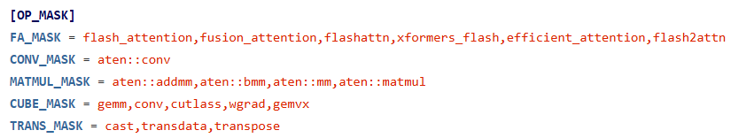
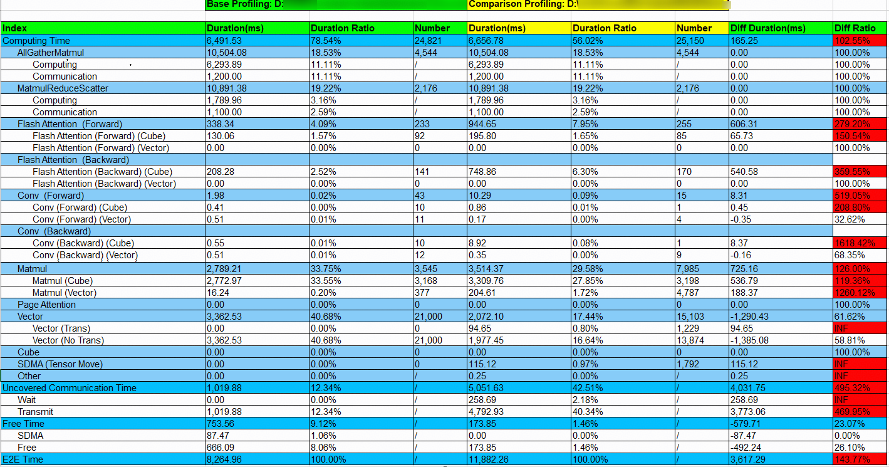

# compare

## 1. Overview

The performance comparison (`compare`) feature supports performance comparisons between GPUs and NPUs or between different NPUs. By comparing training duration and memory usage, it identifies operators with performance degradation, helping users improve performance tuning efficiency. The tool breaks down training duration into three dimensions: computation, communication, and scheduling. It performs operator-level comparisons for computation and communication and compares memory usage at the operator level.

**Scenarios**

- Scenario 1: Performance degradation occurs after a PyTorch training project is migrated from GPUs to NPUs. The tool can be used to identify the performance bottlenecks.

- Scenario 2: Performance differences exist between different versions of a PyTorch or MindSpore training project running on NPUs. The tool can be used to identify the specific differences.

- Scenario 3: Performance degradation occurs after a PyTorch training project is migrated from GPUs to MindSpore on NPUs. The tool can be used to identify the performance bottlenecks.

## 2. Quick Start

### 2.1 Basic Command

```bash
msprof-analyze compare \
  -d ./ascend_pt \
  -bp ./gpu_trace.json \
  -o ./compare_output
```

The three core paths in the command are described below:

| Path | Description | Example |
| --- | --- | --- |
| `-bp` or `--benchmark_profiling_path` | Specifies the path to the benchmark profile data, which is typically GPU data, data collected before optimization, or data from an earlier version. | `./gpu_trace.json`, `./base_ascend_pt` |
| `-d` or `--profiling_path` | Specifies the path to the profile data to be compared, which is typically NPU data, data collected after optimization, or data from a later version. | `./ascend_pt`, `./new_ascend_pt` |
| `-o` or `--output_path` | Specifies the directory for storing comparison results. | `./compare_output` |

After the command is executed, the tool generates `performance_comparison_result_*.xlsx` in the output directory and prints the overall comparison results to the terminal.

### 2.2 Common Commands

| Scenario                                | Example Command                                                                                                    |
| --------------------------------------- | ------------------------------------------------------------------------------------------------------------------ |
| GPU vs NPU comparison                   | `msprof-analyze compare -d ./ascend_pt -bp ./gpu_trace.json -o ./compare_output`                                   |
| NPU vs NPU comparison                   | `msprof-analyze compare -d ./ascend_pt -bp ./base_ascend_pt -o ./compare_output`                                   |
| View overall performance only           | `msprof-analyze compare -d ./ascend_pt -bp ./base_ascend_pt -o ./compare_output --enable_profiling_compare`        |
| View operator performance only          | `msprof-analyze compare -d ./ascend_pt -bp ./base_ascend_pt -o ./compare_output --enable_operator_compare`         |
| View communication performance only     | `msprof-analyze compare -d ./ascend_pt -bp ./base_ascend_pt -o ./compare_output --enable_communication_compare`    |
| View memory differences only            | `msprof-analyze compare -d ./ascend_pt -bp ./base_ascend_pt -o ./compare_output --enable_memory_compare`           |
| View a specified step only              | `msprof-analyze compare -d ./ascend_pt -bp ./base_ascend_pt -o ./compare_output --base_step=1 --comparison_step=1` |
| Hide details and output statistics only | `msprof-analyze compare -d ./ascend_pt -bp ./base_ascend_pt -o ./compare_output --disable_details`                 |

If none of the comparison switches is specified, the tool enables all supported performance comparison capabilities by default. If any comparison switch is specified, the tool performs only the specified comparisons.

### 2.3 Result Interpretation

After the comparison is complete, open `performance_comparison_result_*.xlsx` and read the results in the following order: first determine the direction of the performance difference, and then locate the specific performance bottlenecks.

**Step 1: Check overall performance to determine the direction.**

First check the overall performance fields printed to the terminal and the `OverallMetrics` sheet to determine where the performance difference mainly comes from. The `OverallMetrics` sheet breaks down duration into computation, communication, scheduling, and E2E duration. `Mem Usage` is displayed in the overall performance output printed to the terminal and is displayed only when memory usage data is collected.

| Metric | Key Point |
| --- | --- |
| `Computing Time` | Check this in `OverallMetrics` to determine whether compute-stream duration has increased. If it has increased, continue analyzing operator performance or kernel performance. |
| `Uncovered Communication Time` | Check this in `OverallMetrics` to determine whether uncovered communication duration has increased. If it has increased, continue analyzing communication performance. |
| `Free Time` | Check this in `OverallMetrics` to determine whether scheduling duration has increased. This value is calculated as E2E duration minus operator duration and uncovered communication duration. |
| `E2E Time` | Check this in `OverallMetrics` to determine the overall duration difference. If `Not minimal profiling` is displayed, the duration contains performance overhead, which affects the assessment of communication and scheduling duration. |
| `Mem Usage` | Check this in the overall performance output printed to the terminal. If it has increased, continue analyzing operator memory usage. |

Proceed with the following analyses:

- If `Computing Time` has increased, analyze **operator performance**.
- If `Uncovered Communication Time` has increased, analyze **communication performance**. If no communication operators with performance degradation are identified in the communication performance analysis, this may indicate poor overlap between communication and computation. Continue with NPU cluster performance analysis.
- If `Mem Usage` in the overall performance output printed to the terminal has increased, analyze **operator memory usage**. If no operators with significantly higher memory usage are identified, this indicates that there is no significant difference in the amount of memory allocated by operators and that the issue lies in memory release, such as memory being held for too long. You can use TensorBoard or MindStudio Insight to continue analyzing NPU memory usage.

**Step 2: Check operator performance for computation performance degradation.**

If computation duration has increased significantly in `OverallMetrics`, prioritize the following sheets:

| Sheet | Applicable Scenario | How to Read |
| --- | --- | --- |
| `OperatorCompareStatistic` | The comparison data does not contain Python Function events, or operator-level statistics are of interest. | Sort `Diff Duration(ms)` in descending order to identify the operators with the largest duration differences. |
| `OperatorCompare` | Operator-level details need to be viewed. | Search for the operators with the largest differences and view the corresponding kernel details. |
| `ModuleCompareStatistic` | Both sets of data contain Python Function events. | Filter `Operator Name` by `[ TOTAL ]` and locate modules based on duration differences. |
| `ModuleCompare` | The call stack needs to be used to locate the code. | View operator details and call stacks under the modules with performance degradation. |
| `KernelCompare` or `KernelTypeCompare` | An NPU-to-NPU comparison requires further kernel analysis. | Locate differences based on total kernel duration, average duration, and invocation count. |

**Step 3: Check `CommunicationCompare` for communication performance degradation.**

If `Uncovered Communication Time` has increased in `OverallMetrics`, check `CommunicationCompare`:

- First check the summary information for communication operators, including the communication operator name, total invocation count, total communication operator duration, average duration, maximum duration, and minimum duration.
- Then check detail rows without background highlighting. In NPU scenarios, you can view the Task information for the communication operator.
- Focus on `Diff Ratio`. This value represents the total duration of the comparison communication operator divided by the total duration of the baseline communication operator. Red indicates performance degradation.

**Step 4: Check `MemoryCompareStatistic` for memory performance degradation.**

If `Mem Usage` in the overall performance output printed to the terminal has increased, or if you need to analyze differences in operator-level memory usage, prioritize the following sheets:

| Sheet                    | How to Read                                                                                                         |
| ------------------------ | ------------------------------------------------------------------------------------------------------------------- |
| `MemoryCompareStatistic` | Sort `Diff Memory(MB)` in descending order to identify the operators with the largest memory usage differences.     |
| `MemoryCompare`          | Search for the operators with the largest memory usage differences and view the specific memory allocation details. |

`Diff Ratio` represents the total memory usage of the comparison operator divided by the total memory usage of the baseline operator. Red indicates performance degradation. `Size(KB)` indicates the amount of device memory used by the operator, in KB.

## 3. Preparations

### 3.1 Environment Setup

Install `msprof-analyze`. For details, see the [msprof-analyze Installation Guide](../install_guide/msprof-analyze_install_guide.md).

### 3.2 Data Preparation

#### 3.2.1 Collecting Profile Data for the PyTorch Framework

Before using this tool, collect profile data from the GPUs or NPUs. You are advised to collect profile data for only a single step before performing performance comparison analysis.

If multiple steps are collected, the tool compares all available profile data by default. The comparison results may therefore include warm-up, stable training, and occasional jitter phases, affecting the assessment of E2E duration, communication waiting duration, and operator duration. To analyze a specific step, configure both `--base_step` and `--comparison_step`, and ensure that the specified steps exist in the benchmark data and the data to be compared, respectively.

##### 3.2.1.1 Collecting GPU Profile Data

Use PyTorch Profiler to collect GPU profile data. For details, see [torch.profiler](https://pytorch.org/docs/stable/profiler.html).

Collection code example 1 (recommended): use `schedule` to control when data is collected.

```python
with torch.profiler.profile(
        profile_memory=True,  # Enables memory profile data collection
        record_shapes=True,  # Enables operator input shape collection
        schedule=torch.profiler.schedule(wait=10, warmup=0, active=1, repeat=1),
        on_trace_ready=torch.profiler.tensorboard_trace_handler("./result_dir")
) as prof:
    for step in range(step_number):
        train_one_step()
        prof.step()
```

Collection code example 2: manually control `start`/`stop`.

```python
prof = torch.profiler.profile(
    profile_memory=True,
    record_shapes=True,
    on_trace_ready=torch.profiler.tensorboard_trace_handler("./result_dir"))
for step in range(step_number):
    if step == 11:
        prof.start()
    train_one_step()
    if step == 11:
        prof.stop()
```

The directory structure of the PyTorch Profiler collection results is as follows:

```text
|- pytorch_profiling
    |- *.pt.trace.json
```

##### 3.2.1.2 Collecting NPU Profile Data

Use Ascend PyTorch Profiler to collect NPU profile data. The collection parameter configuration is basically the same as that for GPU profile data. You only need to replace `torch.profiler` with `torch_npu.profiler` in the GPU profile data collection code. For details, see the [Ascend PyTorch Profiler](https://gitcode.com/Ascend/pytorch/blob/master/docs/en/developer_notes/ascend_pytorch_profiler_user_guide.md).

**Collection result directory structure**

Depending on the value of the `export_type` parameter, the tool outputs result directories in two formats:

`export_type = Text`

```text
|- ascend_pytorch_profiling
    |- *_ascend_pt
        |- ASCEND_PROFILER_OUTPUT
            |- kernel_details.csv
            |- op_statistic.csv
            |- trace_view.json
        |- FRAMEWORK
        |- PROF_XXX
    |- *_ascend_pt
```

`export_type = Db`

```text
|- ascend_pytorch_profiling
    |- *_ascend_pt
        |- ASCEND_PROFILER_OUTPUT
            |- analysis.db
            |- ascend_pytorch_profiler_{rank_id}.db
        |- FRAMEWORK
        |- PROF_XXX
    |- *_ascend_pt
```

> [!NOTE]
>
> Format selection: Either format can be used for performance comparison. If both types of files are present in the same directory, the `Db` format (`export_type = Db`) is used preferentially for comparison.

#### 3.2.2 Collecting Profile Data for the MindSpore Framework

Currently, the MindSpore scenario supports only the following two types of performance comparison:

1. Comparison between MindSpore NPU profile data and PyTorch GPU profile data.
2. Comparison between profile data from different versions of a MindSpore training project on NPUs.

Profile data collection: When using the MindSpore Profiler to collect NPU profile data, you are advised to collect or parse profile data for only a single step. For details, see the [MindSpore Profiler](https://gitcode.com/Ascend/docs/blob/master/MindStudio/master/en/menu/mindspore_profiler_user_guide.md).

Collection result directory structure: Depending on the value of the `export_type` parameter, the tool outputs result directories in two formats:

Method 1: `export_type = Text`

```text
|- profiler/{rank-*}_{timestamps}_ascend_ms
   |- ASCEND_PROFILER_OUTPUT
      |- kernel_details.csv
      |- op_statistic.csv
      |- trace_view.json
```

Method 2: `export_type = Db`

```text
|- profiler/{rank-*}_{timestamps}_ascend_ms
   |- ASCEND_PROFILER_OUTPUT
      |- analysis.db
      |- ascend_mindspore_profiler_{rank_id}.db
```

> [!NOTE]
>
> Either format can be used for performance comparison. If both types of files are present in the same directory, the `Db` format (`export_type = Db`) is used preferentially for comparison.

For performance comparison, specify the collection result path at either of the following directory levels:

- `profiler/{rank-*}_{timestamps}_ascend_ms`
- `profiler/{rank-*}_{timestamps}_ascend_ms/ASCEND_PROFILER_OUTPUT`

## 4. Feature Introduction

### 4.1 Feature Description

The `compare` tool breaks down overall performance into training duration and memory usage. Training duration is further broken down into three dimensions: computation, communication, and scheduling. The computation dimension includes operators (including `nn.Module`). The tool outputs overall metrics to help users determine the direction of performance degradation.

The `compare` tool supports performing profile data comparison through both **CLI** and **script** methods. Both methods support **common options** and **operator performance comparison-specific options**.

### 4.2 Syntax

**CLI**

```bash
msprof-analyze compare -d <profiling_path> -bp <benchmark_profiling_path> --output_path=<output_path> [option]
```

**Script**

```bash
python performance_compare.py <benchmark_profiling_path> <profiling_path> --output_path=<output_path> [option]
```

For the script method, the first positional argument, `<benchmark_profiling_path>`, specifies the path to the benchmark profile data, and the second positional argument, `<profiling_path>`, specifies the path to the profile data to be compared. Their meanings are the same as those of `-bp` and `-d`, respectively, in the CLI method.

`option` indicates other optional parameters. For details, see [Command-line Options](#43-command-line-options).

### 4.3 Command-line Options

#### 4.3.1 Input and Output

| Option | Required (Yes/No) | Description | Typical Value |
| --- | --- | --- | --- |
| `-bp` or `--benchmark_profiling_path` | Yes | Specifies the path to the benchmark profile data, which is typically GPU data, data collected before optimization, or data from an earlier version. | `./gpu_trace.json`, `./base_ascend_pt` |
| `-d` or `--profiling_path` | Yes | Specifies the path to the profile data to be compared, which is typically NPU data, data collected after optimization, or data from a later version. | `./ascend_pt`, `./new_ascend_pt` |
| `-o` or `--output_path` | Yes | Specifies the directory for storing comparison results. | `./compare_output` |

#### 4.3.2 Comparison Scope Control

| Option | Required (Yes/No) | Description | Supported by TorchNPU | Supported by MindSpore |
| --- | --- | --- | --- | --- |
| `--disable_details` | No | Hides detailed comparison and performs only statistics-level comparison. | Yes | Yes |
| `--base_step` | No | Specifies the step ID of the benchmark profile data. Once configured, the tool uses data from the corresponding step in the benchmark profile data for comparison. The value must be an integer matching an existing step ID. By default, it is not configured, and all profile data is compared. This option must be used together with `--comparison_step`. Example: `--base_step=1`. This option takes effect only when `--enable_profiling_compare` (DB data only), `--enable_operator_compare`, `--enable_communication_compare`, `--enable_memory_compare`, `--enable_kernel_compare`, or `--enable_api_compare` is enabled. | Yes | Yes |
| `--comparison_step` | No | Specifies the step ID of the profile data to be compared. Once configured, the tool uses data from the corresponding step in the profile data to be compared. The value must be an integer matching an existing step ID. By default, it is not configured, and all profile data is compared. This option must be used together with `--base_step`. Example: `--comparison_step=1`. This option takes effect only when `--enable_profiling_compare` (DB data only), `--enable_operator_compare`, `--enable_communication_compare`, `--enable_memory_compare`, `--enable_kernel_compare`, or `--enable_api_compare` is enabled. | Yes | Yes |

#### 4.3.3 Comparison Capability Switches

If none of the comparison switches is specified, the tool **enables all** supported performance comparison capabilities by default.

If you are interested in only a specific type of issue, you can enable the corresponding switch as required. Once any comparison switch is specified, the tool performs only the comparisons enabled by the specified switches. Example:

```bash
# Configure --enable_profiling_compare to enable only overall performance comparison.
msprof-analyze compare -d [profiling_path] -bp [benchmark_profiling_path] --output_path=./result_dir --enable_profiling_compare
```

| Option | Required (Yes/No) | Description | Supported by TorchNPU | Supported by MindSpore |
| --- | --- | --- | --- | --- |
| `--enable_profiling_compare` | No | Enables overall performance comparison. | Yes | Yes |
| `--enable_operator_compare` | No | Enables operator performance comparison. This option is time-consuming. You are advised to collect profile data for only a single step. For supported extended options, see [Operator Performance Comparison Options](#434-operator-performance-comparison-options). | Yes | No |
| `--enable_communication_compare` | No | Enables communication performance comparison. | Yes | Yes |
| `--enable_memory_compare` | No | Enables operator memory comparison. This option is time-consuming. You are advised to collect profile data for only a single step. | Yes | No |
| `--enable_kernel_compare` | No | Enables kernel performance comparison. This option applies only to NPU-to-NPU comparison scenarios. For supported extended options, see [Kernel Performance Comparison Options](#435-kernel-performance-comparison-options). | Yes | Yes |
| `--enable_api_compare` | No | Enables API performance comparison. The `trace_view.json` file in the profile data is required. | Yes | No |

#### 4.3.4 Operator Performance Comparison Options

Supported when `--enable_operator_compare` is specified.

| Option | Required (Yes/No) | Description |
| --- | --- | --- |
| `--gpu_flow_cat` | No | Sets the connection identifier between CPU-side operators and device kernels in the GPU trace. Set this parameter when all GPU `Device Duration(us)` values are `0`. To obtain the identifier, open the GPU JSON file with `chrome://tracing`, locate the connection identifier under **Flow events** in the upper-right corner, and configure the identifier as the parameter value. Example: `--gpu_flow_cat=async_gpu`. |
| `--use_input_shape` | No | Enables precise operator matching. Disabled by default. Example: `--use_input_shape`. |
| `--max_kernel_num` | No | Sets the maximum number of kernels launched by a CPU-side operator. When the number exceeds the specified value, the tool automatically searches downward for sub-operators until the condition is met. By default, only top-level operators are compared, resulting in relatively coarse granularity. To perform operator comparison at a finer granularity, configure this parameter. The value must be greater than `3`, with a minimum configurable value of `4`. A smaller value results in finer comparison granularity. Example: `--max_kernel_num=10`. |
| `--op_name_map` | No | Sets the mapping between equivalent operator names on GPUs and NPUs. The mapping is specified in dictionary format. Example: `--op_name_map={'Optimizer.step#SGD.step':'Optimizer.step#NpuFusedSGD.step'}`. |
| `--disable_module` | No | Enables operator-level performance comparison. When this parameter is specified, the tool performs comparison at the operator level regardless of whether module information is collected. |

#### 4.3.5 Kernel Performance Comparison Options

Supported when `--enable_kernel_compare` is specified.

| Option | Required (Yes/No) | Description |
| --- | --- | --- |
| `--use_kernel_type` | No | Specifies the kernel comparison mode. When this switch is specified, `op_statistic.csv` is used for comparison, producing simplified results and reducing comparison time. When this switch is not specified, `kernel_details.csv` is used for comparison by default, producing complete results. Example: `--use_kernel_type`. |

#### 4.3.6 Execution Assistance Options

| Option | Required (Yes/No) | Description | Supported by TorchNPU | Supported by MindSpore |
| --- | --- | --- | --- | --- |
| `--force` | No | Forcibly executes `compare`. When specified, the following checks can be forcibly skipped: if the specified directory or file is not owned by the current user, ignore the ownership check and proceed with execution; if a CSV file exceeds 5 GB, a JSON file exceeds 10 GB, or a DB file exceeds 8 GB, ignore the file size check and proceed with execution; if the read or write permissions of the specified directory or file do not meet the validation requirements, ignore the permission check and proceed with execution. Specifying this parameter enables forced execution; if it is not specified, forced execution is disabled. | Yes | Yes |
| `--debug` | No | Enables DEBUG-level information in the logs when the tool reports an error, to facilitate troubleshooting. Specifying this parameter enables debug mode; if it is not specified, debug mode is disabled. | Yes | Yes |
| `-h`, `-H`, `--help` | No | Displays help information about the subcommands or related parameters of the current command. | Yes | Yes |

### 4.4 Usage Examples

**CLI**

```bash
msprof-analyze compare \
  -d ./ascend_pt \
  -bp ./gpu_trace.json \
  -o ./compare_output
```

**Script**

```bash
# Download the msprof-analyze repository locally and go to the compare_tools directory.
cd msprof_analyze/compare_tools
# Run the basic comparison command.
python performance_compare.py ./benchmark_profiling_path ./profiling_path --output_path=./output_path
```

### 4.5 Output Description

The overall comparison results are printed to the execution terminal, while detailed comparison results are provided in `performance_comparison_result_*.xlsx`. The sheets included in `performance_comparison_result_*.xlsx` depend on the comparison switches, data types, and whether detailed output is enabled. For a detailed description of the result files, see [Output File Description](#6-output-file-description).

## 5. Extended Features

### 5.1 Custom Comparison Operators

In general, the `compare` function compares performance based on operators specified in the default configuration. If users need to compare and analyze the performance of specific operators, they can configure operator name identification keywords in the [compare_config.ini](../../../msprof_analyze/compare_tools/compare_backend/compare_config/compare_config.ini) file and then run the comparison (`msprof-analyze compare`). The comparison results are provided in `performance_comparison_result_{timestamp}.xlsx`.

An operator name identification keyword is a substring of an operator name. An operator is included in the comparison as long as its name contains the configured keyword.

The configuration format is as follows. Separate operator name identification keywords with commas, and use lowercase English letters only for the names:



The preceding figure shows the current default configuration in `compare_config.ini`, which means that the performance of these operator types is compared by default.

`FA_MASK`, `CONV_MASK`, and `MATMUL_MASK` are identification keywords for upper-layer application operators shared by GPUs and NPUs. `CUBE_MASK` is an identification keyword for low-level GPU Cube kernel identification, and `TRANS_MASK` is an identification keyword for low-level NPU conversion kernel identification.

The comparison results are output in two forms: printed output and `performance_comparison_result_{timestamp}.xlsx`. The printed output provides summary information, while the XLSX file contains detailed results.

## 6. Output File Description

### 6.1 Sheets

| Sheet | Corresponding Capability | Function |
| --- | --- | --- |
| OverallMetrics | Overall performance comparison | Displays decomposed metrics for computation, communication, scheduling, E2E, and other durations to identify the primary source of performance differences. `Mem Usage` is not output in this sheet and may appear in the overall performance output printed to the terminal. |
| OperatorCompareStatistic | Operator performance comparison | Aggregates duration differences at the operator level and is suitable for quickly locating performance-degraded operators by `Diff Duration`. |
| OperatorCompare | Operator performance comparison | Displays operator-level details, including the kernel details corresponding to each operator. Not output when `--disable_details` is configured. |
| ModuleCompareStatistic | Operator performance comparison | When both sets of data contain Python Function events, aggregates duration differences at the module level and is suitable for locating performance-degraded modules. |
| ModuleCompare | Operator performance comparison | Displays details of modules and their operators and can be used with call stacks to locate code. Not output when `--disable_details` is configured. |
| CommunicationCompare | Communication performance comparison | Displays summary and detailed information for communication operators to analyze differences in communication duration, wait time, and transmission duration. |
| MemoryCompareStatistic | Operator memory comparison | Aggregates memory usage differences at the operator level and is suitable for locating memory growth points by `Diff Memory`. |
| MemoryCompare | Operator memory comparison | Displays detailed operator memory allocation information. Not output when `--disable_details` is configured. |
| KernelCompare | Kernel performance comparison | Output when `--use_kernel_type` is not configured. Aggregates kernel duration differences by Kernel Type and Input Shapes. |
| KernelTypeCompare | Kernel performance comparison | Output when `--use_kernel_type` is configured. Aggregates kernel duration differences by Kernel Type and Core Type. |
| ApiCompare | API performance comparison | Aggregates differences in host-side call duration, self duration, and call count by API name. |

### 6.2 OverallMetrics

Overall performance is used to determine where the performance differences primarily come from. You are advised to first examine metrics such as computation, communication, idle time, and E2E time. `Mem Usage` is not output in the `OverallMetrics` sheet and may appear in the overall performance output printed to the terminal.

The overall performance comparison results are displayed on the `OverallMetrics` sheet of `performance_comparison_result_*.xlsx`, as shown in the following figure.



The following table describes the header fields.

| Field             | Description                                                                                                                                                              |
| ----------------- | ------------------------------------------------------------------------------------------------------------------------------------------------------------------------ |
| Index             | Metric.                                                                                                                                                                  |
| Duration(ms)      | Execution duration, in ms.                                                                                                                                               |
| Duration Ratio    | Ratio of execution duration to total E2E duration.                                                                                                                       |
| Number            | Number of compute operators.                                                                                                                                             |
| Diff Duration(ms) | `Duration` of the comparison data minus `Duration` of the baseline data, in ms.                                                                                          |
| Diff Ratio        | `Duration` of the comparison data divided by `Duration` of the baseline data. If the baseline duration is 0 and the comparison duration is non-zero, `inf` is displayed. |

The following table provides a complete description of the fields in the `Index` column.

| Field | | | Description |
| --- | --- | --- | --- |
| Computing Time | | | Duration of the compute stream, calculated as the sum of the durations of all events in the compute stream. If multiple compute operations run concurrently, overlapping periods are counted only once. <br>In NPU scenarios, secondary fields under `Computing Time`, such as `Flash Attention` and `Conv`, require the `Level` to be L1 or higher when exporting files in Text format using `export_type`, and L0 or higher when exporting files in DB format using `export_type`. |
| | AllGatherMatmul | | `AllGatherMatmul` operator. This is an MC² operator and is provided as an example only. |
| | | Computing | Compute operator of the `AllGatherMatmul` operator. |
| | | Communication | Communication operator of the `AllGatherMatmul` operator. |
| | MatmulReduceScatter | | `MatmulReduceScatter` operator. This is an MC² operator and is provided as an example only. |
| | | Computing | Compute operator of the `MatmulReduceScatter` operator. |
| | | Communication | Communication operator of the `MatmulReduceScatter` operator. |
| | Flash Attention | | `Flash Attention` operator. |
| | | Flash Attention (Forward) (Cube) | All Cube-type kernels dispatched by the `Flash Attention (Forward)` operator. These are generally the operators that perform the core computations of the operator. |
| | | Flash Attention (Forward) (Vector) | All Vector-type kernels dispatched by the `Flash Attention (Forward)` operator. These are generally inserted conversion operators, such as `TransData`. |
| | | Flash Attention (Backward) (Cube) | All Cube-type kernels dispatched by the `Flash Attention (Backward)` operator. These are generally the operators that perform the core computations of the operator. |
| | | Flash Attention (Backward) (Vector) | All Vector-type kernels dispatched by the `Flash Attention (Backward)` operator. These are generally inserted conversion operators, such as `TransData`. |
| | Conv | | `Conv` operator. |
| | | Conv (Forward) (Cube) | All Cube-type kernels dispatched by the `Conv (Forward)` operator. These are generally the operators that perform the core computations of the operator. |
| | | Conv (Forward) (Vector) | All Vector-type kernels dispatched by the `Conv (Forward)` operator. These are generally inserted conversion operators, such as `TransData`. |
| | | Conv (Backward) (Cube) | All Cube-type kernels dispatched by the `Conv (Backward)` operator. These are generally the operators that perform the core computations of the operator. |
| | | Conv (Backward) (Vector) | All Vector-type kernels dispatched by the `Conv (Backward)` operator. These are generally inserted conversion operators, such as `TransData`. |
| | Matmul | | `Matmul` operator. |
| | | Matmul (Cube) | All Cube-type kernels dispatched by the `Matmul (Cube)` operator. These are generally the operators that perform the core computations of the `Matmul` operator. |
| | | Matmul (Vector) | All Vector-type kernels dispatched by the `Matmul` operator. These are generally inserted conversion operators, such as `TransData`. |
| | Paged Attention | | `Paged Attention` operator. |
| | Vector | | Vector operators. |
| | | Vector (Trans) | Conversion-type Vector operators, mainly including `Cast`, `Transpose`, and `TransData` operators. (NPU data only) |
| | | Vector (No Trans) | Non-conversion Vector operators. |
| | Cube | | Cube operators not identified as `Flash Attention`, `Conv`, or `Matmul`. |
| | SDMA (Tensor Move) | | Copy tasks. |
| | Other | | Other operators, such as AICPU and DSA. |
| Uncovered Communication Time | | | Uncovered communication duration, including inter-device waiting time. |
| | `{group_name}: Group group_name_* Communication` | | Communication domain, in the format `{group_name}: Group group_name_* Communication`, where * indicates the ID of the communication domain. |
| | | Wait | Inter-device synchronization wait duration. (NPU data only) |
| | | Transmit | Communication transmission duration. |
| | Uncovered Communication Overlapped | | Parallel duration between two communication domains that is not covered by computation. |
| | `{group_name} & {group_name}` | | Parallel duration between two communication domains, such as the non-computation-overlapped duration of the `tp` and `pp` domains. |
| Free Time | | | Scheduling duration = E2E duration - operator duration - uncovered communication duration. `Free` refers to the period during which the device is neither communicating nor computing, and therefore includes copy time (`SDMA Time`). |
| | SDMA | | Copy tasks other than Tensor Move for NPUs, and all copy tasks for GPUs. |
| | Free | | Idle duration excluding SDMA. |
| E2E Time | | | Total E2E duration of the compute stream. When `Not minimal profiling` is present, it indicates performance overhead caused by profiling, which may affect communication and scheduling durations. |

Minimal performance data collection can be used to reduce E2E duration overhead. An example is as follows:

```python
with torch_npu.profiler.profile(
        activities=[torch_npu.profiler.ProfilerActivity.NPU],
        schedule=torch_npu.profiler.schedule(wait=1, warmup=1, active=1, repeat=1, skip_first=10),
        on_trace_ready=torch_npu.profiler.tensorboard_trace_handler("./result"),
) as prof:
    for step in range(steps):
        train_one_step()
        prof.step()
```

Configure `activities` to collect only NPU data, without configuring `experimental_config` or other optional switches.

The following table describes the overall performance fields printed to the terminal.

| Field | Description |
| --- | --- |
| Cube Time(Num) | Total duration of Cube operators. `Num` indicates the number of computations. |
| Vector Time(Num) | Total duration of Vector operators. `Num` indicates the number of computations. |
| Conv Time(Forward)(Num) | Duration of Conv forward operators. `Num` indicates the number of computations. |
| Conv Time(Backward)(Num) | Duration of Conv backward operators. `Num` indicates the number of computations. |
| Flash Attention Time(Forward)(Num) | Duration of Flash Attention forward operators. `Num` indicates the number of computations. |
| Flash Attention Time(Backward)(Num) | Duration of Flash Attention backward operators. `Num` indicates the number of computations. |
| Paged Attention Time(Num) | Duration of Paged Attention operators. `Num` indicates the number of computations. |
| Lccl Time(Num) | Duration of Lccl operators. `Num` indicates the number of computations. |
| Computing Time | Duration of the compute stream, calculated as the sum of the durations of all events in the compute stream. If multiple compute operations run concurrently, overlapping periods are counted only once. |
| Mem Usage | Memory usage. This field appears only in the overall performance output printed to the terminal and is not output in the `OverallMetrics` sheet. For GPU memory usage, use `nvidia-smi`; for NPU memory usage, use `npu-smi`. When profiling information is collected with `profile_memory=True`, `Mem Usage` displays the maximum reserved value in `memory_record`, which is generally process-level memory. |
| Uncovered Communication Time(Wait Time) | Uncovered communication duration. `Wait Time` is inter-device waiting time and is present only in NPU scenarios. |
| RDMA Bandwidth(GB/s) | RDMA bandwidth, in GB/s. |
| SDMA Bandwidth(GB/s) | SDMA bandwidth, in GB/s. |
| SDMA Time(Num) | Duration of copy tasks. `Num` indicates the number of computations. |
| Free Time | Scheduling duration = E2E duration - operator duration - uncovered communication duration. `Free` refers to the period during which the device is neither communicating nor computing, and therefore includes copy time (`SDMA Time`). |
| E2E Time(Not minimal profiling) | Total E2E duration of the compute stream. When `Not minimal profiling` is present, it indicates performance overhead caused by profiling, which may affect communication and scheduling durations. |
| Other Time | Duration of other operators, such as AICPU, DSA, and TensorMove. |

### 6.3 Operator Performance

#### 6.3.1 Comparison Data Without Python Function Events

The operator performance comparison results are displayed on the `OperatorCompare` and `OperatorCompareStatistic` sheets of `performance_comparison_result_{timestamp}.xlsx`.

- `OperatorCompareStatistic`: Operator-level statistics, sorted in descending order by the duration difference (`Diff Duration(ms)`) between each operator's total device duration and that of the baseline operator.
- `OperatorCompare`: Detailed operator comparison results, including the kernel details corresponding to each operator.
- `Diff Ratio`: Total device execution duration of the comparison operator / total device execution duration of the baseline operator. Red indicates performance degradation.
- `Device Duration(us)`: Total duration of all kernels dispatched to the device by the operator.

The following steps can be used to identify performance degradation points:

1. Check the `OperatorCompareStatistic` sheet and identify the operators with the largest duration differences.
2. Search for these operators on the `OperatorCompare` sheet, examine the durations of the specific kernels, and identify potential optimization points.

#### 6.3.2 Comparison Data With Python Function Events

The operator performance comparison results are displayed on the `ModuleCompareStatistic` and `ModuleCompare` sheets of `performance_comparison_result_*.xlsx`.

When the `with_stack` option is enabled during data collection, Python Function events are reported. When both sets of comparison data contain Python Function events, module-level comparison can be performed.

The following table describes fields on the `ModuleCompareStatistic` sheet.

| Field                      | Description                                                                                                  |
| -------------------------- | ------------------------------------------------------------------------------------------------------------ |
| Module Class               | Module name, such as `nn.Module: Linear`.                                                                    |
| Module Level               | Module hierarchy level.                                                                                      |
| Module Name                | Unique identifier of the module, such as `/ DynamicNet_0/ Linear_0`.                                         |
| Operator Name              | Framework-side operator name, such as `aten::add`. `[ TOTAL ]` indicates the overall metrics for the module. |
| Kernel Details             | Operator details, including the operator name, task ID, task type, input shape, and execution duration.      |
| Device Self Time(ms)       | Total device-side execution duration of the operators called by the module, excluding submodules, in ms.     |
| Number                     | Number of times the module or operator is called.                                                            |
| Device Total Time(ms)      | Total device-side execution duration of the operators called by the module, including submodules, in ms.     |
| Device Total Time Diff(ms) | Difference in `Device Total Time(ms)` between the comparison module and the baseline module.                 |
| Device Self Time Diff(ms)  | Difference in `Device Self Time(ms)` between the comparison module and the baseline module.                  |
| Diff Total Ratio           | `Device Total Time(ms)` of the comparison module / `Device Total Time(ms)` of the baseline module.           |
| Base Call Stack            | Call stack of the module in the baseline file.                                                               |
| Comparison Call Stack      | Call stack of the module in the comparison file.                                                             |

The following table describes fields on the `ModuleCompare` sheet.

| Field                      | Description                                                                                                  |
| -------------------------- | ------------------------------------------------------------------------------------------------------------ |
| Module Class               | Module name, such as `nn.Module: Linear`.                                                                    |
| Module Level               | Module hierarchy level.                                                                                      |
| Module Name                | Unique identifier of the module, such as `/ DynamicNet_0/ Linear_0`.                                         |
| Operator Name              | Framework-side operator name, such as `aten::add`. `[ TOTAL ]` indicates the overall metrics for the module. |
| Kernel Details             | Operator details, including the operator name, task ID, task type, input shape, and execution duration.      |
| Device Self Time(us)       | Total device-side execution duration of the operators called by the module, excluding submodules, in μs.     |
| Device Total Time(us)      | Total device-side execution duration of the operators called by the module, including submodules, in μs.     |
| Device Total Time Diff(us) | Difference in `Device Total Time(us)` between the comparison module and the baseline module.                 |
| Device Self Time Diff(us)  | Difference in `Device Self Time(us)` between the comparison module and the baseline module.                  |
| Total Time Ratio           | `Device Total Time(us)` of the comparison module / `Device Total Time(us)` of the baseline module.           |
| Base Call Stack            | Call stack of the performance-degraded module or operator in the baseline file.                              |
| Comparison Call Stack      | Call stack of the performance-degraded module or operator in the comparison file.                            |

The following steps can be used to identify performance degradation points:

1. Check the `ModuleCompareStatistic` sheet and identify the modules with the largest duration differences. Filter the `Operator Name` field by `[ TOTAL ]` and sort the modules in descending order by `Device Self Time(ms)`. To restore the original data view, sort by the `Order Id` field in ascending order.
2. On the `ModuleCompare` sheet, locate the performance-degraded operators under the modules with the largest duration differences.
3. Use the call stack to locate the corresponding lines of code.

### 6.4 Module Performance

Module performance is part of operator performance comparison. `ModuleCompareStatistic` and `ModuleCompare` are output when both sets of comparison data contain Python Function events. You are advised to first use `ModuleCompareStatistic` to locate performance-degraded modules and then use `ModuleCompare` to view the operator details and call stacks under those modules.

### 6.5 Communication Performance

The communication performance comparison results are displayed on the `CommunicationCompare` sheet of `performance_comparison_result_*.xlsx`.

- Second-row header: Summary information for communication operators, including the communication operator name, total number of calls, total duration (μs), average duration (μs), maximum duration (μs), and minimum duration (μs).
- Rows without a background color: Detailed information for communication operators, supported only for NPUs. These rows contain all Task information under each communication operator, including the Task name, number of Task calls, total Task duration (μs), average Task duration (μs), maximum Task duration (μs), and minimum Task duration (μs).
- `Diff Ratio`: Total duration of the comparison communication operator / total duration of the baseline communication operator. Red indicates performance degradation.

### 6.6 Memory

The operator memory comparison results are displayed on the `MemoryCompare` and `MemoryCompareStatistic` sheets of `performance_comparison_result_*.xlsx`.

- `MemoryCompareStatistic`: Operator-level statistics, sorted in descending order by the difference in total memory usage between each operator and the baseline operator (`Diff Memory(MB)`).
- `MemoryCompare`: Detailed operator memory comparison results, including the memory allocation details for each operator.
- `Diff Ratio`: Total memory occupied by the comparison operator / total memory occupied by the baseline operator. Red indicates performance degradation.
- `Size(KB)`: Device memory occupied by the operator, in KB.

The following steps can be used to identify performance degradation points:

1. Check the `MemoryCompareStatistic` sheet and identify the operators with the largest memory usage differences.
2. Search for these operators on the `MemoryCompare` sheet, examine the specific memory usage of the sub-operators, and identify potential optimization points.

### 6.7 Kernel Performance

This applies only to NPU-to-NPU comparison scenarios.

When the `--use_kernel_type` switch is not configured, kernel comparison results are displayed on the `KernelCompare` sheet of `performance_comparison_result_*.xlsx`.

Statistics are grouped by `Kernel Type` and `Input Shapes` and include:

- `Total Duration(us)`: Total duration, in μs.
- `Avg Duration(us)`: Average duration, in μs.
- `Max Duration(us)`: Maximum duration, in μs.
- `Min Duration(us)`: Minimum duration, in μs.
- `Calls`: Number of calls.

When the `--use_kernel_type` switch is configured, kernel comparison results are displayed on the `KernelTypeCompare` sheet of `performance_comparison_result_*.xlsx`.

Statistics are grouped by `Kernel Type` and `Core Type` and include:

- `Total Duration(us)`: Total duration, in μs.
- `Avg Duration(us)`: Average duration, in μs.
- `Max Duration(us)`: Maximum duration, in μs.
- `Min Duration(us)`: Minimum duration, in μs.
- `Calls`: Number of calls.

### 6.8 API Performance

The API comparison results are displayed on the `ApiCompare` sheet of `performance_comparison_result_*.xlsx`.

Statistics are grouped by `api name` and include:

- `Total Duration(ms)`: Total duration, in ms.
- `Self Time(ms)`: Self duration, excluding child events, in ms.
- `Avg Duration(ms)`: Average duration, in ms.
- `Calls`: Number of calls.

## 7. Frequently Asked Questions (FAQ)

**Q: I only want to quickly determine where the performance differences come from. Which results should I check?**
A: First check the overall performance output printed to the terminal and `OverallMetrics`. `OverallMetrics` breaks down the differences into computation, communication, scheduling, E2E, and other duration categories. `Mem Usage` may appear in the overall performance output printed to the terminal. For operator-level memory differences, check `MemoryCompareStatistic` and `MemoryCompare`.

**Q: Why are the results unstable when multiple steps are profiled?**
A: By default, the tool compares all available performance data, which may include warm-up, stable training, and occasional jitter. You are advised to profile only one step. If a specific step needs to be analyzed, configure both `--base_step` and `--comparison_step`.

**Q: Can both Text and DB formats be compared?**
A: Either format can be used for performance comparison. If both Text and DB format files are present in the same directory, the DB format results are used for comparison by default.

**Q: Why are other results not output after I set an `--enable_*` switch?**
A: Once any comparison switch is set, the tool executes only the comparison capabilities specified by the configured switches. If none of the comparison switches is set, the tool enables all supported comparison capabilities by default.

**Q: Why are the detailed sheets missing?**
A: If `--disable_details` is configured, the tool hides detailed comparison results and performs only statistics-level comparison. Therefore, detailed sheets such as `OperatorCompare`, `ModuleCompare`, and `MemoryCompare` may not be output.

**Q: What should I do if `Device Duration(us)` is always 0 for GPU data?**
A: You can configure `--gpu_flow_cat`. Open the GPU JSON file in `chrome://tracing`, locate the connection identifier between the CPU-side operator and the device kernel under **Flow events** in the upper-right corner, and configure that identifier as the parameter.

**Q: What should I do if the kernel comparison result is too large or the comparison is too slow for NPU-to-NPU comparison?**
A: You can configure `--use_kernel_type` to use `op_statistic.csv` for comparison. This outputs simplified results and reduces comparison time.
