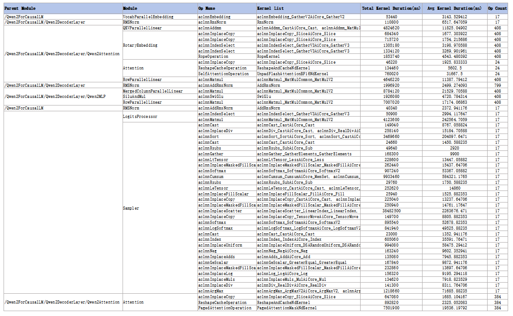

# 性能数据模型结构拆解

## 1. 简介

性能数据模型结构拆解（module_statistic）提供了针对PyTorch模型自动解析模型层级结构的分析功能，帮助精准定位性能瓶颈，为模型优化提供关键洞察。该功能提供：

* 模型结构拆解：自动提取并展示模型的层次化结构，以及模型中的算子调用顺序。
* 算子与Kernel映射：框架层算子下与NPU上执行Kernel的映射关系。
* 性能分析：精确统计并输出Device侧Kernel的执行耗时。

## 2. 使用前准备

**环境准备**

完成msprof-analyze工具安装，具体请参见《[msprof-analyze工具安装指南](../getting_started/install_guide.md)》。

**数据准备**

1. 添加模型层级msTX打点

    在模型代码中调用`torch_npu.npu.mstx.range_start/range_end`性能打点接口，需重写PyTorch中的nn.Module调用逻辑。

2. 配置并采集 Profiling 数据

   * 使用`torch_npu.profiler`接口采集性能数据。
   * 在`torch_npu.profiler._ExperimentalConfig`设置`mstx=True`，开启打点事件采集（在旧版本中对应的参数为`msprof_tx=True`）。
   * 在`torch_npu.profiler._ExperimentalConfig`设置`export_type`导出类型，需要包含Db。
   * 性能数据落盘在`torch_npu.profiler.tensorboard_trace_handler`接口指定的路径下，将该路径下的数据作为msprof-analyze cluster的输入数据。

完整样例代码，详见[性能数据采集样例代码](#51-性能数据采集样例代码)。

## 3. 功能介绍

**功能说明**

将采集到的带有模型结构msTX打点的数据，执行msprof-analyze工具分析操作。

**命令格式**

```bash
msprof-analyze -m module_statistic -d ./result --export_type text
```

**参数说明**

| 参数 | 可选/必选 | 说明                              |
| ---- | --------- |---------------------------------|
| -m   | 必选      | 设置为module_statistic，启动模型结构拆解。 |
| -d   | 必选      | 集群性能数据文件父目录路径。                    |
| -o   | 可选      | 分析结果输出路径，默认输出在-d参数指定的目录下。                       |
| --export_type   | 可选      | 输出文件类型，可选db或text，默认为db。             |

更多参数详细介绍请参见msprof-analyze的[参数说明](./README.md#51-参数说明)。

**输出说明**

* 当--export_type设置为db时，在-o参数指定路径下生成`cluster_analysis_output/cluster_analysis.db`文件，在该文件中生成`ModuleStatistic`表。
* 当--export_type设置为text时，每张卡生成独立的module_statistic_{rank_id}.xlsx文件。

具体介绍请参见[输出结果文件说明](#4-输出结果文件说明)。

## 4. 输出结果文件说明

输出结果体现模型层级，算子调用顺序，NPU上执行的Kernel以及统计时间。

**ModuleStatistic表**

| 字段名称                | 说明                                                         |
| ----------------------- | ------------------------------------------------------------ |
| parentModule            | 上层Module名称，TEXT类型                                     |
| module                  | 最底层Module名称，TEXT类型                                   |
| opName                  | 框架侧算子名称，同一module下，算子按照调用顺序排列，TEXT类型 |
| kernelList              | 框架侧算子下发到Device侧执行Kernel的序列，TEXT类型           |
| totalKernelDuration(ns) | 框架侧算子对应Device侧Kernel运行总时间，单位纳秒（ns），REAL类型 |
| avgKernelDuration(ns)   | 框架侧算子对应Device侧Kernel平均运行时间，单位纳秒（ns），REAL类型 |
| opCount                 | 框架侧算子在采集周期内运行的次数，INTEGER类型                |
| rankID                  | 集群场景的节点识别ID，集群场景下设备的唯一标识，INTEGER类型  |

**module_statistic_{rank_id}.xlsx**


## 5. 附录

### 5.1 性能数据采集样例代码

对于复杂模型结构，建议采用选择性打点策略以降低性能开销，核心性能打点实现代码如下：

```python
original_call = nn.Module.__call__

module_list = ["Attention", "QKVParallelLinear"]
def custom_call(self, *args, **kwargs):
    module_name = self.__class__.__name__
    if module_name not in module_list:
        return original_call(self, *args, **kwargs)
    mstx_id = torch_npu.npu.mstx.range_start(module_name, domain="Module")
    tmp = original_call(self, *args, **kwargs)
    torch_npu.npu.mstx.range_end(mstx_id, domain="Module")
    return tmp

nn.Module.__call__ = custom_call
```

完整样例代码如下：

```python
import random
import torch
import torch_npu
import torch.nn as nn
import torch.optim as optim


original_call = nn.Module.__call__

def custom_call(self, *args, **kwargs):
    """自定义nn.Module调用方法，添加msTX打点"""
    module_name = self.__class__.__name__
    mstx_id = torch_npu.npu.mstx.range_start(module_name, domain="Module")
    tmp = original_call(self, *args, **kwargs)
    torch_npu.npu.mstx.range_end(mstx_id, domain="Module")
    return tmp

# 替换默认调用方法
nn.Module.__call__ = custom_call

class RMSNorm(nn.Module):
    def __init__(self, dim: int, eps: float = 1e-6):
        super().__init__()
        self.eps = eps
        self.weight = nn.Parameter(torch.ones(dim))

    def _norm(self, x):
        return x * torch.rsqrt(x.pow(2).mean(-1, keepdim=True) + self.eps)

    def forward(self, x):
        output = self._norm(x.float()).type_as(x)
        return output * self.weight


class ToyModel(nn.Module):
    def __init__(self, D_in, H, D_out):
        super(ToyModel, self).__init__()
        self.input_linear = torch.nn.Linear(D_in, H)
        self.middle_linear = torch.nn.Linear(H, H)
        self.output_linear = torch.nn.Linear(H, D_out)
        self.rms_norm = RMSNorm(D_out)

    def forward(self, x):
        h_relu = self.input_linear(x).clamp(min=0)
        for i in range(3):
            h_relu = self.middle_linear(h_relu).clamp(min=random.random())
        y_pred = self.output_linear(h_relu)
        y_pred = self.rms_norm(y_pred)
        return y_pred


def train():
    N, D_in, H, D_out = 256, 1024, 4096, 64
    torch.npu.set_device(6)
    input_data = torch.randn(N, D_in).npu()
    labels = torch.randn(N, D_out).npu()
    model = ToyModel(D_in, H, D_out).npu()

    loss_fn = nn.MSELoss()
    optimizer = optim.SGD(model.parameters(), lr=0.001)

    experimental_config = torch_npu.profiler._ExperimentalConfig(
        aic_metrics=torch_npu.profiler.AiCMetrics.PipeUtilization,
        profiler_level=torch_npu.profiler.ProfilerLevel.Level2,
        l2_cache=False,
        mstx=True,  # 打开msTX采集，原参数名为msprof_tx
        data_simplification=False,
        export_type=[
            torch_npu.profiler.ExportType.Text,
            torch_npu.profiler.ExportType.Db
        ],  # 导出类型中必须要包含db
    )

    prof = torch_npu.profiler.profile(
        activities=[torch_npu.profiler.ProfilerActivity.CPU, torch_npu.profiler.ProfilerActivity.NPU],
        schedule=torch_npu.profiler.schedule(wait=1, warmup=1, active=3, repeat=1, skip_first=5),
        on_trace_ready=torch_npu.profiler.tensorboard_trace_handler("./result"),
        record_shapes=True,
        profile_memory=False,
        with_stack=False,
        with_modules=True,
        experimental_config=experimental_config)
    prof.start()

    for i in range(12):
        optimizer.zero_grad()
        outputs = model(input_data)
        loss = loss_fn(outputs, labels)
        loss.backward()
        optimizer.step()
        prof.step()

    prof.stop()


if __name__ == "__main__":
    train()
```
