# 专家建议

## 1 简介

advisor（专家建议）功能是将Ascend PyTorch Profiler或者MindSpore Profiler采集的性能数据进行分析，并输出性能调优建议。

## 2 快速上手

### 2.1 最简命令

如果不确定要分析哪类问题，优先使用`all`场景：

```bash
msprof-analyze advisor all -d /path/to/profiling_data/
```

输出文件默认保存在当前目录。若希望指定输出目录：

```bash
msprof-analyze advisor all -d /path/to/profiling_data/ -o /path/to/advisor_output/
```

> 单卡场景需要指定到性能数据文件`*_ascend_pt`或`*_ascend_ms`目录；多卡或集群场景需要指定到`*_ascend_pt`或`*_ascend_ms`目录的父目录层级。

### 2.2 常用命令速查表

| 场景 | 适用情况 | 可复制命令 |
| --- | --- | --- |
| 全量分析，无标杆 | 不确定瓶颈来源，先获得总体诊断 | `msprof-analyze advisor all -d /path/to/profiling_data/` |
| 全量分析，有标杆 | 已有基准性能数据，希望对比差异 | `msprof-analyze advisor all -d /path/to/profiling_data/ -bp /path/to/benchmark_profiling_data/` |
| 计算瓶颈分析 | 重点排查AICPU、动态Shape、Block Dim、算子瓶颈、融合算子图、AI Core降频等问题 | `msprof-analyze advisor computation -d /path/to/profiling_data/` |
| 调度瓶颈分析 | 重点排查GC、亲和API、aclopCompile、SyncBatchNorm、SynchronizeStream、可融合算子序列等问题 | `msprof-analyze advisor schedule -d /path/to/profiling_data/` |
| 输出英文报告 | 需要英文输出 | `msprof-analyze advisor all -d /path/to/profiling_data/ -l en` |
| 强制执行 | 需要跳过属主检查或大文件限制 | `msprof-analyze advisor all -d /path/to/profiling_data/ --force` |

## 3 使用前准备

**环境准备：**

命令行方式使用advisor功能，需要安装msprof-analyze，具体请参见《[msprof-analyze工具安装指南](../getting_started/install_guide.md)》。

**数据准备：**

msprof-analyze需要传入采集的性能数据文件夹，支持输入路径为集群性能数据路径和单卡的性能数据路径。如何采集性能数据请参见《[Ascend PyTorch调优工具](https://gitcode.com/Ascend/pytorch/blob/v2.7.1/docs/zh/ascend_pytorch_profiler/ascend_pytorch_profiler_user_guide.md)》或《[MindSpore调优工具](https://gitcode.com/Ascend/docs/blob/master/MindStudio/master/mindspore_profiler_user_guide.md)》。

**约束：**

CANN软件版本8.0RC1之前仅支持对text格式文件分析，8.0RC1及之后支持text、db格式的采集数据分析。

## 4 advisor功能介绍（命令行方式）

### 4.1 功能说明

msprof-analyze advisor命令行包含如下三个子命令：

- `all`：总体性能瓶颈，包含下表中所有功能。
- `computation`：计算瓶颈，包含下表中 computation 和 Kernel compare 功能。
- `schedule`：调度瓶颈，包含下表中 schedule 和 API compare 功能。

下表中字段为advisor的完整功能点，由`all`、`computation`和`schedule`控制启动。

| dimension  | mode                                  | 参数释义                                                                                | 支持场景                         |
| ---------- |---------------------------------------|-------------------------------------------------------------------------------------| ------------------------------------ |
| overall    | Overall Summary                       | 计算、通信、空闲等维度对性能数据进行拆解                                                                | PyTorch、MindSpore |
|            | Environment Variable Issues | 环境变量设置推荐                                                                            | PyTorch |
|     | slow rank                             | 慢卡识别                                                                                | PyTorch、MindSpore            |
|            | slow link                             | 慢链路识别                                                                               | PyTorch、MindSpore          |
| computation | AICPU Issues              | AICPU调优                                                                            | PyTorch、MindSpore          |
|            | Operator Dynamic Shape Issues | 识别动态Shape算子                                                                         | PyTorch   |
| | AI Core Performance Analysis | MatMul、FlashAttentionScore、AI_VECTOR_CORE和MIX_AIV类算子的性能分析                           | PyTorch |
|            | Block Dim Issues                   | Block Dim算子调优                                                                       | PyTorch、MindSpore   |
|            | Operator No Bound Issues     | 算子瓶颈分析                                                                              | PyTorch、MindSpore |
|            | Fusion Issues                    | 融合算子图调优                                                                             | PyTorch、MindSpore       |
|            | AI Core Frequency Issues | AI Core算子降频分析                                                                       | PyTorch、MindSpore |
|communication| Packet Analysis                       | 通信小包检测                                                                              |PyTorch、MindSpore                          |
|| Bandwidth Contention Analysis | 通信计算带宽抢占检测                                                                          |PyTorch、MindSpore |
|| Communication Retransmission Analysis | 通信重传检测                                                                              |PyTorch、MindSpore |
|| Byte Alignment Analysis | 通信算子字节对齐检测，传输类型为SDMA的通信算子，数据量需要被512字节整除，保证传输带宽不会下降                                  |PyTorch、MindSpore |
| schedule | Affinity API Issues     | 亲和API替换调优                                                                           | PyTorch、MindSpore     |
|            | Operator Dispatch Issues   | 识别算子下发问题（路径3/路径5）                                                                   | PyTorch |
| | SyncBatchNorm Issues | BatchNorm同步检测                                                                       | PyTorch、MindSpore |
| | Synchronize Stream Issues | 流同步检测                                                                               | PyTorch、MindSpore |
| | GC Analysis | 识别异常垃圾回收事件。需要Ascend PyTorch Profiler采集时开启experimental_config下的gc_detect_threshold功能 | PyTorch |
| | Fusible Operator Analysis | 检测具有Host瓶颈或者MTE瓶颈的算子序列，可用于代码优化或开发可融合算子                                              | PyTorch、MindSpore |
| dataloader | Slow Dataloader Issues | 异常dataloader检测                                                                      | PyTorch、MindSpore |
| memory | Memory Operator Issues | 识别异常的内存申请释放操作                                                                       | PyTorch、MindSpore |
| comparison | Kernel compare of Rank\* Step\* and Rank\* Step\* | 识别标杆和待比对性能数据的Kernel数据（无标杆场景是集群内部快慢卡的性能数据对比，有标杆场景是两个集群之间存在明显耗时差异的相同卡之间的性能数据对比）       | PyTorch、MindSpore |
|  | Api compare of Rank\* Step\* and Rank\* Step\* | 识别标杆和待比对性能数据的API数据（无标杆场景是集群内部快慢卡的性能数据对比，有标杆场景是两个集群之间存在明显耗时差异的相同卡之间的性能数据对比）          | PyTorch |

### 4.2 命令格式

**总体性能瓶颈**

```bash
msprof-analyze advisor all -d <profiling_path> [-bp <benchmark_profiling_path>] [-o <output_path>] [-cv <cann_version>] [-tv <torch_version>] [-pt <profiling_type>] [--force] [-l <language>] [--debug] [-h]
```

**计算瓶颈**

```bash
msprof-analyze advisor computation -d <profiling_path> [-o <output_path>] [-cv <cann_version>] [-tv <torch_version>] [-pt <profiling_type>] [--force] [-l <language>] [--debug] [-h]
```

**调度瓶颈**

```bash
msprof-analyze advisor schedule -d <profiling_path> [-o <output_path>] [-cv <cann_version>] [-tv <torch_version>] [--force] [-l <language>] [--debug] [-h]
```

### 4.3 参数说明

#### 4.3.1 必选参数

| 参数 | 说明 |
| --- | --- |
| `-d`<br>`--profiling_path` | 性能数据文件或目录所在路径，Ascend PyTorch Profiler采集场景指定为`*_ascend_pt`性能数据结果目录，MindSpore Profiler采集场景指定为`*_ascend_ms`性能数据结果目录。集群数据需要指定到`*_ascend_pt`或`*_ascend_ms`的父目录。 |

#### 4.3.2 可选参数

| 参数 | 说明 |
| --- | --- |
| `-bp`<br>`--benchmark_profiling_path` | 基准性能数据所在目录，用于性能比对。性能数据通过Profiling工具采集获取。<br>**computation和schedule不支持该参数。** |
| `-o`<br>`--output_path` | 分析结果输出路径，完成advisor分析操作后会在该目录下保存分析结果数据。默认未配置，为当前目录。 |
| `--force` | 强制执行advisor。配置后可强制跳过如下情况：<br>指定的目录、文件的用户属主不属于当前用户，忽略属主判断直接执行。<br>csv文件大于5G、json文件大于10G、db文件大于8G，忽略文件过大判断直接执行。<br>配置该参数表示开启强制执行，默认未配置表示关闭。 |
| `-l`<br>`--language` | 设置分析结果输出的语言，可取值：<br>`cn`：输出中文，默认值。<br>`en`：输出英文。 |
| `--debug` | 工具执行报错时可打开此开关，将会展示详细保存堆栈信息。配置该参数表示开启Debug，默认未配置表示关闭。 |
| `--agent` | 分析结果以json格式输出至标准输出，不写入文件。配置该参数表示开启stdout，默认未配置表示关闭。 |
| `-h`，`-H`<br>`--help` | 在需要查询当前命令附属子命令或相关参数时，给出帮助建议。 |

#### 4.3.3 版本/环境参数

| 参数 | 说明 |
| --- | --- |
| `-cv`<br>`--cann_version` | 使用Profiling工具采集时对应的CANN软件版本。目前配套的兼容版本为“6.3.RC2”，“7.0.RC1”、“7.0.0”、“8.0.RC1”，此字段不填默认按“8.0.RC1”版本数据进行处理，其余版本采集的Profiling数据在分析时可能会导致不可知问题。可通过在环境中执行如下命令获取其version字段：`cat /usr/local/Ascend/cann/aarch64-linux/ascend_toolkit_install.info` |
| `-tv`<br>`--torch_version` | 运行环境的torch版本，默认为1.11.0，支持torch1.11.0和torch2.1.0，当运行环境torch版本为其他版本如torch1.11.3时，可以忽略小版本号差异选择相近的torch版本如1.11.0。 |
| `-pt`<br>`--profiling_type` | 配置性能数据采集使用的Profiling工具类型。可取值：<br>`pytorch`：使用Ascend PyTorch Profiler接口方式采集的性能数据时配置，默认值。<br>`mindspore`：使用MindSpore Profiler接口方式采集的性能数据时配置。<br>`mslite`：使用[Benchmark](https://gitee.com/ascend/tools/tree/master/ais-bench_workload/tool/ais_bench)工具采集的性能数据时配置。不建议使用。<br>**schedule不支持该参数。** |

### 4.4 使用示例

**总体性能瓶颈**

```bash
msprof-analyze advisor all -d /path/to/profiling_data/
```

**计算瓶颈**

```bash
msprof-analyze advisor computation -d /path/to/profiling_data/
```

**调度瓶颈**

```bash
msprof-analyze advisor schedule -d /path/to/profiling_data/
```

单卡场景需要指定到性能数据文件`*_ascend_pt`或`*_ascend_ms`目录；多卡或集群场景需要指定到`*_ascend_pt`或`*_ascend_ms`目录的父目录层级。

## 5 输出说明

advisor会输出终端简略建议，并生成HTML报告和XLSX明细文件。若配置了`-o <output_path>`，输出文件会保存在指定目录下；未配置时默认输出到当前目录。

```text
<output_path>/
├── mstt_advisor_<timestamp>.html
└── mstt_advisor_<timestamp>.xlsx
```

| 输出 | 用途 | 查看建议 |
| --- | --- | --- |
| 终端输出 | 展示分析结果相关简略建议 | 适合快速确认是否存在明显问题 |
| `mstt_advisor_{timestamp}.html` | 查看总体结论、问题优先级、原因说明和优化建议 | 建议优先打开，按[报告解读指南](#6-报告解读指南)阅读 |
| `mstt_advisor_{timestamp}.xlsx` | 内容与执行终端输出一致，并包含明细数据 | 用于定位具体算子、API或通信项；comparison详细数据需要查看该文件 |

执行终端输出示例如下：

总体性能瓶颈

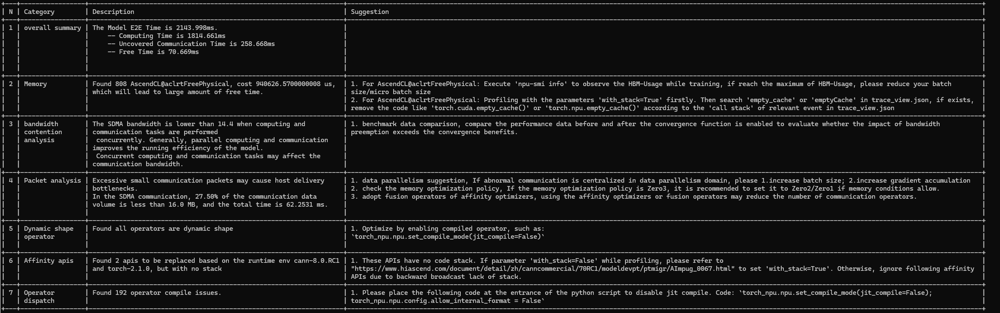

计算瓶颈

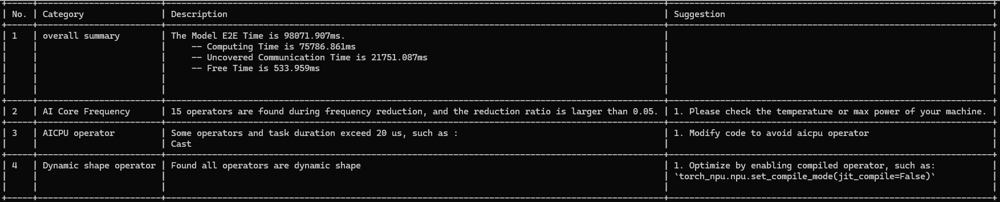

调度瓶颈


## 6 报告解读指南

### 6.1 快速导航

阅读HTML报告时，建议先看整体结论和High优先级问题，再查看对应模块的原因说明和优化建议。

| 阅读顺序 | 模块 | 这个模块告诉我什么 | 怎么用 |
| --- | --- | --- | --- |
| 1 | overall | 性能拆解、环境变量建议、快慢卡/快慢链路 | 先判断瓶颈大方向是计算、通信还是下发问题，并确认是否存在慢卡或慢链路 |
| 2 | comparison | Kernel/API对比差异 | 查看差异最大的Kernel或API，HTML仅展示Top 10，详细数据看XLSX |
| 3 | performance problem analysis | memory、communication、computation、dataloader、schedule等具体问题 | 按High、Medium、Low优先级处理，结合堆栈、算子、API或通信项定位代码与配置 |

如下图所示，工具会从集群、单卡性能拆解、调度和计算等维度进行问题诊断并给出相应的调优建议。并通过红、黄、绿色块表示问题优先级，分别为High（高）、Medium（中）、Low（低）。

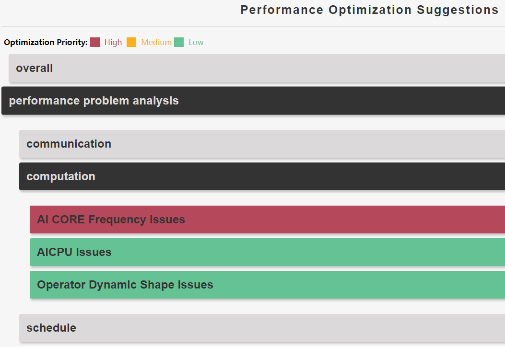

### 6.2 场景一：无标杆（无-bp）

无标杆是指执行msprof-analyze advisor时，未配置`-bp`参数，会根据是否为集群性能数据，且集群中各卡的computing time和free time耗时差异判断是否进行kernel和API性能数据的对比，以慢卡数据为标杆数据，快卡数据为待比对数据。

#### overall模块

overall模块仅识别问题，不提供调优建议。

| 场景 | 这个模块告诉我什么 | 怎么用 |
| --- | --- | --- |
| 无标杆单卡，Environment Variable Issues | 对环境变量的设置做出推荐 | 根据报告推荐检查环境变量设置 |
| 无标杆单卡，Overall Summary | 当前训练任务慢卡的性能拆解，按照计算、通信和下发三个维度统计耗时 | 判断训练性能瓶颈是计算、通信还是下发问题 |
| 无标杆集群 | 快慢卡和快慢链路分析 | 定位慢卡、慢链路，再进入comparison和具体问题模块看原因 |

无标杆单卡场景的overall模块的Environment Variable Issues示例如下：


上图中的环境变量详细介绍请参见[ACLNN_CACHE_LIMIT](https://www.hiascend.com/document/detail/zh/canncommercial/80RC22/apiref/envvar/envref_07_0031.html)和[HOST_CACHE_CAPACITY](https://www.hiascend.com/document/detail/zh/canncommercial/80RC22/developmentguide/appdevg/aclpythondevg/aclpythondevg_0045.html)。

无标杆单卡场景的overall summary分析示例如下：


无标杆集群场景的overall模块包含快慢卡和快慢链路分析，示例如下：

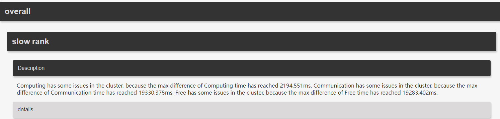


#### comparison模块

comparison模块识别标杆和待比对性能数据的Kernel和API数据。无标杆场景的comparison是集群内部快慢卡的性能数据对比。

- Kernel compare of RankStep and RankStep：Kernel的待比对总耗时、待比对平均耗时、待比对最大耗时、待比对最小耗时和待比对执行次数，以及标杆的对应数据，最后计算Diff Total Ratio（标杆总耗时/待比对总耗时）和Diff Avg Ratio（标杆平均耗时/待比对平均耗时）。

  Diff Total Ratio和Diff Avg Ratio大于1则表示当前环境性能更优，小于1则表示当前环境有待优化，等于1则表示当前环境与标杆环境性能接近。

  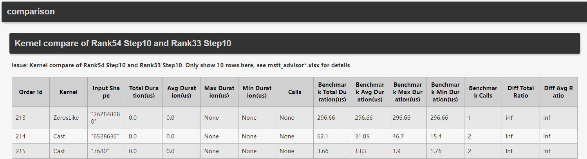

  其中inf表示分母为0（未获取到待对比数据或待对比数据为0），None表示未获取到数据。

- Api compare of RankStep and RankStep：API的待比对总耗时、待比对API自身耗时（除去API调用的子API的耗时）、待比对平均耗时和待比对执行次数，以及标杆的对应数据，最后计算Diff Total Ratio（标杆总耗时/待比对总耗时）、Diff Self Ratio（标杆API自身耗时/待比对API自身耗时）、Diff Avg Ratio（标杆平均耗时/待比对平均耗时）和Diff Calls Ratio（标杆执行次数/待比对执行次数）。

  Diff Total Ratio、Diff Self Ratio、Diff Avg Ratio和Diff Calls Ratio大于1则表示当前环境性能更优，小于1则表示当前环境有待优化，等于1则表示当前环境与标杆环境性能接近。

  

  其中inf表示分母为0（未获取到待对比数据或待对比数据为0），None表示未获取到数据。

`mstt_advisor_{timestamp}.html`文件的comparison模块内容仅展示Kernel和API的Top 10条数据，详细数据需要查看`mstt_advisor_{timestamp}.xlsx`文件。

#### performance problem analysis模块

performance problem analysis模块包含memory、communication、computation、dataloader、schedule等子模块。各子模块的作用和示例见[各问题类型详解](#7-各问题类型详解)。

### 6.3 场景二：有标杆（有-bp）

有标杆是指执行msprof-analyze advisor时，配置`-bp`参数，指定基准性能数据进行比对。

#### overall模块

有标杆单卡场景：不进行overall模块的分析，performance problem analysis模块与无标杆场景下的performance problem analysis模块结果一致。

有标杆集群场景：

- overall模块进行快慢卡和快慢链路分析，与无标杆集群场景一致，请参见[场景一：无标杆（无-bp）](#62-场景一无标杆无-bp)中的overall模块。
- 提供Environment Variable Issues，与无标杆单卡场景一致，请参见[场景一：无标杆（无-bp）](#62-场景一无标杆无-bp)中的overall模块。

#### comparison模块

有标杆集群场景同样提供comparison模块。无标杆场景是集群内部快慢卡的性能数据对比；有标杆场景是两个集群之间存在明显耗时差异的相同卡之间的性能数据对比。

- Kernel compare of Target and Benchmark：Kernel的待比对总耗时、待比对平均耗时、待比对最大耗时、待比对最小耗时和待比对执行次数，以及标杆的对应数据，最后计算Diff Total Ratio（标杆总耗时/待比对总耗时）和Diff Avg Ratio（标杆平均耗时/待比对平均耗时）。

  Diff Total Ratio和Diff Avg Ratio大于1则表示当前环境性能更优，小于1则表示当前环境有待优化，等于1则表示当前环境与标杆环境性能接近。

  

  其中inf表示分母为0（未获取到待对比数据或待对比数据为0），None表示未获取到数据。

- Api compare of Target and Benchmark：API的待比对总耗时、待比对API自身耗时（除去API调用的子API的耗时）、待比对平均耗时和待比对执行次数，以及标杆的对应数据，最后计算Diff Total Ratio（标杆总耗时/待比对总耗时）、Diff Self Ratio（标杆API自身耗时/待比对API自身耗时）、Diff Avg Ratio（标杆平均耗时/待比对平均耗时）和Diff Calls Ratio（标杆执行次数/待比对执行次数）。

  Diff Total Ratio、Diff Self Ratio、Diff Avg Ratio和Diff Calls Ratio大于1则表示当前环境性能更优，小于1则表示当前环境有待优化，等于1则表示当前环境与标杆环境性能接近。

  

  其中inf表示分母为0（未获取到待对比数据或待对比数据为0），None表示未获取到数据。

`mstt_advisor_{timestamp}.html`文件的comparison模块内容仅展示Kernel和API的Top 10条数据，详细数据需要查看`mstt_advisor_{timestamp}.xlsx`文件。

#### performance problem analysis模块

有标杆场景下，performance problem analysis模块与无标杆场景一致。建议按memory、communication、computation、dataloader、schedule的顺序查看，优先处理High优先级问题。

## 7 各问题类型详解

### 7.1 computation模块问题速查

computation模块从device计算性能维度进行分析，能够识别AICPU、动态Shape、AI Core Performance Analysis、Block Dim、算子瓶颈、融合算子图、AI Core算子降频分析等问题并给出相应建议。按照报告进行调优即可。

| 问题类型 | 识别内容 | 使用建议 |
| --- | --- | --- |
| AICPU Issues | AICPU调优 | 结合报告建议和AICPU算子替换样例处理 |
| Operator Dynamic Shape Issues | 识别动态Shape算子 | 关注动态Shape导致的编译或执行开销 |
| AI Core Performance Analysis | MatMul、FlashAttentionScore、AI_VECTOR_CORE和MIX_AIV类算子的性能分析 | 根据报告分析AI Core类算子性能 |
| Block Dim Issues | Block Dim算子调优 | 根据报告建议调整相关算子配置 |
| Operator No Bound Issues | 算子瓶颈分析 | 定位无明显边界但耗时异常的算子 |
| Fusion Issues | 融合算子图调优 | 结合报告建议优化融合图 |
| AI Core Frequency Issues | AI Core算子降频分析 | 排查AI Core算子降频原因 |

示例如下：

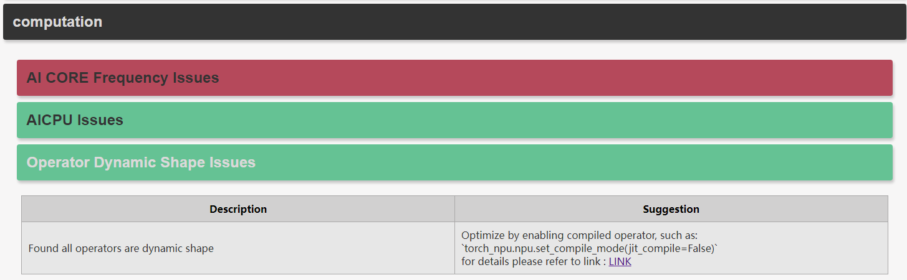


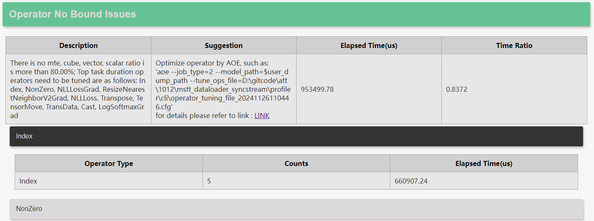

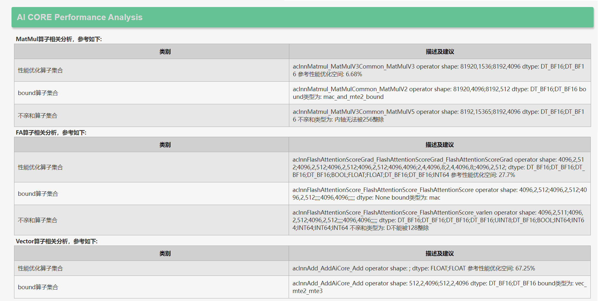

上图中torch_npu.npu.set_compile_mode接口介绍请参见[torch_npu.npu.set_compile_mode](https://www.hiascend.com/document/detail/zh/Pytorch/710/apiref/torchnpuCustomsapi/context/%EF%BC%88beta%EF%BC%89torch_npu-npu-set_compile_mode.md)；AICPU算子替换样例可参考《[AICPU 算子替换样例](../aicpu_operator_replacement_example.md)》。

当存在pp stage（流水线并行）时，computation会按stage分析，每个stage就是一个流水线切分，比如0\~7卡为stage-0、8\~15卡为stage-1。

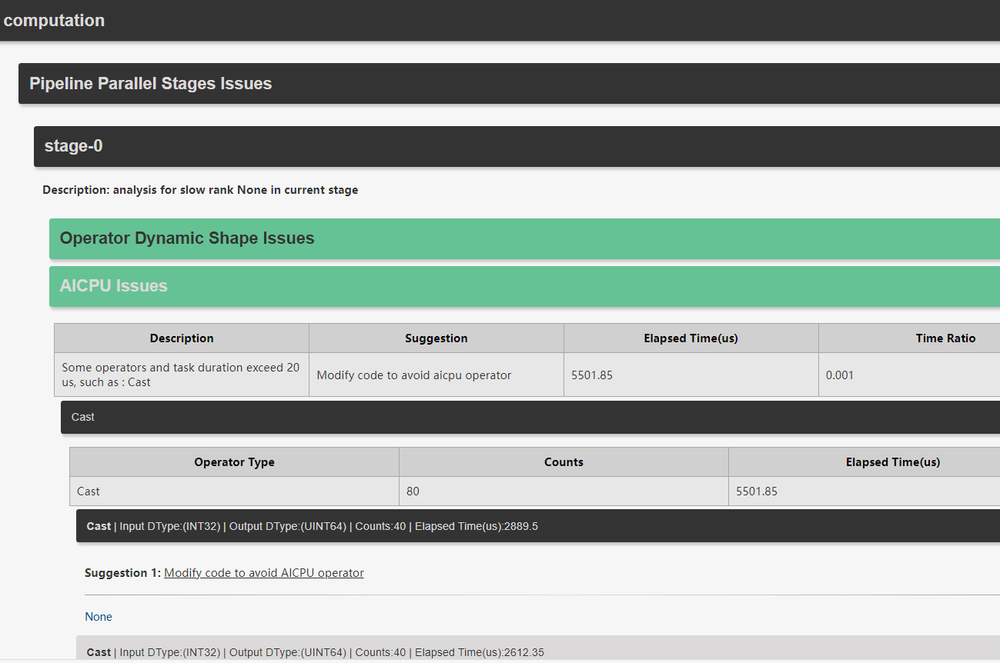

### 7.2 communication模块问题速查

communication模块从通信维度进行分析，目前支持通信小包检测、通信计算带宽抢占检测、通信重传检测、通信算子字节对齐检测。

| 问题类型 | 识别内容 | 使用建议 |
| --- | --- | --- |
| Packet Analysis | 通信小包检测 | 查看是否存在过多小包通信，结合报告建议优化通信粒度 |
| Bandwidth Contention Analysis | 通信计算带宽抢占检测 | 检测计算和通信并发时，通信带宽被抢占的场景 |
| Communication Retransmission Analysis | 通信重传检测 | 识别发生重传的通信域并查看调优建议 |
| Byte Alignment Analysis | 通信算子字节对齐检测 | 传输类型为SDMA的通信算子，数据量需要被512字节整除，保证传输带宽不会下降 |

通信模块示例如下：


上图中Zero1/Zero2/Zero3含义如下：

- Zero1：每张NPU存储完整的一份梯度和模型参数，只有1/N优化器。每张NPU使用各自的数据做前向传播、反向传播，反向传播后使用all-reduce同步梯度到所有卡，使得每张卡有所有算子的梯度。每张卡根据梯度和1/N优化器更新1/N模型参数，再使用all-gather通信将优化器更新后的1/N模型参数发送给其它卡，因为每张卡有完整的一份模型参数需要更新。
- Zero2：每张NPU存储完整的一份模型参数，只有1/N优化器和1/N梯度。每张NPU使用各自的数据做前向传播。反向传播后，计算出本卡的局部梯度，使用Reduce-Scatter通信聚合梯度，保证每张卡只保存1/N梯度。每张卡根据自己保持的1/N优化器和1/N梯度更新1/N模型参数，再使用all-gather通信将更新后的模型参数发送给其它卡，因为每张卡有完整的一份模型参数需要更新。
- Zero3：每张NPU存储1/N模型参数、1/N优化器和1/N梯度。前向传播前，每张卡all-gather通信获取到完整的模型参数，再做前向传播计算，每用完一部分模型参数后就把它删除。反向传播开始前，每张卡all-gather通信获取到完整的模型参数，每用完一部分模型参数后就把它删除。使用reduce-scatter通信聚合梯度。每张卡根据自己保持的1/N优化器和1/N梯度更新1/N模型参数，由于每张卡只保存1/N模型参数，无需要将更新后的模型参数发送给其它卡。

通信重传检测示例如下：


带宽抢占分析示例如下：


通信算子字节对齐检测示例如下：

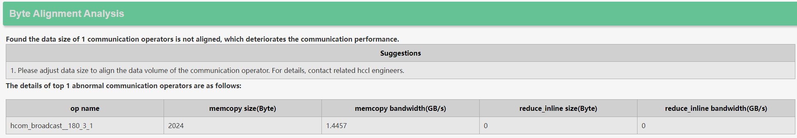

### 7.3 schedule模块问题速查

schedule模块包含GC Analysis、亲和API、aclopCompile、SyncBatchNorm、SynchronizeStream和Fusible Operator Analysis等多项检测。

| 问题类型 | 识别内容 | 使用建议 |
| --- | --- | --- |
| GC Analysis | 识别异常垃圾回收事件 | 可通过有效的Python内存管理、使用`gc.set_threshold()`调整垃圾回收阈值、使用`gc.disable()`禁用gc等方法处理 |
| Affinity API Issues | 亲和API替换调优 | 根据堆栈找到需要修改的代码，并参考API替换样例 |
| Operator Dispatch Issues | 识别算子下发问题（路径3/路径5） | 关注aclopCompile等算子下发问题，按报告建议修改运行脚本 |
| SyncBatchNorm Issues | BatchNorm同步检测 | 查看同步BatchNorm是否带来调度开销 |
| Synchronize Stream Issues | 流同步检测 | 根据堆栈修改对应代码，消除不必要同步流 |
| Fusible Operator Analysis | 检测具有Host瓶颈或者MTE瓶颈的算子序列 | 用于代码优化或开发可融合算子 |

Fusible Operator Analysis解析结果打印展示并保存在`mstt_advisor_{timestamp}.xlsx`文件中，包含“基于host瓶颈的算子序列分析”和“基于mte瓶颈的算子序列分析”页签，如下图：

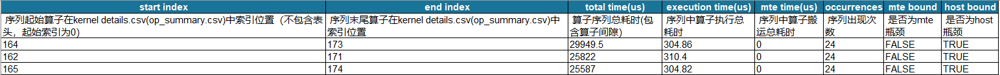

| 字段 | 说明 |
| --- | --- |
| start index | 序列起始算子在kernel details.csv或op_summary.csv中索引位置（不包含表头，起始索引为0）。 |
| end index | 序列末尾算子在kernel details.csv或op_summary.csv中索引位置。 |
| total time(us) | 算子序列总耗时（包含算子间隙），单位us。 |
| execution time(us) | 序列中算子执行总耗时，单位us。 |
| mte time(us) | 序列中算子搬运总耗时，单位us。 |
| occurrences | 序列出现次数。 |
| mte bound | 是否为MTE瓶颈。 |
| host bound | 是否为Host瓶颈。 |

GC Analysis示例如下：


上图中`gc.set_threshold()`和`gc.disable()`函数说明如下：

在Python中，gc模块提供了对垃圾回收器的控制。

- `gc.set_threshold(threshold0, threshold1, threshold2)`：这个函数用于设置垃圾回收的阈值。垃圾回收器将所有对象分为三代（0代、1代和2代），每一代的对象在经历垃圾回收后会被移到下一代。`threshold0`控制第0代的垃圾回收频率，`threshold1`控制第1代的垃圾回收频率，`threshold2`控制第2代的垃圾回收频率。将`threshold0`设为0可以禁用垃圾回收。
- `gc.disable()`：这个函数用于禁用自动垃圾回收。调用`gc.disable()`后，垃圾回收器将不会自动运行，直到手动调用`gc.enable()`。

Affinity API Issues示例如下，用户可以根据堆栈找到需要修改的代码，并给出修改案例（[昇腾迁移融合算子API替换样例](../fused_operator_api_replacement_example.md)）。

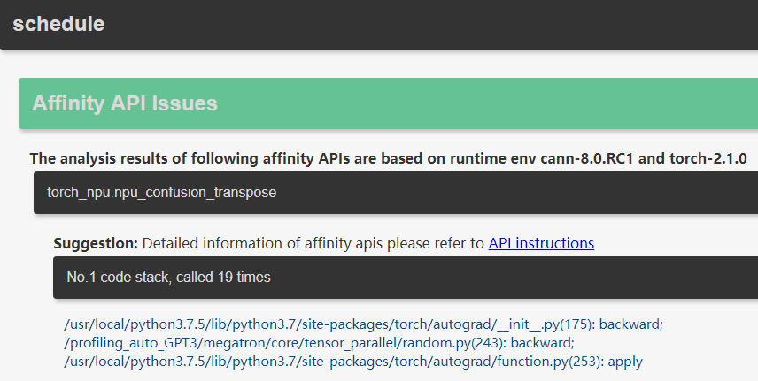

Synchronize Stream Issues示例如下，需要根据堆栈来修改对应代码消除同步流。


上图中的ASCEND_LAUNCH_BLOCKING环境变量介绍请参见[ASCEND_LAUNCH_BLOCKING](https://www.hiascend.com/document/detail/zh/Pytorch/710/comref/Envvariables/Envir_006.html)。

Operator Dispatch Issues示例如下，提示需要在运行脚本的最开头添加如下代码用于消除aclopCompile：

```python
torch_npu.npu.set_compile_mode(jit_compile=False);
torch_npu.npu.config.allow_internal_format = False
```

以上接口介绍请参见[torch_npu.npu.set_compile_mode](https://www.hiascend.com/document/detail/zh/Pytorch/710/apiref/torchnpuCustomsapi/context/%EF%BC%88beta%EF%BC%89torch_npu-npu-set_compile_mode.md)和[torch_npu.npu.config.allow_internal_format](https://www.hiascend.com/document/detail/zh/Pytorch/710/apiref/torchnpuCustomsapi/context/%EF%BC%88beta%EF%BC%89torch_npu-npu-config-allow_internal_format.md)。


上图中aclopCompileAndExecute接口介绍请参见[aclopCompileAndExecute](https://www.hiascend.com/document/detail/zh/canncommercial/82RC1/API/appdevgapi/aclcppdevg_03_0251.html)。

### 7.4 memory/dataloader模块问题速查

| 模块 | 问题类型 | 识别内容 | 使用建议 |
| --- | --- | --- | --- |
| memory | Memory Operator Issues | 识别异常的内存申请释放操作 | 查看异常申请释放操作，结合报告定位对应算子或API |
| dataloader | Slow Dataloader Issues | 检测异常高耗时的dataloader调用 | 结合`pin_memory`和`num_workers`等参数优化数据加载 |

memory模块分析内存的异常申请释放操作。


dataloader模块包含Slow Dataloader Issues，主要检测异常高耗时的dataloader调用，并给出优化建议。


上图中的`pin_memory`（内存锁定）和`num_workers`（数据加载子流程的数量）参数为[数据加载优化](https://www.hiascend.com/document/detail/zh/Pytorch/710/ptmoddevg/trainingmigrguide/performance_tuning_0026.html)使用。

## 8 补充说明

advisor中涉及的接口链接、参考文档如下。

| 类型 | 名称 | 说明/链接 |
| --- | --- | --- |
| 安装指南 | msprof-analyze工具安装指南 | [msprof-analyze工具安装指南](../getting_started/install_guide.md) |
| 数据采集 | Ascend PyTorch调优工具 | [Ascend PyTorch调优工具](https://gitcode.com/Ascend/pytorch/blob/v2.7.1/docs/zh/ascend_pytorch_profiler/ascend_pytorch_profiler_user_guide.md) |
| 数据采集 | MindSpore调优工具 | [MindSpore调优工具](https://gitcode.com/Ascend/docs/blob/master/MindStudio/master/mindspore_profiler_user_guide.md) |
| 环境变量 | ACLNN_CACHE_LIMIT | [ACLNN_CACHE_LIMIT](https://www.hiascend.com/document/detail/zh/canncommercial/80RC22/apiref/envvar/envref_07_0031.html) |
| 环境变量 | HOST_CACHE_CAPACITY | [HOST_CACHE_CAPACITY](https://www.hiascend.com/document/detail/zh/canncommercial/80RC22/developmentguide/appdevg/aclpythondevg/aclpythondevg_0045.html) |
| 环境变量 | ASCEND_LAUNCH_BLOCKING | [ASCEND_LAUNCH_BLOCKING](https://www.hiascend.com/document/detail/zh/Pytorch/710/comref/Envvariables/Envir_006.html) |
| 接口 | torch_npu.npu.set_compile_mode | [torch_npu.npu.set_compile_mode](https://www.hiascend.com/document/detail/zh/Pytorch/710/apiref/torchnpuCustomsapi/context/%EF%BC%88beta%EF%BC%89torch_npu-npu-set_compile_mode.md) |
| 接口 | torch_npu.npu.config.allow_internal_format | [torch_npu.npu.config.allow_internal_format](https://www.hiascend.com/document/detail/zh/Pytorch/710/apiref/torchnpuCustomsapi/context/%EF%BC%88beta%EF%BC%89torch_npu-npu-config-allow_internal_format.md) |
| 接口 | aclopCompileAndExecute | [aclopCompileAndExecute](https://www.hiascend.com/document/detail/zh/canncommercial/82RC1/API/appdevgapi/aclcppdevg_03_0251.html) |
| 样例 | AICPU算子替换样例 | [AICPU 算子替换样例](../aicpu_operator_replacement_example.md) |
| 样例 | 昇腾迁移融合算子API替换样例 | [昇腾迁移融合算子API替换样例](../fused_operator_api_replacement_example.md) |
| 数据加载 | 数据加载优化 | [数据加载优化](https://www.hiascend.com/document/detail/zh/Pytorch/710/ptmoddevg/trainingmigrguide/performance_tuning_0026.html) |

## 9 专家建议（Jupyter Notebook方式）

### 9.1 功能简介

advisor的Jupyter Notebook方式用于在Notebook页面中交互式查看性能数据分析过程和分析结果。

使用Jupyter Notebook方式前，需要先准备Ascend PyTorch Profiler采集的性能数据。采集方法请参见《[Ascend PyTorch调优工具](https://gitcode.com/Ascend/pytorch/blob/v2.7.1/docs/zh/ascend_pytorch_profiler/ascend_pytorch_profiler_user_guide.md)》。

> Jupyter Notebook方式作为命令行方式的补充，不参与命令行主流程。MindSpore场景不支持Jupyter Notebook方式。

### 9.2 使用前准备

**安装Jupyter Notebook**

安装Jupyter Notebook工具。Jupyter Notebook工具的具体安装和使用指导请至Jupyter Notebook工具官网查找。

```bash
pip install jupyter notebook
```

**下载msprof-analyze源码**

```bash
git clone https://gitcode.com/Ascend/msprof-analyze
```

**准备性能数据**

advisor需要传入采集的性能数据文件夹，如何采集性能数据请参见《[Ascend PyTorch调优工具](https://gitcode.com/Ascend/pytorch/blob/v2.7.1/docs/zh/ascend_pytorch_profiler/ascend_pytorch_profiler_user_guide.md)》。

**使用限制**

MindSpore场景不支持Jupyter Notebook方式。

### 9.3 启动Jupyter Notebook

进入`msprof_analyze/advisor`目录，执行如下命令启动Jupyter Notebook工具。

```bash
jupyter notebook
```

执行成功后，会自动启动浏览器并读取`msprof_analyze/advisor`目录，如下示例：

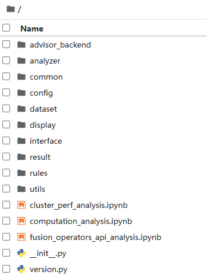

若在Linux环境下，终端会回显Jupyter Notebook页面的URL地址。复制该URL，并使用浏览器访问。若在远端服务器上运行，需要将URL中的`localhost`替换为远端服务器的IP地址。

### 9.4 运行分析任务

每个`.ipynb`文件对应一项性能数据分析任务。选择需要的`.ipynb`文件打开，并在`*_path`参数下填写Ascend PyTorch Profiler采集的性能数据路径。如下示例：


单击运行按钮执行性能数据分析。

分析结果会在`.ipynb`页面中展示。

## 10 常见问题FAQ

**Q1：第一次使用应该选哪个命令？**

优先使用`advisor all`。该命令会覆盖总体性能瓶颈、计算、通信、调度、内存、数据加载和对比分析等功能。

```bash
msprof-analyze advisor all -d /path/to/profiling_data/
```

**Q2：没有标杆数据能不能分析？**

可以。不配置`-bp`就是无标杆场景。工具会根据性能数据中的computing time和free time判断是否进行kernel和API性能数据对比，以慢卡数据为标杆数据，快卡数据为待比对数据。

**Q3：有标杆数据时怎么运行？**

使用`advisor all`并配置`-bp`：

```bash
msprof-analyze advisor all -d /path/to/profiling_data/ -bp /path/to/benchmark_profiling_data/
```

**Q4：`computation`和`schedule`能不能使用`-bp`？**

不能。`computation`和`schedule`不支持`-bp`参数。

**Q5：HTML和XLSX应该先看哪个？**

建议先看HTML报告中的overall、comparison和performance problem analysis模块，确认总体结论和High优先级问题；再通过XLSX明细定位具体算子、API或通信项。

**Q6：comparison模块为什么只看到Top 10？**

`mstt_advisor_{timestamp}.html`文件的comparison模块内容仅展示Kernel和API的Top 10条数据，详细数据需要查看`mstt_advisor_{timestamp}.xlsx`文件。

**Q7：单卡和集群数据路径怎么填？**

单卡场景需要指定到性能数据文件`*_ascend_pt`或`*_ascend_ms`目录；多卡或集群场景需要指定到`*_ascend_pt`或`*_ascend_ms`目录的父目录层级。

**Q8：文件太大或属主不一致导致工具不执行怎么办？**

确认风险后可以使用`--force`。该参数会强制跳过目录或文件属主判断，也会忽略csv文件大于5G、json文件大于10G、db文件大于8G的文件过大判断。
