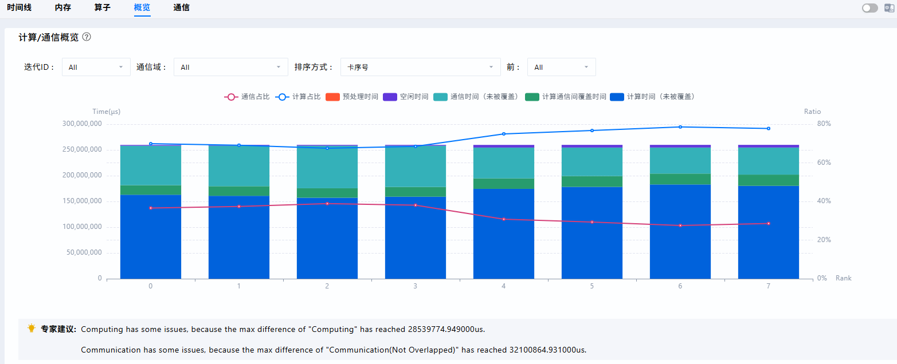

# 集群分析工具

## 简介

`cluster_analyse` 是面向集群场景的分析工具，基础功能涵盖通信域的迭代内耗时分析、通信时间分析和通信矩阵分析，可用于定位慢卡、慢节点及慢链路问题。

## 性能数据采集

当前集群分析能力支持以下 4 类 profiling 数据作为输入：

| 采集工具 | 支持的结果类型 | 采集指南                                                                                                                                          |
| --- | --- |-----------------------------------------------------------------------------------------------------------------------------------------------|
| msProf | db | 《[模型调优工具](https://gitcode.com/Ascend/msprof/blob/master/docs/zh/getting_started/quick_start.md)》                                                                                                 |
| Ascend PyTorch Profiler | text、db | 《[Ascend PyTorch调优工具](https://gitcode.com/Ascend/pytorch/blob/v2.7.1/docs/zh/ascend_pytorch_profiler/ascend_pytorch_profiler_user_guide.md)》 |
| MindSpore Profiler | text、db | 《[MindSpore调优工具](https://gitcode.com/Ascend/docs/blob/master/MindStudio/master/mindspore_profiler_user_guide.md)》 |
| msMonitor | db | 《[msMonitor](https://gitcode.com/Ascend/msmonitor/blob/master/docs/zh/getting_started/quick_start.md)》                                                                              |

## 数据要求

下面以 Ascend PyTorch Profiler 为例说明输入数据要求。

### 采集配置

`profiler_level` 建议设置为 `Level1` 或更高。`Level0` 及以下不会采集通信小算子，因此无法获取通信带宽和通信矩阵信息，仅能汇总集群的`step_trace_time`迭代内耗时信息。

```python
experimental_config = torch_npu.profiler._ExperimentalConfig(
    profiler_level=torch_npu.profiler.ProfilerLevel.Level1
)
```

### 数据格式

Ascend PyTorch Profiler 支持以下两种结果格式，二者满足其一即可：

#### text 类型结果

打开某张卡采集到的 *_ascend_pt 目录，可用的 text 类型结果必须包含以下目录和文件：

```text
*_ascend_pt
├── ASCEND_PROFILER_OUTPUT
    ├── step_trace_time.csv
    ├── communication.json
    └── communication_matrix.json
└── profiler_info_*.json
```

#### db 类型结果

打开某张卡采集到的 *_ascend_pt 目录，可用的 db 类型结果通常应包含以下目录和文件：

```text
*_ascend_pt
├── ASCEND_PROFILER_OUTPUT
    ├── analysis.db
    └── ascend_pytorch_profiler_{rank_id}.db
└── profiler_info_*.json
```

> [!NOTE]
>
> 对于PyTorch集群性能数据需要汇总分析的场景，由于数据量较大，转存的代价高，且数据分析耗时长。因此可单独保存`analysis.db`和`profiler_info_*.json`文件（须保留原有目录结构）进行`msprof-analyze cluster`分析，可节省分析耗时完成基本的性能分析。

### 集群输入目录要求

集群分析时，-d 参数应指向集群性能数据根目录，根目录下需包含多张卡、同一次采集得到的 profiling 子目录。为保证分析结果准确，建议集群路径满足：

* 只包含同一次采集的全量卡数据，避免混入不同批次或缺失部分 rank；
* 各卡目录层级和命名保持完整，便于工具正确识别 rank 关系。

若混入不同批次数据或缺失部分 rank，通信矩阵的 `src_rank`、`dst_rank` 映射可能不准确，并伴有 warning 输出。

## 集群通信数据汇总

### 操作步骤

1. 参见《[安装指南](../getting_started/install_guide.md)》完成工具安装。建议安装最新版本。

2. 将所有卡的数据拷贝并汇集到一个目录下，运行以下命令，生成`cluster_analysis_output`文件夹。

   ```bash
   # 命令行运行方式
   msprof-analyze cluster -d {cluster profiling data path} [-m mode] [-o output_path] [--force]
   # 示例
   msprof-analyze cluster -m all -d ./cluster_data -o ./output
   ```

   或
   
   ```bash
   # 脚本运行方式
   python3 cluster_analysis.py -d {cluster profiling data path} [-m mode] [-o output_path] [--force]
   # 示例
   python3 cluster_analysis.py -d ./cluster_data -o ./output
   ```

   参数说明：
   
   | 参数名               | 可选/必选 | 说明                                                         |
   | -------------------- | --------- | ------------------------------------------------------------ |
   | --profiling_path或-d | 必选      | 性能数据汇集目录。未配置-o参数时，运行分析脚本之后会在该目录下自动创建cluster_analysis_output文件夹，保存分析数据。 |
   | --output_path或-o    | 可选      | 自定义输出路径，运行分析脚本之后会在该目录下自动创建cluster_analysis_output文件夹，保存分析数据。 |
   | --mode或-m           | 可选      | 数据解析模式，取值详见“**--mode参数说明**”表。               |
   | --agent              | 可选      | 分析结果以json格式输出至标准输出，配置该参数表示开启，默认未配置表示关闭。 |
   | --force              | 可选      | 强制执行cluster。配置后可强制跳过如下情况：<br>&#8226; 指定的目录、文件的用户属主不属于当前用户，忽略属主判断直接执行。<br>&#8226; csv文件大于5G、json文件大于10G、db文件大于8G，忽略文件过大判断直接执行。<br>配置该参数表示开启强制执行，默认未配置表示关闭。 |
   
   --mode参数说明：
   
   | 参数名               | 可选/必选 | 说明                                                         |
   | -------------------- | --------- | ------------------------------------------------------------ |
   | communication_matrix | 可选      | 解析通信矩阵数据。                                           |
   | communication_time   | 可选      | 解析通信耗时数据。                                           |
   | all                  | 可选      | 同时解析通信矩阵communication_matrix和通信耗时数据communication_time，--mode参数默认值为all。 |

3. 推荐使用 MindStudio Insight 工具导入生成的 `cluster_analysis_output` 文件夹进行可视化展示，如下图所示。具体使用方法请参见《[MindStudio Insight用户指南](https://gitcode.com/Ascend/msinsight/blob/master/docs/zh/user_guide/overview.md)》。

    
        <div style="text-align: center;">
        图1 集群计算/通信概览可视化呈现
        </div>

    
        <div style="text-align: center;">
        图2 集群通信矩阵可视化呈现
        </div>    

### 交付件

#### cluster_step_trace_time.csv

数据解析模式为communication_matrix、communication_time或all时均生成。

A列： Step数，是采集性能数据时设置的，一般来说集群性能数据采集一个step足够，如果采集多个step，需要先筛选一下。

B列： Type，主要分两种，rank和stage，和后面的index强相关，可以理解为一个是单卡rank，一个是rank group（pp 并行的stage），如果type为stage，则后面D-K列信息为rank group下的最大值。

C列：Index，与type相关，表示卡号。

D列：Computing， 此列统计计算时间。

E列：Communication(Not Overlapped)，此列统计未被掩盖的通信耗时。

F列：Overlapped，统计计算与通信重叠的耗时。

G列：Communication，通信时间的全部耗时。

H列：Free，空闲时间，指device侧既不在通信也不在计算的耗时，可能在做sdma拷贝或者空等。

I列：Stage时间，I、J、K列属于pp并行时有效的数值，stage时间代表除receive算子时间外的时间。

J列：Bubble时间，指receive时间的总和。

K列：Communication（Not Overlapped and Exclude Receive）指剔除receive算子外的并且不被掩盖的通信时间。

L列：Preparing，指迭代开始到首个计算或通信算子运行的时间。

M列：DP Index，指集群数据按照并行策略切分后所属DP组的索引， 如果没有采集则不显示。

N列：PP Index，指集群数据按照并行策略切分后所属PP组的索引，如果没有采集则不显示。

O列：TP Index，指集群数据按照并行策略切分后所属TP组的索引，如果没有采集则不显示。

**Tips**：先筛选B列type为stage， 看stage间是否有问题，再筛选B列type为rank，看rank是否有问题，根据以下几点排查。

* 根据Computing的时间差异判断是否有慢卡，或者有负载不均衡的现象。

* 根据Free统计是否有host bound或者分布不均现象。

* 根据Communication（Not Overlapped and Exclude Receive）时间判断是否通信耗时占比过大。

* 根据Bubble时间的占比和理论计算公式判断bubble设置是否合理，是否stage间有不均衡现象。

以上时间理论上都应该处于持平状态，即最大值最小值的差值不高于5%，否则就可能出现慢卡。

#### cluster_communication_matrix.json

数据解析模式为communication_matrix或all时生成。

直接打开json（vscode或json查看器）, 搜索"Total", 会有多个搜索结果，一般来说链路带宽信息的结构：

```json
{src_rank}-{dst_rank}: {
    "Transport Type": "LOCAL",
    "Transit Time(ms)": 0.02462,
    "Transit Size(MB)": 16.777216,
    "Bandwidth(GB/s)": 681.4466
}
```

**Tips**：可以根据rank互联的带宽以及链路类型，判断是否有慢链路的问题。

- LOCAL是片内拷贝，速度最高。
- HCCS或PCIE是节点内片间拷贝，速度居中。
- RDMA是节点间拷贝，速度最低。

#### cluster_communication.json

数据解析模式为communication_time或all时生成。

主要为通信耗时数据。

#### communication_group.json

记录通信域信息，解析analysis.db生成的交付件，collective表示集合通信域，P2P表示点对点通信，用户无须关注该文件。

#### cluster_analysis.db

解析analysis.db、ascend_pytorch_profiler_{rank_id}.db生成的交付件，根据数据解析模式不同而解析不同的数据，可以使用MindStudio Insight工具展示。
