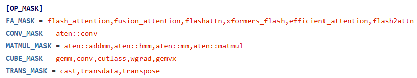

# 性能比对

## 1 简介

compare（性能比对）功能支持比较GPU与NPU之间、NPU与NPU之间的性能差异，通过对训练耗时和内存占用的比对分析，定位到具体劣化的算子，帮助用户提升性能调优的效率。工具将训练耗时拆分为计算、通信、调度三大维度，并针对计算和通信分别进行算子级别的比对；将训练占用的总内存，拆分成算子级别的内存占用进行比对。

**使用场景**

- 场景一：PyTorch训练工程从GPU迁移至NPU后出现性能劣化，通过工具分析出劣化点。

- 场景二：PyTorch或MindSpore训练工程在NPU上，不同版本之间存在性能差距，通过工具定位具体差异。

- 场景三：PyTorch训练工程从GPU迁移至MindSpore NPU后出现性能劣化，通过工具分析出劣化点。

## 2 快速上手

使用前请先完成msprof-analyze工具安装，具体请参见《[msprof-analyze工具安装指南](../getting_started/install_guide.md)》。

### 2.1 最简命令

```bash
msprof-analyze compare \
  -d ./ascend_pt \
  -bp ./gpu_trace.json \
  -o ./compare_output
```

命令中的三个核心路径含义如下：

| 路径 | 含义 | 示例 |
| --- | --- | --- |
| `-bp`或`--benchmark_profiling_path` | 基准性能数据路径，通常是GPU数据、优化前数据或旧版本数据。 | `./gpu_trace.json`、`./base_ascend_pt` |
| `-d`或`--profiling_path` | 待比对性能数据路径，通常是NPU数据、优化后数据或新版本数据。 | `./ascend_pt`、`./new_ascend_pt` |
| `-o`或`--output_path` | 比对结果输出目录。 | `./compare_output` |

执行完成后，工具会在输出目录中生成`performance_comparison_result_*.xlsx`，并在终端打印总体比对结果。

### 2.2 常用命令速查表

| 场景            | 命令示例                                                                                                               |
|---------------|--------------------------------------------------------------------------------------------------------------------|
| GPU vs NPU 比对 | `msprof-analyze compare -d ./ascend_pt -bp ./gpu_trace.json -o ./compare_output`                                   |
| NPU vs NPU 比对 | `msprof-analyze compare -d ./ascend_pt -bp ./base_ascend_pt -o ./compare_output`                                   |
| 只看总体性能        | `msprof-analyze compare -d ./ascend_pt -bp ./base_ascend_pt -o ./compare_output --enable_profiling_compare`        |
| 只看算子性能        | `msprof-analyze compare -d ./ascend_pt -bp ./base_ascend_pt -o ./compare_output --enable_operator_compare`         |
| 只看通信性能        | `msprof-analyze compare -d ./ascend_pt -bp ./base_ascend_pt -o ./compare_output --enable_communication_compare`    |
| 只看内存差异        | `msprof-analyze compare -d ./ascend_pt -bp ./base_ascend_pt -o ./compare_output --enable_memory_compare`           |
| 只看指定step      | `msprof-analyze compare -d ./ascend_pt -bp ./base_ascend_pt -o ./compare_output --base_step=1 --comparison_step=1` |
| 隐藏明细，只输出统计结果  | `msprof-analyze compare -d ./ascend_pt -bp ./base_ascend_pt -o ./compare_output --disable_details`                 |

若所有比对开关均不设置，工具默认开启全部支持的性能比对能力。若设置了任意比对开关，工具只执行已设置的比对能力。

### 2.3 结果解读

比对完成后，建议先打开`performance_comparison_result_*.xlsx`，按以下顺序阅读，先定界方向，再定位具体劣化点。

**第一步：看总体性能定方向**

先查看终端打印的总体性能字段和`OverallMetrics` Sheet，用于回答“性能差异主要来自哪里”。其中，`OverallMetrics` Sheet展示计算、通信、调度和E2E等耗时拆解；`Mem Usage`出现在终端总体性能打印中，且仅当采集到内存使用数据时显示。

| 指标 | 重点判断                                                                             |
| --- |----------------------------------------------------------------------------------|
| `Computing Time` | `OverallMetrics`中查看。判断计算流耗时是否增大。若增大，继续分析算子性能或kernel性能。                           |
| `Uncovered Communication Time` | `OverallMetrics`中查看。判断通信未掩盖耗时是否增大。若增大，继续分析通信性能。                                  |
| `Free Time` | `OverallMetrics`中查看。判断调度耗时是否增大。该值为E2E耗时减去算子耗时和通信不可掩盖耗时。                          |
| `E2E Time` | `OverallMetrics`中查看。判断总耗时差异。若出现`Not minimal profiling`，说明该时间存在性能膨胀，会影响通信和调度耗时判断。 |
| `Mem Usage` | 终端总体性能打印中查看。若增大，继续分析算子内存。                                                        |

判断路径如下：

- 当`Computing Time`耗时增大，分析**算子性能**。
- 当`Uncovered Communication Time`耗时增大，分析**通信性能**。若通信性能分析没有劣化的通信算子，代表通信与计算的并行度较差，继续进行NPU的集群性能分析。
- 当终端总体性能打印中的`Mem Usage`增大，分析**算子内存**。若没有明显占用较大的算子，则代表算子内存申请量没有差异，问题在于内存的释放（持有时间过久），可以使用TensorBoard或MindStudio insight继续进行NPU内存的分析。

**第二步：计算劣化看算子性能**

若`OverallMetrics`中计算耗时明显增大，优先查看以下Sheet：

| Sheet | 适用情况 | 阅读方式 |
| --- | --- | --- |
| `OperatorCompareStatistic` | 比对数据无Python Function，或关注算子粒度统计。 | 按`Diff Duration(ms)`逆序，找耗时差距TOP算子。 |
| `OperatorCompare` | 需要查看算子级明细。 | 搜索TOP算子，查看对应kernel详情。 |
| `ModuleCompareStatistic` | 双方数据都包含Python Function事件。 | 筛选`Operator Name`为`[ TOTAL ]`，按耗时差异定位模块。 |
| `ModuleCompare` | 需要结合调用栈定位代码位置。 | 查看劣化模块下的算子明细和调用栈。 |
| `KernelCompare`或`KernelTypeCompare` | NPU与NPU比对场景，需要进一步看kernel。 | 按kernel总耗时、平均耗时、调用次数定位差异。 |

**第三步：通信劣化看CommunicationCompare**

若`OverallMetrics`中`Uncovered Communication Time`增大，查看`CommunicationCompare`：

- 先看通信算子的summary信息：通信算子名称、调用总次数、通信算子总耗时、平均耗时、最大耗时和最小耗时。
- 再看无背景色的detail记录行：NPU场景下可查看该通信算子下的Task信息。
- 重点关注`Diff Ratio`。该值表示待比对通信算子的总耗时 / 基准通信算子的总耗时，红色代表劣化。

**第四步：内存劣化看MemoryCompareStatistic**

若终端总体性能打印中的`Mem Usage`增大，或需要分析算子级内存占用差异，优先查看以下Sheet：

| Sheet | 阅读方式 |
| --- | --- |
| `MemoryCompareStatistic` | 按`Diff Memory(MB)`逆序，找内存占用差距TOP算子。 |
| `MemoryCompare` | 搜索内存占用差距TOP算子，查看具体内存申请明细。 |

`Diff Ratio`表示待比对算子占用的总内存 / 基准算子占用的总内存，红色代表劣化。`Size(KB)`表示该算子占用的device内存大小，单位KB。

## 3 数据准备

### 3.1 PyTorch框架性能数据采集

使用本工具之前需要采集GPU或者NPU的性能数据，建议只采集一个step的性能数据，然后进行性能比对分析。

若采集了多个step，工具默认会比对所有可用性能数据，统计结果可能同时包含预热、稳定训练和偶发抖动阶段，影响E2E耗时、通信等待和算子耗时的判断。需要固定分析某个step时，请同时配置`--base_step`和`--comparison_step`，并确保两个step分别存在于基准数据和待比对数据中。

#### 3.1.1 GPU性能数据采集

通过PyTorch Profiler工具采集GPU的性能数据，参考链接：[torch.profiler](https://pytorch.org/docs/stable/profiler.html)。

采集样例代码参考一（推荐）：使用 schedule 控制采集时机

```Python
with torch.profiler.profile(
        profile_memory=True,  # 内存数据采集的开关
        record_shapes=True,  # 算子input shape信息采集的开关
        schedule=torch.profiler.schedule(wait=10, warmup=0, active=1, repeat=1),
        on_trace_ready=torch.profiler.tensorboard_trace_handler("./result_dir")
) as prof:
    for step in range(step_number):
        train_one_step()
        prof.step()
```

采集样例代码参考二：手动控制 start/stop

```Python
prof = torch.profiler.profile(
    profile_memory=True,  # 内存数据采集的开关
    record_shapes=True,  # 算子input shape信息采集的开关
    on_trace_ready=torch.profiler.tensorboard_trace_handler("./result_dir"))
for step in range(step_number):
    if step == 11:
        prof.start()
    train_one_step()
    if step == 11:
        prof.stop()
```

PyTorch Profiler采集结果数据目录结构如下：

```Python
|- pytorch_profiling
    |- *.pt.trace.json
```

#### 3.1.2 NPU性能数据采集

通过Ascend PyTorch Profiler工具采集NPU的性能数据，采集参数配置与GPU基本一致，只需将GPU的性能数据采集代码中torch.profiler替换成torch_npu.profiler，参考链接：《[Ascend PyTorch调优工具](https://gitcode.com/Ascend/pytorch/blob/v2.7.1/docs/zh/ascend_pytorch_profiler/ascend_pytorch_profiler_user_guide.md)》。

**采集结果目录结构**  
根据`export_type`参数设置的不同，工具会输出两种格式的结果目录：

export_type = Text

```bash
|- ascend_pytorch_profiling
    |- *_ascend_pt
        |- ASCEND_PROFILER_OUTPUT
            |- kernel_details.csv
            |- op_statistic.csv
            |- trace_view.json
        |- FRAMEWORK
        |- PROF_XXX
    |- *_ascend_pt
```

export_type = Db

```bash
|- ascend_pytorch_profiling
    |- *_ascend_pt
        |- ASCEND_PROFILER_OUTPUT
            |- analysis.db
            |- ascend_pytorch_profiler_{rank_id}.db
        |- FRAMEWORK
        |- PROF_XXX
    |- *_ascend_pt
```

> [!NOTE]
> 
> 格式选择说明：两种格式可选择任意一种进行性能比对。若同一目录中同时包含以上两类文件，则优先使用Db格式（export_type = Db）的结果进行比对。

### 3.2 MindSpore框架性能数据采集

当前MindSpore场景仅支持以下两种性能数据比对：  

1. MindSpore NPU环境与PyTorch GPU环境的性能数据比对； 
2. MindSpore训练工程在NPU上、不同版本之间的性能数据比对。

性能数据采集说明：使用MindSpore性能调试工具采集NPU性能数据时，建议只采集或只解析一个step的性能数据，参考链接：《[MindSpore调优工具](https://gitcode.com/Ascend/docs/blob/master/MindStudio/master/mindspore_profiler_user_guide.md)》。

采集结果目录结构：根据`export_type`参数设置的不同，工具会输出两种格式的结果目录：

方式一：export_type = Text

```bash
|- profiler/{rank-*}_{timestamps}_ascend_ms
   |- ASCEND_PROFILER_OUTPUT
      |- kernel_details.csv
      |- op_statistic.csv
      |- trace_view.json
```

方式二：export_type = Db

```bash
|- profiler/{rank-*}_{timestamps}_ascend_ms
   |- ASCEND_PROFILER_OUTPUT
      |- analysis.db
      |- ascend_mindspore_profiler_{rank_id}.db
```

> [!NOTE]
> 
> 两种格式可选择任意一种进行性能比对。若同一目录中同时包含以上两类文件，则优先使用Db格式（export_type = Db）的结果进行比对。

性能比对时需指定的目录层级：需将采集结果路径指定到以下任意一个层级：

- `profiler/{rank-*}_{timestamps}_ascend_ms`
- `profiler/{rank-*}_{timestamps}_ascend_ms/ASCEND_PROFILER_OUTPUT`

## 4 使能方式

性能比对工具将总体性能拆解为训练耗时和内存占用，其中训练耗时可拆分为算子（包括nn.Module）、通信、调度三个维度，打印输出总体指标，帮助用户定界劣化的方向。

性能比对工具支持使用**命令行**和**脚本**两种方式执行性能数据比对操作，这两种方式均支持**通用参数**和**算子性能比对特有参数**。

### 4.1 命令行方式

```bash
msprof-analyze compare -d <profiling_path> -bp <benchmark_profiling_path> --output_path=<output_path>
```

最小示例：

```bash
msprof-analyze compare \
  -d ./ascend_pt \
  -bp ./gpu_trace.json \
  -o ./compare_output
```

### 4.2 脚本方式

```bash
# 将msprof-analyze代码仓下载到本地，进入msprof-analyze代码仓目录下的compare_tools目录
cd msprof_analyze/compare_tools
# 执行最简比对命令
python performance_compare.py <benchmark_profiling_path> <profiling_path> --output_path=<output_path>
```

脚本方式中，第一个位置参数`<benchmark_profiling_path>`表示基准性能数据路径，第二个位置参数`<profiling_path>`表示待比对性能数据路径，与命令行方式中的`-bp`和`-d`含义一致。

## 5 参数说明

### 5.1 输入输出参数

| 参数 | 可选/必选 | 说明 | 典型取值 |
| --- | --- | --- | --- |
| `-bp`或`--benchmark_profiling_path` | 必选 | 基准性能数据路径，通常是GPU数据、优化前数据或旧版本数据。 | `./gpu_trace.json`、`./base_ascend_pt` |
| `-d`或`--profiling_path` | 必选 | 待比对性能数据路径，通常是NPU数据、优化后数据或新版本数据。 | `./ascend_pt`、`./new_ascend_pt` |
| `-o`或`--output_path` | 必选 | 比对结果输出目录。 | `./compare_output` |

### 5.2 比对范围控制

| 参数 | 可选/必选 | 说明 | torch_npu支持 | MindSpore支持 |
| --- | --- | --- | --- | --- |
| `--disable_details` | 可选 | 隐藏明细比对，只进行统计级比对。 | 是 | 是 |
| `--base_step` | 可选 | 基准性能数据step ID，配置后使用基准性能数据对应step的数据进行比对。为整数，需配置实际数据存在的step ID，默认未配置，比对所有性能数据，需要与`--comparison_step`同时配置。配置示例：`--base_step=1`。仅`--enable_profiling_compare`（仅Db数据）、`--enable_operator_compare`、`--enable_communication_compare`、`--enable_memory_compare`、`--enable_kernel_compare`或`--enable_api_compare`开启时，该参数配置生效。 | 是 | 是 |
| `--comparison_step` | 可选 | 比对性能数据step ID，配置后使用比对性能数据对应step的数据进行比对。为整数，需配置实际数据存在的step ID，默认未配置，比对所有性能数据，需要与`--base_step`同时配置。配置示例：`--comparison_step=1`。仅`--enable_profiling_compare`（仅Db数据）、`--enable_operator_compare`、`--enable_communication_compare`、`--enable_memory_compare`、`--enable_kernel_compare`或`--enable_api_compare`开启时，该参数配置生效。 | 是 | 是 |

### 5.3 比对能力开关

若所有比对开关**均不设置**，工具默认**开启全部**支持的性能比对能力。  
若只关注某类问题，可按需打开以下开关；只要设置了任意比对开关，工具就按照已设置的开关执行，示例如下：

```bash
# 配置 --enable_profiling_compare 参数，此时仅开启总体性能比对
msprof-analyze compare -d [profiling_path] -bp [基准性能数据文件所在路径] --output_path=./result_dir --enable_profiling_compare
```

| 参数 | 可选/必选 | 说明 | torch_npu支持 | MindSpore支持 |
| --- | --- | --- | --- | --- |
| `--enable_profiling_compare` | 可选 | 开启总体性能比对。 | 是 | 是 |
| `--enable_operator_compare` | 可选 | 开启算子性能比对。该开关较耗时，建议只采集一个step的性能数据。支持扩展参数请参见**5.4 算子比对高级参数**。 | 是 | 否 |
| `--enable_communication_compare` | 可选 | 开启通信性能比对。 | 是 | 是 |
| `--enable_memory_compare` | 可选 | 开启算子内存比对。该开关较耗时，建议只采集一个step的性能数据。 | 是 | 否 |
| `--enable_kernel_compare` | 可选 | 开启kernel性能比对。仅针对NPU与NPU比对的场景。支持扩展参数请参见**5.5 kernel比对高级参数**。 | 是 | 是 |
| `--enable_api_compare` | 可选 | 开启API性能比对。需要使用性能数据中的trace_view.json文件。 | 是 | 否 |

### 5.4 算子比对高级参数

`--enable_operator_compare`时支持。

| 参数 | 可选/必选 | 说明 |
| --- | --- | --- |
| `--gpu_flow_cat` | 可选 | 配置GPU trace中CPU侧算子与device kernel的连线标识，当GPU的Device Duration(us)均为0时设置。使用chrome://tracing打开GPU的json，右上角Flow events找到连线标识，将标识配置进该参数。使用示例：`--gpu_flow_cat=async_gpu`。 |
| `--use_input_shape` | 可选 | 开启算子精准匹配，默认关闭。使用示例：`--use_input_shape`。 |
| `--max_kernel_num` | 可选 | 设置CPU侧算子下发的最大kernel数量，当超过设定值时工具会自动往下找子算子，直至满足条件。默认仅比对最上层算子，粒度较粗；若想要更细粒度的算子比对，可设置该参数，参数值需大于3，最小可配置为4，参数值设置越小，比对粒度越细。使用示例：`--max_kernel_num=10`。 |
| `--op_name_map` | 可选 | 设置GPU与NPU等价的算子名称的映射关系，以字典形式存入。使用示例：`--op_name_map={'Optimizer.step#SGD.step':'Optimizer.step#NpuFusedSGD.step'}`。 |
| `--disable_module` | 可选 | 算子性能比对。当前配置该参数时，无论是否采集module信息，均进行算子级别的比对。 |

### 5.5 kernel比对高级参数

`--enable_kernel_compare`时支持。

| 参数 | 可选/必选 | 说明 |
| --- | --- | --- |
| `--use_kernel_type` | 可选 | kernel比对模式。配置该开关时，使用op_statistic.csv进行比对，输出简化结果并减少比对时间；不配置该开关时，默认使用kernel_details.csv进行比对，输出完整结果。使用示例：`--use_kernel_type`。 |

### 5.6 执行辅助参数

| 参数 | 可选/必选 | 说明 | torch_npu支持 | MindSpore支持 |
| --- | --- | --- | --- | --- |
| `--force` | 可选 | 强制执行compare。配置后可强制跳过如下情况：指定的目录、文件的用户属主不属于当前用户，忽略属主判断直接执行；csv文件大于5G、json文件大于10G、db文件大于8G，忽略文件过大判断直接执行。配置该参数表示开启强制执行，默认未配置表示关闭。 | 是 | 是 |
| `--debug` | 可选 | 工具执行报错时可打开此开关，日志将输出DEBUG级别信息，便于定位问题。配置该参数表示开启Debug，默认未配置表示关闭。 | 是 | 是 |
| `-h`、`-H`、`--help` | 可选 | 在需要查询当前命令附属子命令或相关参数时，给出帮助建议。 | 是 | 是 |

## 6 自定义比对算子

一般情况下compare功能按照默认配置的算子进行比对，若用户需要对特定算子的性能进行比对和分析，可以通过在[compare_config.ini](../../../msprof_analyze/compare_tools/compare_backend/compare_config/compare_config.ini)文件中配置需要比对的算子名的识别关键词，之后再执行比对操作（msprof-analyze compare），比对结果在结果文件performance_comparison_result_{timestamp}.xlsx中呈现。

配置算子名的识别关键词为算子名称中的一部分，代表只要算子名称中包含该关键词，那么该算子会进行比对。

配置格式如下，算子名识别关键词之间用逗号隔开且名称为英文全小写：



上图中为compare_config.ini文件当前的默认配置，即默认进行如上类型算子的性能比对。

其中FA_MASK、CONV_MASK、MATMUL_MASK为GPU和NPU共有的上层应用operator的识别关键词，CUBE_MASK为底层GPU kernel cube识别的关键词，TRANS_MASK为底层NPU转换类kernel识别的关键词。

比对结果分为打印输出和performance_comparison_result_{timestamp}.xlsx两种形式输出，其中打印输出为概要信息，xlsx文件保存详细结果。

## 7 输出结果文件详解

输出总体比对结果到执行终端中，详细的比对结果在`performance_comparison_result_*.xlsx`。`performance_comparison_result_*.xlsx`中可能包含的Sheet取决于比对开关、数据类型以及是否开启明细输出。

### 7.1 Sheet速查表

| Sheet | 对应能力 | 功能 |
| --- | --- | --- |
| OverallMetrics | 总体性能比对 | 展示计算、通信、调度、E2E等耗时拆解指标，用于判断性能差异主要来自哪里。内存使用`Mem Usage`不在该Sheet中输出，可能出现在终端总体性能打印中。 |
| OperatorCompareStatistic | 算子性能比对 | 以算子为粒度汇总耗时差异，适合按Diff Duration快速定位劣化算子。 |
| OperatorCompare | 算子性能比对 | 展示算子级明细，可查看算子对应的kernel详情。配置`--disable_details`时不输出。 |
| ModuleCompareStatistic | 算子性能比对 | 当双方数据都包含Python Function事件时，按模块汇总耗时差异，适合定位劣化模块。 |
| ModuleCompare | 算子性能比对 | 展示模块及模块下算子的明细，可结合调用栈定位代码位置。配置`--disable_details`时不输出。 |
| CommunicationCompare | 通信性能比对 | 展示通信算子的summary和detail信息，用于分析通信耗时、等待时间和传输耗时差异。 |
| MemoryCompareStatistic | 算子内存比对 | 以算子为粒度汇总内存占用差异，适合按Diff Memory定位内存增长点。 |
| MemoryCompare | 算子内存比对 | 展示算子内存申请明细。配置`--disable_details`时不输出。 |
| KernelCompare | kernel性能比对 | 未配置`--use_kernel_type`时输出，按Kernel Type和Input Shapes分组统计Kernel耗时差异。 |
| KernelTypeCompare | kernel性能比对 | 配置`--use_kernel_type`时输出，按Kernel Type和Core Type分组统计Kernel耗时差异。 |
| ApiCompare | API性能比对 | 按API名称统计Host侧调用耗时、自身耗时和调用次数差异。 |

### 7.2 OverallMetrics

总体性能用于回答“性能差异主要来自哪里”，建议优先查看计算、通信、空闲时间和E2E时间等指标。内存使用`Mem Usage`不在`OverallMetrics` Sheet中输出，可能出现在终端总体性能打印中。

总体性能比对结果在performance_comparison_result_*.xlsx中OverallMetrics的sheet页呈现，示例如下：


表头字段说明：

| 字段 | 说明 |
| --- | --- |
| Index | 指标。 |
| Duration(ms) | 执行耗时，单位ms。 |
| Duration Ratio | 执行耗时占E2E总耗时的比例。 |
| Number | 计算算子的数量。 |
| Diff Duration(ms) | 待比对数据Duration - 基准数据Duration，单位ms。 |
| Diff Ratio | 待比对数据Duration / 基准数据的Duration。当基准数据为0且待比对数据不为0时，显示为inf。 |

Index列完整字段说明：

| 字段                         |                                                |                                     | 说明                                                                                                                                                                                      |
| ---------------------------- | :--------------------------------------------- | ----------------------------------- |-----------------------------------------------------------------------------------------------------------------------------------------------------------------------------------------|
| Computing Time               |                                                |                                     | 计算流耗时，计算流所有event耗时总和。如果有多条并发计算，计算流耗时对重叠部分只会计算一次。<br>NPU场景下，拆分出Computing Time的二级字段Flash Attention、Conv等，要求使用export_type导出Text格式的文件时，Level等级为L1及以上；使用export_type导出DB格式的文件时，Level等级为L0及以上。 |
|                              | AllGatherMatmul                                |                                     | AllGatherMatmul算子。MC²算子，仅为示例。                                                                                                                                                           |
|                              |                                                | Computing                           | AllGatherMatmul算子的计算算子。                                                                                                                                                                 |
|                              |                                                | Communication                       | AllGatherMatmul算子的通信算子。                                                                                                                                                                 |
|                              | MatmulReduceScatter                            |                                     | MatmulReduceScatter算子。MC²算子，仅为示例。                                                                                                                                                       |
|                              |                                                | Computing                           | MatmulReduceScatter算子的计算算子。                                                                                                                                                             |
|                              |                                                | Communication                       | MatmulReduceScatter算子的通信算子。                                                                                                                                                             |
|                              | Flash Attention                                |                                     | Flash Attention算子。                                                                                                                                                                      |
|                              |                                                | Flash Attention (Forward) (Cube)    | Flash Attention前向算子下发的所有Cube类Kernel，一般为执行该算子核心计算的算子。                                                                                                                                    |
|                              |                                                | Flash Attention (Forward) (Vector)  | Flash Attention前向算子下发的所有Vector类Kernel，一般为插入的转换类算子，如TransData。                                                                                                                           |
|                              |                                                | Flash Attention (Backward) (Cube)   | Flash Attention反向算子下发的所有Cube类Kernel，一般为执行该算子核心计算的算子。                                                                                                                                    |
|                              |                                                | Flash Attention (Backward) (Vector) | Flash Attention反向算子下发的所有Vector类Kernel，一般为插入的转换类算子，如TransData。                                                                                                                           |
|                              | Conv                                           |                                     | Conv算子。                                                                                                                                                                                 |
|                              |                                                | Conv (Forward) (Cube)               | Conv前向算子下发的所有Cube类Kernel，一般为执行该算子核心计算的算子。                                                                                                                                               |
|                              |                                                | Conv (Forward)  (Vector)            | Conv前向算子下发的所有Vector类Kernel，一般为插入的转换类算子，如TransData。                                                                                                                                      |
|                              |                                                | Conv (Backward) (Cube)              | Conv反向算子下发的所有Cube类Kernel，一般为执行该算子核心计算的算子。                                                                                                                                               |
|                              |                                                | Conv (Backward) (Vector)            | Conv反向算子下发的所有Vector类Kernel，一般为插入的转换类算子，如TransData。                                                                                                                                      |
|                              | Matmul                                         |                                     | Matmul算子。                                                                                                                                                                               |
|                              |                                                | Matmul (Cube)                       | Matmul算子下发的所有Cube类Kernel，一般为执行该算子核心计算的算子。                                                                                                                                               |
|                              |                                                | Matmul (Vector)                     | Matmul算子下发的所有Vector类Kernel，一般为插入的转换类算子，如TransData。                                                                                                                                      |
|                              | Paged Attention                                |                                     | Paged Attention算子。                                                                                                                                                                      |
|                              | Vector                                         |                                     | Vector算子。                                                                                                                                                                               |
|                              |                                                | Vector (Trans)                      | 转换类Vector算子，主要包含Cast、Transpose、TransData算子。（仅针对NPU数据）                                                                                                                                   |
|                              |                                                | Vector ( No Trans)                  | 非转换类Vector算子。                                                                                                                                                                           |
|                              | Cube                                           |                                     | 未识别出Flash Attention、Conv和Matmul的Cube算子。                                                                                                                                                 |
|                              | SDMA (Tensor Move)                             |                                     | 拷贝类任务。                                                                                                                                                                                  |
|                              | Other                                          |                                     | AICPU、DSA等其他算子。                                                                                                                                                                         |
| Uncovered Communication Time |                                                |                                     | 通信未掩盖耗时，包含卡间等待时间。                                                                                                                                                                       |
|                              | {group_name}: Group group_name_* Communication |                                     | 通信域，格式为：`{通信域名}: Group group_name_* Communication`，*表示通信域的编号。                                                                                                                           |
|                              |                                                | Wait                                | 卡间同步等待耗时。（仅针对NPU数据）                                                                                                                                                                     |
|                              |                                                | Transmit                            | 通信传输耗时。                                                                                                                                                                                 |
|                              | Uncovered Communication Overlapped             |                                     | 两个通信域之间的未被计算掩盖的并行耗时。                                                                                                                                                                    |
|                              |                                                | {group_name} & {group_name}         | 两个通信域，比如tp & pp，表示tp域和pp域未被计算掩盖的并行耗时。                                                                                                                                                   |
| Free Time                    |                                                |                                     | 调度耗时 = E2E耗时 - 算子耗时 - 通信不可掩盖耗时。Free的定义为Device侧既不在通信也不在计算的时间，因此包含拷贝时间（SDMA Time）。                                                                                                        |
|                              | SDMA                                           |                                     | NPU为除Tensor Move外的拷贝类任务，GPU为所有拷贝类任务。                                                                                                                                                    |
|                              | Free                                           |                                     | 排除SDMA的空闲耗时。                                                                                                                                                                            |
| E2E Time                     |                                                |                                     | E2E总耗时，计算流端到端耗时。当存在Not minimal profiling时，表示该时间存在性能膨胀，会影响通信和调度耗时。                                                                                                                       |

可以采取最简性能数据采集的方式来减少E2E耗时的性能膨胀，示例代码如下：

```python
with torch_npu.profiler.profile(
        activities=[torch_npu.profiler.ProfilerActivity.NPU],
        schedule=torch_npu.profiler.schedule(wait=1, warmup=1, active=1, repeat=1, skip_first=10),
        on_trace_ready=torch_npu.profiler.tensorboard_trace_handler("./result"),
) as prof:
        for step in range(steps):
            train_one_step()
            prof.step()
```

activities配置仅采集NPU数据，不配置experimental_config参数以及其他可选开关。

终端打印的总体性能字段如下：

| 字段 | 说明 |
| --- | --- |
| Cube Time(Num) | Cube算子总耗时，Num表示计算的次数。 |
| Vector Time(Num) | Vector算子总耗时，Num表示计算的次数。 |
| Conv Time(Forward)(Num) | conv前向算子耗时，Num表示计算的次数。 |
| Conv Time(Backward)(Num) | conv反向算子耗时，Num表示计算的次数。 |
| Flash Attention Time(Forward)(Num) | Flash Attention算子前向耗时，Num表示计算的次数。 |
| Flash Attention Time(Backward)(Num) | Flash Attention算子反向耗时，Num表示计算的次数。 |
| Paged Attention Time(Num) | Paged Attention算子耗时，Num表示计算的次数。 |
| Lccl Time(Num) | Lccl算子耗时，Num表示计算的次数。 |
| Computing Time | 计算流耗时，计算流所有event耗时总和。如果有多条并发计算，计算流耗时对重叠部分只会计算一次。 |
| Mem Usage | 内存使用。该字段只可能出现在终端总体性能打印中，`OverallMetrics` Sheet不输出该字段。GPU上的内存使用可以使用nvidia-smi查看，NPU上的内存使用可以使用npu-smi查看，Profiling信息采集时打开profile_memory=True开关，mem usage显示的是memory_record里面的最大reserved值，一般来说是进程级内存。 |
| Uncovered Communication Time(Wait Time) | 通信未掩盖耗时。Wait Time为卡间等待时间（Wait Time仅NPU场景才会存在）。 |
| RDMA Bandwidth(GB/s) | RDMA带宽，单位GB/s。 |
| SDMA Bandwidth(GB/s) | SDMA带宽，单位GB/s。 |
| SDMA Time(Num) | 拷贝类任务耗时，Num表示计算的次数。 |
| Free Time | 调度耗时 = E2E耗时 - 算子耗时 - 通信不可掩盖耗时。Free的定义为Device侧既不在通信也不在计算的时间，因此包含拷贝时间（SDMA Time）。 |
| E2E Time(Not minimal profiling) | E2E总耗时，计算流端到端耗时。当存在Not minimal profiling时，表示该时间存在性能膨胀，会影响通信和调度耗时。 |
| Other Time | AICPU、DSA、TensorMove等其他算子耗时。 |

### 7.3 算子性能

#### 7.3.1 比对数据无Python Function

算子性能比对结果在performance_comparison_result_{timestamp}.xlsx中OperatorCompare和OperatorCompareStatistic的sheet页呈现。

- OperatorCompareStatistic：以算子为粒度的统计呈现，按照算子在device上的总耗时与基准算子的差距值（Diff Duration(ms)列）进行逆序。
- OperatorCompare：算子比对的明细展示，可以查看每一个算子对应的kernel详情。
- Diff Ratio：待比对算子在device上执行总耗时 / 基准算子在device上执行总耗时，红色代表劣化。
- Device Duration(us)：该算子下发到device上执行的所有kernel耗时的总和。

可通过以下方式找出性能劣化点：

1. 查看OperatorCompareStatistic页，找出耗时差距TOP的算子。
2. 查看OperatorCompare页，搜索耗时差距TOP的算子，查看具体执行的kernel耗时，寻找可优化点。

#### 7.3.2 比对数据有Python Function

算子性能比对结果在performance_comparison_result_*.xlsx中ModuleCompareStatistic、ModuleCompare的sheet页呈现。

当用户采集时开启with_stack开关，会上报python function事件，当比对的双方数据都存在python function的事件时，可进行模块级别的比对。

ModuleCompareStatistic字段说明：

| 字段 | 说明 |
| --- | --- |
| Module Class | Module名，如nn.Module: Linear。 |
| Module Level | Module的层级。 |
| Module Name | Module唯一标识名，如/ DynamicNet_0/ Linear_0。 |
| Operator Name | 框架侧算子名，如aten::add。字段为`[ TOTAL ]`代表该module的总体情况。 |
| Kernel Details | 算子详细信息，包括：算子名、task id、task type、input shape、执行耗时。 |
| Device Self Time(ms) | 该模块调用的算子（排除子模块）在device侧执行的总耗时，单位ms。 |
| Number | 该Module或算子被调用的次数。 |
| Device Total Time(ms) | 该模块调用的算子（包含子模块）在device侧执行的总耗时，单位ms。 |
| Device Total Time Diff(ms) | 待比对模块与基准模块的Device Total Time(ms)差值。 |
| Device Self Time Diff(ms) | 待比对模块与基准模块的Device Self Time(ms)差值。 |
| Diff Total Ratio | 待比对模块的Device Total Time(ms) / 基准模块的Device Total Time(ms)。 |
| Base Call Stack | 基准文件模块的调用栈。 |
| Comparison Call Stack | 比较文件模块的调用栈。 |

ModuleCompare字段说明：

| 字段 | 说明 |
| --- | --- |
| Module Class | Module名，如nn.Module: Linear。 |
| Module Level | Module的层级。 |
| Module Name | Module唯一标识名，如/ DynamicNet_0/ Linear_0。 |
| Operator Name | 框架侧算子名，如aten::add。字段为`[ TOTAL ]`代表该module的总体情况。 |
| Kernel Details | 算子详细信息，包括：算子名、task id、task type、input shape、执行耗时。 |
| Device Self Time(us) | 该模块调用的算子（排除子模块）在device侧执行的总耗时，单位us。 |
| Device Total Time(us) | 该模块调用的算子（包含子模块）在device侧执行的总耗时，单位us。 |
| Device Total Time Diff(us) | 待比对模块与基准模块的Device Total Time(us)差值。 |
| Device Self Time Diff(us) | 待比对模块与基准模块的Device Self Time(us)差值。 |
| Total Time Ratio | 待比对模块的Device Total Time(us) / 基准模块的Device Total Time(us)。 |
| Base Call Stack | 有劣化的模块或算子，基准文件模块的调用栈。 |
| Comparison Call Stack | 有劣化的模块或算子，比较文件模块的调用栈。 |

可通过以下方式找出性能劣化点：

1. 查看ModuleCompareStatistic页，找出耗时差距TOP的模块。筛选`Operator Name`字段为`[ TOTAL ]`，将模块总体情况按照`Device Self Time(ms)`字段逆序，可识别出耗时差距TOP的模块。恢复数据，可按照`Order Id`字段升序。
2. 查看ModuleCompare页，查找耗时差距TOP模块下的劣化算子。
3. 通过调用栈找到对应的代码行。

### 7.4 模块性能

模块性能属于算子性能比对的一部分，当比对双方数据都存在python function事件时输出`ModuleCompareStatistic`和`ModuleCompare`。建议先通过`ModuleCompareStatistic`定位劣化模块，再到`ModuleCompare`查看该模块下的算子明细和调用栈。

### 7.5 通信性能

通信性能比对结果在performance_comparison_result_*.xlsx中CommunicationCompare的sheet页呈现。

- 第二行表头：通信算子的summary信息，包括通信算子名称、调用总次数、通信算子总耗时（单位：us）、通信算子平均耗时（单位：us）、通信算子最大耗时（单位：us）、通信算子最小耗时（单位：us）。
- 无背景色的记录行：通信算子的detail信息，仅支持NPU，包含了该通信算子下的所有Task信息，包括Task名称、Task调用次数、Task总耗时（单位：us）、Task平均耗时（单位：us）、Task最大耗时（单位：us）、Task最小耗时（单位：us）。
- Diff Ratio：待比对通信算子的总耗时 / 基准通信算子的总耗时，红色代表劣化。

### 7.6 内存

算子内存比对结果在performance_comparison_result_*.xlsx中MemoryCompare和MemoryCompareStatistic的sheet页呈现。

- MemoryCompareStatistic：以算子为粒度的统计呈现，按照算子占用的总内存与基准算子的差距值（Diff Memory(MB)）进行逆序。
- MemoryCompare：算子内存比对的明细展示，可以查看每一个算子申请内存的详情。
- Diff Ratio：待比对算子占用的总内存 / 基准算子占用的总内存，红色代表劣化。
- Size(KB)：该算子占用的device内存大小，单位KB。

可通过以下方式找出性能劣化点：

1. 查看MemoryCompareStatistic页，找出内存占用差距TOP的算子。
2. 查看MemoryCompare页，搜索内存占用差距TOP的算子，查看具体占用的子算子。

### 7.7 kernel性能

仅针对NPU与NPU比对的场景。

未配置`--use_kernel_type`开关时，kernel比对结果在performance_comparison_result_*.xlsx中KernelCompare页呈现。

按照Kernel Type（Kernel类型）和Input Shapes（输入Shape）分组统计，统计信息包括：

- Total Duration(us)：总耗时，单位us。
- Avg Duration(us)：平均耗时，单位us。
- Max Duration(us)：最大耗时，单位us。
- Min Duration(us)：最小耗时，单位us。
- Calls：调用次数。

配置`--use_kernel_type`开关时，kernel比对结果在performance_comparison_result_*.xlsx中KernelTypeCompare页呈现。

按照Kernel Type（Kernel类型）和Core Type（AI核类型）分组统计，统计信息包括：

- Total Duration(us)：总耗时，单位us。
- Avg Duration(us)：平均耗时，单位us。
- Max Duration(us)：最大耗时，单位us。
- Min Duration(us)：最小耗时，单位us。
- Calls：调用次数。

### 7.8 API性能

API比对结果在performance_comparison_result_*.xlsx中ApiCompare页呈现。

按照api name（API名称）组统计，统计信息包括：

- Total Duration(ms)：总耗时，单位ms。
- Self Time(ms)：Self耗时（排除掉子event），单位ms。
- Avg Duration(ms)：平均耗时，单位ms。
- Calls：调用次数。

## 8 常见问题

**Q：只想快速知道性能差异来自哪里，应该看哪个结果？**  
A：先看终端总体性能打印和`OverallMetrics`。`OverallMetrics`会把差异拆成计算、通信、调度和E2E等耗时方向；内存使用`Mem Usage`可能出现在终端总体性能打印中，算子级内存差异看`MemoryCompareStatistic`和`MemoryCompare`。

**Q：采集了多个step，为什么结果不稳定？**  
A：工具默认会比对所有可用性能数据，可能同时包含预热、稳定训练和偶发抖动阶段。建议只采集一个step；如需固定分析某个step，请同时配置`--base_step`和`--comparison_step`。

**Q：Text格式和Db格式都能比对吗？**  
A：两种格式可选择任意一种进行性能比对。若同一目录中同时包含Text和Db格式文件，则优先使用Db格式结果进行比对。

**Q：为什么设置了某个`--enable_*`开关后，其他结果没有输出？**  
A：只要设置了任意比对开关，工具就按照已设置的开关执行。若所有比对开关均不设置，工具默认开启全部支持的性能比对能力。

**Q：为什么没有明细Sheet？**  
A：如果配置了`--disable_details`，工具会隐藏明细比对，只进行统计级比对，因此`OperatorCompare`、`ModuleCompare`、`MemoryCompare`等明细Sheet可能不会输出。

**Q：GPU数据里Device Duration(us)都是0怎么办？**  
A：可配置`--gpu_flow_cat`。使用chrome://tracing打开GPU的json，在右上角Flow events找到CPU侧算子与device kernel的连线标识，并将该标识配置进参数。

**Q：NPU与NPU比对时kernel结果太大或比对较慢怎么办？**  
A：可配置`--use_kernel_type`，使用op_statistic.csv进行比对，输出简化结果并减少比对时间。
