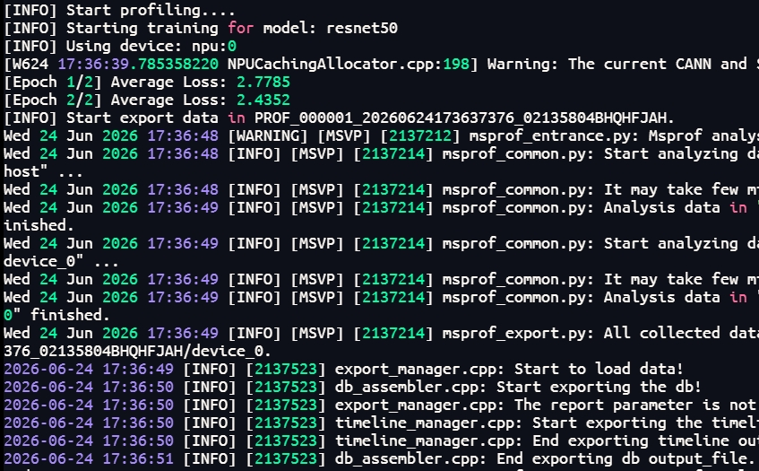
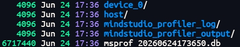

# msProf Use Case: Performance Analysis of a ResNet50 Inference Model

## 1. Use Case Name

**Collecting and Analyzing Profile Data of a ResNet50 Inference Model on an Ascend NPU Using the msProf Command-Line Tool**

This use case uses a ResNet50 inference model as an example to demonstrate how to use the MindStudio Profiler (msProf) provided by Huawei Ascend MindStudio to collect and parse profile data and identify performance bottlenecks.

### 1.1 Prerequisites

#### 1.1.1 Environment Requirements

* The **CANN Toolkit development package** and **ops package** are installed.
* The **MindStudio Insight** visualization and analysis tool is installed.

#### 1.1.2 Configuring Environment Variables

Run the following command to configure the CANN environment variables (using CANN 9.1.0 as an example):

```bash
source /usr/local/Ascend/cann/set_env.sh
```

#### 1.1.3 Verifying Tool Availability

Run the following command to verify that the msProf tool is available and check its version:

```bash
msprof --version
```

Also verify the NPU device status to ensure that the device is available:

```bash
npu-smi info
```

#### 1.1.4 Preparing the ResNet50 Inference Script

Ensure that the `resnet50_infer.py` inference script can run properly on an Ascend NPU. The script must include model loading, data preprocessing, and inference execution logic.

### 1.2 Using the Tool

#### 1.2.1 Collecting Profile Data

**(1) Run the profile data collection command**

Use the msProf command-line tool to collect profile data of the ResNet50 inference model:

```bash
msprof --output="./prof_data" --task-time=l1 python3 resnet50_infer.py
```



**Command-line options**

| Option | Description |
| --- | --- |
| `--output` | Specifies the directory for storing profile data. The default is the directory where the AI task file is located. |
| `--task-time` | Specifies the data collection level. The default is level `l0`. |

**Examples of other common commands:**

```bash
# Pass a Python script and its parameters
msprof --output=/home/projects/output python3 /home/projects/MyApp/out/sample_run.py param1 param2

# Pass a binary executable
msprof --output=/home/projects/output /home/projects/MyApp/out/main

# Pass a binary executable and its parameters
msprof --output=/home/projects/output /home/projects/MyApp/out/main parameter1 parameter2

# Pass a shell script and its parameters
msprof --output=/home/projects/output /home/projects/MyApp/out/sample_run.sh param1 param2
```

#### 1.2.2 Parsing Profile Data

After data collection is complete, run the following command to parse the profile data and generate a report for analysis:

```bash
msprof --export=on --output="./prof_data"
```

After parsing, a `PROF_XXX` directory (or an `OPPROF` directory, depending on the collection mode) is generated in the directory specified by `--output`. The directory contains the automatically parsed profile data.

#### 1.2.3 Viewing Profile Data

**(1) View the generated file structure**

```bash
ls -la ./prof_data/PROF_XXX/
```



For details about the formats and deliverables of the collected and parsed data, see [Profile Data File Reference](../user_guide/profile_data_file_references.md).

**(2) Analyze profile data using MindStudio Insight**

Navigate to the `PROF_XXX/mindstudio_profiler_output` directory and import the profile data into MindStudio Insight for visual analysis. MindStudio Insight provides various data visualization views, including the timeline, communication analysis, and computation duration, to help users quickly identify performance bottlenecks.
