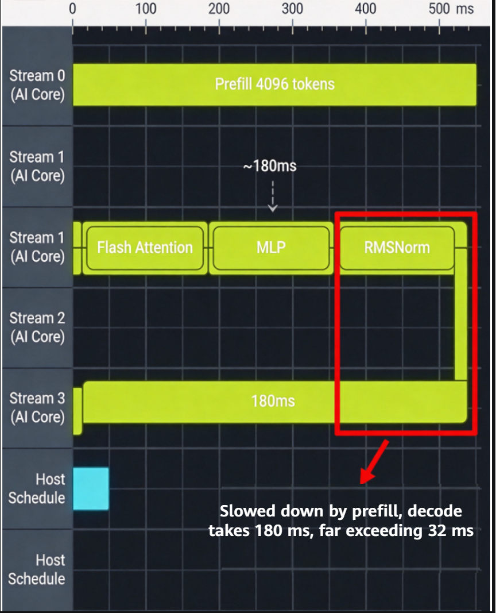
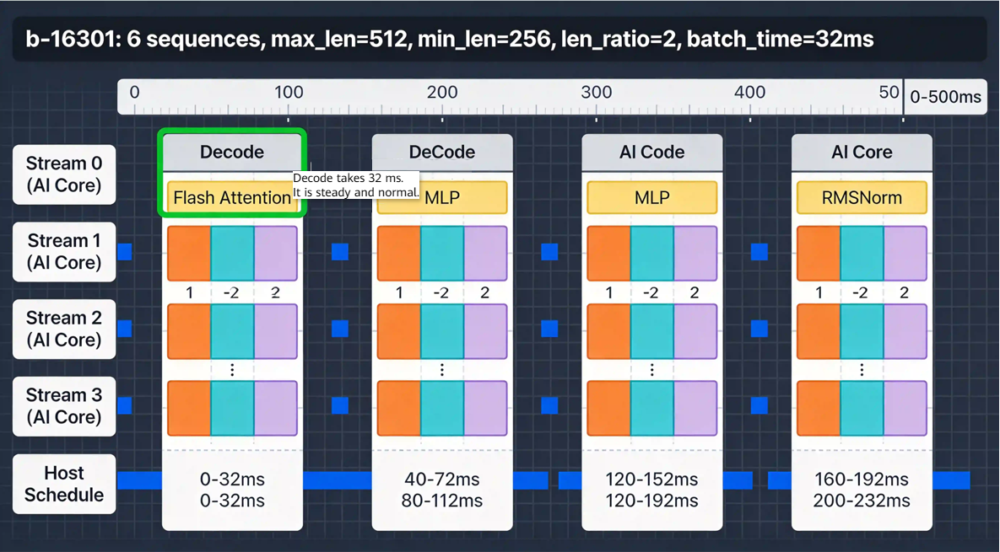

# Request Length Imbalance Within the Same Batch

## Background

A customer deployed an inference service based on MindIE-LLM for LLaMA2-70B on an Ascend A2 cluster. After deployment, stress testing showed that at a fixed concurrency level (QPS = 20), the serving throughput was only about **55%** of the expected value. 99th-percentile (P99) time to first token (TTFT) reached **820 ms** (SLA target: **300 ms**), and P99 time per output token (TPOT) reached **85 ms** (SLA target: **30 ms**). However, `npu-smi info` showed that the average NPU utilization (AICore) was **78%**, while AIPower was normal and the temperature did not trigger frequency throttling. On the surface, the hardware did not appear to be fully utilized, yet the service was slow. This is a typical serving-layer scheduling issue.

Further stress testing produced the following results.

| Concurrency | Theoretical Throughput (tokens/s) | Measured Throughput (tokens/s) | Throughput Achievement Rate | P99 TTFT (ms) | P99 TPOT (ms) |
| ----------- | --------------------------------- | ------------------------------ | --------------------------- | ------------- | ------------- |
| 10          | 1200                              | 980                            | 81.7%                       | 210           | 28            |
| 20          | 2400                              | 1320                           | **55.0%**                   | **820**       | **85**        |
| 40          | 4800                              | 2280                           | 47.5%                       | 1850          | 142           |
| 80          | 9600                              | 3920                           | 40.8%                       | OOM/timeout   | OOM/timeout   |

The throughput achievement rate **decreases significantly** as concurrency increases, which appears inconsistent with the observation that the hardware is not fully utilized. This may suggest a **structural bottleneck in the serving-layer scheduler**.

---

## Symptoms

In Continuous Batching mode of the serving-layer scheduler, a long request that has just completed prefill is mixed into the same decode batch with several short requests that are already in the decode stage. The execution time of a decode step is no longer determined primarily by the average length of the current batch, but is instead dominated by the longest request undergoing prefill. As a result:

* **Short requests are slowed down:** A short request that would normally generate one token in approximately 25 ms may have to wait 80–100 ms because it is blocked by the long request prefill, causing TPOT to increase by 3–4 times.
* **Decode step duration shows periodic spikes:** On the timeline, decode operator duration fluctuates in a "short-long-short-long" sawtooth pattern.
* **AICore utilization is "artificially high":** The NPU remains busy computing, particularly during the compute-intensive prefill stage, but the computation does not translate into effective token output.
* **KV cache allocation fluctuates:** When a long request enters the prefill stage, the framework needs to urgently allocate a large amount of KV cache, causing the scheduler to stall and delaying subsequent requests from entering the queue.

**Core contradiction:** Although the 78% hardware utilization appears relatively high, the **effective token output per unit of time** (output tokens/s) is far below the expected level.

---

## Troubleshooting Process

First, use msServiceProfiler to collect the end-to-end serving trace and obtain the raw request, batch, and KV cache data. Then, import the data into MindStudio Insight. Use the **Summary** page to identify statistical anomalies in key metrics, such as throughput, latency, and batch-length distribution, and then use the **Timeline** page to compare representative "bad batches" with "good batches." This makes it possible to quickly identify the root cause: **prefill is slowing down decode**.

### Step 1: Collecting End-to-End Serving Data Using msServiceProfiler

**Purpose:** Collect request-level, batch-level, and KV cache-level data to establish an end-to-end timeline and provide the data source for subsequent visualization in MindStudio Insight.

**Configuration file** (`/home/user/mindie/ms_service_profiler_config.json`):

```json
{
    "enable": 1,
    "prof_dir": "/home/user/mindie/prof_data",
    "acl_task_time": 1,
    "l2_cache": 0,
    "data_frame": 1
}
```

**Configure environment variables and start the MindIE Service:**

```bash
export SERVICE_PROF_CONFIG_PATH="/home/user/mindie/ms_service_profiler_config.json"
bash /usr/local/Ascend/mindie/latest/scripts/start.sh \
    --model-path /data/llama2-70b-fp16 \
    --tensor-parallel-size 4 \
    --max-batch-size 64 \
    --max-prefill-tokens 8192
```

**Disable data collection after 60 seconds** (to limit the amount of collected data):

```json
{
    "enable": 0,
    "prof_dir": "/home/user/mindie/prof_data"
}
```

**Parse the data using the `parse` subcommand:**

```bash
pip install -U msserviceprofiler
python3 -m ms_service_profiler.parse \
    --input-path=/home/user/mindie/prof_data \
    --output-path=/home/user/mindie/prof_parsed
```

**Output files:**

* `prof_parsed/analysis.db`: an SQLite database that can be directly imported into MindStudio Insight.
* `prof_parsed/rank*/request_*.csv`: request-level data for each rank.
* `prof_parsed/rank*/batch_*.csv`: batch-level data.
* `prof_parsed/rank*/kvcache_*.csv`: KV cache data.

---

### Step 2: Identifying the Root Cause Using Summary and Timeline in MindStudio Insight

Start MindStudio Insight and import `analysis.db`.

#### 2.1 Viewing Macro Metrics on the Summary Page

Open the **Summary** page and focus on the following three views:

1. **End-to-end performance line chart:** Shows TTFT, TPOT, and throughput over time, making the "periodic spikes" visible.
2. **Batch statistics:** Shows the distribution of `seq_cnt`, `max_len`, `min_len`, and `batch_time` for each batch.
3. **Request length distribution:** Shows a histogram of `prompt_len` to confirm that the long-tail distribution is genuine rather than caused by an abnormal configuration.

**Key observation:** The **Summary** page clearly shows a strong positive correlation between **batch duration (`batch_time`) and the length ratio (`len_ratio`) within a batch**. Most batches have a `batch_time` of less than 50 ms, while a small number of batches spike to 150–180 ms. These outliers correspond precisely to batches with a length ratio greater than 16.

#### 2.2 Comparing Representative Batches on the Timeline

Open the **Timeline** page and first select two representative batches from the batch list:

* **Bad batch: b-15892** (`seq_cnt` = 8, `max_len` = 4096, `min_len` = 64, **`len_ratio` = 64**)
* **Good batch: b-16301** (`seq_cnt` = 6, `max_len` = 512, `min_len` = 256, **`len_ratio` = 2**)

Zoom in on an approximately 500 ms window for each of the two batches to compare them.

**Expected observation** (**Figure 1: Bad batch b-15892 timeline**)

<div align="center"></div>

* All eight sequences are in the same decode step: one long request (`prompt` = `4096`) is undergoing prefill, represented by a long yellow-green bar spanning approximately 140 ms, while the other seven short requests are stalled.
* The operator bars for the entire decode step are **extended to approximately 180 ms**, with operators such as `FlashAttention`, `MLP`, and `RMSNorm` appearing almost continuously from one to the next.
* None of the decode steps falls within the normal 30 ms range.
* There are no clear boundaries between operator bars, resulting in a "flattened" appearance.

**Comparison** (**Figure 2: Good batch b-16301 timeline**)

<div align="center"></div>

* The six sequences have similar lengths (256–512 tokens), are all in the decode stage, and are not affected by prefill.
* Each decode step takes approximately **32 ms**, with clear boundaries between operator bars.
* Small gaps are visible between operators, representing host scheduling overhead and producing a regular, "healthy" rhythm.
* Natural intervals also exist between decode steps because the batch is waiting for the next round of requests or KV cache allocation.

---

## Root Cause

**Root Cause Type:** Framework adaptation issue. The scheduler in MindIE-LLM 1.0.RC2 does not sufficiently bucket or sort requests by length.

## Methodology Summary

1. **Step 1: Collect and parse profile data using msServiceProfiler.**
   * Write the configuration (`enable=1`, `acl_task_time=1`, `data_frame=1`) → start the service → collect service traffic data for 60 seconds → stop collection → parse the data using `ms_service_profiler.parse`.
   * The `analysis.db` file is the data source for all subsequent analysis.

2. **Step 2: Perform macro- and micro-level comparisons in MindStudio Insight.**
   * **Summary** page: First check the `batch_time` distribution, identify outliers (batches with `batch_time` > 100 ms), and examine the `len_ratio` distribution to examine the correlation between the two metrics.
   * **Timeline** page: Select a representative outlier batch (a batch with `len_ratio` > 16), then select a normal batch (`len_ratio` < 4) for **direct comparison**.
   * Typical characteristics of a bad batch: one extremely long prefill request dominates the entire batch, all decode steps are extended to approximately 180 ms, and operator bars run continuously without clear boundaries.
   * Typical characteristics of a good batch: decode steps maintain a stable rhythm (approximately 32 ms per step), operator bars have clear boundaries, and host scheduling follows a regular pattern.
