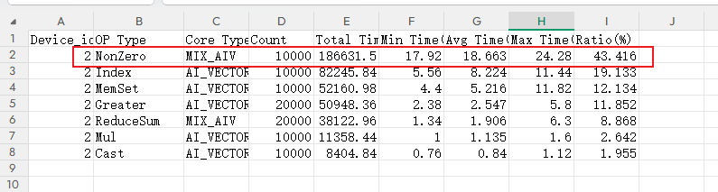
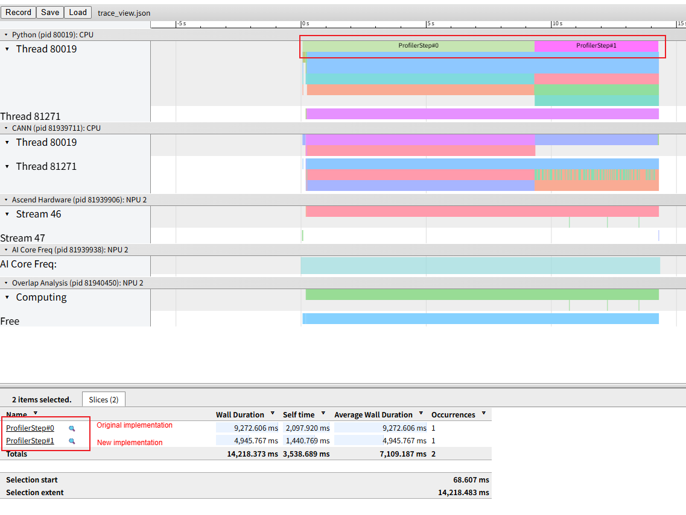

# 1. Background

During NPU workload execution, the execution time does not meet expectations. Profile data collection and analysis show that some operators have long execution time and require optimization.

# 2. Source

Performance profiling.

# 3. Symptoms

Open `msprof.json` or `trace_view.json` in Insight. Some operators may have long execution time. Open `op_statistic.csv` and check the corresponding operators to confirm that their performance does not meet expectations due to long execution time, indicating potential performance gains from optimization.

As shown in the following figure, the `nonzero` operator accounts for a large proportion of the execution time.



# 4. Troubleshooting Process

Similar optimization approaches can be divided into two categories:

1. **Operator-specific optimization**: Check the operator implementation to determine whether there is room for optimization. You may need to implement the required operator capabilities yourself or contact the relevant engineers for specific optimization guidance.

2. **Operator or operation replacement**: Replace the current operator or operation with an equivalent alternative that has better NPU affinity. This section provides a brief introduction to this approach.

For this issue, an existing "`nonzero` operator replacement" case is available. We refer to the official documentation and create a corresponding use case for a simple test.

```python
def nonzero_ori():
    shape = (1024, )
    mask = torch.randint(-1, 2, shape).npu()
    gt_inds = torch.randint(-1, 2, shape).npu()
    tensor_a = torch.ones(shape).float().npu()
    mask_inds = torch.nonzero(gt_inds > 0, as_tuple=False).squeeze(1)
    tensor_sum = tensor_a[mask_inds].sum()

def nonzero_new():
    shape = (1024, )
    mask = torch.randint(-1, 2, shape).npu()
    gt_inds = torch.randint(-1, 2, shape).npu()
    tensor_a = torch.ones(shape).float().npu()

    # --- Optimization: Completely eliminate nonzero ---
    # Directly generate a 0/1 mask (float) instead of extracting indices.
    # (gt_inds > 0) generates a BoolTensor, and .float() converts it to 0.0 and 1.0.
    float_mask = (gt_inds > 0).float()

    # Use arithmetic multiplication to perform the summation
    # tensor_a[mask_inds].sum() is mathematically equivalent to (tensor_a * float_mask).sum()
    tensor_sum = (tensor_a * float_mask).sum()


def run():
    for _ in range(10000):
        nonzero_ori()
    torch_npu.npu.synchronize()

    for _ in range(10000):
        nonzero_new()
    torch_npu.npu.synchronize()

```

The following figure shows the corresponding timeline. The new implementation demonstrates a performance gain.



# 5. Root Cause

The `nonzero` operator is a commonly used indexing operator in deep learning frameworks. Its core function is to return the coordinate indices of nonzero elements in the input tensor in row-major order. It is a typical memory-bound operation and is not well suited to the Ascend Da Vinci architecture. Therefore, the key replacement strategy is to avoid a large number of memory accesses.

# 6. Methodology Summary

1. Use visualization tools to identify operators that require optimization from perspectives such as the timeline and operator statistics tables.

2. Analyze the workload behavior of the operator and, taking the Ascend architecture into account, transform the operation into a more NPU-friendly alternative to improve performance.

# 7. Suggestions for Tool Improvements

None
