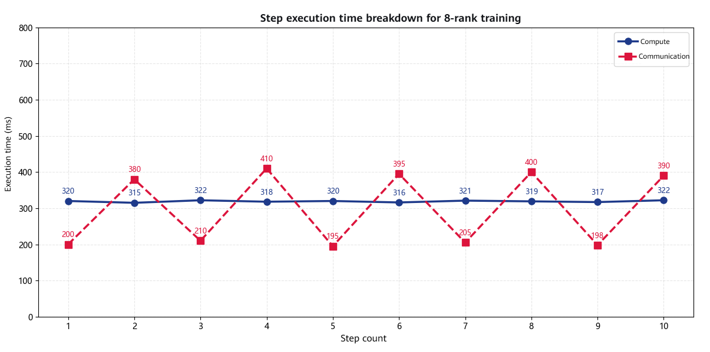
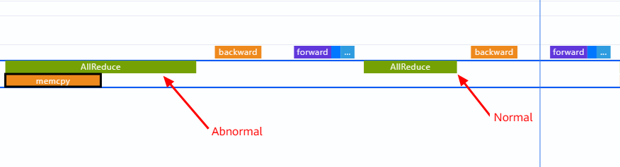
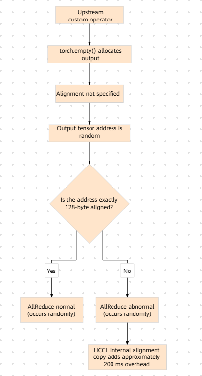

# Performance Degradation Caused by Misaligned Communication Addresses

## Background

In a foundation-model training scenario, distributed training is performed on 8 Ascend 910B NPUs, with approximately 70B model parameters. During training, the execution time of a single step is much longer than expected. A communication bottleneck is suspected, and profiling is required to identify the root cause.

## Symptoms

The issue can be reproduced consistently. During 8-rank training, communication accounts for more than 40% of the execution time of a single step, and the execution time of the `AllReduce` operator fluctuates significantly. In some steps, communication takes 2 to 3 times as long as in others. Single-rank inference performs normally, ruling out a computation bottleneck.

<div align="center"></div>
<div align="center"><b>Figure 1: Step execution time breakdown for 8-rank training (compute vs. communication)</b></div>

> Compute time remains stable at approximately 320 ms, while communication time fluctuates significantly between 195 ms and 410 ms, indicating an anomaly in the communication path.

## Troubleshooting Process

### 1 Collecting Profile Data to Confirm the Communication Bottleneck

Use `torch_npu.profiler` to collect profile data for a complete training step and confirm the proportion of communication time and the specific operators involved.

**Collection configuration**

```python
with torch_npu.profiler.profile(
    activities=[torch_npu.profiler.ProfilerActivity.CPU, torch_npu.profiler.ProfilerActivity.NPU],
    schedule=torch_npu.profiler.schedule(wait=1, warmup=1, active=5, repeat=1),
    on_trace_ready=torch_npu.profiler.tensorboard_trace_handler(output_dir),
    profile_level=torch_npu.profiler.ProfilerLevel.Level1,
    with_stack=True,
):
    ...
```

**Parameters**

- `profile_level`: Specify `ProfilerLevel.Level1` to collect complete data for HCCL communication operators, including communication time, communication volume, and fine-grained information about internal operator subtasks (such as `memcpy`). The default `Level0` collects only computation operators and does not include communication details.
- `with_stack=True`: Records call stacks to facilitate tracing the upstream source of misaligned tensors.
- `schedule`: Ensure that `active` covers a sufficient number of steps. In this case, it needs to cover multiple steps to compare `AllReduce` execution time between normal and abnormal steps.

**Analysis results**

The timeline shows two distinctly different execution patterns for the `AllReduce` operator:

- **Pattern A (normal)**: `AllReduce` takes approximately 200 ms, with collective communication initiated directly inside HCCL.
- **Pattern B (abnormal)**: `AllReduce` takes approximately 400 ms, with an additional `memcpy` operation inside HCCL.

<div align="center"></div>
<div align="center"><b>Figure 2: Timeline comparison of the two AllReduce patterns</b></div>

> Pattern B contains an additional `memcpy` operation compared with Pattern A, adding approximately 200 ms. The address or size of the input tensor may not meet HCCL alignment requirements, causing the library to perform an alignment copy first.

### 2 Confirming Address Misalignment

The additional `memcpy` observed in the Step 1 timeline is itself a typical indication of address misalignment. The HCCL communication library requires input data to be aligned to 128 bytes. When the data is not aligned, HCCL automatically performs an alignment copy internally. In the timeline, this operation appears as an additional `memcpy` within the `AllReduce` operator. In normal steps, the memory allocation happens to be aligned, so the `AllReduce` operator contains only collective communication and no `memcpy`.

### 3 Tracing the Source of the Misaligned Tensor

After confirming the address misalignment, trace the upstream operator that produces the misaligned tensor. `with_stack=True` was enabled in the collection configuration in Step 1, so each operator event in the timeline contains a call stack. In `chrome://tracing`, click the `AllReduce` operator in Pattern B to view its complete call chain:

```text
AllReduce (hccl)
  └─ custom_attention_forward (python)
       └─ custom_attention_cuda (c++)
            └─ torch.empty([batch, heads, seq_len, dim])  ← Alignment not specified
```

The call stack shows that the input tensor for this `AllReduce` is allocated by `torch.empty()` inside the `custom_attention_forward` operator. A code comparison confirms that torch.empty() does not explicitly ensure the required 128-byte memory alignment, causing the allocated memory address to be non-deterministically aligned and, in some cases, fail to meet the 128-byte alignment requirement.

<div align="center"></div>
<div align="center"><b>Figure 3: Tracing the upstream source of the misaligned tensor</b></div>

> Because whether the memory address returned by `torch.empty()` is aligned to 128 bytes depends on the current state of the memory allocator, the issue manifests as non-deterministic behavior: each allocation may produce a different result, and the `AllReduce` execution time fluctuates accordingly.

## Root Cause

When the custom operator uses `torch.empty()` to allocate output tensors without specifying `memory_format`, some starting addresses fail to meet the 128-byte HCCL alignment requirement. Consequently, HCCL automatically performs an alignment copy internally, adding approximately 200 ms of overhead.

This is a framework adaptation issue. The user did not consider the alignment constraint imposed by the HCCL communication library on input data.

## Conclusion

1. The HCCL communication library requires input tensor addresses to be aligned to 128 bytes. When this requirement is not met, HCCL automatically performs an alignment copy internally, adding approximately 200 ms of overhead.
2. An additional `memcpy` operation within an `AllReduce` operator in the profiling timeline is a typical indication of misaligned communication addresses and can serve as a troubleshooting signal.
3. Alignment issues manifest as non-deterministic behavior: the same operator may behave differently depending on the state of the memory allocator, unlike a stable performance bottleneck.
4. **Resolution**: Ensure that the tensor passed to the communication operation satisfies the required address alignment, either by using an alignment-guaranteed allocation method or by explicitly handling alignment before communication.

```python
# Ensure alignment before communication
if tensor.data_ptr() % 128 != 0:
    tensor = tensor.contiguous()
```

## Methodology Summary

1. When communication accounts for a high proportion of execution time, first use profiling to determine whether the issue is bandwidth-related or caused by additional overhead inside an operator.
2. If the `AllReduce` execution time fluctuates significantly and an additional `memcpy` operation is present in the timeline, prioritize checking whether the tensor address is aligned.
3. Trace upward through the call stack to the upstream operator that produces the tensor and check how its memory is allocated.
4. Alignment issues typically manifest as non-deterministic behavior: the same code may behave differently depending on the state of the memory allocator.

## Suggestions for Tool Improvements

- In the profiling timeline, directly indicate the tensor address alignment status on communication operators such as `AllReduce` to make such issues easier to identify.
- Add automated diagnostic capabilities for HCCL communication alignment checks and flag misaligned communication operators in the collected data.
- Add explicit markers for `memcpy` operations identified within `AllReduce` operators to distinguish them from ordinary memory copy operations.
