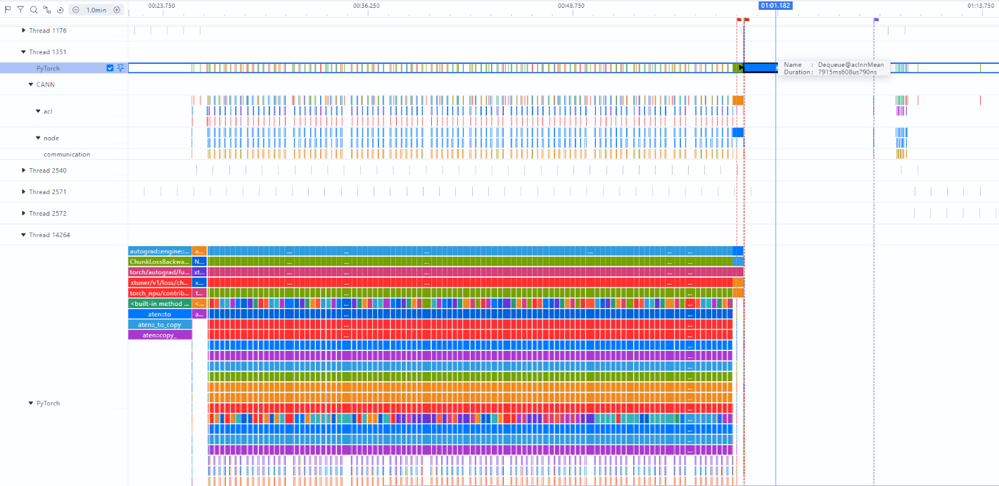
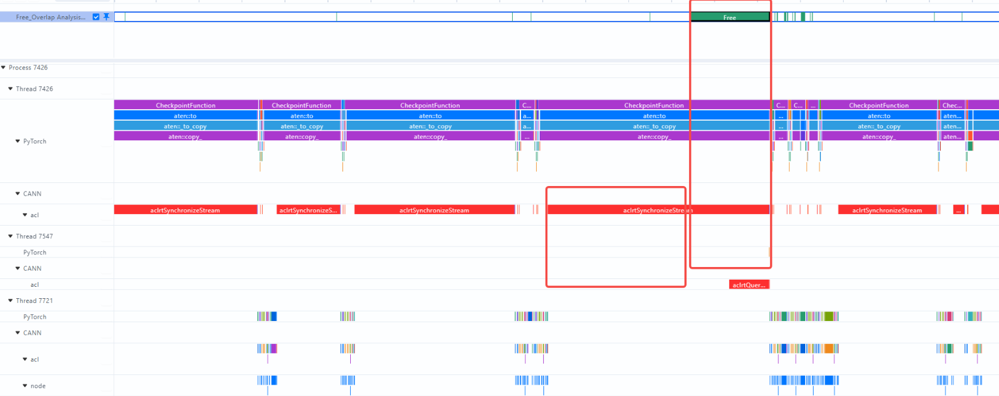
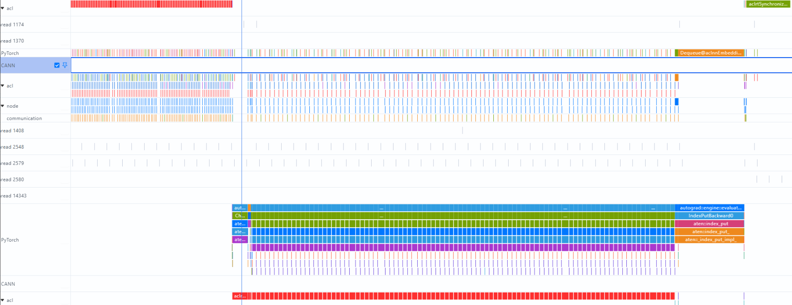
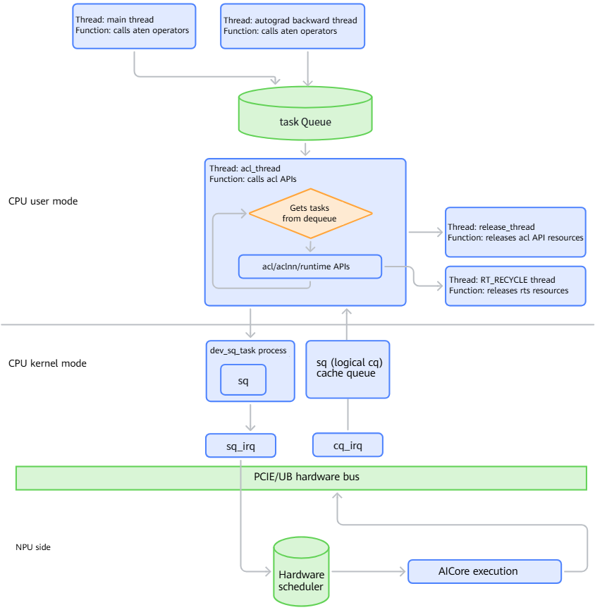
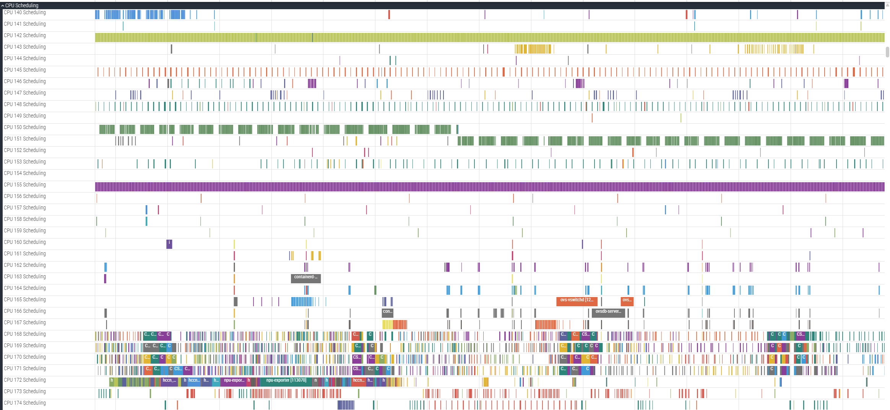
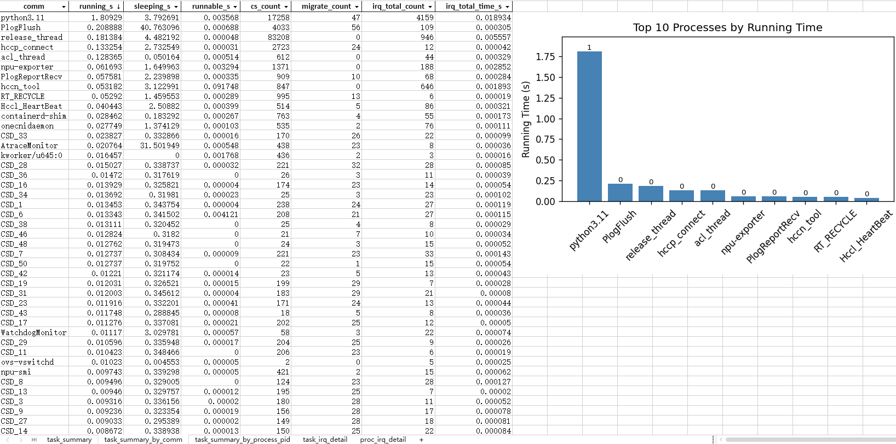

# Frequent CPU Thread Switching

## Background

A foundation model distributed training task runs on an NPU server cluster with 8 servers and 96 NPU devices. During training, a recurring anomaly was observed: in every training iteration, at least one NPU device consistently experienced excessively long host-side operator dispatch time. This directly caused performance discrepancies among NPU devices in the cluster and consequently resulted in low overall NPU compute utilization. At the same time, the communication links between NPU devices were investigated, and the communication latency metrics for all devices were within the normal range, ruling out communication-layer performance bottlenecks.

In terms of system resource utilization, overall CPU utilization across the server was relatively high. However, further analysis showed that the CPU utilization attributable to actual service computation in user mode was relatively low, while kernel-mode overhead accounted for a significantly higher proportion. This indicated substantial additional system call overhead. After preliminary investigation and narrowing down the possible causes, the anomaly was suspected to be closely related to abnormal CPU thread scheduling.

## Source

Training

## Symptoms

The issue can be reproduced consistently.

1. In the 8-node 96-NPU cluster, we observed a recurring anomaly: in every training iteration, one NPU experienced excessively long Dequeue operation latency on the PyTorch framework side. The maximum latency of this operation reached 7.9 seconds, as shown in the following figure.

   

2. At the same time, we found that no operators were actually executing on the device side during this period. However, the `synchronize` function on the CPU side took an additional 92 ms to return. This directly resulted in 92 ms of ineffective idle waiting on the device side, as shown in the following timeline:

   

3. Further analysis showed that the Dequeue operation had a significant latency issue, and the high-latency occurrences exhibited a clear phase-specific pattern: they occurred frequently, primarily after backpropagation was completed. The maximum latency of a single Dequeue operation reached 5 seconds.

   According to the statistical data, 1 to 2 NPUs consistently exhibited this Dequeue latency anomaly in each training iteration. The latency statistics are shown in the following figure.

   

## Troubleshooting Process

1. The key workflow of PyTorch model training in the NPU scenario was reviewed, as shown in the following figure.

   

   - **Task generation:** The main thread and `autograd` backpropagation thread of each NPU call PyTorch operators to generate the specific computation tasks to be executed.
   - **Queue waiting:** The generated operator tasks enter the task queue at the PyTorch framework layer and wait for scheduling.
   - **Task dispatch:** The `acl_thread` thread dequeues pending operator tasks and calls underlying APIs such as `acl` and `aclnn` to dispatch the tasks.
   - **Cross-device transfer:** The `dev_sq_task` process receives tasks from CPU user mode and transfers them to the NPU device over the PCIe bus.
   - **Task receipt confirmation:** After the NPU hardware successfully receives the task, it triggers the `sq_trigger_irq` interrupt to notify the CPU that the task has been successfully received.
   - **Hardware execution:** The NPU device performs hardware-level task scheduling, and the `aicore` executes the operator computation.
   - **Completion notification:** After an individual operator task is completed, the NPU triggers the `cq_update_irq` interrupt to notify the CPU that the task has been completed.

2. The `perf` tool was used to collect CPU scheduling events and hotspot functions.

   Command:

   ```bash
   perf record -e sched:sched_switch -g -p <PID> sleep 10
   perf stat -e context-switches,cpu-migrations -p <PID> sleep 10
   ```

   According to the results, thread scheduling overhead accounted for a relatively large proportion of total CPU time, exceeding 20%.

3. The [ftrace_tools](https://gitcode.com/Ascend/msinsight/tree/master/scripts/ftrace_tools) provided by MindStudio were used to collect CPU scheduling events. The results are shown in the following figure.

   

   The `ftrace` analysis and diagnostic tool was then used to aggregate the data into a table.

   

   The analysis showed that thread switching and preemption events accounted for a relatively high proportion, indicating an apparent CPU thread scheduling bottleneck. Frequent involuntary context switches increased kernel-mode CPU consumption and reduced the amount of CPU time originally available for computation. This further increased the latency incurred while the NPU waited for the CPU to complete data preparation, resulting in a typical "CPU slowing down the NPU" performance bottleneck.

## Root Cause

A large number of background threads unrelated to model training were running on the system. These threads contended with the operator dispatch threads for CPU resources, directly causing frequent involuntary context switches on the operator dispatch threads. CPU core binding can be used to mitigate this issue.

1. **Identify high-load threads:** Sort processes and threads by execution time to identify those with long runtime and high CPU resource consumption, which should be prioritized for CPU core binding.

2. **Recommended CPU core binding for key threads:** Bind NPU-critical-path threads to dedicated CPU cores to reduce context switching and cross-core migration overhead. The threads recommended for priority CPU core binding include:

   - `python3.11`: main process for each NPU
   - `release_thread`: resource release thread
   - `acl_thread`: operator dispatch thread
   - `hccp_connect`: inter-node communication thread

3. **Precautions for binding the main process to CPU cores:** `python3.11`, as the main process, passes its CPU affinity to all child threads by default. If the main process is bound to only a single CPU core, all its child threads will be restricted to that core, resulting in severe resource contention. Therefore, the main process and its child threads should be assigned to a range of consecutive CPU cores.

4. **Isolate interfering processes:** A large number of CSD threads were observed to undergo frequent context switches. It was confirmed that these threads were child threads of `dpc` (the distributed file sharing system). The [automated CPU core binding](https://gitcode.com/Ascend/msprof/tree/master/misc/host_analyzer) tool provided by MindStudio was used to bind the `dpc` process and the training process to different CPU core ranges, thereby isolating their resources and preventing mutual interference caused by resource contention.

## Troubleshooting Methodology Summary

1. **Analyze symptoms at a high level (identify the bottleneck layer):**

   - Start with the symptom at the application layer (excessively long dequeue latency) to confirm that the issue exists and can be consistently reproduced.
   - Further break down CPU utilization into user-mode and kernel-mode utilization. The high proportion of kernel-mode utilization narrowed down the investigation to abnormal CPU scheduling.

2. **Review the application workflow (identify the critical path):**

   - Review the end-to-end workflow from operator generation to hardware execution in the NPU training scenario (main thread/`autograd` thread → task queue → `acl_thread` dispatch → PCIe transfer → NPU execution) and identify dequeue as a core operation on the critical path.

3. **Collect quantitative evidence using tools (quantify scheduling overhead):**

   - Use `perf` to collect CPU scheduling events (`sched:sched_switch`) and gather statistics on context switches (`context-switches` and `cpu-migrations`) to quantitatively confirm that thread scheduling overhead accounts for more than 20% of total CPU time.
   - Use `ftrace_tools` to collect CPU scheduling events and combine the results with the diagnostic tool to aggregate the raw trace data into a table. The high proportion of thread switching and preemption events confirmed the CPU thread scheduling bottleneck.

4. **Verify the root cause (propose an optimization solution):**

   - After identifying the root cause as frequent involuntary context switches caused by background threads contending for CPU resources, propose a CPU core binding solution and provide a list of specific threads to bind, along with precautions such as the CPU core range for the main process and isolation of interfering processes.

## Improvement Suggestions for the Tools

1. **Enhance the automated analysis capabilities of `ftrace_tools`:**

   - Currently, `ftrace_tools` primarily provide raw scheduling event collection and basic statistics, while manual analysis of trace data is still required to identify bottlenecks. It is recommended to add an automated analysis engine that can automatically identify the following patterns:
     - Automatically detect "threads that are frequently switched out" and their corresponding "preempting threads," and output the top-N preemption relationship pairs.
     - Automatically calculate the ratio of voluntary to involuntary context switches for each thread and flag abnormal threads.
     - Provide a "scheduling latency hotspot" timeline view that highlights periods during which critical threads, such as `acl_thread`, do not obtain CPU time for an extended period.

2. **Develop an auxiliary decision-making tool for CPU core binding optimization:**

   - It is recommended to develop an auxiliary tool that can automatically generate CPU core binding recommendations based on the collected scheduling data.

3. **Provide integrated framework- and system-level trace capabilities:**

   - Currently, `perf` and `ftrace` focus on the system layer (kernel scheduling), while PyTorch Profiler focuses on the framework layer (operator latency). There is no direct correlation between the two. It is advisable to add a "framework-system integrated trace" feature to MindStudio Profiler:
     - At key PyTorch operations such as dequeue and `synchronize`, automatically add instrumentation points. When the latency of these operations exceeds a threshold, automatically trigger collection of system-level scheduling events within the corresponding time window.
     - Overlay framework-level events and system-level scheduling events in the **Profiler** timeline so that users can directly determine whether the long dequeue latency is caused by `acl_thread` being scheduled out.
